# Module 1: 写入引擎 (WAL + Cache + TSM 压缩) - 深度审计报告

> **小白导读**: 想象你开了一家快递站。每天有大量包裹（数据）涌入。
> - **WAL** = 快递单存根（Cache 写入后落盘，返回前等待同步，防丢件）
> - **Cache** = 暂存区（包裹先放这里，攒够一波再处理）
> - **TSM 文件** = 仓库货架（压缩存放，按编号排列，方便查找）
> - **Compaction** = 仓库整理（把小箱子合并成大箱子，腾出空间）
>
> 数据的生命周期：**收到包裹 → Shard 校验并登记字段 → 暂存(Cache) → 写 WAL 并等待 sync → 入库(TSM) → 整理(Compaction)**

## 1. 写入全链路总览

### 1.1 从 HTTP 请求到磁盘的完整路径

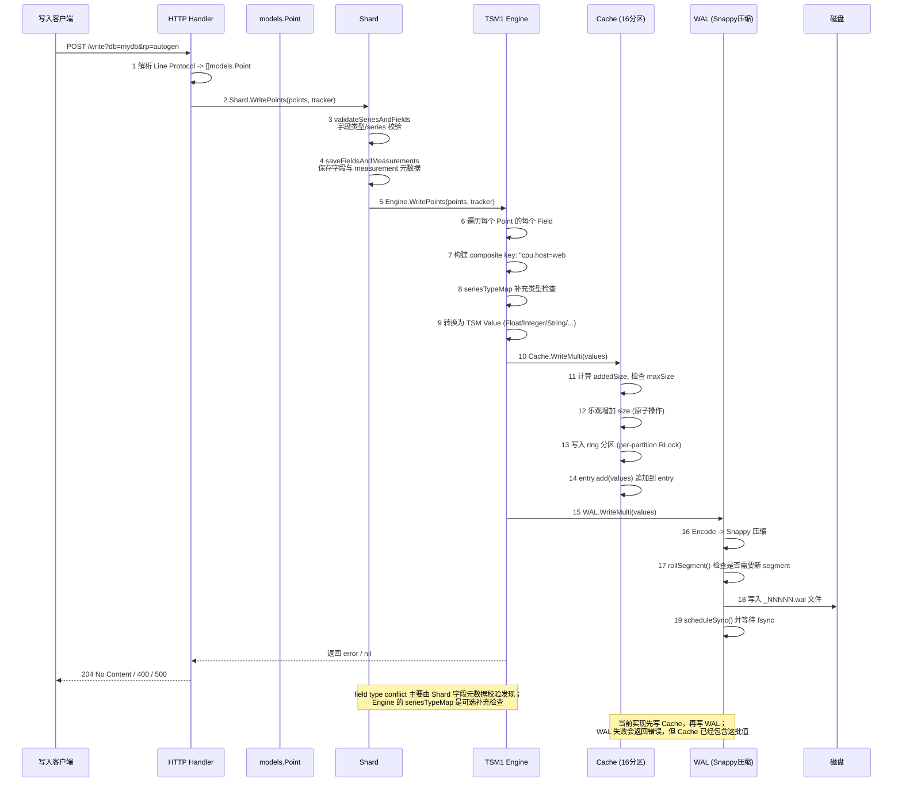

### 1.2 每一步的代码实现

#### 步骤 1: Line Protocol 解析

```go
// models/points.go:1630 — MakeKey
func MakeKey(name []byte, tags Tags) []byte {
    // 格式: "measurement,tag1=val1,tag2=val2"
    // tags 按字典序排列
}

// models/points.go:1469 — Point.Key
func (p *point) Key() []byte {
    return p.key  // 已解析好的 key
}
```

**Line Protocol 格式**: `measurement,tag1=val1,tag2=val2 field1=1.0,field2="hello" 1234567890000000000`

> **具体案例**: 写入一条 CPU 数据
>
> ```
> curl -X POST 'http://localhost:8086/write?db=mydb' \
>   -d 'cpu,host=web01,region=us-east value=87.3 1704067200000000000'
> ```
>
> 这条数据经过以下步骤：
>
> ```
> 1. HTTP 解析: measurement="cpu", tags={host="web01", region="us-east"}
>    fields={value=87.3}, timestamp=1704067200000000000 (2024-01-01 00:00:00 UTC)
>
> 2. Key 构建: "cpu,host=web01,region=us-east#!~#value"
>    (注意: tags 按字典序排列, 用 #!~# 分隔 key 和 field)
>
> 3. Shard 校验: `validateSeriesAndFields` 检查 series、field 元数据与字段类型
>    - 如果是新字段 → 放入待保存列表
>    - 如果已存在且类型匹配 → 继续
>    - 如果字段类型冲突 → 报错 "field type conflict"
>
> 4. Shard 保存元数据: `saveFieldsAndMeasurements(fieldsToCreate)`
>
> 5. Engine 补充检查与转换: `seriesTypeMap` 可选检查后，`NewFloatValue(1704067200000000000, 87.3)`
>
> 6. 写入 Cache: xxhash(key) % 16 → 分区 7 → entry.add(value)
>
> 7. 写入 WAL: 编码 → Snappy 压缩 → 写入 _00001.wal → 等待 fsync
> ```

**models.Point 内部结构**:

```go
// models/points.go:221 — point (未导出)
type point struct {
    time          time.Time
    key           []byte                    // "measurement,tag1=val1,tag2=val2"
    fields        []byte                    // "field1=1.0,field2=\"hello\""
    ts            []byte                    // "1234567890000000000" (字符串)
    cachedFields  map[string]interface{}    // 缓存解析后的 fields
    cachedName     string
    cachedTags     Tags
    it             fieldIterator
}
```

#### 步骤 3-5: Shard.WritePoints — 字段元数据校验与保存

```go
// tsdb/shard.go — WritePoints
func (s *Shard) WritePoints(points []models.Point, tracker StatsTracker) error {
    points, fieldsToCreate, err := s.validateSeriesAndFields(points, tracker)
    if err != nil {
        if _, ok := err.(PartialWriteError); !ok {
            return err
        }
        // 部分写失败时，丢弃冲突点，继续写入剩余 points。
        writeError = err
    }

    if numFieldsCreated, err := s.saveFieldsAndMeasurements(fieldsToCreate); err != nil {
        return err
    } else {
        atomic.AddInt64(&s.stats.FieldsCreated, int64(numFieldsCreated))
    }

    if err := engine.WritePoints(points, engineTracker); err != nil {
        return fmt.Errorf("engine: %w", err)
    }
    return writeError
}
```

`field type conflict` 的主路径在 Shard 层：`validateSeriesAndFields` 会对照已知字段元数据，发现同一个 measurement/field 的类型变化时生成错误；`saveFieldsAndMeasurements` 再把新增字段和 measurement 元数据写入索引/元数据结构。`Engine.WritePoints` 里的 `seriesTypeMap` 只在启用 `INFLUXDB_SERIES_TYPE_CHECK_ENABLED` 时作为补充检查，防止绕过 Shard 元数据校验或并发路径中出现遗漏。

#### 步骤 6-9: Engine.WritePoints — Point 到 Value 的转换

```go
// tsdb/engine/tsm1/engine.go — WritePoints
func (e *Engine) WritePoints(points []models.Point, tracker tsdb.StatsTracker) error {
    values := make(map[string][]Value, len(points))
    var keyBuf []byte
    var seriesErr error

    for _, p := range points {
        // 步骤 3: 构建 composite key
        keyBuf = append(keyBuf[:0], p.Key()...)           // "cpu,host=web"
        keyBuf = append(keyBuf, keyFieldSeparator...)     // "#!~#"
        baseLen := len(keyBuf)

        iter := p.FieldIterator()  // 零分配的字段迭代器
        t := p.Time().UnixNano()

        // 步骤 4: 遍历每个 field
        for iter.Next() {
            // 构建完整 key: "cpu,host=web#!~#value"
            keyBuf = append(keyBuf[:baseLen], iter.FieldKey()...)

            // 步骤 5: 可选的补充类型冲突检查 (radix.Tree 快速路径)
            // 注意: field type conflict 主要已由 Shard 字段元数据校验处理。
            // seriesTypeMap 是一个功能标志 (feature flag)
            // 仅当环境变量 INFLUXDB_SERIES_TYPE_CHECK_ENABLED 设置时才初始化 (engine.go:297-299)
            // 默认为 nil，此分支不会执行
            if e.seriesTypeMap != nil {
                if v, ok := e.seriesTypeMap.Get(keyBuf); !ok {
                    // Key 不在 map 中: 检查引擎中是否已有此 key 的类型
                    if typ, err := e.Type(keyBuf); err != nil {
                        // 类型未知，可以尝试插入
                    } else if typ != iter.Type() {
                        // 引擎中已有不同类型，冲突
                        seriesErr = tsdb.ErrFieldTypeConflict
                        e.seriesTypeMap.Insert(keyBuf, int(typ))
                        continue
                    }
                    // 尝试插入新类型
                    vv, ok := e.seriesTypeMap.Insert(keyBuf, int(iter.Type()))
                    if !ok || vv != int(iter.Type()) {
                        // 插入失败且已有类型不匹配，冲突
                        seriesErr = tsdb.ErrFieldTypeConflict
                        continue
                    }
                } else if v != int(iter.Type()) {
                    // Key 存在但类型不匹配，冲突
                    seriesErr = tsdb.ErrFieldTypeConflict
                    continue
                }
            }

            // 步骤 6: 转换为 TSM Value
            var v Value
            switch iter.Type() {
            case models.Float:
                fv, err := iter.FloatValue()
                if err != nil { return err }
                v = NewFloatValue(t, fv)
            case models.Integer:
                iv, err := iter.IntegerValue()
                if err != nil { return err }
                v = NewIntegerValue(t, iv)
            case models.Unsigned:
                uv, err := iter.UnsignedValue()
                if err != nil { return err }
                v = NewUnsignedValue(t, uv)
            case models.String:
                v = NewStringValue(t, iter.StringValue())
            case models.Boolean:
                bv, err := iter.BooleanValue()
                if err != nil { return err }
                v = NewBooleanValue(t, bv)
            }

            values[string(keyBuf)] = append(values[string(keyBuf)], v)
        }
    }

    // 步骤 7: 写入 Cache (在写入前获取 e.mu.RLock()，engine.go:1440)
    e.mu.RLock()
    defer e.mu.RUnlock()

    if err := e.Cache.WriteMulti(values); err != nil {
        return err
    }

    // 步骤 12: 写入 WAL；WriteMulti 返回前会等待 WAL sync 完成。
    // 如果 WAL 写入或 sync 失败，函数返回错误，但 Cache 已经写入。
    if e.WALEnabled {
        if _, err := e.WAL.WriteMulti(values); err != nil {
            return err
        }
    }

    return seriesErr
}
```

**Key 构建示例**:

> **小白解释**: InfluxDB 的 key 不是简单的字段名，而是把**表名 + 标签 + 字段名**拼在一起。
> 为什么要用 `#!~#` 分隔符？因为它足够特殊，不会出现在正常数据中，避免歧义。
> 就像你的身份证号：省+市+区+出生日期，每一部分都有固定含义。

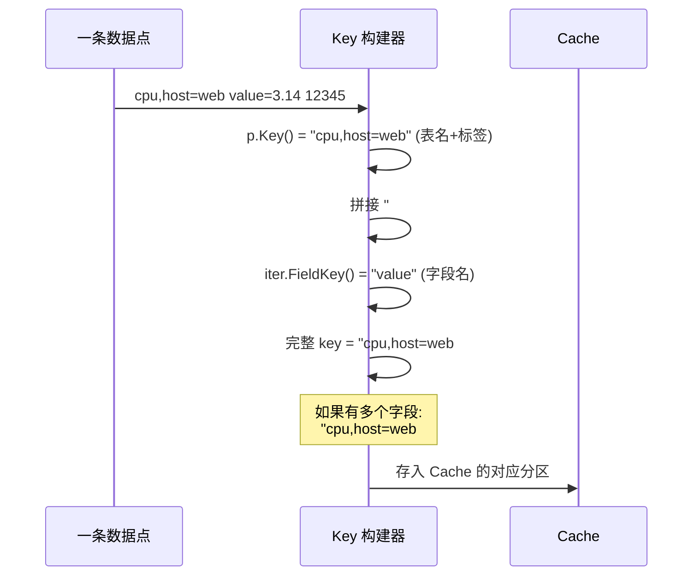

**FieldIterator — 零分配字段遍历**:

```go
// models/points.go:179 — FieldIterator (接口，非结构体)
type FieldIterator interface {
    Next() bool               // 是否还有下一个 field
    FieldKey() []byte         // 当前 field 的 key
    Type() models.FieldType   // 当前 field 的类型
    StringValue() string
    IntegerValue() (int64, error)
    UnsignedValue() (uint64, error)
    BooleanValue() (bool, error)
    FloatValue() (float64, error)
    Reset()
}
```

#### 步骤 7-11: Cache.WriteMulti — 16 分区并发写入

```go
// tsdb/engine/tsm1/cache.go:320 — WriteMulti
func (c *Cache) WriteMulti(values map[string][]Value) error {
    c.init()  // 懒初始化 ring store

    // 步骤 8: 计算总大小，检查限制
    var addedSize uint64
    for _, v := range values {
        addedSize += uint64(Values(v).Size())
    }

    limit := c.maxSize
    n := c.Size() + addedSize  // Size() = size + snapshotSize
    if limit > 0 && n > limit {
        return ErrCacheMemorySizeLimitExceeded(n, limit)
        // 没有驱逐! 直接拒绝写入!
    }

    // 步骤 9: 乐观增加 size (原子操作)
    c.increaseSize(addedSize)

    // 步骤 10: 写入 ring 分区
    c.mu.RLock()
    store := c.store  // 快照 store 引用
    c.mu.RUnlock()

    var werr error
    for k, v := range values {
        newKey, err := store.write([]byte(k), v)
        if err != nil {
            werr = err
            c.decreaseSize(uint64(Values(v).Size()))
        }
    }

    return werr
}
```

**Cache 没有驱逐机制!** 当 `Size() > maxSize` 时，`WriteMulti` 直接返回 `ErrCacheMemorySizeLimitExceeded`。只有通过 `Snapshot()` + `ClearSnapshot()` 才能释放内存。

**Ring 分区写入 — 16 分区哈希环**:

```go
// tsdb/engine/tsm1/ring.go:16 — 最大分区数
const partitions = 16  // ring 支持的最大分区数 (并非实际使用数)

// tsdb/engine/tsm1/cache.go:22 — 实际使用的分区数
const ringShards = 16  // 默认使用 16 个分区

// tsdb/engine/tsm1/ring.go:34 — ring
type ring struct {
    partitions []*partition  // len = n；Cache 默认传入 ringShards=16
}

// tsdb/engine/tsm1/ring.go:86 — getPartition
func (r *ring) getPartition(key []byte) *partition {
    h := xxhash.Sum64(key)
    return r.partitions[h%uint64(len(r.partitions))]
}
```

> **注意**: `ring.go` 中 `const partitions = 16` 定义的是**最大值**（`newring(n)` 校验 n <= 16），
> 实际分区数由 `cache.go:22` 的 `const ringShards = 16` 决定。
> `newring()` 的注释（ring.go:46-50）声称 `n` "must always be a power of 2"，支持的值集为
> `{1, 2, 4, 8, 16}`。源码会同时验证 `n <= 16` 和 `n&(n-1) == 0`，
> 因此 `n=3`、`n=15`、`n=32` 都会失败。Cache 固定使用 16（2 的幂）。

```go
// tsdb/engine/tsm1/ring.go:237 — partition.write
func (p *partition) write(key []byte, values Values) (bool, error) {
    // 热路径: RLock 检查 entry 是否存在
    p.mu.RLock()
    e := p.store[string(key)]
    p.mu.RUnlock()

    if e != nil {
        // entry 已存在: 追加 values
        return false, e.add(values)
    }

    // 冷路径: 升级为写锁 (双重检查)
    p.mu.Lock()
    defer p.mu.Unlock()

    if e = p.store[string(key)]; e != nil {
        return false, e.add(values)  // 其他 goroutine 已创建
    }

    // 创建新 entry
    e, err := newEntryValues(values)
    p.store[string(key)] = e
    return true, nil  // newKey = true
}
```

**entry.add — 追加值（含类型冲突检查）**:

```go
// tsdb/engine/tsm1/cache.go:36 — entry
type entry struct {
    mu     sync.RWMutex
    values Values
    vtype  byte  // BlockFloat64 / BlockInteger / ...
}

// tsdb/engine/tsm1/cache.go:72 — add
func (e *entry) add(values []Value) error {
    // 空值直接返回
    if len(values) == 0 {
        return nil
    }

    // 类型冲突检查：如果 entry 已有类型，新值必须匹配
    if e.vtype != 0 {
        for _, v := range values {
            if e.vtype != valueType(v) {
                return tsdb.ErrFieldTypeConflict
            }
        }
    }

    e.mu.Lock()
    // 如果 entry 当前为空，直接设置（而非追加，避免多余分配）
    if len(e.values) == 0 {
        e.values = values
        e.vtype = valueType(values[0])
        e.mu.Unlock()
        return nil
    }

    // 追加到已有值
    e.values = append(e.values, values...)
    e.mu.Unlock()
    return nil
}
```

> **小白解释**: Cache 就像一个有 16 个抽屉的大柜子。每个 key 通过哈希决定放进哪个抽屉。
> 不同抽屉可以同时操作（并发），但同一个抽屉内要排队（锁）。
> 如果柜子满了（超过 maxSize），直接拒绝新数据，不会丢掉旧数据。

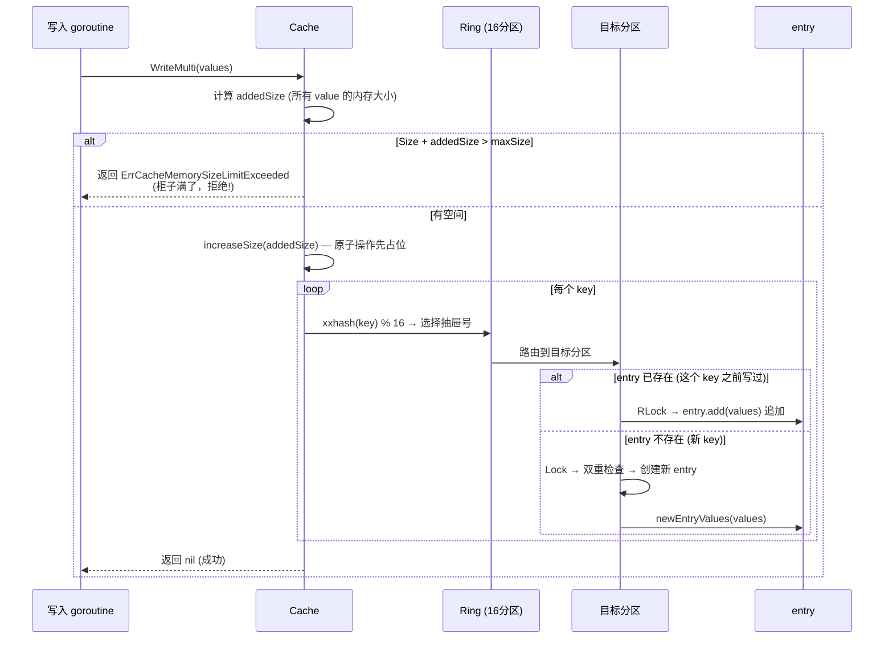

#### 步骤 12-16: WAL.WriteMulti — 持久化到 WAL

```go
// tsdb/engine/tsm1/wal.go:83 — WAL
type WAL struct {
    // goroutines waiting for the next fsync
    syncCount   uint64
    syncWaiters chan chan error

    mu            sync.RWMutex
    lastWriteTime time.Time

    path string

    // write variables
    currentSegmentID     int
    currentSegmentWriter *WALSegmentWriter

    // cache and flush variables
    once    sync.Once
    closing chan struct{}

    syncDelay time.Duration       // fsync 延迟时间 (默认 0 = 立即 fsync)

    SegmentSize int               // segment 文件滚动阈值 (默认 10MB)
    stats       *WALStatistics
    limiter     limiter.Fixed     // 并发写入限制器
}
```

**WAL 写入路径 — writeToLog**:

> **注意**: `writeToLog` 使用 `bytesPool` (pool.LimitedBytes) 从对象池获取编码缓冲区，
> 减少高频写入时的内存分配。当前源码在 `writeToLog` 中没有直接调用
> `l.limiter`; 慢盘下的等待主要由 WAL 写锁、`syncWaiters` 队列和 fsync 完成信号共同形成。

```go
// tsdb/engine/tsm1/wal.go:398 — writeToLog
func (l *WAL) writeToLog(entry WALEntry) (int, error) {
    // 1. 从 bytesPool 获取编码缓冲区 (减少分配)
    bytes := bytesPool.Get(entry.MarshalSize())
    b, err := entry.Encode(bytes)
    if err != nil {
        bytesPool.Put(bytes)
        return -1, err
    }

    // 2. 从 bytesPool 获取压缩缓冲区, Snappy 压缩
    encBuf := bytesPool.Get(snappy.MaxEncodedLen(len(b)))
    compressed := snappy.Encode(encBuf, b)
    bytesPool.Put(bytes)

    // 3. 每个写入者创建自己的 fsync 完成通道
    syncErr := make(chan error)

    segID, err := func() (int, error) {
        // 4. 获取写锁；编码和压缩已在锁外完成
        l.mu.Lock()
        defer l.mu.Unlock()

        // 5. 检查是否正在关闭
        select {
        case <-l.closing:
            return -1, ErrWALClosed
        default:
        }

        // 6. 滚动 segment (如果当前 segment > 10MB)
        if err := l.rollSegment(); err != nil {
            return -1, fmt.Errorf("error rolling WAL segment: %v", err)
        }

        // 7. 写入当前 segment
        if err := l.currentSegmentWriter.Write(entry.Type(), compressed); err != nil {
            return -1, fmt.Errorf("error writing WAL entry: %v", err)
        }

        // 8. 将本写入的等待通道放入 syncWaiters；队列满则写入失败
        select {
        case l.syncWaiters <- syncErr:
        default:
            return -1, fmt.Errorf("error syncing wal")
        }
        l.scheduleSync()

        atomic.StoreInt64(&l.stats.CurrentBytes, int64(l.currentSegmentWriter.size))
        l.lastWriteTime = time.Now().UTC()
        return l.currentSegmentID, nil
    }()

    // 9. 归还压缩缓冲区到 bytesPool
    bytesPool.Put(encBuf)

    if err != nil {
        return segID, err
    }

    // 10. 等待 scheduleSync/sync() 对 syncErr 写入 fsync 结果
    return segID, <-syncErr
}
```

**WAL Segment 文件命名**: `_<NNNNN>.wal` (如 `_00001.wal`, `_00002.wal`)

**Segment 滚动**:

```go
// tsdb/engine/tsm1/wal.go:466 — rollSegment
func (l *WAL) rollSegment() {
    if l.currentSegmentWriter == nil ||
       l.currentSegmentWriter.size > DefaultSegmentSize {  // 10MB
        l.newSegmentFile()
    }
}

// tsdb/engine/tsm1/wal.go:560 — newSegmentFile
func (l *WAL) newSegmentFile() error {
    l.currentSegmentID++
    fileName := filepath.Join(l.path, fmt.Sprintf("%s%05d.%s",
        WALFilePrefix, l.currentSegmentID, WALFileExtension))
    // 关闭旧 writer, 打开新文件
    // ...
}
```

**fsync 批量调度 — 延迟批处理机制**:

> **注意**: `scheduleSync` 并非立即触发 fsync，而是启动一个延迟批处理循环。
> `syncDelay` 字段控制 fsync 的延迟时间：默认值 0 表示每次写入都立即 fsync；
> 非零值（如 100ms）会等待一段时间，将多个写入的 fsync 合并为一次。

```go
// tsdb/engine/tsm1/wal.go:255 — scheduleSync
func (l *WAL) scheduleSync() {
    // CAS: 如果已有 goroutine 在负责 fsync，则直接返回
    // 后续写入者的 syncErr 通道会被加入 syncWaiters 队列
    if !atomic.CompareAndSwapUint64(&l.syncCount, 0, 1) {
        return
    }

    // 启动一个后台 goroutine 负责定期 fsync
    go func() {
        var timerCh <-chan time.Time

        // syncDelay == 0 时使用已关闭的 channel（立即触发）
        // syncDelay > 0 时使用 Ticker 定期触发
        if l.syncDelay == 0 {
            timerChrw := make(chan time.Time)
            close(timerChrw)  // 关闭后读取永远不阻塞
            timerCh = timerChrw
        } else {
            t := time.NewTicker(l.syncDelay)
            defer t.Stop()
            timerCh = t.C
        }

        for {
            select {
            case <-timerCh:
                l.mu.Lock()
                if len(l.syncWaiters) == 0 {
                    // 没有等待者，重置 syncCount，退出循环
                    atomic.StoreUint64(&l.syncCount, 0)
                    l.mu.Unlock()
                    return
                }
                l.sync()  // fsync 并通知所有等待者
                l.mu.Unlock()
            case <-l.closing:
                // WAL 正在关闭，退出
                atomic.StoreUint64(&l.syncCount, 0)
                return
            }
        }
    }()
}
```

**WAL struct 中 `syncDelay` 字段** (`wal.go:101-104`):

```go
// syncDelay 设置 fsync 前的等待时间。默认值 0 表示每次写入都立即 fsync。
// 必须在 WAL 打开之前设置非默认值。
syncDelay time.Duration
```

**fsync 批量机制工作流程**:
1. 第一个写入者通过 CAS 成为 "fsync 负责人"，启动后台 goroutine
2. 后续写入者将自己的 `syncErr` 通道放入 `syncWaiters` 队列（容量 1024）
3. 后台 goroutine 根据 `syncDelay` 定期检查 `syncWaiters`：
   - 如果有等待者：执行 `sync()`（fsync 当前 segment + 通知所有等待者）
   - 如果没有等待者：重置 `syncCount`，退出循环（下次写入会重新启动）
4. 收到 `l.closing` 信号时退出

**WriteWALEntry 二进制格式**:

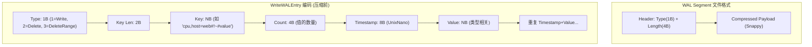

**值类型的二进制编码**:

> **重要区分**: WAL entry 中的 Type 字节表示**每个 key 的值类型** (float64EntryType=1, integerEntryType=2, booleanEntryType=3, stringEntryType=4, unsignedEntryType=5)，
> 这与 TSM block 类型常量 (BlockFloat64=0, BlockInteger=1, BlockBoolean=2, BlockString=3, BlockUnsigned=4) 是**不同的编号系统**。
>
> | 类型 | WAL Type 字节 | TSM Block Type |
> |------|--------------|----------------|
> | Float | 1 (float64EntryType) | 0 (BlockFloat64) |
> | Integer | 2 (integerEntryType) | 1 (BlockInteger) |
> | Boolean | 3 (booleanEntryType) | 2 (BlockBoolean) |
> | String | 4 (stringEntryType) | 3 (BlockString) |
> | Unsigned | 5 (unsignedEntryType) | 4 (BlockUnsigned) |

| 类型 | WAL Type 字节 | Timestamp | Value | 每个值大小 |
|------|--------------|-----------|-------|-----------|
| Float | 1 | 8B | 8B (float64) | 16B |
| Integer | 2 | 8B | 8B (int64) | 16B |
| Boolean | 3 | 8B | 1B (bool) | 9B |
| String | 4 | 8B | 4B(len) + NB | 12+N B |
| Unsigned | 5 | 8B | 8B (uint64) | 16B |

#### 步骤 12b: Snapshot 触发条件

```go
// tsdb/engine/tsm1/engine.go:2121 — ShouldCompactCache
func (e *Engine) ShouldCompactCache(t time.Time) bool {
    sz := e.Cache.Size()

    // 条件 1: Cache 为空则不压缩
    if sz == 0 {
        return false
    }
    // 条件 2: Cache 大小超过阈值 (默认 25MB)
    if sz > e.CacheFlushMemorySizeThreshold {
        return true
    }
    // 条件 3: 写入冷超过时长 (默认 1s)
    // 注意: 使用 e.Cache.LastWriteTime() 而非 e.lastWriteTime
    return t.Sub(e.Cache.LastWriteTime()) > e.CacheFlushWriteColdDuration
}
```

**Snapshot 流程**:

```go
// tsdb/engine/tsm1/cache.go:376 — Snapshot
func (c *Cache) Snapshot() (*Cache, error) {
    c.mu.Lock()
    defer c.mu.Unlock()

    // 防止并发 snapshot
    if c.snapshotting {
        return nil, ErrSnapshotInProgress
    }
    c.snapshotting = true

    // 如果上次 snapshot 失败且有数据，返回旧 snapshot 重试
    if c.snapshot.Size() > 0 {
        return c.snapshot, nil
    }

    // O(1) 交换: live store ↔ snapshot store
    c.snapshot.store, c.store = c.store, c.snapshot.store

    // 保存 snapshot 大小，重置 live store
    snapshotSize := c.Size()
    atomic.StoreUint64(&c.snapshot.size, snapshotSize)  // snapshot cache 大小
    atomic.StoreUint64(&c.snapshotSize, snapshotSize)   // live cache 的 snapshotSize

    c.store.reset()
    atomic.StoreUint64(&c.size, 0)  // 原子操作重置 live cache 大小

    return c.snapshot, nil
}
```

> **小白解释**: Snapshot 就像"拍照"——把当前暂存区的数据冻结起来，然后清空暂存区继续接新货。
> 关键技巧：不是复制数据，而是直接**交换两个柜子的指针**（O(1) 操作，极快）。

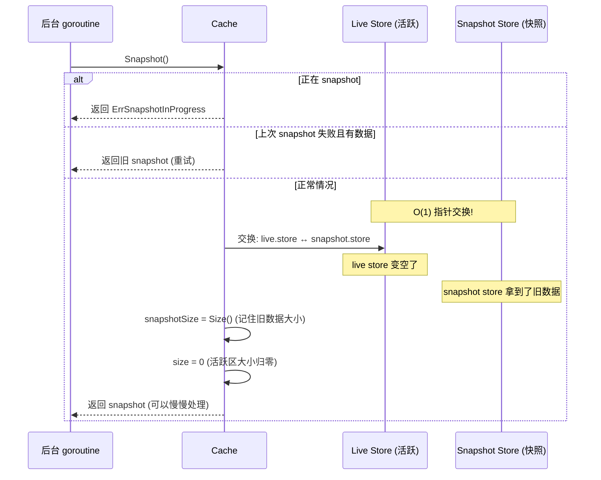

**Snapshot 后的写入流程**:

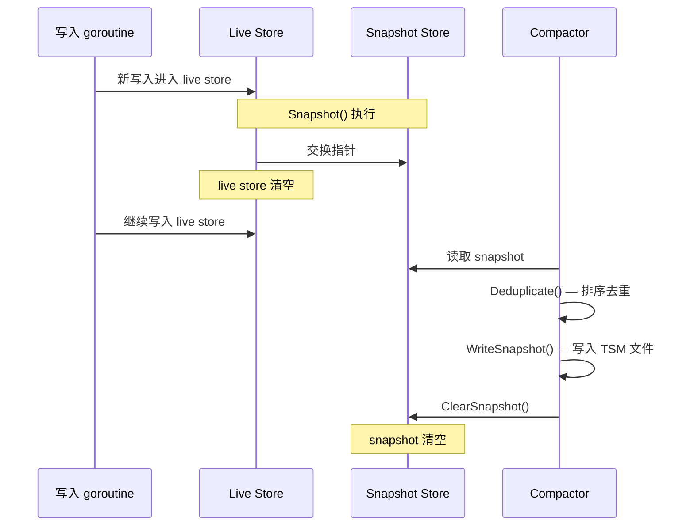

## 2. Value 类型系统

### 2.1 Value 接口

```go
// tsdb/engine/tsm1/encoding.go:96 — Value 接口
type Value interface {
    UnixNano() int64      // 时间戳 (纳秒)
    Value() interface{}   // 值 (float64/int64/uint64/string/bool)
    Size() int            // 内存大小 (字节)
    String() string       // 字符串表示
    internalOnly()        // 未导出方法 — 禁止包外实现
}
```

### 2.2 五种具体类型

```go
// tsdb/engine/tsm1/encoding.go:322 — FloatValue
type FloatValue struct {
    unixnano int64    // 8 字节
    value    float64  // 8 字节
}  // Size() = 16

// tsdb/engine/tsm1/encoding.go:584 — IntegerValue
type IntegerValue struct {
    unixnano int64  // 8 字节
    value    int64  // 8 字节
}  // Size() = 16

// tsdb/engine/tsm1/encoding.go:703 — UnsignedValue
type UnsignedValue struct {
    unixnano int64   // 8 字节
    value    uint64  // 8 字节
}  // Size() = 16

// tsdb/engine/tsm1/encoding.go:457 — BooleanValue
type BooleanValue struct {
    unixnano int64  // 8 字节
    value    bool   // 1 字节
}  // Size() = 9

// tsdb/engine/tsm1/encoding.go:822 — StringValue
type StringValue struct {
    unixnano int64   // 8 字节
    value    string  // len(value) 字节
}  // Size() = 8 + len(value)
```

**Block 类型常量**:

```go
// tsdb/engine/tsm1/encoding.go:14-28
BlockFloat64  = byte(0)
BlockInteger  = byte(1)
BlockBoolean  = byte(2)
BlockString   = byte(3)
BlockUnsigned = byte(4)
```

### 2.3 Values 集合操作

```go
// tsdb/engine/tsm1/encoding.gen.go:26 — Values
type Values []Value

// tsdb/engine/tsm1/encoding.gen.go:36 — Size
func (a Values) Size() int {
    sz := 0
    for _, v := range a {
        sz += v.Size()
    }
    return sz
}

// tsdb/engine/tsm1/encoding.gen.go:70 — Deduplicate
func (a Values) Deduplicate() Values {
    // 排序 (按时间戳)
    // 去重: 相同时间戳保留最后一个
    // 返回新切片
}
```

## 3. TSM 文件格式

> **小白解释**: TSM 文件就像一本书：
> - **Header** = 封面（写明书名和版本）
> - **Blocks** = 正文（每一页是一个数据块，记录了某个 key 的一段时间的数据）
> - **Index** = 目录（记录每个 key 在哪一页、时间范围是什么）
> - **Footer** = 书签（告诉你目录在第几页）
>
> 查找数据时：先看书签(Footer) → 翻到目录(Index) → 找到 key → 翻到对应页(Block) → 读取数据

### 3.1 文件整体布局

```
┌────────┬────────────────────────────────────┬─────────────┬──────────────┐
│ Header │               Blocks               │    Index    │    Footer    │
│5 bytes │              N bytes               │   N bytes   │   8 bytes    │
└────────┴────────────────────────────────────┴─────────────┴──────────────┘
```

### 3.2 Header (5 字节)

```
┌───────────────────┐
│  Magic   │ Version│
│ 4 bytes  │ 1 byte │
└───────────────────┘
```

```go
// tsdb/engine/tsm1/writer.go:81 — MagicNumber
MagicNumber uint32 = 0x16D116D1
Version     byte   = 1
```

### 3.3 Block 格式

```
┌─────────┬─────────────────────────────────────┐
│  CRC32  │              Data                   │
│ 4 bytes │             N bytes                 │
└─────────┴─────────────────────────────────────┘
```

**Data 内部格式 (packBlock)**:

```
┌──────┬─────────────────┬──────────────┬─────────────────┐
│ Type │ Timestamp Len   │  Timestamps  │     Values      │
│1 byte│ 1-10 bytes(uvi) │  N bytes     │    M bytes      │
└──────┴─────────────────┴──────────────┴─────────────────┘
```

```go
// tsdb/engine/tsm1/encoding.go:943 — packBlock
func packBlock(buf []byte, typ byte, ts []byte, values []byte) []byte {
    b[0] = typ                           // 字节 0: block 类型
    i := binary.PutUvarint(b[1:], uint64(len(ts)))  // varint: 时间戳块长度
    copy(b[i:], ts)                      // 时间戳压缩字节
    copy(b[i+len(ts):], values)          // 值压缩字节 (无长度前缀)
    return b[:i+len(ts)+len(values)]
}
```

### 3.4 Index 格式

**每个 key 的索引条目**:

```
┌─────────┬─────────┬──────┬───────┬─────────┬─────────┬────────┬────────┐
│ Key Len │   Key   │ Type │ Count │Min Time │Max Time │ Offset │  Size  │
│ 2 bytes │ N bytes │1 byte│2 bytes│ 8 bytes │ 8 bytes │8 bytes │4 bytes │
└─────────┴─────────┴──────┴───────┴─────────┴─────────┴────────┴────────┘
```

**IndexEntry (28 字节)**:

```go
// tsdb/engine/tsm1/writer.go:179 — IndexEntry
type IndexEntry struct {
    MinTime int64   // 8 字节
    MaxTime int64   // 8 字节
    Offset  int64   // 8 字节
    Size    uint32  // 4 字节
}  // 总计: 28 字节
```

### 3.5 Footer (8 字节)

```
┌─────────┐
│Index Ofs│
│ 8 bytes │
└─────────┘
```

指向 Index 的起始位置。

> **注意**: `writer.go:8` 的文件头注释声称 Footer 是 "4 bytes"，这是**错误的**。
> 实际 `WriteIndex()` 在 `writer.go:726-731` 使用 `binary.BigEndian.PutUint64` 写入 8 字节的 uint64。
> Footer 实际大小为 **8 字节**。

### 3.6 压缩算法

> **小白解释**: 压缩就像打包行李——把散乱的衣服卷起来，塞进更小的空间。
> 不同类型的数据用不同的压缩方式，就像衣服、鞋子、液体要用不同的打包方法：
> - **Float (浮点数)**: 用 Gorilla XOR 编码——连续相似的数字只记录差异
> - **Integer (整数)**: 用 Delta + Simple8b——记录差值，小数字占更少空间
> - **Timestamp (时间戳)**: 用 Delta + 缩放——时间间隔通常固定，差值很小
> - **Boolean (布尔值)**: 位打包——8 个 true/false 只占 1 字节
> - **String (字符串)**: Snappy 压缩——通用压缩算法

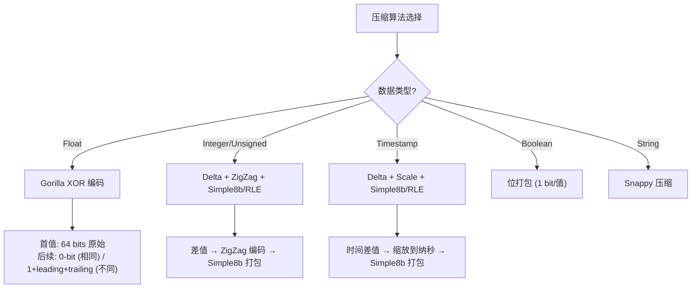

**Gorilla XOR 编码示例**:

> **小白解释**: Gorilla 编码的核心思想是——相邻的浮点数通常很相似。
> 比如温度传感器每秒报一次：25.1, 25.1, 25.2, 25.1... 大部分值几乎一样。
> 所以：第一个值完整记录(64位)，后面的值只记录和前一个的**差异部分**。
> 如果完全相同，只用 1 个 bit (0)；如果不同，记录差异的前导零和有效位。

```
输入: [1.0, 1.0, 2.0]

值 1.0 (首值): 完整记录 64 bits
  → 0011111111110000000000000000000000000000000000000000000000000000

值 1.0 (第二个): 和前一个完全相同
  XOR = 1.0 XOR 1.0 = 0 (全零)
  → 只写 1 bit: 0

值 2.0 (第三个): 和前一个不同
  XOR = 2.0 XOR 1.0 = 0x3FF0000000000000 (不为零)
  → 写 1 bit (标记不同) + 5 bits (前导零数) + 6 bits (有效位数) + 有效位
  → 大约 20 bits

总计: 64 + 1 + ~20 = ~85 bits (原始 3×64=192 bits，压缩率 44%!)
```

## 4. TSM Writer — 写入 TSM 文件

### 4.1 tsmWriter.Write — 逐步写入

```go
// tsdb/engine/tsm1/writer.go:592 — tsmWriter.Write
func (t *tsmWriter) Write(key []byte, values Values) error {
    // 1. 验证 key 长度
    if len(key) > maxKeyLength { return fmt.Errorf("key too long") }
    if len(values) == 0 { return nil }

    // 2. 写入 header (首次)
    if t.n == 0 {
        var buf [5]byte
        binary.BigEndian.PutUint32(buf[:4], MagicNumber)
        buf[4] = Version
        t.w.Write(buf[:])
    }

    // 3. 编码 values 为 block，并从编码后的 block 读取类型
    block, err := values.Encode(nil)
    if err != nil {
        return err
    }
    blockType, err := BlockType(block)
    if err != nil {
        return err
    }

    // 4. 计算 CRC32
    var checksum [crc32.Size]byte
    binary.BigEndian.PutUint32(checksum[:], crc32.ChecksumIEEE(block))

    // 5. 写入 block: CRC32 + Data
    if _, err := t.w.Write(checksum[:]); err != nil {
        return err
    }
    n, err := t.w.Write(block)
    if err != nil {
        return err
    }
    n += len(checksum)

    // 6. 记录到索引
    t.index.Add(key, blockType,
        values[0].UnixNano(),           // MinTime
        values[len(values)-1].UnixNano(), // MaxTime
        t.n,                            // Offset
        uint32(n))                      // Size

    // 7. 更新偏移量
    t.n += int64(n)
    return nil
}
```

### 4.2 tsmWriter.WriteIndex — 写入索引

```go
// tsdb/engine/tsm1/writer.go:708 — WriteIndex
func (t *tsmWriter) WriteIndex() error {
    // 1. 记录当前偏移量 (Index 起始位置)
    indexPos := t.n

    // 2. 写入所有 key 的索引
    t.index.WriteTo(t.w)

    // 3. 写入 Footer: 8 字节 Index 偏移量
    var buf [8]byte
    binary.BigEndian.PutUint64(buf[:], uint64(indexPos))
    t.w.Write(buf[:])
}
```

### 4.3 directIndex.Add — 索引构建

```go
// tsdb/engine/tsm1/writer.go:273 — directIndex.Add
func (d *directIndex) Add(key []byte, blockType byte, minTime, maxTime int64,
    offset int64, size uint32) {

    // 第一个 key: 初始化
    if len(d.key) == 0 {
        d.key = key
        d.indexEntries = &indexEntries{}
        d.indexEntries.Type = blockType
        d.indexEntries.entries = append(d.indexEntries.entries, IndexEntry{...})
        d.keyCount++
        return
    }

    // 使用 bytes.Compare 进行三路比较 (而非 bytes.Equal)
    cmp := bytes.Compare(d.key, key)
    if cmp == 0 {
        // 同一个 key: 追加 IndexEntry
        d.indexEntries.entries = append(d.indexEntries.entries, IndexEntry{...})
    } else if cmp < 0 {
        // 新 key (按字典序更大): 刷新旧 key 的索引数据
        d.flush(d.w)
        d.key = key
        d.indexEntries.Type = blockType
        d.indexEntries.entries = append(d.indexEntries.entries, IndexEntry{...})
        d.keyCount++
    } else {
        // key 乱序: 直接 panic
        panic(fmt.Sprintf("keys must be added in sorted order: %s < %s",
            string(key), string(d.key)))
    }
}
```

`directIndex` 不拷贝 `key`，而是直接保存传入的 `[]byte` 引用；调用方必须保证该 key
在索引 entry flush 前内容稳定。这个约束也解释了为什么 TSM 写入必须按 key 单调递增。

**directIndex.flush — 写入一个 key 的索引**:

```go
// tsdb/engine/tsm1/writer.go — flush
// 数据结构: d.key (当前 key), d.indexEntries (当前 key 的所有 IndexEntry)
func (d *directIndex) flush(w io.Writer) {
    // 1. 写入 2 字节 key 长度 + key 字节
    binary.BigEndian.PutUint16(buf, uint16(len(d.key)))
    w.Write(d.key)

    // 2. 写入 1 字节 type + 2 字节 count
    w.WriteByte(d.indexEntries.Type)
    binary.BigEndian.PutUint16(buf, uint16(len(d.indexEntries.entries)))

    // 3. 写入每个 IndexEntry (28 字节)
    d.indexEntries.WriteTo(w)
}
```

## 5. 压缩算法详解

### 5.1 Float: Gorilla XOR 编码

```go
// tsdb/engine/tsm1/float.go:29 — FloatEncoder
type FloatEncoder struct {
    val   float64
    err   error

    leading  uint64   // 注意: 是 uint64, 不是 uint8
    trailing uint64   // 注意: 是 uint64, 不是 uint8

    buf      bytes.Buffer
    bw       *bitstream.BitWriter

    first    bool     // true 表示下一个写入的是首值
    finished bool
}
```

```go
// tsdb/engine/tsm1/float.go:87 — Write
func (s *FloatEncoder) Write(v float64) {
    // NaN 只允许由 Flush() 在 finished=true 后作为结束 sentinel 写入；
    // 用户值 NaN 会记录错误并返回。
    if math.IsNaN(v) && !s.finished {
        s.err = fmt.Errorf("unsupported value: NaN")
        return
    }

    if s.first {
        // 首值: 原始 64 bits
        s.val = v
        s.first = false
        s.bw.WriteBits(math.Float64bits(v), 64)
        return
    }

    // 后续值: XOR
    vDelta := math.Float64bits(v) ^ math.Float64bits(s.val)

    if vDelta == 0 {
        // 情况1: 相同值 → 写入 0-bit
        s.bw.WriteBit(bitstream.Zero)
    } else {
        s.bw.WriteBit(bitstream.One)

        leading := uint64(bits.LeadingZeros64(vDelta))
        trailing := uint64(bits.TrailingZeros64(vDelta))

        // 源码直接按 5 位掩码保留低 5 位；原始 leading==32 会变成 0。
        // 后面的 leading>=32 分支在当前顺序下不可达，属于遗留防御代码。
        leading &= 0x1F
        if leading >= 32 { leading = 31 }
        // trailing 的计算: significant = 64 - leading - trailing
        // 因此 trailing = 64 - leading - meaningful_bits
        // trailing 不单独存储，而是通过 significant bits 数量隐式表达

        // 情况2: XOR!=0 且 leading/trailing 可复用
        if s.leading != ^uint64(0) && leading >= s.leading && trailing >= s.trailing {
            s.bw.WriteBit(bitstream.Zero)  // 复用已有 leading/trailing
            significant := 64 - s.leading - s.trailing
            s.bw.WriteBits(vDelta>>s.trailing, significant)
        } else {
            // 情况3: XOR!=0 且需要新的 leading/trailing
            s.leading, s.trailing = leading, trailing
            s.bw.WriteBit(bitstream.One)   // 标记新的 leading/trailing
            s.bw.WriteBits(leading, 5)
            significant := 64 - leading - trailing
            // significant==64 时写入 0，解码端按 Gorilla 规则还原为 64
            s.bw.WriteBits(significant, 6)
            s.bw.WriteBits(vDelta>>trailing, significant)
        }
    }

    s.val = v
}
```

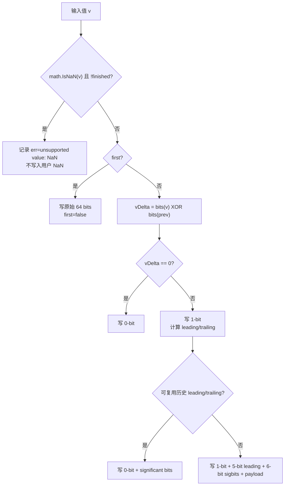

> **具体案例**: 用户写入 `[1.0, NaN]` 时，第二个值不会被编码，`e.err`
> 记录 `unsupported value: NaN`。`Flush()` 收尾时设置 `finished=true`，
> 然后调用 `Write(math.NaN())` 写入内部 NaN sentinel；`Bytes()` 只返回
> 当前 buffer 和 error。

### 5.2 Integer: Delta + ZigZag + Simple8b

```go
// tsdb/engine/tsm1/int.go:40 — IntegerEncoder
type IntegerEncoder struct {
    prev   int64
    rle    bool      // 是否可以使用游程编码 (RLE)
    values []uint64  // ZigZag 编码后的差值
    // 注意: 没有 enc *simple8b.Encoder 字段
    // simple8b 编码在 Bytes() 方法中按需创建
}
```

```go
// tsdb/engine/tsm1/int.go:65 — Write
func (e *IntegerEncoder) Write(v int64) {
    // 计算差值
    delta := v - e.prev
    e.prev = v

    // ZigZag 编码: 有符号 → 无符号
    // -1 → 1, 0 → 0, 1 → 2, -2 → 3, 2 → 4, ...
    zigzag := (delta << 1) ^ (delta >> 63)

    e.values = append(e.values, zigzag)
}
```


### 5.3 Timestamp: Delta + Scale + Simple8b

```go
// tsdb/engine/tsm1/timestamp.go:59 — encoder
type encoder struct {
    ts    []uint64           // 原始时间戳 (Write 时追加)
    bytes []byte             // 编码输出缓冲区
    enc   *simple8b.Encoder  // simple8b 编码器
}
```

```go
// tsdb/engine/tsm1/timestamp.go:85 — reduce
func (e *encoder) reduce() (max, divisor uint64, rle bool, deltas []uint64) {
    // 1. 差分编码: deltas[i] = ts[i] - ts[i-1]
    // 2. 计算最大值 max 和 10 的幂次缩放因子 divisor
    //    divisor 从 1e12 开始，逐步除以 10 直到找到所有差值的公约数
    //    例如: [0, 1000000000, 2000000000, 3000000000] → divisor=1e9 → [0, 1, 2, 3]
    // 3. 检测是否可以 RLE (所有差值相等)
    return
}
```

### 5.4 Boolean: 位打包

每个 boolean 值只占 1 bit。8 个 boolean 值打包成 1 个字节。

### 5.5 String: Snappy 压缩

字符串直接使用 Snappy 压缩（不使用差值编码）。

## 6. Cache Snapshot → TSM 写入

### 6.1 WriteSnapshot — 自适应并发

> **重要**: `Engine.WriteSnapshot()` (engine.go:1957-2014) 在执行 `Cache.Snapshot()` **之前**，
> 会先调用 `e.WAL.CloseSegment()` 关闭当前 WAL segment，然后调用 `e.WAL.ClosedSegments()`
> 获取已关闭的 segment 文件列表。这确保了 WAL 和 Cache 的一致性快照。
>
> ```go
> // engine.go:1920-1941 — WriteSnapshot 内部流程
> e.mu.Lock()
> defer e.mu.Unlock()
>
> // 1. 先关闭当前 WAL segment
> if err = e.WAL.CloseSegment(); err != nil { return }
>
> // 2. 获取已关闭的 segment 文件列表
> segments, err = e.WAL.ClosedSegments()
>
> // 3. 再执行 Cache Snapshot
> snapshot, err = e.Cache.Snapshot()
> ```
>
> 之后 `snapshot.Deduplicate()` 排序去重，再调用 `Compactor.WriteSnapshot()` 写入 TSM 文件。
> 写入成功后通过 `WAL.Remove(closedFiles)` 删除已处理的 WAL segment。

```go
// tsdb/engine/tsm1/compact.go:888 — WriteSnapshot
func (c *Compactor) WriteSnapshot(cache *Cache) ([]string, error) {
    // 注意: 使用 cache.Count() 而非 cache.Cardinality()
    card := cache.Count()

    // 根据 series 基数决定是否限流
    throttle := card < 3e6 && c.snapshotLatencies.avg() < 15*time.Second

    // 根据 series 基数选择并发度
    concurrency := card / 2e6
    if concurrency < 1 {
        concurrency = 1
    }

    // 特殊情况: 高基数使用最大并发且不限流
    if card >= 3e6 {
        concurrency = 4
        throttle = false
    }

    // 按 partition 分片，并行写入
    splits := cache.Split(concurrency)
    for i := 0; i < concurrency; i++ {
        go func(sp *Cache) {
            iter := NewCacheKeyIterator(sp, tsdb.DefaultMaxPointsPerBlock, intC)
            files, err := c.writeNewFiles(c.FileStore.NextGeneration(), 0, nil, iter, throttle)
            // ...
        }(splits[i])
    }
}
```

### 6.2 CacheKeyIterator — 从 Cache 到 TSM Block

> **小白解释**: CacheKeyIterator 就像一个"翻译官"——把 Cache 中的内存数据翻译成 TSM 文件格式。
> 先按 key 排序（保证 TSM 文件内部有序），然后每个 key 的数据编码成一个 block。

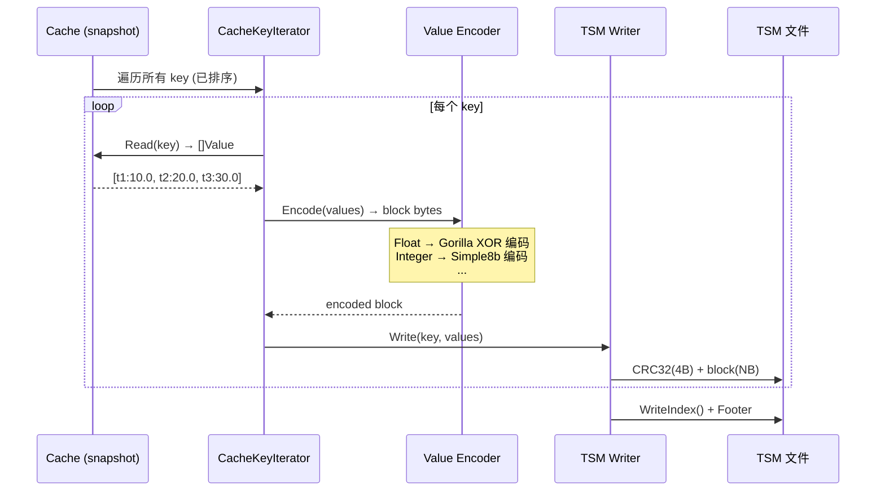

## 7. TSM 文件读取 — 从磁盘到查询结果

### 7.1 mmap 初始化 — 零拷贝映射

TSM 文件通过 mmap 映射到进程虚拟地址空间，读取操作变为直接内存访问。

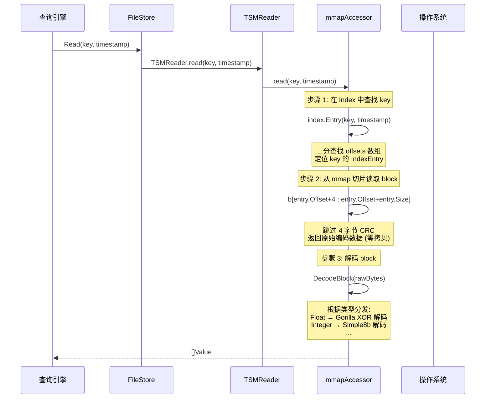

#### mmapAccessor.init() — 完整初始化

```go
// tsdb/engine/tsm1/reader.go:1486 — mmapAccessor.init
func (m *mmapAccessor) init() (*indirectIndex, error) {
    m.mu.Lock()
    defer m.mu.Unlock()

    // 1. 验证文件头: Magic=0x16D116D1, Version=1
    if _, err := m.f.Seek(0, 0); err != nil {
        return nil, fmt.Errorf("init: failed to seek: %v", err)
    }
    if err := verifyVersion(m.f); err != nil {
        return nil, err
    }
    if _, err := m.f.Seek(0, 0); err != nil {
        return nil, err
    }

    // 2. 获取文件大小
    stat, err := m.f.Stat()
    if err != nil {
        return nil, err
    }

    // 3. mmap 整个文件
    m.b, err = mmap(m.f, 0, int(stat.Size()))
    if err != nil {
        return nil, NewMmapError(err)
    }
    if len(m.b) < 8 {
        return nil, fmt.Errorf("mmapAccessor: byte slice too small for indirectIndex")
    }
    // m.b 现在是整个 TSM 文件的内存视图

    // 4. 可选: MADV_WILLNEED 提示内核预读
    if m.mmapWillNeed {
        if err := madviseWillNeed(m.b); err != nil {
            return nil, err
        }
    }

    // 5. 读取 Footer (最后 8 字节) → Index 起始偏移
    indexOfsPos := len(m.b) - 8
    indexStart := binary.BigEndian.Uint64(m.b[indexOfsPos:indexOfsPos+8])
    if indexStart >= uint64(indexOfsPos) {
        return nil, fmt.Errorf("mmapAccessor: invalid indexStart")
    }

    // 6. 解析 Index Section
    m.index = NewIndirectIndex()
    if err := m.index.UnmarshalBinary(m.b[indexStart:indexOfsPos]); err != nil {
        return nil, err
    }

    // 7. 标记访问计数，允许后续 free 逻辑立即释放资源
    m.incAccess()
    atomic.StoreUint64(&m.freeCount, 1)

    return m.index, nil
}
```

### 7.2 indirectIndex — Index 解析与二分查找

Index Section 包含所有 key 和 block 的元数据。解析时扫描字节流，记录每个 key 的偏移位置到 `offsets` 数组。

```go
// tsdb/engine/tsm1/reader.go:1325 — indirectIndex.UnmarshalBinary
func (d *indirectIndex) UnmarshalBinary(b []byte) error {
    d.b = b  // 保存 Index 字节引用

    var minTime, maxTime int64 = math.MaxInt64, 0

    var offsets []int32
    var i int32
    for i < int32(len(b)) {
        offsets = append(offsets, i)  // 记录 key 偏移

        // 跳过 key: keyLen(2B) + type(1B) + key(NB)
        i += 3 + int32(binary.BigEndian.Uint16(b[i:i+2]))

        // 读取 block 条目数
        count := int32(binary.BigEndian.Uint16(b[i:i+2]))
        i += 2

        // 跟踪全局 minTime/maxTime (边界验证)
        minT := int64(binary.BigEndian.Uint64(b[i : i+8]))
        if minT < minTime { minTime = minT }

        i += (count - 1) * indexEntrySize

        maxT := int64(binary.BigEndian.Uint64(b[i+8 : i+16]))
        if maxT > maxTime { maxTime = maxT }

        i += indexEntrySize
    }

    // 记录 minKey/maxKey (首尾 key)
    _, d.minKey = readKey(b[offsets[0]:])
    _, d.maxKey = readKey(b[offsets[len(offsets)-1]:])
    d.minTime = minTime
    d.maxTime = maxTime

    // 将 offsets 写入 mmap 匿名内存 (用于二分查找)
    d.offsets, _ = mmap(nil, 0, len(offsets)*4)
    for i, v := range offsets {
        binary.BigEndian.PutUint32(d.offsets[i*4:i*4+4], uint32(v))
    }
}
```

**二分查找定位 key**:

```go
func (d *indirectIndex) Seek(key []byte) int {
    return sort.Search(len(d.offsets)/4, func(i int) bool {
        offset := binary.BigEndian.Uint32(d.offsets[i*4 : i*4+4])
        _, k := readKey(d.b[offset:])
        return bytes.Compare(k, key) >= 0
    })
}
```

### 7.3 Block 解码 — 从原始字节到 Value

```go
// tsdb/engine/tsm1/reader.go:1548 — mmapAccessor.readBlock
func (m *mmapAccessor) readBlock(entry *IndexEntry, values []Value) ([]Value, error) {
    // 直接从 mmap 切片: 跳过 4 字节 CRC
    raw := m.b[entry.Offset+4 : entry.Offset+int64(entry.Size)]
    return DecodeBlock(raw, values)
}
```

**DecodeBlock 分发**:

```go
func DecodeBlock(b []byte, vals []Value) ([]Value, error) {
    switch b[0] {  // 第一个字节是 block 类型
    case BlockFloat64:
        decodeFloatBlock(b, &vals)
    case BlockInteger:
        decodeIntegerBlock(b, &vals)
    case BlockUnsigned:
        decodeUnsignedBlock(b, &vals)
    case BlockBoolean:
        decodeBooleanBlock(b, &vals)
    case BlockString:
        decodeStringBlock(b, &vals)
    }
    return vals, nil
}
```

### 7.4 KeyCursor — 多文件定位

查询时同一 key 可能存在于多个 TSM 文件中（Cache + 多个 compaction 级别）。`KeyCursor` 负责定位所有包含该 key 的文件和 block 位置。

> **注意**: `KeyCursor` 本身**不做**归并和去重。归并和去重发生在更上层的 cursor/iterator 层
> (如 `intAscendingCursor`、`floatAscendingCursor` 等)，它们从多个来源读取数据并合并排序。
> Cache 数据也在 iterator 层与 TSM 数据归并，Cache 的值优先级更高（相同时间戳保留 Cache 的值）。

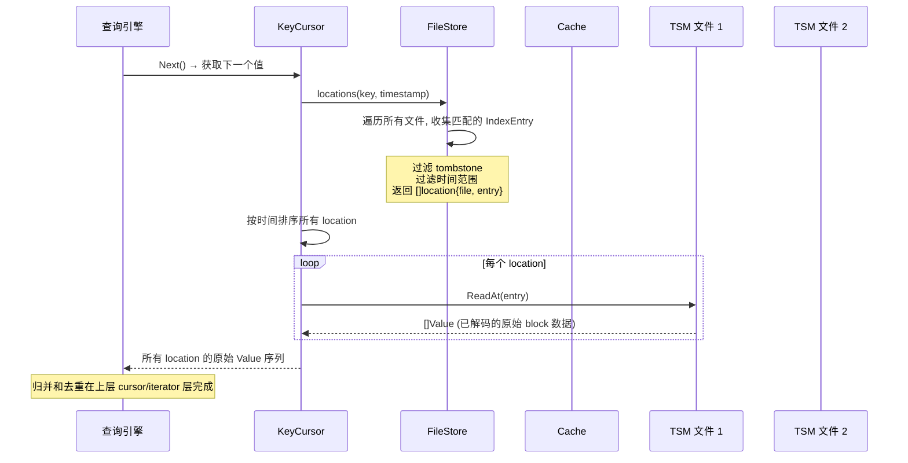

#### FileStore.locations — 查找所有匹配位置

```go
// tsdb/engine/tsm1/file_store.go:1000 — locations
// 注意: ascending 参数决定扫描方向，影响 readMin/readMax 的设置
func (f *FileStore) locations(key []byte, t int64, ascending bool) []*location {
    var cache []IndexEntry
    locations := make([]*location, 0, len(f.files))

    for _, fd := range f.files {
        minTime, maxTime := fd.TimeRange()

        // 1. 根据扫描方向跳过不相关文件
        if ascending && maxTime < t {
            continue  // 升序: 文件最大时间 < 查找时间，跳过
        } else if !ascending && minTime > t {
            continue  // 降序: 文件最小时间 > 查找时间，跳过
        }

        // 2. 获取 tombstone 范围 (而非 HasTombstone)
        tombstones := fd.TombstoneRange(key)

        // 3. 使用 ReadEntries 获取此 key 的所有 IndexEntry (而非 Contains + Entries)
        entries := fd.ReadEntries(key, &cache)
    LOOP:
        for i := 0; i < len(entries); i++ {
            ie := entries[i]

            // 4. 检查 tombstone: 跳过完全被 tombstone 覆盖的 block
            for _, t := range tombstones {
                if t.Min <= ie.MinTime && t.Max >= ie.MaxTime {
                    continue LOOP
                }
            }

            // 5. 根据扫描方向检查时间范围
            if ascending && ie.MaxTime < t {
                continue
            } else if !ascending && ie.MinTime > t {
                continue
            }

            location := &location{r: fd, entry: ie}

            // 6. 设置 readMin/readMax 用于查询时过滤
            if ascending {
                location.readMin = math.MinInt64
                location.readMax = t - 1   // 标记查找时间之前的数据为已读
            } else {
                location.readMin = t + 1   // 标记查找时间之后的数据为已读
                location.readMax = math.MaxInt64
            }

            locations = append(locations, location)
        }
    }
    return locations
}
```

### 7.5 Cache + TSM 归并 — 热数据优先

查询时 Cache 中的数据（未 snapshot 的最新写入）与 TSM 文件中的数据归并。Cache 数据优先级更高。

```go
// tsdb/engine/tsm1/array_cursor_iterator.gen.go — buildFloatArrayCursor
func (q *arrayCursorIterator) buildFloatArrayCursor(ctx context.Context, name []byte, tags models.Tags, field string, opt query.IteratorOptions) (tsdb.FloatArrayCursor, error) {
    key := q.seriesFieldKeyBytes(name, tags, field)

    // 1. Cache.Values 同时读取 snapshot cache 和 live cache。
    //    snapshot 先入结果，live cache 后入结果，最后 Deduplicate。
    cacheValues := q.e.Cache.Values(key)

    // 2. KeyCursor 从 TSM 文件读取冷数据。
    keyCursor := q.e.KeyCursor(ctx, key, opt.SeekTime(), opt.Ascending)

    // 3. ArrayCursor reset 时把 cacheValues 放在 TSM cursor 之上。
    //    相同时间戳时 Cache 数据覆盖 TSM 数据。
    return q.asc.Float, q.asc.Float.reset(opt.SeekTime(), opt.StopTime(), cacheValues, keyCursor)
}
```

这里要区分两条读路径：InfluxQL 的 `Engine.CreateIterator` 返回的是 `query.Iterator`（point cursor/iterator 模型），它会在 `createCallIterator` 或 `createVarRefIterator` 中按 series 构建迭代器；`ArrayCursor` 是更底层的 storage reads / TSM1 array cursor 路径，用来批量读 Cache + TSM 的 typed array。不要把 InfluxQL 的 `CreateIterator` 直接等同为 `ArrayCursor`。

## 8. 架构设计意图

### 8.1 为什么用 16 分区哈希环

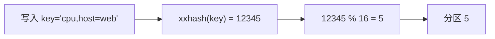

- **并发**: 16 个分区可以并发写入
- **锁粒度**: 每个分区独立的 RWMutex
- **均匀分布**: xxhash 保证均匀分布

### 8.2 为什么 Cache 没有驱逐

- **数据完整性**: 驱逐可能导致最新数据丢失
- **Snapshot 语义**: 整个 Cache 一次性快照写入 TSM
- **简单可靠**: 无驱逐策略，逻辑简单

### 8.3 为什么当前实现先写 Cache 再写 WAL

- **写入速度**: 先写入未压缩数据，异步压缩
- **批量压缩**: 多个 entry 一起压缩，压缩率更高
- **fsync 批量**: 多个写入共享一次 fsync

## 9. 架构收益

| 维度 | 收益 |
|------|------|
| **写入吞吐** | 16 分区并发 + 乐观锁 + fsync 批量 |
| **内存效率** | Snapshot O(1) 交换，无 GC 停顿 |
| **压缩比** | Gorilla XOR (Float) + Simple8b (Integer) |
| **数据安全** | 当前 `Engine.WritePoints` 先 `Cache.WriteMulti(values)`，再 `WAL.WriteMulti(values)` 并等待 sync；WAL 用于重启恢复，但不是先于 Cache 写入，WAL 失败会返回错误且 Cache 已写入 |
| **查询性能** | TSM 文件排序 + Index 二分查找 |

## 10. 潜在隐患与瓶颈

### 10.1 Cache 满时直接拒绝写入

```go
if limit > 0 && n > limit {
    return ErrCacheMemorySizeLimitExceeded(n, limit)
}
```

没有驱逐机制，Cache 满时写入直接失败。可能导致数据丢失。

### 10.2 Snapshot 期间内存翻倍

Cache.Size() = size + snapshotSize。Snapshot 和 live store 同时存在于内存中。

### 10.3 WAL fsync 批量延迟

CAS 批量机制导致单个写入可能等待整个 flush 周期。

### 10.4 分区写锁竞争

高基数场景下，同一分区的写操作串行化。

### 10.5 Gorilla 编码的 CPU 开销

XOR + leading/trailing zeros 计算在每次 Write 时执行。

### 10.6 Simple8b 的打包效率

当差值分布不均匀时，Simple8b 可能无法有效打包。

## 11. TSM-to-TSM 压缩流程

```mermaid
flowchart TD
    subgraph "Compaction 级别"
        CS["Cache Snapshot: WriteSnapshot()<br>(从 Cache 写入的新 generation TSM 文件)"]
        L1["Level 1: PlanLevel(1)<br>(多个小 TSM 文件合并)"]
        L2["Level 2: PlanLevel(2)<br>(多个 L1 合并)"]
        L3["Level 3: PlanLevel(3)<br>(多个 L2 合并)"]
        L4["Level 4: Plan()<br>(Full Compaction，合并所有级别)"]
        L5["Level 5: PlanOptimize()<br>(Optimize，冷 shard 优化重写)"]
    end

    CS -->|"Compactor.Compact()"| L1
    L1 -->|"Compactor.Compact()"| L2
    L2 -->|"Compactor.Compact()"| L3
    L3 -->|"Compactor.Compact()"| L4
    L4 -->|"冷 shard / holdoff 后"| L5

    subgraph "每一步的处理"
        A["选择同级别的多个 TSM 文件"] --> B["按 key 排序归并"]
        B --> C["去重 (相同时间戳保留最新)"]
        C --> D["编码为新的 TSM block"]
        D --> E["写入新的 TSM 文件"]
        E --> F["删除旧的 TSM 文件"]
    end
```

> **注意**: Cache Snapshot（`WriteSnapshot()`）不是 compaction 级别，而是由 `ShouldCompactCache()` 触发的
> 独立流程，将 Cache 数据写入新的 generation。`Compactor.writeNewFiles` 会先递增 sequence，
> 因此首个输出通常是 `000001-01.tsm` 这类文件；后续 compaction level 由 sequence 和 planner 解释。
> 当前实现没有可调度的 Level 0：sequence=1 的 cache snapshot 文件被 `tsmGeneration.level()`
> 归为 Level 1。

**Compaction 调度逻辑** (`engine.go:2111-2153`):
- Level 1 (`PlanLevel(1)`): 合并多个小 TSM 文件，高优先级 (`compactHiPriorityLevel`)
- Level 2 (`PlanLevel(2)`): 合并多个 L1 文件，高优先级 (`compactHiPriorityLevel`)
- Level 3 (`PlanLevel(3)`): 合并多个 L2 文件，低优先级 (`compactLoPriorityLevel`)
- Level 4 (`Plan(e.LastModified())`): Full compaction，合并所有级别文件为一个最终文件
- Level 5 (`PlanOptimize(e.LastModified())`): Optimize compaction，经过 holdoff 后由 `compactOptimize` 执行，权重最低

## 12. Scheduler 组件

```go
// tsdb/engine/tsm1/scheduler.go:9
var defaultWeights = [TotalCompactionLevels]float64{0.4, 0.3, 0.2, 0.1, 0.01}

type Scheduler struct {
    maxConcurrency int
    stats          *EngineStatistics

    // queues is the depth of work pending for each compaction level
    queues  [TotalCompactionLevels]int  // TotalCompactionLevels = 5
    weights [TotalCompactionLevels]float64
}
```

Scheduler 负责决定何时执行哪种 compaction:
- 根据当前活跃的 compaction 数量和级别选择下一个任务
- 通过比较各级别运行中的 compaction 总数与 `maxConcurrency` 来控制并发数（使用原子操作从 `stats` 读取）
- 使用加权评分算法（`queues[i] * weights[i]`）选择下一个任务，权重为 `[0.4, 0.3, 0.2, 0.1, 0.01]`（低级别优先，Optimize 最低）
- 优先执行低级别的 compaction（L1→L2），保持写入路径畅通

## 13. Tombstone 处理

Tombstone 用于标记已删除的数据。当执行 `DELETE` 或 `DELETE RANGE` 时：
1. WAL 写入 DeleteWALEntry / DeleteRangeWALEntry
2. Cache 中的数据被清除
3. TSM 文件中的数据通过 tombstone 文件标记为已删除

```go
// tsdb/engine/tsm1/tombstone.go
type Tombstone struct {
    Key    []byte
    Min    int64  // 最小时间戳
    Max    int64  // 最大时间戳
}
```

**Tombstone 文件格式**: 每个 TSM 文件对应一个 `.tombstone` 文件。
读取数据时，`FileStore.locations()` 会检查 tombstone 范围，
跳过完全被 tombstone 覆盖的 block。

> **注意**: Tombstone 不会立即物理删除数据。只有在 compaction 时，
> 被 tombstone 标记的数据才会被真正移除。

**Tombstone 处理全链路**:

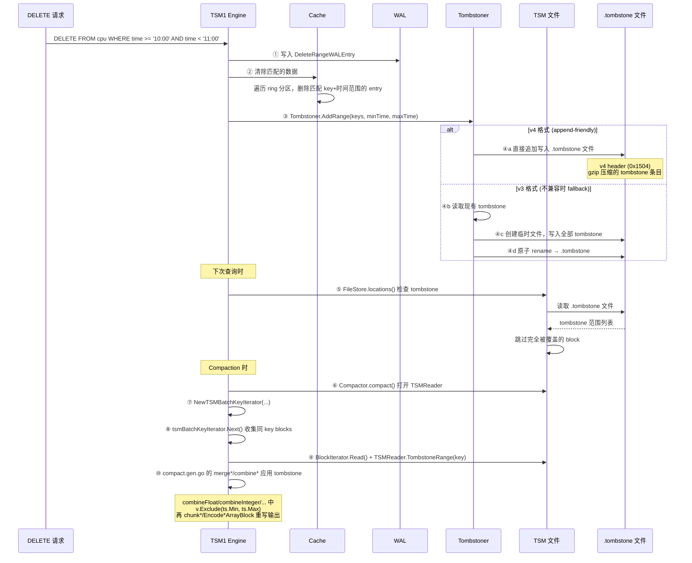

当前 compaction 路径在 `Compactor.compact()` 中创建
`NewTSMBatchKeyIterator(size, fast, DefaultMaxSavedErrors, intC, tsmFiles, trs...)`；
`tsmBatchKeyIterator.Next()` 为每个 block 保存 `blk.tombstones = iter.r.TombstoneRange(key)`。
随后 `merge()` 按 block 类型分发到 `compact.gen.go` 生成的
`mergeFloat/mergeInteger/mergeUnsigned/mergeBoolean/mergeString`，这些函数再调用对应
`combine*`。当需要解码归并或 block 带 tombstone 时，`combine*` 会对解码后的类型化数组执行
`v.Exclude(ts.Min, ts.Max)`，最后 `chunk*` 重新编码输出；如果一个 key 的 merged 输出为空，
`Next()` 会继续读取下一个 key。

**Tombstoner 结构** (`tombstone.go:32-59`):

```go
type Tombstoner struct {
    mu sync.RWMutex

    // Path 是要记录 tombstone 的 TSM 文件的完整路径。
    Path string

    // FilterFn 是一个可选的过滤函数，用于在加载 tombstone 时过滤 key。
    // 如果为 nil，则不过滤。
    FilterFn func(k []byte) bool

    // tombstones 是已写入但尚未刷新到磁盘的 tombstone 列表。
    tombstones []Tombstone

    // tombstoneStats 是 tombstone 统计信息的缓存。
    tombstoneStats TombstoneStat

    // statsLoaded 为 false 时表示统计信息可能与磁盘不同步，需要重新加载。
    statsLoaded bool

    // 以下字段用于 pending 写入（尚未提交到磁盘）。
    // 如果为 nil，则表示当前没有 pending 写入。
    gz                *gzip.Writer    // gzip 压缩器，用于 v4 格式写入
    bw                *bufio.Writer   // 缓冲写入器
    pendingFile       *os.File        // 正在写入的临时文件
    tmp               [8]byte         // 临时缓冲区，用于编码整数
    lastAppliedOffset int64           // 上次应用的偏移量，用于增量追加

    // obs 是可选的观察者，当 tombstone 文件被写入时通知。
    obs tsdb.FileStoreObserver
}
```

**v4 vs v3 格式**:
- **v4** (`0x1504`): append-friendly，新 tombstone 直接追加到文件末尾，无需重写
- **v3** (`0x1503`): 需要读取现有文件 → 合并 → 重写整个文件
- `prepareV4()` 先尝试 v4，如果现有文件是 v3 则 fallback 到 `writeTombstoneV3()`

## 14. WAL 恢复流程

Engine 启动时，`Open()` 调用 `reloadCache()` 从 WAL 文件恢复 Cache：

```go
// tsdb/engine/tsm1/engine.go:2391 — reloadCache
func (e *Engine) reloadCache() error {
    // 1. 获取所有 WAL segment 文件
    files, err := segmentFileNames(e.WAL.Path())

    // 2. 临时禁用 Cache 大小限制 (防止恢复过程中被拒绝)
    limit := e.Cache.MaxSize()
    defer func() { e.Cache.SetMaxSize(limit) }()
    e.Cache.SetMaxSize(0)

    // 3. 创建 CacheLoader 顺序读取 WAL 文件
    loader := NewCacheLoader(files)
    loader.WithLogger(e.logger)

    // 4. 逐条读取 WAL entry，写入 Cache
    if err := loader.Load(e.Cache); err != nil {
        return err
    }

    // 5. 恢复 Cache 大小限制
    return nil
}
```

**恢复顺序**: WAL 文件按文件名排序（`_00001.wal`, `_00002.wal`, ...），
顺序重放。同一个 key 的多次写入会追加到 Cache entry 中，
最终在 compaction 时去重。

**WAL 恢复流程 Mermaid 图**:

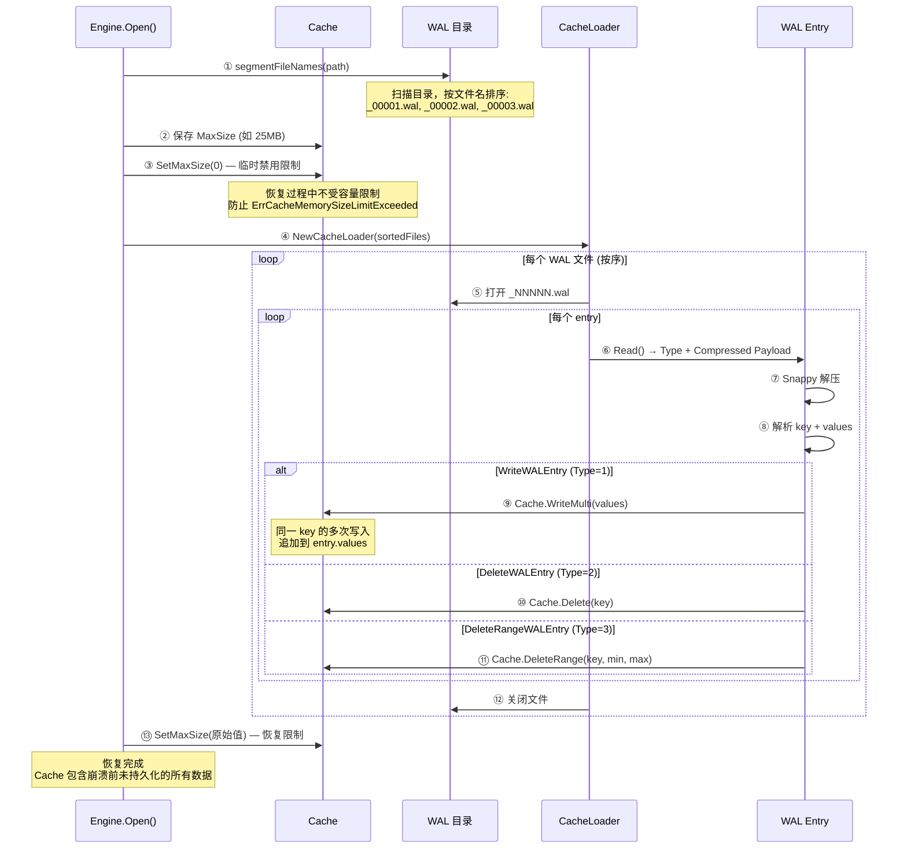

**WAL Segment 滚动案例**:

> **具体案例**: 假设 SegmentSize = 10MB，连续写入数据
>
> ```
> t=0s    打开 _00001.wal，开始写入
> t=5s    _00001.wal 大小 = 8MB，继续写入
> t=7s    _00001.wal 大小 = 11MB > 10MB
>         → rollSegment() 触发
>         → 关闭 _00001.wal 的 writer
>         → 创建 _00002.wal
>         → 新写入进入 _00002.wal
>
> t=10s   _00002.wal 大小 = 12MB > 10MB
>         → 创建 _00003.wal
>
> t=15s   Cache Snapshot 触发
>         → WAL.CloseSegment() 关闭 _00003.wal
>         → Cache.Snapshot() O(1) 交换
>         → Compactor.WriteSnapshot() 写入 TSM 文件
>         → WAL.Remove([_00001.wal, _00002.wal, _00003.wal])
>         → 删除已持久化的 WAL 文件
> ```
>
> 恢复时只重放 Snapshot 之后的 WAL 文件（如果有新写入在 Snapshot 之后、崩溃之前）。

## 15. Engine.Open() 初始化序列

```go
// tsdb/engine/tsm1/engine.go:723 — Open
func (e *Engine) Open() error {
    // 1. 创建数据目录
    os.MkdirAll(e.path, 0777)

    // 2. 清理临时文件
    e.cleanup()

    // 3. 加载字段元数据 (fields.idx)
    fields, err := tsdb.NewMeasurementFieldSet(filepath.Join(e.path, "fields.idx"))
    e.fieldset = fields
    e.index.SetFieldSet(fields)

    // 4. 打开 WAL
    if e.WALEnabled {
        e.WAL.Open()
    }

    // 5. 打开 FileStore (mmap 所有 TSM 文件)
    e.FileStore.Open()

    // 6. 从 WAL 恢复 Cache
    if e.WALEnabled {
        e.reloadCache()
    }

    // 7. 打开 Compactor
    e.Compactor.Open()

    // 8. 启用 compaction (如果配置允许)
    if e.enableCompactionsOnOpen {
        e.SetCompactionsEnabled(true)
    }

    return nil
}
```

**关键顺序**:
- WAL 必须在 FileStore 之前打开（WAL 文件需要被恢复到 Cache）
- FileStore 必须在 reloadCache 之前打开（需要知道哪些 TSM 文件已存在）
- Compactor 必须在最后打开（依赖 FileStore 和 Cache 已就绪）
