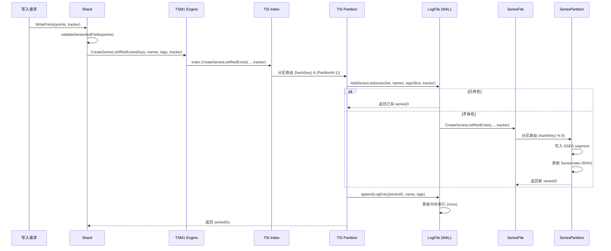
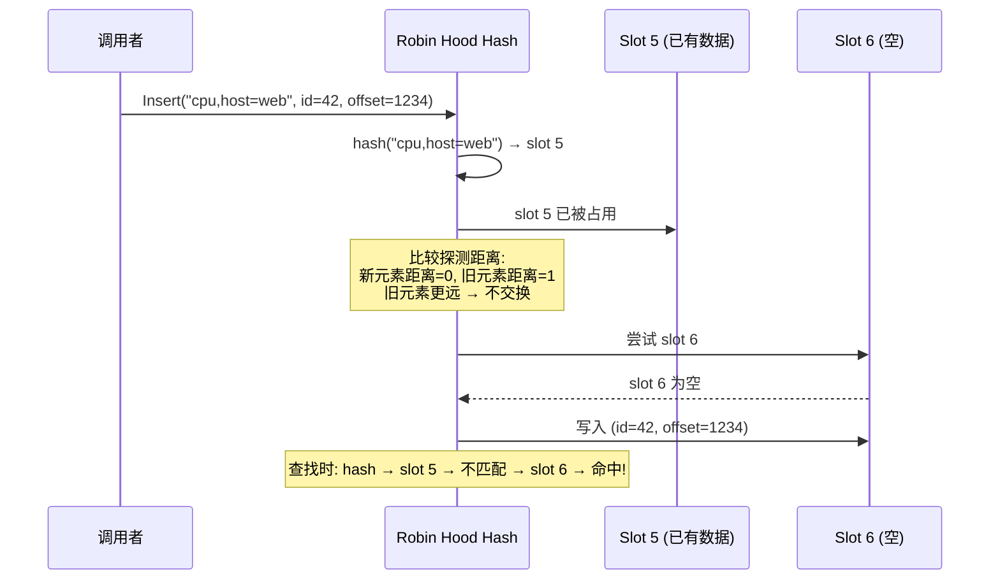
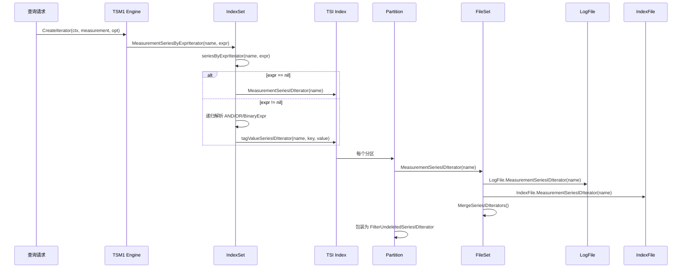
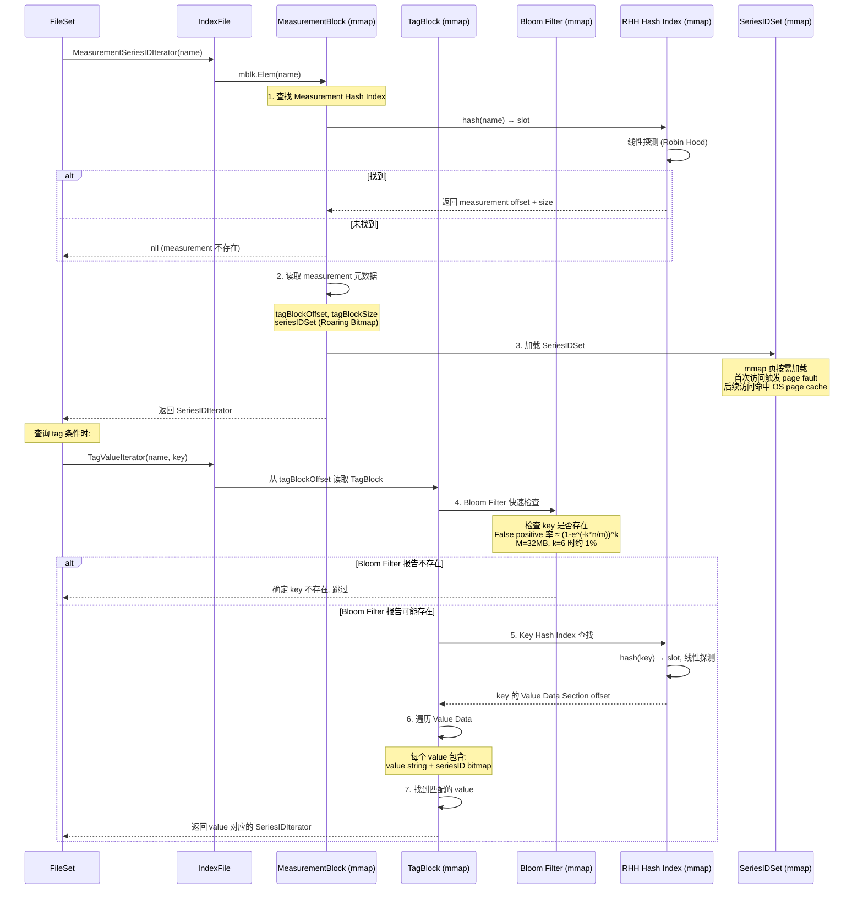
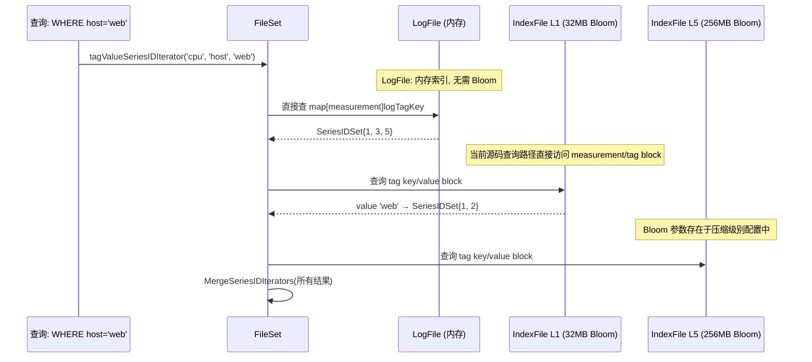
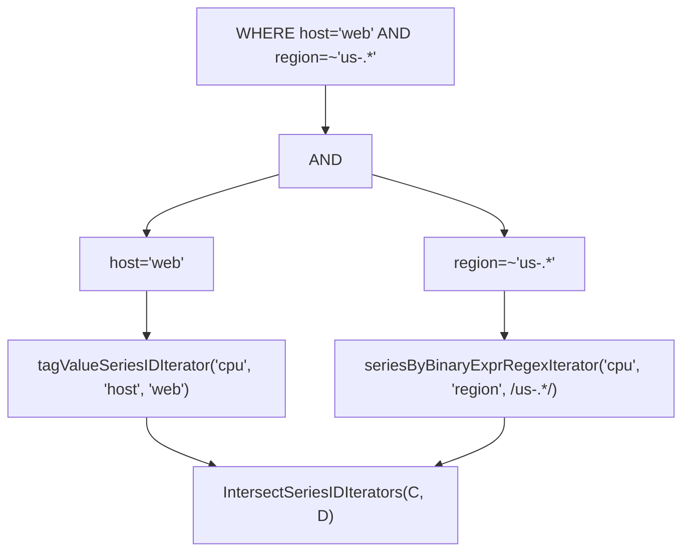
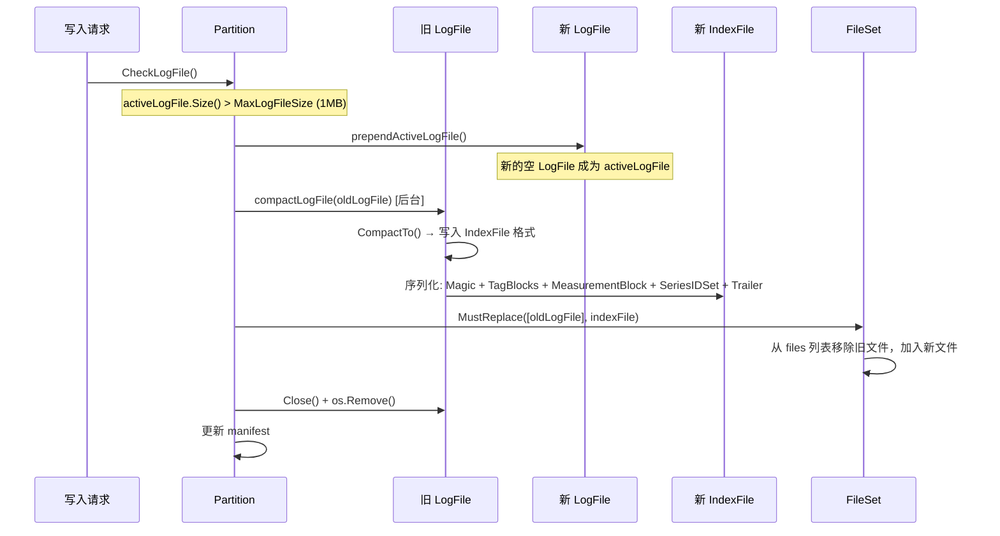
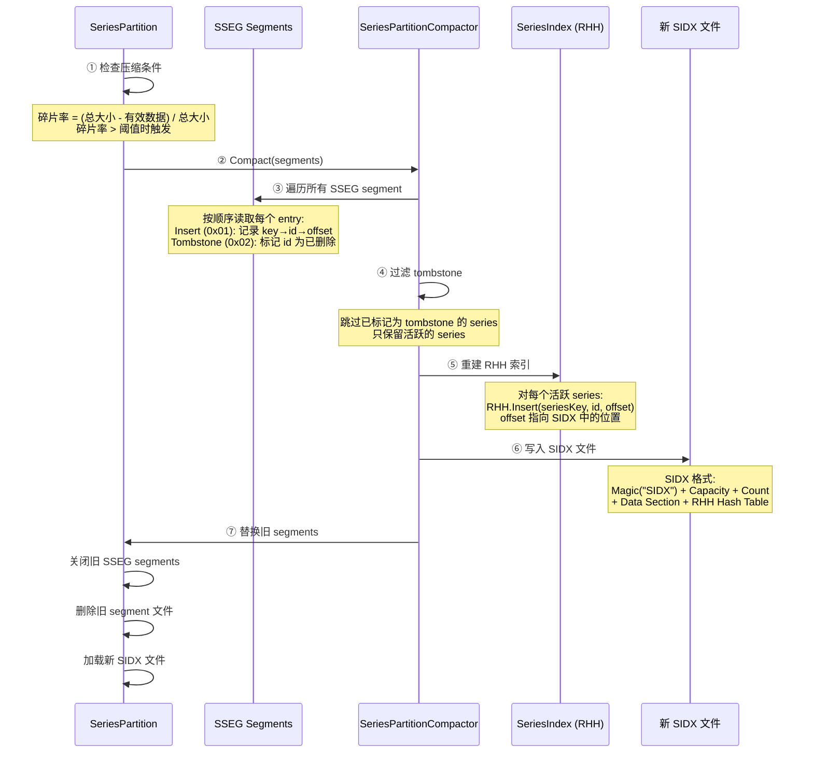
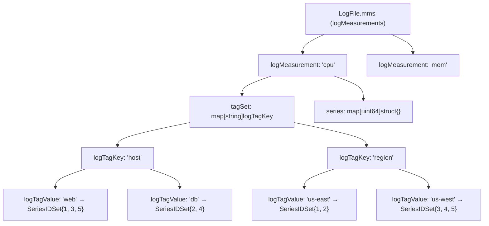
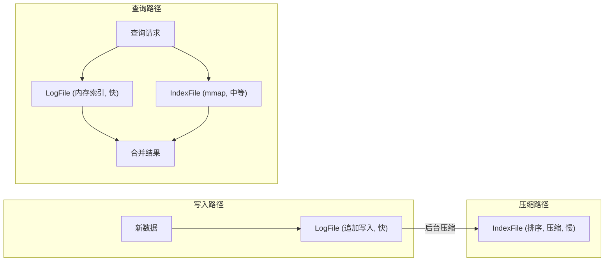

# Module 2: 索引系统 (TSI Index + SeriesFile) - 深度审计报告

> **小白导读**: 索引就像一本书的**目录**。没有目录，找内容只能一页一页翻（全表扫描）。
> 有了目录，直接翻到对应页码（O(1) 查找）。
>
> InfluxDB 的索引系统有两层：
> - **SeriesFile**: 记录所有"series"（如 `cpu,host=web`）的唯一编号。就像图书馆的**书号系统**。
> - **TSI Index**: 记录每个 measurement 下有哪些 series，每个 tag 值对应哪些 series。就像图书馆的**分类目录**。
>
> 为什么需要两层？因为 SeriesFile 是每个数据库独立的（所有 Shard 共享同一数据库的 SeriesFile），TSI Index 是每个 Shard 独立的。

## 1. Series 创建全链路

### 1.1 从写入到 Series 注册的完整路径



### 1.2 每一步的代码实现

#### 步骤 1: Shard.validateSeriesAndFields — 验证 Series 和 Fields

```go
// tsdb/shard.go:613 — validateSeriesAndFields
func (s *Shard) validateSeriesAndFields(points []models.Point, tracker StatsTracker) ([]models.Point, []*FieldCreate, error) {
    var (
        keys       [][]byte
        names      [][]byte
        tagsSlice  []models.Tags
        droppedIdx []int
        dropped    []string
    )

    // 步骤 1a: 收集 series 信息
    for i, p := range points {
        // 检查 "time" tag (保留字)
        tags := p.Tags()
        if v := tags.Get(TimeBytes); v != nil {
            droppedIdx = append(droppedIdx, i)
            dropped = append(dropped, `tag key "time" is reserved`)
            continue
        }

        // 检查无效 unicode
        if s.options.ValidateKeys && !models.ValidKeyTokens(p.Name(), p.TagKeys()) {
            droppedIdx = append(droppedIdx, i)
            continue
        }

        keys = append(keys, p.Key())
        names = append(names, p.Name())
        tagsSlice = append(tagsSlice, p.Tags())
    }

    // 步骤 1b: 批量创建 series
    err := engine.CreateSeriesListIfNotExists(keys, names, tagsSlice, tracker)

    // 步骤 1c: 验证 field 类型
    for _, p := range points {
        iter := p.FieldIterator()
        for iter.Next() {
            mf := engine.MeasurementFields(p.Name())
            if err := s.options.FieldValidator.Validate(mf, p); err != nil {
                // field 类型冲突
            }
        }
    }

    // 步骤 1d: 检测新 field
    for _, p := range points {
        mf := engine.MeasurementFields(p.Name())
        iter := p.FieldIterator()
        for iter.Next() {
            if f := mf.FieldBytes(iter.FieldKey()); f == nil {
                // 新 field，需要创建
                fieldsToCreate = append(fieldsToCreate, &FieldCreate{...})
            }
        }
    }

    return points, fieldsToCreate, nil
}
```

#### 步骤 2: Engine.CreateSeriesListIfNotExists — 委托给 Index

```go
// tsdb/engine/tsm1/engine.go:1892 — CreateSeriesListIfNotExists
func (e *Engine) CreateSeriesListIfNotExists(keys, names [][]byte, tagsSlice []models.Tags, tracker tsdb.StatsTracker) error {
    return e.index.CreateSeriesListIfNotExists(keys, names, tagsSlice, tracker)
}
```

#### 步骤 3: Index.CreateSeriesListIfNotExists — 分区路由

```go
// tsdb/index/tsi1/index.go:634 — Index.CreateSeriesListIfNotExists
func (i *Index) CreateSeriesListIfNotExists(keys [][]byte, names [][]byte, tagsSlice []models.Tags, tracker tsdb.StatsTracker) error {
    // 按分区分组: 将 names 和 tags 按分区拆分为 pNames/pTags
    pNames := make([][][]byte, i.PartitionN)
    pTags := make([][]models.Tags, i.PartitionN)

    for ki, key := range keys {
        pidx := i.partitionIdx(key)
        pNames[pidx] = append(pNames[pidx], names[ki])
        pTags[pidx] = append(pTags[pidx], tagsSlice[ki])
    }

    // 并发处理各分区 (goroutine 池 + atomic 计数器)
    n := i.availableThreads()
    errC := make(chan error, i.PartitionN)

    var pidx uint32
    for k := 0; k < n; k++ {
        go func() {
            for {
                idx := int(atomic.AddUint32(&pidx, 1) - 1)
                if idx >= len(i.partitions) {
                    return
                }
                ids, err := i.partitions[idx].createSeriesListIfNotExists(pNames[idx], pTags[idx], tracker)
                // ... 更新 tagValueCache ...
                errC <- err
            }
        }()
    }

    for i := 0; i < cap(errC); i++ {
        if err := <-errC; err != nil {
            return err
        }
    }
}
```

**分区路由** (index.go:371):

```go
func (i *Index) partitionIdx(key []byte) int {
    return int(xxhash.Sum64(key) & (i.PartitionN - 1))
}
```

**注意**: 使用位运算 `& (PartitionN - 1)` 而非取模 `%`，因为 PartitionN 始终是 2 的幂（默认 8），位运算更快。

**PartitionN 默认值**: 8 (可通过 `INFLUXDB_EXP_TSI_PARTITIONS` 环境变量配置)

**TagValueSeriesIDCache** (index.go:131): Index 级别的 tag value 查询缓存 (`*TagValueSeriesIDCache`)，缓存 tag key+value 到 SeriesIDSet 的映射，避免重复的 IndexFile mmap 访问。大小通过 `tagValueCacheSize` 配置。

#### 步骤 4: Partition.createSeriesListIfNotExists — LogFile + SeriesFile

```go
// tsdb/index/tsi1/partition.go:645 — createSeriesListIfNotExists
func (p *Partition) createSeriesListIfNotExists(names [][]byte, tagsSlice []models.Tags, tracker tsdb.StatsTracker) ([]uint64, error) {
    // 1. 获取 FileSet 引用
    fs, err := p.RetainFileSet()
    defer fs.Release()

    // 2. 持读锁，调用 LogFile.AddSeriesList
    //    AddSeriesList 内部会调用 f.sfile.CreateSeriesListIfNotExists 创建 series
    //    然后写入 WAL entry 并更新内存索引
    p.mu.RLock()
    ids, err := p.activeLogFile.AddSeriesList(p.seriesIDSet, names, tagsSlice, tracker)
    p.mu.RUnlock()

    // 3. 检查是否需要轮转 LogFile
    if err := p.CheckLogFile(); err != nil {
        return nil, err
    }
    return ids, nil
}
```

**控制流说明**: Partition 并不直接调用 SeriesFile，而是委托给 `LogFile.AddSeriesList`，后者在内部调用 `f.sfile.CreateSeriesListIfNotExists` 完成 series 注册。

**加锁说明**: `AddSeriesList` 同时持有 `f.mu.Lock()`（LogFile 写锁）和 `seriesSet.Lock()`（SeriesIDSet 写锁），在写锁下 double-check 避免重复写入，然后追加 entry、更新内存索引、并将新 series ID 注册到 SeriesIDSet

**统计说明**: `tracker tsdb.StatsTracker` 不是可省略的装饰参数。它从 `Shard.WritePoints` 一直传到 `SeriesPartition.CreateSeriesListIfNotExists`，用于记录新增 series / measurement-series 统计；测试中通常传 `tsdb.NoopStatsTracker()`。

#### 步骤 5: SeriesFile.CreateSeriesListIfNotExists — 8 分区 SeriesFile

```go
// tsdb/series_file.go:178 — SeriesFile.CreateSeriesListIfNotExists
func (f *SeriesFile) CreateSeriesListIfNotExists(names [][]byte, tagsSlice []models.Tags, tracker tsdb.StatsTracker) ([]uint64, error) {
    // 构建 key
    keys := GenerateSeriesKeys(names, tagsSlice)

    // 按分区分组
    keyPartitionIDs := f.SeriesKeysPartitionIDs(keys)

    ids := make([]uint64, len(keys))

    // 使用 errgroup 并发处理所有分区
    var g errgroup.Group
    for i := range f.partitions {
        p := f.partitions[i]
        g.Go(func() error {
            return p.CreateSeriesListIfNotExists(keys, keyPartitionIDs, ids, tracker)
        })
    }
    if err := g.Wait(); err != nil {
        return nil, err
    }

    return ids, nil
}
```

**SeriesFile 8 分区路由** — 两种分区方式:

SeriesFile 使用两种不同的分区映射，分别用于不同场景：

```go
// tsdb/series_file.go:32 — SeriesFilePartitionN
const SeriesFilePartitionN = 8

// 方式 1: key → 分区 (写入/查找时使用)
// 使用 xxhash 取模，将 series key 路由到某个分区
// tsdb/series_file.go:299
func (f *SeriesFile) SeriesKeyPartitionID(key []byte) int {
    return int(xxhash.Sum64(key) % SeriesFilePartitionN)
}

// 方式 2: seriesID → 分区 (通过 ID 反查时使用)
// 使用 (id-1) 取模，因为 ID 分配规则保证了 ID 与分区的固定映射
// tsdb/series_file.go:279
func (f *SeriesFile) SeriesIDPartitionID(id uint64) int {
    return int((id - 1) % SeriesFilePartitionN)
}
```

> **两种方式的关系**: 写入时通过 `SeriesKeyPartitionID(key)` 确定分区，
> 分区内的 `insert()` 函数分配 ID（`p.seq += SeriesFilePartitionN`）。
> 由于 ID 分配规则（分区 0 获得 1,9,17,...；分区 1 获得 2,10,18,...），
> `(id-1) % 8` 一定等于分配该 ID 的分区号。
> 因此两种方式的结果一致，但用途不同：方式 1 用于写入路径（key 已知），
> 方式 2 用于查询路径（只有 ID，需要反查 key）。
>
> **注意**: SeriesFile 使用**取模** `%`，而 TSI Index 的 `partitionIdx` 使用**位运算** `& (PartitionN - 1)`。
> 两者都要求 PartitionN 为 2 的幂，但位运算更快。这是一个实现上的不一致。

#### 步骤 6: SeriesPartition.CreateSeriesListIfNotExists — SSEG + RHH

```go
// tsdb/series_partition.go:199 — CreateSeriesListIfNotExists
func (p *SeriesPartition) CreateSeriesListIfNotExists(keys [][]byte, keyPartitionIDs []int, ids []uint64, tracker tsdb.StatsTracker) error {
    var writeRequired bool

    // 阶段 1: 读锁快速路径 — 检查已存在的 series
    p.mu.RLock()
    if p.closed {
        p.mu.RUnlock()
        return ErrSeriesPartitionClosed
    }
    for i := range keys {
        if keyPartitionIDs[i] != p.id {
            continue  // 不属于此分区
        }
        id := p.index.FindIDBySeriesKey(p.segments, keys[i])
        if id == 0 {
            writeRequired = true  // 需要写入
            continue
        }
        ids[i] = id
    }
    p.mu.RUnlock()

    // 提前退出: 所有 series 已存在
    if !writeRequired {
        return nil
    }

    type keyRange struct {
        id     uint64
        offset int64
    }
    newKeyRanges := make([]keyRange, 0, len(keys))

    // 阶段 2: 写锁 — 创建新 series (双重检查)
    p.mu.Lock()
    defer p.mu.Unlock()

    if p.closed {
        return ErrSeriesPartitionClosed
    }

    // 跟踪批量内的重复 key
    newIDs := make(map[string]uint64, len(ids))

    for i := range keys {
        if keyPartitionIDs[i] != p.id || ids[i] != 0 {
            continue
        }

        // 写锁下再次检查 (可能其他 goroutine 已创建)
        key := keys[i]
        // 先查批量内去重 map
        if ids[i] = newIDs[string(key)]; ids[i] != 0 {
            continue
        } else if ids[i] = p.index.FindIDBySeriesKey(p.segments, key); ids[i] != 0 {
            continue
        }

        // 分配新 ID 并写入 SSEG segment
        id, offset, err := p.insert(key)
        if err != nil {
            return err
        }

        ids[i] = id
        newIDs[string(key)] = id
        newKeyRanges = append(newKeyRanges, keyRange{id, offset})
    }

    // 刷盘使 mmap 可读
    if segment := p.activeSegment(); segment != nil {
        if err := segment.Flush(); err != nil {
            return err
        }
    }

    // 将新 key 添加到 RHH hash map
    for _, keyRange := range newKeyRanges {
        p.index.Insert(p.seriesKeyByOffset(keyRange.offset), keyRange.id, keyRange.offset)
    }
}
```

**insert 函数** (series_partition.go:445):

```go
func (p *SeriesPartition) insert(key []byte) (id uint64, offset int64, err error) {
    id = p.seq
    offset, err = p.writeLogEntry(AppendSeriesEntry(nil, SeriesEntryInsertFlag, id, key))
    if err != nil {
        return 0, 0, err
    }
    p.seq += SeriesFilePartitionN  // 不是 p.seq++
    return id, offset, nil
}
```

**Series ID 分配**: 分区 0 获得 1, 9, 17, ...; 分区 1 获得 2, 10, 18, ...; 以此类推。

```go
// tsdb/series_partition.go:62 — seq 初始化
p.seq = uint64(p.id + 1)  // 分区 0 → seq=1, 分区 1 → seq=2, ...

// 恢复时: p.seq = seq + SeriesFilePartitionN (series_partition.go:126)
// 确保 seq 总是跳到下一个属于本分区的 ID
```

**SeriesPartitionCompactor** (series_partition.go:517): 当 SSEG 文件碎片过多时触发压缩。使用 RHH 重建索引，将多个 SSEG segment 合并为紧凑的 SIDX 文件。触发阈值由 `CompactThreshold` 控制。

#### 步骤 7: SeriesSegment — SSEG 文件格式

**Segment 大小增长** (series_segment.go:366): `1 << (id + 22)`，从 4MB (id=0) 增长到 256MB (id>=6)。后续 segment 固定为 256MB。

```go
func SeriesSegmentSize(id uint16) uint32 {
    const min = 22 // 4MB
    const max = 28 // 256MB
    shift := id + min
    if shift >= max {
        shift = max
    }
    return 1 << shift
}
```

```go
// tsdb/series_segment.go:17-31 — SSEG 格式常量
const (
    SeriesSegmentVersion = 1
    SeriesSegmentMagic   = "SSEG"

    SeriesSegmentHeaderSize = 4 + 1 // magic + version
)

// Series entry constants.
const (
    SeriesEntryFlagSize   = 1
    SeriesEntryHeaderSize = 1 + 8 // flag + id

    SeriesEntryInsertFlag    = 0x01
    SeriesEntryTombstoneFlag = 0x02
)
```

**SSEG Entry 格式** (ReadSeriesEntry, series_segment.go:415):

```
┌──────┬────────┬──────────────┐
│ Flag │  ID    │     Key      │
│1 byte│8 bytes │ N bytes (变长)│
└──────┴────────┴──────────────┘
```

- **Flag**: `0x01` = Insert, `0x02` = Tombstone
- **ID**: Series ID (uint64, BigEndian)
- **Key**: Series key，带长度前缀 (如 `cpu,host=web`)

#### 步骤 8: SeriesIndex — Robin Hood Hash

```go
// tsdb/series_index.go:36 — SeriesIndex
type SeriesIndex struct {
    path string

    count    uint64
    capacity int64
    mask     int64          // RHH 掩码 (capacity - 1)

    maxSeriesID uint64
    maxOffset   int64

    data         []byte     // mmap 的 SIDX 整体数据
    keyIDData    []byte     // key→ID 的 mmap 区域 (磁盘上的 RHH hash table)
    idOffsetData []byte     // ID→offset 的 mmap 区域 (磁盘上的 hash table)

    // 重启后重建的内存索引 (maxOffset 之后的增量数据)
    keyIDMap    *rhh.HashMap       // key → seriesID 映射 (Robin Hood Hash)
    idOffsetMap map[uint64]int64   // seriesID → SSEG offset 映射 (标准 Go map)
    tombstones  map[uint64]struct{} // 已删除的 seriesID 集合
}
```

> **关键区分**: `keyIDMap` 使用 `pkg/rhh.HashMap`（Robin Hood Hashing），而 `idOffsetMap` 使用标准 Go `map[uint64]int64`。
> 磁盘上的 SIDX 文件存储了完整的 RHH hash table（通过 mmap 映射到 `keyIDData` 和 `idOffsetData`），
> 内存中的 `keyIDMap`/`idOffsetMap` 只存储重启后 `maxOffset` 之后的增量数据。
> 查询时先查内存 map，未命中再查 mmap 的磁盘数据。

**SeriesIndex.Recover()** (series_index.go:110): 启动时重建内存索引。遍历 SIDX 文件中 `maxOffset` 之后的所有 SSEG entry，重新构建 `keyIDMap`、`idOffsetMap` 和 `tombstones`。这确保了崩溃后未持久化到 SIDX 的 entry 不会丢失。

**SIDX 文件格式**:

```
┌────────┬──────────┬──────────┬──────────┬──────────┐
│ Magic  │ Capacity │  Count   │  Data    │  Entries │
│ 8 bytes│ 8 bytes  │ 8 bytes  │ N bytes  │ N bytes  │
└────────┴──────────┴──────────┴──────────┴──────────┘
```

**Magic**: `"SIDX"` (ASCII 0x53 0x49 0x44 0x58)

**RHH (Robin Hood Hashing)**:

> **小白解释**: 想象一个停车场（哈希表），每辆车（数据）根据车牌号（hash）分配车位。
> 但如果两个车牌号算出同一个车位怎么办？（哈希冲突）
> - **普通哈希**: 后来的车往前找空位，可能找很远
> - **Robin Hood**: "劫富济贫"——如果新车找的车位比已经在位的车更远，就把旧车挪走，新车停进去。
>   这样所有车的"寻找距离"更均匀，查找效率更高。
>
> 为什么用 RHH？因为 InfluxDB 需要快速查找 series ID → offset 的映射，RHH 的查找时间方差很小。



#### 步骤 9: LogFile.AddSeriesList — 写入 WAL Entry

```go
// tsdb/index/tsi1/log_file.go:514 — AddSeriesList
func (f *LogFile) AddSeriesList(seriesSet *tsdb.SeriesIDSet, names [][]byte, tagsSlice []models.Tags, tracker tsdb.StatsTracker) ([]uint64, error) {
    // 1. 先通过 SeriesFile 创建/查找 series ID
    seriesIDs, err := f.sfile.CreateSeriesListIfNotExists(names, tagsSlice, tracker)
    if err != nil {
        return nil, err
    }

    var writeRequired bool
    entries := make([]LogEntry, 0, len(names))

    // 2. 读锁快速路径: 过滤已存在的 series
    seriesSet.RLock()
    for i := range names {
        if seriesSet.ContainsNoLock(seriesIDs[i]) {
            seriesIDs[i] = 0  // 已存在，跳过
            continue
        }
        writeRequired = true
        entries = append(entries, LogEntry{SeriesID: seriesIDs[i], name: names[i], tags: tagsSlice[i], cached: true, batchidx: i})
    }
    seriesSet.RUnlock()

    // 3. 全部已存在时提前退出
    if !writeRequired {
        return seriesIDs, nil
    }

    // 4. 写锁阶段: 同时持有 LogFile 写锁 + SeriesIDSet 写锁
    f.mu.Lock()
    defer f.mu.Unlock()

    seriesSet.Lock()
    defer seriesSet.Unlock()

    // 5. 在写锁下再次检查 (double-check)，追加 entry 并更新索引
    for i := range entries {
        entry := &entries[i]
        if seriesSet.ContainsNoLock(entry.SeriesID) {
            seriesIDs[entry.batchidx] = 0  // 其他 goroutine 已创建
            continue
        }
        if err := f.appendEntry(entry); err != nil {
            return nil, err
        }
        f.execEntry(entry)
        seriesSet.AddNoLock(entry.SeriesID)  // 注册到 seriesSet
    }

    // 6. 刷盘同步
    if err := f.FlushAndSync(); err != nil {
        return nil, err
    }
    return seriesIDs, nil
}
```

**LogEntry 格式**:

```
┌──────┬──────────┬──────────┬────────┬──────────┬────────┬──────────┬────────┬──────┐
│ Flag │SeriesID  │ Name Len │  Name  │ Key Len  │  Key   │ Val Len  │  Val   │ CRC32│
│1 byte│8 bytes   │ varint   │ N bytes│ varint   │ N bytes│ varint   │ N bytes│4 bytes│
└──────┴──────────┴──────────┴────────┴──────────┴────────┴──────────┴────────┴──────┘
```

**Flag 字段** (log_file.go:31-36) 是位图 (bitmap)，不是枚举:

| 常量 | 值 | 含义 |
|------|-----|------|
| LogEntrySeriesTombstoneFlag | 0x01 | Series 删除标记 |
| LogEntryMeasurementTombstoneFlag | 0x02 | Measurement 删除标记 |
| LogEntryTagKeyTombstoneFlag | 0x04 | Tag Key 删除标记 |
| LogEntryTagValueTombstoneFlag | 0x08 | Tag Value 删除标记 |

Flag=0 表示普通插入 entry。各标记位可组合使用。

**execSeriesEntry — 更新内存索引**:

```go
// tsdb/index/tsi1/log_file.go:681 — execSeriesEntry
func (f *LogFile) execSeriesEntry(e *LogEntry) {
    // 1. 获取 series key — 两种路径:
    //    - cached=true: 从 LogEntry 的 name/tags 字段直接构建 key
    //    - cached=false: 通过 SeriesID 从 SeriesFile 查找 key
    var seriesKey []byte
    if e.cached {
        sz := tsdb.SeriesKeySize(e.name, e.tags)
        seriesKey = tsdb.AppendSeriesKey(f.keyBuf[:0], e.name, e.tags)
    } else {
        seriesKey = f.sfile.SeriesKey(e.SeriesID)
    }

    if seriesKey == nil {
        return  // series 已被删除 (重启后 replay 场景)
    }

    // 2. 检查是否为 tombstone
    deleted := e.Flag == LogEntrySeriesTombstoneFlag

    // 3. 解析 series key 获取 name 和 tags
    _, remainder := tsdb.ReadSeriesKeyLen(seriesKey)
    name, remainder := tsdb.ReadSeriesKeyMeasurement(remainder)
    mm := f.createMeasurementIfNotExists(name)

    // 4. 更新 measurement 的 series 集合
    if !deleted {
        mm.addSeriesID(e.SeriesID)
    } else {
        mm.removeSeriesID(e.SeriesID)
    }

    // 5. 更新 tag 索引
    tagN, remainder := tsdb.ReadSeriesKeyTagN(remainder)
    for i := 0; i < tagN; i++ {
        var key, value []byte
        key, value, remainder = tsdb.ReadSeriesKeyTag(remainder)
        ts := mm.createTagSetIfNotExists(key)
        tv := ts.createTagValueIfNotExists(value)
        tv.addSeriesID(e.SeriesID)  // 内部处理 map→roaring bitmap 提升
        ts.tagValues[string(value)] = tv
    }
}
```

## 2. 查询路径 — MeasurementSeriesByExprIterator

### 2.1 从查询到 Series 集合



#### IndexFile mmap 访问路径 — 详细序列图



#### Bloom Filter 在 IndexFile 中的作用

> **源码校准**: 当前查询路径不要理解成“先查 Bloom Filter 再决定是否访问
> IndexFile”。源码里可以看到 compaction level 的 Bloom 参数配置，但
> `IndexFile` 的 measurement/tag 查询路径直接访问对应 block/iterator。下面说明
> Bloom 参数的设计背景，不应当作当前查询热路径伪代码。



**Bloom Filter 参数配置** (按压缩级别递增):

| Level | M (位数组大小) | K (哈希函数数) | 适用场景 |
|-------|---------------|---------------|---------|
| L0 | 无 | 无 | LogFile, 内存索引 |
| L1 | 32MB (2^25) | 6 | 小型 IndexFile |
| L2 | 32MB (2^25) | 6 | 中型 IndexFile |
| L3 | 64MB (2^26) | 6 | 合并后的 IndexFile |
| L4 | 128MB (2^27) | 6 | 大型 IndexFile |
| L5 | 256MB (2^28) | 6 | 大型 IndexFile |
| L6 | 512MB (2^29) | 6 | 超大型 IndexFile |
| L7 | 1GB (2^30) | 6 | 最大 IndexFile |

**性能影响**: 不能在当前文档中声称查询会通过 Bloom 将 O(files) 降到
O(files_with_match)。如果未来代码接入 Bloom 查询短路，应以具体调用点更新本节。

**Bloom Filter 误判案例 (False Positive)**:

> **具体案例**: 查询 `SELECT value FROM cpu WHERE host='web'`，分区有 5 个 IndexFile
>
> ```
> IndexFile L1: 包含 tag key 'host'，值有 [web, db, api]
> IndexFile L2: 不包含 tag key 'host'（已删除或从未写入）
> IndexFile L3: 包含 tag key 'host'，值有 [web, cache]
>
> 不要把当前源码理解为:
>   L1: Bloom('host') → true → RHH 查找
>   L2: Bloom('host') → false → 跳过
>
> 实际核对查询行为时，应从 `IndexFile` 的 measurement/tag block 查询函数入手。
> ```
>
> **误判率**: 对于 M=32MB, k=6 的配置，当 IndexFile 包含约 100 万个 tag key 时，
> false positive 率约为 `(1 - e^(-6*1e6/2^25))^6 ≈ 0.8%`。
> 实际影响极小——一次误判只多读一个磁盘页面，而正确跳过的收益是数十次 I/O 节省。

### 2.2 MeasurementSeriesByExprIterator — 表达式解析

```go
// tsdb/index.go:2210 — IndexSet.MeasurementSeriesByExprIterator
func (is IndexSet) MeasurementSeriesByExprIterator(name []byte, expr influxql.Expr) (SeriesIDIterator, error) {
    if expr == nil {
        // 无条件: 返回所有 series
        return is.measurementSeriesIDIterator(name), nil
    }
    // 有条件: 递归解析表达式
    return is.seriesByExprIterator(name, expr)
}
```

```go
// tsdb/index.go:2286 — seriesByExprIterator
func (is IndexSet) seriesByExprIterator(name []byte, expr influxql.Expr) (SeriesIDIterator, error) {
    switch expr := expr.(type) {
    case *influxql.BinaryExpr:
        switch expr.Op {
        case influxql.AND:
            // 左右递归，取交集
            lhs, _ := is.seriesByExprIterator(name, expr.LHS)
            rhs, _ := is.seriesByExprIterator(name, expr.RHS)
            return IntersectSeriesIDIterators(lhs, rhs), nil

        case influxql.OR:
            // 左右递归，取并集
            lhs, _ := is.seriesByExprIterator(name, expr.LHS)
            rhs, _ := is.seriesByExprIterator(name, expr.RHS)
            return UnionSeriesIDIterators(lhs, rhs), nil

        default:
            // 比较运算: =, !=, =~, !~
            return is.seriesByBinaryExprIterator(name, expr)
        }
    }
}
```

```go
// tsdb/index.go:2332 — seriesByBinaryExprIterator
func (is IndexSet) seriesByBinaryExprIterator(name []byte, expr *influxql.BinaryExpr) (SeriesIDIterator, error) {
    key := expr.LHS.(*influxql.VarRef).Val
    value := expr.RHS.(*influxql.StringLiteral).Val

    switch expr.Op {
    case influxql.EQ:  // tag = 'value'
        return is.tagValueSeriesIDIterator(name, []byte(key), []byte(value))
    case influxql.NEQ: // tag != 'value'
        // 获取所有 series，排除匹配的
    case influxql.EQREGEX:  // tag =~ /regex/
        return is.seriesByBinaryExprRegexIterator(name, []byte(key), expr.RHS)
    case influxql.NEQREGEX: // tag !~ /regex/
        // 获取所有 series，排除匹配的
    }
}
```



### 2.3 MeasurementSeriesIDIterator — FileSet 层

```go
// tsdb/index/tsi1/file_set.go — MeasurementSeriesIDIterator
func (fs *FileSet) MeasurementSeriesIDIterator(name []byte) SeriesIDIterator {
    // 收集所有文件的迭代器
    a := make([]SeriesIDIterator, 0, len(fs.files))
    for _, f := range fs.files {
        itr := f.MeasurementSeriesIDIterator(name)
        if itr != nil {
            a = append(a, itr)
        }
    }
    return MergeSeriesIDIterators(a...)
}
```

**LogFile.MeasurementSeriesIDIterator**:

> **具体案例**: 查询 `SELECT value FROM cpu WHERE host='web'`
>
> ```
> 1. 收集所有文件的迭代器:
>    - LogFile (内存): cpu 下有 series [1, 3, 5, 7, 9]
>    - IndexFile L1 (mmap): cpu 下有 series [1, 2, 3, 4, 5]
>    - IndexFile L2 (mmap): cpu 下有 series [1, 2, 3, 4, 5, 6, 7, 8]
>
> 2. 合并去重: series ID = {1, 2, 3, 4, 5, 6, 7, 8, 9}
>
> 3. 过滤 host='web':
>    - LogFile 中 host=web 的 series: {1, 3, 5}
>    - IndexFile L1 中 host=web 的 series: {1, 3, 5}
>    - 交集: {1, 3, 5}
>
> 4. 排除已删除的 series:
>    - SeriesIDSet.Tombstone: {5}
>    - 最终结果: {1, 3}
>
> 5. 用 series ID 去 TSM 文件中读取实际数据
> ```

```go
// tsdb/index/tsi1/log_file.go — MeasurementSeriesIDIterator
func (f *LogFile) MeasurementSeriesIDIterator(name []byte) SeriesIDIterator {
    f.mu.RLock()
    defer f.mu.RUnlock()

    mm, ok := f.mms[string(name)]
    if !ok { return nil }

    // 返回 measurement 下所有 series ID
    ids := mm.seriesIDs()
    return NewSeriesIDSetIterator(ids...)
}
```

**IndexFile.MeasurementSeriesIDIterator**:

```go
// tsdb/index/tsi1/index_file.go — MeasurementSeriesIDIterator
func (f *IndexFile) MeasurementSeriesIDIterator(name []byte) SeriesIDIterator {
    e, ok := f.mblk.Elem(name)
    if !ok { return nil }
    return e.SeriesIDIterator()
}
```

## 3. Tag 值迭代

### 3.1 TagValueIterator — 合并多文件

```go
// tsdb/index/tsi1/file_set.go:373 — TagValueIterator
func (fs *FileSet) TagValueIterator(name, key []byte) TagValueIterator {
    a := make([]TagValueIterator, 0, len(fs.files))
    for _, f := range fs.files {
        itr := f.TagValueIterator(name, key)
        if itr != nil {
            a = append(a, itr)
        }
    }
    return MergeTagValueIterators(a...)
}
```

**MergeTagValueIterators — K-way 归并**:

```go
// tsdb/index/tsi1/tsi1.go:320 — MergeTagValueIterators
func MergeTagValueIterators(itrs ...TagValueIterator) TagValueIterator {
    return &tagValueMergeIterator{
        e:    make(tagValueMergeElem, 0, len(itrs)),
        buf:  make([]TagValueElem, len(itrs)),
        itrs: itrs,
    }
}

// tsdb/index/tsi1/tsi1.go:345 — tagValueMergeIterator.Next
func (itr *tagValueMergeIterator) Next() TagValueElem {
    // 1. 填充缓冲区
    for i := range itr.itrs {
        if itr.buf[i].Value() == nil {
            itr.buf[i] = itr.itrs[i].Next()
        }
    }

    // 2. 找到最小的 Value
    var value []byte
    for i, buf := range itr.buf {
        if buf == nil {
            if buf = itr.itrs[i].Next(); buf != nil {
                itr.buf[i] = buf
            } else {
                continue
            }
        }
        if value == nil || bytes.Compare(buf.Value(), value) == -1 {
            value = buf.Value()
        }
    }

    if value == nil {
        return nil
    }

    // 3. 收集所有相同 Value 的元素
    itr.e = itr.e[:0]
    for i, buf := range itr.buf {
        if buf == nil || !bytes.Equal(buf.Value(), value) {
            continue
        }
        itr.e = append(itr.e, buf)
        itr.buf[i] = nil  // 清空，下次重新填充
    }

    return itr.e
}
```

**合并语义**: FileSet 中文件的顺序很重要。LogFile 在前（prepend），IndexFile 在后。LogFile 中的 tombstone 会覆盖 IndexFile 中的条目。

## 4. TSI 压缩

### 4.1 LogFile → IndexFile 压缩 (L0 → L1)



**LogFile.CompactTo — 序列化为 IndexFile 格式**:

```go
// tsdb/index/tsi1/log_file.go:817 — CompactTo
func (f *LogFile) CompactTo(w io.Writer, m, k uint64, cancel <-chan struct{}) (n int64, err error) {
    f.mu.RLock()
    defer f.mu.RUnlock()

    // 1. 写入 Magic: "TSI1"
    bw := bufio.NewWriterSize(w, indexFileBufferSize)
    bw.Write(FileSignature)

    // 2. 写入 TagBlocks (每个 measurement 一个 TagBlock)
    names := f.measurementNames()  // 排序后的 measurement 名称
    for _, name := range names {
        mm := f.mms[string(name)]
        // 为每个 measurement 创建 TagBlockEncoder
        enc := NewTagBlockEncoder(bw)
        // 遍历 tag keys
        for _, k := range mm.keys() {
            tag := mm.tagSet[k]
            // EncodeKey 签名: (key []byte, deleted bool)
            enc.EncodeKey(tag.name, tag.deleted)
            if tag.deleted {
                continue
            }
            // 遍历 tag values
            for _, v := range sortedValues {
                value := tag.tagValues[v]
                enc.EncodeValue(value.name, value.deleted, value.seriesIDSet())
            }
        }
        enc.End()
    }

    // 3. 写入 MeasurementBlock
    mblk := NewMeasurementBlockWriter()
    for _, name := range names {
        mm := f.mms[string(name)]
        mblk.Add([]byte(name), mm.seriesSet, mm.tagBlockOffset, mm.tagBlockSize)
    }
    mblk.WriteTo(bw)

    // 4. 写入 SeriesIDSet
    f.seriesIDSet.WriteTo(bw)

    // 5. 写入 TombstoneSeriesIDSet
    f.tombstoneSeriesIDSet.WriteTo(bw)

    // 6. 写入 Series Sketches (HLL)
    // ...

    // 7. 写入 Trailer (82 字节)
    trailer.WriteTo(bw)
}
```

### 4.2 IndexFile 合并压缩 (L1 → L2, L2 → L3, ...)

```go
// tsdb/index/tsi1/partition.go:905 — compact
func (p *Partition) compact() {
    if p.isClosing() {
        return
    } else if !p.compactionsEnabled() {
        return
    }
    interrupt := p.compactionInterrupt  // 捕获中断信号

    fs := p.retainFileSet()
    defer fs.Release()

    // 遍历每个级别 (跳过 L0 和最后一个级别)
    for level := 1; level < len(p.levels)-1; level++ {
        // 找到同级别的连续 IndexFiles
        files := fs.LastContiguousIndexFilesByLevel(level)
        if len(files) < 2 {
            continue  // 需要至少 2 个文件
        }
        if len(files) > MaxIndexMergeCount {
            files = files[len(files)-MaxIndexMergeCount:]  // 最多合并 2 个
        }

        // 后台执行压缩
        go p.compactToLevel(files, level+1)
    }
}
```

**MANIFEST 文件** (partition.go:1250): 每个 TSI Partition 目录下有一个 `MANIFEST` 文件，记录当前分区包含的所有文件列表和压缩级别配置。格式为 JSON，包含 `levels`（压缩级别配置）、`files`（文件名列表）和 `version`（TSI 格式版本）。启动时通过 `ReadManifestFile` 加载，不在 MANIFEST 中的文件会被自动删除。

**CompactionLevel — Bloom Filter 配置**:

### 4.3 SeriesPartition 压缩 (SSEG → SIDX)

SeriesFile 的每个分区独立管理 SSEG segment 文件。当碎片过多时，`SeriesPartitionCompactor` 将多个 SSEG segment 合并为紧凑的 SIDX 索引文件。



**SIDX 文件格式** (`series_index.go`):

```
┌────────┬──────────┬──────────┬──────────────────┬──────────────────┐
│ Magic  │ Capacity │  Count   │    Data Section  │  RHH Hash Table  │
│8 bytes │ 8 bytes  │ 8 bytes  │    N bytes       │    M bytes       │
└────────┴──────────┴──────────┴──────────────────┴──────────────────┘

Magic: "SIDX" (ASCII 0x53 0x49 0x44 0x58)
```

**压缩触发条件**: 当 SeriesIndex 的 in-memory 条目数 (`InMemCount()`) 达到或超过 `CompactThreshold` 时触发。
触发条件为 `p.index.InMemCount() >= uint64(p.CompactThreshold)`。

```go
// tsdb/index/tsi1/partition.go:1563 — DefaultCompactionLevels
var DefaultCompactionLevels = []CompactionLevel{
    {M: 0, K: 0},       // L0: Log files, 无 filter
    {M: 1 << 25, K: 6}, // L1: 32MB Bloom, 6 hash
    {M: 1 << 25, K: 6}, // L2: 32MB Bloom, 6 hash
    {M: 1 << 26, K: 6}, // L3: 64MB Bloom, 6 hash
    {M: 1 << 27, K: 6}, // L4: 128MB Bloom, 6 hash
    {M: 1 << 28, K: 6}, // L5: 256MB Bloom, 6 hash
    {M: 1 << 29, K: 6}, // L6: 512MB Bloom, 6 hash
    {M: 1 << 30, K: 6}, // L7: 1GB Bloom, 6 hash
}
```

## 5. IndexFile 内部结构

### 5.1 文件布局

```
┌──────────────────────────────────────────────────────────────────────────┐
│ Magic: "TSI1" (4 bytes)                                                 │
├──────────────────────────────────────────────────────────────────────────┤
│ TagBlock[0] (measurement[0] 的 tag 数据，inline 写入)                   │
│ TagBlock[1] (measurement[1] 的 tag 数据，inline 写入)                   │
│ ...                                                                      │
│ (TagBlocks 按 measurement 名称排序，逐个 inline 写入，无独立偏移表)     │
├──────────────────────────────────────────────────────────────────────────┤
│ MeasurementBlock (所有 measurement 的元数据)                            │
├──────────────────────────────────────────────────────────────────────────┤
│ SeriesIDSet (Roaring Bitmap)                                            │
├──────────────────────────────────────────────────────────────────────────┤
│ TombstoneSeriesIDSet                                                    │
├──────────────────────────────────────────────────────────────────────────┤
│ Series Sketch (HLL)                                                     │
├──────────────────────────────────────────────────────────────────────────┤
│ Tombstone Series Sketch (HLL)                                           │
├──────────────────────────────────────────────────────────────────────────┤
│ Trailer (82 bytes)                                                      │
└──────────────────────────────────────────────────────────────────────────┘
```

### 5.2 TagBlock 格式

```
┌──────────────────────────────────────────────────────┐
│ Value Data Section                                   │
│ (tag value 数据，按 key 分组)                        │
├──────────────────────────────────────────────────────┤
│ Key Data Section                                     │
│ (tag key 元数据: offset, size, count)               │
├──────────────────────────────────────────────────────┤
│ Key Hash Index (Robin Hood Hashing)                  │
│ (key → Key Data Section 的映射)                     │
├──────────────────────────────────────────────────────┤
│ TagBlockTrailer (66 bytes)                           │
└──────────────────────────────────────────────────────┘
```

### 5.3 MeasurementBlock 格式

```
┌──────────────────────────────────────────────────────┐
│ Measurement Data Section                             │
│ (每个 measurement: name, tag block offset, series IDs)│
├──────────────────────────────────────────────────────┤
│ Measurement Hash Index (Robin Hood Hashing)          │
├──────────────────────────────────────────────────────┤
│ MeasurementBlockTrailer (66 bytes)                   │
└──────────────────────────────────────────────────────┘
```

### 5.4 IndexFileTrailer (82 字节)

```go
// tsdb/index/tsi1/index_file.go:26 — IndexFileTrailerSize
const IndexFileTrailerSize = 0 +
    8 + 8 + // MeasurementBlock offset + size
    8 + 8 + // SeriesIDSet offset + size
    8 + 8 + // TombstoneSeriesIDSet offset + size
    8 + 8 + // SeriesSketch offset + size
    8 + 8 + // TombstoneSeriesSketch offset + size
    2 +     // Version (写在最后)
    0       // = 82 bytes
```

**注意**: WriteTo 方法 (index_file.go:483) 中 Version 字段是**最后写入**的，不是第一个。写入顺序为: MeasurementBlock → SeriesIDSet → TombstoneSeriesIDSet → SeriesSketch → TombstoneSeriesSketch → Version。

## 6. Series 存在性检查

### 6.1 MeasurementHasSeries — 快速检查

```go
// tsdb/index/tsi1/partition.go:508 — MeasurementHasSeries
func (p *Partition) MeasurementHasSeries(name []byte) (bool, error) {
    fs, err := p.RetainFileSet()
    defer fs.Release()

    for _, f := range fs.files {
        if f.MeasurementHasSeries(p.seriesIDSet, name) {
            return true, nil  // 短路: 任一文件有 series 即返回
        }
    }
    return false, nil
}
```

**LogFile.MeasurementHasSeries**:

```go
// tsdb/index/tsi1/log_file.go:276
func (f *LogFile) MeasurementHasSeries(ss *tsdb.SeriesIDSet, name []byte) bool {
    mm, ok := f.mms[string(name)]
    if !ok { return false }

    // 遍历 measurement 下的 series ID
    for _, id := range mm.seriesIDs() {
        if ss.Contains(id) {
            return true  // 在 partition 级别的 SeriesIDSet 中存在
        }
    }
    return false
}
```

## 7. 内存中的 LogFile 索引结构

### 7.1 层次结构



### 7.2 关键结构体

```go
// tsdb/index/tsi1/log_file.go:1228 — logMeasurements
type logMeasurements map[string]*logMeasurement

// tsdb/index/tsi1/log_file.go:1248 — logMeasurement
type logMeasurement struct {
    name      []byte
    tagSet    map[string]logTagKey  // tagSet 是 logMeasurement 上的字段，不是独立类型
    deleted   bool
    series    map[uint64]struct{}  // series ID 集合
    seriesSet *tsdb.SeriesIDSet    // 当 len(series) > 25 时提升为 roaring bitmap
}

// tsdb/index/tsi1/log_file.go:1385 — logTagKey
type logTagKey struct {
    name      []byte
    deleted   bool
    tagValues map[string]logTagValue  // 字段名是 tagValues，不是 vals
}

// tsdb/index/tsi1/log_file.go:1429 — logTagValue
type logTagValue struct {
    name      []byte
    deleted   bool
    series    map[uint64]struct{}   // 小集合用 map
    seriesSet *tsdb.SeriesIDSet     // 当 len(series) > 25 时提升为 roaring bitmap
}
```

**Series 集合的优化**: 当 `len(m.series) > 25` 时，从 `map[uint64]struct{}` 提升为 `*tsdb.SeriesIDSet`（roaring bitmap），减少内存占用。

## 8. 架构设计意图

### 8.1 为什么用 LogFile + IndexFile 两层结构



- **LogFile**: 追加写入，内存索引，写入性能最优
- **IndexFile**: 排序压缩，mmap 映射，查询性能最优
- **后台压缩**: LogFile 达到阈值后压缩为 IndexFile

### 8.2 为什么用 8 分区 SeriesFile

- **并发**: 8 个分区可以并发创建 series
- **锁粒度**: 每个分区独立的 Mutex
- **ID 分配**: 分区 0 获得 1, 9, 17, ...; 分区 1 获得 2, 10, 18, ...

### 8.3 为什么用 Robin Hood Hashing

- **缓存友好**: 探测距离短，cache miss 少
- **负载因子高**: 90% 负载因子，空间利用率高
- **确定性**: 相同输入总是产生相同的布局

### 8.4 为什么用 Roaring Bitmap

- **稀疏集合**: 当 series ID 稀疏时，内存占用小
- **密集集合**: 当 series ID 密集时，位打包效率高
- **集合操作**: AND/OR/NOT 操作高效

## 9. 架构收益

| 维度 | 收益 |
|------|------|
| **写入性能** | LogFile 追加写入 + 内存索引，O(1) 注册 |
| **查询性能** | IndexFile mmap + RHH，O(1) 查找 |
| **压缩比** | TagBlock 两层 RHH，空间效率高 |
| **并发安全** | 8 分区 SeriesFile + 8 分区 TSI Index |
| **崩溃恢复** | LogFile 是 WAL，重启后自动重建内存索引 |
| **空间管理** | 后台压缩 LogFile → IndexFile，减少文件数量 |

## 10. 潜在隐患与瓶颈

### 10.1 LogFile 内存无限增长

```go
type logMeasurement struct {
    series map[uint64]struct{}  // 无上限
}
```

高基数场景下，LogFile 的内存索引可能消耗数百 MB。

### 10.2 IndexFile 压缩是同步的

`compactLogFile()` 在后台 goroutine 中执行，但持有 Partition 的读锁期间不能写入。

### 10.3 SeriesFile 的 mmap 段文件

SSEG 文件使用 mmap 映射，大文件可能导致虚拟内存压力。

### 10.4 MeasurementHasSeries 的线性扫描

遍历所有文件检查 series 存在性，文件数量多时性能下降。

### 10.5 TagValueIterator 的 K-way 归并

多个文件的 TagValueIterator 归并，文件数量多时开销增大。

### 10.6 IndexFileTrailer 固定 82 字节

8 字节偏移/大小字段对超大索引无溢出检查。
