# Module 3: 查询引擎 (Iterator 模型 + 聚合算子 + Cache/TSM 归并 + LIMIT/OFFSET + 子查询) - 深度审计报告

> **小白导读**: 查询引擎就像一个**流水线工厂**。你输入一条 SQL，它经过多个"工位"加工，最终输出结果。
>
> 流水线上的每个工位（Iterator）做一件简单的事：
> 1. **存储层 Iterator**: 从 Cache + TSM 文件读取原始数据
> 2. **Merge Iterator**: 把多个 Shard 的数据合并成一条有序流
> 3. **Call Iterator**: 执行聚合函数（mean, count, sum...）
> 4. **Interval Iterator**: 把时间对齐到窗口起点（如每分钟的起点）
> 5. **Fill Iterator**: 填充空窗口（没有数据的时间段填 0 或 NULL）
> 6. **Limit Iterator**: 截取前 N 条
> 7. **Emitter**: 按 series 分组输出最终结果
>
> 关键设计：每个工位都是**惰性的**——只有下游需要数据时，上游才开始工作（Pull 模型）。

## 1. 查询全链路总览

### 1.1 从 InfluxQL 到结果输出的完整路径

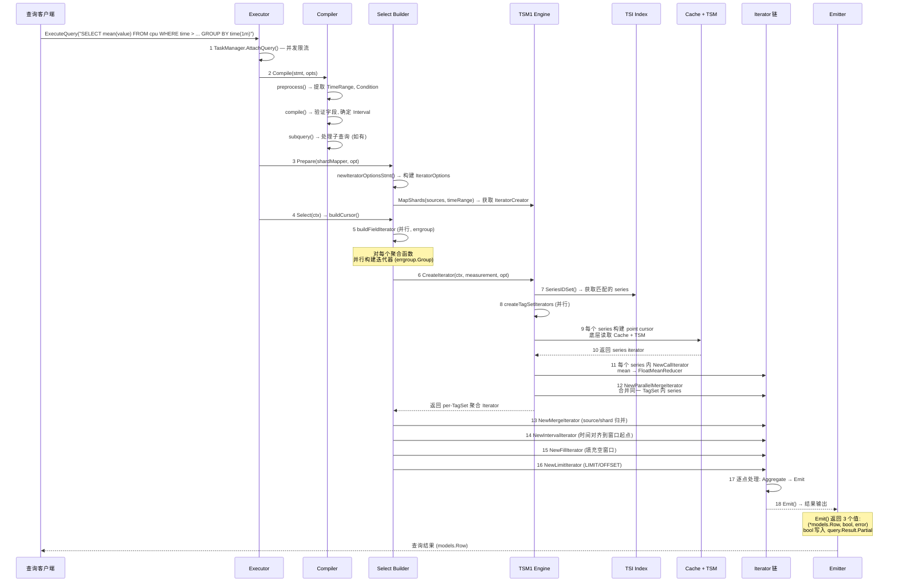

**Emitter Partial 语义**: `Emitter.Emit()` 返回的第二个 `bool` 由 `StatementExecutor`
调用方写入 `query.Result.Partial`（emitter.go 本身不设置 `query.Result.Partial`），
表示后续还会继续发送同一查询的结果批次。`models.Row.Partial` 是另一层含义：只有同一个
series 因 `chunkSize` 被切开时，`Emitter` 才会把当前 row 标记为 partial (emitter.go:61)。

### 1.2 每一步的代码实现

#### 步骤 1: TaskManager — 并发限流

```go
// query/task_manager.go — TaskManager
type TaskManager struct {
    QueryTimeout         time.Duration
    LogQueriesAfter      time.Duration
    LogTimedoutQueries   bool
    MaxConcurrentQueries int
    Logger               *zap.Logger

    queries  map[uint64]*Task
    nextID   uint64
    mu       sync.RWMutex
    shutdown bool
}
```

**限流机制**: 当并发查询数超过 `MaxConcurrentQueries` 时，`AttachQuery` 立即返回错误 `ErrMaxConcurrentQueriesLimitExceeded`（非阻塞）。

#### 步骤 2: Compile — 查询编译

```go
// query/compile.go:106 — Compile
func Compile(stmt *influxql.SelectStatement, opt CompileOptions) (Statement, error) {
    // 1. 创建编译器并克隆语句 (避免修改原始 AST)
    c := newCompiler(opt)
    c.stmt = stmt.Clone()

    // 2. 预处理: 提取时间范围, 重写条件
    if err := c.preprocess(c.stmt); err != nil {
        return nil, err
    }

    // 3. 编译: 验证字段类型, 构建 IteratorOptions
    if err := c.compile(c.stmt); err != nil {
        return nil, err
    }
    c.stmt.TimeAlias = c.TimeFieldName
    c.stmt.Condition = c.Condition

    // 4. 后处理重写
    c.stmt.RewriteDistinct()       // DISTINCT → 内部调用
    c.stmt.RewriteTimeFields()     // 从字段列表移除 "time"
    c.stmt.RewriteRegexConditions() // 重写正则条件以利用索引

    return c, nil
}
```

**preprocess 做了什么**:
- 提取 `WHERE time > ... AND time < ...` 中的时间范围
- 将 `now()` 替换为当前时间
- 重写正则条件 (`=~`, `!~`)
- 验证 `FILL` 选项与聚合函数的兼容性
- 验证 `GROUP BY` 维度

**compile 做了什么**:
- 验证所有字段表达式的类型
- 确定 `Interval.Duration` (从 `GROUP BY time(1m)`)
- 计算 `ExtraIntervals` (用于 `FILL(linear)` 需要的额外窗口)
- 重写 `DISTINCT` 为内部实现
- 验证 `LIMIT`, `OFFSET`, `SLIMIT`, `SOFFSET` 的合法性

#### 步骤 3: Prepare — 构建 IteratorOptions

```go
// query/iterator.go:620 — newIteratorOptionsStmt
func newIteratorOptionsStmt(stmt *influxql.SelectStatement, opt SelectOptions) (IteratorOptions, error) {
    opt := IteratorOptions{
        StartTime:  timeRange.Min.UnixNano(),
        EndTime:    timeRange.Max.UnixNano(),
        Ascending:  stmt.TimeAscending(),
        Ordered:    true,  // 顶层迭代器始终有序
    }

    // Interval (GROUP BY time)
    opt.Interval.Duration, _ = stmt.GroupByInterval()
    opt.Interval.Offset, _ = stmt.GroupByOffset()

    // Dimensions (GROUP BY tag)
    opt.Dimensions = stmt.Dimensions
    opt.GroupBy = stmt.GroupBy

    // Fill
    opt.Fill = stmt.Fill
    opt.FillValue = stmt.FillValue

    // LIMIT / OFFSET / SLIMIT / SOFFSET
    opt.Limit, opt.Offset = stmt.Limit, stmt.Offset
    opt.SLimit, opt.SOffset = stmt.SLimit, stmt.SOffset

    // Location (时区)
    opt.Location = stmt.Location

    return opt, nil
}
```

#### 步骤 4: buildCursor — 构建查询游标

```go
// query/select.go:623 — buildCursor
func buildCursor(ctx context.Context, stmt *influxql.SelectStatement, ic IteratorCreator, opt IteratorOptions) (Cursor, error) {
    // 0. Tracing: 如果有 span，记录 build_cursor 调用
    span := tracing.SpanFromContext(ctx)
    if span != nil {
        span = span.StartSpan("build_cursor")
        defer span.Finish()
        span.SetLabels("statement", stmt.String())
    }

    // 1. 处理 FILL 选项
    switch opt.Fill {
    case influxql.NumberFill:
        if v, ok := opt.FillValue.(int); ok {
            opt.FillValue = int64(v)
        }
    case influxql.PreviousFill:
        opt.FillValue = SkipDefault
    }

    // 2. 构造输出字段；未 OMIT TIME 时先注入 time 列
    fields := make([]*influxql.Field, 0, len(stmt.Fields)+1)
    if !stmt.OmitTime {
        fields = append(fields, &influxql.Field{Expr: &influxql.VarRef{
            Val: "time", Type: influxql.Time,
        }})
    }

    // 3. 使用 valueMapper 进行字段去重映射
    valueMapper := newValueMapper()
    for _, f := range stmt.Fields {
        fields = append(fields, valueMapper.Map(f))
        // top/bottom 需要额外的辅助变量
        if stmt.Target != nil {
            continue
        }
        if expr, ok := f.Expr.(*influxql.Call); ok && (expr.Name == "top" || expr.Name == "bottom") {
            for i := 1; i < len(expr.Args)-1; i++ {
                nf := influxql.Field{Expr: expr.Args[i]}
                fields = append(fields, valueMapper.Map(&nf))
            }
        }
    }

    // ColumnNames() 决定最终列名/别名，必须回填到 fields。
    columns := stmt.ColumnNames()
    for i, f := range fields {
        f.Alias = columns[i]
    }

    // 4. 构造辅助字段 refs，并把 ref.String() 映射回 valueMapper 的符号名。
    var auxKeys []influxql.VarRef
    if len(valueMapper.refs) > 0 {
        opt.Aux = make([]influxql.VarRef, 0, len(valueMapper.refs))
        for ref := range valueMapper.refs {
            opt.Aux = append(opt.Aux, *ref)
        }
        sort.Sort(influxql.VarRefs(opt.Aux))
        auxKeys = make([]influxql.VarRef, len(opt.Aux))
        for i, ref := range opt.Aux {
            auxKeys[i] = valueMapper.symbols[ref.String()]
        }
    }

    // 5. 无聚合函数时: 构建辅助游标
    if len(valueMapper.calls) == 0 {
        if !hasValidType(auxKeys) {
            return newNullCursor(fields), nil
        }
        itr, err := buildAuxIterator(ctx, ic, stmt.Sources, opt)
        if err != nil { return nil, err }
        keys := []influxql.VarRef{{}}
        keys = append(keys, auxKeys...)
        scanner := NewIteratorScanner(itr, keys, opt.FillValue)
        return newScannerCursor(scanner, fields, opt), nil
    }

    // 6. 判断是否为 selector 查询
    selector := len(valueMapper.calls) == 1
    if selector {
        for call := range valueMapper.calls {
            if !influxql.IsSelector(call) {
                selector = false
            }
        }
    }

    // 7. 有聚合函数时: 并行构建迭代器
    var g errgroup.Group
    var mu sync.Mutex
    scanners := make([]IteratorScanner, 0, len(valueMapper.calls))
    for call := range valueMapper.calls {
        call := call
        driver := valueMapper.table[call]
        if driver.Type == influxql.Unknown {
            continue
        }
        g.Go(func() error {
            itr, err := buildFieldIterator(ctx, call, ic, stmt.Sources, opt, selector, stmt.Target != nil)
            if err != nil { return err }
            keys := make([]influxql.VarRef, 0, len(auxKeys)+1)
            keys = append(keys, driver)
            keys = append(keys, auxKeys...)
            scanner := NewIteratorScanner(itr, keys, opt.FillValue)
            mu.Lock()
            scanners = append(scanners, scanner)
            mu.Unlock()
            return nil
        })
    }
    if err := g.Wait(); err != nil {
        for _, s := range scanners {
            s.Close()
        }
        return nil, err
    }

    // 8. 创建 Cursor
    if len(scanners) == 0 {
        return newNullCursor(fields), nil
    }
    if len(scanners) == 1 {
        return newScannerCursor(scanners[0], fields, opt), nil
    }
    return newMultiScannerCursor(scanners, fields, opt), nil
}
```

#### 步骤 5: buildCallIterator — 聚合函数分发

```go
// query/select.go:214 — buildCallIterator
func (b *exprIteratorBuilder) buildCallIterator(ctx context.Context, expr *influxql.Call) (Iterator, error) {
    // 关键: 剥离 LIMIT/OFFSET (由外层处理)
    opt := b.opt
    opt.Limit, opt.Offset = 0, 0

    switch expr.Name {
    // ── 外层 switch: 直接处理的函数 (不经过 callIterator) ──

    case "distinct":
        // distinct 需要有序输入
        opt.Ordered = true
        input, _ := buildExprIterator(ctx, expr.Args[0].(*influxql.VarRef), ...)
        input, _ = NewDistinctIterator(input, opt)
        return NewIntervalIterator(input, opt), nil

    case "sample":
        // sample 使用流式 reduce (newFloatReduceFloatIterator)
        opt.Ordered = true
        input, _ := buildExprIterator(ctx, expr.Args[0], ...)
        size := expr.Args[1].(*influxql.IntegerLiteral)
        return newSampleIterator(input, opt, int(size.Val))

    case "holt_winters", "holt_winters_with_fit":
        // 需要无界时间范围来捕获所有聚合结果
        opt.StartTime, opt.EndTime = influxql.MinTime, influxql.MaxTime
        opt.Interval = Interval{}
        return newHoltWintersIterator(input, opt, h, m, includeFitData, interval)

    case "count_hll", "derivative", "non_negative_derivative",
         "difference", "non_negative_difference",
         "moving_average", "exponential_moving_average",
         "double_exponential_moving_average", "triple_exponential_moving_average",
         "relative_strength_index", "triple_exponential_derivative",
         "kaufmans_efficiency_ratio", "kaufmans_adaptive_moving_average",
         "chande_momentum_oscillator", "elapsed":
        // 这些函数需要有序输入，可能需要扩展 StartTime
        opt.Ordered = true
        input, _ := buildExprIterator(ctx, expr.Args[0], ...)
        switch expr.Name {
        case "count_hll":
            return NewCountHllIterator(input, opt)
        case "derivative", "non_negative_derivative":
            return newDerivativeIterator(input, opt, interval, isNonNegative)
        case "elapsed":
            return newElapsedIterator(input, opt, interval)
        case "difference", "non_negative_difference":
            return newDifferenceIterator(input, opt, isNonNegative)
        case "moving_average":
            return newMovingAverageIterator(input, int(n.Val), opt)
        case "exponential_moving_average", ...:
            return newExponentialMovingAverageIterator(input, ...)
        case "kaufmans_efficiency_ratio", ...:
            return newKaufmansEfficiencyRatioIterator(input, ...)
        case "chande_momentum_oscillator":
            return newChandeMomentumOscillatorIterator(input, ...)
        }

    case "cumulative_sum":
        return newCumulativeSumIterator(input, opt)

    case "integral":
        return newIntegralIterator(input, opt, interval)

    case "top":
        // top 使用最小堆 + 可选的 max 预聚合
        n := expr.Args[len(expr.Args)-1].(*influxql.IntegerLiteral)
        return newTopIterator(input, opt, int(n.Val), b.writeMode)

    case "bottom":
        // bottom 使用最大堆 + 可选的 min 预聚合
        n := expr.Args[len(expr.Args)-1].(*influxql.IntegerLiteral)
        return newBottomIterator(input, b.opt, int(n.Val), b.writeMode)

    // ── 内层 block: 经过 callIterator 的简单聚合 ──

    default:
        itr, err := func() (Iterator, error) {
            switch expr.Name {
            case "count":
                // count(distinct(...)) 特殊路径
                if arg0, ok := expr.Args[0].(*influxql.Call); ok && arg0.Name == "distinct" {
                    return newCountIterator(input, opt)
                }
                fallthrough
            case "min", "max", "sum", "first", "last", "mean", "sum_hll", "merge_hll":
                return b.callIterator(ctx, expr, opt)  // → 创建 Reducer
            case "median":
                // median 需要有序输入，使用独立迭代器
                opt.Ordered = true
                return newMedianIterator(input, opt)
            case "mode":
                return NewModeIterator(input, opt)
            case "stddev":
                return newStddevIterator(input, opt)
            case "spread":
                return newSpreadIterator(input, opt)
            case "percentile":
                opt.Ordered = true
                return newPercentileIterator(input, opt, percentile)
            }
        }()

        // 后处理: IntervalIterator + FillIterator
        if !b.selector || !opt.Interval.IsZero() {
            itr = NewIntervalIterator(itr, opt)
            if !opt.Interval.IsZero() && opt.Fill != influxql.NoFill {
                itr = NewFillIterator(itr, expr, opt)
            }
        }
        return itr, nil
    }
}
```

#### 步骤 5b: callIterator — 构建聚合迭代器

```go
// query/select.go:577 — callIterator
func (b *exprIteratorBuilder) callIterator(ctx context.Context, expr *influxql.Call, opt IteratorOptions) (Iterator, error) {
    inputs := make([]Iterator, 0, len(b.sources))
    if err := func() error {
        for _, source := range b.sources {
            switch source := source.(type) {
            case *influxql.Measurement:
                input, err := b.ic.CreateIterator(ctx, source, opt)
                if err != nil {
                    return err
                }
                inputs = append(inputs, input)

            case *influxql.SubQuery:
                // 子查询源不要求底层 iterator 保持全局有序；先为子查询表达式构建输入。
                opt.Ordered = false
                input, err := buildExprIterator(ctx, expr.Args[0], b.ic, []influxql.Source{source}, opt, b.selector, false)
                if err != nil {
                    return err
                }

                // 当前源码在 callIterator 内显式包一层 NewCallIterator。
                i, err := NewCallIterator(input, opt)
                if err != nil {
                    input.Close()
                    return err
                }
                inputs = append(inputs, i)
            }
        }
        return nil
    }(); err != nil {
        Iterators(inputs).Close()
        return nil, err
    }

    itr, err := Iterators(inputs).Merge(opt)
    if err != nil {
        Iterators(inputs).Close()
        return nil, err
    } else if itr == nil {
        itr = &nilFloatIterator{}
    }
    return itr, nil
}
```

**注意**: measurement 源直接交给 `IteratorCreator.CreateIterator`；`*influxql.SubQuery`
源会在 `callIterator` 内通过 `buildExprIterator` 构建子查询输入，然后显式调用
`NewCallIterator(input, opt)` 包装。任一构建步骤失败时，源码会调用
`Iterators(inputs).Close()` 清理已创建输入；`Iterators(inputs).Merge(opt)` 失败时也会关闭 inputs。
count() 在多 shard 合并时改用 sum() 的逻辑仍在 `Iterators.Merge()` 中。普通 measurement
聚合的 `NewCallIterator` 不在 select.go 外层直接包 `ArrayCursor`，而是在 TSM1
`Engine.createCallIterator` 中对每个 series iterator 先包一层 `CallIterator`，再用
`NewParallelMergeIterator` 合并同一 TagSet；select.go 外层主要负责 source/shard merge、
Interval、Fill、Limit。详见第 4.1 节。

#### 步骤 5c: 后处理 — IntervalIterator + FillIterator

```go
// query/select.go:565 — 后处理
if !b.selector || !opt.Interval.IsZero() {
    // IntervalIterator: 将时间对齐到窗口起点
    itr = NewIntervalIterator(itr, opt)

    // FillIterator: 填充空窗口
    if !opt.Interval.IsZero() && opt.Fill != influxql.NoFill {
        itr = NewFillIterator(itr, expr, opt)
    }
}

// InterruptIterator: 查询取消支持
if opt.InterruptCh != nil {
    itr = NewInterruptIterator(itr, opt.InterruptCh)
}
```

**迭代器链的组装顺序**:

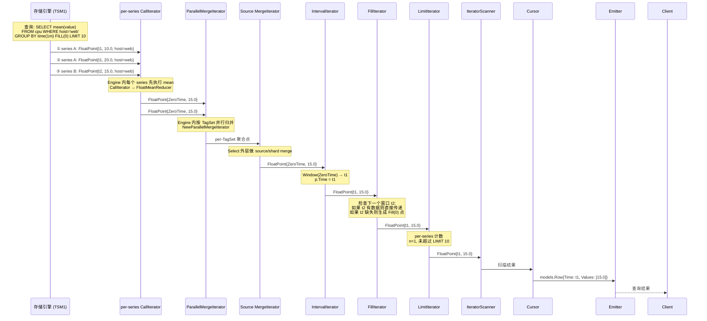

#### Storage Reads ArrayCursor 合并 Cache + TSM 数据 — 序列图

这一节描述的是 TSM1 / storage reads 的 typed array cursor 底层读取方式，不是
InfluxQL `Engine.CreateIterator` 的外层 point iterator 结构。InfluxQL 会先构建
`query.Iterator`，需要读取某个 series/field 时才进入这里的 `arrayCursorIterator`
和 `KeyCursor`。

```mermaid
sequenceDiagram
    participant Engine as TSM1 Engine
    participant KC as KeyCursor
    participant Cache as Cache (内存)
    participant TSM as TSM File (磁盘)
    participant AEC as ArrayAscendingCursor
    participant Merged as Merged ArrayCursor

    Engine->>KC: newKeyCursor(key, tsmFiles, ascending)
    KC->>KC: 读取 TSM Index (内存 mmap)<br>确定每个文件的 block 位置

    Note over KC: 构建 cursor 叠加顺序:<br>1. Cache (最新数据)<br>2. TSM files (按时间倒序, 新→旧)

    KC->>Cache: ① cache.Values(key)
    Cache->>Cache: 读取 live cache entry
    Cache->>Cache: 如果存在 snapshot<br/>同时读取 snapshot cache entry
    Cache->>Cache: snapshot + live 合并后 Deduplicate
    Cache-->>KC: []Value{t1:10, t2:20, t3:30}

    KC->>TSM: ② 读取 TSM block (mmap)
    TSM-->>KC: []Value{t0:5, t1:8, t2:15}

    Note over KC: 创建 Cursor 链:<br>Cache cursor 在最上层<br>TSM cursor 在下层

    KC->>AEC: newFloatArrayAscendingCursor(cacheValues)
    KC->>AEC: newFloatArrayAscendingCursor(tsmValues)

    Note over Merged: 合并策略: Cache 覆盖 TSM<br>相同时间戳取 Cache 中的值

    Merged->>Cache: ③ Next() → [t0:5] (TSM)
    Note over Merged: Cache 没有 t0, 从 TSM 读取

    Merged->>Cache: ④ Next() → [t1:10] (Cache 覆盖)
    Note over Merged: Cache 和 TSM 都有 t1<br>Cache 优先 (更新的数据)

    Merged->>Cache: ⑤ Next() → [t2:20] (Cache 覆盖)
    Merged->>Cache: ⑥ Next() → [t3:30] (仅 Cache)

    Merged-->>Engine: 批量返回 (每次最多 1000 个值)
    Note over Engine: ArrayCursor 批量读取减少<br>函数调用开销, 提升吞吐
```

**关键设计点**:
- Cache 始终在 TSM 之上，相同时间戳取 Cache 的值（Cache 是最新未持久化的写入）
- `Cache.Values` 会同时读取 snapshot cache 和 live cache；snapshot 写 TSM 期间，新写入进入 live cache，查询需要同时看到两边
- TSM 文件按时间倒序叠加，最新的文件在最上层（compaction 可能产生重叠）
- ArrayCursor 每次批量返回最多 1000 个值，减少 per-point 函数调用开销
- 所有底层数据通过 mmap 访问，OS page cache 负责热数据缓存

## 2. 聚合算子详解

> **具体案例**: 执行 `SELECT mean(value) FROM cpu WHERE time >= '10:00' AND time < '10:03' GROUP BY time(1m)`
>
> 假设原始数据（每秒一个点）：
> ```
> 时间      value
> 10:00:00  10.0
> 10:00:30  20.0
> 10:01:00  30.0
> 10:01:30  40.0
> 10:02:00  50.0
> 10:02:30  60.0
> ```
>
> Iterator 链处理过程：
> ```
> 1. 存储层 Iterator: 读取 6 个原始点
> 2. Merge Iterator: 多 Shard 归并（假设只有 1 个 Shard，直接传递）
> 3. Call Iterator (mean):
>    - 窗口 [10:00, 10:01): 点 [10.0, 20.0] → mean = 15.0
>    - 窗口 [10:01, 10:02): 点 [30.0, 40.0] → mean = 35.0
>    - 窗口 [10:02, 10:03): 点 [50.0, 60.0] → mean = 55.0
> 4. Interval Iterator: 时间对齐到窗口起点
>    - (ZeroTime, 15.0) → (10:00:00, 15.0)
>    - (ZeroTime, 35.0) → (10:01:00, 35.0)
>    - (ZeroTime, 55.0) → (10:02:00, 55.0)
> 5. Fill Iterator: 无空窗口，不填充
> 6. Emitter: 输出结果
> ```
>
> 最终结果：
> ```
> time                 mean
> 2024-01-01T10:00:00Z 15.0
> 2024-01-01T10:01:00Z 35.0
> 2024-01-01T10:02:00Z 55.0
> ```

### 2.1 聚合算子分类

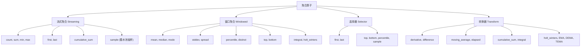

### 2.2 Reducer 接口

```go
// query/functions.gen.go — 聚合器接口
type FloatPointAggregator interface {
    AggregateFloat(p *FloatPoint)
}

type FloatPointEmitter interface {
    Emit() []FloatPoint
}
```

**两种 Reducer 模式**:

| 模式 | 结构 | 适用场景 | 内存 |
|------|------|----------|------|
| **FuncReducer** (流式) | `(prev, curr) -> result` | count, sum, min, max, first, last | O(1) |
| **SliceFuncReducer** (窗口) | `[]points -> result` | stddev, percentile, median, mode | O(N) |

### 2.3 流式聚合 — FloatFuncReducer

```go
// query/functions.gen.go:48 — FloatFuncReducer
type FloatFuncReducer struct {
    prev *FloatPoint
    fn   FloatReduceFunc  // func(prev, curr *FloatPoint) (int64, float64, []interface{})
}

func (r *FloatFuncReducer) AggregateFloat(p *FloatPoint) {
    // 调用具体的 reduce 函数
    t, v, aux := r.fn(r.prev, p)

    // 更新 prev
    if r.prev == nil {
        r.prev = &FloatPoint{}
    }
    r.prev.Time = t
    r.prev.Value = v
    r.prev.Aux = aux

    // 累加 Aggregated 计数
    if p.Aggregated > 1 {
        r.prev.Aggregated += p.Aggregated
    } else {
        r.prev.Aggregated++
    }
}

func (r *FloatFuncReducer) Emit() []FloatPoint {
    return []FloatPoint{*r.prev}
}
```

### 2.4 窗口聚合 — FloatSliceFuncReducer

```go
// query/functions.gen.go:85 — FloatSliceFuncReducer
type FloatSliceFuncReducer struct {
    points []FloatPoint
    fn     FloatReduceSliceFunc  // func(a []FloatPoint) []FloatPoint
}

func (r *FloatSliceFuncReducer) AggregateFloat(p *FloatPoint) {
    // 克隆并追加到缓冲区
    r.points = append(r.points, *p.Clone())
}

func (r *FloatSliceFuncReducer) Emit() []FloatPoint {
    // 在整个窗口的数据上调用 reduce 函数
    return r.fn(r.points)
}
```

### 2.5 所有聚合算子的详细实现

#### COUNT — 计数

> **小白解释**: COUNT 就是数数——数一数有多少个数据点。
> 注意：NULL 值不算！就像数苹果时，空篮子不算一个苹果。
>
> 多 Shard 合并时的巧妙设计：每个 Shard 先各自数一遍（count=3, count=5），
> 然后把结果**相加**（sum=8）。这就是为什么 count 在多 Shard 合并时用 sum。

```go
// query/call_iterator.go:102 — FloatCountReduce
func FloatCountReduce(prev *IntegerPoint, curr *FloatPoint) (int64, int64, []interface{}) {
    if prev == nil {
        return ZeroTime, 1, nil  // 第一个点: count = 1
    }
    return ZeroTime, prev.Value + 1, nil  // 后续: count++
}
```

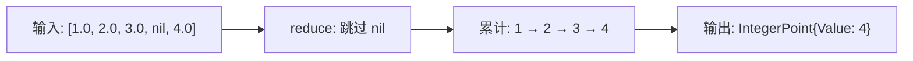

**关键细节**:
- COUNT 计算的是**点数**，不是值
- NULL 值在 `reduce()` 方法中被跳过（`if p.Nil { continue }`）
- COUNT 的结果类型是 Integer，不是 Float
- 多 shard 合并时，每个 shard 的 count 通过 **sum** 汇总

**多 shard COUNT 合并**:

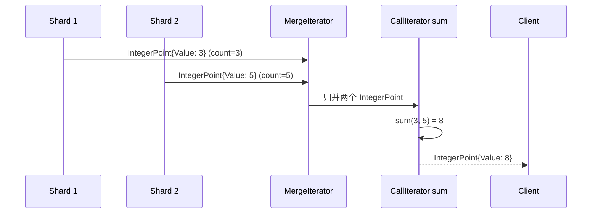

**为什么 count 改用 sum？** 每个 shard 已经独立执行了 count，得到的是部分计数。最终结果需要将所有部分计数相加，这就是 sum 的语义。代码在 `query/iterator.go:140`：

```go
if call.Name == "count" {
    opt.Expr = &influxql.Call{Name: "sum", Args: call.Args}
}
```

#### SUM — 求和

```go
// query/call_iterator.go:296 — FloatSumReduce
func FloatSumReduce(prev, curr *FloatPoint) (int64, float64, []interface{}) {
    if prev == nil {
        return ZeroTime, curr.Value, nil  // 第一个点: sum = value
    }
    return prev.Time, prev.Value + curr.Value, nil  // 后续: sum += value
}
```

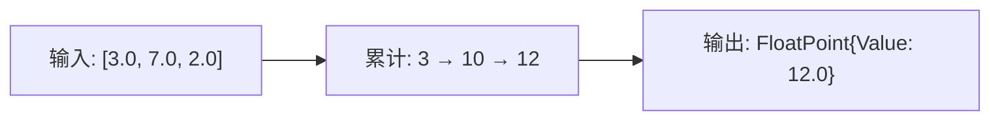

#### MIN / MAX — 最小值 / 最大值

```go
// query/call_iterator.go:174 — FloatMinReduce
func FloatMinReduce(prev, curr *FloatPoint) (int64, float64, []interface{}) {
    if prev == nil || curr.Value < prev.Value ||
       (curr.Value == prev.Value && curr.Time < prev.Time) {
        return curr.Time, curr.Value, cloneAux(curr.Aux)
    }
    return prev.Time, prev.Value, prev.Aux
}

// query/call_iterator.go:238 — FloatMaxReduce
func FloatMaxReduce(prev, curr *FloatPoint) (int64, float64, []interface{}) {
    if prev == nil || curr.Value > prev.Value ||
       (curr.Value == prev.Value && curr.Time < prev.Time) {
        return curr.Time, curr.Value, cloneAux(curr.Aux)
    }
    return prev.Time, prev.Value, prev.Aux
}
```

**相同值时的平局处理**: 选择**时间戳更早**的点。这意味着 min/max 是确定性的——相同的输入总是产生相同的输出。

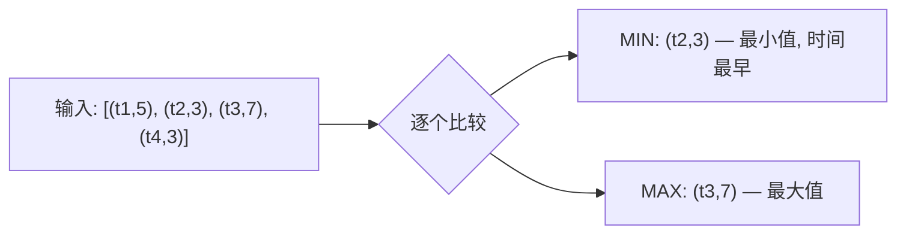

#### FIRST / LAST — 最早 / 最晚

```go
// query/call_iterator.go:358 — FloatFirstReduce
func FloatFirstReduce(prev, curr *FloatPoint) (int64, float64, []interface{}) {
    if prev == nil || curr.Time < prev.Time ||
       (curr.Time == prev.Time && curr.Value > prev.Value) {
        return curr.Time, curr.Value, cloneAux(curr.Aux)
    }
    return prev.Time, prev.Value, prev.Aux
}

// query/call_iterator.go:436 — FloatLastReduce
func FloatLastReduce(prev, curr *FloatPoint) (int64, float64, []interface{}) {
    if prev == nil || curr.Time > prev.Time ||
       (curr.Time == prev.Time && curr.Value > prev.Value) {
        return curr.Time, curr.Value, cloneAux(curr.Aux)
    }
    return prev.Time, prev.Value, prev.Aux
}
```

**FIRST**: 选择时间戳最小的点。相同时间戳时选择值更大的。
**LAST**: 选择时间戳最大的点。相同时间戳时选择值更大的。

**FIRST/LAST 是选择器 (Selector)**: 它们返回的是原始点的时间和值，而不是计算结果。这意味着 `SELECT first(value) FROM cpu GROUP BY time(1m)` 返回的是每个窗口中最早的那个实际数据点。

#### MEAN — 均值

> **小白解释**: MEAN 就是算平均值——把所有数加起来，除以个数。
> 但多 Shard 合并时有个巧妙设计：每个 Shard 先算出自己的均值，但同时记录"我算了几个数"（Aggregated 字段）。
> 合并时，用 `均值 × 个数` 还原出总和，再把所有 Shard 的总和相加，除以总个数。
> 就像两个班的平均分：一班平均 80 分 30 人，二班平均 90 分 20 人，总平均 = (80×30 + 90×20) / 50 = 84。

```go
// query/functions.go:98 — FloatMeanReducer
type FloatMeanReducer struct {
    sum   float64
    count uint32
}

func (r *FloatMeanReducer) AggregateFloat(p *FloatPoint) {
    if p.Aggregated >= 2 {
        // 已经是聚合结果 (来自其他 shard 的 count)
        r.sum += p.Value * float64(p.Aggregated)
        r.count += p.Aggregated
    } else {
        r.sum += p.Value
        r.count++
    }
}

func (r *FloatMeanReducer) Emit() []FloatPoint {
    return []FloatPoint{{
        Time:       ZeroTime,  // 由 IntervalIterator 替换为窗口起点
        Value:      r.sum / float64(r.count),
        Aggregated: r.count,
    }}
}
```

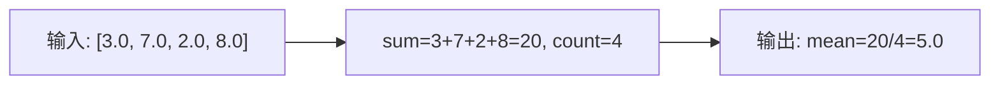

**Aggregated 字段的作用**: 当多个 shard 合并时，每个 shard 的 mean 已经被转换为 sum (通过 `p.Value * p.Aggregated`)。合并层的 mean reducer 可以正确地加权计算总均值。

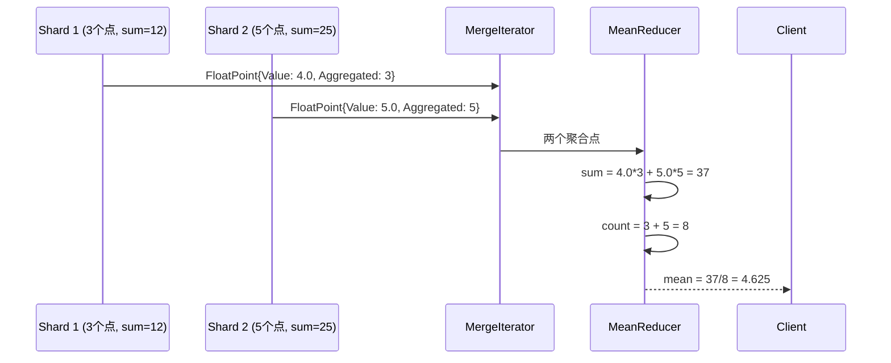

#### STDDEV — 标准差

```go
// query/call_iterator.go:849 — FloatStddevReduceSlice
func FloatStddevReduceSlice(a []FloatPoint) []FloatPoint {
    if len(a) < 2 {
        return []FloatPoint{{Time: ZeroTime, Value: math.NaN()}}
    }

    // 第一遍: 计算均值 (Welford 在线算法)
    var mean float64
    var count int
    for _, p := range a {
        if math.IsNaN(p.Value) { continue }
        count++
        mean += (p.Value - mean) / float64(count)
    }

    // 第二遍: 计算方差
    var variance float64
    for _, p := range a {
        if math.IsNaN(p.Value) { continue }
        variance += math.Pow(p.Value-mean, 2)
    }

    // 返回样本标准差 (Bessel 修正)
    return []FloatPoint{{
        Time:  ZeroTime,
        Value: math.Sqrt(variance / float64(count-1)),
    }}
}
```

**STDDEV 是窗口聚合**: 需要缓冲整个窗口的所有点（O(N) 内存），使用两遍算法。返回**样本标准差**（除以 N-1），不是总体标准差（除以 N）。

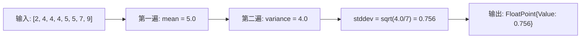

#### PERCENTILE — 百分位数

```go
// query/call_iterator.go:1050 — NewFloatPercentileReduceSliceFunc
func NewFloatPercentileReduceSliceFunc(percentile float64) FloatReduceSliceFunc {
    return func(a []FloatPoint) []FloatPoint {
        length := len(a)
        // 最近排名法 (Nearest-Rank Method)
        i := int(math.Floor(float64(length)*percentile/100.0+0.5)) - 1
        if i < 0 || i >= length {
            return nil
        }
        // 按值排序
        sort.Sort(floatPointsByValue(a))
        // 返回排名第 i 的点
        return []FloatPoint{{
            Time:  a[i].Time,
            Value: a[i].Value,
            Aux:   cloneAux(a[i].Aux),
        }}
    }
}
```

**PERCENTILE 算法**: 最近排名法。对窗口内所有点按值排序，然后取第 `floor(N * percentile/100 + 0.5)` 个点。

**示例**: `percentile(value, 95)` 在 100 个点的窗口中，取第 `floor(100*95/100+0.5) - 1 = 94` 个点（0-indexed）。

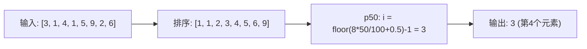

#### SPREAD — 极差

```go
// query/functions.go:190 — FloatSpreadReducer
type FloatSpreadReducer struct {
    min, max float64
    count    uint32
}

func (r *FloatSpreadReducer) AggregateFloat(p *FloatPoint) {
    r.min = math.Min(r.min, p.Value)
    r.max = math.Max(r.max, p.Value)
    r.count++
}

func (r *FloatSpreadReducer) Emit() []FloatPoint {
    return []FloatPoint{{
        Time:       ZeroTime,
        Value:      r.max - r.min,
        Aggregated: r.count,
    }}
}
```

初始化: `min = math.Inf(1)` (+Inf), `max = math.Inf(-1)` (-Inf)。结果 = max - min。

#### DISTINCT — 去重

```go
// query/functions.gen.go:399 — FloatDistinctReducer
type FloatDistinctReducer struct {
    m map[float64]FloatPoint  // 用 map 去重
}

func (r *FloatDistinctReducer) AggregateFloat(p *FloatPoint) {
    if _, ok := r.m[p.Value]; !ok {
        r.m[p.Value] = *p  // 只保留第一次出现的
    }
}

func (r *FloatDistinctReducer) Emit() []FloatPoint {
    points := make([]FloatPoint, 0, len(r.m))
    for _, p := range r.m {
        points = append(points, FloatPoint{Time: p.Time, Value: p.Value})
    }
    sort.Sort(floatPoints(points))  // 按时间排序
    return points
}
```

**DISTINCT 返回多个点**: 与其他聚合不同，DISTINCT 在一个窗口内可能返回多个点（每个唯一值一个）。

#### TOP / BOTTOM — 前 N / 后 N

```go
// query/functions.go:1878 — FloatTopReducer
type FloatTopReducer struct {
    h *floatPointsByFunc  // 最小堆
}

func NewFloatTopReducer(n int) *FloatTopReducer {
    return &FloatTopReducer{
        h: floatPointsSortBy(make([]FloatPoint, 0, n), func(a, b *FloatPoint) bool {
            if a.Value != b.Value {
                return a.Value < b.Value  // 堆顶是最小值
            }
            return a.Time > b.Time  // 相同值时时间晚的在堆顶
        }),
    }
}

func (r *FloatTopReducer) AggregateFloat(p *FloatPoint) {
    if r.h.Len() == cap(r.h.points) {
        // 堆已满: 如果新点比堆顶大，替换堆顶
        if !r.h.cmp(&r.h.points[0], p) {
            return
        }
        p.CopyTo(&r.h.points[0])
        heap.Fix(r.h, 0)  // 重新调整堆
        return
    }
    // 堆未满: 直接加入
    var clone FloatPoint
    p.CopyTo(&clone)
    heap.Push(r.h, clone)
}

func (r *FloatTopReducer) Emit() []FloatPoint {
    points := make([]FloatPoint, len(r.h.points))
    // 重置每个点的 Aggregated 计数 (top/bottom 不是聚合结果)
    for i, p := range r.h.points {
        p.Aggregated = 0
        points[i] = p
    }
    // 按值降序排列
    sort.Sort(sort.Reverse(&floatPointsByFunc{points: points, cmp: r.h.cmp}))
    return points
}
```

**TOP 使用最小堆**: 维护一个大小为 N 的最小堆。堆顶是当前 Top N 中的最小值。当新点比堆顶大时，替换堆顶并重新调整。时间复杂度 O(M log N)，其中 M 是总点数。

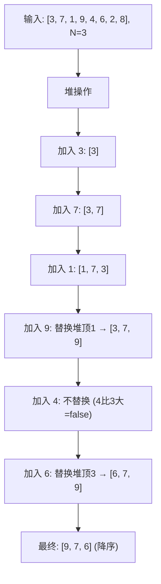

#### SAMPLE — 蓄水池抽样

```go
// query/functions.gen.go:453 — FloatSampleReducer
type FloatSampleReducer struct {
    count  int
    rng    *rand.Rand
    points floatPoints  // 蓄水池
}

func (r *FloatSampleReducer) AggregateFloat(p *FloatPoint) {
    r.count++
    if r.count-1 < len(r.points) {
        // 蓄水池未满: 直接填入
        p.CopyTo(&r.points[r.count-1])
        return
    }
    // 蓄水池已满: 以 size/count 的概率替换
    rnd := r.rng.Intn(r.count)
    if rnd < len(r.points) {
        p.CopyTo(&r.points[rnd])
    }
}
```

**蓄水池抽样算法 (Reservoir Sampling)**: 保证每个点被选中的概率相等，均为 `size/count`。对于流式数据，这是最优的随机抽样算法。

#### DERIVATIVE — 导数

```go
// query/functions.go:277 — FloatDerivativeReducer
type FloatDerivativeReducer struct {
    interval      Interval
    prev          FloatPoint
    curr          FloatPoint
    isNonNegative bool
    ascending     bool
}

// NewFloatDerivativeReducer 构造函数: 接受 interval, isNonNegative, ascending 三个参数
// prev 和 curr 初始化为 Nil: true，表示尚未收到任何点
func NewFloatDerivativeReducer(interval Interval, isNonNegative, ascending bool) *FloatDerivativeReducer {
    return &FloatDerivativeReducer{
        interval:      interval,
        isNonNegative: isNonNegative,
        ascending:     ascending,
        prev:          FloatPoint{Nil: true},
        curr:          FloatPoint{Nil: true},
    }
}

func (r *FloatDerivativeReducer) AggregateFloat(p *FloatPoint) {
    // 跳过相同时间戳的点
    if !r.curr.Nil && r.curr.Time == p.Time {
        return
    }
    r.prev = r.curr
    r.curr = *p
}

func (r *FloatDerivativeReducer) Emit() []FloatPoint {
    if r.prev.Nil {
        return nil  // 第一个点: 无导数
    }

    diff := r.curr.Value - r.prev.Value
    elapsed := r.curr.Time - r.prev.Time
    if !r.ascending {
        elapsed = -elapsed  // 降序查询时取反
    }

    // 归一化到指定间隔
    value := diff / (float64(elapsed) / float64(r.interval.Duration))

    r.prev.Nil = true  // 重置

    // 非负导数: 丢弃负值
    if r.isNonNegative && diff < 0 {
        return nil
    }

    return []FloatPoint{{Time: r.curr.Time, Value: value}}
}
```

**DERIVATIVE 公式**: `(curr.Value - prev.Value) / ((curr.Time - prev.Time) / interval)`

**示例**: `DERIVATIVE(value, 1s)` 计算每秒的变化率。如果两个点间隔 10 秒，值差 50，则导数为 50 / (10s / 1s) = 5.0/s。

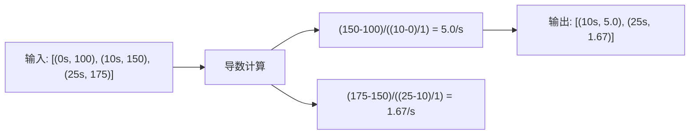

#### DIFFERENCE — 差分

```go
// query/functions.go:454 — FloatDifferenceReducer
type FloatDifferenceReducer struct {
    isNonNegative bool
    prev          FloatPoint
    curr          FloatPoint
}

func (r *FloatDifferenceReducer) Emit() []FloatPoint {
    if r.prev.Nil {
        return nil
    }
    value := r.curr.Value - r.prev.Value
    if r.isNonNegative && value < 0 {
        return nil  // 非负差分: 丢弃负值
    }
    r.prev.Nil = true
    return []FloatPoint{{Time: r.curr.Time, Value: value}}
}
```

**DIFFERENCE**: 简单的 `curr - prev`，不归一化到时间间隔。

#### MOVING_AVERAGE — 移动平均

```go
// query/functions.go:603 — FloatMovingAverageReducer
type FloatMovingAverageReducer struct {
    pos  int       // 环形缓冲区当前位置
    sum  float64   // 当前窗口的和
    time int64     // 最后一个点的时间
    buf  []float64 // 环形缓冲区
}

func (r *FloatMovingAverageReducer) AggregateFloat(p *FloatPoint) {
    if len(r.buf) != cap(r.buf) {
        // 缓冲区未满: 追加
        r.buf = append(r.buf, p.Value)
    } else {
        // 缓冲区已满: 替换最旧的值
        r.sum -= r.buf[r.pos]
        r.buf[r.pos] = p.Value
    }
    r.sum += p.Value
    r.time = p.Time
    r.pos++
    if r.pos >= cap(r.buf) {
        r.pos = 0  // 环形
    }
}

func (r *FloatMovingAverageReducer) Emit() []FloatPoint {
    // 缓冲区未满时不输出 (需要前 N 个点预热)
    if len(r.buf) != cap(r.buf) {
        return []FloatPoint{}  // 空切片 (不是 nil!)
    }
    return []FloatPoint{{
        Value:      r.sum / float64(len(r.buf)),
        Time:       r.time,
        Aggregated: uint32(len(r.buf)),
    }}
}
```

**MOVING_AVERAGE 使用环形缓冲区**: 固定大小 N 的环形缓冲区，O(1) 更新。前 N-1 个点不输出（预热期）。

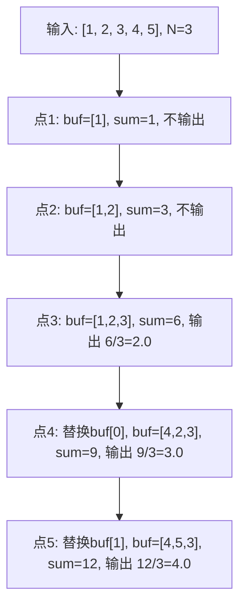

#### CUMULATIVE_SUM — 累积和

```go
// query/functions.go:1129 — FloatCumulativeSumReducer
type FloatCumulativeSumReducer struct {
    curr FloatPoint
}

func (r *FloatCumulativeSumReducer) AggregateFloat(p *FloatPoint) {
    r.curr.Value += p.Value
    r.curr.Time = p.Time
    r.curr.Nil = false
}

func (r *FloatCumulativeSumReducer) Emit() []FloatPoint {
    if !r.curr.Nil {
        return []FloatPoint{r.curr}
    }
    return nil
}
```

**CUMULATIVE_SUM**: 每个点都输出，值是到当前为止所有点的和。

#### ELAPSED — 时间间隔

```go
// query/functions.gen.go:420 — FloatElapsedReducer
type FloatElapsedReducer struct {
    unitConversion int64
    prev           FloatPoint
    curr           FloatPoint
}

func (r *FloatElapsedReducer) Emit() []IntegerPoint {
    if !r.prev.Nil {
        elapsed := (r.curr.Time - r.prev.Time) / r.unitConversion
        return []IntegerPoint{{Time: r.curr.Time, Value: elapsed}}
    }
    return nil
}
```

**ELAPSED**: 返回相邻两点的时间差（除以单位转换因子）。结果类型是 Integer。

#### HOLT_WINTERS — Holt-Winters 预测

```go
// query/functions.go:1207 — FloatHoltWintersReducer
type FloatHoltWintersReducer struct {
    m              int       // 季节周期
    seasonal       bool      // 是否季节性
    h              int       // 预测步数
    interval       int64     // 时间间隔
    halfInterval   int64     // 半间隔 (用于边界插值)
    includeFitData bool      // 是否包含拟合数据
    optim          *neldermead.Optimizer  // Nelder-Mead 优化器
    epsilon        float64   // 收敛阈值
    y              []float64 // 输入数据
    points         []FloatPoint
}
```

**HOLT_WINTERS 算法**:
1. 收集所有输入点到 `r.y` 数组
2. 在 `Emit()` 时，使用 Nelder-Mead 优化器搜索最优的 alpha, beta, gamma, phi 参数
3. 使用最优参数进行 h 步预测
4. 如果 `includeFitData`，也输出拟合值

#### EMA / DEMA / TEMA — 指数移动平均

```go
// query/functions.go:743 — ExponentialMovingAverageReducer
type ExponentialMovingAverageReducer struct {
    ema        gota.EMA  // EMA 计算器
    holdPeriod uint32    // 预热期
    count      uint32
    v          float64
    t          int64
}

func (r *ExponentialMovingAverageReducer) aggregate(v float64) {
    r.v = r.ema.Add(v)
    r.count++
}

func (r *ExponentialMovingAverageReducer) Emit() []FloatPoint {
    if r.count <= r.holdPeriod {
        return nil  // 预热期不输出
    }
    return []FloatPoint{{Value: r.v, Time: r.t, Aggregated: r.count}}
}
```

**DEMA (双重 EMA)**: `DEMA = 2 * EMA(x) - EMA(EMA(x))`
**TEMA (三重 EMA)**: `TEMA = 3*EMA(x) - 3*EMA(EMA(x)) + EMA(EMA(EMA(x)))`

#### 其他技术指标函数

| 函数 | 说明 | 构造函数 |
|------|------|----------|
| `relative_strength_index` | RSI 相对强弱指标 | `newRelativeStrengthIndexIterator()` |
| `triple_exponential_derivative` | TRIX 三重指数导数 | `newTripleExponentialDerivativeIterator()` |
| `kaufmans_efficiency_ratio` | KER 考夫曼效率比 | `newKaufmansEfficiencyRatioIterator()` |
| `kaufmans_adaptive_moving_average` | KAMA 考夫曼自适应均线 | `newKaufmansAdaptiveMovingAverageIterator()` |
| `chande_momentum_oscillator` | CMO 钱德动量振荡器 | `newChandeMomentumOscillatorIterator()` |
| `mode` | 众数 (出现频率最高的值) | `NewModeIterator()` |

这些函数都在 `buildCallIterator` 的外层 switch 中处理，使用 `gota` 库进行技术指标计算。

#### INTEGRAL — 积分

```go
// query/functions.go:1557 — FloatIntegralReducer
type FloatIntegralReducer struct {
    interval Interval        // 时间间隔
    sum      float64         // 累积积分值
    prev     FloatPoint      // 上一个点 (Nil: true 初始状态)
    window   struct {
        start int64
        end   int64
    }
    ch  chan FloatPoint       // 用于 Emit 的通道
    opt IteratorOptions
}

func NewFloatIntegralReducer(interval Interval, opt IteratorOptions) *FloatIntegralReducer {
    return &FloatIntegralReducer{
        interval: interval,
        prev:     FloatPoint{Nil: true},
        ch:       make(chan FloatPoint, 1),
        opt:      opt,
    }
}

// 注意: FloatIntegralReducer 使用通道 (ch) 进行 Emit，
// 因为积分可能产生多个输出点 (每个窗口一个)。
```

**积分算法**: 梯形法则 (Trapezoidal Rule)。对于相邻两点 (t1, v1) 和 (t2, v2)，积分贡献为 `(v1 + v2) / 2 * (t2 - t1)`。

### 2.6 Reduce Iterator — 窗口聚合的核心

```go
// query/iterator.gen.go:996 — floatReduceFloatIterator
type floatReduceFloatIterator struct {
    input    *bufFloatIterator
    create   func() (FloatPointAggregator, FloatPointEmitter)
    dims     []string
    opt      IteratorOptions
    points   []FloatPoint
    keepTags bool
}
```

**reduce() 方法 — 窗口聚合的核心逻辑**:

```go
// query/iterator.gen.go:1047 — reduce
func (itr *floatReduceFloatIterator) reduce() ([]FloatPoint, error) {
    // 1. 读取第一个非 nil 点，确定窗口
    p := itr.input.peek()
    startTime, endTime := itr.opt.Window(p.Time)

    // 2. 确定当前的 name 和 tags (按维度分组)
    window.name = p.Name
    window.tags = p.Tags.Subset(itr.opt.Dimensions)

    // 3. 为每个 series 创建独立的 Aggregator/Emitter
    seriesMap := map[string]*floatReduceFloatPoint{}

    // 4. 读取窗口内的所有点
    for {
        curr, err := itr.input.NextInWindow(startTime, endTime)
        if curr == nil { break }

        // 检查是否跨越了不同的 series
        if curr.Name != window.name { break }
        if curr.Tags.Subset(itr.opt.Dimensions).ID() != window.tags { break }

        // 获取或创建该 series 的 aggregator
        key := curr.Tags.Subset(itr.dims).ID()
        rp, ok := seriesMap[key]
        if !ok {
            aggregator, emitter := itr.create()
            rp = &floatReduceFloatPoint{
                Name:       curr.Name,
                Tags:       curr.Tags.Subset(itr.dims),
                Aggregator: aggregator,
                Emitter:    emitter,
            }
            seriesMap[key] = rp
        }

        // 调用聚合器
        if !curr.Nil {
            rp.Aggregator.AggregateFloat(curr)
        }
    }

    // 5. 从所有 aggregator 收集结果
    var points []FloatPoint
    for _, rp := range seriesMap {
        pts := rp.Emitter.Emit()
        for i := range pts {
            pts[i].Name = rp.Name
            pts[i].Tags = rp.Tags
            // 替换 ZeroTime 为窗口起点
            if pts[i].Time == ZeroTime {
                pts[i].Time = startTime
            }
        }
        points = append(points, pts...)
    }

    // 6. 排序
    if itr.opt.Ordered {
        sort.Sort(floatPoints(points))
    }

    return points, nil
}
```

> **小白解释**: reduce() 就像一个"分组计票站"。
> 数据流进来后，先按时间窗口分组（每分钟一组），再按 series 分组（每个 host 一组）。
> 每组有一个计票员（Aggregator），负责统计这组的数据。
> 窗口结束后，计票员交出结果（Emit），所有结果合并排序后输出。

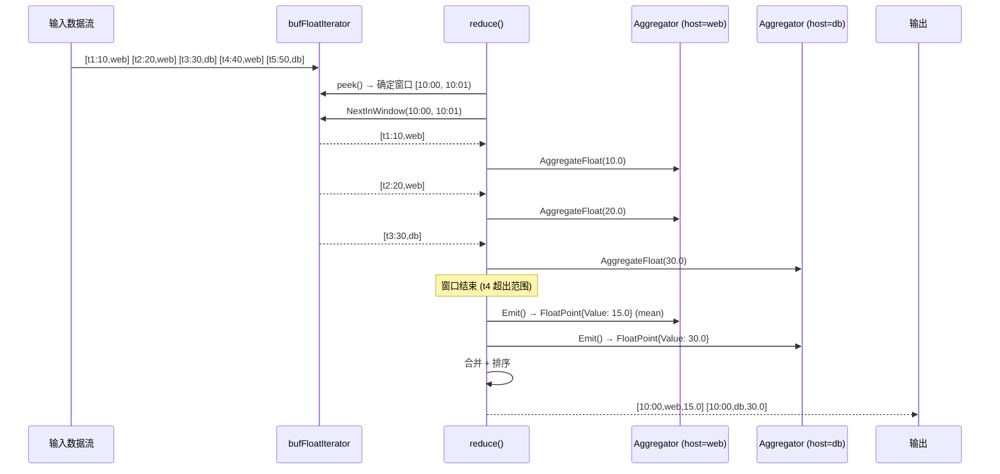

**NextInWindow — 窗口边界检测**:

```go
// query/iterator.gen.go:94 — bufFloatIterator.NextInWindow
func (itr *bufFloatIterator) NextInWindow(startTime, endTime int64) (*FloatPoint, error) {
    v, err := itr.Next()
    if v == nil || err != nil {
        return nil, err
    }
    // 如果点超出窗口范围，unread 并返回 nil
    if t := v.Time; t >= endTime || t < startTime {
        itr.unread(v)
        return nil, nil
    }
    return v, nil
}
```

### 2.7 Stream Iterator — 流式聚合

```go
// query/iterator.gen.go:1163 — floatStreamFloatIterator
type floatStreamFloatIterator struct {
    input    *bufFloatIterator
    create   func() (FloatPointAggregator, FloatPointEmitter)
    dims     []string
    opt      IteratorOptions
    m        map[string]*floatReduceFloatPoint
    points   []FloatPoint
}
```

**流式迭代器 vs 窗口迭代器**:

| 特性 | 窗口迭代器 (Reduce) | 流式迭代器 (Stream) |
|------|---------------------|---------------------|
| 分组 | 按时间窗口 | 不分组 |
| Aggregate 调用 | 窗口内所有点 | 每个点 |
| Emit 时机 | 窗口结束时 | 每次 Aggregate 后 |
| 适用 | count, mean, stddev | derivative, difference, moving_average |

## 3. LIMIT / OFFSET / SLIMIT / SOFFSET

### 3.1 LIMIT / OFFSET — 点级限制

```go
// query/iterator.gen.go:648 — floatLimitIterator
type floatLimitIterator struct {
    input FloatIterator
    opt   IteratorOptions
    n     int  // 当前 series 的点计数

    prev struct {
        name string
        tags Tags
    }
}

func (itr *floatLimitIterator) Next() (*FloatPoint, error) {
    for {
        p, err := itr.input.Next()
        if p == nil || err != nil {
            return nil, err
        }

        // 新 series: 重置计数器
        if p.Name != itr.prev.name || !p.Tags.Equals(&itr.prev.tags) {
            itr.prev.name = p.Name
            itr.prev.tags = p.Tags
            itr.n = 0
        }

        itr.n++

        // 跳过 offset 之前的点
        if itr.n <= itr.opt.Offset {
            continue
        }

        // 超过 limit 后跳过
        if itr.opt.Limit > 0 && (itr.n - itr.opt.Offset) > itr.opt.Limit {
            continue
        }

        return p, nil
    }
}
```

**关键: LIMIT/OFFSET 是 per-series 的**，不是全局的。每个 series 独立计数。

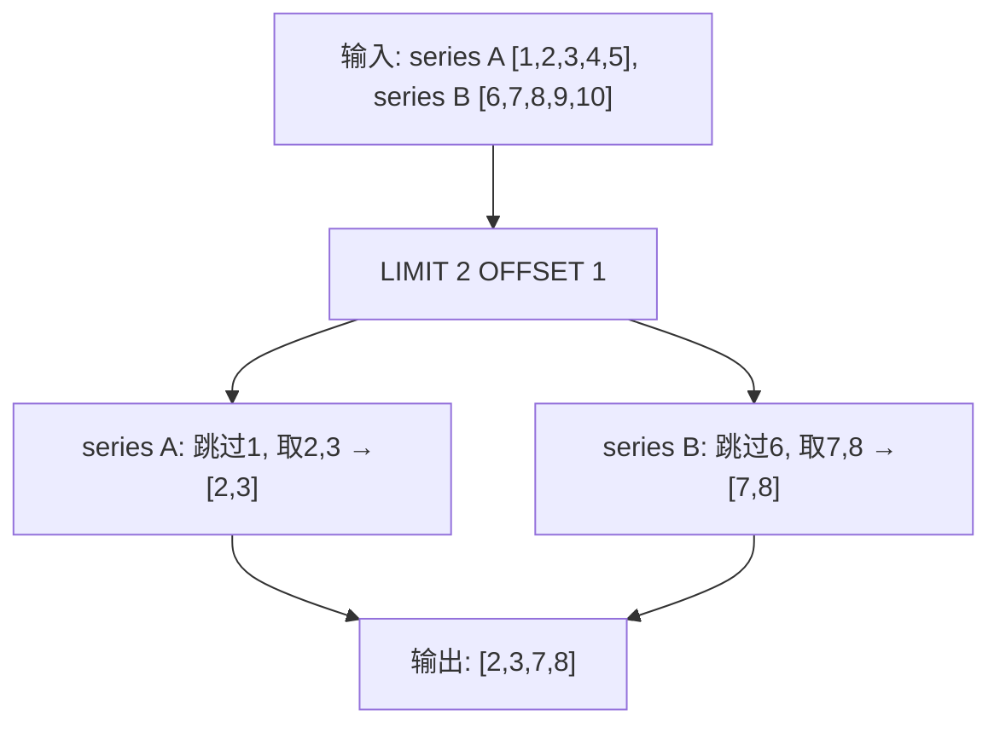

**示例**: `SELECT value FROM cpu LIMIT 2 OFFSET 1`

| 输入点 | series | n | n <= Offset? | n-Offset > Limit? | 输出? |
|--------|--------|---|-------------|-------------------|-------|
| (t1, 1) | A | 1 | 1 <= 1: 是 | - | 跳过 |
| (t2, 2) | A | 2 | 2 <= 1: 否 | 2-1=1 > 2: 否 | 输出 |
| (t3, 3) | A | 3 | 3 <= 1: 否 | 3-1=2 > 2: 否 | 输出 |
| (t4, 4) | A | 4 | 4 <= 1: 否 | 4-1=3 > 2: 是 | 跳过 |
| (t5, 5) | A | 5 | 5 <= 1: 否 | 5-1=4 > 2: 是 | 跳过 |
| (t6, 6) | B | 1 | 1 <= 1: 是 | - | 跳过 |
| (t7, 7) | B | 2 | 2 <= 1: 否 | 2-1=1 > 2: 否 | 输出 |
| (t8, 8) | B | 3 | 3 <= 1: 否 | 3-1=2 > 2: 否 | 输出 |

### 3.2 SLIMIT / SOFFSET — Series 级限制

```go
// query/result.go:47 — LimitTagSets
func LimitTagSets(a []*TagSet, slimit, soffset int) []*TagSet {
    if slimit == 0 && soffset == 0 {
        return a  // 无限制
    }
    if soffset > len(a) {
        return nil  // offset 超出范围
    }
    if soffset+slimit > len(a) {
        slimit = len(a) - soffset  // clamp
    }
    return a[soffset : soffset+slimit]
}
```

**SLIMIT/SOFFSET 在存储层应用**: 在 TSM 引擎创建迭代器之前，通过 `LimitTagSets` 过滤整个 TagSet 组。

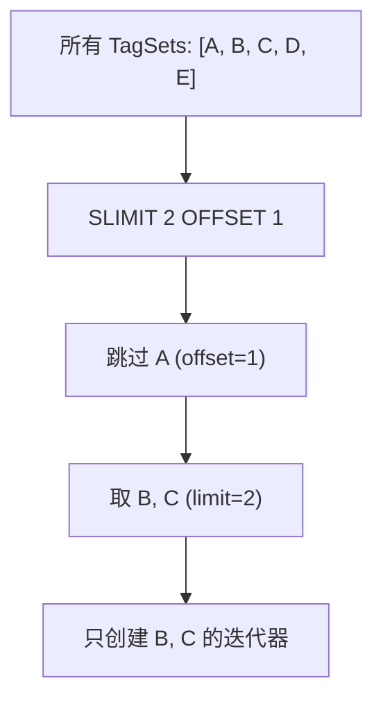

**SLIMIT vs LIMIT 的区别**:

| 维度 | LIMIT | SLIMIT |
|------|-------|--------|
| 限制对象 | 每个 series 的点数 | series 的数量 |
| 应用位置 | Iterator 链中 | 存储引擎层 |
| 计数单位 | 点 | TagSet 组 |
| 重置条件 | 切换 series 时 | 无 |

### 3.3 LIMIT 在聚合查询中的行为

**关键**: 聚合查询中的 LIMIT/OFFSET 会被**剥离**：

```go
// query/select.go:214 — buildCallIterator
func (b *exprIteratorBuilder) buildCallIterator(ctx context.Context, expr *influxql.Call, opt IteratorOptions) (Iterator, error) {
    opt := b.opt
    // 剥离 LIMIT/OFFSET (由外层处理)
    opt.Limit, opt.Offset = 0, 0
    ...
}
```

这意味着 `SELECT mean(value) FROM cpu GROUP BY time(1m) LIMIT 10` 中，LIMIT 10 应用于聚合结果，而不是原始数据。

## 4. Merge Iterator — 多 Iterator 归并

### 4.1 MergeIterator vs SortedMergeIterator

```go
// query/iterator.go:111 — Iterators.Merge
func (a Iterators) Merge(opt IteratorOptions) (Iterator, error) {
    call, ok := opt.Expr.(*influxql.Call)

    if !ok && opt.MergeSorted() {
        // 有序归并: 用于非聚合查询
        itr := NewSortedMergeIterator(a, opt)
        if itr != nil && opt.InterruptCh != nil {
            itr = NewInterruptIterator(itr, opt.InterruptCh)
        }
        return itr, nil
    }

    // 窗口归并: 用于聚合查询
    itr := NewMergeIterator(a, opt)
    if itr == nil {
        return nil, nil
    }

    // InterruptCh 包装: 当查询超时或用户取消时中断迭代
    if opt.InterruptCh != nil {
        itr = NewInterruptIterator(itr, opt.InterruptCh)
    }

    // 非 call 表达式: 不需要 CallIterator 包装
    if !ok {
        return itr, nil
    }

    // count 特殊处理: 多 shard 的 count 用 sum 合并
    if call.Name == "count" {
        opt.Expr = &influxql.Call{Name: "sum", Args: call.Args}
    }
    return NewCallIterator(itr, opt)
}
```

**注意**: 实际代码中 `Iterators.Merge()` 还包含以下省略路径：
- **InterruptCh 处理**: 当 `opt.InterruptCh != nil` 时，用 `NewInterruptIterator` 包装，支持查询超时和用户取消
- **Nil 检查**: `NewMergeIterator` 返回 nil 时直接返回 `nil, nil`
- **非 call 表达式提前返回**: 当 `!ok`（非聚合表达式）时，直接返回未包装的 merge iterator

| 特性 | MergeIterator | SortedMergeIterator |
|------|---------------|---------------------|
| 用途 | 聚合查询 | 非聚合查询 (raw) |
| 分组 | 按时间窗口 | 按原始时间 |
| 输出 | 同一窗口的点连续输出 | 全局有序输出 |
| 堆排序 | name > tags > time_window | name > tags > time > aux |

### 4.2 MergeIterator 的堆实现

```go
// query/iterator.gen.go:258 — floatMergeHeap
type floatMergeHeap struct {
    items []*floatMergeHeapItem
    opt   IteratorOptions
}

func (h *floatMergeHeap) Less(i, j int) bool {
    x, _ := h.items[i].itr.peek()
    y, _ := h.items[j].itr.peek()

    if h.opt.Ascending {
        if x.Name != y.Name { return x.Name < y.Name }
        xTags := x.Tags.Subset(h.opt.Dimensions)
        yTags := y.Tags.Subset(h.opt.Dimensions)
        if xTags.ID() != yTags.ID() { return xTags.ID() < yTags.ID() }
        xWindow, _ := h.opt.Window(x.Time)
        yWindow, _ := h.opt.Window(y.Time)
        return xWindow < yWindow
    } else {
        // 降序: 反转比较
        if x.Name != y.Name { return x.Name > y.Name }
        ...
        return xWindow > yWindow
    }
}
```

### 4.3 MergeIterator.Next — 窗口归并逻辑

```go
// query/iterator.gen.go:174 — floatMergeIterator.Next
func (itr *floatMergeIterator) Next() (*FloatPoint, error) {
    for {
        // 懒初始化: 从每个 input 读取第一个点
        if !itr.init {
            itr.init = true
            for _, item := range itr.heap.items {
                p, _ := item.itr.peek()
                if p == nil { continue }
                heap.Push(itr.heap, item)
            }
        }

        // 弹出堆顶
        item := heap.Pop(itr.heap).(*floatMergeHeapItem)
        p, _ := item.itr.Next()

        // 设置当前窗口
        if itr.window.name == "" {
            itr.window.name = p.Name
            itr.window.tags = p.Tags.Subset(itr.opt.Dimensions).ID()
            itr.window.startTime, itr.window.endTime = itr.opt.Window(p.Time)
        }

        // 检查是否还在当前窗口内
        inWindow := true
        if p.Name != itr.window.name { inWindow = false }
        if p.Tags.Subset(itr.opt.Dimensions).ID() != itr.window.tags { inWindow = false }
        if itr.opt.Ascending && p.Time >= itr.window.endTime { inWindow = false }
        if !itr.opt.Ascending && p.Time < itr.window.startTime { inWindow = false }

        if inWindow {
            // 继续从同一个 iterator 读取 (同一窗口内的点)
            if next, _ := item.itr.peek(); next != nil {
                heap.Push(itr.heap, item)
            }
            return p, nil
        }

        // 超出窗口: unread 并推回堆
        item.itr.unread(p)
        heap.Push(itr.heap, item)

        // 重置窗口
        itr.window.name = ""
    }
}
```

### 4.4 其他重要迭代器

#### ParallelMergeIterator — 并行归并 (iterator.go:182)

```go
// query/iterator.go:182 — NewParallelMergeIterator
func NewParallelMergeIterator(inputs []Iterator, opt IteratorOptions, parallelism int) Iterator
```

将输入迭代器分成 `parallelism` 组，每组内部先 Merge，再将所有组的结果 Merge。用于大量 shard 时提升并行度。

#### InterruptIterator — 中断迭代器 (iterator.go:393)

```go
// query/iterator.go:393 — NewInterruptIterator
func NewInterruptIterator(input Iterator, closing <-chan struct{}) Iterator
```

当 `closing` 通道关闭时，停止产生输出。用于查询超时或用户取消。

#### CloseInterruptIterator — 关闭中断迭代器 (iterator.go:412)

```go
// query/iterator.go:412 — NewCloseInterruptIterator
func NewCloseInterruptIterator(input Iterator, closing <-chan struct{}) Iterator
```

与 InterruptIterator 类似，但会在中断时调用底层迭代器的 `Close()` 方法释放资源。

#### DedupeIterator — 去重迭代器 (iterator.go:334)

```go
// query/iterator.go:334 — NewDedupeIterator
func NewDedupeIterator(input Iterator) Iterator
```

输出唯一的点。维护每个已见行的序列化副本，因此不适合大数据集。主要用于元数据查询。

#### TagSubsetIterator — 标签子集迭代器 (iterator.go:310)

```go
// query/iterator.go:310 — NewTagSubsetIterator
func NewTagSubsetIterator(input Iterator, opt IteratorOptions) Iterator
```

将每个点的标签裁剪为 `opt.Dimensions` 的子集。用于 GROUP BY 部分标签时。

## 5. Fill Iterator — 空窗口填充

### 5.1 四种填充模式

```go
// query/iterator.gen.go:706 — floatFillIterator
type floatFillIterator struct {
    input     *bufFloatIterator
    prev      FloatPoint      // 上一个非 nil 点 (用于 PreviousFill 和 LinearFill)
    startTime int64
    endTime   int64
    auxFields []interface{}   // 辅助字段缓存
    init      bool            // 是否已初始化窗口
    opt       IteratorOptions

    window struct {
        name   string
        tags   Tags
        time   int64       // 当前期望的时间
        offset int64       // DST 偏移
    }
}
```

| Fill 模式 | 实现 | 空窗口值 |
|-----------|------|---------|
| `NoFill` | 不生成 FillIterator | 无输出 |
| `NullFill` | `p.Nil = true` | NULL |
| `NumberFill` | `p.Value = opt.FillValue` | 指定数值 |
| `PreviousFill` | `p.Value = prev.Value` | 前一个非 nil 值 |
| `LinearFill` | `linearFloat(prev, next, ratio)` | 线性插值 |

### 5.2 FillIterator.Next — 填充逻辑

```go
// query/iterator.gen.go:758 — floatFillIterator.Next
func (itr *floatFillIterator) Next() (*FloatPoint, error) {
    // 1. 读取下一个真实点
    p, err := itr.input.Next()

    // 2. 检查是否需要填充
    // 如果真实点的时间 > 期望时间，说明有空隙
    if p == nil || (itr.opt.Ascending && p.Time > itr.window.time) ||
       (!itr.opt.Ascending && p.Time < itr.window.time) {
        // 需要填充
        goto CONSTRUCT
    }

    // 3. 更新 prev
    if !p.Nil {
        itr.prev = *p
    }

    // 4. 推进窗口
    if itr.opt.Ascending {
        itr.window.time += int64(itr.opt.Interval.Duration)
    } else {
        itr.window.time -= int64(itr.opt.Interval.Duration)
    }

    return p, nil

CONSTRUCT:
    // 构造合成点
    p = &FloatPoint{
        Name: itr.window.name,
        Tags: itr.window.tags,
        Time: itr.window.time,
    }

    // 应用填充策略
    switch itr.opt.Fill {
    case influxql.NullFill:
        p.Nil = true

    case influxql.NumberFill:
        p.Value = itr.opt.FillValue.(float64)

    case influxql.PreviousFill:
        if !itr.prev.Nil {
            p.Value = itr.prev.Value
        } else {
            p.Nil = true
        }

    case influxql.LinearFill:
        next, err := itr.input.peek()
        if !itr.prev.Nil && next != nil &&
           next.Name == itr.window.name && next.Tags.ID() == itr.window.tags.ID() {
            // 线性插值: 先除以 interval 对齐时间，避免大数精度问题
            interval := int64(itr.opt.Interval.Duration)
            start := itr.window.time / interval
            p.Value = linearFloat(start, itr.prev.Time/interval, next.Time/interval, itr.prev.Value, next.Value)
        } else {
            p.Nil = true
        }
    }

    // 推进窗口
    itr.window.time += int64(itr.opt.Interval.Duration)

    return p, nil
}
```

**特殊处理**: `count()` + `NullFill` 自动转换为 `NumberFill(0)`，因为空窗口的计数应该是 0 而不是 NULL。

```go
// query/iterator.gen.go:725
if itr.opt.Fill == influxql.NullFill {
    if call, ok := itr.opt.Expr.(*influxql.Call); ok && call.Name == "count" {
        itr.opt.Fill = influxql.NumberFill
        itr.opt.FillValue = float64(0)
    }
}
```

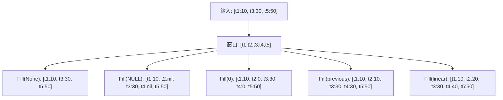

## 6. Interval Iterator — 时间对齐

```go
// query/iterator.gen.go:883 — floatIntervalIterator
type floatIntervalIterator struct {
    input FloatIterator
    opt   IteratorOptions
}

func (itr *floatIntervalIterator) Next() (*FloatPoint, error) {
    p, err := itr.input.Next()
    if p == nil || err != nil {
        return nil, err
    }

    // 将时间对齐到窗口起点
    startTime, _ := itr.opt.Window(p.Time)
    if startTime == influxql.MinTime {
        startTime = 0
    }
    p.Time = startTime

    return p, nil
}
```

**IntervalIterator 的作用**: 聚合函数的 Emit 返回 `Time: ZeroTime`，IntervalIterator 将其替换为窗口的起始时间。

## 7. ORDER BY time DESC — 降序查询

### 7.1 降序影响的五个层级

> **小白解释**: `ORDER BY time DESC` 不是简单地把结果倒过来——它需要在**每一层**都反转处理方向。
> 就像你要倒着走一条路，不是走到头再倒回来，而是每一步都往反方向走。
>
> 为什么要这么复杂？因为 InfluxDB 的 Iterator 是**流式处理**的——数据像流水一样经过每个工位。
> 如果只在最后反转，就需要缓存所有数据（内存爆炸）。所以在每一层都反转，保证流式处理不中断。

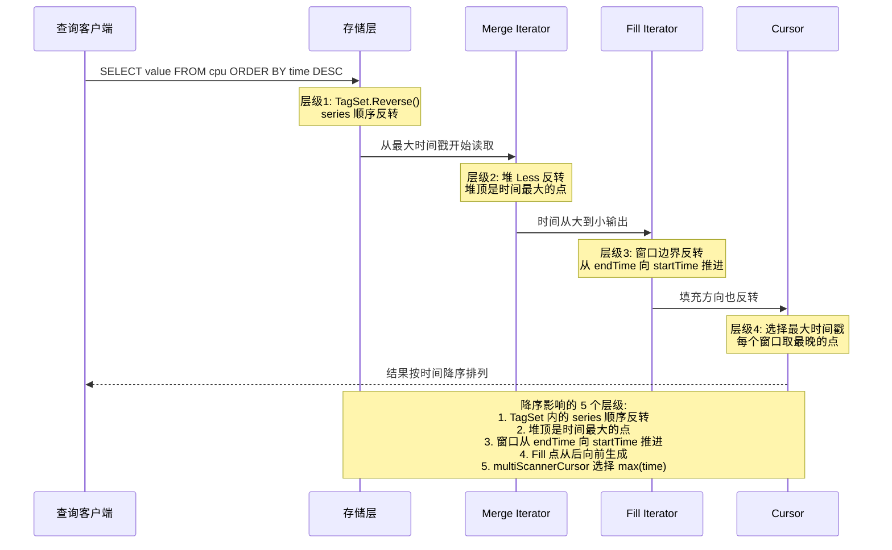

### 7.2 存储层 — TagSet.Reverse()

```go
// tsdb/engine/tsm1/engine.go:2951-2956
if !opt.Ascending {
    for _, t := range tagSets {
        t.Reverse()
    }
}

// query/result.go:39 — TagSet.Reverse
func (t *TagSet) Reverse() {
    for i, j := 0, len(t.Filters)-1; i < j; i, j = i+1, j-1 {
        t.Filters[i], t.Filters[j] = t.Filters[j], t.Filters[i]
        t.SeriesKeys[i], t.SeriesKeys[j] = t.SeriesKeys[j], t.SeriesKeys[i]
    }
}
```

### 7.3 Merge 堆 — 反转比较

> **简化视图**: 下面只展示时间维度的反转比较，便于理解降序语义。完整的 `floatMergeHeap.Less`
> 实现以 §4.2 为准 (权威版本)：先比 `Name`，再比 `Tags.Subset(Dimensions).ID()`，
> 最后比 `Window(time)`；升序/降序在每个维度上都反转比较方向。

```go
// query/iterator.gen.go:265 — floatMergeHeap.Less (简化视图，仅展示时间维度)
func (h *floatMergeHeap) Less(i, j int) bool {
    if h.opt.Ascending {
        return x.Time < y.Time  // 升序: 时间小的在堆顶
    } else {
        return x.Time > y.Time  // 降序: 时间大的在堆顶
    }
}
```

### 7.4 Fill 迭代器 — 时间方向

```go
// query/iterator.gen.go:862
if itr.opt.Ascending {
    itr.window.time += int64(itr.opt.Interval.Duration)  // 向未来推进
} else {
    itr.window.time -= int64(itr.opt.Interval.Duration)  // 向过去推进
}
```

## 8. Cursor 抽象层 (query/cursor.go)

### 8.0 Cursor 接口与实现

```go
// query/cursor.go — Cursor 接口
type Cursor interface {
    Scan(row *Row) bool
    Stats() IteratorStats
    Err() error
    Columns() []influxql.VarRef
    Close() error
}
```

**Cursor 实现类型**:

| 类型 | 用途 |
|------|------|
| `scannerCursor` | 单个 IteratorScanner 的 Cursor |
| `multiScannerCursor` | 多个 IteratorScanner 的 Cursor (多字段查询) |
| `nullCursor` | 空 Cursor (无有效字段时) |

## 9. 数学运算 — BinaryExpr

### 9.1 运算在 Cursor 层执行

```go
// query/cursor.go:134 — scannerCursorBase
type scannerCursorBase struct {
    valuer influxql.ValuerEval
}

// 初始化时设置 MathValuer
cur.valuer = influxql.ValuerEval{
    Valuer: influxql.MultiValuer(
        MathValuer{},           // 数学函数: sin, cos, sqrt, ...
        influxql.MapValuer(m),  // 字段值映射
    ),
    IntegerFloatDivision: true,  // 整数除法结果为浮点
}
```

### 9.2 BinaryExpr 求值

```go
// storage/reads/influxql_eval.go:41 — evalBinaryExpr
func evalBinaryExpr(expr *influxql.BinaryExpr, m Valuer) interface{} {
    lhs := evalExpr(expr.LHS, m)
    rhs := evalExpr(expr.RHS, m)

    // nil 和 bool 有隐式 false 兼容：WHERE tag='x' AND missing_bool
    // 中缺失的布尔值按 false 参与 AND/OR。
    switch lhs := lhs.(type) {
    case bool:
        rhs, ok := rhs.(bool)
        switch expr.Op {
        case influxql.AND:         return ok && (lhs && rhs)
        case influxql.OR:          return ok && (lhs || rhs)
        case influxql.BITWISE_AND: return ok && (lhs && rhs)
        case influxql.BITWISE_OR:  return ok && (lhs || rhs)
        case influxql.BITWISE_XOR: return ok && (lhs != rhs)
        case influxql.EQ:          return ok && (lhs == rhs)
        case influxql.NEQ:         return ok && (lhs != rhs)
        }

    case float64:
        // rhs 可能是 float64 或 int64，统一转换为 float64
        rhsf, ok := rhs.(float64)
        if !ok {
            if rhsi, ok := rhs.(int64); ok {
                rhsf = float64(rhsi)
            }
        }
        switch expr.Op {
        case influxql.ADD: return lhs + rhsf
        case influxql.SUB: return lhs - rhsf
        case influxql.MUL: return lhs * rhsf
        case influxql.DIV:
            if rhsf == 0 { return float64(0) }  // 除零返回 0
            return lhs / rhsf
        case influxql.MOD: return math.Mod(lhs, rhsf)
        case influxql.EQ:  return lhs == rhsf
        case influxql.NEQ: return lhs != rhsf
        case influxql.LT:  return lhs < rhsf
        case influxql.LTE: return lhs <= rhsf
        case influxql.GT:  return lhs > rhsf
        case influxql.GTE: return lhs >= rhsf
        }

    case int64:
        // rhs 如果是 float64，int64 自动提升为 float64
        if rhsf, ok := rhs.(float64); ok {
            lhsf := float64(lhs)
            switch expr.Op {
            case influxql.ADD: return lhsf + rhsf
            case influxql.SUB: return lhsf - rhsf
            // ... (提升为 float64 运算)
            }
        }
        // rhs 是 int64 时，保持整数运算
        rhsi, ok := rhs.(int64)
        switch expr.Op {
        case influxql.ADD: return lhs + rhsi
        case influxql.SUB: return lhs - rhsi
        case influxql.MUL: return lhs * rhsi
        case influxql.DIV:
            if rhsi == 0 { return float64(0) }  // 源码如此: int 除零返回 float64(0)
            return lhs / rhsi
        case influxql.MOD:
            if rhsi == 0 { return int64(0) }
            return lhs % rhsi
        case influxql.BITWISE_AND: return lhs & rhsi
        case influxql.BITWISE_OR:  return lhs | rhsi
        case influxql.BITWISE_XOR: return lhs ^ rhsi
        }

    case string:
        switch expr.Op {
        case influxql.EQ:
            rhs, ok := rhs.(string); if !ok { return nil }
            return lhs == rhs
        case influxql.NEQ:
            rhs, ok := rhs.(string); if !ok { return nil }
            return lhs != rhs
        case influxql.EQREGEX:
            rhs, ok := rhs.(*regexp.Regexp); if !ok { return nil }
            return rhs.MatchString(lhs)
        case influxql.NEQREGEX:
            rhs, ok := rhs.(*regexp.Regexp); if !ok { return nil }
            return !rhs.MatchString(lhs)
        }

    case []byte:
        // tag value 在部分路径里以 []byte 进入求值器；等值比较先转 string。
        switch expr.Op {
        case influxql.EQ:
            rhs, ok := rhs.(string); if !ok { return nil }
            return string(lhs) == rhs
        case influxql.NEQ:
            rhs, ok := rhs.(string); if !ok { return nil }
            return string(lhs) != rhs
        case influxql.EQREGEX:
            rhs, ok := rhs.(*regexp.Regexp); if !ok { return nil }
            return rhs.Match(lhs)
        case influxql.NEQREGEX:
            rhs, ok := rhs.(*regexp.Regexp); if !ok { return nil }
            return !rhs.Match(lhs)
        }
    }
}
```

> **源码细节**: `int64 / int64` 除零分支实际返回 `float64(0)`，不是
> `int64(0)`；`int64 % int64` 除零才返回 `int64(0)`。这会让
> `SELECT int_field / 0` 的结果类型与普通整数除法不一致。

**支持的运算**: `+`, `-`, `*`, `/`, `%`, `==`, `!=`, `<`, `<=`, `>`, `>=`, `AND`, `OR`, `&`, `|`, `^`, `=~`, `!~`

**除零处理**: 返回 0，不报错；float 除零和 int 除零的 `/` 分支都返回 `float64(0)`。

**类型提升**: int64 与 float64 混合运算时，int64 自动提升为 float64。

**案例**:

```sql
SELECT int_value / 0 FROM cpu        -- 返回 0，但底层类型是 float64(0)
SELECT * FROM cpu WHERE host =~ /web[0-9]+/ AND active = true
```

第二个条件依赖 `string`/`[]byte` 的 regex 分支和 `bool` 的 AND 分支；这些都在 `storage/reads/influxql_eval.go` 的 `evalBinaryExpr` 中处理。

### 9.3 数学函数

```go
// query/math.go:85 — MathValuer
type MathValuer struct{}

func (v MathValuer) Call(name string, args []interface{}) (interface{}, bool) {
    if len(args) == 1 {
        arg0 := args[0]
        switch name {
        case "abs":
            // abs 对 int64/uint64 有特殊处理，不转 float64
            switch arg0 := arg0.(type) {
            case float64: return math.Abs(arg0), true
            case int64:
                sign := arg0 >> 63
                return (arg0 ^ sign) - sign, true  // 位运算取绝对值
            case uint64: return arg0, true  // unsigned 已经非负
            default: return nil, true
            }
        case "floor", "ceil":
            // int64/uint64 直接返回，不做无意义的浮点转换
            switch arg0 := arg0.(type) {
            case float64: return math.Floor(arg0), true  // 或 math.Ceil
            case int64, uint64: return arg0, true
            default: return nil, true
            }
        case "round":
            // 使用自定义 round() 函数，而非 math.Round
            switch arg0 := arg0.(type) {
            case float64: return round(arg0), true
            case int64, uint64: return arg0, true
            default: return nil, true
            }
        case "sin", "cos", "tan", "asin", "acos", "atan", "exp", "ln",
             "log2", "log10", "sqrt":
            // 使用 asFloat() 统一处理 float64/int64/uint64
            if arg0, ok := asFloat(arg0); ok {
                return math.Sin(arg0), true  // 示例: sin
            }
            return nil, true
        }
    } else if len(args) == 2 {
        arg0, arg1 := args[0], args[1]
        switch name {
        case "atan2":
            if arg0, arg1, ok := asFloats(arg0, arg1); ok {
                return math.Atan2(arg0, arg1), true
            }
        case "log":
            // log(base, x) = ln(x) / ln(base)
            if arg0, arg1, ok := asFloats(arg0, arg1); ok {
                return math.Log(arg0) / math.Log(arg1), true
            }
        case "pow":
            if arg0, arg1, ok := asFloats(arg0, arg1); ok {
                return math.Pow(arg0, arg1), true
            }
        }
    }
    return nil, false
}

// asFloat 统一将 float64/int64/uint64 转换为 float64
func asFloat(x interface{}) (float64, bool) {
    switch v := x.(type) {
    case float64: return v, true
    case int64:   return float64(v), true
    case uint64:  return float64(v), true
    default:      return 0, false
    }
}
```

## 10. 辅助字段 — SELECT value, host

### 10.1 Aux 字段的处理

```go
// query/point.gen.go:20 — FloatPoint
type FloatPoint struct {
    Name  string
    Tags  Tags

    Time  int64
    Value float64
    Aux   []interface{}  // 辅助字段: [host, region, ...]

    // Total number of points that were combined into this point from an aggregate.
    // If this is zero, the point is not the result of an aggregate function.
    Aggregated uint32
    Nil        bool        // 标记是否为 NULL 点
}
```

**`SELECT value, host FROM cpu`** 的处理:
1. `value` 是主字段，进入 `point.Value`
2. `host` 是辅助字段，进入 `point.Aux[0]`

### 10.2 valueMapper — 字段映射

```go
// query/select.go:882 — valueMapper
type valueMapper struct {
    calls map[influxql.Expr]string  // 聚合表达式 -> 符号名
    refs  []*influxql.VarRef        // 原始字段引用
}
```

**无聚合函数时**: 使用 `buildAuxIterator` 创建迭代器，通过 `floatIteratorMapper` 映射字段到 `Value` 和 `Aux`。

### 9.4 Tracing 支持

`buildCursor`、`buildAuxIterator`、`buildFieldIterator` 都支持 OpenTelemetry tracing：

```go
span := tracing.SpanFromContext(ctx)
if span != nil {
    span = span.StartSpan("build_cursor")  // 或 "build_aux_iterator", "build_field_iterator"
    defer span.Finish()
    span.SetLabels("statement", stmt.String())
}
```

### 9.5 MaxBucketsN 限制 (compile.go:1201)

```go
// query/compile.go:1201 — MaxBucketsN 检查
if sopt.MaxBucketsN > 0 && !stmt.IsRawQuery && c.TimeRange.MinTimeNano() > influxql.MinTime {
    interval, _ := stmt.GroupByInterval()
    if interval > 0 {
        first, _ := opt.Window(opt.StartTime)
        last, _ := opt.Window(opt.EndTime - 1)
        buckets := (last - first + int64(interval)) / int64(interval)
        if int(buckets) > sopt.MaxBucketsN {
            return nil, fmt.Errorf("max-select-buckets limit exceeded: (%d/%d)", buckets, sopt.MaxBucketsN)
        }
    }
}
```

防止 `GROUP BY time(1s)` 在大时间范围内产生过多桶导致 OOM。

### 9.6 MaxPointN 监控 (select.go:128)

```go
// query/select.go:128 — MaxPointN 监控
if m := MonitorFromContext(ctx); m != nil {
    if p.maxPointN > 0 {
        monitor := PointLimitMonitor(cur, DefaultStatsInterval, p.maxPointN)
        m.Monitor(monitor)
    }
}
```

通过 Monitor 机制监控查询返回的点数，超过 `maxPointN` 时中断查询。

## 11. 子查询

### 11.1 子查询支持

```go
// query/subquery.go:9 — subqueryBuilder
type subqueryBuilder struct {
    ic   IteratorCreator
    stmt *influxql.SelectStatement
}
```

**子查询编译** (compile.go:1100):
- 创建独立的编译器
- 时间范围取交集: `subquery.TimeRange = subquery.TimeRange.Intersect(c.TimeRange)` (单次 Intersect 调用，同时 clamp 起止时间)
- 如果子查询没有 `GROUP BY time()`，继承父查询的 Interval
- 如果子查询使用 `FILL(null)` 且 `!subquery.Interval.IsZero() && subquery.FillOption == influxql.NullFill`，切换为 `FILL(none)` (基于 interval 判断，而非"非原始查询")

**示例**: `SELECT mean(*) FROM (SELECT value FROM cpu WHERE time > now() - 1h) GROUP BY time(5m)`

1. 内层查询: `SELECT value FROM cpu WHERE time > now() - 1h` → 返回原始点
2. 外层查询: `SELECT mean(*) FROM ... GROUP BY time(5m)` → 对内层结果做 5 分钟聚合

**子查询执行案例**:

> **具体案例**: 假设 `cpu` 表有以下数据（host=web, 每 10 秒一个点）:
>
> ```
> 时间        value
> 10:00:00    10.0
> 10:00:10    20.0
> 10:00:20    30.0
> 10:00:30    40.0
> 10:00:40    50.0
> 10:00:50    60.0
> 10:01:00    70.0
> 10:01:10    80.0
> 10:01:20    90.0
> 10:01:30    100.0
> 10:01:40    110.0
> 10:01:50    120.0
> ```
>
> 执行: `SELECT mean(*) FROM (SELECT value FROM cpu WHERE time >= '10:00' AND time < '10:02') GROUP BY time(1m)`
>
> ```
> 步骤 1: 内层查询编译
>   - 创建独立编译器
>   - 时间范围: [10:00, 10:02)
>   - 无 GROUP BY → 返回原始点
>   - 无 FILL → 切换为 FILL(none)
>
> 步骤 2: 内层查询执行
>   - buildAuxIterator() → 创建 FloatIterator
>   - 返回 12 个原始点
>
> 步骤 3: 外层查询编译
>   - 时间范围: [10:00, 10:02) (继承自内层)
>   - Interval: 1m
>   - 聚合: mean
>
> 步骤 4: 外层查询执行
>   - 内层结果作为输入 → FloatIterator
>   - buildCallIterator("mean") → FloatMeanReducer
>   - IntervalIterator → 时间对齐到窗口起点
>
> 步骤 5: 窗口聚合
>   - 窗口 [10:00, 10:01): [10, 20, 30, 40, 50, 60] → mean = 35.0
>   - 窗口 [10:01, 10:02): [70, 80, 90, 100, 110, 120] → mean = 95.0
>
> 最终结果:
>   time                 mean
>   2024-01-01T10:00:00Z 35.0
>   2024-01-01T10:01:00Z 95.0
> ```

**FilterIterator 条件求值流程**:

```mermaid
sequenceDiagram
    participant Input as 上层 Iterator
    participant Filter as floatFilterIterator
    participant Eval as influxql.EvalBool
    participant Output as 下层 Iterator

    Input->>Filter: ① Next() 请求下一个点
    Filter->>Input: ② 获取 FloatPoint{t, value, tags}

    Note over Filter: 构建求值上下文
    Filter->>Filter: ③ opt.Aux[i].Val → p.Aux[i]
    Filter->>Filter: ④ p.Tags.KeyValues() → map[tagKey]tagValue

    Filter->>Eval: ⑤ EvalBool(condition, map)
    Note over Eval: 示例条件: host='web' AND region =~ /us-.*/<br>host/region 都来自 tags 或 Aux map<br>不会写入 itr.m[p.Name]=p.Value

    alt 条件满足
        Eval-->>Filter: true
        Filter-->>Output: ⑥ 返回该点
    else 条件不满足
        Eval-->>Filter: false
        Filter->>Input: ⑦ 继续获取下一个点 (跳过当前点)
        Note over Filter: 回到步骤 ② 重新循环
    end
```

**FilterIterator 代码** (`iterator.gen.go:2541`):

```go
func (itr *floatFilterIterator) Next() (*FloatPoint, error) {
    for {
        p, err := itr.input.Next()
        if p == nil || err != nil {
            return nil, err
        }

        // 构建求值上下文: SELECT 辅助列按 opt.Aux 名称注入
        for i, ref := range itr.opt.Aux {
            itr.m[ref.Val] = p.Aux[i]
        }

        // tag 条件来自 point.Tags，而不是 p.Name/p.Value
        for k, v := range p.Tags.KeyValues() {
            itr.m[k] = v
        }

        // 求值 WHERE 条件
        if !influxql.EvalBool(itr.cond, itr.m) {
            continue  // 不满足条件，跳过
        }
        return p, nil
    }
}
```

> **案例**: `SELECT mean(value) FROM cpu WHERE host='web01' AND region =~ /us-.*/`
> 的 filter map 至少包含 `host`、`region` 两个 tag 键；如果查询还需要辅助列，
> 辅助列名来自 `itr.opt.Aux[i].Val`，值来自 `p.Aux[i]`。源码不会把当前字段值
> 放入 `itr.m[p.Name]`。

**性能瓶颈**: 每次 `Next()` 都要构建 map 并求值条件表达式。对于高选择性查询（大部分点被过滤），这是 CPU 瓶颈。优化方向：预编译条件为函数闭包，避免 map 构建。

## 12. 关键文件索引

| 文件 | 行数 | 职责 |
|------|------|------|
| `query/compile.go` | ~1,100 | 查询编译: 验证字段、函数、条件; 编译子查询 |
| `query/select.go` | 993 | 查询执行入口: `Select()`, `buildCursor()`, `buildCallIterator()` |
| `query/iterator.go` | 1,423 | 核心接口: `Iterator`, `IteratorOptions`, `Window()`, `Merge()` |
| `query/iterator.gen.go` | 13,528 | 生成代码: 所有类型的迭代器 (merge, reduce, filter, fill, limit, ...) |
| `query/call_iterator.go` | 1,531 | 所有聚合函数实现: count, min, max, sum, first, last, mean, ... |
| `query/functions.go` | ~2,500 | Reducer 实现: FloatMeanReducer, FloatDerivativeReducer, ... |
| `query/functions.gen.go` | ~3,000 | 生成的 Reducer: FloatFuncReducer, FloatSliceFuncReducer, ... |
| `query/point.gen.go` | ~300 | Point 类型: FloatPoint, IntegerPoint, ...; 编解码 |
| `query/cursor.go` | ~250 | Cursor: 多迭代器合并, 数学运算求值 |
| `query/emitter.go` | 82 | Emitter: 按 series 分组输出结果 |
| `query/result.go` | 64 | TagSet, LimitTagSets |
| `query/math.go` | 247 | MathValuer: 数学函数 (sin, cos, sqrt, ...) |
| `query/subquery.go` | 127 | 子查询构建器 |

## 13. 架构收益

| 维度 | 收益 |
|------|------|
| **查询延迟** | Cache + TSM 归并，热数据无需磁盘 I/O |
| **内存效率** | ArrayCursor 批量读取 (1000 points/block)，减少分配 |
| **并发安全** | KeyCursor 去重，避免 compaction 期间的重复读取 |
| **资源安全** | FinalizerIterator 防止资源泄漏 |
| **可扩展性** | Iterator 链式设计，支持任意复杂的查询逻辑 |
| **聚合灵活性** | 30+ 聚合/转换函数，支持流式和窗口两种模式 |
| **排序正确性** | 降序查询在 5 个层级正确处理 |
| **填充策略** | 4 种填充模式，自动处理 count 的特殊语义 |

## 14. 潜在隐患与瓶颈

### 13.1 STDDEV/PERCENTILE 的 O(N) 内存

```go
// 需要缓冲整个窗口的所有点
type FloatSliceFuncReducer struct {
    points []FloatPoint  // O(N) 内存
}
```

当窗口很大（如 `GROUP BY time(1h)` 且高频写入）时，内存消耗不可控。

### 13.2 MergeIterator 的堆开销

```go
type floatMergeIterator struct {
    heap *floatMergeHeap  // 每个 input 一个 item
}
```

大量 shard 或大量 series 时，堆中同时存在多个迭代器的点，内存开销线性增长。

### 13.3 条件求值在热路径上

```go
// query/iterator.gen.go:2541 — floatFilterIterator.Next
func (itr *floatFilterIterator) Next() (*FloatPoint, error) {
    for {
        p, err := itr.input.Next()
        // 构建 map[string]interface{}
        // 求值条件表达式
        if !influxql.EvalBool(itr.cond, itr.m) {
            continue  // 不满足条件，继续
        }
        return p, nil
    }
}
```

每次 `Next()` 都要构建 map 并求值条件表达式。对于高选择性的查询（大部分点被过滤），这是 CPU 瓶颈。

### 13.4 LIMIT 是 per-series 而非全局

用户可能期望 `LIMIT 10` 返回全局 10 个点，但实际上它是 per-series 的。如果查询匹配 100 个 series，实际返回最多 1000 个点。

### 13.5 COUNT 的 NULL 处理

```go
// reduce 方法中: if p.Nil { continue }
```

NULL 值被跳过，不计入 count。这与 SQL 的 `COUNT(*)` 不同（SQL 中 `COUNT(*)` 计算所有行，`COUNT(column)` 跳过 NULL）。

### 13.6 除零返回 0 而非错误

```go
if rhs.(float64) == 0 { return float64(0) }
```

`SELECT value / 0 FROM cpu` 返回 0 而不是错误。整数 `/ 0` 分支同样返回
`float64(0)`，这可能不符合用户对整数表达式类型的预期。

### 13.7 MovingAverage 的预热期

前 N-1 个点不输出。如果窗口内的点数少于 N，整个窗口无输出。用户可能不知道需要足够的数据点。

### 13.8 Subquery 的性能

子查询会创建完整的 Cursor，然后外层查询再迭代。对于大数据量的子查询，这可能导致显著的内存和 CPU 开销。
