# Module 4: 后台任务 (CompactionPlanner + 调度器 + 错误处理) - 深度审计报告

> **小白导读**: Compaction（压缩合并）就像**仓库整理**。
>
> 想象你有一个快递仓库：
> - **Level 1**: Cache snapshot 新写出的 TSM 文件（sequence=1），写入快
> - **Level 2**: 多个 Level 1 generation 合并成更少文件
> - **Level 3**: 多个 Level 2 generation 再合并
> - **Level 4 (Full)**: 最终整理，把所有箱子合并成一个最优的大箱子
> - **Level 5 (Optimize)**: 冷 shard 的优化重写，使用最低调度权重
>
> 为什么要一层层整理？因为一次性整理所有包裹太慢了，会堵住仓库入口（阻塞写入）。
> 分层整理可以在不阻塞写入的情况下，逐步达到最优状态。
>
> **两种合并模式**:
> - **Full (Level 1-2, 4)**: 使用 `tsmBatchKeyIterator` 按 key 收集 block，再由生成的 `merge*/combine*` 逻辑尽量复用不重叠 block，仅对需要合并的部分解码
> - **Fast / Batch (Level 3)**: 使用同一批量 key 迭代器路径，倾向于解码并重新编码以完成快速合并

## 1. Compaction 全链路总览

### 1.1 从 Cache Snapshot 到多级 TSM 压缩的完整路径

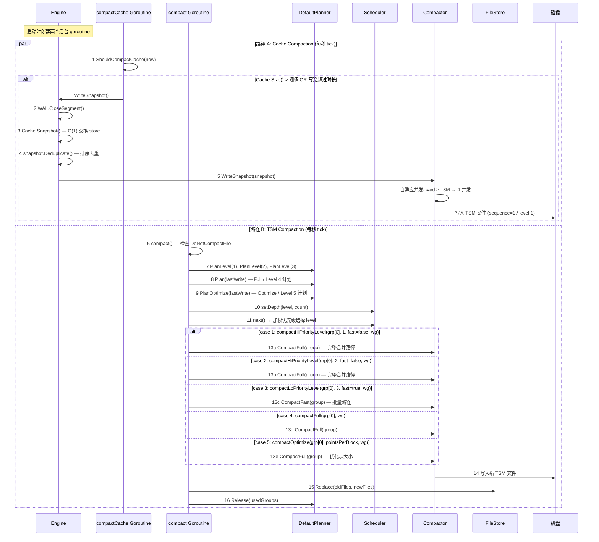

### 1.2 每一步的代码实现

#### 步骤 1: ShouldCompactCache — Cache Compaction 触发

```go
// tsdb/engine/tsm1/engine.go:2121 — ShouldCompactCache
func (e *Engine) ShouldCompactCache(t time.Time) bool {
    sz := e.Cache.Size()

    // 条件 0: Cache 为空，直接返回
    if sz == 0 {
        return false
    }

    // 条件 1: Cache 大小超过阈值 (默认 25MB)
    if sz > e.CacheFlushMemorySizeThreshold {
        return true
    }

    // 条件 2: 写入冷超过时长 (默认 10 分钟)
    // 注意: 使用 e.Cache.LastWriteTime() 而非 e.lastWriteTime
    // 源: DefaultCacheSnapshotWriteColdDuration = 10 * time.Minute (tsdb/config.go:34)
    return t.Sub(e.Cache.LastWriteTime()) > e.CacheFlushWriteColdDuration
}
```

#### 步骤 2-5: Cache Snapshot 流程

```go
// tsdb/engine/tsm1/engine.go:1957 — Engine.WriteSnapshot (关键部分)
func (e *Engine) WriteSnapshot() (err error) {
    closedFiles, snapshot, err := func() (segments []string, snapshot *Cache, err error) {
        e.mu.Lock()
        defer e.mu.Unlock()

        if e.WALEnabled {
            if err = e.WAL.CloseSegment(); err != nil { return }
            segments, err = e.WAL.ClosedSegments()
            if err != nil { return }
        }

        snapshot, err = e.Cache.Snapshot()
        return
    }()
    if err != nil { return err }

    if snapshot.Size() == 0 {
        e.Cache.ClearSnapshot(true)
        return nil
    }

    snapshot.Deduplicate()
    return e.writeSnapshotAndCommit(log, closedFiles, snapshot)
}

// tsdb/engine/tsm1/engine.go:2046 — writeSnapshotAndCommit
func (e *Engine) writeSnapshotAndCommit(log *zap.Logger, closedFiles []string, snapshot *Cache) (err error) {
    defer func() {
        if err != nil {
            e.Cache.ClearSnapshot(false)
        }
    }()

    newFiles, err := e.Compactor.WriteSnapshot(snapshot, e.logger)
    if err != nil {
        return err
    }

    if err := e.FileStore.Replace(nil, newFiles); err != nil {
        for _, file := range newFiles {
            _ = os.Remove(file)
        }
        return err
    }

    e.Cache.ClearSnapshot(true)
    if e.WALEnabled {
        _ = e.WAL.Remove(closedFiles)
    }
    return nil
}

// tsdb/engine/tsm1/compact.go:888 — Compactor.WriteSnapshot
func (c *Compactor) WriteSnapshot(cache *Cache, logger *zap.Logger) ([]string, error) {
    // 只负责把已经生成并 deduplicate 的 snapshot cache 写成 TSM 文件。
    // WAL.CloseSegment、Cache.Snapshot、FileStore.Replace、Cache.ClearSnapshot、
    // WAL.Remove 都是 Engine.WriteSnapshot/writeSnapshotAndCommit 的职责。

    card := cache.Count()

    // 自适应并发: card / 2e6, 最小 1
    concurrency := card / 2e6
    if concurrency < 1 {
        concurrency = 1
    }

    // 高基数特殊处理: card >= 3M → 4 并发 + 不限速
    throttle := card < 3e6 && c.snapshotLatencies.avg() < 15*time.Second
    if card >= 3e6 {
        concurrency = 4
        throttle = false
    }

    // 将 cache 按并发数分割，每个 goroutine 写入独立的 TSM 文件
    splits := cache.Split(concurrency)
    type res struct {
        files []string
        err   error
    }
    resC := make(chan res, concurrency)
    for i := 0; i < concurrency; i++ {
        go func(sp *Cache) {
            iter := NewCacheKeyIterator(sp, tsdb.DefaultMaxPointsPerBlock, intC)
            files, err := c.writeNewFiles(c.FileStore.NextGeneration(), 0, nil, iter, throttle, logger)
            resC <- res{files: files, err: err}
        }(splits[i])
    }

    var errs []error
    files := make([]string, 0, concurrency)
    for i := 0; i < concurrency; i++ {
        result := <-resC
        if result.err != nil {
            errs = append(errs, result.err)
        }
        files = append(files, result.files...)
    }
    return files, errors.Join(errs...)
}
```

职责边界要拆清楚：`Engine.WriteSnapshot` 在持有 engine 写锁时关闭当前 WAL segment、收集 closed segments，并执行 `Cache.Snapshot()`；锁外对 snapshot 去重；`Compactor.WriteSnapshot` 只把传入的 snapshot cache 切分并写成新的 `.tsm.tmp` 文件；`Engine.writeSnapshotAndCommit` 再把新文件 `FileStore.Replace(nil, newFiles)` 进 store，成功后 `e.Cache.ClearSnapshot(true)`，最后删除已关闭 WAL segment。失败时 `writeSnapshotAndCommit` 通过 defer `ClearSnapshot(false)` 恢复 snapshot 状态，不能把 `e.Cache.ClearSnapshot` 写进 Compactor。

#### 步骤 6-15: TSM Compaction 主循环

```go
// tsdb/engine/tsm1/engine.go:2082 — compact
func (e *Engine) compact(wg *sync.WaitGroup) {
    t := time.NewTicker(time.Second)
    defer t.Stop()

    var nextDisabledMsg time.Time

    for {
        e.mu.RLock()
        quit := e.done  // 注意: compactCache 使用 e.snapDone
        e.mu.RUnlock()

        select {
        case <-quit:
            return
        case <-t.C:
            // 步骤 6: 检查是否禁用 compaction
            doNotCompactFile := filepath.Join(e.Path(), DoNotCompactFile)
            if _, err := os.Stat(doNotCompactFile); err == nil {
                continue  // 存在 DoNotCompactFile，跳过
            }

            // 步骤 7-9: 获取各级 compaction 计划
            level1Groups, level2Groups, level3Groups, level4Groups, level5Groups := e.PlanCompactions()

            // 步骤 10: 更新队列深度
            e.scheduler.setDepth(1, len(level1Groups))
            e.scheduler.setDepth(2, len(level2Groups))
            e.scheduler.setDepth(3, len(level3Groups))
            e.scheduler.setDepth(4, len(level4Groups))
            e.scheduler.setDepth(5, len(level5Groups)) // holdoff 期间传 0

            // 步骤 11: 调度器选择执行哪个 level
            level, runnable := e.scheduler.next()
            if !runnable {
                continue
            }

            // 步骤 12: 根据 level 分发，处理 [0] (第一个 group)
            switch level {
            case 1:
                if e.compactHiPriorityLevel(level1Groups[0], 1, false, wg) {
                    level1Groups = level1Groups[1:]
                }
            case 2:
                if e.compactHiPriorityLevel(level2Groups[0], 2, false, wg) {
                    level2Groups = level2Groups[1:]
                }
            case 3:
                if e.compactLoPriorityLevel(level3Groups[0], 3, true, wg) {
                    level3Groups = level3Groups[1:]
                }
            case 4:
                if e.compactFull(level4Groups[0], wg) {
                    level4Groups = level4Groups[1:]
                }
            case 5:
                g := level5Groups[0]
                if err := e.compactOptimize(g.Group, g.PointsPerBlock, wg); err == nil {
                    level5Groups = level5Groups[1:]
                }
            }
        }
    }
}
```

## 2. CompactionPlanner — 文件分代与级别

### 2.1 TSM 文件命名规则

```
┌─────────────────────────────────────────────────────────┐
│ TSM 文件名格式: XXXXXX-YY.tsm                           │
├──────────┬──────────────────────────────────────────────┤
│ XXXXXX   │ Generation ID (6 位数字)                      │
│ YY       │ Sequence Number (2 位数字)                    │
└──────────┴──────────────────────────────────────────────┘

示例:
  000001-01.tsm  → Generation 1, Sequence 1 (Level 1)
  000002-01.tsm  → Generation 2, Sequence 1 (Level 1)
  000003-02.tsm  → Generation 3, Sequence 2 (Level 2)
  000004-03.tsm  → Generation 4, Sequence 3 (Level 3)
```

### 2.2 Compaction Level 定义

```go
// tsdb/engine/tsm1/compact.go:177 — level
func (t *tsmGeneration) level() int {
    // 源码注释提到 Level 0，但当前实现直接用 sequence 映射:
    // sequence=1 -> level 1, sequence=2 -> level 2, sequence=3 -> level 3。
    // Cache snapshot 通过 writeNewFiles(..., maxSequence=0, ...) 写出 sequence=1，
    // 因此它进入 level 1，而不是可调度的 level 0。
    if t.files[0].Sequence < 4 {
        return t.files[0].Sequence
    }
    return 4
}
```

| Level | 来源 | 触发条件 |
|-------|------|----------|
| **1** | Cache Snapshot 写出的 sequence=1 文件；多个 L1 generation 合并 | Cache.Size > 阈值 / 写冷超时；或相邻 L1 generations >= 8 / tombstone |
| **2** | 多个 Level 1 generation 合并后的 sequence=2 文件 | 相邻 L2 候选通常 >= 4，或 tombstone |
| **3** | 多个 Level 2 generation 合并后的 sequence=3 文件 | 相邻 L3 候选通常 >= 4，或 tombstone |
| **4** | Full compaction | 写冷超过 `compactFullWriteColdDuration` 或强制 full |
| **5** | Optimize compaction 调度队列 | `PlanOptimize(lastWrite)` 找到冷 shard 优化组，经过 holdoff 后调度 |

> **具体案例**: 假设你每秒写入 1000 个点，Cache 大小阈值 25MB。
>
> ```
> 时间线:
>
> t=0s    开始写入数据 → 进入 Cache
> t=25s   Cache 达到 25MB → 触发 Snapshot → 写入 000001-01.tsm (Level 1)
> t=50s   Cache 又满了 → 写入 000002-01.tsm (Level 1)
> 后台检测: 相邻 Level 1 generation 达到规划阈值后触发 Level 1 Compaction
>         → 合并多个 sequence=1 generation → 写入 sequence=2 文件 (Level 2)
> t=75s   Cache 又满了 → 写入 000003-01.tsm (Level 1)
> t=100s  Cache 又满了 → 写入 000004-01.tsm (Level 1)
> 后台检测: Level 1 generation 数量达到规划阈值后 → Level 1 Compaction
>         → 合并 → 写入 sequence=2 文件 (Level 2)
> t=102s  后台检测: Level 2 generation 达到阈值 → Level 2 Compaction
>         → 合并 → 写入 sequence=3 文件 (Level 3)
> ...
> t=300s  写入停止 → 10 秒后触发 Full Compaction (Level 4)
>         → 合并所有 Level 2/3 文件 → 写入最终的大文件
> ```
>
> 最终效果：几十个小文件合并成了 1 个大文件，查询时只需扫描 1 个文件。

### 2.3 DefaultPlanner.PlanLevel — 分级 Compaction

```go
// tsdb/engine/tsm1/compact.go:318 — PlanLevel
func (c *DefaultPlanner) PlanLevel(level int) ([]CompactionGroup, int64) {
    // 如果已请求 Full compaction，不规划 level 计划 (避免抢占文件)
    c.mu.RLock()
    if c.forceFull {
        c.mu.RUnlock()
        return nil, 0
    }
    c.mu.RUnlock()

    generations := c.findGenerations()

    // 只有一个 generation 且无 tombstones，无需 compaction
    if len(generations) <= 1 && !generations.hasTombstones() {
        return nil, 0
    }

    // 相邻同 level generation 归为一组；孤立的低 level generation
    // 如果后面跟着更高 level，也会被带入当前组，避免永久落单。
    groups := c.groupAdjacentGenerations(generations,
        func(currentLevel int, candidateLevel int) bool {
            return currentLevel == candidateLevel
        })

    // 只保留目标 level 的 groups
    var levelGroups []tsmGenerations
    levelGroupIndices := make(map[int]int)
    for i, cur := range groups {
        if cur.level() == level {
            levelGroups = append(levelGroups, cur)
            levelGroupIndices[len(levelGroups)-1] = i
        }
    }

    // minGenerations: Level 1 = 8, Level 2-3 = 4
    minGenerations := 4
    if level == 1 {
        minGenerations = 8
    }

    // 按 minGenerations 分块
    var cGroups []CompactionGroup
    for i, group := range levelGroups {
        for _, chunk := range group.chunk(minGenerations) {
            var cGroup CompactionGroup
            var hasTombstones bool
            for _, gen := range chunk {
                if gen.hasTombstones() {
                    hasTombstones = true
                }
                for _, file := range gen.files {
                    cGroup = append(cGroup, file.Path)
                }
            }
            // 跳过不足 minGenerations 且无 tombstones 的 chunk
            if len(chunk) < minGenerations && !hasTombstones {
                for j := levelGroupIndices[i] + 1; j < len(groups); j++ {
                    if groups[j].level() >= level {
                        // 后面存在同级或更高级 generation，当前落单 group 也应升级。
                        cGroups = append(cGroups, cGroup)
                        break
                    }
                }
                continue
            }
            cGroups = append(cGroups, cGroup)
        }
    }

    // acquire: 标记文件为 in-use，防止多个 plan 返回同一文件
    if !c.acquire(cGroups) {
        return nil, int64(len(cGroups))
    }

    return cGroups, int64(len(cGroups))
}
```

### 2.4 DefaultPlanner.Plan — Full Compaction

```go
// tsdb/engine/tsm1/compact.go:528 — Plan
func (c *DefaultPlanner) Plan(lastWrite time.Time) ([]CompactionGroup, int64) {
    generations := c.findGenerations()

    // 检查 forceFull 标志
    c.mu.RLock()
    forceFull := c.forceFull
    c.mu.RUnlock()

    // forceFull 或写冷超时触发 full compaction
    if forceFull || (c.compactFullWriteColdDuration > 0 &&
       time.Since(lastWrite) > c.compactFullWriteColdDuration &&
       len(generations) > 1) {

        if forceFull {
            c.mu.Lock()
            c.forceFull = false
            c.mu.Unlock()
        }

        var tsmFiles []string
        var genCount int
        for i, group := range generations {
            var skip bool

            // 正在被查询/删除等路径 Retain 的文件组不能参与本轮 compaction
            if c.isInUse(group) {
                continue
            }

            // 跳过条件: len(generations) > 2 且文件已满
            // (size > tsdb.MaxTSMFileSize 且首块已达 DefaultMaxPointsPerBlock 且无 tombstones)
            if len(generations) > 2 &&
               group.size() > uint64(tsdb.MaxTSMFileSize) &&
               group.files[0].FirstBlockCount >= tsdb.DefaultMaxPointsPerBlock &&
               !group.hasTombstones() {
                skip = true
            }

            // 覆盖: 如果下一个 generation level <= 3，不跳过
            if i < len(generations)-1 {
                if generations[i+1].level() <= 3 {
                    skip = false
                }
            }

            if skip {
                continue
            }

            for _, f := range group.files {
                tsmFiles = append(tsmFiles, f.Path)
            }
            genCount += 1
        }
        sort.Strings(tsmFiles)

        // 必须有 >1 个文件且 >1 个 generation
        if len(tsmFiles) <= 1 || genCount <= 1 {
            return nil, 0
        }

        group := []CompactionGroup{tsmFiles}
        if !c.acquire(group) {
            return nil, int64(len(group))
        }
        return group, int64(len(group))
    }

    // lastPlanCheck 优化: 如果文件未变化，不重新规划
    if c.lastPlanCheck.After(c.FileStore.LastModified()) && !generations.hasTombstones() {
        return nil, 0
    }
    c.lastPlanCheck = time.Now()

    // ... 后续 Level 4 文件分组逻辑 ...
}
```

### 2.5 DefaultPlanner.PlanOptimize — Optimize Compaction

```go
// tsdb/engine/tsm1/compact.go:436 — PlanOptimize
func (c *DefaultPlanner) PlanOptimize(lastWrite time.Time) (compactGroup []CompactionGroup, compactionGroupLen int64, generationCount int64) {
    // 如果已请求 Full compaction，不规划 optimize 计划
    c.mu.RLock()
    if c.forceFull {
        c.mu.RUnlock()
        return nil, 0, 0
    }
    c.mu.RUnlock()

    generations := c.findGenerations()

    fullyCompacted, _ := c.generationsFullyCompacted(generations)
    if fullyCompacted || time.Since(lastWrite) < c.compactFullWriteColdDuration {
        return nil, 0, 0
    }

    // Optimize 用 currentLevel >= candidateLevel 分组：level 4 group 可以带上
    // 后续较低 level 的相邻 generation；level 1-3 常规情况仍交给 PlanLevel。
    groups := c.groupAdjacentGenerations(generations,
        func(currentLevel int, candidateLevel int) bool {
            return currentLevel >= candidateLevel
        })

    var cGroups []CompactionGroup
    for _, group := range groups {
        var cGroup CompactionGroup
        // 只优化 level 4 generation group；如果整个 shard 只有一个 generation，
        // 也允许单 generation optimize，后续 PlanCompactions 会用 aggressive points-per-block。
        if group.level() == 4 || len(generations) == 1 {
            for _, gen := range group {
                for _, file := range gen.files {
                    cGroup = append(cGroup, file.Path)
                }
            }
        }
        if len(cGroup) > 0 {
            cGroups = append(cGroups, cGroup)
        }
    }

    if !c.acquire(cGroups) {
        return nil, int64(len(cGroups)), int64(len(generations))
    }

    return cGroups, int64(len(cGroups)), int64(len(generations))
}
```

> **源码校准**: 当前调度器有 5 个队列。`PlanCompactions()` 会把普通
> level 1-4 compaction 与 optimize compaction 分开统计；optimize 结果进入
> 第 5 个调度队列，权重最低 (`0.01`)，并由 `compactOptimize` 执行。该路径还有
> 初始 1 小时、后续 5 分钟的 holdoff，避免频繁优化已经较冷的文件。
> `PlanOptimize` 本身返回 `generationCount = len(generations)`；`PlanCompactions`
> 若发现 level 5 计划来自单 generation（`l5GenCount == 1`），会把该组的
> `PointsPerBlock` 提升到 aggressive compaction 配置，便于把单 generation 内的
> 多个 sequence 文件进一步收敛。若 level 4 计划组里已有优化过的文件，
> `PlanCompactions` 也会把该 level 4 group 提升到 level 5 队列，避免优化等级倒退。

## 3. 调度器 — 优先级管理

### 3.1 Scheduler 结构

```go
// tsdb/engine/tsm1/scheduler.go — scheduler
var defaultWeights = [TotalCompactionLevels]float64{0.4, 0.3, 0.2, 0.1, 0.01}

type Scheduler struct {
    maxConcurrency int               // 最大并发 compaction 数 (由 engine 配置)
    stats          *EngineStatistics // 原子计数器: 各级别活跃 compaction 数

    // queues is the depth of work pending for each compaction level
    queues  [TotalCompactionLevels]int // TotalCompactionLevels = 5
    weights [TotalCompactionLevels]float64
}
```

> **注意**: Scheduler 本身**不包含** `limiter.Fixed` 字段。并发控制通过 `maxConcurrency` 配合
> `EngineStatistics` 中的原子计数器 (`TSMCompactionsActive[0-2]`, `TSMFullCompactionsActive`,
> `TSMOptimizeCompactionsActive`) 实现。实际的限流由 `compactionLimiter` (在 Engine 层)
> 通过 `TryTake()` 非阻塞调用完成。

### 3.2 next() — 选择执行哪个 level

```go
// tsdb/engine/tsm1/scheduler.go:35 — scheduler.next
func (s *Scheduler) next() (int, bool) {
    // 读取各级正在运行的 compaction 数量 (原子操作)
    level1Running := int(atomic.LoadInt64(&s.stats.TSMCompactionsActive[0]))
    level2Running := int(atomic.LoadInt64(&s.stats.TSMCompactionsActive[1]))
    level3Running := int(atomic.LoadInt64(&s.stats.TSMCompactionsActive[2]))
    level4Running := int(atomic.LoadInt64(&s.stats.TSMFullCompactionsActive))
    level5Running := int(atomic.LoadInt64(&s.stats.TSMOptimizeCompactionsActive))

    // 如果总运行数 >= maxConcurrency，不能再调度
    if level1Running+level2Running+level3Running+level4Running+level5Running >= s.maxConcurrency {
        return 0, false
    }

    // loLimit = (maxConcurrency / 5) + 1，用于限制低优先级
    loLimit, _ := s.limits()

    end := len(s.queues)  // 默认扫描全部 5 个 level
    // 如果低优先级 (L3+L4+L5) 已占满 loLimit 个槽位且高优先级已满，只扫描 L1-L2
    if level3Running+level4Running+level5Running >= loLimit &&
        s.maxConcurrency-(level1Running+level2Running) == 0 {
        end = 2
    }

    // 加权优先级选择: queues[i] * weights[i] 最大的 level 被选中
    // 默认权重: [0.4, 0.3, 0.2, 0.1, 0.01]
    var (
        level    int
        runnable bool
        weight   float64
    )
    for i := 0; i < end; i++ {
        if float64(s.queues[i])*s.weights[i] > weight {
            level, runnable = i+1, true
            weight = float64(s.queues[i]) * s.weights[i]
        }
    }
    return level, runnable
}

func (s *scheduler) limits() (int, int) {
    hiLimit := s.maxConcurrency * 4 / 5
    loLimit := (s.maxConcurrency / 5) + 1
    if hiLimit == 0 { hiLimit = 1 }
    if loLimit == 0 { loLimit = 1 }
    return loLimit, hiLimit
}
```

> **关键设计**: 调度器不是简单的优先级扫描，而是使用**加权优先级**。
> `queues[i] * weights[i]` 最大的 level 被选中。这意味着即使 Level 1 有任务，
> 如果 Level 4 有大量积压（queues[3] 很大），Level 4 也可能被选中执行。
> loLimit/hiLimit 机制确保低优先级不会完全饿死。

### 3.3 优先级抢占

> **小白解释**: 想象一个只有 2 个手术室的医院：
> - **所有级别 (Level 1-4)**: 都是推门就进，没空就等下次（TryTake = 非阻塞）
> - 没有任何级别会阻塞等待
>
> 每次 tick（1 秒后）重新检查，如果手术室空了就进。
> 调度器通过加权优先级决定谁先尝试，但所有人都用同样的非阻塞方式获取资源。

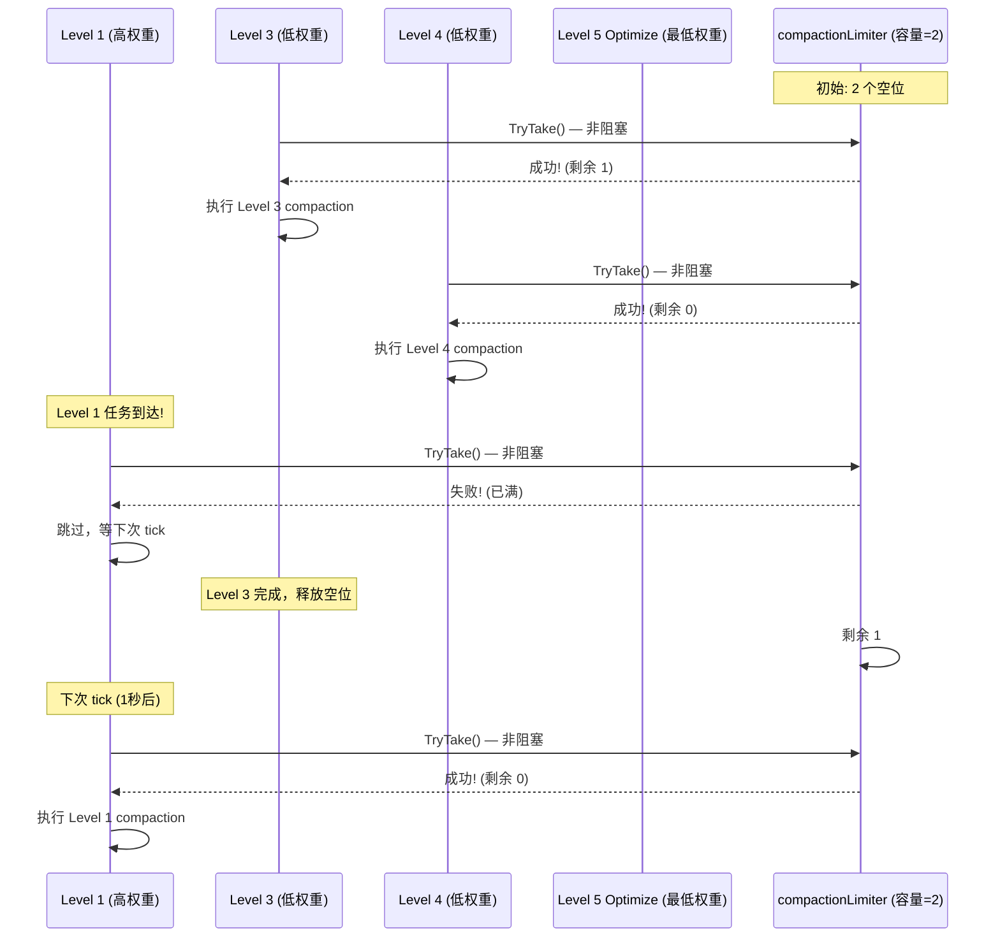

**所有级别都使用 `TryTake()`**: `compactHiPriorityLevel`、`compactLoPriorityLevel` 和 `compactFull` 全部调用 `e.compactionLimiter.TryTake()`（非阻塞）。没有任何地方使用阻塞的 `Take()`。如果 limiter 已满，所有级别都直接跳过，等下次 tick 再试。

## 4. TSM 文件读取机制 — 从磁盘到内存

### 4.1 mmap 映射 — 零拷贝读取

> **小白解释**: mmap 就像给文件开了一个"传送门"。
>
> 传统读文件：磁盘 → 内核缓冲区 → 用户缓冲区（两次拷贝）
> mmap 读文件：磁盘 → 直接映射到你的内存地址（零拷贝！）
>
> 就像你不需要把图书馆的书复印一份带回家，而是直接在图书馆里翻阅。
> 操作系统会自动把需要的页面加载到内存，不需要的页面自动回收。

Compaction 读取 TSM 文件的核心是 **mmap (内存映射文件)**。整个 TSM 文件被映射到进程的虚拟地址空间，读取操作变为直接内存访问，无需 `read()` 系统调用。

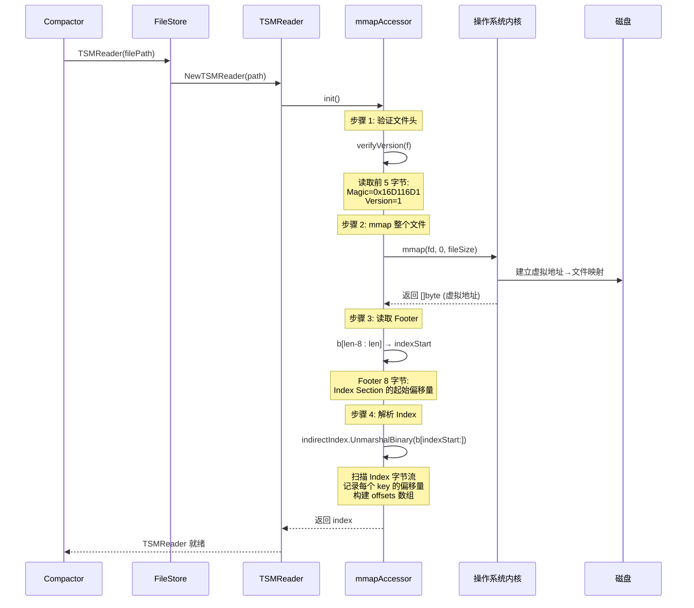

#### mmapAccessor.init() — 完整初始化流程

```go
// tsdb/engine/tsm1/reader.go:1486 — mmapAccessor.init
func (m *mmapAccessor) init() (*indirectIndex, error) {
    m.mu.Lock()
    defer m.mu.Unlock()

    // 步骤 1: 验证文件版本
    if err := verifyVersion(m.f); err != nil {
        return nil, err
    }

    // 步骤 1b: 重置文件指针到开头
    if _, err := m.f.Seek(0, 0); err != nil {
        return nil, err
    }

    // 步骤 2: 获取文件大小 (检查 Stat 错误)
    stat, err := m.f.Stat()
    if err != nil {
        return nil, err
    }

    // 步骤 3: mmap 整个文件
    m.b, err = mmap(m.f, 0, int(stat.Size()))
    if err != nil {
        return nil, err
    }

    // 步骤 3b: 边界检查 — 文件至少 8 字节 (Footer)
    if len(m.b) < 8 {
        return nil, fmt.Errorf("mmapAccessor: byte slice too small for indirectIndex")
    }

    // 步骤 4: 可选的 MADV_WILLNEED 提示
    if m.mmapWillNeed {
        if err := madviseWillNeed(m.b); err != nil {
            return nil, err
        }
    }

    // 步骤 5: 读取 Footer (最后 8 字节)
    indexOfsPos := len(m.b) - 8
    indexStart := binary.BigEndian.Uint64(m.b[indexOfsPos : indexOfsPos+8])

    // 步骤 5b: 验证 indexStart 不越界
    if indexStart >= uint64(indexOfsPos) {
        return nil, fmt.Errorf("mmapAccessor: invalid indexStart")
    }

    // 步骤 6: 解析 Index Section
    m.index = NewIndirectIndex()
    if err := m.index.UnmarshalBinary(m.b[indexStart:indexOfsPos]); err != nil {
        return nil, err
    }

    // 步骤 7: 初始化访问计数器 (允许立即释放资源)
    m.incAccess()
    atomic.StoreUint64(&m.freeCount, 1)

    return m.index, nil
}
```

**mmap 的优势**:
- **零拷贝**: 数据直接在 page cache 中，无需内核→用户空间拷贝
- **按需加载**: OS 按 4KB page 按需加载，大文件不会一次性占用内存
- **共享页**: 多个 TSMReader 共享同一文件的 page cache
- **自动回收**: 内存压力时 OS 自动回收未使用的 page

### 4.2 indirectIndex — Index 解析与二分查找

Index Section 是 TSM 文件中所有 key 和 block 元数据的索引。解析过程扫描原始字节流，记录每个 key 的偏移位置。

```go
// tsdb/engine/tsm1/reader.go:1295 — indirectIndex.UnmarshalBinary
func (d *indirectIndex) UnmarshalBinary(b []byte) error {
    d.b = b  // 保存 Index 字节引用
    if len(b) == 0 { return nil }

    var offsets []int32  // 每个 key 在 Index 中的偏移量
    var minTime, maxTime int64 = math.MaxInt64, 0
    var i int32
    iMax := int32(len(b))

    for i < iMax {
        offsets = append(offsets, i)  // 记录当前 key 的偏移

        // 边界检查: keyLen(2B) 需要至少 2 字节
        if i+2 >= iMax {
            return fmt.Errorf("indirectIndex: not enough data for key length value")
        }

        // 跳过 key: keyLen(2B) + type(1B) + key(NB)
        i += 3 + int32(binary.BigEndian.Uint16(b[i:i+2]))

        // 读取 block 条目数量
        count := int32(binary.BigEndian.Uint16(b[i : i+2]))
        i += 2

        // 记录最小时间戳 (第一个 block 的 MinTime)
        minT := int64(binary.BigEndian.Uint64(b[i : i+8]))
        if minT < minTime { minTime = minT }

        // 跳过中间的 block 条目
        i += (count - 1) * indexEntrySize  // indexEntrySize = 28

        // 边界检查: MaxTime 需要 16 字节
        if i+16 >= iMax {
            return fmt.Errorf("indirectIndex: not enough data for max time")
        }
        // 记录最大时间戳 (最后一个 block 的 MaxTime)
        maxT := int64(binary.BigEndian.Uint64(b[i+8 : i+16]))
        if maxT > maxTime { maxTime = maxT }

        i += indexEntrySize  // 跳过最后一个 block 条目
    }

    // 分别设置 minKey 和 maxKey (非单行赋值)
    firstOfs := offsets[0]
    _, key := readKey(b[firstOfs:])
    d.minKey = key

    lastOfs := offsets[len(offsets)-1]
    _, key = readKey(b[lastOfs:])
    d.maxKey = key

    d.minTime = minTime
    d.maxTime = maxTime

    // 将 offsets 写入 mmap 的匿名内存 (用于二分查找)
    var err error
    d.offsets, err = mmap(nil, 0, len(offsets)*4)
    if err != nil { return err }
    for i, v := range offsets {
        binary.BigEndian.PutUint32(d.offsets[i*4:i*4+4], uint32(v))
    }

    return nil
}
```

**Index Section 内部结构**:

```
Index Section 字节布局:
┌─────────────────────────────────────────────────────────────┐
│ Key[0]: keyLen(2B) + type(1B) + key(NB) + count(2B)        │
│   → IndexEntry[0]: MinTime(8B) + MaxTime(8B) + Ofs(8B) + Sz(4B) │
│   → IndexEntry[1]: ...                                      │
│   → ...                                                     │
├─────────────────────────────────────────────────────────────┤
│ Key[1]: keyLen(2B) + type(1B) + key(NB) + count(2B)        │
│   → IndexEntry[0]: ...                                      │
│   → ...                                                     │
├─────────────────────────────────────────────────────────────┤
│ ...                                                         │
└─────────────────────────────────────────────────────────────┘

offsets 数组 (mmap 匿名内存):
┌──────┬──────┬──────┬──────┐
│  0   │  87  │ 203  │ 345  │  → 每个值指向 Key[N] 在 Index 中的偏移
└──────┴──────┴──────┴──────┘
```

**二分查找定位 key**:

```go
// tsdb/engine/tsm1/reader.go:772 — indirectIndex.Seek
func (d *indirectIndex) Seek(key []byte) int {
    d.mu.RLock()
    defer d.mu.RUnlock()
    return d.searchOffset(key)
}

func (d *indirectIndex) searchOffset(key []byte) int {
    // 使用 bytesutil.SearchBytesFixed 在 offsets 数组上二分查找
    // offsets 中每 4 字节是一个 uint32 偏移量
    i := bytesutil.SearchBytesFixed(d.offsets, 4, func(x []byte) bool {
        offset := int32(binary.BigEndian.Uint32(x))
        // 读取 key 长度 (2 字节) + key 内容
        keyLen := int32(binary.BigEndian.Uint16(d.b[offset : offset+2]))
        return bytes.Compare(d.b[offset+2:offset+2+keyLen], key) >= 0
    })

    if i < len(d.offsets) {
        return int(i / 4)
    }
    return int(len(d.offsets)) / 4
}
```

### 4.3 Block 读取 — 从 mmap 到解码

定位到 key 后，通过 IndexEntry 中的 Offset 和 Size 直接从 mmap 切片中读取 block 数据。

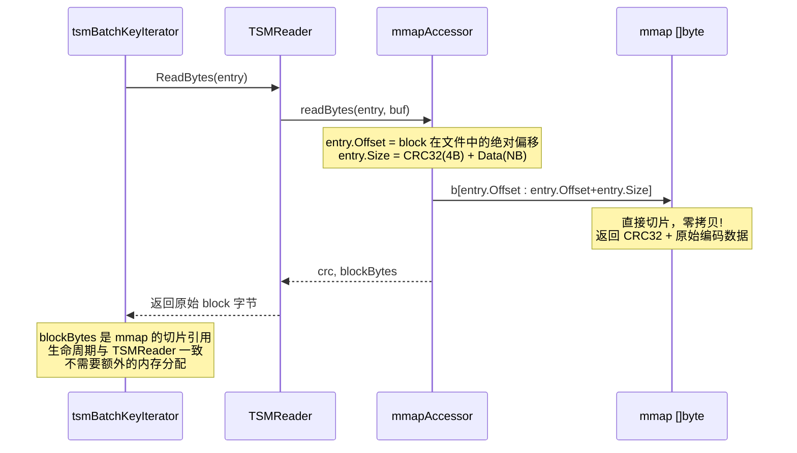

#### mmapAccessor.readBytes — 零拷贝读取

```go
// tsdb/engine/tsm1/reader.go:1567 — mmapAccessor.readBytes
func (m *mmapAccessor) readBytes(entry *IndexEntry, b []byte) (uint32, []byte, error) {
    m.incAccess()
    m.mu.RLock()

    // 边界检查 — 越界时手动释放锁并返回 (不能用 defer，因为正常路径也需要手动释放)
    if int64(len(m.b)) < entry.Offset+int64(entry.Size) {
        m.mu.RUnlock()
        return 0, nil, ErrTSMClosed
    }

    // 直接从 mmap 切片: 跳过 4 字节 CRC，返回 Data 部分
    crc, block := binary.BigEndian.Uint32(m.b[entry.Offset:entry.Offset+4]), m.b[entry.Offset+4:entry.Offset+int64(entry.Size)]
    m.mu.RUnlock()

    return crc, block, nil
}
```

**关键**: `block` 是 mmap 字节的切片，不是副本。这意味着:
- **零分配**: 读取操作不分配新内存
- **生命周期**: block 引用的有效期与 TSMReader 相同
- **并发安全**: 多个 goroutine 可以同时读取同一文件的不同 block

#### mmapAccessor.readBlock — 解码读取

```go
// tsdb/engine/tsm1/reader.go:1548 — mmapAccessor.readBlock
func (m *mmapAccessor) readBlock(entry *IndexEntry, values []Value) ([]Value, error) {
    m.incAccess()
    m.mu.RLock()
    defer m.mu.RUnlock()

    // 边界检查
    if int64(len(m.b)) < entry.Offset+int64(entry.Size) {
        return nil, ErrTSMClosed
    }

    // 跳过 4 字节 CRC，解码 Data 部分
    var err error
    values, err = DecodeBlock(m.b[entry.Offset+4:entry.Offset+int64(entry.Size)], values)
    if err != nil {
        return nil, err
    }
    return values, nil
}
```

**DecodeBlock** 根据 block 类型分发到对应的解码器:
- `BlockFloat64` → Gorilla XOR 解码 → `[]FloatValue`
- `BlockInteger` → Simple8b 解码 → `[]IntegerValue`
- `BlockUnsigned` → Simple8b 解码 → `[]UnsignedValue`
- `BlockBoolean` → 位解包 → `[]BooleanValue`
- `BlockString` → Snappy 解压 → `[]StringValue`

### 4.4 BlockIterator — 顺序遍历所有 Block

Compaction 使用 `BlockIterator` 按 key 排序顺序遍历 TSM 文件中的所有 block。

```go
// tsdb/engine/tsm1/reader.go:133 — BlockIterator
type BlockIterator struct {
    r *TSMReader

    // i is the current key index
    i int

    // n is the total number of keys
    n int

    key     []byte
    cache   []IndexEntry
    entries []IndexEntry
    err     error
    typ     byte
}
```

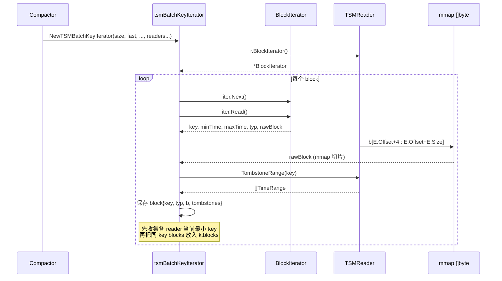

#### tsmBatchKeyIterator — Compaction 专用迭代器

```go
// tsdb/engine/tsm1/compact.go:1418 — tsmBatchKeyIterator
type tsmBatchKeyIterator struct {
    readers   []*TSMReader
    iterators []*BlockIterator
    buf       []blocks
    blocks    blocks

    key []byte
    typ byte

    // decoded values used by compact.gen.go combine*/chunk* paths
    mergedFloatValues    *tsdb.FloatArray
    mergedIntegerValues  *tsdb.IntegerArray
    mergedUnsignedValues *tsdb.UnsignedArray
    mergedBooleanValues  *tsdb.BooleanArray
    mergedStringValues   *tsdb.StringArray

    merged    blocks
    interrupt chan struct{}
}
```

**Next() 的 key 边界处理**:

`tsmBatchKeyIterator.Next()` 先从每个 `BlockIterator` 读取下一个 block，
再在 `k.buf` 中找当前最小 key，并把所有同 key 的 blocks 收集到 `k.blocks`。
每个 block 会携带 `iter.r.TombstoneRange(key)` 返回的 tombstone 范围。

```go
// compact.go:1577-1606, 1666-1682 — 摘要
if iter.Next() {
    key, minTime, maxTime, typ, _, b, err := iter.Read()
    tombstones := iter.r.TombstoneRange(key)
    blk := &block{key: key, typ: typ, b: b, minTime: minTime, maxTime: maxTime}
    blk.tombstones = tombstones
    k.buf[i] = append(k.buf[i], blk)
}

// 找到所有 reader 中当前最小 key，然后收集同 key blocks
for i, b := range k.buf {
    if bytes.Equal(b[0].key, k.key) {
        k.blocks = append(k.blocks, b...)
        k.buf[i] = k.buf[i][:0]
    }
}
k.merge()
```

## 5. Compactor — 文件合并

### 5.1 Compact 入口 — tsmBatchKeyIterator 路径

当前源码中，`compact(fast bool, tsmFiles)` 不再分发到另一套迭代器；
无论 `fast` 为 true 还是 false，都会创建 `NewTSMBatchKeyIterator(...)`。`fast`
作为字段保存在 `tsmBatchKeyIterator` 中，影响后续 `combine*` 是否尽量复用完整 block
或更积极地解码/重编码。

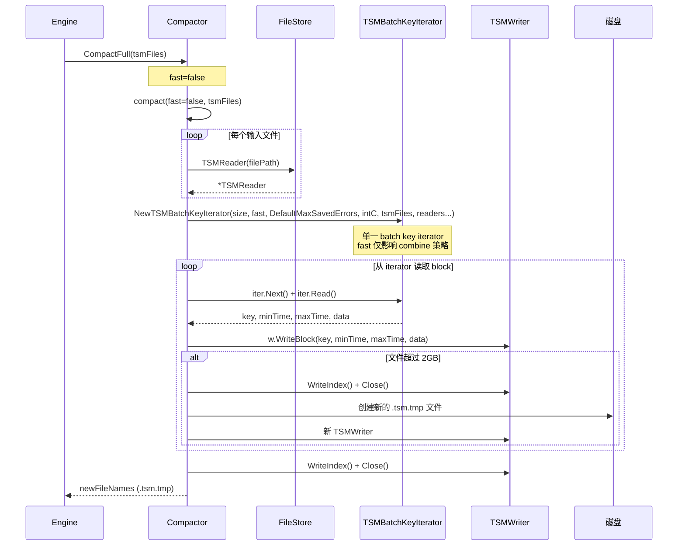

#### compact() 核心实现

```go
// tsdb/engine/tsm1/compact.go:961 — compact
func (c *Compactor) compact(fast bool, tsmFiles []string, logger *zap.Logger, pointsPerBlock int) ([]string, error) {
    size := pointsPerBlock  // 通常 DefaultMaxPointsPerBlock (1000); optimize 路径可放大

    // 1. 找到最大 generation 和 sequence
    var maxGeneration, maxSequence int
    for _, f := range tsmFiles {
        gen, seq, _ := c.parseFileName(f)
        if gen > maxGeneration || (gen == maxGeneration && seq > maxSequence) {
            maxGeneration, maxSequence = gen, seq
        }
    }

    // 2. 打开所有输入文件的 TSMReader
    var trs []*TSMReader
    for _, file := range tsmFiles {
        tr := c.FileStore.TSMReader(file)  // 获取已有 reader 的引用
        trs = append(trs, tr)
    }

    // 3. 创建 KeyIterator；当前实现统一使用 tsmBatchKeyIterator
    tsm, err := NewTSMBatchKeyIterator(size, fast, DefaultMaxSavedErrors, intC, tsmFiles, trs...)
    if err != nil {
        return nil, err
    }

    // 4. 写入新文件
    return c.writeNewFiles(maxGeneration, maxSequence, tsmFiles, tsm, true)
}
```

### 5.2 writeNewFiles — 文件轮转写入

```go
// tsdb/engine/tsm1/compact.go:1143 — writeNewFiles
func (c *Compactor) writeNewFiles(generation, sequence int, src []string, iter KeyIterator, throttle bool, logger *zap.Logger) ([]string, error) {
    var files []string
    var eInProgress errCompactionInProgress

    for {
        sequence++
        // 文件名: XXXXXX-YY.tsm.tmp
        fileName := filepath.Join(c.Dir, c.formatFileName(generation, sequence)+"."+TSMFileExtension+"."+TmpTSMFileExtension)

        // write 返回 (rollToNext, err): rollToNext=true 表示文件已满，需开新文件
        rollToNext, err := c.write(fileName, iter, throttle, logger)

        if rollToNext {
            // 文件已满 (size 超 2GB 或 ErrMaxBlocksExceeded)，继续写下一个
            files = append(files, fileName)
            continue
        } else if errors.Is(err, ErrNoValues) {
            // 只有 tombstone 的空文件，删除并结束
            if err := os.RemoveAll(fileName); err != nil {
                return nil, c.RemoveTmpFilesOnErr(files, err)
            }
            break
        } else if errors.As(err, &eInProgress) {
            // errCompactionInProgress: 若底层是 fs.ErrExist 表示另一 compaction 正在使用该文件
            if !errors.Is(eInProgress.err, fs.ErrExist) {
                logger.Error("error creating compaction file", zap.String("output_file", fileName), zap.Error(err))
            } else {
                logger.Warn("file exists, compaction in progress already", zap.String("output_file", fileName))
            }
            return nil, c.RemoveTmpFilesOnErr(files, err)
        } else if err != nil {
            // 其他错误，清理已创建的临时文件 (含当前文件)
            return nil, c.RemoveTmpFilesOnErr(files, err, os.RemoveAll(fileName))
        }

        files = append(files, fileName)
        break
    }
    return files, nil
}
```

#### write() — 单文件写入

```go
// tsdb/engine/tsm1/compact.go:1198 — write
func (c *Compactor) write(path string, iter KeyIterator, throttle bool, logger *zap.Logger) (rollToNext bool, err error) {
    fd, err := os.OpenFile(path, os.O_CREATE|os.O_RDWR|os.O_EXCL, 0666)
    if err != nil {
        return false, errCompactionInProgress{err: err}
    }

    // 选择 TSMWriter: 索引 > 64MB 时用磁盘缓冲
    var w TSMWriter
    if iter.EstimatedIndexSize() > 64*1024*1024 {
        w, _ = NewTSMWriterWithDiskBuffer(fd)
    } else {
        w, _ = NewTSMWriter(fd)
    }

    // defer 在函数返回时统一处理 w.Close() 与文件清理:
    // - rollToNext 或 errCompactionInProgress(fs.ErrExist) 时保留文件;
    // - 其他错误时调用 w.Remove() 删除文件 (compact.go:1233-1251)。
    defer func() {
        // ... 见 compact.go:1233-1251, 根据 err/closeErr/rollToNext 决定是否删除文件
        w.Close()
    }()

    // 写入 Header (5 字节)
    w.WriteHeader()

    // 遍历 iterator，逐 block 写入
    for iter.Next() {
        // 检查 compaction 是否被禁用 (非 intC select; 中断间接经由 iterator Read)
        c.mu.RLock()
        enabled := c.snapshotsEnabled || c.compactionsEnabled
        c.mu.RUnlock()
        if !enabled {
            return false, errCompactionAborted{}
        }

        key, minTime, maxTime, block, err := iter.Read()
        if err != nil {
            return false, err
        }

        // 写入 block: CRC32(4B) + Data(NB)
        if err := w.WriteBlock(key, minTime, maxTime, block); errors.Is(err, ErrMaxBlocksExceeded) {
            if err := w.WriteIndex(); err != nil {
                return false, err
            }
            return true, err  // rollToNext=true，由 defer 关闭文件
        } else if err != nil {
            return false, err
        }

        // 检查文件大小限制 (2GB): 超过则 WriteIndex 并返回 rollToNext=true
        if w.Size() > tsdb.MaxTSMFileSize {
            if err := w.WriteIndex(); err != nil {
                return false, err
            }
            return true, errMaxFileExceeded  // Close 由 defer 处理
        }
    }

    // 写入 Index + Footer
    if err := w.WriteIndex(); err != nil {
        return false, err
    }
    return false, nil
}
```

### 5.3 Compaction 的文件大小限制

```go
// tsdb/config.go:86
MaxTSMFileSize = uint32(2048 * 1024 * 1024) // 2GB
```

当输出文件超过 2GB 时，Compactor 会创建新的 TSM 文件继续写入。
compaction 路径中通过 `tsdb.MaxTSMFileSize` 引用该常量 (如 compact.go 中 `w.Size() > tsdb.MaxTSMFileSize`)。

### 5.4 FileStore.Replace — 原子替换

Compaction 完成后，新文件通过 `FileStore.Replace()` 原子替换旧文件。

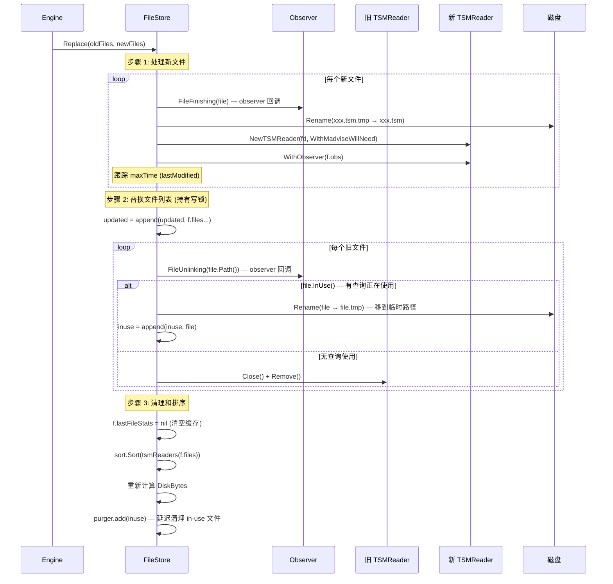

```go
// tsdb/engine/tsm1/file_store.go:733 — replace
func (f *FileStore) replace(oldFiles, newFiles []string, updatedFn func(r []TSMFile)) error {
    if len(oldFiles) == 0 && len(newFiles) == 0 {
        return nil
    }

    f.mu.RLock()
    maxTime := f.lastModified
    f.mu.RUnlock()

    updated := make([]TSMFile, 0, len(newFiles))

    // 步骤 1: 处理新文件
    for _, file := range newFiles {
        // observer 回调: FileFinishing
        if err := f.obs.FileFinishing(file); err != nil {
            return err
        }

        // 重命名 .tsm.tmp → .tsm
        var oldName, newName = file, file
        if strings.HasSuffix(oldName, ".tsm.tmp") {
            newName = file[:len(file)-4]
            if err := os.Rename(oldName, newName); err != nil {
                return err
            }
        }

        // 打开新文件 (带 WithMadviseWillNeed 选项)
        fd, err := os.Open(newName)
        if err != nil {
            // 错误回滚: 重命名回原名
            if newName != oldName {
                os.Rename(newName, oldName)
            }
            return err
        }

        // 跟踪 lastModified
        if stat, err := fd.Stat(); err == nil {
            if maxTime.IsZero() || stat.ModTime().UTC().After(maxTime) {
                maxTime = stat.ModTime().UTC()
            }
        }

        tsm, err := NewTSMReader(fd, f.readerOptions...)
        if err != nil {
            if newName != oldName {
                os.Rename(newName, oldName)
            }
            return err
        }
        tsm.WithObserver(f.obs)
        updated = append(updated, tsm)
    }

    // 步骤 2: 替换文件列表 (持有写锁)
    f.mu.Lock()
    defer f.mu.Unlock()

    updated = append(updated, f.files...)
    var active, inuse []TSMFile
    for _, file := range updated {
        keep := true
        for _, remove := range oldFiles {
            if remove == file.Path() {
                keep = false

                // observer 回调: FileUnlinking
                f.obs.FileUnlinking(file.Path())

                // 处理正在被查询使用的文件
                if file.InUse() {
                    // 重命名为临时路径，延迟清理
                    tempPath := file.Path() + ".tmp"
                    file.Rename(tempPath)
                    inuse = append(inuse, file)
                    continue
                }

                file.Close()
                file.Remove()
                break
            }
        }
        if keep {
            active = append(active, file)
        }
    }

    // 告诉 purger 延迟清理 in-use 文件
    f.purger.add(inuse)

    // 更新 lastModified (确保时间前进)
    if maxTime.Equal(f.lastModified) || maxTime.Before(f.lastModified) {
        maxTime = f.lastModified.UTC().Add(1)
    }
    f.lastModified = maxTime.UTC()

    // 清除缓存
    f.lastFileStats = nil
    f.files = active
    sort.Sort(tsmReaders(f.files))
    // 重新计算磁盘大小统计
}
```

## 6. 时间线数据合并 — tsmBatchKeyIterator 从原始 block 到归并输出

### 6.1 tsmBatchKeyIterator 路径

> **小白解释**: 合并多个 TSM 文件就像**合并多副扑克牌**。
>
> 每副牌（TSM 文件）内部已经按顺序排好了。现在要把它们合并成一副有序的大牌。
>
> **当前实现**: 牌局由 `tsmBatchKeyIterator` 统一处理。它先按 key 收集所有输入文件的 block，
> 再由 `compact.gen.go` 生成的 `merge*/combine*` 判断是否需要解码、去重、排除 tombstone 和重编码。
>
> 只有时间范围重叠、部分读取或带 tombstone 的 block 必须走解码合并；完整且无需 dedup 的 block
> 可以作为 encoded block 进入 `k.merged`，避免不必要的重编码。

`Compactor.compact()` 统一创建 `NewTSMBatchKeyIterator(...)`；不存在额外的合并迭代器。

#### 完整合并流程

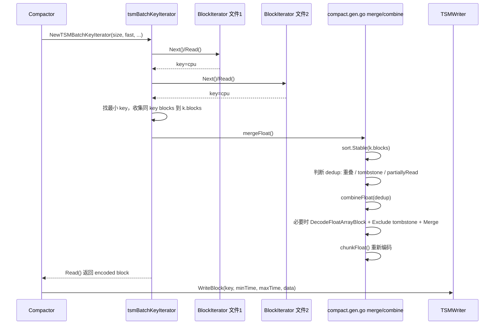

### 6.2 Next — 收集同 key blocks 与 tombstone 范围

`Next()` 是合并的入口。它从每个输入文件的 `BlockIterator` 读取 block，
将每个 block 的原始 bytes、时间范围、类型和 tombstone 范围保存到 `k.buf`。
随后在所有 reader 的当前 block 中找到最小 key，并把同 key 的 blocks 合并到 `k.blocks`。

```go
// tsdb/engine/tsm1/compact.go:1577-1606, 1666-1682 — Next 摘要
if iter.Next() {
    key, minTime, maxTime, typ, _, b, err := iter.Read()
    if err != nil { k.AppendError(errBlockRead{k.currentTsm, err}) }

    tombstones := iter.r.TombstoneRange(key)
    blk := &block{
        key: key, typ: typ, b: b,
        minTime: minTime, maxTime: maxTime,
        tombstones: tombstones,
        readMin: math.MaxInt64, readMax: math.MinInt64,
    }
    k.buf[i] = append(k.buf[i], blk)
}

// 找最小 key，再收集所有同 key blocks。
for i, b := range k.buf {
    if len(b) > 0 && bytes.Equal(b[0].key, k.key) {
        k.blocks = append(k.blocks, b...)
        k.buf[i] = k.buf[i][:0]
    }
}
```

### 6.3 mergeFloat / combineFloat — 类型化数组归并

`mergeFloat()` 先排序 block，再判断是否需要 dedup。只要存在 tombstone、部分读取或时间范围重叠，
`dedup` 就会变成 true，后续 `combineFloat(true)` 会解码、排除 tombstone、归并、重编码。

```go
// compact.gen.go:16 — mergeFloat
func (k *tsmBatchKeyIterator) mergeFloat() {
    sort.Stable(k.blocks)

    dedup := k.mergedFloatValues.Len() != 0
    if len(k.blocks) > 0 && !dedup {
        dedup = len(k.blocks[0].tombstones) > 0 || k.blocks[0].partiallyRead()
        for i := 1; !dedup && i < len(k.blocks); i++ {
            dedup = k.blocks[i].partiallyRead() ||
                k.blocks[i].overlapsTimeRange(k.blocks[i-1].minTime, k.blocks[i-1].maxTime) ||
                len(k.blocks[i].tombstones) > 0
        }
    }

    k.merged = k.combineFloat(dedup)
}
```

`combineFloat(dedup=true)` 中会解码重叠 block，并对每个 block 应用 tombstone：

```go
// compact.gen.go:77-107 — combineFloat 摘要
var v tsdb.FloatArray
if err := DecodeFloatArrayBlock(k.blocks[i].b, &v); err != nil {
    k.handleDecodeError(err, "float")
    return nil
}
v.Exclude(k.blocks[i].readMin, k.blocks[i].readMax)
v.Include(minTime, maxTime)

for _, ts := range k.blocks[i].tombstones {
    v.Exclude(ts.Min, ts.Max)
}

k.mergedFloatValues.Merge(&v)
```

`combineFloat(dedup=false)` 仍会对需要合并的小 block 解码并应用 tombstone；
完整、未读且不需要合并的单个 block 可以直接追加到 `k.merged`：

```go
// compact.gen.go:151-180 — combineFloat 非 dedup 路径摘要
if i == len(k.blocks)-1 {
    if !k.blocks[i].read() {
        k.merged = append(k.merged, k.blocks[i])
    }
    i++
}

for i < len(k.blocks) && k.mergedFloatValues.Len() < k.size {
    var v tsdb.FloatArray
    DecodeFloatArrayBlock(k.blocks[i].b, &v)
    for _, ts := range k.blocks[i].tombstones {
        v.Exclude(ts.Min, ts.Max)
    }
    k.blocks[i].markRead(k.blocks[i].minTime, k.blocks[i].maxTime)
    k.mergedFloatValues.Merge(&v)
}
```

**tsdb.FloatArray.Merge — 归并排序去重**:

```go
// tsdb/array.go — FloatArray.Merge
func (a *FloatArray) Merge(other *FloatArray) {
    // 归并排序: 两个已排序数组合并为一个
    // 相同时间戳: 保留 other 的值 (后写覆盖)
    // 时间复杂度: O(N + M)
    // 空间复杂度: O(N + M) (新分配)

    result := &FloatArray{
        Timestamps: make([]int64, 0, a.Len()+other.Len()),
        Values:     make([]float64, 0, a.Len()+other.Len()),
    }

    i, j := 0, 0
    for i < a.Len() && j < other.Len() {
        if a.Timestamps[i] < other.Timestamps[j] {
            result.Timestamps = append(result.Timestamps, a.Timestamps[i])
            result.Values = append(result.Values, a.Values[i])
            i++
        } else if a.Timestamps[i] > other.Timestamps[j] {
            result.Timestamps = append(result.Timestamps, other.Timestamps[j])
            result.Values = append(result.Values, other.Values[j])
            j++
        } else {
            // 相同时间戳: 保留 other (新数据)
            result.Timestamps = append(result.Timestamps, other.Timestamps[j])
            result.Values = append(result.Values, other.Values[j])
            i++
            j++
        }
    }
    // 追加剩余...

    *a = *result
}
```

### 6.4 chunkFloat — 分块重编码

归并后的类型化数组需要按 `k.size`（通常 1000 个点）分块，重新编码为 TSM block 格式。

```go
// tsdb/engine/tsm1/compact.gen.go:194 — chunkFloat
func (k *tsmBatchKeyIterator) chunkFloat(dst blocks) blocks {
    if k.mergedFloatValues.Len() > k.size {
        var values tsdb.FloatArray
        values.Timestamps = k.mergedFloatValues.Timestamps[:k.size]
        minTime, maxTime := values.Timestamps[0], values.Timestamps[len(values.Timestamps)-1]
        values.Values = k.mergedFloatValues.Values[:k.size]

        cb, err := EncodeFloatArrayBlock(&values, nil)
        if err != nil {
            k.handleEncodeError(err, "float")
            return nil
        }
        dst = append(dst, &block{key: k.key, minTime: minTime, maxTime: maxTime, b: cb})

        k.mergedFloatValues.Timestamps = k.mergedFloatValues.Timestamps[k.size:]
        k.mergedFloatValues.Values = k.mergedFloatValues.Values[k.size:]
        return dst
    }

    if k.mergedFloatValues.Len() > 0 {
        minTime := k.mergedFloatValues.Timestamps[0]
        maxTime := k.mergedFloatValues.Timestamps[len(k.mergedFloatValues.Timestamps)-1]
        cb, err := EncodeFloatArrayBlock(k.mergedFloatValues, nil)
        if err != nil {
            k.handleEncodeError(err, "float")
            return nil
        }
        dst = append(dst, &block{key: k.key, minTime: minTime, maxTime: maxTime, b: cb})
        k.mergedFloatValues.Timestamps = k.mergedFloatValues.Timestamps[:0]
        k.mergedFloatValues.Values = k.mergedFloatValues.Values[:0]
    }
    return dst
}
```

**EncodeFloatArrayBlock** 编码过程:
1. Gorilla XOR 编码时间戳 → 压缩字节
2. Gorilla XOR 编码值 → 压缩字节
3. `packBlock`: type(1B) + tsLen(varint) + tsBytes + valueBytes
4. 前缀 CRC32(4B)

### 6.5 tsmBatchKeyIterator 总体流程

当前实现只有 batch key iterator 路径；`fast` 的区别体现在 `combine*` 是否尽量保留完整 block。
`mergeFloat()` 流程：

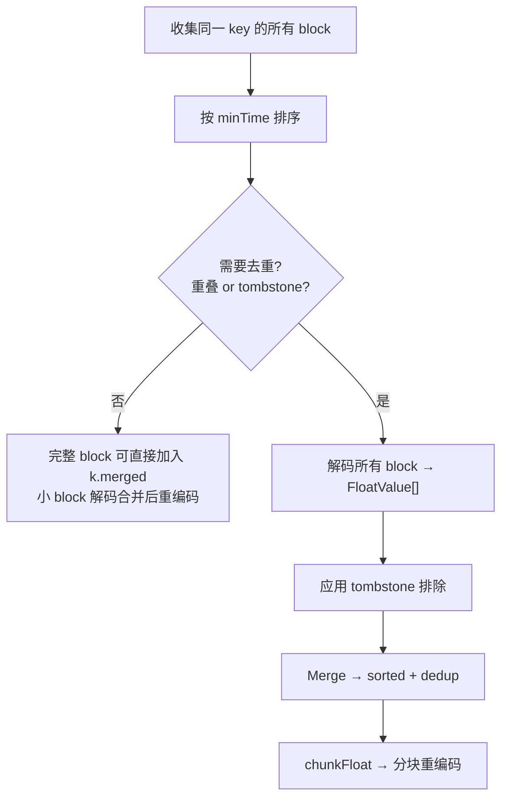

**Tombstone 与 Compaction 交互案例**:

> **具体案例**: 假设 TSM 文件 1 包含 key=`cpu,host=web#!~#value` 的以下 block:
>
> ```
> Block A: [t1=100, t2=200, t3=300]  (时间范围 100-300)
> Block B: [t4=400, t5=500, t6=600]  (时间范围 400-600)
> ```
>
> 用户执行 `DELETE FROM cpu WHERE host='web' AND time >= 200 AND time < 500`
>
> 生成 tombstone: `{Key: "cpu,host=web#!~#value", Min: 200, Max: 499}`
>
> Compaction 时 (`compact.gen.go` 生成的 `combineFloat`):
>
> ```go
> // compact.gen.go:77-107 / 167-185 — combineFloat 摘要
> var v tsdb.FloatArray
> DecodeFloatArrayBlock(k.blocks[i].b, &v)
>
> for _, ts := range k.blocks[i].tombstones {
>     v.Exclude(ts.Min, ts.Max)  // Exclude(200, 499)
> }
>
> k.mergedFloatValues.Merge(&v)
> // 后续 chunkFloat() 将 mergedFloatValues 重新编码成输出 block
> ```
>
> Block A: 解码后 `[100, 200, 300]` → tombstone 排除 `[200, 499]` → 剩余 `[100]`
> Block B: 解码后 `[400, 500, 600]` → tombstone 排除 `[200, 499]` → 剩余 `[500, 600]`
>
> 最终输出: `[100, 500, 600]` — tombstone 范围内的数据被物理删除
>
> 如果排除后同一 key 没有任何 merged block，`tsmBatchKeyIterator.Next()` 会继续读取下一个 key。

## 7. 错误处理

### 7.0 错误类型定义

```go
// tsdb/engine/tsm1/compact.go:50-82
type errCompactionInProgress struct { err error }  // struct 类型，类型断言比较
type errCompactionAborted struct { err error }      // struct 类型，由 interrupt channel 触发
type errBlockRead struct {                          // struct 类型，包含损坏文件路径
    file string
    err  error
}

var errCompactionsDisabled = errors.New("compactions disabled")  // error 变量，== 比较
```

> **关键区别**: `errCompactionsDisabled` 是包级 error 变量，用 `==` 比较。
> `errCompactionInProgress`、`errCompactionAborted`、`errBlockRead` 是 struct 类型，用类型断言比较。

### 7.0.1 compactCache vs compact 的退出通道

```go
// compactCache 使用 e.snapDone 通道退出
func (e *Engine) compactCache() {
    quit := e.snapDone  // snapshot 相关
    select { case <-quit: return ... }
}

// compact 使用 e.done 通道退出
func (e *Engine) compact(wg *sync.WaitGroup) {
    quit := e.done  // compaction 相关
    select { case <-quit: return ... }
}
```

### 7.0.2 compactionStrategy 结构

```go
// tsdb/engine/tsm1/engine.go:2564 — compactionStrategy
type compactionStrategy struct {
    group CompactionGroup

    fast           bool   // true = CompactFast (快速重写), false = CompactFull (完整合并)
    level          int
    pointsPerBlock int    // 每个 block 的最大点数 (通常 DefaultMaxPointsPerBlock; optimize 路径可放大)

    durationStat *int64
    activeStat   *int64
    successStat  *int64
    errorStat    *int64

    logger    *zap.Logger
    compactor *Compactor
    fileStore *FileStore

    engine *Engine
}
```

### 7.0.3 acquire/Release 机制

Planner 通过 `filesInUse` map 防止多个 plan 返回同一文件:

```go
// tsdb/engine/tsm1/compact.go:660 — acquire
func (c *DefaultPlanner) acquire(groups []CompactionGroup) bool {
    c.mu.Lock()
    defer c.mu.Unlock()
    // 检查文件是否已被其他 plan 占用
    for _, g := range groups {
        for _, f := range g {
            if _, ok := c.filesInUse[f]; ok {
                return false
            }
        }
    }
    // 标记所有文件为 in-use
    for _, g := range groups {
        for _, f := range g {
            c.filesInUse[f] = struct{}{}
        }
    }
    return true
}

// tsdb/engine/tsm1/compact.go:684 — Release
func (c *DefaultPlanner) Release(groups []CompactionGroup) {
    c.mu.Lock()
    defer c.mu.Unlock()
    for _, g := range groups {
        for _, f := range g {
            delete(c.filesInUse, f)
        }
    }
}
```

### 7.0.4 forceFull 机制

```go
// tsdb/engine/tsm1/compact.go:222 — ForceFull
func (c *DefaultPlanner) ForceFull() {
    c.mu.Lock()
    defer c.mu.Unlock()
    c.forceFull = true
}
```

当 `forceFull = true` 时:
- `PlanLevel()` 返回 `(nil, 0)`，`PlanOptimize()` 返回 `(nil, 0, 0)`（不抢占文件）
- `Plan()` 重置 `forceFull = false` 并执行 full compaction

### 7.0.5 Compactor 中的 Rate Limiting 和 Interrupt

```go
// tsdb/engine/tsm1/compact.go:1111 — write() 中的限速
if c.RateLimit != nil && throttle {
    limitWriter = limiter.NewWriterWithRate(fd, c.RateLimit)
}

// tsdb/engine/tsm1/compact.go:1117 — TSMWriter 磁盘缓冲
if iter.EstimatedIndexSize() > 64*1024*1024 {
    w, err = NewTSMWriterWithDiskBuffer(limitWriter)  // 索引 > 64MB 时用磁盘缓冲
}

// tsdb/engine/tsm1/compact.go:900 — compact() 中的 interrupt channel
c.mu.RLock()
intC := c.compactionsInterrupt
c.mu.RUnlock()

// 在遍历文件时检查 interrupt
for _, file := range tsmFiles {
    select {
    case <-intC:
        return nil, errCompactionAborted{}
    default:
    }
    // ...
}
```

**Compaction 中断检查点完整列表**:

Compaction 通过 `compactionsInterrupt` channel 实现优雅停止。关闭此 channel 后，所有正在执行的 compaction 会在下一个检查点返回 `errCompactionAborted{}`。

| # | 检查点位置 | 代码行 | 检查方式 |
|---|-----------|--------|---------|
| 1 | `compact()` — TSM 文件遍历循环 | compact.go:1016-1019 | `select { case <-intC: return nil, errCompactionAborted{} }` |
| 2 | `write()` — 每个 block 写入前 | compact.go:1255-1261 | `c.snapshotsEnabled \|\| c.compactionsEnabled` enabled-flag 检查 (非 intC select；中断间接经由 iterator Read 触发) |
| 3 | `tsmBatchKeyIterator.Read()` — 每次读取前 | compact.go:1721-1725 | `select { case <-k.interrupt: ... }` |
| 4 | `cacheKeyIterator.Read()` — 每次读取前 | compact.go:1910-1915 | `select { case <-c.interrupt: ... }` |

> **intC 传入路径**: `NewTSMBatchKeyIterator(size, fast, DefaultMaxSavedErrors, intC, tsmFiles, trs...)`
> (compact.go:1041) 将 `intC` 存为 `tsmBatchKeyIterator.interrupt` (`k.interrupt`)，后续由检查点 3 读取。
> 不存在 `tsmKeyIterator` 这一类型——当前实现只有 `tsmBatchKeyIterator` 与 `cacheKeyIterator` 两条 key iterator 路径。

**中断语义**: 中断不是立即停止——当前正在写入的 block 会完成，然后在下一个检查点返回错误。调用方（`compactGroup`）会清理已创建的临时文件。

```go
// tsdb/engine/tsm1/engine.go:2271 — compactGroup
func (s *compactionStrategy) compactGroup() {
    group := s.group  // 使用 s.group，不是参数
    // ... 日志记录 ...

    var (
        err   error
        files []string
    )

    // 根据 fast 标志选择 compaction 路径
    if s.fast {
        files, err = s.compactor.CompactFast(group)
    } else {
        files, err = s.compactor.CompactFull(group)
    }

    if err != nil {
        // 错误类型 1: Compaction 进行中 (类型断言)
        _, inProgress := err.(errCompactionInProgress)
        if err == errCompactionsDisabled || inProgress {
            log.Info("Aborted compaction", zap.Error(err))
            if _, ok := err.(errCompactionInProgress); ok {
                time.Sleep(time.Second)
            }
            return
        }

        log.Warn("Error compacting TSM files", zap.Error(err))

        // 错误类型 2: TSM 文件损坏 (errBlockRead) — 通过 errors.As + MoveTsmOnReadErr 处理
        // MoveTsmOnReadErr (engine.go:2663-2675) 内部用 errors.As(err, &blockReadErr)
        // 捕获 errBlockRead，再调用 replaceFn([]string{path}, nil) 移除损坏文件，
        // 最后 os.Rename(path, path+".bad") 标记为 .bad。
        // replaceFn = s.fileStore.Replace (2 参数版本，无 callback)。
        MoveTsmOnReadErr(err, log, s.fileStore.Replace)

        // 错误类型 3: 其他错误 (含 errCompactionAborted) — errorStat++, sleep, 返回
        atomic.AddInt64(s.errorStat, 1)
        time.Sleep(time.Second)
        return
    }

    // 成功: 替换旧文件 (FileStore.Replace 是 2 参数版本: oldFiles, newFiles)
    if err := s.fileStore.Replace(group, files); err != nil {
        // 替换失败: 删除新文件
        for _, file := range files { os.Remove(file) }
        atomic.AddInt64(s.errorStat, 1)
        return
    }
    atomic.AddInt64(s.successStat, 1)
}
```

> **小白解释**: Compaction 错误处理就像快递站的异常处理：
> - **Compaction 被禁用**: 使用 `==` 比较 (errCompactionsDisabled 是 error 变量)，记录日志后返回
> - **Compaction 进行中**: 使用类型断言 `err.(errCompactionInProgress)` (是 struct 类型)，sleep 1s 后返回
> - **文件损坏 (errBlockRead)**: 通过 `MoveTsmOnReadErr` 辅助函数处理，内部用 `errors.As(err, &blockReadErr)` 捕获，再调用 `s.fileStore.Replace([]string{path}, nil)` (2 参数) 移除损坏文件，`os.Rename` 标记为 `.bad`
> - **其他错误 (含 errCompactionAborted)**: errorStat++, sleep 1s 后返回
> - **成功**: `s.fileStore.Replace(group, files)` (2 参数) 替换文件，successStat++

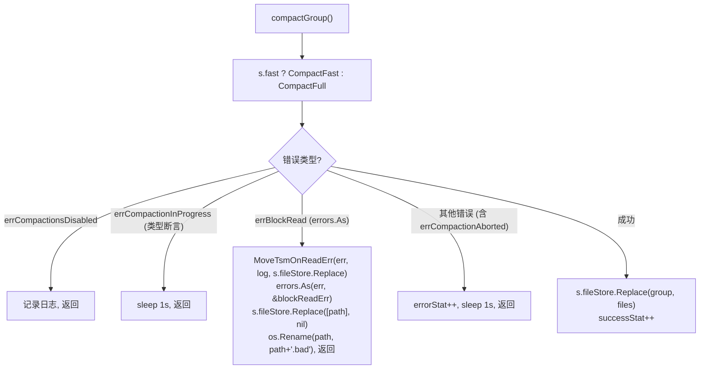

### 7.2 损坏文件处理

```go
// tsdb/engine/tsm1/file_store.go:555 — Open 中的损坏文件处理
// 每个文件在独立 goroutine 中打开，结果通过 channel 传递
func (f *FileStore) Open() error {
    // ... 每个文件在 goroutine 中打开 ...
    if err != nil {
        // 打开失败: 记录日志，重命名为 .bad
        f.logger.Error("Cannot read corrupt tsm file, renaming", ...)
        file.Close()
        os.Rename(file.Name(), file.Name()+"."+BadTSMFileExtension)
        // 通过 channel 发送错误
        readerC <- &res{r: df, err: fmt.Errorf("cannot read corrupt file %s: %v", ...)}
        return  // goroutine 退出
    }

    // 主循环: 从 channel 读取结果
    for range files {
        res := <-readerC
        if res.err != nil {
            return res.err  // 任何错误导致 Open() 失败!
        }
        f.files = append(f.files, res.r)
    }
}
```

> **重要**: 损坏文件会导致 `Open()` 返回错误，而不是静默跳过。
> 如果需要跳过损坏文件，调用者必须在 `Open()` 失败后自行处理（例如删除 .bad 文件后重试）。

## 8. TSM 文件统计

### 8.1 FileStat — 文件元数据

```go
// tsdb/engine/tsm1/file_store.go:199 — FileStat
type FileStat struct {
    Path         string
    HasTombstone bool
    Size         uint32
    LastModified int64
    MinTime      int64  // 文件中最小时间戳
    MaxTime      int64  // 文件中最大时间戳
    MinKey       []byte // 文件中最小 key
    MaxKey       []byte // 文件中最大 key
}
```

### 8.2 TSMReader.Stats — 获取文件统计

```go
// tsdb/engine/tsm1/reader.go:563 — TSMReader.Stats
func (t *TSMReader) Stats() FileStat {
    minTime, maxTime := t.index.TimeRange()
    minKey, maxKey := t.index.KeyRange()
    return FileStat{
        Path:         t.Path(),
        Size:         t.Size(),
        LastModified: t.LastModified(),
        MinTime:      minTime,
        MaxTime:      maxTime,
        MinKey:       minKey,
        MaxKey:       maxKey,
        HasTombstone: t.tombstoner.HasTombstones(),
    }
}
```

### 8.3 FileStore.Stats — 懒缓存 (双检锁)

```go
// tsdb/engine/tsm1/file_store.go:694 — FileStore.Stats
func (f *FileStore) Stats() []FileStat {
    // 第一次检查: RLock 快速路径
    f.mu.RLock()
    if len(f.lastFileStats) > 0 {
        defer f.mu.RUnlock()
        return f.lastFileStats
    }
    f.mu.RUnlock()

    // 缓存失效: 升级为写锁
    f.mu.Lock()
    defer f.mu.Unlock()

    // 第二次检查: 可能其他 goroutine 已经填充了缓存
    if len(f.lastFileStats) > 0 {
        return f.lastFileStats
    }

    // 容量检查: 如果缓存容量远小于文件数，重新分配
    if cap(f.lastFileStats) < len(f.files)/2 {
        f.lastFileStats = make([]FileStat, 0, len(f.files))
    }

    for _, fd := range f.files {
        f.lastFileStats = append(f.lastFileStats, fd.Stats())
    }
    return f.lastFileStats
}
```

**缓存失效**: 当文件被添加、删除或替换时，`lastFileStats` 被设为 `nil` (`f.lastFileStats = nil`)，
强制下次调用重新计算。注意: Stats() 使用 `len() > 0` 检查（而非 `== nil`），使代码在两种失效方式下都能正确工作。

### 8.4 EngineStatistics — 引擎统计

```go
// tsdb/engine/tsm1/engine.go:636 — EngineStatistics
type EngineStatistics struct {
    CacheCompactions        int64
    CacheCompactionsActive  int64
    CacheCompactionErrors   int64
    CacheCompactionDuration int64

    TSMCompactions        [3]int64  // Level 1-3 的 compaction 次数
    TSMCompactionsActive  [3]int64  // Level 1-3 的活跃 compaction 数
    TSMCompactionErrors   [3]int64
    TSMCompactionDuration [3]int64
    TSMCompactionsQueue   [3]int64  // Level 1-3 的队列深度

    TSMOptimizeCompactions        int64
    TSMOptimizeCompactionsActive  int64
    TSMOptimizeCompactionErrors   int64
    TSMOptimizeCompactionDuration int64
    TSMOptimizeCompactionsQueue   int64

    TSMFullCompactions        int64
    TSMFullCompactionsActive  int64
    TSMFullCompactionErrors   int64
    TSMFullCompactionDuration int64
    TSMFullCompactionsQueue   int64
}
```

## 9. 架构设计意图

### 9.1 为什么用多级 Compaction

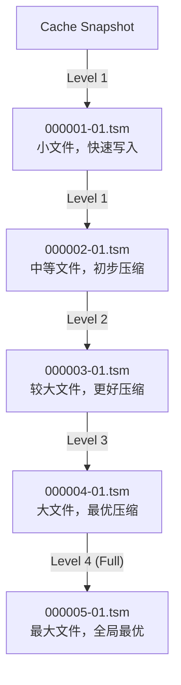

**多级 Compaction 的优势**：
1. **渐进式压缩**：每级 compact 4 个文件，避免一次性 compact 所有文件
2. **写入放大控制**：每次只 compact 同级别的文件，减少写入量
3. **查询性能**：较低级别的文件数量少，查询时需要扫描的文件更少

### 9.2 为什么用优先级调度

- **Level 1-2**: 高优先级，因为它们是新数据，查询频率高
- **Level 3**: 低优先级，因为它是中间状态
- **Level 4**: 最低优先级，因为它是冷数据优化

### 9.3 为什么用 ticker 驱动

- **简单可靠**: 不需要复杂的事件通知机制
- **自愈性**: 即使某次 compaction 失败，下次 tick 会重新检查
- **可预测**: 固定的检查间隔，便于性能调优

## 10. 架构收益

| 维度 | 收益 |
|------|------|
| **写入性能** | Cache Snapshot 快速写入 sequence=1/Level 1 文件，不阻塞查询 |
| **查询性能** | 多级 compaction 减少文件数量，提高查询效率 |
| **压缩比** | 渐进式压缩，最终达到最优压缩比 |
| **I/O 控制** | 写冷超时触发 full compaction，避免与写入竞争 |
| **内存控制** | 自适应并发，根据 series 基数调整并发度 |
| **错误恢复** | 损坏文件会尝试标记为 .bad，但 `FileStore.Open()` 返回错误，调用方需要处理后重试 |

## 11. 潜在隐患与瓶颈

### 11.1 Compaction 的写入放大

每级 compaction 都会重写数据，导致写入放大。对于写入密集的场景，这可能成为瓶颈。

### 11.2 Full Compaction 的 I/O 风暴

Full compaction 需要读取所有文件并写入一个新文件。当文件总量很大时，这会导致显著的 I/O 开销。

### 11.3 Compaction 并发控制

硬编码的 4 文件限制可能导致文件数量很多时 compaction 速度跟不上写入速度。

### 11.4 优先级抢占的不公平

高优先级可以无限制抢占低优先级，可能导致 Level 3/4 永远无法执行。

### 11.5 损坏文件会阻止 Open 成功

损坏文件会被记录日志并尝试重命名为 `.bad`，但当前 `FileStore.Open()` 会返回错误，
不是静默跳过。调用方需要处理错误、移除或修复坏文件后重试。

### 11.6 Tombstone 处理延迟

Tombstone 只有在 compaction 时才会被真正删除。如果 compaction 不频繁，tombstone 会持续占用空间。
