# Module 5: Downsampling (CQ 窗口机制 + RESAMPLE 语义 + 资源隔离) - 深度审计报告

> **小白导读**: 降采样就像**数据摘要**。原始数据每秒一个点，存一年就是 3153 万个点。
> 但你可能只需要每分钟的平均值——一年只需要 52 万个点，少了 60 倍！
>
> **CQ (Continuous Query)** 就是自动执行的降采样任务：
> - 每隔一段时间（如每分钟），自动查询原始数据
> - 计算聚合结果（平均值、最大值、最小值等）
> - 写入到新的 measurement（如从 `cpu_raw` 写入 `cpu_1m`）
>
> 就像一个自动文摘机器人：每隔一小时，把报纸上的文章压缩成一句话摘要。

## 1. CQ 执行全链路总览

### 1.1 从定时器到降采样写入的完整路径

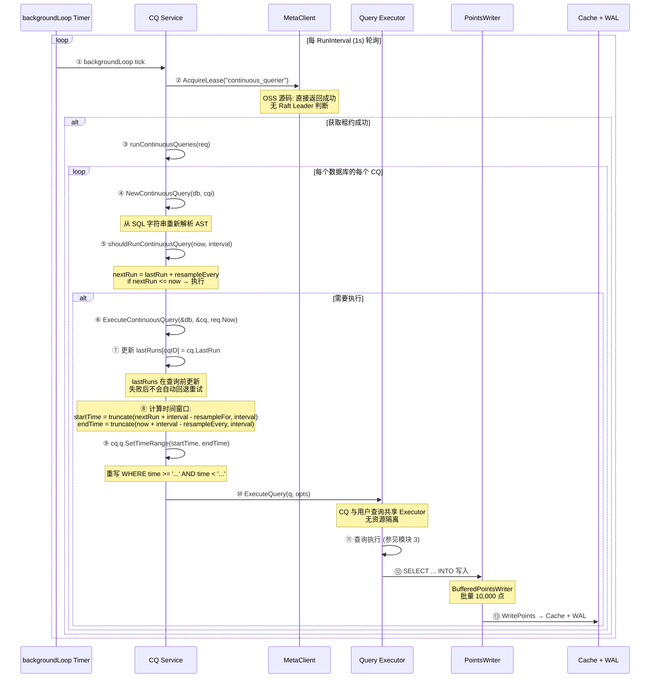

### 1.2 每一步的代码实现

#### 步骤 ①: backgroundLoop — 双触发源

```go
// services/continuous_querier/service.go:216 — backgroundLoop
func (s *Service) backgroundLoop() {
    t := time.NewTimer(s.RunInterval)  // 默认 1s
    defer t.Stop()
    defer s.wg.Done()
    for {
        select {
        case <-s.stop:
            s.Logger.Info("Terminating continuous query service")
            return

        // 触发源 1: 手动触发 (事件时间)
        case req := <-s.RunCh:
            if !s.hasContinuousQueries() {
                continue
            }
            if _, err := s.MetaClient.AcquireLease(leaseName); err == nil {
                s.runContinuousQueries(req)
            }

        // 触发源 2: 定时器 (处理时间)
        case <-t.C:
            if !s.hasContinuousQueries() {
                t.Reset(s.RunInterval)
                continue
            }
            if _, err := s.MetaClient.AcquireLease(leaseName); err == nil {
                s.runContinuousQueries(&RunRequest{Now: time.Now()})
            }
            t.Reset(s.RunInterval)
        }
    }
}
```

**select 的三个 case**:
- **停止信号** (`s.stop`)：服务关闭时退出循环
- **事件时间** (`RunCh`)：外部推送，可指定任意 `Now`（如手动触发 CQ）
- **处理时间** (`t.C`)：每秒检查，使用 `time.Now()`

#### 补充: Run() 公开方法与 RunRequest.CQs 的真实关系

```go
// services/continuous_querier/service.go:52 — RunRequest 结构体
type RunRequest struct {
    Now time.Time   // 当前时间
    CQs []string    // 指定要执行的 CQ 名称，nil 表示全部执行
}

// services/continuous_querier/service.go:61 — matches 过滤
func (rr *RunRequest) matches(cq *meta.ContinuousQueryInfo) bool {
    if rr.CQs == nil {
        return true
    }
    for _, q := range rr.CQs {
        if q == cq.Name {
            return true
        }
    }
    return false
}

// services/continuous_querier/service.go:180 — Run 公开方法
func (s *Service) Run(database, name string, t time.Time) error {
    var dbs []meta.DatabaseInfo
    if database != "" {
        db := s.MetaClient.Database(database)
        if db == nil {
            return query.ErrDatabaseNotFound(database)
        }
        dbs = append(dbs, *db)
    } else {
        dbs = s.MetaClient.Databases()
    }

    // 清除匹配 CQ 的 lastRuns，使其被视为"首次执行"
    s.mu.Lock()
    defer s.mu.Unlock()
    for _, db := range dbs {
        for _, cq := range db.ContinuousQueries {
            if name == "" || cq.Name == name {
                id := fmt.Sprintf("%s%s%s", db.Name, idDelimiter, cq.Name)
                delete(s.lastRuns, id)
            }
        }
    }

    // 通过 RunCh 触发执行
    s.RunCh <- &RunRequest{Now: t}
    return nil
}

// services/continuous_querier/service.go:248 — hasContinuousQueries 早期退出优化
func (s *Service) hasContinuousQueries() bool {
    dbs := s.MetaClient.Databases()
    for _, db := range dbs {
        if len(db.ContinuousQueries) > 0 {
            return true
        }
    }
    return false
}
```

**Run() 的真实语义**: 外部调用者（如 CLI 或 API）可传入 `database` 和 `name`，但当前 `Run()` 并不会把它们填入 `RunRequest.CQs`。它只删除匹配 CQ 的 `lastRuns` 项，然后发送 `RunRequest{Now: t}`。由于 `CQs` 仍为 `nil`，后台 `runContinuousQueries` 仍会遍历所有数据库和所有 CQ；被删除 `lastRuns` 的 CQ 会被视为首次执行，其他 CQ 如果按自己的 `resampleEvery` 已到期，也可能在同一轮被执行。

因此，`Run(database, name, t)` 不是“只执行指定 CQ”的硬过滤器，而是“让匹配 CQ 立即具备执行资格”的调度触发。

#### 步骤 ②: AcquireLease — OSS 中直接成功

```go
// services/meta/client.go:128 — AcquireLease (单节点模式)
func (c *Client) AcquireLease(name string) (*Lease, error) {
    l := Lease{
        Name:       name,
        Expiration: time.Now().Add(DefaultLeaseDuration),  // 60s
    }
    return &l, nil  // 单节点始终成功
}

// services/meta/data.go:1824 — Leases.Acquire (集群模式)
func (leases *Leases) Acquire(name string, nodeID uint64) (*Lease, error) {
    leases.mu.Lock()
    defer leases.mu.Unlock()

    l := leases.m[name]
    if l != nil {
        if time.Now().After(l.Expiration) || l.Owner == nodeID {
            l.Expiration = time.Now().Add(leases.d)
            l.Owner = nodeID
            return l, nil
        }
        return l, errors.New("another node has the lease")
    }

    l = &Lease{
        Name:       name,
        Expiration: time.Now().Add(leases.d),
        Owner:      nodeID,
    }
    leases.m[name] = l
    return l, nil
}
```

**OSS 语义校准**:
- `MetaClient.AcquireLease()` 在当前 OSS 源码中不检查 Raft Leader，也不会写入共享租约状态；它构造一个本地 `Lease` 后直接返回成功。
- `services/meta/data.go` 中的 `Leases.Acquire` 是元数据结构上的租约辅助逻辑，但 CQ Service 通过 `Client.AcquireLease()` 调用时不会走到“仅 Leader 获取”的分支。
- 因此本模块描述 CQ 调度时应理解为“OSS 单进程直接执行”，而不是“Raft Leader 独占执行”。

#### 步骤 ③④: CQ 遍历与解析

```go
// services/continuous_querier/service.go:261 — runContinuousQueries
func (s *Service) runContinuousQueries(req *RunRequest) {
    dbs := s.MetaClient.Databases()
    for _, db := range dbs {
        for _, cq := range db.ContinuousQueries {
            if !req.matches(&cq) {
                continue
            }
            if ok, err := s.ExecuteContinuousQuery(&db, &cq, req.Now); err != nil {
                s.Logger.Info("Error executing query", zap.String("query", cq.Query), zap.Error(err))
                atomic.AddInt64(&s.stats.QueryFail, 1)
            } else if ok {
                atomic.AddInt64(&s.stats.QueryOK, 1)
            }
        }
    }
}

// services/continuous_querier/service.go:457 — ContinuousQuery 结构体
type ContinuousQuery struct {
    Database string
    Info     *meta.ContinuousQueryInfo  // 元数据中的 CQ 定义
    HasRun   bool                       // 是否已执行过
    LastRun  time.Time                  // 上次执行时间
    Resample ResampleOptions
    q        *influxql.SelectStatement  // 内部 SELECT AST
}

func (cq *ContinuousQuery) intoRP() string      { return cq.q.Target.Measurement.RetentionPolicy }
func (cq *ContinuousQuery) setIntoRP(rp string) { cq.q.Target.Measurement.RetentionPolicy = rp }

// services/continuous_querier/service.go:485 — NewContinuousQuery
func NewContinuousQuery(database string, cqi *meta.ContinuousQueryInfo) (*ContinuousQuery, error) {
    // 每次执行都从 SQL 字符串重新解析
    stmt, err := influxql.NewParser(strings.NewReader(cqi.Query)).ParseStatement()
    if err != nil {
        return nil, err
    }

    q, ok := stmt.(*influxql.CreateContinuousQueryStatement)
    if !ok || q.Source.Target == nil || q.Source.Target.Measurement == nil {
        return nil, errors.New("query isn't a valid continuous query")
    }

    return &ContinuousQuery{
        Database: database,
        Info:     cqi,
        Resample: ResampleOptions{
            Every: q.ResampleEvery,  // RESAMPLE EVERY
            For:   q.ResampleFor,    // RESAMPLE FOR
        },
        q: q.Source,  // 内部 SELECT 语句
    }, nil
}
```

**为什么每次执行都重新解析 SQL？**
- 配置热更新：修改 CQ 后无需重启
- 正确性：避免缓存 AST 与 meta store 不一致
- 代价：增加 CPU 开销

#### 步骤 ⑤: shouldRunContinuousQuery — 执行决策

```go
// services/continuous_querier/service.go:512 — shouldRunContinuousQuery
func (cq *ContinuousQuery) shouldRunContinuousQuery(now time.Time, interval time.Duration) (bool, time.Time, error) {
    // 1. 必须是聚合查询
    if cq.q.IsRawQuery {
        return false, cq.LastRun, errors.New("continuous queries must be aggregate queries")
    }

    // 2. RESAMPLE EVERY 覆盖 GROUP BY interval
    resampleEvery := interval
    if cq.Resample.Every != 0 {
        resampleEvery = cq.Resample.Every
    }

    // 3. 判断是否需要执行
    if cq.HasRun {
        // 获取上一窗口的时区偏移 (lastRun 前 1 秒)
        _, startOffset := cq.LastRun.Add(-1).Zone()
        nextRun := cq.LastRun.Add(resampleEvery)
        // 获取当前窗口结束时的时区偏移
        if _, endOffset := nextRun.Add(-1).Zone(); startOffset != endOffset {
            // DST 转换: 计算偏移差值（转为纳秒），仅在差值小于 resampleEvery 时调整
            diff := int64(startOffset-endOffset) * int64(time.Second)
            if abs(diff) < int64(resampleEvery) {
                nextRun = nextRun.Add(time.Duration(diff))
            }
        }
        if nextRun.UnixNano() <= now.UnixNano() {
            return true, nextRun, nil
        }
    } else {
        // 首次执行：使用 CQ 的时区设置
        loc := cq.q.Location
        if loc == nil {
            loc = time.UTC
        }
        return true, now.In(loc), nil
    }

    return false, cq.LastRun, nil
}
```

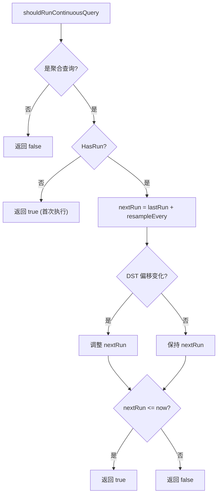

#### 步骤 ⑥⑦: 时间窗口计算

```go
// services/continuous_querier/service.go:282 — ExecuteContinuousQuery (时间窗口部分)
func (s *Service) ExecuteContinuousQuery(dbi *meta.DatabaseInfo, cqi *meta.ContinuousQueryInfo, now time.Time) (bool, error) {
    // 内部构造 ContinuousQuery（每次从 SQL 重新解析）
    cq, err := NewContinuousQuery(dbi.Name, cqi)
    if err != nil {
        return false, err
    }

    // 时区处理: 先转 UTC，再按 CQ 定义的时区转换
    now = now.UTC()
    if cq.q.Location != nil {
        now = now.In(cq.q.Location)
    }

    // 锁不是从方法入口开始；它从读取 lastRuns 前开始，并持有到方法返回。
    // 这意味着时间窗口计算、lastRuns 提前更新、查询执行和统计写入都在锁内。
    s.mu.Lock()
    defer s.mu.Unlock()

    // 获取 lastRuns 缓存
    id := fmt.Sprintf("%s%s%s", dbi.Name, idDelimiter, cqi.Name)
    cq.LastRun, cq.HasRun = s.lastRuns[id]

    // 设置默认 RP
    if cq.intoRP() == "" {
        cq.setIntoRP(dbi.DefaultRetentionPolicy)
    }

    // 获取 GROUP BY interval
    interval, err := cq.q.GroupByInterval()
    if err != nil {
        return false, err
    } else if interval == 0 {
        return false, nil
    }

    // 获取 offset (GROUP BY time(1m, 30s) 中的 30s)
    offset, err := cq.q.GroupByOffset()
    if err != nil {
        return false, err
    }

    // 判断是否需要执行
    run, nextRun, err := cq.shouldRunContinuousQuery(now, interval)
    if err != nil {
        return false, err
    } else if !run {
        return false, nil
    }

    // (a) resampleEvery 先初始化 (service.go:331-334)
    resampleEvery := interval
    if cq.Resample.Every != 0 {
        resampleEvery = cq.Resample.Every
    }

    // (b) lastRuns 在查询执行之前更新 (service.go:338-339)
    // 注意: 这里用的是上一步未 clamp 的 resampleEvery (原始 cq.Resample.Every 或 interval)
    cq.LastRun = truncate(now.Add(-offset), resampleEvery).Add(offset)
    s.lastRuns[id] = cq.LastRun

    // (c) resampleFor 计算 (service.go:345-350)
    resampleFor := interval
    if cq.Resample.For != 0 {
        resampleFor = cq.Resample.For
    } else if interval < resampleEvery {
        resampleFor = resampleEvery
    }

    // (d) 局部 clamp: 仅用于 endTime 对齐 (service.go:354-356)
    // shouldRunContinuousQuery 仍用原始 cq.Resample.Every 计算 nextRun
    if interval < resampleEvery {
        resampleEvery = interval
    }

    // 计算时间范围 [startTime, endTime)
    startTime := truncate(nextRun.Add(interval-resampleFor-offset-1), interval).Add(offset)
    endTime := truncate(now.Add(interval-resampleEvery-offset), interval).Add(offset)

    if !endTime.After(startTime) {
        return false, nil  // 无工作
    }

    // 设置 WHERE time >= startTime AND time < endTime
    cq.q.SetTimeRange(startTime, endTime)
}
```

**时间窗口计算示例**:

> **具体案例**: 假设你有一个温度传感器，每秒上报一次数据。
>
> ```sql
> -- 创建降采样 CQ: 每分钟计算一次平均温度
> CREATE CONTINUOUS QUERY "temp_avg_1m" ON "mydb"
>     RESAMPLE EVERY 1m FOR 5m
>     BEGIN
>         SELECT mean(temp) INTO "temp_1m" FROM "temp_raw" GROUP BY time(1m)
>     END
> ```
>
> 执行过程：
> ```
> t=12:01:00  CQ 触发
>   查询范围: [11:56:00, 12:01:00) — 回溯 5 分钟
>   结果: 5 个窗口的平均值
>   写入: temp_1m 表
>
> t=12:01:30  不触发 (EVERY=1m，nextRun=12:02:00)
>
> t=12:02:00  CQ 触发
>   查询范围: [11:57:00, 12:02:00)
>   结果: 包含了 12:01:00-12:02:00 的新数据
> ```

```
SQL: RESAMPLE EVERY 30s FOR 5m
     GROUP BY time(1m)

now = 12:05:00
lastRun = 12:04:00
nextRun = 12:04:30 (lastRun + 30s)

startTime = truncate(12:04:30 + 1m - 5m - 0, 1m)
          = truncate(12:00:30, 1m)
          = 12:00:00

endTime   = truncate(12:05:00 + 1m - 30s - 0, 1m)
          = truncate(12:05:30, 1m)
          = 12:05:00

查询范围: [12:00:00, 12:05:00) → 5 个 1 分钟窗口
```

```mermaid
gantt
    title CQ 时间窗口示例
    dateFormat HH:mm:ss
    axisFormat %H:%M

    section 窗口
    "窗口 1 (12:00-12:01)" :a1, 12:00:00, 1m
    "窗口 2 (12:01-12:02)" :a2, 12:01:00, 1m
    "窗口 3 (12:02-12:03)" :a3, 12:02:00, 1m
    "窗口 4 (12:03-12:04)" :a4, 12:03:00, 1m
    "窗口 5 (12:04-12:05)" :a5, 12:04:00, 1m

    section 标记
    lastRun :milestone, 12:04:00, 0
    nextRun :milestone, 12:04:30, 0
    now :milestone, 12:05:00, 0
```

#### 步骤 ⑧: SetTimeRange — WHERE 条件重写

```go
// influxql/ast.go — SetTimeRange
// 注意: SetTimeRange 定义在外部包 github.com/influxdata/influxql 中,
// 以下为概念性展示，实际实现可能有所不同。
func (s *SelectStatement) SetTimeRange(start, end time.Time) error {
    // 构建 time >= 'start' AND time < 'end'
    timeExpr := &BinaryExpr{
        Op: AND,
        LHS: &BinaryExpr{
            Op:  GTE,
            LHS: &VarRef{Val: "time"},
            RHS: &TimeLiteral{Val: start},
        },
        RHS: &BinaryExpr{
            Op:  LT,
            LHS: &VarRef{Val: "time"},
            RHS: &TimeLiteral{Val: end},
        },
    }

    // 与现有条件合并
    if s.Condition != nil {
        s.Condition = &BinaryExpr{
            Op:  AND,
            LHS: s.Condition,
            RHS: timeExpr,
        }
    } else {
        s.Condition = timeExpr
    }
}
```

#### 步骤 ⑨⑩⑪: 查询执行与结果写入

```go
// services/continuous_querier/service.go:434 — runContinuousQueryAndWriteResult
func (s *Service) runContinuousQueryAndWriteResult(cq *ContinuousQuery) *query.Result {
    q := &influxql.Query{
        Statements: influxql.Statements([]influxql.Statement{cq.q}),
    }

    closing := make(chan struct{})
    defer close(closing)

    // 执行查询 (与用户查询共享 Executor)
    ch := s.QueryExecutor.ExecuteQuery(q, query.ExecutionOptions{
        Database: cq.Database,
    }, closing)

    // 只有一条语句，只会收到一个结果
    res, ok := <-ch
    if !ok {
        panic("result channel was closed")
    }
    return res
}

// coordinator/statement_executor.go:544 — executeSelectStatement (INTO 写入)
func (e *StatementExecutor) executeSelectStatement(ctx *query.ExecutionContext, stmt *influxql.SelectStatement) error {
    if stmt.Target != nil {
        // SELECT ... INTO 语句
        pointsWriter = NewBufferedPointsWriter(
            e.PointsWriter,
            stmt.Target.Measurement.Database,
            stmt.Target.Measurement.RetentionPolicy,
            10000,  // 批量 10,000 点
        )
    }

    // 遍历查询结果
    for {
        row := cur.Next()
        if row == nil { break }

        // 将 row 转换为 Point 并写入
        e.writeInto(stmt.Target, row, pointsWriter)
    }

    // Flush 剩余数据
    pointsWriter.Flush()
}
```

#### 步骤 ⑫: CQ 结果写入路径

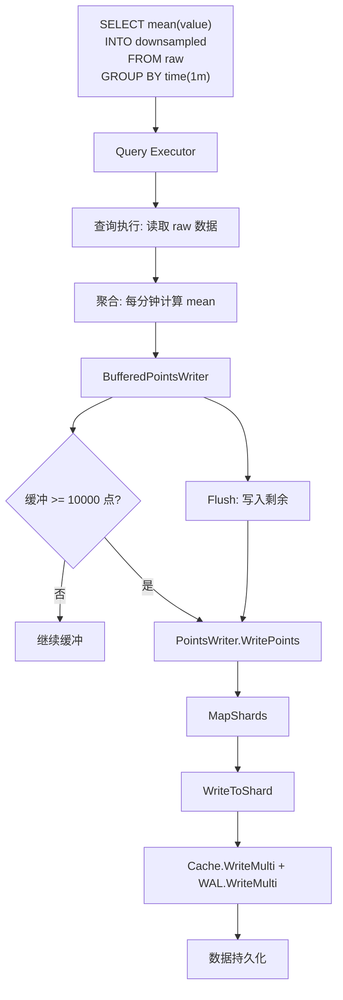

#### CQ 结果写回标准写入路径 — 详细序列图

CQ 的 INTO 结果通过标准写入路径（与用户写入完全一致）写回存储引擎，保证数据一致性。

```mermaid
sequenceDiagram
    participant CQ as CQ Service
    participant Executor as Query Executor
    participant BPW as BufferedPointsWriter
    participant PW as PointsWriter
    participant Meta as MetaClient
    participant TSDB as TSDBStore
    participant Shard as Shard
    participant Engine as TSM1 Engine
    participant Cache as Cache
    participant WAL as WAL

    CQ->>Executor: ExecuteQuery(SELECT mean(value) INTO downsampled FROM raw GROUP BY time(1m))
    Executor->>Executor: 执行查询, 生成聚合结果

    Executor->>BPW: WritePointsInto(结果点)
    Note over BPW: 缓冲区容量 10,000 点<br>累积到满再批量写入

    alt 缓冲区未满
        BPW->>BPW: 追加到 buf, 返回
    else 缓冲区满 (>= 10,000 点)
        BPW->>PW: Flush() → WritePointsInto(buf)
    end

    PW->>PW: 解析默认 RP (downsampled 的 RP)
    PW->>Meta: RetentionPolicy("mydb", "autogen")
    PW->>PW: MapShards(points) → 路由到目标 Shard
    PW->>Meta: CreateShardGroup(db, rp, timestamp) [按需]

    par 并行写入各目标 Shard
        PW->>TSDB: WriteToShard(writeCtx, shardID, points)
        TSDB->>Shard: WritePoints(points, tracker)
        Shard->>Shard: validateSeriesAndFields()
        Note over Shard: CQ 写入目标 measurement<br>与用户写入走相同验证
        Shard->>Engine: engine.WritePoints(points, tracker)
        Engine->>Cache: Cache.WriteMulti(values)
        Note over Cache: 降采样数据进入 Cache<br>与原始数据独立存储
        Engine->>WAL: WAL.WriteMulti(values)
        Note over WAL: WAL 持久化保证崩溃恢复
    end

    Note over CQ: 查询完成后 BPW.Flush()<br>写入剩余缓冲的点

    BPW->>PW: Flush() → 写入最后一批
    PW->>Cache + WAL: 标准写入路径
```

**关键设计点**:
- CQ 写回路径与用户 `INSERT` 完全一致: `PointsWriter` → `MapShards` → `WriteToShard` → `Cache + WAL`
- 降采样数据写入目标 measurement 的独立 Shard，不影响原始数据的 Shard
- `BufferedPointsWriter` 批量 10,000 点减少锁竞争和 WAL 写入次数；每次 `Flush()` 是独立写入，已成功的批次不会因为后续批次失败而回滚
- 写入目标可以是不同的 RP（如 `INTO "7d"."downsampled"`），实现多级降采样

#### 步骤 ⑬: lastRuns 更新

```go
// services/continuous_querier/service.go:338-339
cq.LastRun = truncate(now.Add(-offset), resampleEvery).Add(offset)
s.lastRuns[fmt.Sprintf("%s%s%s", dbi.Name, idDelimiter, cqi.Name)] = cq.LastRun
```

**lastRuns 的 key 格式**: `"database\x1fcqname"` （\x1f 是 ASCII Unit Separator）

**重要**: lastRuns 在查询执行**之前**更新，而非之后。这意味着如果查询失败，lastRuns 已经更新，不会自动重试。

## 2. CQ Service 配置

### 2.1 Config 结构体

```go
// services/continuous_querier/config.go — Config
type Config struct {
    LogEnabled        bool          `toml:"log-enabled"`         // 默认: true
    Enabled           bool          `toml:"enabled"`             // 默认: true
    QueryStatsEnabled bool          `toml:"query-stats-enabled"` // 默认: false
    RunInterval       toml.Duration `toml:"run-interval"`        // 默认: 1s
}
```

| 字段 | 类型 | 默认值 | 说明 |
|------|------|--------|------|
| `LogEnabled` | `bool` | `true` | 启用 CQ 执行日志，显示处理时间和写入点数 |
| `Enabled` | `bool` | `true` | 全局开关，设为 `false` 时 broker 和 data node 均忽略 CQ 处理 |
| `QueryStatsEnabled` | `bool` | `false` | 启用后将单次 CQ 执行统计写入 `cq_query` self-monitoring measurement |
| `RunInterval` | `toml.Duration` | `1s` | 轮询间隔，应设为所有 CQ GROUP BY interval 的最小公因子 |

```go
// config.go:37 — NewConfig 默认值
func NewConfig() Config {
    return Config{
        LogEnabled:        true,
        Enabled:           true,
        QueryStatsEnabled: false,
        RunInterval:       toml.Duration(DefaultRunInterval), // time.Second
    }
}
```

**配置约束**: `RunInterval` 必须为正数（`> 0`），否则 `Validate()` 返回错误。

## 3. RESAMPLE 语义详解

### 3.1 EVERY 与 FOR 的关系

```sql
CREATE CONTINUOUS QUERY "cq_1m" ON "db"
    RESAMPLE EVERY 30s FOR 5m
    BEGIN
        SELECT mean(value) INTO "downsampled" FROM "raw" GROUP BY time(1m)
    END
```

| 参数 | 含义 | 默认值 |
|------|------|--------|
| `EVERY` | CQ 执行频率 | = GROUP BY interval |
| `FOR` | 回溯窗口长度 | = GROUP BY interval |

### 3.2 EVERY 的三种模式

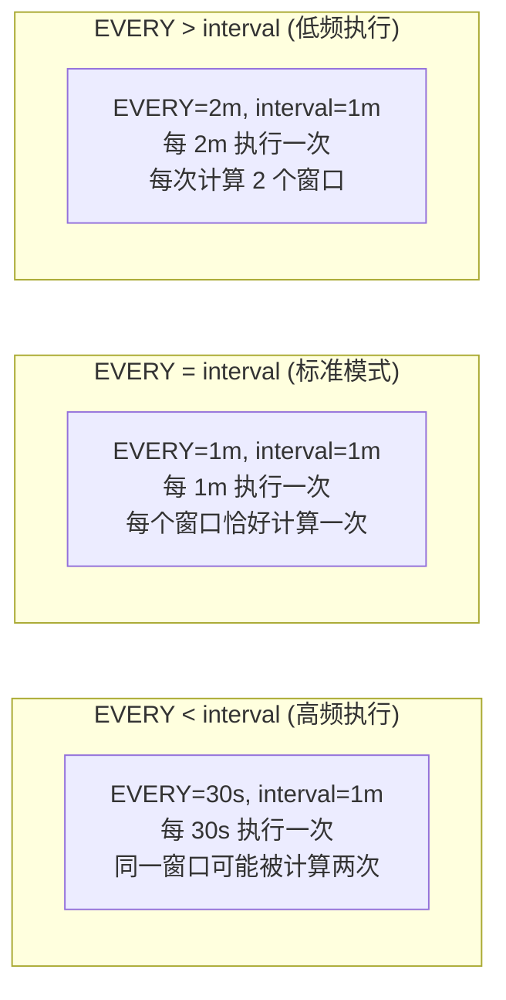

| EVERY vs interval | 行为 | 适用场景 |
|-------------------|------|---------|
| EVERY < interval | 同一窗口可能被计算多次，最后一次覆盖 | 延迟数据补算 |
| EVERY = interval | 标准行为，每个窗口恰好一次 | 大多数场景 |
| EVERY > interval | 每次计算多个窗口 | 减少执行频率 |

### 3.3 FOR 的回溯窗口

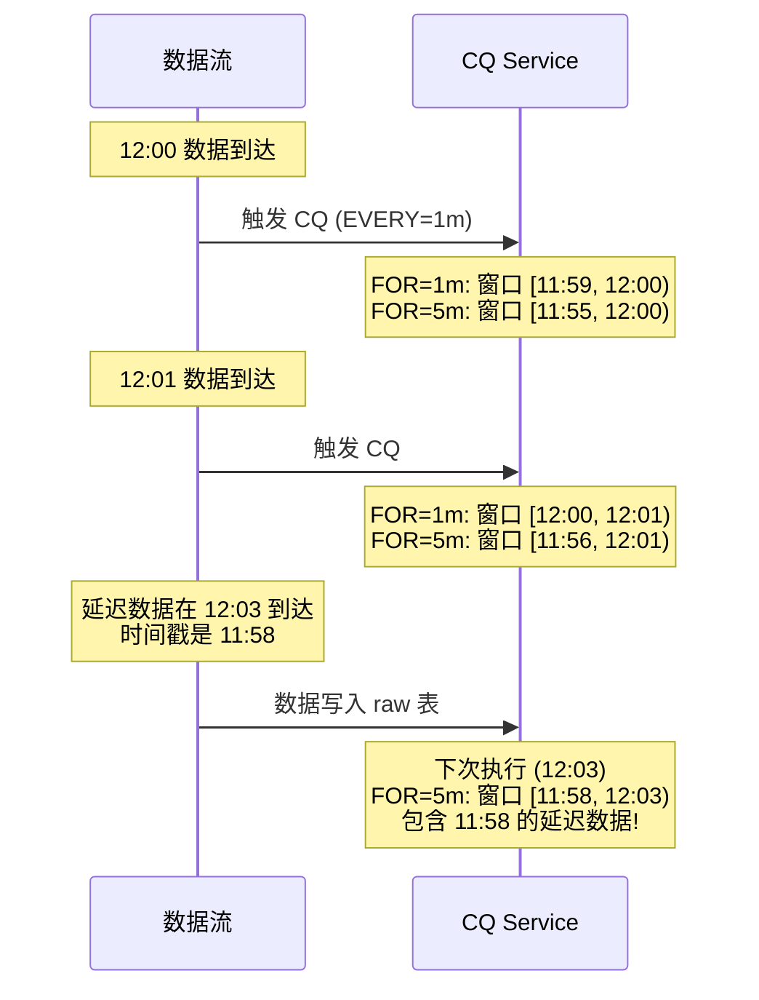

**FOR 的核心价值**：补算延迟到达的数据。当 `FOR > interval` 时，CQ 会重新计算最近 N 个窗口，覆盖之前的计算结果。

### 3.4 时间窗口参数的 clamp 逻辑

源码中 `ExecuteContinuousQuery` 对 `resampleEvery` 和 `resampleFor` 的处理顺序非常关键
(service.go:331-356)，不能笼统说"resampleFor 先设好"：

```go
// service.go:331-334 — (a) resampleEvery 先初始化 (用原始 cq.Resample.Every)
resampleEvery := interval
if cq.Resample.Every != 0 {
    resampleEvery = cq.Resample.Every
}

// service.go:338-339 — (b) lastRuns 在查询前更新 (用未 clamp 的 resampleEvery)
cq.LastRun = truncate(now.Add(-offset), resampleEvery).Add(offset)
s.lastRuns[id] = cq.LastRun

// service.go:345-350 — (c) resampleFor 计算
resampleFor := interval
if cq.Resample.For != 0 {
    resampleFor = cq.Resample.For
} else if interval < resampleEvery {
    resampleFor = resampleEvery
}

// service.go:354-356 — (d) 局部 clamp: 仅用于 endTime 对齐
if interval < resampleEvery {
    resampleEvery = interval
}
```

**为什么 clamp resampleEvery？** 这个 clamp 发生在
`shouldRunContinuousQuery()` 已经用原始 `RESAMPLE EVERY` 计算 `nextRun` 之后，
也发生在 `cq.LastRun = truncate(now, 原始 EVERY)` 更新 `lastRuns` 之后。
也就是说，`EVERY > interval` 不会被改成按 interval 频率触发；触发判断仍然是
`nextRun = LastRun + 原始 EVERY`，`lastRuns` 也按原始 EVERY 对齐。

clamp 只影响后续时间窗口计算里的 `endTime := truncate(now + interval - resampleEvery, interval)`。
如果不 clamp，`EVERY=5m, interval=1m` 会让 `endTime` 被往前推 4 分钟；源码将局部变量
`resampleEvery` 钳到 `interval`，使本次查询窗口的结束边界按 GROUP BY interval 对齐。
当没有显式 `FOR` 且 `EVERY > interval` 时，源码在 clamp 前把 `resampleFor` 设为原始
EVERY，让一次运行覆盖多个 1 分钟窗口。

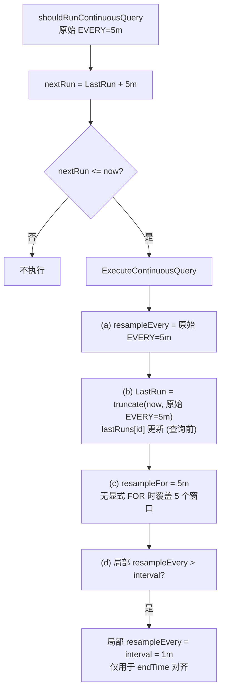

**案例**: `RESAMPLE EVERY 5m FOR 5m GROUP BY time(1m)` 若 `LastRun=12:00`，
`shouldRunContinuousQuery()` 的下一次触发时间是 12:05。12:01、12:02、12:03、12:04
不会因为 clamp 而执行。到 12:05 执行时，窗口结束边界用钳到 1m 的局部
`resampleEvery` 计算，得到 `[12:00,12:05)`；`lastRuns` 仍按原始 5m 对齐到 12:05。

## 4. 自定义 truncate 函数

### 4.1 为什么不用 Go 的 time.Truncate

```go
// services/continuous_querier/service.go:562 — 自定义 truncate
func truncate(ts time.Time, d time.Duration) time.Time {
    t := ts.UnixNano()
    offset := zone(ts)         // 时区偏移 (秒)
    dt := (t + offset) % int64(d)
    if dt < 0 {
        // 负数取模会向上取整，需要加上 duration 修正为向下取整
        dt += int64(d)
    }
    ts = time.Unix(0, t-dt).In(ts.Location())
    // DST 调整: 如果截断后的时区偏移与原始不同，需要补偿差值
    if adjustedOffset := zone(ts); adjustedOffset != offset {
        diff := offset - adjustedOffset
        if abs(diff) < int64(d) {
            ts = ts.Add(time.Duration(diff))
        }
    }
    return ts
}
```

**Go 的 `time.Truncate` 的问题**:

| 问题 | Go Truncate | 自定义 truncate |
|------|-------------|-----------------|
| 周起始日 | Monday (Go) | Thursday (Unix) |
| DST 转换 | 不处理 | 通过 offset 调整 |
| 时区 | 使用本地时区 | 使用 Unix 时间戳 |

### 4.2 DST 处理

```go
// shouldRunContinuousQuery 中的 DST 处理
nextRun := cq.LastRun.Add(resampleEvery)
_, off1 := nextRun.Zone()
_, off2 := cq.LastRun.Zone()
if off1 != off2 {
    // DST 转换: 调整 nextRun
    nextRun = nextRun.Add(time.Duration(off2 - off1))
}
```

**DST 边界情况**:
- **春季跳跃** (如 2:00 → 3:00)：某个窗口可能被跳过
- **秋季重复** (如 1:00 → 2:00 出现两次)：某个窗口可能被执行两次

#### 4.3 DST 边界案例详解

> **小白解释**: DST (夏令时) 就像一年调两次钟——春天把钟拨快一小时，秋天把钟拨慢一小时。
> 这对 CQ 的时间窗口计算是个大麻烦，因为某些时间点会"消失"或"重复"。

**案例一: 春季跳跃 (Spring Forward)**

> **场景**: America/New_York 时区，CQ 每小时执行一次
>
> ```sql
> CREATE CONTINUOUS QUERY "cpu_avg_1h" ON "mydb"
>     RESAMPLE EVERY 1h FOR 2h
>     BEGIN
>         SELECT mean(value) INTO "cpu_1h" FROM "cpu" GROUP BY time(1h)
>     END
> ```
>
> 2024年3月10日凌晨 2:00，时钟跳到 3:00（2:00-3:00 这一个小时**不存在**）

```mermaid
gantt
    title DST 春季跳跃 — CQ 窗口调整
    dateFormat HH:mm
    axisFormat %H:%M

    section 正常窗口
    "窗口 22:00-23:00" :a1, 22:00, 60min
    "窗口 23:00-00:00" :a2, 23:00, 60min
    "窗口 00:00-01:00" :a3, 00:00, 60min
    "窗口 01:00-02:00" :a4, 01:00, 60min

    section DST 跳跃
    "2:00 → 3:00 (跳跃!)" :crit, 02:00, 0

    section 跳跃后
    "窗口 03:00-04:00" :a5, 03:00, 60min
```

```
时间线 (America/New_York):

t=01:59:59 EST  最后一个 EST 时间点
t=03:00:00 EDT  时钟跳到 3:00 (EDT = UTC-4)

CQ 执行过程:
  lastRun = 01:00:00 EST
  nextRun = lastRun + 1h = 02:00:00 EST

  但 02:00:00 EST 在物理时间上不存在!
  Go 的 time.Add 会自动处理: 01:00 EST + 1h = 03:00 EDT

  shouldRunContinuousQuery 中的 DST 检测:
    _, startOffset := lastRun.Add(-1).Zone()  // EST = -18000s
    _, endOffset := nextRun.Add(-1).Zone()     // EDT = -14400s
    diff = -18000 - (-14400) = -3600s (1小时)
    abs(diff) < resampleEvery (1h)? 是 → 调整 nextRun

  查询范围: [01:00 EST, 03:00 EDT) = 1小时物理时间
  但 GROUP BY time(1h) 会产生 2 个窗口:
    窗口 1: [01:00 EST, 02:00 EST) → 有数据
    窗口 2: [02:00 EST, 03:00 EST) → 无数据 (物理时间不存在!)
    → FILL(0) 会填充 0, FILL(none) 会跳过
```

**案例二: 秋季重复 (Fall Back)**

> **场景**: 同样的 CQ，2024年11月3日凌晨 2:00，时钟回到 1:00（1:00-2:00 这一个小时**重复两次**）

```mermaid
gantt
    title DST 秋季重复 — CQ 窗口调整
    dateFormat HH:mm
    axisFormat %H:%M

    section 正常窗口
    "窗口 22:00-23:00" :a1, 22:00, 60min
    "窗口 23:00-00:00" :a2, 23:00, 60min
    "窗口 00:00-01:00 (第一次)" :a3, 00:00, 60min

    section DST 重复
    "窗口 01:00-02:00 (第一次, EDT)" :a4, 01:00, 60min
    "2:00 → 1:00 (回拨!)" :crit, 02:00, 0
    "窗口 01:00-02:00 (第二次, EST)" :a5, 01:00, 60min

    section 回拨后
    "窗口 02:00-03:00" :a6, 02:00, 60min
```

```
时间线 (America/New_York):

t=01:59:59 EDT  最后一个 EDT 时间点
t=01:00:00 EST  时钟回到 1:00 (EST = UTC-5)

CQ 执行过程:
  lastRun = 01:00:00 EDT (第一次)
  nextRun = lastRun + 1h = 02:00:00 EDT

  但物理时间 02:00 EDT 之后, 时钟回拨到 01:00 EST
  Go 的 time.Add: 01:00 EDT + 1h = 02:00 EDT (正确)

  shouldRunContinuousQuery DST 检测:
    startOffset (EDT) = -14400s
    endOffset (EDT) = -14400s (nextRun 仍在 EDT)
    diff = 0 → 无调整

  但当 CQ 在 02:00 EDT 触发后, 下一次:
    lastRun = 02:00 EDT
    nextRun = 03:00 EDT

  此时物理时间已经是 01:00 EST (回拨后)
  实际等待时间 = 2小时 (01:00 EST → 03:00 EST)

  truncate 函数的 DST 补偿:
    zone(ts) 返回当前时区偏移
    如果截断后时区偏移变化, 补偿差值
    确保窗口边界在时区转换后仍然正确
```

**truncate 函数的 DST 补偿逻辑**:

```go
// services/continuous_querier/service.go:562 — truncate
func truncate(ts time.Time, d time.Duration) time.Time {
    t := ts.UnixNano()
    offset := zone(ts)         // 获取当前时区偏移 (秒)
    dt := (t + offset) % int64(d)
    if dt < 0 {
        dt += int64(d)  // 负数取模修正
    }
    ts = time.Unix(0, t-dt).In(ts.Location())

    // DST 补偿: 截断后时区偏移可能变化
    if adjustedOffset := zone(ts); adjustedOffset != offset {
        diff := offset - adjustedOffset
        if abs(diff) < int64(d) {
            ts = ts.Add(time.Duration(diff))
        }
    }
    return ts
}
```

> **小白解释**: `truncate` 函数就像一个"智能对齐器"——
> 它把时间戳对齐到窗口起点，同时检测对齐后是否跨越了时区边界。
> 如果跨越了（比如从 EDT 变成 EST），就补偿一个小时的差值。

## 5. 架构设计意图

### 5.1 为什么用 Processing-Time 轮询而非 Event-Time 驱动

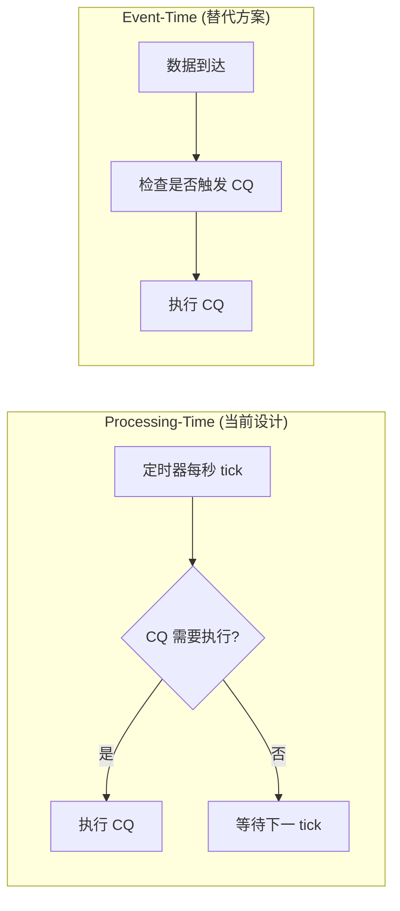

| 维度 | Processing-Time | Event-Time |
|------|-----------------|------------|
| **实现复杂度** | 简单 (一个定时器) | 复杂 (需要追踪数据时间戳) |
| **幂等性** | 天然幂等 | 需要额外保证 |
| **容错性** | RESAMPLE FOR 补算 | 需要重放机制 |
| **高频写入** | 稳定 (固定频率) | 可能事件风暴 |

### 5.2 为什么每次执行都重新解析 SQL

- **配置热更新**：修改 CQ 后无需重启服务
- **正确性**：避免缓存 AST 与 meta store 中的 SQL 不一致
- **代码简洁**：不需要维护 AST 缓存和失效逻辑

### 5.3 为什么 CQ 结果用 BufferedPointsWriter

- **批量写入**：10,000 点/批，减少锁竞争
- **分批提交**：每个 `Flush()` 独立调用底层 `PointsWriter`；没有跨批事务，前一批成功后，后一批失败不会自动回滚
- **与用户写入一致**：走相同的 Cache + WAL 路径

### 5.4 为什么 lastRuns 在执行前更新

```go
// service.go:294 — key 构造
id := fmt.Sprintf("%s%s%s", dbi.Name, idDelimiter, cqi.Name)

// service.go:338-339 (在查询执行之前)
cq.LastRun = truncate(now.Add(-offset), resampleEvery).Add(offset)
s.lastRuns[id] = cq.LastRun

// service.go:391 (之后才执行查询)
res := s.runContinuousQueryAndWriteResult(cq)
```

- **防止重入**：如果 CQ 执行时间超过 `resampleEvery`，下次 tick 不会重复执行
- **代价**：查询失败后不会自动重试

## 6. 架构收益

| 维度 | 收益 |
|------|------|
| **实现简洁** | 轮询模型 + Lease 选举，代码量小 |
| **容错性** | RESAMPLE FOR 支持补算延迟数据 |
| **灵活性** | EVERY/FOR 独立配置，支持多种降采样策略 |
| **一致性** | CQ 结果走标准写入路径，保证数据一致性 |
| **可观测性** | cq_query measurement 记录执行统计 |
| **热更新** | 每次重新解析 SQL，支持运行时修改 CQ |

## 7. 潜在隐患与瓶颈

### 7.1 CQ 与用户查询无资源隔离

```go
// service.go:444
ch := s.QueryExecutor.ExecuteQuery(q, query.ExecutionOptions{
    Database: cq.Database,
}, closing)
```

CQ 查询与用户查询共享同一个 Executor：
- **并发限制共享**：`MaxConcurrentQueries` 同时限制 CQ 和用户查询
- **CPU/内存竞争**：大量 CQ 可能饿死用户查询
- **无优先级机制**：无法保证用户查询优先于 CQ

### 7.2 lastRuns 非持久化

```go
type Service struct {
    lastRuns map[string]time.Time  // 内存中
}
```

服务重启后：
- 所有 CQ 的 `lastRuns` 清空
- 所有 CQ 被视为"首次执行"，立即触发
- 可能导致重启后的 CQ 执行风暴

### 7.3 CQ 失败的处理

```go
// service.go:391-393 — ExecuteContinuousQuery 中的错误返回
res := s.runContinuousQueryAndWriteResult(cq)
if res.Err != nil {
    return false, res.Err  // 返回错误给 runContinuousQueries
}

// service.go:271-273 — runContinuousQueries 中的日志和计数
if ok, err := s.ExecuteContinuousQuery(&db, &cq, req.Now); err != nil {
    s.Logger.Info("Error executing query", zap.String("query", cq.Query), zap.Error(err))
    atomic.AddInt64(&s.stats.QueryFail, 1)
}
```

CQ 执行失败会返回错误到 `runContinuousQueries`，后者记录日志并递增 `QueryFail` 计数器。错误不会被静默吞掉，但也不会重试、告警或暂停后续执行。

**CQ 失败场景与监控**:

| 失败场景 | 错误类型 | 表现 | 监控方式 |
|----------|---------|------|---------|
| **Cache 满** | `ErrCacheMemorySizeLimitExceeded` | INTO 写入被拒绝，CQ 返回错误 | 日志 + `QueryFail`；通常不写 `cq_query` |
| **查询超时** | `context.DeadlineExceeded` | Executor 中断查询，CQ 返回错误 | 日志 + `QueryFail`；通常不写 `cq_query` |
| **Field 类型冲突** | `PartialWriteError` | 部分点被丢弃或返回写入错误 | 成功返回时看 `cq_query.pointsWrittenOK`；失败时看日志 + `QueryFail` |
| **内存不足 (OOM)** | `runtime: out of memory` | 进程崩溃 | 系统级监控 |
| **Shard 不存在** | `ErrShardNotFound` | 写入失败，Write-Through 重试 | `cq_query` 无记录 |
| **SQL 解析失败** | `influxql.ParseError` | CQ 定义无效，跳过执行 | 日志中出现 "Error executing query" |

**cq_query measurement 监控查询**:

```sql
-- 监控 CQ 执行健康状态
SELECT
    count("durationNs") AS "executions",
    sum("pointsWrittenOK") AS "total_points",
    mean("durationNs") / 1e6 AS "avg_duration_ms",
    max("durationNs") / 1e6 AS "max_duration_ms"
FROM "cq_query"
WHERE time > now() - 1h
GROUP BY "db", "cq", time(5m)

-- 检测 CQ 执行失败 (QueryFail 计数器)
-- 注意: QueryFail 是内存计数器，不写入 cq_query measurement
-- 需要通过 SHOW STATS 或 /debug/vars 端点获取
SHOW STATS FOR 'cq'
-- 或
curl http://localhost:8086/debug/vars | jq '.cq'
```

### 7.4 同一 Service 内持锁串行，但失败不按原窗口自动重试

```go
// shouldRunContinuousQuery 使用 lastRun 判断
nextRun := cq.LastRun.Add(resampleEvery)
```

`ExecuteContinuousQuery` 在读取 `lastRuns` 前获取 `s.mu`，并持有到方法返回；时间窗口计算、`lastRuns` 提前更新、查询执行和统计写入都在同一把锁内完成。因此同一个 `Service` 内 CQ 是串行执行的，且执行前更新 `lastRuns` 可以防止下一次 tick 并发重入同一个 CQ。

这个设计的代价也很直接：
- CQ 失败时，`lastRuns` 已经推进，不会按失败前的原窗口自动重试
- 一个执行很慢的 CQ 会持锁阻塞后续 CQ，导致同一轮中的其他 CQ 延迟执行

### 7.5 RESAMPLE FOR 的内存开销

```
RESAMPLE FOR 24h
GROUP BY time(1m)
→ 1440 个窗口
```

当 `FOR` 远大于 `interval` 时，一次 CQ 执行需要处理大量窗口，内存消耗不可控。

### 7.6 每次解析 SQL 的 CPU 开销

```go
stmt, err := influxql.NewParser(strings.NewReader(cqi.Query)).ParseStatement()
```

对于高频 CQ（如 `GROUP BY time(1s)`），每秒解析一次 SQL。CQ 数量多时可能成为 CPU 瓶颈。

### 7.7 CQ 数量无上限

```go
for _, dbi := range s.MetaClient.Databases() {
    for _, cqi := range dbi.ContinuousQueries {
        // 无限制
    }
}
```

大量 CQ 可能导致 `runContinuousQueries` 耗时过长，压垮 Executor。

### 7.8 无背压机制

CQ 结果写入通过 `BufferedPointsWriter`（10,000 点/批）直接写入 Cache + WAL。如果写入速度跟不上 CQ 产出速度，没有机制让 CQ 暂停或降速。

### 7.9 Lease 粒度问题

```go
s.MetaClient.AcquireLease("continuous_querier")
```

所有 CQ 共享一个 Lease。无法将部分 CQ 迁移到其他节点执行以分散负载。

### 7.10 DST 转换的边界情况

- **春季跳跃**：某个时间窗口可能被跳过
- **秋季重复**：某个时间窗口可能被执行两次
- 当前代码只调整了 `nextRun`，未处理窗口边界的特殊情况

## 8. BufferedPointsWriter — 批量写入

### 8.1 结构体

```go
// coordinator/statement_executor.go:1224 — BufferedPointsWriter
type BufferedPointsWriter struct {
    w               pointsWriter  // 底层写入器 (PointsWriter)
    buf             []models.Point  // 缓冲区
    database        string
    retentionPolicy string
}
```

### 8.2 构造函数

```go
// coordinator/statement_executor.go:1232 — NewBufferedPointsWriter
func NewBufferedPointsWriter(w pointsWriter, database, retentionPolicy string, capacity int) *BufferedPointsWriter {
    return &BufferedPointsWriter{
        w:               w,
        buf:             make([]models.Point, 0, capacity),  // 预分配容量
        database:        database,
        retentionPolicy: retentionPolicy,
    }
}
```

**默认容量**: 10,000 点 (coordinator/statement_executor.go:566)

### 8.3 WritePointsInto — 批量写入逻辑

```go
// coordinator/statement_executor.go:1242 — WritePointsInto
func (w *BufferedPointsWriter) WritePointsInto(req *IntoWriteRequest) error {
    // 1. 验证目标 database/RP
    if req.Database != w.database || req.RetentionPolicy != w.retentionPolicy {
        return fmt.Errorf("partial write: database must be %q, retention policy must be %q",
            w.database, w.retentionPolicy)
    }

    // 2. 分批写入
    for i := 0; i < len(req.Points); {
        avail := cap(w.buf) - len(w.buf)  // 缓冲区剩余空间
        n := len(req.Points[i:])
        if n > avail {
            n = avail
        }
        w.buf = append(w.buf, req.Points[i:n+i]...)
        i += n

        // 3. 缓冲区满时自动 Flush
        if len(w.buf) == cap(w.buf) {
            if err := w.Flush(); err != nil {
                return err
            }
        }
    }
    return nil
}
```

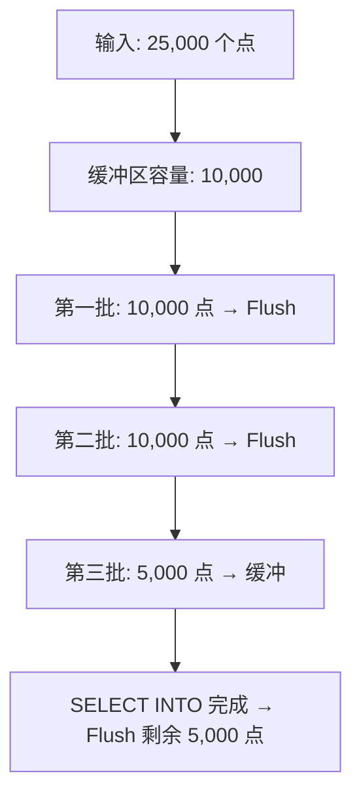

### 8.4 Flush — 清空缓冲区

```go
// coordinator/statement_executor.go:1276 — Flush
func (w *BufferedPointsWriter) Flush() error {
    if len(w.buf) == 0 {
        return nil
    }
    if err := w.w.WritePointsInto(&IntoWriteRequest{
        Database:        w.database,
        RetentionPolicy: w.retentionPolicy,
        Points:          w.buf,
    }); err != nil {
        return err  // 底层写入失败时保留 buffer，调用方可看到错误
    }

    w.buf = w.buf[:0]  // 清空缓冲区 (保留容量)
    return nil
}
```

**Flush 失败语义**: 只有底层 `WritePointsInto` 成功后才会清空 `buf`。如果底层写入失败，`Flush()` 直接返回错误并保留当前缓冲区内容；但 `BufferedPointsWriter` 不提供跨批事务，已经成功 flush 的旧批次不会被回滚。

## 9. CQ 统计追踪 — cq_query measurement

### 9.1 统计数据写入

```go
// services/continuous_querier/service.go:418 — CQ 统计记录
if s.queryStatsEnabled && s.Monitor.Enabled() {
    tags := map[string]string{
        "db": dbi.Name,      // 数据库名
        "cq": cq.Info.Name,  // CQ 名称
    }
    fields := map[string]interface{}{
        "durationNs":      int64(execDuration),  // 执行耗时 (纳秒)
        "pointsWrittenOK": written,              // 成功写入的点数
        "startTime":       startTime.UnixNano(), // 窗口起始时间
        "endTime":         endTime.UnixNano(),   // 窗口结束时间
    }
    p, _ := models.NewPoint("cq_query", models.NewTags(tags), fields, time.Now())
    s.Monitor.WritePoints(models.Points{p})
}
```

### 9.2 写入点数提取

```go
// services/continuous_querier/service.go:402 — 提取 written 值
var written int64 = -1
if len(res.Series) == 1 && len(res.Series[0].Values) == 1 {
    s := res.Series[0]
    written = s.Values[0][1].(int64)  // SELECT INTO 返回的写入点数
}
```

### 9.3 cq_query measurement 结构

| Tag | 含义 | 示例 |
|-----|------|------|
| `db` | 数据库名 | `mydb` |
| `cq` | CQ 名称 | `cq_1m` |

| Field | 类型 | 含义 |
|-------|------|------|
| `durationNs` | int64 | 执行耗时 (纳秒) |
| `pointsWrittenOK` | int64 | 成功写入的点数 |
| `startTime` | int64 | 窗口起始时间 (UnixNano) |
| `endTime` | int64 | 窗口结束时间 (UnixNano) |

### 9.4 查询 CQ 统计

```sql
-- 查询最近 1 小时的 CQ 执行统计
SELECT mean("durationNs") / 1e6 AS "avg_ms",
       sum("pointsWrittenOK") AS "total_points",
       count("durationNs") AS "executions"
FROM "cq_query"
WHERE time > now() - 1h
GROUP BY "db", "cq", time(5m)
```

## 10. TSM Compaction 补充：不是 CQ，但属于存储降采样式重写

本章前面聚焦 Continuous Query 的时间窗口降采样；`review_05_secondary.md`
还要求覆盖 TSM compaction。二者不是同一条业务链路：CQ 通过查询把高频点写成低频点，
TSM compaction 则在存储层重写已有 TSM 文件，减少文件数量、清理 tombstone，
并优化索引布局。

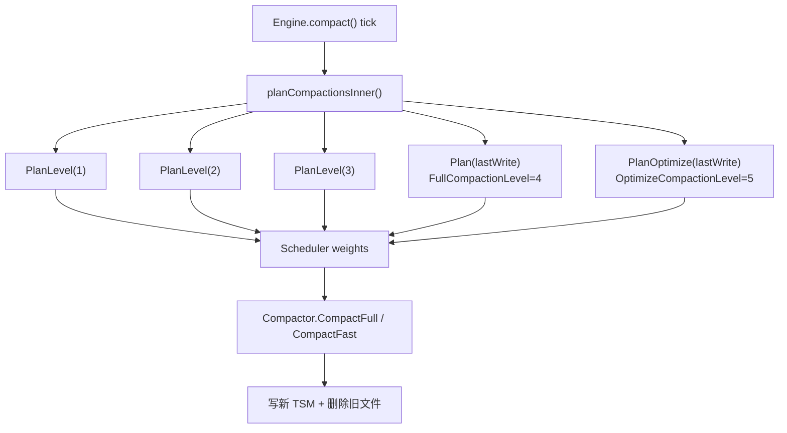

### 10.1 Compaction level 与调度权重

```go
// tsdb/engine/tsm1/engine.go:103
const (
    LevelCompactionCount  = 3
    FullCompactionLevel   = 4
    OptimizeCompactionLevel = 5
    TotalCompactionLevels = 5
)

// tsdb/engine/tsm1/scheduler.go:8
var defaultWeights = [TotalCompactionLevels]float64{0.4, 0.3, 0.2, 0.1, 0.01}
```

| Level | Planner | 作用 |
|---|---|---|
| 1 | `PlanLevel(1)` | 合并 cache snapshot 产生的小 generation；需要 8 个 generation，除非 tombstone 或后续高 level 触发 |
| 2 | `PlanLevel(2)` | 合并多个 level 2 候选；默认 4 个 generation 一组 |
| 3 | `PlanLevel(3)` | 合并多个 level 3 候选；默认 4 个 generation 一组 |
| 4 | `Plan(lastWrite)` | full compaction，处理冷 shard、强制 full、tombstone 和大文件跳过逻辑 |
| 5 | `PlanOptimize(lastWrite)` | optimize compaction，权重最低；用于冷 shard 的跨 generation 索引优化 |

### 10.2 `tsmGeneration.level()` 的实际映射

```go
// tsdb/engine/tsm1/compact.go:219
func (t *tsmGeneration) level() int {
    if t.files[0].Sequence < 4 {
        return t.files[0].Sequence
    }
    return 4
}
```

源码注释里提到的“Level 0”容易误导：当前实现直接按 TSM 文件 sequence 映射，
sequence 1/2/3 分别进入 level 1/2/3，sequence >= 4 进入 level 4。

### 10.3 `PlanLevel` 的选文件规则

下面是按源码控制流压缩后的骨架，省略了 `levelGroups` 过滤、`chunk()` 循环和
`acquire()` 的局部细节；这些细节在文字说明中展开。

```go
// tsdb/engine/tsm1/compact.go:318 — PlanLevel
func (c *DefaultPlanner) PlanLevel(level int) ([]CompactionGroup, int64) {
    if c.forceFull {
        return nil, 0
    }
    generations := c.findGenerations()
    if len(generations) <= 1 && !generations.hasTombstones() {
        return nil, 0
    }

    groups := c.groupAdjacentGenerations(generations,
        func(currentLevel, candidateLevel int) bool {
            return currentLevel == candidateLevel
        })

    minGenerations := 4
    if level == 1 {
        minGenerations = 8
    }
    var cGroups []CompactionGroup
    // 只保留目标 level；chunk 不足时，只有 tombstone 或后续更高 level 才推进。
    // 最后通过 acquire(cGroups) 防止同一组文件被并发 compaction 抢占。
    return cGroups, int64(len(cGroups))
}
```

`PlanLevel` 只看同 level 的相邻 generation。level 1 的阈值是 8，其余 level 是 4。
如果 chunk 不足且没有 tombstone，只有当后面存在不低于当前 level 的 generation
时才提前推进，避免低 level 文件长期卡住。

### 10.4 `Plan` 与 `PlanOptimize`

这里同样只展示关键分支，真实源码还包含锁、排序、in-use 检查、`acquire()`
以及错误/空计划返回路径。

```go
// tsdb/engine/tsm1/compact.go:485 — Plan
func (c *DefaultPlanner) Plan(lastWrite time.Time) ([]CompactionGroup, int64) {
    generations := c.findGenerations()
    if forceFull ||
       c.compactFullWriteColdDuration > 0 &&
       time.Since(lastWrite) > c.compactFullWriteColdDuration &&
       len(generations) > 1 {
        // 可跨非相邻 generation 做 full compaction；
        // 跳过仍在使用的 group，以及无 tombstone、已超过 MaxTSMFileSize 且首块已满的大文件。
    }
    // 未变化且无 tombstone 时不计划；单 generation 且无 tombstone 时直接返回。
}

// tsdb/engine/tsm1/compact.go:436 — PlanOptimize
func (c *DefaultPlanner) PlanOptimize(lastWrite time.Time) ([]CompactionGroup, int64, int64) {
    if fullyCompacted || time.Since(lastWrite) < c.compactFullWriteColdDuration {
        return nil, 0, 0
    }
    // 只优化 level 4 group；如果全库只有一个 generation，则允许单 generation 优化。
}
```

### 10.5 案例：CQ 与 TSM compaction 的边界

假设 `cq_1m` 每分钟写入一批低频点。CQ 负责生成这些新点，写入路径会先进入
Cache/WAL，随后 snapshot 写出新的 TSM generation。TSM compaction 之后才会看到
这些 generation，并按 level 规则把多个小文件重写成更少的大文件。CQ 不直接调用
`PlanLevel` 或 `PlanOptimize`；compaction 也不会重新计算 CQ 的聚合结果。
