# Module 6: Cluster Communication (Shard 路由 + Subscriber 推送 + Epoch 保护) - 深度审计报告

> **小白导读**: 写入链路就像**快递分拣系统**。
>
> 你的数据点（包裹）到达后：
> 1. **MapShards**: 根据时间戳决定放到哪个"时间段仓库"（ShardGroup）
> 2. **ShardFor**: 在仓库内，根据 series 哈希决定放到哪个"货架"（Shard）
> 3. **Epoch Tracker**: 防止"正在整理货架时有人往里放东西"（写入/删除竞态保护）
> 4. **Subscriber**: 数据到了之后，自动转发给外部系统（如 Kafka、另一个 InfluxDB）
>
> 关键设计：OSS 版本每个 ShardGroup 只有 1 个 Shard，所以 ShardFor 的哈希路由实际上不起作用。
> 但 Enterprise 版本可以配置多个 Shard，实现数据水平拆分。

## 1. 写入链路全链路总览

### 1.1 从 HTTP 请求到持久化的完整路径

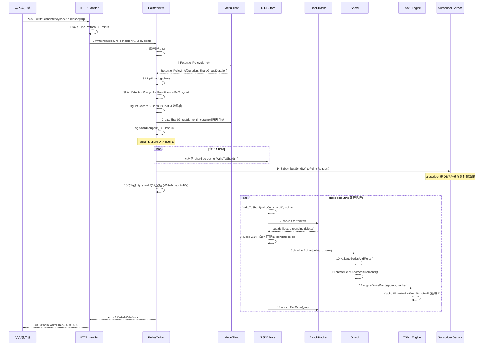

### 1.2 每一步的代码实现

#### 步骤 1: HTTP Handler — Line Protocol 解析

```go
// services/httpd/handler.go:1627,1651,1670 — serveWriteV2/V1/serveWrite
func (h *Handler) serveWrite(database, retentionPolicy, precision string, w http.ResponseWriter, r *http.Request, user meta.User) {
    atomic.AddInt64(&h.stats.WriteRequests, 1)
    atomic.AddInt64(&h.stats.ActiveWriteRequests, 1)
    defer func(start time.Time) {
        atomic.AddInt64(&h.stats.ActiveWriteRequests, -1)
        atomic.AddInt64(&h.stats.WriteRequestDuration, time.Since(start).Nanoseconds())
    }(time.Now())

    // 1. v1 从 db/rp 查询参数进入；v2 先把 bucket 映射成 database/rp
    if database == "" {
        h.httpError(w, "database is required", http.StatusBadRequest)
        return
    }
    if di := h.MetaClient.Database(database); di == nil {
        h.httpError(w, fmt.Sprintf("database not found: %q", database), http.StatusNotFound)
        return
    }

    // 2. 认证与写权限检查
    if h.Config.AuthEnabled {
        if user == nil { /* 403 */ return }
        if err := h.WriteAuthorizer.AuthorizeWrite(user.ID(), database); err != nil {
            h.httpError(w, fmt.Sprintf("%q user is not authorized to write to database %q", user.ID(), database), http.StatusForbidden)
            return
        }
    }

    // 3. 请求体读取: MaxBodySize truncateReader + gzip + bytes.Buffer.ReadFrom
    body := r.Body
    if h.Config.MaxBodySize > 0 {
        body = truncateReader(body, int64(h.Config.MaxBodySize))
    }
    if r.Header.Get("Content-Encoding") == "gzip" {
        gz, err := gzip.NewReader(r.Body)
        if err != nil { h.httpError(w, err.Error(), http.StatusBadRequest); return }
        defer gz.Close()
        body = gz
    }
    var bs []byte
    if r.ContentLength > 0 {
        if h.Config.MaxBodySize > 0 && r.ContentLength > int64(h.Config.MaxBodySize) {
            h.httpError(w, http.StatusText(http.StatusRequestEntityTooLarge), http.StatusRequestEntityTooLarge)
            return
        }
        bs = make([]byte, 0, r.ContentLength)
    }
    buf := bytes.NewBuffer(bs)
    if _, err := buf.ReadFrom(body); err != nil {
        if err == errTruncated { /* 413 */ return }
        h.httpError(w, err.Error(), http.StatusBadRequest)
        return
    }
    atomic.AddInt64(&h.stats.WriteRequestBytesReceived, int64(buf.Len()))

    if h.Config.WriteTracing {
        h.Logger.Info("Write body received by handler", zap.ByteString("body", buf.Bytes()))
    }

    // 4. 解析 Line Protocol；EOF 空 body 返回 200
    points, parseError := models.ParsePointsWithPrecision(buf.Bytes(), time.Now().UTC(), precision)
    if parseError != nil && len(points) == 0 {
        if parseError.Error() == "EOF" { h.writeHeader(w, http.StatusOK); return }
        h.httpError(w, parseError.Error(), http.StatusBadRequest)
        return
    }

    // 5. 解析一致性级别；OSS 后续接受但不执行复制/仲裁
    consistency := models.ConsistencyLevelOne
    if level := r.URL.Query().Get("consistency"); level != "" {
        var err error
        consistency, err = models.ParseConsistencyLevel(level)
        if err != nil { h.httpError(w, err.Error(), http.StatusBadRequest); return }
    }

    // 6. 调用 PointsWriter；PartialWriteError 返回 400 但有效点已经写入
    if err := h.PointsWriter.WritePoints(database, retentionPolicy, consistency, user, points); err != nil {
        // 按 client/auth/partial/server error 分支更新统计并返回对应状态码
    }
}
```

**关键细节**:
- `serveWriteV2` 先把 `bucket` 映射为 v1 的 `database/retentionPolicy`，并把 `precision=ns/us` 转为 `n/u`
- `ParsePointsWithPrecision` 支持 `n`(纳秒), `u`(微秒), `ms`(毫秒), `s`(秒), `m`(分), `h`(时)
- 请求体不是 `ioutil.ReadAll`: 源码使用 `truncateReader`、可选 gzip 解压、`bytes.Buffer.ReadFrom` 和 Content-Length 预分配
- `WriteTracing` 开启时会记录原始 write body，便于调试但也可能暴露写入数据
- 部分写入成功（`PartialWriteError`）返回 400，但已写入的点仍被持久化
- 完全失败返回 400 或 500

#### 步骤 2: PointsWriter 结构体

```go
// coordinator/points_writer.go:45 — PointsWriter
type PointsWriter struct {
    mu           sync.RWMutex       // 保护 closing
    closing      chan struct{}       // 关闭信号
    WriteTimeout time.Duration      // 写入超时 (默认 10s)
    Logger       *zap.Logger

    Node *influxdb.Node             // 本地节点标识 (集群用)

    MetaClient interface {          // 元数据接口
        Database(name string) (di *meta.DatabaseInfo)
        RetentionPolicy(database, policy string) (*meta.RetentionPolicyInfo, error)
        CreateShardGroup(database, policy string, timestamp time.Time) (*meta.ShardGroupInfo, error)
    }

    TSDBStore interface {           // 本地存储接口
        CreateShard(database, retentionPolicy string, shardID uint64, enabled bool) error
        WriteToShard(ctx tsdb.WriteContext, shardID uint64, points []models.Point) error
    }

    Subscriber interface {
        Send(*WritePointsRequest)
    }
    stats     *WriteStatistics             // 原子统计计数器
}
```

**WriteStatistics 结构**:

```go
// coordinator/points_writer.go:157 — WriteStatistics
type WriteStatistics struct {
    WriteReq           int64  // 写入请求总数
    PointWriteReq      int64  // 写入点总数
    PointWriteReqLocal int64  // 本地写入点数
    WriteOK            int64  // 成功写入次数
    WriteDropped       int64  // 丢弃的写入点数
    WriteTimeout       int64  // 写入超时次数
    WriteErr           int64  // 写入失败次数
    SubWriteOK         int64  // 调用 Subscriber.Send 的次数
}
```

#### 步骤 2b: WritePoints / WritePointsPrivileged — 入口方法

```go
// coordinator/points_writer.go:463 — WritePoints
func (w *PointsWriter) WritePoints(database, retentionPolicy string,
    consistencyLevel models.ConsistencyLevel, user meta.User, points []models.Point) error {
    userID := tsdb.UnknownUser
    if user != nil {
        userID = user.ID()
    }
    writeCtx := tsdb.WriteContext{UserId: userID}
    return w.WritePointsPrivileged(writeCtx, database, retentionPolicy, consistencyLevel, points)
}

// coordinator/points_writer.go:474 — WritePointsPrivileged
func (w *PointsWriter) WritePointsPrivileged(writeCtx tsdb.WriteContext, database, retentionPolicy string,
    consistencyLevel models.ConsistencyLevel, points []models.Point) error {
    // 统计: 原子递增 (在这里, 不在 WritePoints)
    atomic.AddInt64(&w.stats.WriteReq, 1)
    atomic.AddInt64(&w.stats.PointWriteReq, int64(len(points)))
    // ... 继续执行写入逻辑
}

// coordinator/points_writer.go:334 — WritePointsInto
func (w *PointsWriter) WritePointsInto(p *IntoWriteRequest) error {
    writeCtx := tsdb.WriteContext{UserId: tsdb.SelectIntoUser}
    return w.WritePointsPrivileged(writeCtx, p.Database, p.RetentionPolicy, models.ConsistencyLevelOne, p.Points)
}
```

**为什么分两层？** `WritePoints` 把 `meta.User` 转成 `tsdb.WriteContext{UserId: ...}` 后委托给 `WritePointsPrivileged`。CQ/SELECT INTO 等内部写入直接构造系统用户的 `WriteContext`，再调用 `Privileged` 版本；当前主链路没有额外的 context 变体方法名。

#### 步骤 3: 默认 RP 解析

```go
// coordinator/points_writer.go:474 — WritePointsPrivileged
if retentionPolicy == "" {
    dbi := w.MetaClient.Database(database)
    if dbi == nil {
        return influxdb.ErrDatabaseNotFound(database)
    }
    retentionPolicy = dbi.DefaultRetentionPolicy
}
```

**为什么默认 RP 为空？** HTTP API 中 `rp` 参数是可选的。用户可以只指定 `db=mydb`，系统自动使用该数据库的默认 RP。

#### 步骤 5: MapShards — Shard 路由核心

```go
// coordinator/points_writer.go:191 — MapShards
func (w *PointsWriter) MapShards(wp *WritePointsRequest) (*ShardMapping, error) {
    // 1. 获取 RetentionPolicy
    rp, err := w.MetaClient.RetentionPolicy(wp.Database, wp.RetentionPolicy)
    if err != nil {
        return nil, err
    } else if rp == nil {
        return nil, influxdb.ErrRetentionPolicyNotFound(wp.RetentionPolicy)
    }

    // 2. 计算保留策略下限与写入窗口
    min := time.Unix(0, models.MinNanoTime)
    if rp.Duration > 0 {
        min = time.Now().Add(-rp.Duration)
    }
    ww := NewWriteWindow(rp)

    // 3. 收集已覆盖的 ShardGroups (第一遍遍历)
    var list sgList
    for _, p := range wp.Points {
        withinWindow, _, _ := ww.WithinWindow(p.Time())
        if p.Time().Before(min) || list.Covers(p.Time()) || !withinWindow {
            continue  // 过期、已覆盖或超出写入窗口时不创建 ShardGroup
        }
        // 按需创建 ShardGroup
        sg, err := w.MetaClient.CreateShardGroup(wp.Database, wp.RetentionPolicy, p.Time())
        if err != nil {
            return nil, err
        }
        list.Add(*sg)
    }

    // 4. 构建 ShardMapping (第二遍遍历)
    mapping := NewShardMapping(rp, len(wp.Points))

    for _, p := range wp.Points {
        sg := list.ShardGroupAt(p.Time())  // 二分查找
        if sg == nil {
            mapping.AddDropped(p, min, RetentionPolicyBound)
            atomic.AddInt64(&w.stats.WriteDropped, 1)
            continue
        } else if withinWindow, bound, reason := ww.WithinWindow(p.Time()); !withinWindow {
            mapping.AddDropped(p, bound, reason)
            atomic.AddInt64(&w.stats.WriteDropped, 1)
            continue
        }
        sh := sg.ShardFor(p)               // Hash 路由
        mapping.MapPoint(&sh, p)           // 通过 MapPoint 方法添加
    }

    return mapping, nil
}
```

**写入窗口与 sgList 查找细节**:

- `NewWriteWindow(rp)` 使用 `rp.PastWriteLimit` 和 `rp.FutureWriteLimit` 生成允许写入的时间边界。
- 第一遍遍历时，过期点、已被现有 shard group 覆盖的点、超出写入窗口的点都不会触发 `CreateShardGroup`。
- 第二遍构建 `ShardMapping` 时，过期点按 `RetentionPolicyBound` 计入 dropped，超出窗口的点按 `WriteWindowLowerBound` / `WriteWindowUpperBound` 计入 dropped。
- `ShardGroupAt` 先按 `EndTime` 二分查找；如果遇到重叠 shard group 导致二分结果不包含目标时间，会在 `earliest/latest` 范围内回退到线性扫描，避免误丢本应接受的点。

**sgList 结构与二分查找**:

```go
// coordinator/points_writer.go:245 — sgList
type sgList struct {
    items     meta.ShardGroupInfos  // 按 EndTime 排序
    needsSort bool                  // 延迟排序标志
    earliest  time.Time             // 最早 StartTime
    latest    time.Time             // 最晚 EndTime
}

// coordinator/points_writer.go:274 — ShardGroupAt
func (l sgList) ShardGroupAt(t time.Time) *meta.ShardGroupInfo {
    if l.items.Len() == 0 {
        return nil
    }

    // 惰性排序: 首次查找时排序
    if l.needsSort {
        sort.Sort(l.items)
        l.needsSort = false
    }

    // 二分查找: 找第一个 EndTime > t 的位置
    idx := sort.Search(l.items.Len(), func(i int) bool {
        return l.items[i].EndTime.After(t)
    })

    if idx == l.items.Len() || t.Before(l.items[idx].StartTime) {
        // 二分查找失败: 可能有重叠的 ShardGroup
        if t.Before(l.earliest) || t.After(l.latest) {
            return nil  // 超出范围
        }
        // 回退到线性扫描
        for idx = 0; idx < l.items.Len(); idx++ {
            if l.items[idx].Contains(t) {
                break
            }
        }
        if idx == l.items.Len() {
            return nil
        }
    }

    return &l.items[idx]
}
```

### 1.2a ShardGroupAt 线性回退案例 — 重叠 ShardGroup 的二分漏检

`ShardGroupAt` (points_writer.go:393-435) 先用 `sort.Search` 按 `EndTime` 二分查找
"第一个 EndTime > t 的 ShardGroup"。但 `ShardGroupInfos` 排序键是 `(EndTime, StartTime)`，
当两个 ShardGroup 的 `EndTime` 相同但时间窗口**重叠**时，二分找到的 `idx` 可能指向
那个 `StartTime > t` 的组，于是 `t.Before(l.items[idx].StartTime)` 为真，二分路径判定
"未命中"。此时函数**不会**直接返回 nil，而是回退到线性 `for idx` 扫描
(points_writer.go:421-427)，逐个 `Contains(t)` 检查，确保不会"非静默地丢弃本应接受的写入"
(源码注释原文: "we may non-silently drop writes we should have accepted")。

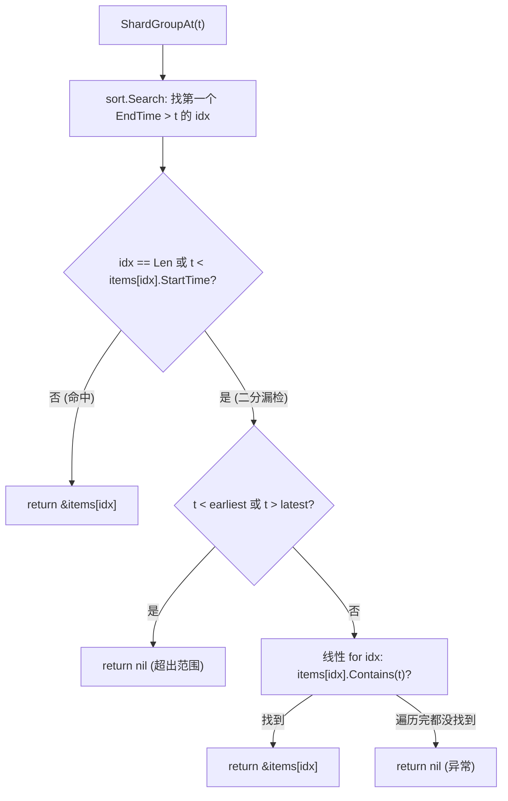

> **具体案例**: t 落在两个重叠 ShardGroup 的窗口内
>
> 假设有两个 ShardGroup (通常由 `TruncatedAt` 截断 + 后续重建产生重叠):
>
> ```
> SG_A: StartTime=00:00, EndTime=01:00, TruncatedAt=00:30  (实际 EndTime 仍按 01:00 排序)
> SG_B: StartTime=00:20, EndTime=02:00
> ```
>
> `ShardGroupInfos.Less` 在 `EndTime` 相同时按 `StartTime` 升序，但这里 EndTime 不同，
> 排序结果 (按 EndTime 升序): `[SG_A(01:00), SG_B(02:00)]`。
> `earliest = 00:00`, `latest = 02:00`。
>
> 查询 `t = 00:25`:
> 1. `sort.Search` 找"第一个 EndTime > 00:25" → `idx = 0` (SG_A, EndTime=01:00 > 00:25)。
> 2. `t.Before(l.items[0].StartTime)` → `00:25.Before(00:00)` = false。
> 3. 二分命中，返回 `&SG_A`。**正确** (00:25 在 SG_A 的 [00:00, 01:00) 内)。
>
> 查询 `t = 00:35` (在 SG_A 截断后、SG_B 起始后的重叠区):
> 1. `sort.Search` 找"第一个 EndTime > 00:35" → `idx = 0` (SG_A, EndTime=01:00 > 00:35)。
> 2. `t.Before(l.items[0].StartTime)` → `00:35.Before(00:00)` = false。
> 3. 二分命中，返回 `&SG_A`。**但 SG_A 已被 TruncatedAt=00:30 截断**，
>    `ShardGroupByTimestamp` 会因 `!sgi.Truncated() || timestamp.Before(sgi.TruncatedAt)`
>    返回 nil (data.go:1157 的 `ShardGroupByTimestamp` 逻辑)。
>
> 真正触发**线性回退**的场景是 EndTime 相同、StartTime 不同导致二分 idx 指向
> "StartTime > t" 的那个组:
>
> ```
> SG_C: StartTime=00:30, EndTime=01:00   (EndTime 相同)
> SG_D: StartTime=00:00, EndTime=01:00   (StartTime 更早)
> 排序 (EndTime 相同按 StartTime 升序): [SG_D(00:00), SG_C(00:30)]
> ```
>
> 查询 `t = 00:15`:
> 1. `sort.Search` 找"第一个 EndTime > 00:15" → `idx = 0` (两个 EndTime 都是 01:00 > 00:15，
>    `sort.Search` 返回第一个满足条件的，即 idx=0 = SG_D)。
> 2. `t.Before(l.items[0].StartTime)` → `00:15.Before(00:00)` = false → 二分命中 SG_D。
>    **正确** (00:15 ∈ SG_D 的 [00:00, 01:00))。
>
> 查询 `t = 00:45` (两个组都包含):
> 1. `sort.Search` → idx=0 = SG_D。`00:45.Before(00:00)` = false → 返回 SG_D。
>    **正确** (重叠区任选一个都算命中)。
>
> 触发线性回退的构造: EndTime 不同但二分 idx 指向 StartTime > t 的组:
>
> ```
> SG_E: StartTime=00:50, EndTime=01:00   (EndTime 早, StartTime 晚)
> SG_F: StartTime=00:00, EndTime=02:00   (EndTime 晚, StartTime 早)
> 排序 (按 EndTime 升序): [SG_E(01:00), SG_F(02:00)]
> earliest=00:00, latest=02:00
> ```
>
> 查询 `t = 00:30`:
> 1. `sort.Search` 找"第一个 EndTime > 00:30" → `idx = 0` (SG_E, EndTime=01:00 > 00:30)。
> 2. `t.Before(l.items[0].StartTime)` → `00:30.Before(00:50)` = **true**。
> 3. 二分路径判定"未命中"，进入回退分支。
> 4. `t.Before(earliest)` → `00:30.Before(00:00)` = false; `t.After(latest)` = false → 不返回 nil。
> 5. 线性 `for idx=0`: `SG_E.Contains(00:30)` → `00:30 >= 00:50` = false，不 break。
> 6. `idx=1`: `SG_F.Contains(00:30)` → `00:30 >= 00:00 && 00:30 < 02:00` = true → break。
> 7. 返回 `&SG_F`。**正确** (00:30 ∈ SG_F)。
>
> 如果没有线性回退，步骤 3 之后直接返回 nil，`MapShards` 会把 `t=00:30` 的点标记为
> dropped (points_writer.go:298-301)，造成**数据丢失**。这正是源码注释强调的
> "non-silently drop writes we should have accepted" 风险。

**ShardGroupInfos 排序规则** (services/meta/data.go:1304):

```go
// services/meta/data.go:1304 — ShardGroupInfos 排序
type ShardGroupInfos []ShardGroupInfo

func (a ShardGroupInfos) Less(i, j int) bool {
    iEnd := a[i].EndTime
    if a[i].Truncated() {
        iEnd = a[i].TruncatedAt  // Truncated() 检查 TruncatedAt.IsZero()
    }

    jEnd := a[j].EndTime
    if a[j].Truncated() {
        jEnd = a[j].TruncatedAt
    }

    if iEnd.Equal(jEnd) {
        return a[i].StartTime.Before(a[j].StartTime)
    }

    return iEnd.Before(jEnd)
}
```

**ShardFor 路由**:

```go
// services/meta/data.go:1370 — ShardGroupInfo.ShardFor
func (sgi *ShardGroupInfo) ShardFor(p hashIDer) ShardInfo {
    if len(sgi.Shards) == 1 {
        return sgi.Shards[0]  // 单 shard: 直接返回 (OSS 默认)
    }
    // 多 shard: hash 取模 (Enterprise 模式)
    return sgi.Shards[p.HashID()%uint64(len(sgi.Shards))]
}
```

**ShardGroupInfo 完整结构**:

```go
// services/meta/data.go:1293 — ShardGroupInfo
type ShardGroupInfo struct {
    ID          uint64        // 全局唯一 ID (data.MaxShardGroupID++)
    StartTime   time.Time     // 窗口起始 (包含)
    EndTime     time.Time     // 窗口结束 (不包含)
    DeletedAt   time.Time     // 删除标记 (非零表示已删除)
    Shards      []ShardInfo   // 属于此 ShardGroup 的 Shard 列表
    TruncatedAt time.Time     // 截断时间 (覆盖 EndTime)
}
```

**关键方法**:

```go
// services/meta/data.go:1332
func (sgi *ShardGroupInfo) Contains(t time.Time) bool {
    return !t.Before(sgi.StartTime) && t.Before(sgi.EndTime)
}

// services/meta/data.go:1342
func (sgi *ShardGroupInfo) Deleted() bool {
    return !sgi.DeletedAt.IsZero()
}

// services/meta/data.go:1347
func (sgi *ShardGroupInfo) Truncated() bool {
    return !sgi.TruncatedAt.IsZero()
}
```

**ShardInfo 和 ShardOwner**:

```go
// services/meta/data.go:1426 — ShardInfo
type ShardInfo struct {
    ID     uint64        // 全局唯一 Shard ID
    Owners []ShardOwner  // 拥有此 Shard 的节点列表
}

// services/meta/data.go:1532 — ShardOwner
type ShardOwner struct {
    NodeID uint64  // 节点 ID
}

// services/meta/data.go:1432
func (si ShardInfo) OwnedBy(nodeID uint64) bool {
    for _, owner := range si.Owners {
        if owner.NodeID == nodeID {
            return true
        }
    }
    return false
}
```

**Protobuf 定义** (services/meta/internal/meta.proto):

```protobuf
message ShardGroupInfo {
    required uint64 ID = 1;
    required int64 StartTime = 2;
    required int64 EndTime = 3;
    required int64 DeletedAt = 4;
    repeated ShardInfo Shards = 5;
    optional int64 TruncatedAt = 6;
}

message ShardInfo {
    required uint64 ID = 1;
    repeated uint64 OwnerIDs = 2 [deprecated=true];  // 旧版兼容
    repeated ShardOwner Owners = 3;
}

message ShardOwner {
    required uint64 NodeID = 1;
}
```

> **小白解释**: MapShards 就像邮局分拣——根据信件（数据点）的时间戳，决定放到哪个邮筒（ShardGroup）。
> 第一遍：看看哪些邮筒已经存在，不存在的就创建。
> 第二遍：把每封信放到对应的邮筒里。

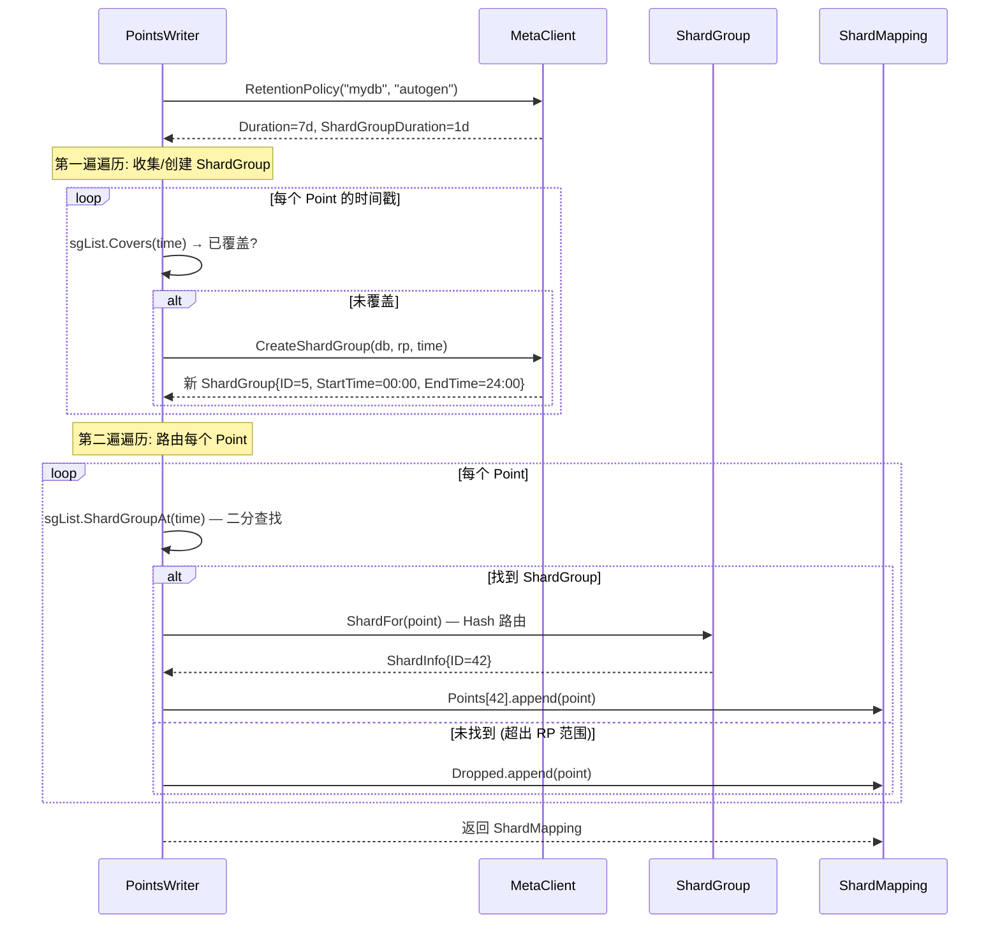

#### 步骤 6: Store.WriteToShard — Store 层入口

```go
// tsdb/store.go:1861 — WriteToShard
func (s *Store) WriteToShard(writeCtx tsdb.WriteContext, shardID uint64, points []models.Point) error {
    // 1. 查找 Shard (读锁)
    s.mu.RLock()

    select {
    case <-s.closing:
        s.mu.RUnlock()
        return tsdb.ErrStoreClosed
    default:
    }

    sh := s.shards[shardID]
    if sh == nil {
        s.mu.RUnlock()
        return tsdb.ErrShardNotFound
    }

    epoch := s.epochs[shardID]

    s.mu.RUnlock()

    // 2. Epoch 追踪: 获取 pending delete guards
    guards, gen := epoch.StartWrite()
    defer epoch.EndWrite(gen)

    // 3. 如果有匹配的 pending delete，等待完成
    for _, guard := range guards {
        if guard.Matches(points) {
            guard.Wait()
        }
    }

    // 4. 如果 Shard 空闲，重新启用压缩
    if isIdle, _ := sh.IsIdle(); isIdle {
        sh.SetCompactionsEnabled(true)
    }

    // 5. 委托给 Shard，并把 UserId 注入 stats tracker
    return sh.WritePoints(points, s.statsTracker(sh.database, sh.retentionPolicy, writeCtx.UserId))
}
```

**为什么用 RLock 而非 Lock？** 多个写入可以并发进行，只有创建/删除 Shard 需要写锁。读锁允许高并发写入。

#### 步骤 7-8: Epoch Tracker — 写入/删除序列化

```go
// tsdb/epoch_tracker.go:13 — epochTracker
type epochTracker struct {
    mu      sync.Mutex
    epoch   uint64                          // 全局 epoch 计数器
    largest uint64                          // 最大 epoch (delete 使用)
    writes  int64                           // 活跃写入计数
    deletes map[uint64]*epochDeleteState    // pending deletes
}
```

**StartWrite — 写入者注册**:

```go
// tsdb/epoch_tracker.go:63 — StartWrite
func (e *epochTracker) StartWrite() ([]*guard, uint64) {
    e.mu.Lock()
    gen := e.next()   // 先递增 epoch
    e.writes++        // 再增加活跃写入计数

    // 无 pending deletes: 手动解锁后提前返回
    if len(e.deletes) == 0 {
        e.mu.Unlock()
        return nil, gen
    }

    guards := make([]*guard, 0, len(e.deletes))
    for _, state := range e.deletes {
        guards = append(guards, state.guard)  // state.guard, 不是 state.g
    }

    e.mu.Unlock()
    return guards, gen
}
```

**EndWrite — 写入者注销**:

```go
// tsdb/epoch_tracker.go:83 — EndWrite
func (e *epochTracker) EndWrite(gen uint64) {
    e.mu.Lock()
    if gen <= e.largest {
        // 只有 gen 在删除范围内才需要遍历
        for dgen, state := range e.deletes {
            if gen > dgen {
                continue  // 跳过更早的 generation
            }
            state.done()
        }
    }
    e.writes--  // 遍历之后递减
    e.mu.Unlock()
}
```

**WaitDelete — 删除者注册**:

```go
// tsdb/epoch_tracker.go:127 — WaitDelete
func (e *epochTracker) WaitDelete(guard *guard) epochWaiter {
    e.mu.Lock()
    state := &epochDeleteState{
        pending: e.writes,                    // 当前活跃写入数
        cond:    sync.NewCond(new(sync.Mutex)),
        guard:   guard,
    }

    gen := e.next()        // 递增 epoch
    e.largest = gen
    e.deletes[gen] = state
    e.mu.Unlock()

    return epochWaiter{
        gen:     gen,
        guard:   guard,
        state:   state,
        tracker: e,
    }
}
```

**epochDeleteState 和 epochWaiter**:

```go
// tsdb/epoch_tracker.go:30 — epochDeleteState
type epochDeleteState struct {
    cond    *sync.Cond
    guard   *guard
    pending int64
}

// tsdb/epoch_tracker.go:37 — done
func (e *epochDeleteState) done() {
    e.cond.L.Lock()
    e.pending--
    if e.pending == 0 {
        e.cond.Broadcast()  // 通知 Wait()
    }
    e.cond.L.Unlock()
}

// tsdb/epoch_tracker.go:101 — epochWaiter
type epochWaiter struct {
    gen     uint64
    guard   *guard
    state   *epochDeleteState
    tracker *epochTracker
}

func (e epochWaiter) Wait() {
    if e.state == nil || e.tracker == nil {
        return
    }
    e.state.Wait()  // 使用 sync.Cond 等待
}

func (e epochWaiter) Done() {
    e.tracker.mu.Lock()
    delete(e.tracker.deletes, e.gen)  // 从 deletes map 中移除
    e.tracker.mu.Unlock()
    e.guard.Done()
}
```

**Guard — 粒度匹配**:

```go
// tsdb/guard.go:12 — guard
type guard struct {
    cond  *sync.Cond
    done  bool
    min   int64
    max   int64
    names map[string]struct{}
    expr  *exprGuard
}

func (g *guard) Matches(points []models.Point) bool {
    if g == nil {
        return true  // nil guard 匹配所有点 (写入必须等待)
    }

    for _, pt := range points {
        if t := pt.Time().UnixNano(); t < g.min || t > g.max {
            continue
        }
        if len(g.names) == 0 && g.expr.matches(pt) {
            return true
        } else if _, ok := g.names[string(pt.Name())]; ok && g.expr.matches(pt) {
            return true
        }
    }
    return false
}
```

> **具体案例**: 为什么需要 Epoch Tracker？
>
> 假设没有 Epoch Tracker，会发生什么：
> ```
> t=1: 用户执行 DELETE FROM cpu WHERE time >= '10:00' AND time < '11:00'
> t=2: 删除操作开始，正在逐个删除 TSM 文件中 10:00-11:00 的数据
> t=3: 新写入到达: cpu,host=web value=99.9 10:30:00 (时间戳在删除范围内!)
> t=4: 删除操作完成
>
> 问题: t=3 写入的数据在 t=2 开始删除时还不存在，但 t=4 删除完成时它已经存在了。
>       如果删除操作不知道这个新数据的存在，就会漏删它！
>       或者更糟：删除操作可能误删了 t=3 写入的数据！
>
> Epoch Tracker 的解决方案:
> - 删除开始时，记录当前所有活跃的写入 (guard)
> - 新写入到达时，检查是否与 guard 匹配
> - 如果匹配，新写入必须等待删除完成后再执行
> - 这样删除操作就知道哪些数据是"旧的"，哪些是"新的"
> ```

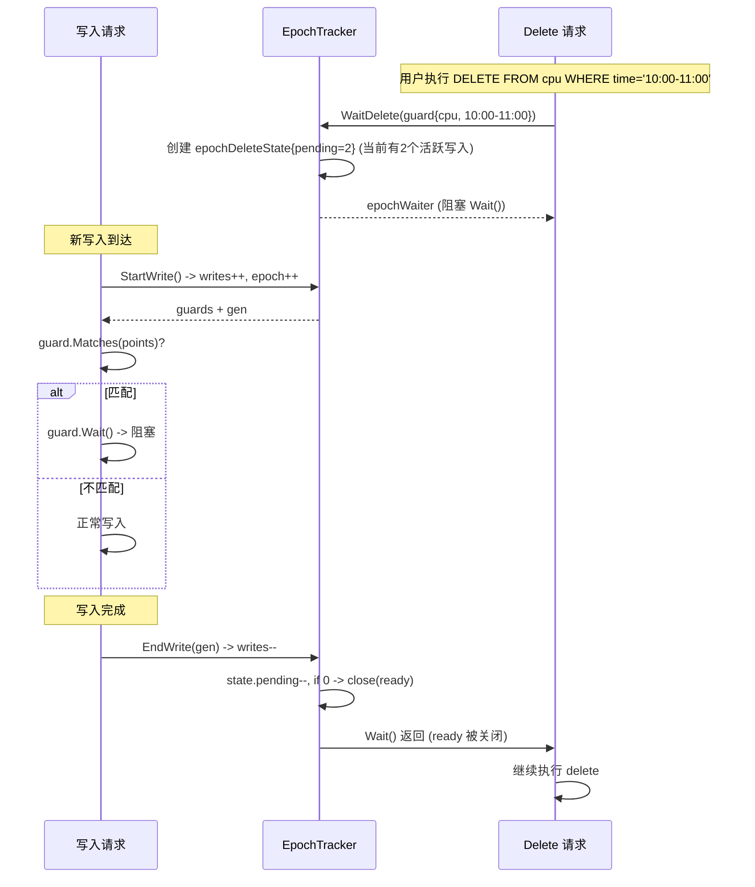

**为什么需要 Epoch Tracker？** 防止写入和删除的竞态条件：如果 delete 正在删除某个时间范围的数据，新写入的相同时间范围的数据必须等待 delete 完成，否则 delete 会误删新写入的数据。Guard 按 measurement + timeRange 匹配，不同 measurement 的写入不受影响。

#### 步骤 9-12: Shard 层写入

```go
// tsdb/shard.go:562 — WritePoints
func (s *Shard) WritePoints(points []models.Point, tracker StatsTracker) error {
    // 1. 获取读锁 (允许并发写入)
    s.mu.RLock()
    defer s.mu.RUnlock()

    // 2. 获取引擎引用 (返回 Engine, error)
    engine, err := s.engineNoLock()
    if err != nil {
        return err
    }

    // 3. 验证 series 和 fields
    var writeError error
    points, fieldsToCreate, err := s.validateSeriesAndFields(points, tracker)
    if err != nil {
        if _, ok := err.(PartialWriteError); !ok {
            return err
        }
        writeError = err
    }

    // 4. 创建新的 fields
    if _, err := s.saveFieldsAndMeasurements(fieldsToCreate); err != nil {
        return err
    }

    // 5. 写入引擎
    if err := engine.WritePoints(points, tracker); err != nil {
        atomic.AddInt64(&s.stats.WritePointsErr, int64(len(points)))
        return fmt.Errorf("engine: %w", err)
    }

    // 6. 统计
    atomic.AddInt64(&s.stats.WriteReqOK, 1)
    return writeError
}
```

**validateSeriesAndFields** 的关键检查:

```go
// tsdb/shard.go — validateSeriesAndFields
func (s *Shard) validateSeriesAndFields(points []models.Point, tracker StatsTracker) ([]models.Point, []*FieldCreate, error) {
    var (
        createdFieldsToSave []*FieldCreate
        dropped             int
        reason              string
    )

    // 1. 第一阶段: 过滤非法 series key，并准备批量建 series 的数组
    keys := make([][]byte, len(points))
    names := make([][]byte, len(points))
    tagsSlice := make([]models.Tags, len(points))
    validateKeys := s.options.Config.ValidateKeys

    var j int
    for i, p := range points {
        tags := p.Tags()
        if v := tags.Get(TimeBytes); v != nil {
            dropped++
            if reason == "" { reason = `invalid tag key: input tag "time" is invalid` }
            continue
        }
        if validateKeys && !models.ValidKeyTokens(string(p.Name()), tags) {
            dropped++
            if reason == "" { reason = fmt.Sprintf("key contains invalid unicode: %q", makePrintable(string(p.Key()))) }
            continue
        }
        keys[j], names[j], tagsSlice[j], points[j] = p.Key(), p.Name(), tags, points[i]
        j++
    }
    points, keys, names, tagsSlice = points[:j], keys[:j], names[:j], tagsSlice[:j]

    engine, err := s.engineNoLock()
    if err != nil {
        return nil, nil, err
    }

    // 2. 批量创建 series；PartialWriteError 会带回 dropped keys
    var droppedKeys [][]byte
    if err := engine.CreateSeriesListIfNotExists(keys, names, tagsSlice, tracker); err != nil {
        switch err := err.(type) {
        case PartialWriteError:
            reason, dropped, droppedKeys = err.Reason, dropped+err.Dropped, err.DroppedKeys
        case *PartialWriteError:
            reason, dropped, droppedKeys = err.Reason, dropped+err.Dropped, err.DroppedKeys
        default:
            return nil, nil, err
        }
    }

    // 3. 第二阶段: 验证 fields；不直接调用不存在的 s.fieldType()
    j = 0
    for i, p := range points {
        // field 名为 "time" 的点如果没有其他有效 field，会整点丢弃
        iter := p.FieldIterator()
        validField := false
        for iter.Next() {
            if bytes.Equal(iter.FieldKey(), TimeBytes) { continue }
            validField = true
            break
        }
        if !validField {
            dropped++
            if reason == "" { reason = `invalid field name: input field "time" is invalid` }
            continue
        }

        if len(droppedKeys) > 0 && bytesutil.Contains(droppedKeys, keys[i]) {
            continue
        }

        mf := engine.MeasurementFields(p.Name())
        newFields, partialWriteError := ValidateAndCreateFields(mf, p, s.options.Config.SkipFieldSizeValidation)
        createdFieldsToSave = append(createdFieldsToSave, newFields...)
        if partialWriteError != nil && partialWriteError.Dropped > 0 {
            if reason == "" { reason = partialWriteError.Reason }
            dropped += partialWriteError.Dropped
            continue
        }
        points[j] = points[i]
        j++
    }
    points = points[:j]

    if dropped > 0 {
        return points, createdFieldsToSave, PartialWriteError{
            Reason: reason, Dropped: dropped, Database: s.database, RetentionPolicy: s.retentionPolicy,
        }
    }
    return points, createdFieldsToSave, nil
}
```

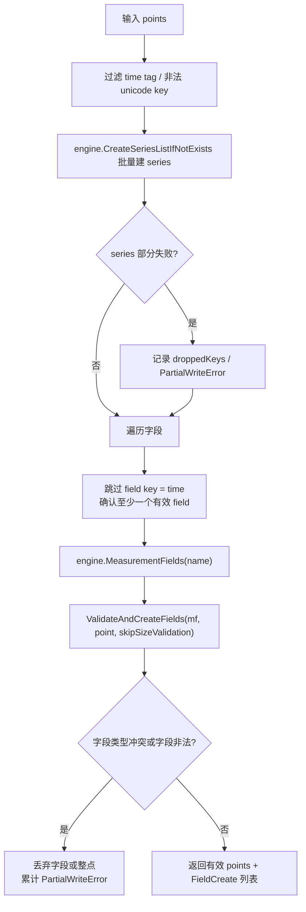

**案例**: 一个 batch 中同时包含 `cpu,time=x value=1`、`cpu value=1i`
和 `cpu value=1.2`。第一条因保留 tag `time` 在 series 阶段被丢弃；后两条进入
字段阶段，`ValidateAndCreateFields` 根据 measurement 的字段元数据判断 `value`
是否发生 int/float 类型冲突，并只把有效点继续交给 engine。

**PartialWriteError 结构**:

```go
// tsdb/shard.go:121 — PartialWriteError
type PartialWriteError struct {
    Reason  string
    Dropped int

    // A sorted slice of series keys that were dropped.
    DroppedKeys     [][]byte
    Database        string
    RetentionPolicy string
}

func (e PartialWriteError) Error() string {
    message := fmt.Sprintf("partial write: %s dropped=%d", e.Reason, e.Dropped)
    if len(e.Database) > 0 {
        message = fmt.Sprintf("%s for database: %s", message, e.Database)
    }
    if len(e.RetentionPolicy) > 0 {
        message = fmt.Sprintf("%s for retention policy: %s", message, e.RetentionPolicy)
    }
    return message
}
```

**PartialWriteError 传播路径**:
1. `Shard.validateSeriesAndFields()` → 产生 PartialWriteError
2. `Shard.WritePoints()` → 返回但继续写入有效点
3. `Store.WriteToShard()` → 透传
4. `PointsWriter.writeToShard()` → 透传
5. `HTTP Handler.serveWrite()` → 返回 400 (部分成功)

#### 步骤 12b: Engine.WritePoints — Point 到 Value 的转换

```go
// tsdb/engine/tsm1/engine.go:1346 — WritePoints
func (e *Engine) WritePoints(points []models.Point, tracker tsdb.StatsTracker) error {
    values := make(map[string][]Value, len(points))

    for _, p := range points {
        // 1. 构建 key: point.Key() + keyFieldSeparator + fieldKey
        keyBuf := append(p.Key(), keyFieldSeparator...)

        // 2. 遍历 fields
        iter := p.FieldIterator()
        for iter.Next() {
            fieldKey := iter.FieldKey()
            fullKey := append(keyBuf, fieldKey...)

            // 3. 类型冲突快速检查 (seriesTypeMap 是 *radix.Tree)
            //    存储的是 int 值 (int(iter.Type()) / int(typ))
            if v, ok := e.seriesTypeMap.Get(fullKey); ok {
                if v != int(iter.Type()) {
                    seriesErr = tsdb.ErrFieldTypeConflict
                    continue  // 跳过此 field
                }
            } else {
                // 不存在时尝试 Insert；Insert 返回 (旧值, ok)
                // ok==false 表示插入成功；否则比较旧值
                vv, ok := e.seriesTypeMap.Insert(fullKey, int(iter.Type()))
                if !ok || vv != int(iter.Type()) {
                    seriesErr = tsdb.ErrFieldTypeConflict
                    continue  // 跳过此 field
                }
            }

            // 4. 转换为 TSM Value (按 iter.Type() 分发)
            switch iter.Type() {
            case models.Float:
                fv, _ := iter.FloatValue()
                values[string(fullKey)] = append(values[string(fullKey)],
                    NewFloatValue(p.UnixNano(), fv))
            case models.Integer:
                iv, _ := iter.IntegerValue()
                values[string(fullKey)] = append(values[string(fullKey)],
                    NewIntegerValue(p.UnixNano(), iv))
            case models.Unsigned:
                uv, _ := iter.UnsignedValue()
                values[string(fullKey)] = append(values[string(fullKey)],
                    NewUnsignedValue(p.UnixNano(), uv))
            case models.String:
                sv, _ := iter.StringValue()
                values[string(fullKey)] = append(values[string(fullKey)],
                    NewStringValue(p.UnixNano(), sv))
            case models.Boolean:
                bv, _ := iter.BooleanValue()
                values[string(fullKey)] = append(values[string(fullKey)],
                    NewBooleanValue(p.UnixNano(), bv))
            }
        }
    }

    // 5. 写入 Cache
    e.Cache.WriteMulti(values)

    // 6. 写入 WAL (e.WALEnabled 是 Engine 上的 bool 字段, engine.go:203)
    if e.WALEnabled {
        if err := e.WAL.WriteMulti(values); err != nil {
            return err
        }
    }

    return seriesErr
}
```

> **源码校准**: `e.seriesTypeMap` 是 `*radix.Tree` (engine.go:225)，不是 `sync.Map`。
> 类型检查通过 `e.seriesTypeMap.Get(key)` / `e.seriesTypeMap.Insert(key, int)` 完成，
> 存储值为 `int` (`int(iter.Type())` 或 `int(typ)`)；冲突判断是 `v != int(iter.Type())`。
> 当 `Get` 未命中时，源码还会先调用 `e.Type(keyBuf)` 复核磁盘上的类型 (engine.go:1372-1380)，
> 两者都通过后才 `Insert`。`tsdb.ErrFieldTypeConflict` 被赋给 `seriesErr` 并 `continue`
> 跳过该 field，但不会中断整批写入——这部分行为与旧描述一致。

#### 步骤 13: Epoch EndWrite

`EndWrite(gen)` 通过 `defer` 在 `Store.WriteToShard` 返回时自动调用：

```go
// tsdb/store.go:1444
guards, gen := epoch.StartWrite()
defer epoch.EndWrite(gen)  // 函数返回时自动调用
```

每个写入的 `gen` 值保证：只有 `generation >= gen` 的 pending delete 才会被通知。这确保了 delete 等待的是它之前（或同时）开始的写入。

#### 步骤 14: Subscriber Fan-Out — 数据推送

```go
// coordinator/points_writer.go:512 — subscriber fan-out (在 WritePointsPrivileged 中)
pts := &WritePointsRequest{Database: database, RetentionPolicy: retentionPolicy, Points: points}
w.Subscriber.Send(pts)
atomic.AddInt64(&w.stats.SubWriteOK, 1)
```

这个调用发生在等待 shard goroutine 结果之前：也就是说，订阅转发可能已经入队或被 subscriber 层拒绝，而随后主写入仍可能因为 shard 错误或 `WriteTimeout` 返回失败。

**Subscriber 内部机制**:

```go
// services/subscriber/service.go:309 — Service.Send
func (s *Service) Send(request *coordinator.WritePointsRequest) {
    s.router.Send(request)
}

// services/subscriber/service.go:608 — subscriptionRouter.Send
func (s *subscriptionRouter) Send(request *coordinator.WritePointsRequest) {
    s.mu.RLock()
    defer s.mu.RUnlock()
    if !s.ready {
        return
    }
    writers := s.m[dbrp{db: request.Database, rp: request.RetentionPolicy}]
    if len(writers) == 0 {
        return
    }
    writeReq, numInvalid := NewWriteRequest(request, s.Logger)
    atomic.AddInt64(s.writeFailures, numInvalid)
    for _, w := range writers {
        w.Write(writeReq)
    }
}
```

**BalanceMode 定义**:

```go
// services/subscriber/service.go:392 — BalanceMode
type BalanceMode int

const (
    ALL BalanceMode = iota  // 写入所有目的地
    ANY                     // 轮询写入一个成功的
)
```

**balancewriter 核心逻辑**:

```go
// services/subscriber/service.go — balancewriter.WritePointsContext
type balancewriter struct {
    bm          BalanceMode
    writers     []PointsWriter
    stats       []writerStats
    defaultTags models.StatisticTags
    i           int  // 轮询索引
}

func (b *balancewriter) WritePointsContext(ctx context.Context, request WriteRequest) (string, error) {
    var lastErr error
    var lastDest string
    for range b.writers {
        idx := b.i
        w := b.writers[idx]
        b.i = (b.i + 1) % len(b.writers)  // 轮询前进

        dest, err := w.WritePointsContext(ctx, request)
        if err != nil {
            lastErr = err
            lastDest = dest
            atomic.AddInt64(&b.stats[idx].failures, 1)
        } else {
            atomic.AddInt64(&b.stats[idx].pointsWritten, int64(len(request.pointOffsets)))
            if b.bm == ANY {
                break  // ANY 模式: 后续成功后停止继续尝试
            }
            // ALL 模式: 继续写入下一个
        }
    }
    return lastDest, lastErr
}
```

**BalanceMode 语义校准**:
- `ALL` 表示尝试 fan-out 到所有目的地；它不是可靠投递协议，没有持久化队列、ack 重试或端到端确认。
- `ANY` 会按轮询顺序尝试目的地，遇到后续成功后停止继续尝试；但函数最后返回的是 `lastErr`，如果前面目的地失败、后面目的地成功，先前错误仍可能作为返回值传出。

**传输实现 — HTTP Writer**:

```go
// services/subscriber/http.go — HTTP
type HTTP struct {
    c    client.HTTPClient
    addr string
}

func (h *HTTP) WritePointsContext(ctx context.Context, request WriteRequest) (string, error) {
    bp, _ := client.NewBatchPoints(client.BatchPointsConfig{
        Database:        request.Database,
        RetentionPolicy: request.RetentionPolicy,
    })

    // WriteRequest 已经持有序列化后的 line protocol。
    return h.addr, h.c.WriteRawCtx(ctx, bp, bytes.NewReader(request.lineProtocol))
}
```

**传输实现 — UDP Writer**:

```go
// services/subscriber/udp.go — UDP
type UDP struct {
    addr        string  // host:port
    destination string  // 原始 URL
}

func (u *UDP) WritePointsContext(ctx context.Context, request WriteRequest) (string, error) {
    // 解析地址
    addr, err := net.ResolveUDPAddr("udp", u.addr)
    if err != nil {
        return u.destination, err
    }

    // 每次写入创建新连接!
    con, err := net.DialUDP("udp", nil, addr)
    if err != nil {
        return u.destination, err
    }
    defer con.Close()

    for i := range request.pointOffsets {
        // write the point without the trailing newline
        pointRaw := request.PointAt(i)
        _, err = con.Write(pointRaw[:pointRaw[len(pointRaw)-1]])
        if err != nil {
            return
        }
    }
    return
}
```

> **确认为缺陷**: 当前 OSS 源码 (services/subscriber/udp.go:42) 使用的是
> `pointRaw[:pointRaw[len(pointRaw)-1]]`。注释意图是"去掉末尾换行"
> (write the point without the trailing newline)，正确写法应是
> `pointRaw[:len(pointRaw)-1]`——即把 `len(pointRaw)-1` 作为 slice 上界索引。
> 但源码把 `pointRaw[len(pointRaw)-1]` (最后一个**字节值**)作为上界：当末尾字节是
> 换行符 `0x0a` (10) 时，`pointRaw[:10]` 只会写出前 10 个字节而不是去掉末尾一个字节；
> 当末尾字节值大于切片长度时会 panic，小于时则截断数据。这是一个 off-by-one 的
> 索引/字节值混淆缺陷。

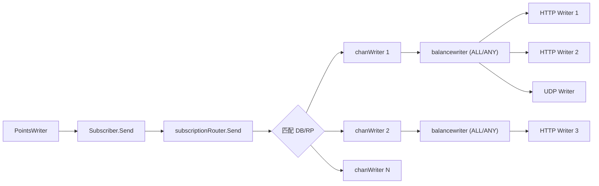

#### Subscriber Fan-Out 机制 — 详细序列图

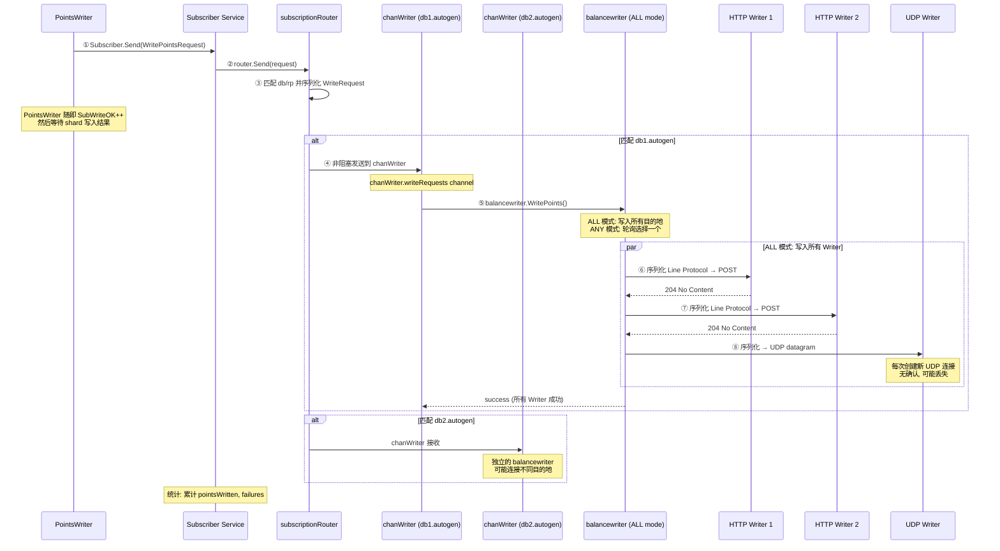

**Fan-Out 关键特性**:
- **非阻塞**: `chanWriter.Write` 写入 destination 队列时使用 `select default`，队列满或超过字节限制时拒绝，不阻塞主写入路径
- **按 DB/RP 分发**: 每个 subscription 绑定一个 database + RP 组合，只有匹配的数据才会被转发
- **ALL/ANY 模式**: ALL 尝试写入所有目的地但不提供可靠投递；ANY 轮询尝试，遇到后续成功后停止，但先前错误仍可能返回
- **背压显式化**: subscriber `writeFailures` 暴露队列满、超限或 destination 写入失败
- **WriteConcurrency**: 每个 subscription 启动 `WriteConcurrency` 个 goroutine 执行 `chanWriter.Run()`，实现并发写入

#### 步骤 15: 结果收集与超时

```go
// coordinator/points_writer.go:437 — 结果收集
var timer *time.Timer
timer = time.NewTimer(w.WriteTimeout)  // 默认 10s
defer timer.Stop()

for i := 0; i < len(shardMappings.Points); i++ {
    select {
    case <-timer.C:
        // 超时
        return ErrTimeout
    case <-w.closing:
        // 正在关闭
        return ErrWriteFailed
    case err := <-ch:
        if err != nil {
            return err  // 第一个错误立即返回
        }
    }
}
```

`WritePointsPrivileged` 遇到第一个 shard 错误会立即返回给调用方，但它不会取消已经启动的其他 shard goroutine；这些 goroutine 仍会继续执行到底层 `WriteToShard` 返回。

**错误哨兵变量**:

```go
// coordinator/points_writer.go:32-42
var (
    ErrTimeout      = errors.New("timeout")
    ErrPartialWrite = errors.New("partial write")
    ErrWriteFailed  = errors.New("write failed")
)
```

**并发模型**:

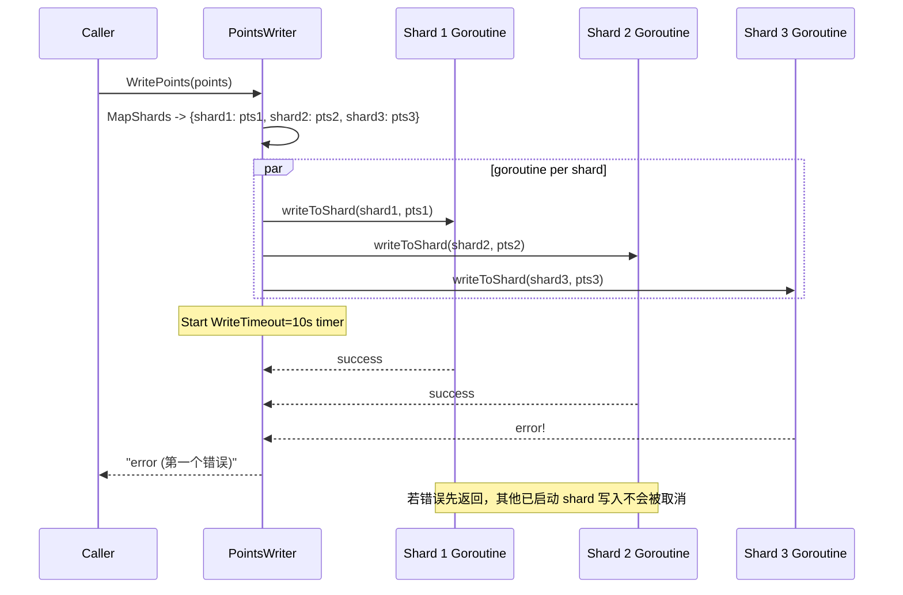

#### writeToShard — Write-Through 重试

```go
// coordinator/points_writer.go:544 — writeToShard
func (w *PointsWriter) writeToShard(writeCtx tsdb.WriteContext, shard *meta.ShardInfo,
    database, retentionPolicy string, points []models.Point) error {

    // 首次写入
    err := w.TSDBStore.WriteToShard(writeCtx, shard.ID, points)

    // ErrShardNotFound: 创建 Shard 后重试一次
    if err == tsdb.ErrShardNotFound {
        err = w.TSDBStore.CreateShard(database, retentionPolicy, shard.ID, true)
        if err != nil {
            w.Logger.Error("Failed to create shard",
                zap.Uint64("shard", shard.ID), zap.Error(err))
            atomic.AddInt64(&w.stats.WriteErr, 1)
            return err
        }
        // 重试一次
        err = w.TSDBStore.WriteToShard(writeCtx, shard.ID, points)
    }

    if err != nil {
        w.Logger.Error("Write failed",
            zap.Uint64("shard", shard.ID), zap.Error(err))
        atomic.AddInt64(&w.stats.WriteErr, 1)
        return err
    }

    atomic.AddInt64(&w.stats.WriteOK, 1)
    return nil
}
```

## 2. ShardGroup Duration 自适应

### 2.1 shardGroupDuration 函数

```go
// services/meta/data.go:1266 — shardGroupDuration
func shardGroupDuration(d time.Duration) time.Duration {
    if d >= 180*24*time.Hour || d == 0 { // 6 个月或 0
        return 7 * 24 * time.Hour
    } else if d >= 2*24*time.Hour { // 2 天
        return 1 * 24 * time.Hour
    }
    return 1 * time.Hour
}
```

| RP Duration | ShardGroup Duration | 设计意图 |
|-------------|---------------------|----------|
| >= 6 个月 | 7 天 | 长期数据，减少 ShardGroup 数量 |
| >= 2 天 | 1 天 | 中期数据，平衡粒度 |
| < 2 天 | 1 小时 | 短期数据，细粒度过期管理 |
| 无限 (0) | 7 天 | 默认策略 |

**normalisedShardDuration** (services/meta/data.go:1275):

```go
// services/meta/data.go:1275 — normalisedShardDuration
func normalisedShardDuration(sgd, d time.Duration) time.Duration {
    // sgd=0: 未指定, 使用 shardGroupDuration 默认值
    if sgd == 0 {
        return shardGroupDuration(d)
    }
    // sgd < MinRetentionPolicyDuration: 规范化到最小值
    if sgd < MinRetentionPolicyDuration {
        return shardGroupDuration(MinRetentionPolicyDuration)
    }
    return sgd
}
```

### 2.2 ShardGroup 自动创建

```go
// services/meta/data.go:358 — CreateShardGroup
func (data *Data) CreateShardGroup(database, policy string, timestamp time.Time) error {
    // 1. 查找 RP
    rpi, err := data.RetentionPolicy(database, policy)
    if err != nil {
        return err
    } else if rpi == nil {
        return influxdb.ErrRetentionPolicyNotFound(policy)
    }

    // 2. 检查是否已存在覆盖此时间的 ShardGroup (幂等)
    if rpi.ShardGroupByTimestamp(timestamp) != nil {
        return nil  // 已存在
    }

    // 3. 计算 ShardGroup 边界 (直接使用 rpi.ShardGroupDuration)
    data.MaxShardGroupID++
    sgi := ShardGroupInfo{}
    sgi.ID = data.MaxShardGroupID
    sgi.StartTime = timestamp.Truncate(rpi.ShardGroupDuration).UTC()
    sgi.EndTime = sgi.StartTime.Add(rpi.ShardGroupDuration).UTC()

    // 4. 创建 Shard (OSS: 每个 ShardGroup 只有 1 个 Shard)
    data.MaxShardID++
    sgi.Shards = []ShardInfo{
        {ID: data.MaxShardID},
    }

    // 5. 添加到 RP (排序后插入)
    rpi.ShardGroups = append(rpi.ShardGroups, sgi)
    sort.Sort(ShardGroupInfos(rpi.ShardGroups))

    return nil
}
```

**关键发现**: OSS 版本每个 ShardGroup 只创建 **1 个 Shard**。`ShardFor()` 的 hash 路由是 Enterprise 版本的遗留代码。

**ShardGroupByTimestamp** (services/meta/data.go:1157):

```go
// services/meta/data.go:1157 — ShardGroupByTimestamp
func (rpi *RetentionPolicyInfo) ShardGroupByTimestamp(timestamp time.Time) *ShardGroupInfo {
    for i := range rpi.ShardGroups {
        sgi := &rpi.ShardGroups[i]
        if sgi.Contains(timestamp) && !sgi.Deleted() &&
           (!sgi.Truncated() || timestamp.Before(sgi.TruncatedAt)) {
            return &rpi.ShardGroups[i]
        }
    }
    return nil
}
```

### 2.3 ShardGroup 预创建

```go
// services/meta/client.go — PrecreateShardGroups
func (c *Client) PrecreateShardGroups(from, to time.Time) error {
    // 预创建未来 2 个 ShardGroup 周期的 ShardGroup
    // 避免写入时的实时创建延迟
}
```

**为什么预创建？** 写入路径中 `CreateShardGroup` 是同步调用。如果需要创建新的 ShardGroup，会增加写入延迟。预创建可以消除这种延迟。

### 2.4 ShardGroup 生命周期

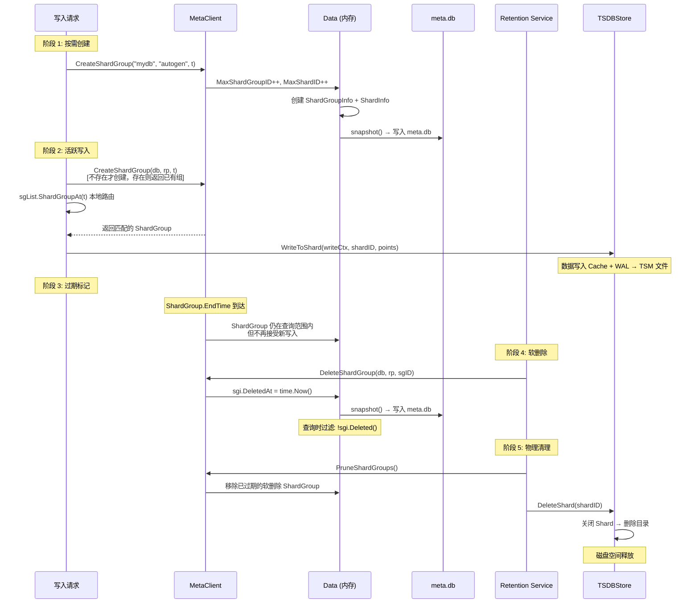

**ShardGroup 时间边界计算** (`data.go:358`):

```go
startTime := timestamp.Truncate(rpi.ShardGroupDuration).UTC()
endTime := startTime.Add(rpi.ShardGroupDuration).UTC()
```

**ShardGroupDuration 自适应** (`data.go:1266`):

| RP Duration | ShardGroup Duration | 设计意图 |
|-------------|---------------------|----------|
| >= 6 个月 (或 0) | 7 天 | 长期数据，减少 ShardGroup 数量 |
| >= 2 天 | 1 天 | 中期数据，平衡粒度 |
| < 2 天 | 1 小时 | 短期数据，细粒度过期管理 |

**PartialWriteError 传播案例**:

> **具体案例**: 写入一批数据，其中一个 field 类型冲突
>
> ```
> 输入: [
>   cpu,host=web value=3.14 1000,      // value 是 Float
>   cpu,host=web value=42 1001,        // value 是 Float (OK)
>   cpu,host=web status="running" 1002 // status 是 String (新 field)
> ]
>
> 步骤 1: validateSeriesAndFields
>   - value=3.14: Float, 已存在类型 Float → 匹配 ✓
>   - value=42: Float, 已存在类型 Float → 匹配 ✓
>   - status="running": 不存在 → 新建 String field ✓
>
> 步骤 2: 假设 value 字段之前被写为 Integer
>   - value=3.14: Float, 已存在类型 Integer → 冲突!
>   - 产生 PartialWriteError: "field type conflict: input field 'value'
>     on measurement 'cpu' is type float, already exists as type integer"
>
> 步骤 3: 传播路径
>   Shard.validateSeriesAndFields() → 返回 PartialWriteError
>   Shard.WritePoints() → 返回但继续写入有效点 (status)
>   Store.WriteToShard() → 透传
>   PointsWriter.writeToShard() → 透传
>   HTTP Handler.serveWrite() → 检查错误类型
>
> 步骤 4: HTTP 响应
>   if partial, ok := err.(tsdb.PartialWriteError); ok {
>       // 部分成功: 返回 400 Bad Request
>       // 已写入的点被持久化, 被丢弃的点信息在错误消息中
>   }
> ```

## 3. Shard 层详细实现

### 3.1 Shard 结构体

```go
// tsdb/shard.go:129 — Shard
type Shard struct {
    mu      sync.RWMutex
    id      uint64
    path    string         // {store_path}/{db}/{rp}/{shardID}
    walPath string         // WAL 目录
    database        string
    retentionPolicy string
    sfile   *SeriesFile   // Series 文件 (共享)
    options EngineOptions
    _engine Engine         // TSM1 引擎
    index   Index          // 索引 (TSI/inmem)
    enabled bool
    stats       *ShardStatistics
    defaultTags models.StatisticTags
    EnableOnOpen bool
    CompactionDisabled bool
}
```

### 3.2 Store.CreateShard — Shard 创建

```go
// tsdb/store.go:601 — CreateShard
func (s *Store) CreateShard(database, retentionPolicy string, shardID uint64, enabled bool) error {
    // 1. 检查是否已存在
    if _, ok := s.shards[shardID]; ok {
        return nil  // 幂等: shardID 已存在即返回, 不检查 db/rp
    }

    // 2. 检查是否正在删除
    if _, ok := s.pendingShardDeletes[shardID]; ok {
        return ErrShardDeletion
    }

    // 3. 创建目录结构
    if err := os.MkdirAll(filepath.Join(s.path, database, retentionPolicy), 0700); err != nil {
        return err
    }

    // 4. WAL 目录 (使用 WALDir 不是 WALPath)
    walPath := filepath.Join(s.EngineOptions.Config.WALDir, database, retentionPolicy, fmt.Sprintf("%d", shardID))
    if err := os.MkdirAll(walPath, 0700); err != nil {
        return err
    }

    // 5. 获取或创建 SeriesFile
    sfile, err := s.seriesFile(database)

    // 6. 获取或创建 Index
    idx, err := s.createIndex(database, sfile)

    // 7. 创建 Shard 对象 (5 个参数, index 通过 opt.InmemIndex 传入)
    opt := s.EngineOptions
    opt.InmemIndex = idx
    sh := NewShard(shardID, path, walPath, sfile, opt)
    sh.EnableOnOpen = enabled

    // 8. 打开 Shard
    if err := sh.Open(); err != nil {
        return err
    }

    // 9. 注册
    s.shards[shardID] = sh
    s.epochs[shardID] = newEpochTracker()

    return nil
}
```

## 4. Consistency Level — 一致性级别

### 4.1 定义

```go
// models/consistency.go:14 — ConsistencyLevel
type ConsistencyLevel int

const (
    ConsistencyLevelAny     ConsistencyLevel = iota  // 0: 允许 hinted handoff
    ConsistencyLevelOne                               // 1: 至少 1 个节点确认
    ConsistencyLevelQuorum                            // 2: 多数节点确认
    ConsistencyLevelAll                               // 3: 所有节点确认
)

var ErrInvalidConsistencyLevel = errors.New("invalid consistency level")

func ParseConsistencyLevel(level string) (ConsistencyLevel, error) {
    switch strings.ToLower(level) {
    case "any":
        return ConsistencyLevelAny, nil
    case "one":
        return ConsistencyLevelOne, nil
    case "quorum":
        return ConsistencyLevelQuorum, nil
    case "all":
        return ConsistencyLevelAll, nil
    default:
        return 0, ErrInvalidConsistencyLevel
    }
}
```

### 4.2 OSS vs Enterprise

| 特性 | OSS 版本 | Enterprise 版本 |
|------|---------|----------------|
| ConsistencyLevel 参数 | 接受但忽略 | 实际执行 |
| Shard 数量 | 每个 ShardGroup 1 个 | 可配置多个 |
| ReplicaN | 固定为 1 | 可配置 |
| ShardOwner.Owners | 空 | 包含多个节点 |
| Hinted Handoff | 无 | 有 |
| 节点间 RPC | 无 | 有 |

**关键发现**: `WritePointsPrivileged` 接收 `consistencyLevel` 参数但**完全不使用它**。在 OSS 版本中，所有写入都是"本地写入即成功"。

## 5. 架构设计意图

### 5.1 为什么用 Hash 路由而非 Range 路由

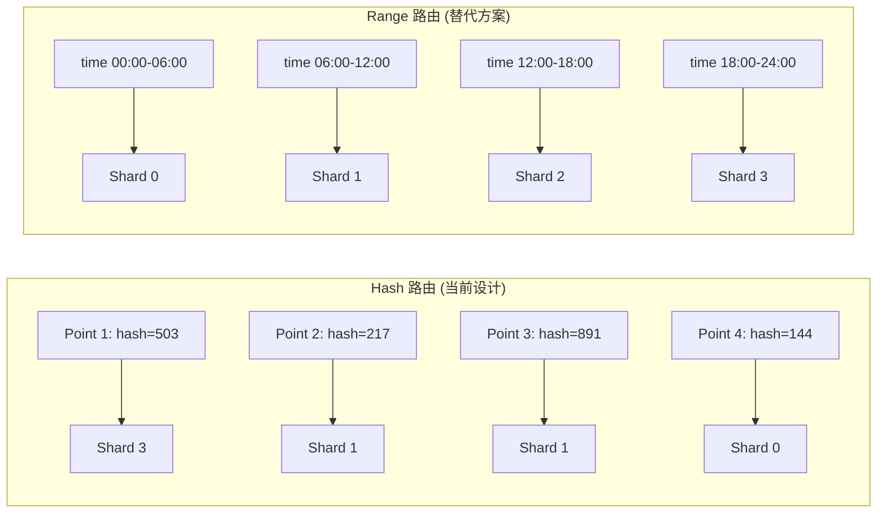

| 维度 | Hash 路由 | Range 路由 |
|------|----------|-----------|
| 数据均匀性 | 高 (hash 均匀分布) | 低 (时间倾斜) |
| 写入热点 | 无 | 时间边界热点 |
| 查询效率 | 全 shard 扫描 | 时间裁剪 |
| 范围查询 | 需合并所有 shard | 单 shard 命中 |

InfluxDB 选择 Hash 路由是因为时序数据写入模式是**时间连续**的，Range 路由会导致单个 shard 成为写入热点。

### 5.2 为什么用 ShardGroup + Shard 两级结构

```
RetentionPolicy (保留策略: 7d, 30d, ...)
  └── ShardGroup (时间窗口: 1h / 1d / 7d)
        └── Shard (数据分区: hash 路由)
```

- **时间局部性**: 同一时间窗口的数据在同一个 ShardGroup 中
- **生命周期管理**: ShardGroup 过期后整体删除（标记 DeletedAt），无需逐 shard 清理
- **查询优化**: 时间范围查询只需扫描覆盖的 ShardGroup，使用二分查找 O(log N)
- **并发写入**: 不同 series 可以并行写入不同 shard

### 5.3 为什么用 Write-Through 创建 Shard

```go
// 先尝试写入
err := w.TSDBStore.WriteToShard(writeCtx, shardID, points)
if err == tsdb.ErrShardNotFound {
    // 不存在才创建
    w.TSDBStore.CreateShard(database, retentionPolicy, shardID, true)
    err = w.TSDBStore.WriteToShard(writeCtx, shardID, points)
}
```

- **延迟创建**: 避免预创建所有可能的 shard（时间无限增长）
- **Write-Through**: 写入时发现不存在才创建，减少元数据开销
- **幂等性**: `CreateShard` 是幂等操作，重复创建不会报错
- **重试安全**: 创建后立即重试写入，保证不丢失数据

### 5.4 为什么 Subscriber 写队列用非阻塞发送

```go
func (c *chanWriter) Write(wr WriteRequest) {
    sz := wr.SizeOf()
    newSize := atomic.AddInt64(&c.queueSize, int64(sz))
    limit := atomic.LoadInt64(&c.queueLimit)
    if limit > 0 && newSize > limit {
        atomic.AddInt64(c.failures, 1)
        atomic.AddInt64(&c.queueSize, -int64(sz))
        return
    }

    select {
    case c.writeRequests <- wr:
    default:
        atomic.AddInt64(c.failures, 1)
    }
}
```

- **写入优先**: Subscriber 是辅助功能，具体 destination 的队列不能阻塞主写入路径
- **背压显式化**: subscriber 的 `writeFailures` 统计暴露队列满或超出内存限制
- **at-most-once**: 保证主写入路径的延迟不受 subscriber 影响

### 5.5 为什么用 Epoch Tracker 而非简单的锁

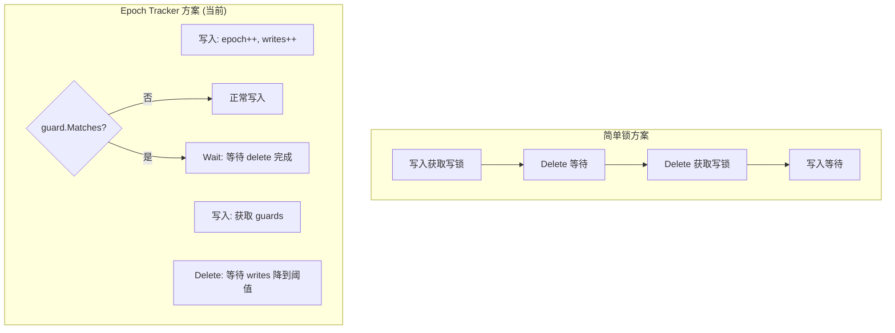

- **细粒度**: Guard 按 measurement + timeRange 匹配，只有重叠的写入才阻塞
- **非重叠写入不受影响**: 不同 measurement 的写入可以并发进行
- **无死锁风险**: Epoch 单调递增，不存在循环等待

## 6. 架构收益

| 维度 | 收益 |
|------|------|
| **写入吞吐** | goroutine per shard 并发写入 + Hash 路由均匀分布 |
| **查询性能** | ShardGroup 时间分区 + 二分查找 O(log N) |
| **存储管理** | ShardGroup 整体过期删除，生命周期管理简单 |
| **可靠性** | Epoch Tracker 防止写入/删除竞态 |
| **可扩展性** | 接口化设计 (MetaClient, TSDBStore)，支持测试和替换 |
| **数据安全** | PartialWriteError 允许部分成功，不因少量坏点丢失整批 |
| **可观测性** | 原子统计计数器，非阻塞 subscriber 丢弃计数 |
| **灵活性** | Subscriber 支持 ALL/ANY 模式，HTTP/UDP 传输 |

## 7. 潜在隐患与瓶颈

### 7.1 OSS 版本一致性级别无效

```go
// coordinator/points_writer.go:474
func (w *PointsWriter) WritePointsPrivileged(
    writeCtx tsdb.WriteContext,
    database, retentionPolicy string,
    consistencyLevel models.ConsistencyLevel,  // 接收但不使用
    points []models.Point,
) error {
    // 直接写入本地 shard，无仲裁
}
```

- API 接受 `consistency=quorum` 或 `consistency=all` 参数
- OSS 版本完全忽略，用户可能误以为数据已按指定级别写入
- 文档中的 `ConsistencyLevelAny` 注释提到 "hinted handoff"，但实际上不存在

### 7.2 无 Hinted Handoff

OSS 版本没有 Hinted Handoff 实现：
- 节点故障时写入直接失败，无重试队列
- 恢复后没有机制补写错过的数据
- `services/hh/` 目录不存在

### 7.3 写入超时的粗粒度控制

```go
// 所有 shard 共享同一个 WriteTimeout (10s)
timer := time.NewTimer(w.WriteTimeout)
for i := 0; i < len(shardMapping.Points); i++ {
    select {
    case <-timer.C:
        return ErrTimeout
    case err := <-ch:
        ...
    }
}
```

- 所有 shard 写入共享同一个 10s 超时
- 无法为单个 shard 设置不同的超时
- 慢 shard 会拖累整个写入操作

### 7.4 Subscriber 非阻塞发送的数据丢失

```go
select {
case c.writeRequests <- wr:
default:
    // chanWriter 队列满，拒绝转发
    atomic.AddInt64(c.failures, 1)
}
```

- Subscriber 具体 writer 队列满或超出 `memoryLimit` 时会拒绝转发
- 只有 `writeFailures` 计数和日志，没有重试机制
- 对于需要可靠转发的场景（如 Kafka），这是一个问题

### 7.5 UDP Subscriber 每次创建新连接

```go
// services/subscriber/udp.go:23
func (u *UDP) WritePointsContext(_ context.Context, request WriteRequest) (destination string, err error) {
    conn, err := net.DialUDP("udp", nil, u.addr)  // 每次新建!
    defer conn.Close()
    ...
}
```

- 高频写入场景下，大量 UDP socket 创建/销毁
- 可能耗尽文件描述符
- 应使用连接池或长连接

### 7.6 ShardGroup 创建的竞态

```go
// MapShards 中的检查-创建模式
sg := sgList.ShardGroupAt(p.Time())
if sg == nil {
    w.MetaClient.CreateShardGroup(database, retentionPolicy, p.Time())
    sg = sgList.ShardGroupAt(p.Time())
}
```

- 多个并发写入可能同时发现 ShardGroup 不存在
- `CreateShardGroup` 内部有锁保护，但可能导致短暂阻塞
- 创建后需要重新查询 sgList，增加延迟
- **缓解**: MetaClient 预创建未来 ShardGroup

### 7.7 MapShards 每次分配新 map

```go
mapping := &ShardMapping{
    Points: make(map[uint64][]models.Point),
    Shards: make(map[uint64]*meta.ShardInfo),
}
```

- 高频写入场景下，每次 MapShards 都分配新的 map 和 slice
- map 的扩容和 GC 压力不可忽视
- **优化建议**: 使用 sync.Pool 复用 ShardMapping

### 7.8 ShardOwner 查询的线性扫描

```go
// services/meta/client.go — ShardOwner
func (c *Client) ShardOwner(shardID uint64) (database, policy string, sgi *ShardGroupInfo) {
    c.mu.RLock()        // 读锁保护
    defer c.mu.RUnlock()

    // 四层嵌套遍历: Database -> RP -> ShardGroup -> Shard
    for _, dbi := range c.cacheData.Databases {
        for _, rpi := range dbi.RetentionPolicies {
            for _, g := range rpi.ShardGroups {
                if g.Deleted() {
                    continue
                }
                for _, sh := range g.Shards {
                    if sh.ID == shardID {
                        return dbi.Name, rpi.Name, &g
                    }
                }
            }
        }
    }
    return "", "", nil
}
```

- O(D x R x G x S) 复杂度
- 数据库/RP/ShardGroup 数量多时查询变慢
- **优化建议**: 维护 shardID -> (db, rp, sg) 的反向索引

### 7.9 全局 WriteTimeout 与 Context 超时冲突

```go
// PointsWriter 内部设置 WriteTimeout
timer := time.NewTimer(w.WriteTimeout)
```

- 当前 OSS 主链路没有请求 `context.Context` 贯穿写入路径，写入等待主要由 `PointsWriter.WriteTimeout` 控制。
- 所有 shard 写入共享同一个 10s 超时。
- 超时时返回 `ErrTimeout`，并递增 `WriteTimeout` 统计。

### 7.10 ShardGroup DeletedAt 标记与实际删除的延迟

```go
// ShardGroup 标记删除后，Shard 数据仍存在
// 需要后台任务（Module 4 的 precreator + retention）实际清理
```

- `DeletedAt` 只是元数据标记，磁盘空间不会立即释放
- 删除与实际清理之间有延迟窗口
- 查询时需要过滤已删除的 ShardGroup

## 8. MeasurementFieldSet — Field 类型管理

### 8.1 结构体

```go
// tsdb/shard.go:1685 — MeasurementFieldSet
type MeasurementFieldSet struct {
    mu              sync.RWMutex
    fields          map[string]*MeasurementFields  // measurement → fields
    path            string                          // 磁盘路径
    memoryVersion   uint64                          // 内存版本号
    writtenVersion  uint64                          // 已写入磁盘的版本号
}
```

### 8.2 MeasurementFields

```go
// tsdb/shard.go:1557 — MeasurementFields
type MeasurementFields struct {
    mu     sync.Mutex
    fields atomic.Value // map[string]*Field
}
```

### 8.3 Field

```go
// tsdb/shard.go:1937 — Field
type Field struct {
    ID   uint8             `json:"id,omitempty"`
    Name string            `json:"name,omitempty"`
    Type influxql.DataType `json:"type,omitempty"`  // Float, Integer, Unsigned, String, Boolean
}
```

### 8.4 createFieldsAndMeasurements — 创建新 Field

```go
// tsdb/shard.go:744 — createFieldsAndMeasurements
func (s *Shard) createFieldsAndMeasurements(fieldsToCreate []*FieldCreate) error {
    if len(fieldsToCreate) == 0 {
        return nil
    }

    engine, err := s.engineNoLock()
    if err != nil {
        return err
    }

    // 1. 遍历需要创建的 fields
    for _, f := range fieldsToCreate {
        // 2. 获取 measurement 的 field 集合
        mf := engine.MeasurementFields(f.Measurement)

        // 3. 创建 field (如果不存在)
        if err := mf.CreateFieldIfNotExists([]byte(f.Field.Name), f.Field.Type); err != nil {
            return err
        }

        // 4. 更新索引中的 field 名称
        s.index.SetFieldName(f.Measurement, f.Field.Name)
    }

    // 5. 持久化到磁盘
    return engine.MeasurementFieldSet().Save()
}
```

### 8.5 Field 类型冲突检测

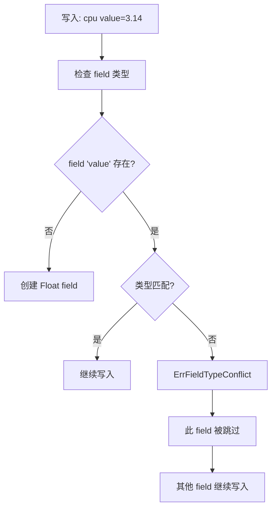

**关键行为**: Field 类型冲突不会阻止整个 Point 的写入，只跳过冲突的 field。其他 field 正常写入。

## 9. CreateSeriesListIfNotExists — 完整调用链

### 9.1 调用链

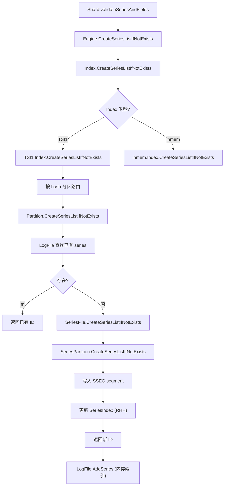

### 9.2 SeriesFile — 8 分区

```go
// tsdb/series_file.go:32 — SeriesFilePartitionN
const SeriesFilePartitionN = 8

// tsdb/series_file.go:178 — CreateSeriesListIfNotExists
func (f *SeriesFile) CreateSeriesListIfNotExists(names [][]byte, tagsSlice []models.Tags) ([]uint64, error) {
    // 1. 构建 key
    keys := make([][]byte, len(names))
    for i := range names {
        keys[i] = models.MakeKey(names[i], tagsSlice[i])
    }

    // 2. 按分区分组
    for i, key := range keys {
        partitionID := int(xxhash.Sum64(key) % SeriesFilePartitionN)
        // ...
    }

    // 3. 每个分区独立处理
    for _, p := range f.partitions {
        p.CreateSeriesListIfNotExists(keys, keyPartitionIDs, ids)
    }

    return ids, nil
}
```

### 9.3 SeriesPartition — SSEG + RHH

```go
// tsdb/series_partition.go:199 — CreateSeriesListIfNotExists
func (p *SeriesPartition) CreateSeriesListIfNotExists(keys [][]byte, keyPartitionIDs []int, ids []uint64) error {
    p.mu.Lock()
    defer p.mu.Unlock()

    for i, key := range keys {
        if keyPartitionIDs[i] != p.id {
            continue
        }

        // 1. 在索引中查找
        id := p.index.FindIDBySeriesKey(key)
        if id != 0 {
            ids[i] = id
            continue
        }

        // 2. 分配新 ID
        id = p.seq
        p.seq++

        // 3. 写入 SSEG segment
        offset, err := p.log.AppendSeries(id, key)

        // 4. 更新内存索引 (RHH)
        p.index.InsertSeries(id, offset, key)

        ids[i] = id
    }
}
```

**Series ID 分配规则**: 分区 0 获得 1, 9, 17, ...; 分区 1 获得 2, 10, 18, ...

```go
// tsdb/series_partition.go:62 — seq 初始化
p.seq = uint64(p.id + 1)  // 分区 0 → seq=1, 分区 1 → seq=2, ...
```

### 9.4 SSEG Entry 格式

```go
// tsdb/series_segment.go:25-31 — SSEG 格式常量
const (
	SeriesEntryFlagSize   = 1
	SeriesEntryHeaderSize = 1 + 8 // flag + id

	SeriesEntryInsertFlag    = 0x01
	SeriesEntryTombstoneFlag = 0x02
)
```

```
┌──────┬────────┬─────────────────────────────────────┐
│ Flag │  ID    │   Key (仅 Insert entry 有此字段)     │
│1 byte│8 bytes │ N bytes (uvarint 长度前缀)           │
└──────┴────────┴─────────────────────────────────────┘
```

- **Flag**: `0x01` = Insert, `0x02` = Tombstone, `0x00` = End-of-entries
- **ID**: Series ID (uint64, BigEndian)
- **Key**: Series key，使用 uvarint 长度前缀编码（非换行符终止）

**Key 编码格式** (`series_file.go:313-366 AppendSeriesKey`):

```
┌──────────────┬───────────┬─────────┬───────────┬──────────────────┐
│ Total Size   │ Name Len  │  Name   │  Tag Count│ Tags (重复)      │
│ uvarint      │ uint16    │ N bytes │  uvarint  │ keyLen+key+valLen+val │
└──────────────┴───────────┴─────────┴───────────┴──────────────────┘
```

**ReadSeriesEntry** (`series_segment.go:415-428`):
- Flag `0x00` 被视为 end-of-entries（返回 sz=1）
- `IsValidSeriesEntryFlag` 仅接受 `0x01` 和 `0x02`
- 只有 `SeriesEntryInsertFlag` (0x01) 的 entry 携带 key；Tombstone entry (0x02) 的 key 为 nil
