# Module 7: State Machine (Clone-Modify-Commit + 快照持久化 + 变更通知) - 深度审计报告

> **小白导读**: Meta Store 就像 InfluxDB 的**户口管理系统**。
>
> 它记录了所有"户口信息"：
> - 有哪些数据库？（Database）
> - 每个数据库有哪些保留策略？（RetentionPolicy：数据保留多久？）
> - 数据存在哪些 ShardGroup 和 Shard 里？
> - 有哪些用户？权限是什么？
> - 有哪些连续查询（CQ）和订阅（Subscription）？
>
> 每次修改户口信息（如创建数据库），都要：
> 1. **Clone**: 先复印一份当前户口本（深拷贝）
> 2. **Modify**: 在复印件上修改（不影响正在查看原件的人）
> 3. **Commit**: 把复印件写入磁盘，然后替换原件（原子操作）
>
> 这就是 **Copy-on-Write** 模式——写操作在副本上修改，读操作仍通过 `RLock` 保护 `cacheData` 指针，但拿到的是一次提交后的稳定快照。

## 1. 关键发现

**此代码库是 InfluxDB OSS 单节点版本，没有 Raft 实现。** Meta Store 使用简单的**文件持久化 + 内存缓存**模型。Protobuf 中定义的 30 种 Command Type 是 Enterprise 共享代码的遗留，在 OSS 中不用于日志复制。

| 维度 | Enterprise 版本 | 此 OSS 版本 |
|------|----------------|-------------|
| 共识协议 | Raft (hashicorp/raft) | 无 — 单节点 |
| 日志条目 | 独立的 protobuf Command | 不适用 |
| 持久化 | Raft log + snapshots | 单个 `meta.db` 文件（全量 protobuf 快照） |
| 复制 | 多节点 Raft 复制 | 无 |
| Leader 选举 | Raft Leader | 不适用 — 单进程 |
| 变更路径 | 编码 Command → Raft propose → Apply | Clone Data → Mutate → Snapshot → Swap pointer |
| 变更通知 | Raft apply callback | Channel close 广播 |
| `Data.Term` | Raft term（活跃使用） | 遗留（始终为 0） |
| `Data.Index` | Raft log index | 单调递增计数器（每次 commit +1） |

## 2. 核心结构体

### 2.1 Data — 全局元数据状态

```go
// services/meta/data.go:43 — Data
type Data struct {
    Term      uint64         // Raft Term (OSS 中始终为 0，遗留字段)
    Index     uint64         // 单调递增版本号 (每次 commit +1)
    ClusterID uint64         // 集群 ID (OSS 中首次 Open 时随机生成)

    Databases []DatabaseInfo // 所有数据库元数据
    Users     []UserInfo     // 所有用户元数据

    // 内部计算字段 (非序列化)
    // adminUserExists 提供一个常数时间机制来判断是否存在至少一个 admin 用户
    // 避免每次检查都遍历 Users 列表 (O(n) → O(1))
    adminUserExists bool

    MaxShardGroupID uint64   // ShardGroup ID 分配器 (单调递增)
    MaxShardID      uint64   // Shard ID 分配器 (单调递增)
}
```

**Data 是整个集群元数据的单点真相。** 所有数据库、保留策略、ShardGroup、Shard、用户、权限信息都在这一个结构体中。

### 2.2 Client — 元数据子系统

```go
// services/meta/client.go:49 — Client
type Client struct {
    logger *zap.Logger

    mu        sync.RWMutex   // 保护 cacheData 和 changed
    closing   chan struct{}   // 关闭信号
    changed   chan struct{}   // 变更通知 channel (close = 广播)
    cacheData *Data           // 内存中的元数据快照

    authCache map[string]authUser  // 认证缓存 (salted SHA-256)

    path string               // meta.db 所在目录

    retentionAutoCreate bool  // 是否自动创建默认 RP
}
```

**关键理解**: 在 OSS 中，`Client` 不是远程服务的 RPC 客户端。它是**整个元数据子系统**——直接读写本地 `meta.db` 文件，管理内存缓存，提供变更通知。没有独立的 `store.go` 或 `service.go`。

### 2.3 数据层次结构

```
Data (meta.db)
├── Term: uint64 (遗留，始终 0)
├── Index: uint64 (单调递增版本号)
├── ClusterID: uint64
├── MaxShardGroupID: uint64
├── MaxShardID: uint64
├── Databases []DatabaseInfo
│   ├── Name: string
│   ├── DefaultRetentionPolicy: string
│   ├── RetentionPolicies []RetentionPolicyInfo
│   │   ├── Name: string
│   │   ├── ReplicaN: int32 (OSS 固定 1)
│   │   ├── Duration: time.Duration
│   │   ├── ShardGroupDuration: time.Duration
│   │   ├── ShardGroups []ShardGroupInfo
│   │   │   ├── ID: uint64
│   │   │   ├── StartTime: time.Time
│   │   │   ├── EndTime: time.Time
│   │   │   ├── DeletedAt: time.Time (软删除)
│   │   │   ├── Shards []ShardInfo
│   │   │   │   ├── ID: uint64
│   │   │   │   └── Owners []ShardOwner (OSS 为空)
│   │   │   │       └── NodeID: uint64
│   │   │   └── TruncatedAt: time.Time
│   │   └── Subscriptions []SubscriptionInfo
│   │       ├── Name: string
│   │       ├── Mode: string ("ALL" / "ANY")
│   │       └── Destinations []string
│   └── ContinuousQueries []ContinuousQueryInfo
│       ├── Name: string
│       └── Query: string
└── Users []UserInfo
    ├── Name: string
    ├── Hash: string (bcrypt)
    ├── Admin: bool
    └── Privileges map[string]int32
```

## 3. 状态机全链路总览

### 3.1 从元数据变更到持久化的完整路径

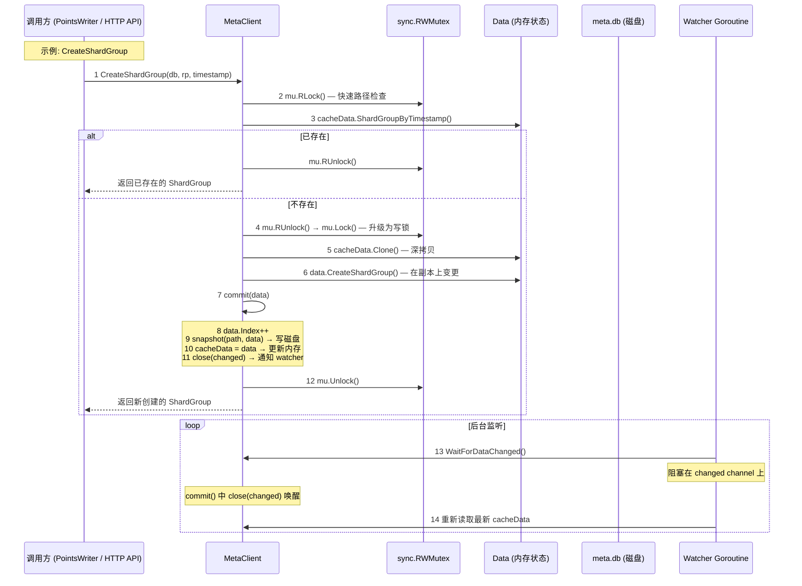

### 3.2 每一步的代码实现

#### 步骤 1-7: CreateDatabase — 完整的 Clone-Modify-Commit 示例

```go
// services/meta/client.go:171 — CreateDatabase
func (c *Client) CreateDatabase(name string) (*DatabaseInfo, error) {
    // 步骤 1: 获取写锁
    c.mu.Lock()
    defer c.mu.Unlock()

    // 步骤 2: 深拷贝当前状态
    data := c.cacheData.Clone()

    // 步骤 3: 幂等检查 — 已存在则直接返回
    if db := data.Database(name); db != nil {
        return db, nil
    }

    // 步骤 4: 在副本上执行变更
    if err := data.CreateDatabase(name); err != nil {
        return nil, err
    }

    // 步骤 5: 自动创建默认 RP (如果配置启用)
    if c.retentionAutoCreate {
        rpi := DefaultRetentionPolicyInfo()
        if err := data.CreateRetentionPolicy(name, rpi, true); err != nil {
            return nil, err
        }
    }

    // 步骤 6: 获取创建后的 DB 引用
    db := data.Database(name)

    // 步骤 7: 提交 (写磁盘 + 更新内存 + 通知)
    if err := c.commit(data); err != nil {
        return nil, err
    }

    return db, nil
}
```

**所有元数据变更操作遵循同一模式**:

> **具体案例**: 创建数据库 `mydb` 的完整过程
>
> ```
> 用户执行: CREATE DATABASE mydb
>
> 1. 获取写锁 (mu.Lock)
> 2. 深拷贝当前 Data:
>    - 旧 Data: {Databases: [db1, db2], Users: [admin]}
>    - 新 Data: {Databases: [db1, db2], Users: [admin]} (独立副本)
>
> 3. 在副本上创建数据库:
>    - 新 Data: {Databases: [db1, db2, mydb], Users: [admin]}
>
> 4. 自动创建默认 RP (autogen, 保留 7 天):
>    - 新 Data: {Databases: [db1, db2, {Name: mydb, RPs: [autogen]}], Users: [admin]}
>
> 5. 提交:
>    a. data.Index++ (版本号从 42 变为 43)
>    b. 写入磁盘: meta.dbtmp → fsync → rename → meta.db
>    c. 更新内存: c.cacheData = data (指针交换)
>    d. 通知: close(changed) → 所有 watcher 被唤醒
>
> 6. 释放写锁 (mu.Unlock)
>
> 此时:
> - 正在读取的 goroutine 看到的还是旧 Data (Index=42)
> - 新的读取请求看到新 Data (Index=43)
> - Subscriber Service 被唤醒，更新 subscription 列表
> ```

| 方法 | 行号 | 操作 | 幂等性 |
|------|------|------|--------|
| `CreateDatabase` | 171 | 添加 DatabaseInfo | 已存在返回已有 DatabaseInfo |
| `DropDatabase` | 270 | 移除 DB + 清理用户权限 | 不存在返回 nil (无 error) |
| `CreateRetentionPolicy` | 288 | 添加 RP 到 DB | 已存在返回 nil |
| `DropRetentionPolicy` | 324 | 移除 RP | 不存在返回 nil (无 error) |
| `UpdateRetentionPolicy` | 342 | 更新 RP 字段 | 使用指针的零值判断 |
| `CreateShardGroup` | 708 | 创建 ShardGroup + Shard | 已存在返回 nil |
| `DeleteShardGroup` | 760 | 设置 DeletedAt (软删除) | 不存在返回 error |
| `DropShard` | 662 | 移除 Shard | Data 层 `DropShard(id)` 无返回值；找不到 shard 静默成功，最后一个 Shard 时标记组删除 |
| `CreateContinuousQuery` | 860 | 添加 CQ 到 DB | 查询相同时幂等 (忽略大小写)，不同查询返回 ErrContinuousQueryExists |
| `DropContinuousQuery` | 878 | 移除 CQ | 不存在返回 nil (无 error) |
| `CreateSubscription` | 896 | 添加 Subscription 到 RP | 已存在返回 ErrSubscriptionExists |
| `DropSubscription` | 914 | 移除 Subscription | 不存在返回 error |
| `CreateUser` | 409 | 添加 UserInfo | 同名且密码/admin 相同才返回已有用户；同名但密码或 admin 不同返回 `ErrUserExists` |
| `DropUser` | 465 | 移除 User + 更新 adminUserExists | 不存在返回 error |
| `UpdateUser` | 443 | 更新密码 hash | 不存在返回 error |
| `SetPrivilege` | 483 | 设置 per-DB 权限 | — |
| `SetAdminPrivilege` | 501 | 切换 admin 标志 | — |
| `TruncateShardGroups` | 672 | 设置 TruncatedAt | — |
| `PruneShardGroups` | 682 | 移除已过期的软删除 ShardGroup | 无变更时跳过 commit |
| `PrecreateShardGroups` | 781 | 预创建即将到期的 ShardGroup | 避免写入时创建延迟 |
| `CreateDatabaseWithRetentionPolicy` | 214 | 创建 DB + 指定 RP | RP 冲突返回 error |

**Client commit 语义注意**: 上表中的“Data 层不存在返回 nil”不等于 Client 层一定跳过提交。例如 `Client.DropRetentionPolicy` 和 `Client.DropContinuousQuery` 会先 `data := c.cacheData.Clone()`，调用对应 `data.Drop...()`；只要没有错误，随后仍会执行 `c.commit(data)`。因此即使目标 RP/CQ 不存在、Data 内容没有实际变化，`commit()` 仍会递增 `Data.Index`、写入 `meta.db` 并广播 `changed`。

#### DropShard 的 void 语义

```go
// services/meta/client.go:660 — Client.DropShard
func (c *Client) DropShard(id uint64) error {
    c.mu.Lock()
    defer c.mu.Unlock()

    data := c.cacheData.Clone()
    data.DropShard(id)      // Data 层没有 error 返回
    return c.commit(data)   // 只检查 snapshot/commit 错误
}

// services/meta/data.go:299 — Data.DropShard
func (data *Data) DropShard(id uint64) {
    // 遍历 DB/RP/ShardGroup/Shards；找不到 id 时直接返回
    // 找到后移除 shard；如果这是组内最后一个 shard，则设置 DeletedAt。
}
```

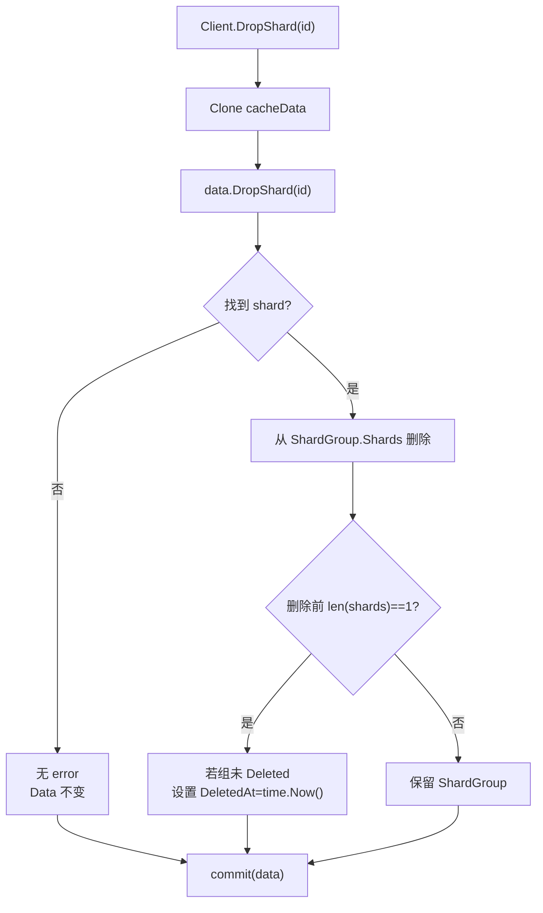

**案例**: 管理命令重试 `DropShard(42)` 时，如果第一次已成功写入 meta
但数据节点后续失败，第二次在 meta 中找不到 shard 42 也不会返回业务错误；
Client 层仍会 `commit(data)`，只可能因快照写盘失败返回错误。

#### DropRetentionPolicy 对不存在的 RP 仍会 commit 并递增 Index

`Client.DropRetentionPolicy` (client.go:322-337) 和 `Data.DropRetentionPolicy`
(data.go:182-199) 的组合有一个容易忽视的副作用: 当目标 RP **不存在**时，
Data 层返回 `nil` (不报错)，Client 层因此照常执行 `c.commit(data)`，
导致 `Data.Index++`、`meta.db` 全量快照写盘、`changed` channel 广播——
即使元数据内容没有任何实际变化。

```go
// services/meta/client.go:322 — DropRetentionPolicy
func (c *Client) DropRetentionPolicy(database, name string) error {
    c.mu.Lock()
    defer c.mu.Unlock()

    data := c.cacheData.Clone()

    // ↓ Data 层: RP 不存在时返回 nil (data.go:182-199)
    if err := data.DropRetentionPolicy(database, name); err != nil {
        return err
    }

    // ↓ 即使 data 内容没变 (RP 本来就不存在), 仍会 commit
    if err := c.commit(data); err != nil {
        return err
    }
    return nil
}

// services/meta/data.go:182 — Data.DropRetentionPolicy
func (data *Data) DropRetentionPolicy(database, name string) error {
    di := data.Database(database)
    if di == nil {
        // no database? no problem
        return nil   // ← 数据库不存在, 静默成功
    }
    for i := range di.RetentionPolicies {
        if di.RetentionPolicies[i].Name == name {
            di.RetentionPolicies = append(di.RetentionPolicies[:i], di.RetentionPolicies[i+1:]...)
            break
        }
    }
    return nil   // ← RP 不存在 (循环没匹配), 也静默成功
}
```

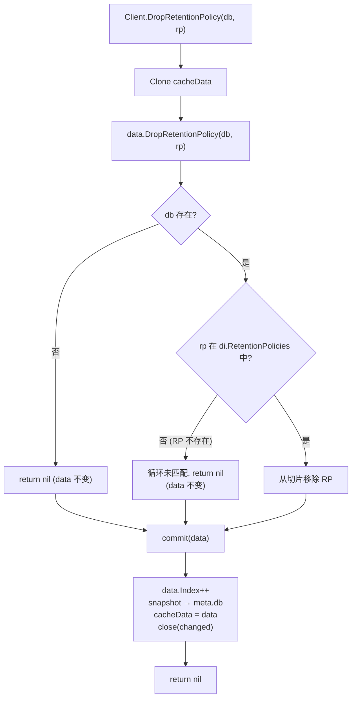

> **具体案例**: 对不存在的 RP 重复执行 DROP
>
> 假设当前 `Data.Index = 100`，数据库 `mydb` 只有 `autogen` 一个 RP。
>
> **第一次**: `DROP RETENTION POLICY "nonexistent" ON "mydb"`
> 1. `Clone()` 得到副本 (Index=100)。
> 2. `data.DropRetentionPolicy("mydb", "nonexistent")`: `di` 存在 (mydb)，
>    循环遍历 `RetentionPolicies = [autogen]`，`"autogen" != "nonexistent"`，
>    循环结束未匹配，`return nil`。**data 内容无变化**。
> 3. `c.commit(data)`: `data.Index` 从 100 → **101**，`snapshot` 写入 `meta.db`
>    (全量 protobuf 快照，即使内容没变)，`cacheData = data`，`close(changed)` 广播。
> 4. 返回 nil。客户端以为删除成功。
>
> **before/after 对比**:
>
> | 字段 | before | after |
> |------|--------|-------|
> | `Data.Index` | 100 | **101** (+1) |
> | `Data.Databases[mydb].RetentionPolicies` | `[autogen]` | `[autogen]` (无变化) |
> | `meta.db` 文件 | 旧快照 | **新快照** (内容相同但被重写) |
> | `changed` channel | 旧 channel | **新 channel** (广播一次) |
>
> **影响**:
> - **元数据版本号虚增**: 重复对不存在的 RP 调用 DROP，每次都会 `Index++`，
>   导致 `Data.Index` 与实际变更次数脱钩。依赖 `Index` 做增量同步的组件
>   (如 Enterprise 的 Raft 复制，OSS 中虽不使用但备份恢复可能参考) 会误以为有变更。
> - **磁盘 IO 浪费**: 每次 `commit` 都会 `snapshot` 全量写 `meta.db` (tmp + fsync + rename)，
>   即使内容没变。对 SSD 来说 fsync 是昂贵的同步操作。
> - **watcher 虚假唤醒**: `close(changed)` 会唤醒所有 `WaitForDataChanged` 等待者
>   (如 Subscriber Service)，它们重新读取 `cacheData` 发现内容没变，做无用功。
>
> **对比 `DropDatabase`**: `Data.DropDatabase` 在 db 不存在时也返回 nil，
> `Client.DropDatabase` (client.go:270) 同样会 `commit(data)`，有相同的副作用。
> 这是 Clone-Modify-Commit 模式的通病: `commit()` 不检查 Data 内容是否真的变化。

#### 步骤 2-3: 快速路径 — 读锁检查

```go
// services/meta/client.go:145 — Database (读操作示例)
func (c *Client) Database(name string) *DatabaseInfo {
    c.mu.RLock()
    defer c.mu.RUnlock()

    for _, d := range c.cacheData.Databases {
        if d.Name == name {
            return &d
        }
    }

    return nil
}

func (c *Client) RetentionPolicy(database, policy string) (*RetentionPolicyInfo, error) {
    c.mu.RLock()
    defer c.mu.RUnlock()
    dbi := c.cacheData.Database(database)
    if dbi == nil {
        return nil, influxdb.ErrDatabaseNotFound(database)
    }
    return dbi.RetentionPolicy(policy), nil
}
```

**RLock 的并发语义**:
- 多个读操作可以并发进行（不阻塞）
- 读操作和写操作互斥（写锁等待所有读锁释放）
- 读操作看到的是最近一次 `commit()` 后的 `cacheData` 指针

#### 步骤 4: 锁升级 — RUnlock → Lock (Double-Checked Locking)

```go
// services/meta/client.go:708 — CreateShardGroup 的双重检查模式
func (c *Client) CreateShardGroup(database, policy string, timestamp time.Time) (*ShardGroupInfo, error) {
    // 快速路径: 读锁检查
    c.mu.RLock()
    if sg, _ := c.cacheData.ShardGroupByTimestamp(database, policy, timestamp); sg != nil {
        c.mu.RUnlock()
        return sg, nil  // 已存在，直接返回
    }
    c.mu.RUnlock()

    // 慢速路径: 写锁
    c.mu.Lock()
    defer c.mu.Unlock()

    // 双重检查: 可能在等待写锁期间其他 goroutine 已创建
    data := c.cacheData.Clone()
    if sg, _ := data.ShardGroupByTimestamp(database, policy, timestamp); sg != nil {
        return sg, nil  // 已被其他 goroutine 创建
    }

    // 使用 createShardGroup 辅助函数 (client.go:738)
    sgi, err := createShardGroup(data, database, policy, timestamp)
    if err != nil {
        return nil, err
    }

    // 提交
    if err := c.commit(data); err != nil {
        return nil, err
    }

    return sgi, nil
}

// createShardGroup 辅助函数 (client.go:738)
// 先检查幂等性，再调用 data.CreateShardGroup，最后查找创建的 ShardGroup
func createShardGroup(data *Data, database, policy string, timestamp time.Time) (*ShardGroupInfo, error) {
    if sg, _ := data.ShardGroupByTimestamp(database, policy, timestamp); sg != nil {
        return nil, ErrShardGroupExists
    }
    if err := data.CreateShardGroup(database, policy, timestamp); err != nil {
        return nil, err
    }
    rpi, err := data.RetentionPolicy(database, policy)
    if err != nil {
        return nil, err
    }
    return rpi.ShardGroupByTimestamp(timestamp), nil
}
```

**为什么需要双重检查？** Go 的 `sync.RWMutex` 不支持锁升级（RLock → Lock）。必须先释放读锁再获取写锁，这中间存在窗口期，其他写操作可能已经完成了相同的创建。

> **小白解释**: 双重检查就像你去银行办业务：
> 1. 先在门口问一下（RLock）："我要办的业务已经办过了吗？"
> 2. 如果办过了，直接走人（快速返回）
> 3. 如果没办过，去取号排队（Lock）——但排队的时候可能别人已经帮你办了
> 4. 所以取号后还要再检查一次（双重检查）——如果已经办过了，就不用再办了
>
> 为什么要这么复杂？因为 Go 的 RLock 不能直接升级为 Lock，中间有个"窗口期"。

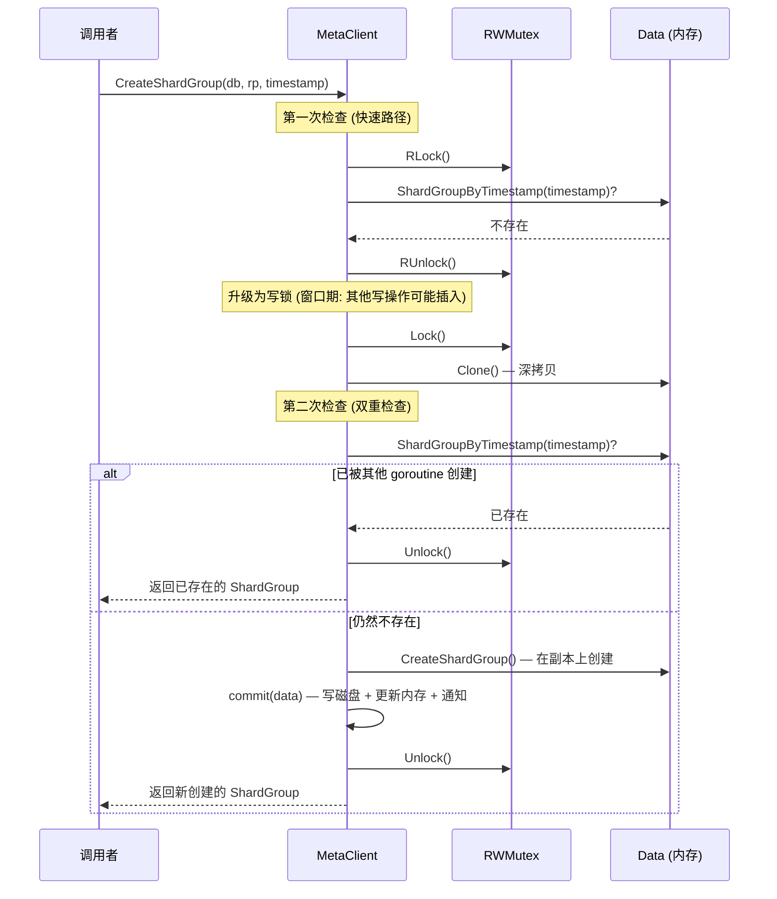

#### 步骤 5: 深拷贝 — Clone

```go
// services/meta/data.go:683 — Data.Clone (导出, 指针接收者)
func (data *Data) Clone() *Data {
    other := *data  // 浅拷贝 struct

    // 深拷贝 Databases (通过 CloneDatabases → 每个 db 调用 clone())
    other.Databases = data.CloneDatabases()

    // 深拷贝 Users (通过 CloneUsers → 每个 user 调用 clone(), 深拷贝 Privileges map)
    other.Users = data.CloneUsers()

    return &other
}

// services/meta/data.go:965 — DatabaseInfo.clone (非导出, 值接收者)
func (di DatabaseInfo) clone() DatabaseInfo {
    other := di

    // 深拷贝 RetentionPolicies
    if di.RetentionPolicies != nil {
        other.RetentionPolicies = make([]RetentionPolicyInfo, len(di.RetentionPolicies))
        for i := range di.RetentionPolicies {
            other.RetentionPolicies[i] = di.RetentionPolicies[i].clone()
        }
    }

    // ContinuousQueries: 值拷贝即可 (仅有 string 字段)
    if di.ContinuousQueries != nil {
        other.ContinuousQueries = make([]ContinuousQueryInfo, len(di.ContinuousQueries))
        for i := range di.ContinuousQueries {
            other.ContinuousQueries[i] = di.ContinuousQueries[i].clone()
        }
    }

    return other
}

// services/meta/data.go:1237 — RetentionPolicyInfo.clone (非导出, 值接收者)
func (rpi RetentionPolicyInfo) clone() RetentionPolicyInfo {
    other := rpi  // 值拷贝 (含 Subscriptions 浅拷贝)

    // 仅深拷贝 ShardGroups
    if rpi.ShardGroups != nil {
        other.ShardGroups = make([]ShardGroupInfo, len(rpi.ShardGroups))
        for i := range rpi.ShardGroups {
            other.ShardGroups[i] = rpi.ShardGroups[i].clone()
        }
    }

    // Subscriptions 通过值拷贝获得 (非深拷贝)
    return other
}
```

**深拷贝层级**:

```
Data.Clone()  [data.go:683, 导出, 指针接收者]
├── CloneDatabases() → DatabaseInfo.clone() × N  [data.go:965, 非导出, 值接收者]
│   ├── RetentionPolicyInfo.clone() × M  [data.go:1237, 非导出, 值接收者]
│   │   ├── ShardGroupInfo.clone() × K  [data.go:1352, 非导出, 值接收者]
│   │   │   └── ShardInfo.clone() (深拷贝 Owners)
│   │   └── SubscriptionInfo (浅拷贝 — 值拷贝 struct)
│   └── ContinuousQueryInfo.clone() [data.go:1560, 非导出, 值接收者, 仅有 string 字段]
└── CloneUsers() → UserInfo.clone() × N  [data.go:1635, 非导出, 值接收者]
    └── Privileges map (深拷贝)
```

**为什么需要深拷贝？** 写操作在副本上修改，不影响已经拿到旧版本 `cacheData` 的 goroutine。注意这不是“无锁读”：Client 的读方法仍会 `RLock()`，Copy-on-Write 的作用是让读锁内取到的快照在写方 commit/swap 之后仍然稳定。

#### 步骤 6: Data 上的变更方法

```go
// services/meta/data.go:82 — Data.CreateDatabase
func (data *Data) CreateDatabase(name string) error {
    // 幂等检查
    for i := range data.Databases {
        if data.Databases[i].Name == name {
            return nil  // 已存在
        }
    }

    data.Databases = append(data.Databases, DatabaseInfo{Name: name})
    return nil
}

// services/meta/data.go:358 — Data.CreateShardGroup
func (data *Data) CreateShardGroup(database, policy string, timestamp time.Time) error {
    // 1. 查找 RP
    rpi, err := data.RetentionPolicy(database, policy)
    if err != nil {
        return err
    }

    // 2. 幂等检查
    if rpi.ShardGroupByTimestamp(timestamp) != nil {
        return nil
    }

    // 3. 计算时间边界
    duration := rpi.ShardGroupDuration
    startTime := timestamp.Truncate(duration).UTC()
    endTime := startTime.Add(duration).UTC()
    if endTime.After(time.Unix(0, models.MaxNanoTime)) {
        // Shard group range is [start, end) so add one to the max time.
        endTime = time.Unix(0, models.MaxNanoTime+1)  // 注意: +1 且无 .UTC()
    }

    // 4. 分配 ID
    data.MaxShardGroupID++
    sgi := ShardGroupInfo{
        ID:        data.MaxShardGroupID,
        StartTime: startTime,
        EndTime:   endTime,
    }

    // 5. 创建 Shard (OSS: 每个 ShardGroup 只有 1 个)
    data.MaxShardID++
    sgi.Shards = []ShardInfo{
        {ID: data.MaxShardID},
    }

    // 6. 添加到 RP 并排序
    rpi.ShardGroups = append(rpi.ShardGroups, sgi)
    sort.Sort(ShardGroupInfos(rpi.ShardGroups))

    return nil
}
```

`CreateUser` 的幂等性比“已存在即成功”更窄。Client 层先在 clone 后的 `Data` 中查找同名用户；只有 bcrypt 校验当前密码成功且 `Admin` 标志完全相同时，才返回已有用户且不提交。只要密码不同或 admin 标志不同，就返回 `ErrUserExists`。

```go
// services/meta/client.go:407 — Client.CreateUser
func (c *Client) CreateUser(name, password string, admin bool) (User, error) {
    c.mu.Lock()
    defer c.mu.Unlock()

    data := c.cacheData.Clone()
    if u := data.user(name); u != nil {
        if err := bcrypt.CompareHashAndPassword([]byte(u.Hash), []byte(password)); err != nil || u.Admin != admin {
            return nil, ErrUserExists
        }
        return u, nil
    }

    hash, err := bcrypt.GenerateFromPassword([]byte(password), bcryptCost)
    if err != nil {
        return nil, err
    }
    if err := data.CreateUser(name, string(hash), admin); err != nil {
        return nil, err
    }
    u := data.user(name)
    if err := c.commit(data); err != nil {
        return nil, err
    }
    return u, nil
}
```

> **源码校准**: `bcryptCost` 是 `var` 而非 `const` (client.go:384-386)：
> ```go
> // bcryptCost is the cost associated with generating password with bcrypt.
> // This setting is lowered during testing to improve test suite performance.
> var bcryptCost = bcrypt.DefaultCost
> ```
> 因为是 `var`，测试中可以临时调低 bcrypt cost 以加速用例；生产路径仍使用
> `bcrypt.DefaultCost`。`CreateUser` 和 `UpdateUser` 都通过这个变量读取 cost。

#### 步骤 7-11: Commit 协议

```go
// services/meta/client.go:964 — commit
func (c *Client) commit(data *Data) error {
    // 步骤 8: 递增版本号
    data.Index++

    // 步骤 9: 先写磁盘 (WAL 语义)
    if err := snapshot(c.path, data); err != nil {
        return err
    }

    // 步骤 10: 再更新内存
    c.cacheData = data

    // 步骤 11: 通知 watcher
    close(c.changed)
    c.changed = make(chan struct{})

    return nil
}
```

**commit 的原子性保证**:
- `snapshot()` 成功后才更新内存 → 崩溃后从磁盘恢复的是完整数据
- `close(changed)` 在 `cacheData = data` 之后 → watcher 看到的是新数据
- 写锁保护整个 commit 过程 → 不会出现中间状态
- `commit()` 不检查 Data 内容是否真的变化；只要 Client 方法走到 `commit(data)`，就会 `data.Index++` 并写快照。这包括部分“目标不存在但 Data 层返回 nil”的删除类操作。

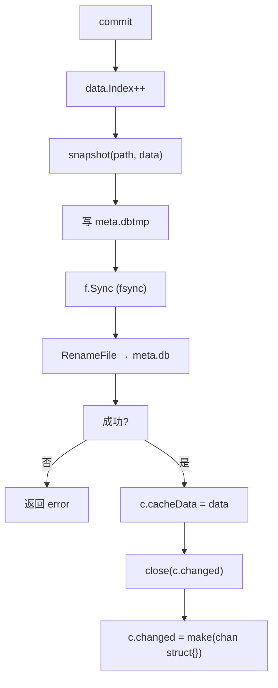

#### 步骤 9: 快照持久化 — tmp + fsync + Rename

```go
// services/meta/client.go:997 — snapshot
func snapshot(path string, data *Data) error {
    filename := filepath.Join(path, metaFile)  // "meta.db"
    tmpFile := filename + "tmp"                 // "meta.dbtmp"

    // 1. 创建临时文件
    f, err := os.Create(tmpFile)
    if err != nil {
        return err
    }
    defer f.Close()

    // 2. 序列化为 protobuf
    var d []byte
    if b, err := data.MarshalBinary(); err != nil {
        return err
    } else {
        d = b
    }

    // 3. 写入临时文件
    if _, err := f.Write(d); err != nil {
        return err
    }

    // 4. fsync: 确保数据落盘
    if err := f.Sync(); err != nil {
        return err
    }

    // 5. 关闭文件 (Windows 需要)
    if err := f.Close(); err != nil {
        return err
    }

    // 6. 原子 rename
    return file.RenameFile(tmpFile, filename)
}
```

**序列化 — MarshalBinary**:

```go
// services/meta/data.go:744 — MarshalBinary
func (data *Data) MarshalBinary() ([]byte, error) {
    return proto.Marshal(data.marshal())
}

// services/meta/data.go:693 — marshal
func (data *Data) marshal() *internal.Data {
    pb := &internal.Data{
        Term:            proto.Uint64(data.Term),
        Index:           proto.Uint64(data.Index),
        ClusterID:       proto.Uint64(data.ClusterID),
        MaxShardGroupID: proto.Uint64(data.MaxShardGroupID),
        MaxShardID:      proto.Uint64(data.MaxShardID),

        // 始终写 0 以保持反向兼容性 (proto 要求此字段)
        MaxNodeID: proto.Uint64(0),
    }

    // 序列化 Databases
    pb.Databases = make([]*internal.DatabaseInfo, len(data.Databases))
    for i := range data.Databases {
        pb.Databases[i] = data.Databases[i].marshal()
    }

    // 序列化 Users
    pb.Users = make([]*internal.UserInfo, len(data.Users))
    for i := range data.Users {
        pb.Users[i] = data.Users[i].marshal()
    }

    return pb
}

// services/meta/data.go:720 — unmarshal
func (data *Data) unmarshal(pb *internal.Data) {
    data.Term = pb.GetTerm()
    data.Index = pb.GetIndex()
    data.ClusterID = pb.GetClusterID()
    data.MaxShardGroupID = pb.GetMaxShardGroupID()
    data.MaxShardID = pb.GetMaxShardID()

    data.Databases = make([]DatabaseInfo, len(pb.GetDatabases()))
    for i, x := range pb.GetDatabases() {
        data.Databases[i].unmarshal(x)
    }

    data.Users = make([]UserInfo, len(pb.GetUsers()))
    for i, x := range pb.GetUsers() {
        data.Users[i].unmarshal(x)
    }

    // 重新计算 adminUserExists — 使用 hasAdminUser() 辅助方法
    data.adminUserExists = data.hasAdminUser()
}
```

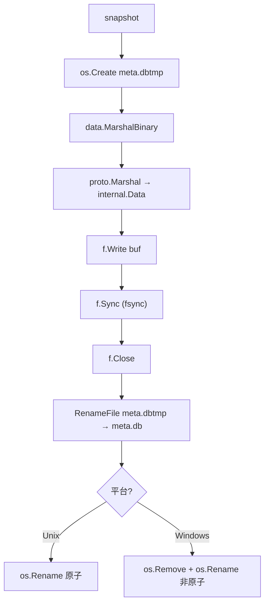

#### 步骤 11: 变更通知 — Channel Broadcast

```go
// services/meta/client.go:954 — WaitForDataChanged
func (c *Client) WaitForDataChanged() chan struct{} {
    c.mu.RLock()
    defer c.mu.RUnlock()
    return c.changed
}
```

**通知模式**:

```go
// commit 中:
close(c.changed)                 // 唤醒所有等待者
c.changed = make(chan struct{})  // 为下次变更创建新 channel

// 等待者:
ch := client.WaitForDataChanged()
<-ch  // 阻塞直到 commit() close 这个 channel
```

**为什么用 close + make 而非 send？**
- `close` 是广播: 唤醒**所有**阻塞在该 channel 上的 goroutine
- `send` 只能唤醒**一个** goroutine
- 无缓冲 channel 的 `close` 不会丢失通知
- 每次 `WaitForDataChanged()` 返回当前的 channel，确保新来的 goroutine 也能被通知

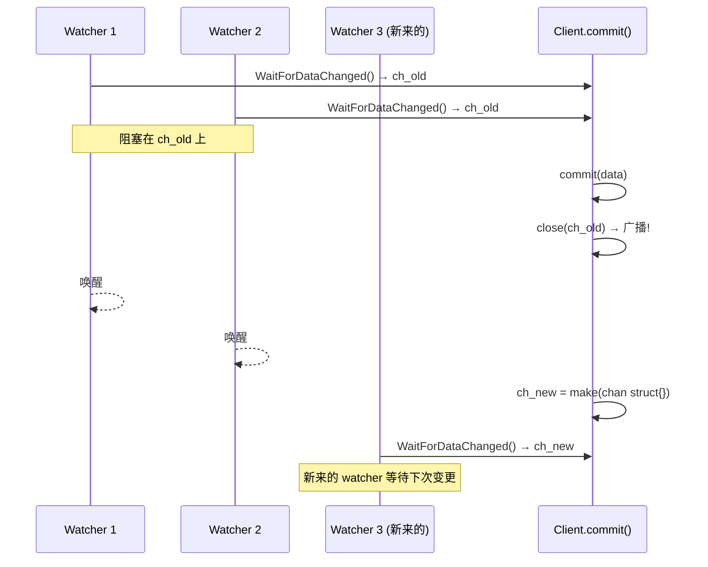

#### 步骤 13-14: 恢复机制

```go
// services/meta/client.go:88 — Open
func (c *Client) Open() error {
    c.mu.Lock()
    defer c.mu.Unlock()

    // 1. 从磁盘加载
    if err := c.Load(); err != nil {
        return err
    }

    // 2. 全新实例: 立即持久化
    if c.cacheData.Index == 1 {
        if err := snapshot(c.path, c.cacheData); err != nil {
            return err
        }
    }

    return nil
}

// services/meta/client.go:1031 — Load
func (c *Client) Load() error {
    file := filepath.Join(c.path, metaFile)  // "meta.db"
    f, err := os.Open(file)
    if err != nil {
        if os.IsNotExist(err) {
            return nil  // 全新实例，使用默认空 Data
        }
        return err
    }
    defer f.Close()

    data, err := io.ReadAll(f)
    if err != nil {
        return err
    }

    return c.cacheData.UnmarshalBinary(data)  // proto.Unmarshal
}
```

**恢复流程**:
1. 读取 `meta.db` 文件全部内容
2. `proto.Unmarshal` 反序列化为 `Data` 结构
3. 如果文件不存在（全新实例），使用默认空 `Data`（Index=1）
4. 全新实例立即 snapshot，确保持久化

## 4. 认证与授权

### 4.1 认证缓存 — salted SHA-256

```go
// services/meta/client.go:65 — authUser
type authUser struct {
    bhash string   // 原始 bcrypt hash (用于匹配)
    salt  []byte   // 随机 salt
    hash  []byte   // SHA-256(salt + password) 缓存值
}

// services/meta/client.go:550 — Authenticate
func (c *Client) Authenticate(username, password string) (User, error) {
    // 第一次 RLock: 查找用户
    c.mu.RLock()
    userInfo := c.cacheData.user(username)
    c.mu.RUnlock()
    if userInfo == nil {
        return nil, ErrUserNotFound
    }

    // 第二次 RLock: 检查认证缓存
    c.mu.RLock()
    au, ok := c.authCache[username]
    c.mu.RUnlock()
    if ok {
        // 使用 bytes.Equal 比较缓存的 salted hash (非 subtle.ConstantTimeCompare)
        if bytes.Equal(c.hashWithSalt(au.salt, password), au.hash) {
            return userInfo, nil  // 缓存命中 (~1μs)
        }
        // 缓存未命中，fall through 到 bcrypt 比较
    }

    // 慢速路径: bcrypt 比较 (CPU 密集, ~100ms)
    if err := bcrypt.CompareHashAndPassword([]byte(userInfo.Hash), []byte(password)); err != nil {
        return nil, ErrAuthenticate
    }

    // 生成 salt 和 hash 缓存
    salt, hashed, err := c.saltedHash(password)
    if err != nil {
        return nil, err
    }
    c.mu.Lock()
    c.authCache[username] = authUser{salt: salt, hash: hashed, bhash: userInfo.Hash}
    c.mu.Unlock()

    return userInfo, nil
}
```

**为什么用 salted SHA-256 缓存？** bcrypt 比较需要 ~100ms（故意慢以防止暴力破解）。缓存 salted hash 可以将后续认证降低到 ~1μs，性能提升 100,000 倍。

**认证缓存流程 Mermaid 图**:

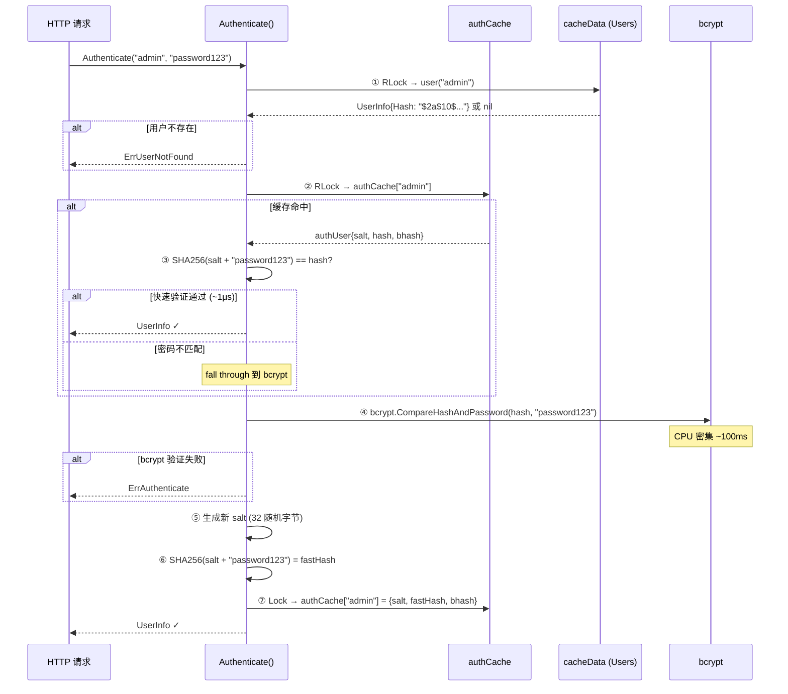

**authCache 失效机制**:

```go
// UpdateUser 时清除缓存 (client.go:459)
func (c *Client) UpdateUser(name, password string) error {
    c.mu.Lock()
    defer c.mu.Unlock()
    data := c.cacheData.Clone()
    hash, _ := bcrypt.GenerateFromPassword([]byte(password), bcryptCost)
    data.UpdateUser(name, string(hash))
    delete(c.authCache, name)    // ← 清除缓存
    return c.commit(data)
}

// DropUser 时的潜在问题:
func (c *Client) DropUser(name string) error {
    c.mu.Lock()
    defer c.mu.Unlock()
    data := c.cacheData.Clone()
    data.DropUser(name)
    // 注意: 未调用 delete(c.authCache, name)
    // 但用户已从 cacheData 中删除，Authenticate 第一步就会返回 ErrUserNotFound
    // 所以实际不会使用过期的 authCache 条目
    return c.commit(data)
}
```

**潜在问题**: `DropUser` 未显式清除 `authCache`，但不会导致安全问题——因为 `Authenticate` 先检查 `cacheData.user(username)`，用户已被删除所以直接返回 `ErrUserNotFound`，不会走到 authCache 检查。不过，authCache 中的残留条目会占用内存直到服务重启。

### 4.2 WriteAuthorizer

```go
// services/meta/write_authorizer.go:10 — WriteAuthorizer
type WriteAuthorizer struct {
    Client *Client  // 注意: 大写 C (导出字段)
}

// NewWriteAuthorizer 返回 WriteAuthorizer 实例
func NewWriteAuthorizer(c *Client) *WriteAuthorizer {
    return &WriteAuthorizer{Client: c}
}

// AuthorizeWrite (非 AuthorizeDatabase) 检查写权限
func (a WriteAuthorizer) AuthorizeWrite(username, database string) error {
    // 使用 a.Client.User(username) 而非 a.client.Authenticate
    u, err := a.Client.User(username)
    if err != nil || u == nil {
        return &ErrAuthorize{
            Database: database,
            Message:  fmt.Sprintf("%s not authorized to write to %s", username, database),
        }
    }

    // 类型断言到 *UserInfo，使用 AuthorizeDatabase 方法
    switch user := u.(type) {
    case *UserInfo:
        if !user.AuthorizeDatabase(influxql.WritePrivilege, database) {
            return &ErrAuthorize{
                Database: database,
                Message:  fmt.Sprintf("%s not authorized to write to %s", username, database),
            }
        }
    default:
        return &ErrAuthorize{
            Database: database,
            Message:  fmt.Sprintf("Internal error - wrong type %T for oss user", u),
        }
    }
    return nil
}
```

### 4.3 QueryAuthorizer

```go
// services/meta/query_authorizer.go:11 — QueryAuthorizer
type QueryAuthorizer struct {
    Client *Client  // 大写 C (导出字段)
}

// NewQueryAuthorizer 返回 QueryAuthorizer 实例
func NewQueryAuthorizer(c *Client) *QueryAuthorizer {
    return &QueryAuthorizer{Client: c}
}

// AuthorizeQuery 签名: 接受 User 接口而非 username string
// 返回 query.FineAuthorizer (通常为 query.OpenAuthorizer)
func (a *QueryAuthorizer) AuthorizeQuery(u User, q *influxql.Query, database string) (query.FineAuthorizer, error) {
    // 特殊情况: 没有用户时，第一条语句必须是 CREATE USER ... WITH ALL PRIVILEGES
    if n := a.Client.UserCount(); n == 0 {
        if len(q.Statements) > 0 {
            if cu, ok := q.Statements[0].(*influxql.CreateUserStatement); ok && cu.Admin {
                return query.OpenAuthorizer, nil  // 返回 FineAuthorizer 而非 nil
            }
        }
        return nil, &ErrAuthorize{
            Query:    q,
            Database: database,
            Message:  "create admin user first or disable authentication",
        }
    }

    if u == nil {
        return nil, &ErrAuthorize{
            Query:    q,
            Database: database,
            Message:  "no user provided",
        }
    }

    // 类型断言到 *UserInfo
    switch user := u.(type) {
    case *UserInfo:
        if user.Admin {
            return query.OpenAuthorizer, nil
        }
        // 逐语句检查权限...
        for _, stmt := range q.Statements {
            privs, err := stmt.RequiredPrivileges()
            // ... 检查每个 statement 的权限
        }
        return query.OpenAuthorizer, nil
    }
    // ...
}
```

**Bootstrap 安全**: 当没有任何用户时，系统允许创建第一个管理员用户。这是初始设置的安全机制。

## 5. Lease 机制

### 5.1 Lease 结构

```go
// services/meta/data.go:1679 — Lease
type Lease struct {
    Name       string    `json:"name"`
    Expiration time.Time `json:"expiration"`
    Owner      uint64    `json:"owner"`
}

// services/meta/data.go:1686 — Leases
type Leases struct {
    mu sync.Mutex
    m  map[string]*Lease
    d  time.Duration  // 默认 60s
}
```

### 5.2 AcquireLease 实现

```go
// services/meta/client.go:128 — 单节点模式 (OSS)
func (c *Client) AcquireLease(name string) (*Lease, error) {
    // 无锁 — 单节点模式下始终成功
    l := Lease{
        Name:       name,
        Expiration: time.Now().Add(DefaultLeaseDuration),  // 60s
    }
    return &l, nil  // 单节点始终成功
}

// services/meta/data.go:1704 — Enterprise 模式
func (leases *Leases) Acquire(name string, nodeID uint64) (*Lease, error) {
    leases.mu.Lock()
    defer leases.mu.Unlock()

    l := leases.m[name]
    if l != nil {
        if time.Now().After(l.Expiration) || l.Owner == nodeID {
            l.Expiration = time.Now().Add(leases.d)  // 使用 leases.d 而非参数
            l.Owner = nodeID
            return l, nil
        }
        return l, errors.New("another node has the lease")
    }

    l = &Lease{
        Name:       name,
        Expiration: time.Now().Add(leases.d),  // 使用 leases.d 而非参数
        Owner:      nodeID,
    }
    leases.m[name] = l
    return l, nil
}
```

### 5.3 Lease 使用场景

| Lease Name | 使用者 | 用途 |
|------------|--------|------|
| `"continuous_querier"` | CQ Service | 确保只有一个节点执行 CQ |
| `"retention"` | Retention Service | 确保只有一个节点执行过期删除 |

**单节点 vs Enterprise**:
- 单节点: `AcquireLease` 始终成功（当前进程即唯一 owner）
- Enterprise: 只有 Raft Leader 能获取 Lease（非 Leader 返回 error）

## 6. Protobuf Schema (Enterprise 遗留)

### 6.1 Data 消息定义

```protobuf
// services/meta/internal/meta.proto:10
message Data {
    required uint64 Term = 1;              // Raft Term (OSS 中始终为 0)
    required uint64 Index = 2;             // 单调递增版本号
    required uint64 ClusterID = 3;
    repeated NodeInfo Nodes = 4;           // (OSS 中未使用, 早期版本遗留)
    repeated DatabaseInfo Databases = 5;
    repeated UserInfo Users = 6;
    required uint64 MaxNodeID = 7;         // (OSS 中始终写 0)
    required uint64 MaxShardGroupID = 8;
    required uint64 MaxShardID = 9;
    // added for 0.10.0
    repeated NodeInfo DataNodes = 10;      // (OSS 中未使用)
    repeated NodeInfo MetaNodes = 11;      // (OSS 中未使用)
}
```

### 6.2 Command 类型枚举 (Enterprise 遗留)

```protobuf
// services/meta/internal/meta.proto:109
message Command {
    extensions 100 to max;

    enum Type {
        CreateNodeCommand                = 1;
        DeleteNodeCommand                = 2;
        CreateDatabaseCommand            = 3;
        DropDatabaseCommand              = 4;
        CreateRetentionPolicyCommand     = 5;
        DropRetentionPolicyCommand       = 6;
        SetDefaultRetentionPolicyCommand = 7;
        UpdateRetentionPolicyCommand     = 8;
        CreateShardGroupCommand          = 9;
        DeleteShardGroupCommand          = 10;
        CreateContinuousQueryCommand     = 11;
        DropContinuousQueryCommand       = 12;
        CreateUserCommand                = 13;
        DropUserCommand                  = 14;
        UpdateUserCommand                = 15;
        SetPrivilegeCommand              = 16;
        SetDataCommand                   = 17;
        SetAdminPrivilegeCommand         = 18;
        UpdateNodeCommand                = 19;
        CreateSubscriptionCommand        = 21;
        DropSubscriptionCommand          = 22;
        RemovePeerCommand                = 23;
        CreateMetaNodeCommand            = 24;
        CreateDataNodeCommand            = 25;
        UpdateDataNodeCommand            = 26;
        DeleteMetaNodeCommand            = 27;
        DeleteDataNodeCommand            = 28;
        SetMetaNodeCommand               = 29;
        DropShardCommand                 = 30;
    }

    required Type type = 1;
}
```

> **源码校准**: 枚举值 20 未被分配——`UpdateNodeCommand = 19` 之后直接跳到
> `CreateSubscriptionCommand = 21`，中间留有一个空位。这是 proto 枚举的历史遗留
> (可能曾有命令被移除或保留)，当前没有任何 Command 使用值 20。

**在 Enterprise 中**: 每个 Command 编码为 Raft log entry → 复制到多数节点 → Apply 到状态机
**在 OSS 中**: 这些类型仅在 `meta.pb.go` 中生成，不用于任何实际的命令分发

### 6.3 SetDataCommand — proto/generated 遗留

```protobuf
// services/meta/internal/meta.proto:280
message SetDataCommand {
    extend Command {
        optional SetDataCommand command = 117;
    }
    required Data Data = 1;
}
```

`SetDataCommand` 只保留在 proto/generated 类型中，属于 Enterprise 共享命令模型的遗留。当前 OSS 备份恢复不会构造并分发 `SetDataCommand`；实际恢复路径是 snapshotter 取得当前 `Data`，调用 `Data.ImportData(...)` 合并备份元数据，然后直接调用 `Client.SetData(&data)` 提交合并后的快照。

```go
// services/meta/client.go:917 — SetData
func (c *Client) SetData(data *Data) error {
    c.mu.Lock()
    defer c.mu.Unlock()

    // 先 Clone 传入数据，再通过 commit(snapshot + cacheData + changed channel) 发布
    d := data.Clone()

    if err := c.commit(d); err != nil {
        return err
    }

    return nil
}
```

> **源码校准**: 早期 review 指出的风险是“显式 `Unlock()` 放在 `commit()` 之后，
> 若 `commit()` panic 会导致锁不释放”。当前源码已经改为 `defer c.mu.Unlock()`，
> 所以该 panic 锁泄漏风险在本版本不成立。`SetData` 仍是特殊路径：它不基于当前
> `cacheData.Clone()` 做增量 mutation，而是 clone 调用者传入的完整 `Data` 后整体替换。

```mermaid
sequenceDiagram
    participant Restore as Snapshotter updateMetaStore
    participant Client as meta.Client
    participant Data as current Data
    participant Backup as backup Data
    participant Disk as meta.db

    Restore->>Client: Data()
    Client-->>Restore: current data
    Restore->>Data: ImportData(backup md, ...)
    Backup-->>Data: 合并 DB/RP/Shard 元数据
    Restore->>Client: SetData(&mergedData)
    Client->>Client: mu.Lock(); defer mu.Unlock()
    Client->>Data: Clone()
    Data-->>Client: d
    Client->>Disk: commit(d) / snapshot
    Client->>Client: cacheData=d; close(changed)
    Client-->>Restore: error / nil
```

**案例**: restore 线程先 `ossClient.Data()` 取当前元数据，再用 `ImportData` 把备份中的 DB/RP/Shard 信息合并进去，最后调用 `SetData(&data)` 提交合并快照。即使 `commit(d)` 返回错误，defer
也会释放 `c.mu`；如果 `commit(d)` 成功，watcher 通过 `changed` channel 收到全量
元数据替换通知。

## 7. 平台差异 — 原子 Rename

### 7.1 Unix 实现

```go
// pkg/file/file_unix.go:33
func RenameFile(oldpath, newpath string) error {
    return os.Rename(oldpath, newpath)  // 原子操作 (POSIX)
}
```

POSIX `rename(2)` 是原子的：要么新文件可见，要么旧文件可见，不会出现中间状态。

### 7.2 Windows 实现

```go
// pkg/file/file_windows.go:10
func RenameFile(oldpath, newpath string) error {
    // Windows 不支持原子 rename 覆盖
    // 必须先删除目标文件
    if _, err := os.Stat(newpath); err == nil {
        if err := os.Remove(newpath); err != nil {
            return err
        }
    }
    return os.Rename(oldpath, newpath)
}
```

**Windows 的问题**:
- `os.Remove(newpath)` 和 `os.Rename(oldpath, newpath)` 之间存在窗口期
- 如果进程在此期间崩溃，`meta.db` 已删除但 `meta.dbtmp` 未重命名
- **后果**: 元数据丢失，重启后使用默认空 Data

## 8. 备份恢复 — Snapshotter

### 8.1 服务结构

```go
// services/snapshotter/service.go
type Service struct {
    Node       *influxdb.Node

    // MetaClient 接口 — 仅 MarshalBinary 和 Database 查询
    MetaClient MetaClient

    // OSSMetaClient 接口 — 扩展 MetaClient, 增加 Data() 和 SetData()
    // 用于恢复时合并元数据 (updateMetaStore)
    TSDBStore  TSDBStore
    Logger     *zap.Logger
}

type MetaClient interface {
    encoding.BinaryMarshaler
    Database(name string) *meta.DatabaseInfo
}

type OSSMetaClient interface {
    MetaClient
    Data() meta.Data
    SetData(data *meta.Data) error
}
```

### 8.2 备份恢复流程 — 序列图

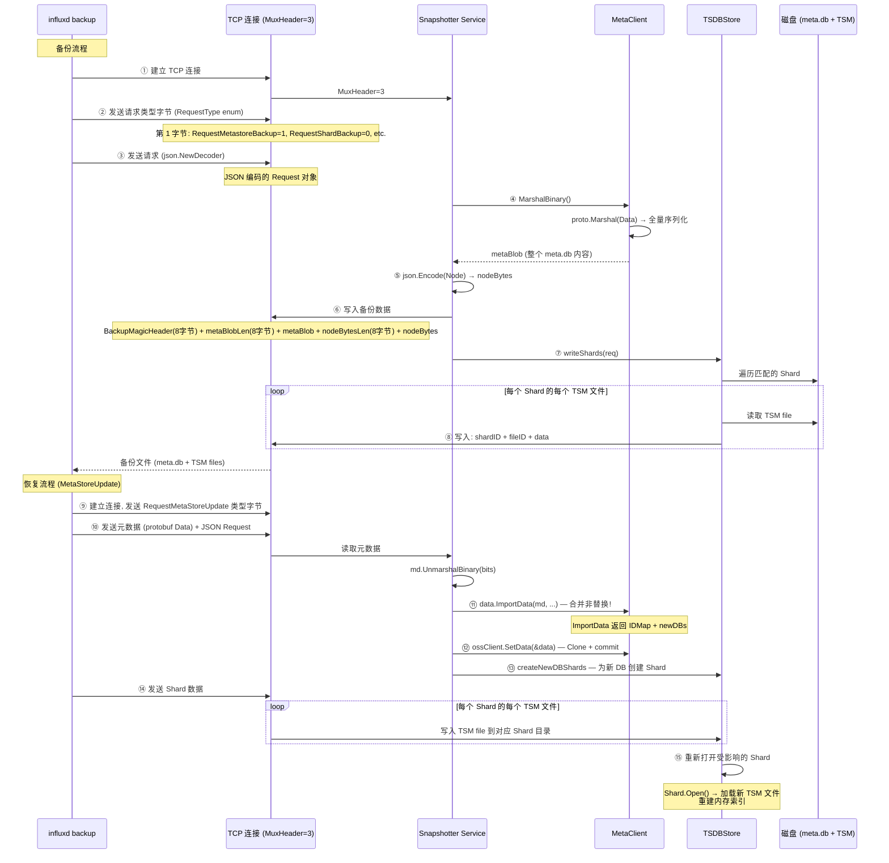

### 8.3 备份协议

```go
// services/snapshotter/service.go — handleConn
func (s *Service) handleConn(conn net.Conn) error {
    // 1. 读取第一个字节 — RequestType 枚举
    var typ [1]byte
    if _, err := io.ReadFull(conn, typ[:]); err != nil {
        return err
    }

    // 2. 特殊处理: ShardUpdate 直接走快速路径
    if RequestType(typ[0]) == RequestShardUpdate {
        return s.updateShardsLive(conn)
    }

    // 3. 使用 json.NewDecoder 读取 Request (非 binary.Read)
    r, bytes, err := s.readRequest(conn)
    if err != nil {
        return fmt.Errorf("read request: %s", err)
    }

    // 4. 根据 RequestType 分发
    switch RequestType(typ[0]) {
    case RequestMetastoreBackup:
        return s.writeMetaStore(conn)
    case RequestShardBackup:
        return s.TSDBStore.BackupShard(r.ShardID, r.Since, conn)
    case RequestMetaStoreUpdate:
        return s.updateMetaStore(conn, bytes, ...)
    // ...
    }
}

func (s *Service) readRequest(r io.Reader) (*Request, []byte, error) {
    var req Request
    d := json.NewDecoder(r)  // 使用 JSON 而非 binary.Read
    if err := d.Decode(&req); err != nil {
        return nil, nil, err
    }
    // ... 读取 payload
}
```

### 8.4 writeMetaStore — 备份元数据

```go
// services/snapshotter/service.go:267 — writeMetaStore
func (s *Service) writeMetaStore(conn net.Conn) error {
    metaBlob, err := s.MetaClient.MarshalBinary()
    if err != nil {
        return fmt.Errorf("marshal meta: %s", err)
    }

    var nodeBytes bytes.Buffer
    if err := json.NewEncoder(&nodeBytes).Encode(s.Node); err != nil {
        return err
    }

    // 写入格式: MagicHeader(8) + metaBlobLen(8) + metaBlob + nodeBytesLen(8) + nodeBytes
    var numBytes [24]byte
    binary.BigEndian.PutUint64(numBytes[:8], BackupMagicHeader)
    binary.BigEndian.PutUint64(numBytes[8:16], uint64(len(metaBlob)))
    binary.BigEndian.PutUint64(numBytes[16:24], uint64(nodeBytes.Len()))

    conn.Write(numBytes[:16])  // MagicHeader + metaBlobLen
    conn.Write(metaBlob)       // metaBlob
    conn.Write(numBytes[16:24]) // nodeBytesLen
    nodeBytes.WriteTo(conn)    // nodeBytes (JSON encoded Node)
    return nil
}
```

### 8.5 updateMetaStore — 恢复元数据 (合并而非替换)

```go
// services/snapshotter/service.go:181 — updateMetaStore
func (s *Service) updateMetaStore(conn net.Conn, bits []byte, ...) error {
    // 1. 反序列化备份的元数据
    md := meta.Data{}
    md.UnmarshalBinary(bits)

    // 2. 获取 OSSMetaClient (非 MetaClient)
    ossClient, ok := s.MetaClient.(OSSMetaClient)
    if !ok {
        return fmt.Errorf("only supported for OSS")
    }

    // 3. 获取当前数据
    data := ossClient.Data()

    // 4. 使用 ImportData 合并 (非简单 SetData)
    IDMap, newDBs, err := data.ImportData(md, backupDBName, restoreDBName, ...)

    // 5. 提交合并后的数据
    ossClient.SetData(&data)  // 内部 Clone + commit

    // 6. 为新数据库创建 Shard
    s.createNewDBShards(data, newDBs)
}
```

**备份协议**:
1. TCP 连接，MuxHeader=3，MagicHeader=0x59590101
2. 客户端发送备份请求（包含 DB/RP 过滤条件）
3. 服务端发送元数据（protobuf 序列化的 Data）
4. 服务端发送 Shard 数据（TSM 文件）

**恢复关键路径**:
- 元数据恢复不是直接用备份覆盖当前 `cacheData`；`updateMetaStore` 先 `ossClient.Data()` 取得当前 Data，再通过 `ImportData` 合并备份元数据，最后 `SetData(&data)` 提交合并后的快照并由 `snapshot()` 持久化到 `meta.db`
- Shard 数据恢复是文件级别的复制，将 TSM 文件写入对应的 Shard 目录
- 恢复后需要重新打开 Shard 以加载新的 TSM 文件并重建内存索引

## 9. 架构设计意图

### 9.1 为什么用 Clone-Modify-Commit 而非 MVCC

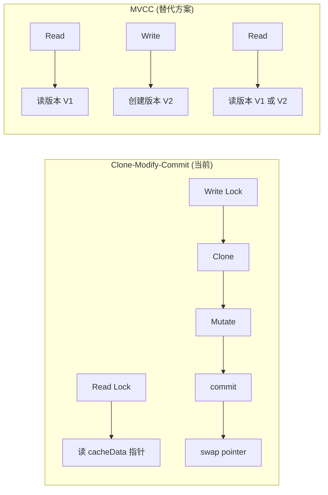

| 维度 | Clone-Modify-Commit | MVCC |
|------|---------------------|------|
| 实现复杂度 | 低 (RWMutex + 深拷贝) | 高 (版本链 + GC) |
| 内存开销 | 每次写操作一份完整拷贝 | 版本间共享不变部分 |
| 读一致性 | 读到最新已提交版本 | 可读任意版本 |
| 并发性 | 读写互斥 | 读写完全并发 |
| 适用场景 | 读多写少、单节点 | 高并发、分布式 |

**选择理由**: 元数据变更频率低（每小时/每天几次），深拷贝开销可接受。Go 的 `sync.RWMutex` 是标准做法。

### 9.2 为什么先写磁盘再更新内存

```go
// commit 顺序:
data.Index++
snapshot(path, data)   // 1. 先写磁盘
c.cacheData = data     // 2. 再更新内存
```

- **崩溃安全**: 如果在 `snapshot` 之后、`cacheData = data` 之前崩溃，重启后从磁盘加载的是最新数据
- **WAL 语义**: 磁盘是 source of truth，内存是 cache
- **读一致性**: 读操作在 `snapshot` 完成前看到旧数据，在完成后看到新数据

### 9.3 为什么用 channel 做变更通知

```go
close(c.changed)
c.changed = make(chan struct{})
```

| 机制 | 广播能力 | 实现复杂度 | 性能 |
|------|---------|-----------|------|
| channel close | 广播所有等待者 | 低 | O(1) |
| cond.Broadcast | 广播所有等待者 | 中 | O(N) |
| poll (轮询) | 无 | 低 | 高延迟 |
| callback | 需要注册管理 | 高 | O(N) |

channel close 是 Go 中最简洁的广播原语。

### 9.4 为什么用 protobuf 序列化而非 JSON

```go
func (data *Data) MarshalBinary() ([]byte, error) {
    return proto.Marshal(data.marshal())
}
```

| 格式 | 体积 | 速度 | Schema |
|------|------|------|--------|
| protobuf | 小 | 快 | 强类型 |
| JSON | 大 | 慢 | 无类型 |
| gob | 中 | 中 | Go 专用 |

protobuf 的二进制格式比 JSON 小 3-5 倍，序列化/反序列化快 10 倍。对于频繁的全量快照，这个差异很重要。

## 10. 架构收益

| 维度 | 收益 |
|------|------|
| **实现简洁** | Clone-Modify-Commit 模式代码量小，逻辑清晰 |
| **崩溃安全** | 先写磁盘 + 原子 rename，保证元数据不丢失 |
| **读性能** | RLock 允许多个读并发；读写仍互斥，但 Copy-on-Write 缩短读侧工作并保证快照稳定 |
| **写安全** | WLock 串行化写操作，避免竞态 |
| **通知机制** | channel 广播变更，goroutine 自动唤醒 |
| **重试语义** | 部分创建/删除操作具备窄范围幂等性，但并非所有变更都幂等；部分无实际内容变化的 Client mutation 仍会 commit 并推进 `Index` |
| **认证缓存** | salted SHA-256 避免重复 bcrypt 比较 |
| **备份恢复** | Protobuf 序列化 + TCP 传输，支持在线备份 |
| **接口化** | MetaClient 接口支持测试和替换实现 |

## 11. 潜在隐患与瓶颈

### 11.1 Windows 平台的非原子 Rename

```go
// pkg/file/file_windows.go:10
func RenameFile(oldpath, newpath string) error {
    if _, err := os.Stat(newpath); err == nil {
        if err := os.Remove(newpath); err != nil {  // 1. 删除旧文件
            return err
        }
    }
    return os.Rename(oldpath, newpath)  // 2. 重命名新文件
}
```

**崩溃窗口**: `Remove` 和 `Rename` 之间进程崩溃 → `meta.db` 已删除，`meta.dbtmp` 未重命名 → 元数据丢失。

**风险等级**: 高。生产环境应使用 Linux。

**缓解方案**:

1. **Windows 10+ 原子语义**: `os.Rename` 在 Windows 10 1709+ (build 16299) 上已支持原子覆盖（通过 `MoveFileEx` 的 `MOVEFILE_REPLACE_EXISTING` 标志）。当前代码中的 `os.Remove + os.Rename` 组合实际上比直接 `os.Rename` 更危险。

2. **改进方案**: 修改 `file_windows.go`，优先尝试原子 rename：
```go
// 改进的 Windows 实现
func RenameFile(oldpath, newpath string) error {
    // Windows 10+ 支持原子覆盖
    err := os.Rename(oldpath, newpath)
    if err == nil {
        return nil
    }
    // Fallback: 删除后重命名 (保留向后兼容)
    if _, statErr := os.Stat(newpath); statErr == nil {
        if removeErr := os.Remove(newpath); removeErr != nil {
            return removeErr
        }
    }
    return os.Rename(oldpath, newpath)
}
```

3. **备份策略**: 在 Windows 上定期备份 `meta.db` 文件，防止元数据丢失。

### 11.2 深拷贝的性能开销

```
Data.Clone() 开销:
- Databases: N 个 DB × M 个 RP × K 个 ShardGroup × 值拷贝
- Users: 值拷贝
- ShardGroups: 按时间排序后插入

典型场景: 100 DB × 3 RP × 100 ShardGroup = 30,000 ShardGroupInfo 拷贝
```

- 每次写操作（如创建 ShardGroup）都需要深拷贝整个 `Data`
- 大规模部署下，深拷贝可能需要毫秒级 CPU 时间
- **缓解**: 元数据变更频率低，实际影响有限

### 11.3 无 Raft 复制 = 单点故障

- 元数据只存在于单个节点的 `meta.db` 文件
- 节点故障 = 元数据丢失（除非有文件系统级备份）
- 没有自动故障转移

### 11.4 全量序列化的 I/O 开销

```go
// 每次 commit 都序列化整个 Data
buf, err := data.MarshalBinary()  // 可能几 MB
f.Write(buf)                       // 磁盘写入
f.Sync()                           // fsync
```

- 元数据规模增长后，每次 commit 的 I/O 开销增加
- fsync 是最昂贵的操作（等待磁盘刷盘）
- **优化方向**: 增量日志 (WAL) + 定期快照

### 11.5 changed 通道的无缓冲

```go
c.changed = make(chan struct{})  // 无缓冲
```

- 如果 watcher 处理慢，可能错过中间状态
- 只能看到最新状态，无法回放中间变更
- 没有版本号比较，无法判断是否需要重新读取

### 11.6 缺少 MVCC 读

```go
// 读操作直接读取 cacheData 指针
// 没有版本号检查
// 无法读取"某个时间点"的元数据快照
```

- 不支持时间旅行查询
- 不支持一致性快照读取（长事务可能看到不同版本）
- 读操作需要等写操作完成（读写互斥）

### 11.7 Lease 无持久化

```go
type Leases struct {
    mu sync.Mutex
    m  map[string]*Lease  // 内存中
    d  time.Duration
}
```

- 服务重启后所有 Lease 清空
- CQ 和 retention 服务会立即重新获取 Lease
- 可能导致重启后的执行风暴（类似 Module 5 中的 lastRuns 问题）

### 11.8 元数据规模限制

所有元数据加载到内存中：

| 数据结构 | 数量级 | 内存开销 |
|----------|--------|---------|
| Databases | 10-100 | KB |
| RetentionPolicies | 30-300 | KB |
| ShardGroups | 10,000-100,000 | MB |
| Shards | 10,000-100,000 | MB |
| Users | 10-100 | KB |

对于大规模部署（数千数据库、数万 Shard），内存消耗可能达到数百 MB。

### 11.9 锁升级窗口

```go
c.mu.RUnlock()  // 释放读锁
// 窗口: 其他写操作可能获得写锁
c.mu.Lock()     // 获取写锁
```

Go 的 `sync.RWMutex` 不支持原子锁升级。在 RUnlock 和 Lock 之间，其他写操作可能插入，因此需要双重检查。

### 11.10 错误消息中的 Enterprise 遗留

```go
// services/meta/errors.go:9-13
var ErrStoreOpen = errors.New("store already open")
var ErrStoreClosed = errors.New("raft store already closed")
```

错误消息引用 "raft store"，但在 OSS 中没有 Raft。这可能误导调试。

## 12. 元数据变更传播 — changed 通道消费者

### 12.1 Subscriber Service — 变更监听

```go
// services/subscriber/service.go:162 — waitForMetaUpdates
func (s *Service) waitForMetaUpdates() {
    for {
        ch := s.MetaClient.WaitForDataChanged()
        select {
        case <-ch:
            // 元数据变更: 更新 subscription 列表
            err := s.Update()
            if err != nil {
                s.Logger.Info("Error updating subscriptions", zap.Error(err))
            }
        case <-s.closing:
            return
        }
    }
}
```

**关键模式**: 每次循环重新获取 `changed` channel。这是因为 `commit()` 中 `close(changed)` 后立即创建新 channel，旧 channel 不会再有新信号。

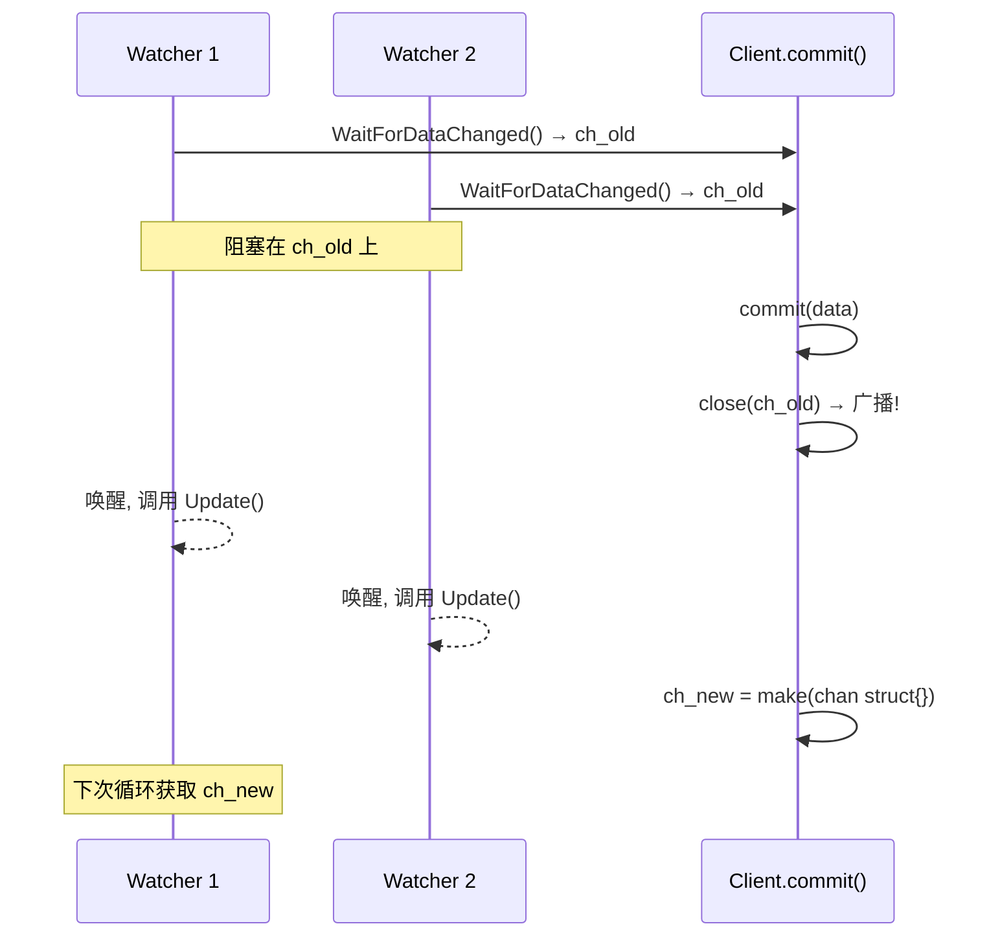

### 12.2 其他消费者

并非所有组件都使用 `WaitForDataChanged`。实际上只有 Subscriber 使用 channel 通知，其他服务使用 ticker 轮询：

| 组件 | 文件 | 通知机制 | 响应动作 |
|------|------|---------|---------|
| Subscriber Service | `services/subscriber/service.go:162` | **WaitForDataChanged (channel)** | 更新 subscription 列表 |
| Retention Service | `services/retention/service.go` | **Ticker 轮询** (`time.NewTicker`) | 定期检查并删除过期 ShardGroup |
| Precreator Service | `services/precreator/service.go` | **Ticker 轮询** (`time.After`) | 定期预创建 ShardGroup |
| CQ Service | `services/continuous_querier/service.go` | Lease 驱动 | 按 Lease 周期执行 CQ |

**为什么 Retention/Precreator 不用 WaitForDataChanged？**
这些服务按固定间隔运行（如每 30 分钟检查一次），不需要实时响应元数据变更。Ticker 轮询更简单，避免在高写入场景下频繁触发。

## 13. 数据库创建 → ShardGroup 创建链

### 13.1 完整触发链

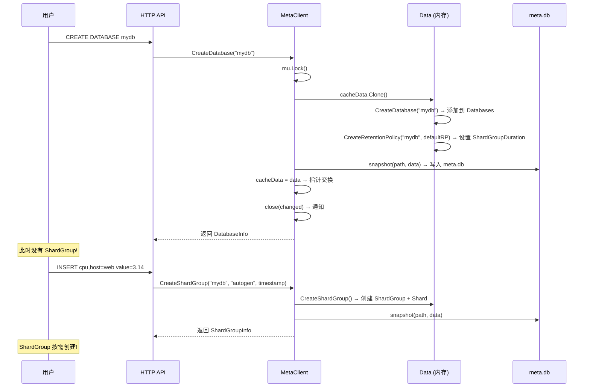

### 13.2 ShardGroupDuration 自动计算

```go
// services/meta/data.go:1266 — shardGroupDuration
func shardGroupDuration(d time.Duration) time.Duration {
    if d >= 180*24*time.Hour || d == 0 {  // 180 天 (约 6 个月) 或 0 (永久)
        return 7 * 24 * time.Hour
    } else if d >= 2*24*time.Hour {
        return 1 * 24 * time.Hour
    }
    return 1 * time.Hour
}
```

### 13.3 CreateShardGroup — 幂等性

```go
// services/meta/data.go:358 — CreateShardGroup
func (data *Data) CreateShardGroup(database, policy string, timestamp time.Time) error {
    rpi, err := data.RetentionPolicy(database, policy)

    // 幂等检查: 已存在则直接返回
    if rpi.ShardGroupByTimestamp(timestamp) != nil {
        return nil
    }

    // 计算时间边界
    duration := rpi.ShardGroupDuration
    startTime := timestamp.Truncate(duration).UTC()
    endTime := startTime.Add(duration).UTC()

    // 创建 ShardGroup
    data.MaxShardGroupID++
    sgi := ShardGroupInfo{
        ID:        data.MaxShardGroupID,
        StartTime: startTime,
        EndTime:   endTime,
    }

    // 创建 Shard (OSS: 每个 ShardGroup 只有 1 个)
    data.MaxShardID++
    sgi.Shards = []ShardInfo{{ID: data.MaxShardID}}

    // 添加到 RP 并排序
    rpi.ShardGroups = append(rpi.ShardGroups, sgi)
    sort.Sort(ShardGroupInfos(rpi.ShardGroups))

    return nil
}
```

**关键发现**: OSS 版本每个 ShardGroup 只创建 **1 个 Shard**。`ShardFor()` 的 hash 路由是 Enterprise 版本的遗留代码。

## 14. meta.db 恢复流程

### 14.1 启动时恢复

```go
// services/meta/client.go:88 — Open
func (c *Client) Open() error {
    c.mu.Lock()
    defer c.mu.Unlock()

    // 1. 从磁盘加载
    if err := c.Load(); err != nil {
        return err
    }

    // 2. 全新实例: 立即持久化
    if c.cacheData.Index == 1 {
        if err := snapshot(c.path, c.cacheData); err != nil {
            return err
        }
    }

    return nil
}
```

### 14.2 Load — 读取 meta.db

```go
// services/meta/client.go:1031 — Load
func (c *Client) Load() error {
    file := filepath.Join(c.path, metaFile)  // "meta.db"
    f, err := os.Open(file)
    if err != nil {
        if os.IsNotExist(err) {
            return nil  // 全新实例，使用默认空 Data
        }
        return err
    }
    defer f.Close()

    data, err := io.ReadAll(f)
    if err != nil {
        return err
    }

    return c.cacheData.UnmarshalBinary(data)  // proto.Unmarshal
}
```

### 14.3 恢复流程图

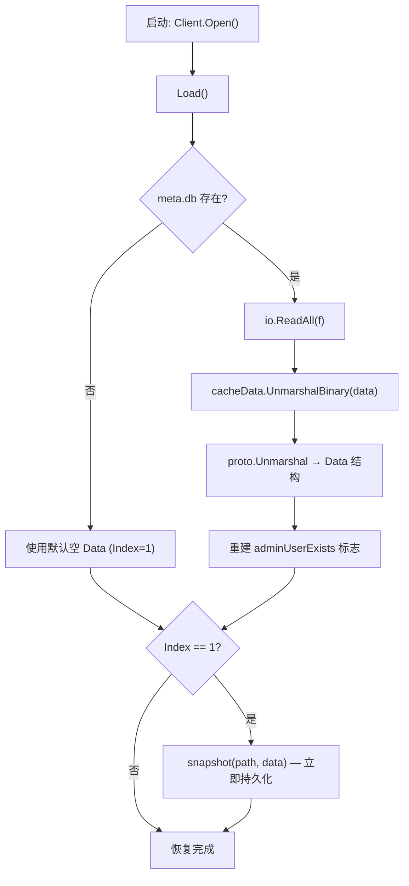

### 14.4 UnmarshalBinary — 反序列化

```go
// services/meta/data.go:744 — UnmarshalBinary
func (data *Data) UnmarshalBinary(buf []byte) error {
    var pb internal.Data
    if err := proto.Unmarshal(buf, &pb); err != nil {
        return err
    }
    data.unmarshal(&pb)
    return nil
}

// services/meta/data.go:720 — unmarshal
func (data *Data) unmarshal(pb *internal.Data) {
    data.Term = pb.GetTerm()
    data.Index = pb.GetIndex()
    data.ClusterID = pb.GetClusterID()
    data.MaxShardGroupID = pb.GetMaxShardGroupID()
    data.MaxShardID = pb.GetMaxShardID()

    // 反序列化 Databases
    data.Databases = make([]DatabaseInfo, len(pb.GetDatabases()))
    for i, x := range pb.GetDatabases() {
        data.Databases[i].unmarshal(x)
    }

    // 反序列化 Users
    data.Users = make([]UserInfo, len(pb.GetUsers()))
    for i, x := range pb.GetUsers() {
        data.Users[i].unmarshal(x)
    }

    // 重建 adminUserExists 标志 — 使用 hasAdminUser() 辅助方法
    data.adminUserExists = data.hasAdminUser()
}
```
