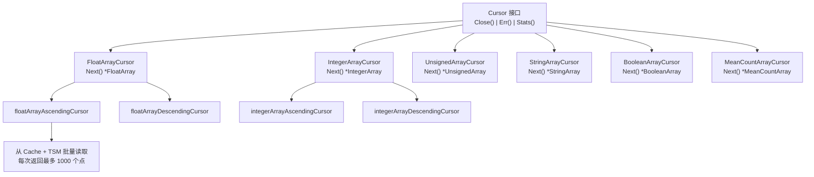
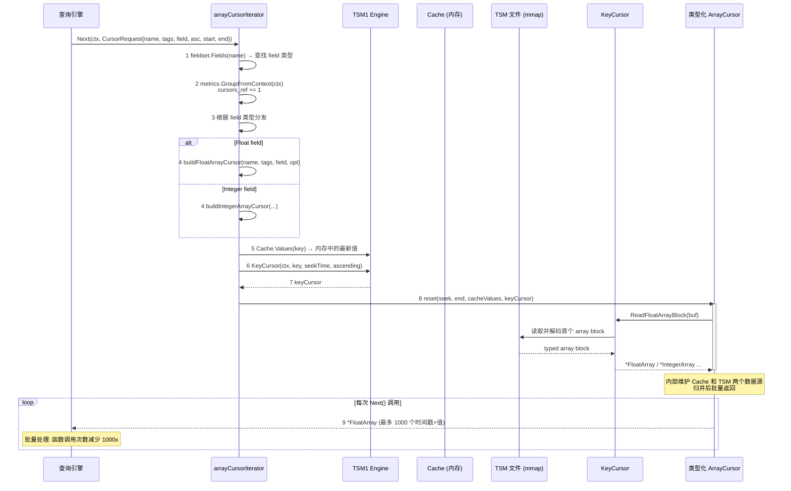
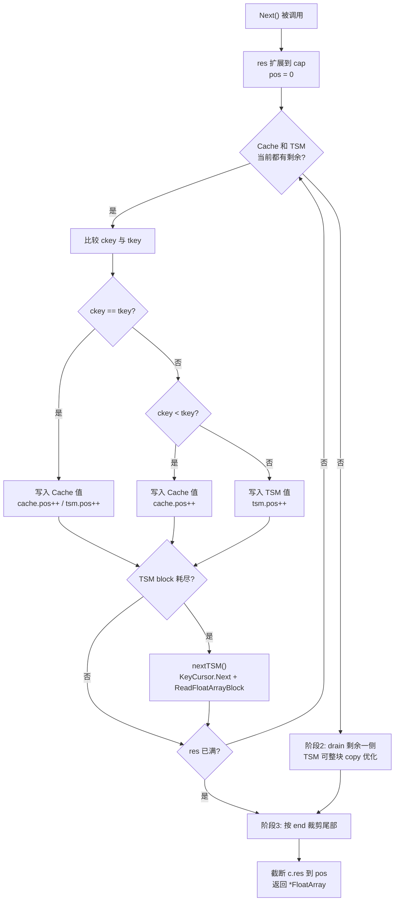
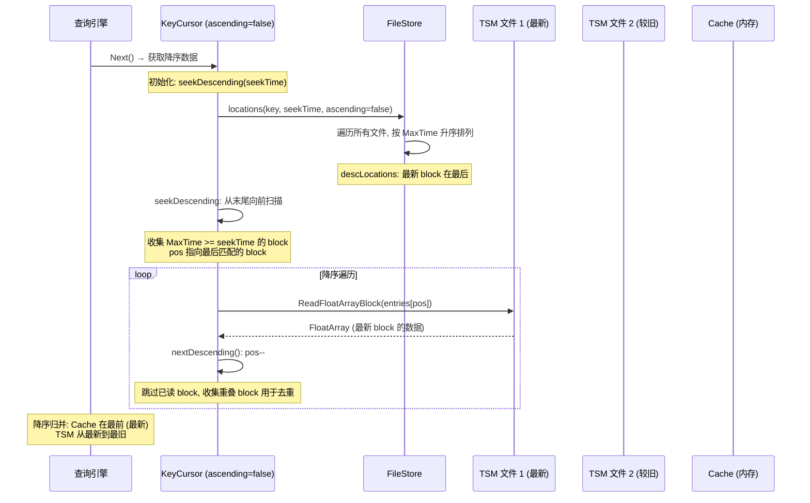
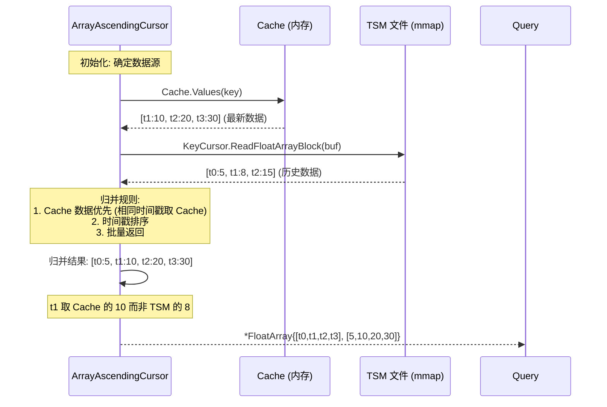
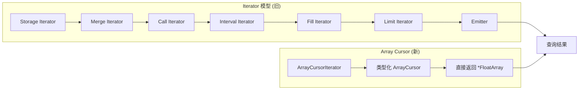

# Module 8: Array Cursor 抽象层 (批量读取路径 + 类型化数组 + Cache/TSM 归并) - 深度审计报告

> **小白导读**: Array Cursor 是查询引擎从 TSM 文件读取数据的"高速公路"。
>
> 旧的 Iterator 模型（模块 3）是逐点读取——每次 `Next()` 返回一个点。
> Array Cursor 是批量读取——每次 `Next()` 返回最多 1000 个点的数组。
>
> 就像去超市购物：
> - **Iterator**: 每次拿一件商品去结账，来回跑 1000 次
> - **Array Cursor**: 推购物车，一次装 1000 件商品，一趟搞定
>
> 批量读取减少了函数调用开销、提高了 CPU 缓存命中率，是 TSM1 引擎的核心性能优化。

## 1. 核心接口

### 1.1 Cursor 接口层次



```go
// tsdb/cursors/cursor.go — 核心接口定义

const DefaultMaxPointsPerBlock = 1000

// Cursor 是所有类型化数组游标的基接口
type Cursor interface {
    Close()
    Err() error
    Stats() CursorStats
}

// FloatArrayCursor 返回浮点数数组
type FloatArrayCursor interface {
    Cursor
    Next() *FloatArray  // 每次调用返回最多 1000 个点
}

// IntegerArrayCursor 返回整数数组
type IntegerArrayCursor interface {
    Cursor
    Next() *IntegerArray
}

// UnsignedArrayCursor, StringArrayCursor, BooleanArrayCursor 同理

// MeanCountArrayCursor 返回聚合中间态数组
type MeanCountArrayCursor interface {
    Cursor
    Next() *MeanCountArray
}
```

### 1.2 类型化数组结构

```go
// tsdb/cursors/arrayvalues.gen.go — 生成的数组类型

type FloatArray struct {
    Timestamps []int64   // 时间戳数组
    Values     []float64 // 浮点值数组
}

type IntegerArray struct {
    Timestamps []int64
    Values     []int64
}

type UnsignedArray struct {
    Timestamps []int64
    Values     []uint64
}

type StringArray struct {
    Timestamps []int64
    Values     []string
}

type BooleanArray struct {
    Timestamps []int64
    Values     []bool
}

type MeanCountArray struct {
    Timestamps []int64
    Values0    []float64 // mean/sum 类浮点中间值
    Values1    []int64   // count 类计数中间值
}

// TimestampArray 只有时间戳，没有值列，用于时间范围查找、裁剪和包含关系判断。
type TimestampArray struct {
    Timestamps []int64
}
```

> **源码校准**: `TimestampArray` (tsdb/cursors/arrayvalues.gen.go:1014) 带有
> `FindRange` / `Exclude` / `Contains` 等时间范围方法，但本模块描述的
> `tsdb/engine/tsm1` array cursor 读取管线**并不使用** `TimestampArray`——
> engine 侧的 array cursor 使用 `FloatArray` / `IntegerArray` / `UnsignedArray` /
> `StringArray` / `BooleanArray` 这些带值列的类型化数组。`TimestampArray` 定义在
> `tsdb/cursors` 包中，服务于其他读取路径 (如索引/元数据相关的时间范围查找)。

**Size() 方法** — 计算内存占用:

```go
// tsdb/cursors/arrayvalues.go
func (a *FloatArray) Size() int {
    return len(a.Timestamps)*8 + len(a.Values)*8  // 每个时间戳 8B + 每个值 8B
}

func (a *StringArray) Size() int {
    sz := len(a.Timestamps) * 8
    for _, s := range a.Values {
        sz += len(s)  // 字符串长度不固定
    }
    return sz
}

func (a *BooleanArray) Size() int {
    return len(a.Timestamps)*8 + len(a.Values)  // bool 值按 1B 计入
}
```

### 1.3 CursorRequest — 查询参数

```go
// tsdb/cursors/cursor.go — CursorRequest
type CursorRequest struct {
    Name      []byte      // measurement 名称
    Tags      models.Tags // series 标签
    Field     string      // 字段名
    Ascending bool        // 升序/降序
    StartTime int64       // 查询起始时间 (纳秒, inclusive)
    EndTime   int64       // 查询结束时间 (纳秒, inclusive)
}
```

`CursorRequest` 的时间范围是闭区间：`StartTime` 和 `EndTime` 都包含在查询结果内。升序游标会裁掉 `> EndTime` 的点，降序游标会裁掉 `< EndTime` 的点。

### 1.4 CursorIterator — 工厂接口

```go
// tsdb/cursors/cursor.go — CursorIterator
type CursorIterator interface {
    Next(ctx context.Context, r *CursorRequest) (Cursor, error)
    Stats() CursorStats
}

// CursorIterators 聚合多个 CursorIterator 的统计信息
type CursorIterators []CursorIterator

func (a CursorIterators) Stats() CursorStats {
    var stats CursorStats
    for _, itr := range a {
        stats.Add(itr.Stats())
    }
    return stats
}

// CursorStats — 扫描统计
type CursorStats struct {
    ScannedValues int // 扫描的值数量
    ScannedBytes  int // 扫描的未压缩字节数
}

func (s *CursorStats) Add(other CursorStats) {
    s.ScannedValues += other.ScannedValues
    s.ScannedBytes += other.ScannedBytes
}
```

> **小白解释**: `CursorIterator` 就像一个"游标工厂"。你告诉它要查哪个 measurement 的哪个字段，
> 它就给你造一个对应的 Cursor 出来。每次 `Engine.CreateCursorIterator(ctx)` 都会新建一个 `arrayCursorIterator`，不是整个 Engine 复用同一个实例。

## 2. 全链路总览

### 2.1 从查询请求到批量数据返回



### 2.2 arrayCursorIterator.Next — 类型分发

```go
// tsdb/engine/tsm1/array_cursor_iterator.go:39 — Next
func (q *arrayCursorIterator) Next(ctx context.Context, r *tsdb.CursorRequest) (tsdb.Cursor, error) {
    // 1. 查找 measurement 的 field 定义
    mf := q.e.fieldset.Fields(r.Name)
    if mf == nil {
        return nil, nil
    }

    // 2. 查找具体 field
    f := mf.Field(r.Field)
    if f == nil {
        return nil, nil
    }

    // 3. 记录引用游标创建指标
    if grp := metrics.GroupFromContext(ctx); grp != nil {
        grp.GetCounter(numberOfRefCursorsCounter).Add(1)
    }

    // 4. 构建 IteratorOptions
    var opt query.IteratorOptions
    opt.Ascending = r.Ascending
    opt.StartTime = r.StartTime
    opt.EndTime = r.EndTime

    // 5. 根据 field 类型分发到对应的 cursor 构建器
    switch f.Type {
    case influxql.Float:
        return q.buildFloatArrayCursor(ctx, r.Name, r.Tags, r.Field, opt)
    case influxql.Integer:
        return q.buildIntegerArrayCursor(ctx, r.Name, r.Tags, r.Field, opt)
    case influxql.Unsigned:
        return q.buildUnsignedArrayCursor(ctx, r.Name, r.Tags, r.Field, opt)
    case influxql.String:
        return q.buildStringArrayCursor(ctx, r.Name, r.Tags, r.Field, opt)
    case influxql.Boolean:
        return q.buildBooleanArrayCursor(ctx, r.Name, r.Tags, r.Field, opt)
    default:
        panic(fmt.Sprintf("unreachable: %T", f.Type))
    }
}
```

```go
// tsdb/engine/tsm1/engine_cursor.go
func (e *Engine) CreateCursorIterator(ctx context.Context) (tsdb.CursorIterator, error) {
    return &arrayCursorIterator{e: e}, nil
}
```

因此 `arrayCursorIterator` 内部复用的 `q.key` 缓冲区只属于本次创建的 iterator；并发查询会拿到不同的 iterator 实例。

**seriesFieldKeyBytes — 构建复合 key**:

```go
// tsdb/engine/tsm1/array_cursor_iterator.go:79
func (q *arrayCursorIterator) seriesFieldKeyBytes(name []byte, tags models.Tags, field string) []byte {
    q.key = models.AppendMakeKey(q.key[:0], name, tags)  // "cpu,host=web"
    q.key = append(q.key, keyFieldSeparatorBytes...)      // "#!~#"
    q.key = append(q.key, field...)                       // "value"
    return q.key  // "cpu,host=web#!~#value"
}
```

> **关键设计**: `arrayCursorIterator` 复用 `q.key` 缓冲区，避免每次调用都分配新的字节切片。
> 这是一个常见的零分配优化。

## 3. Array Cursor 实现

### 3.1 升序游标 — floatArrayAscendingCursor



**批量读取的核心思想**: Cache 值在构造 cursor 时由 `Cache.Values(key)` 取出，TSM 当前 block 在
`reset()` 或 `nextTSM()` 中通过 `KeyCursor.ReadFloatArrayBlock(c.tsm.buf)` 解码到类型化数组。
`Next()` 本身负责把 Cache 与当前 TSM block 做双指针归并；只有 TSM block 耗尽时，才通过 `nextTSM()` 推进到下一块。

```go
// tsdb/engine/tsm1/array_cursor.gen.go:16 — floatArrayAscendingCursor
type floatArrayAscendingCursor struct {
    cache struct {
        values Values
        pos    int
    }

    tsm struct {
        buf       *tsdb.FloatArray
        values    *tsdb.FloatArray
        pos       int
        keyCursor *KeyCursor
    }

    end int64
    res *tsdb.FloatArray
}
```

**结构体设计说明**: 使用嵌套匿名结构体将 Cache 和 TSM 两个数据源的状态明确分离。
- `cache` 组: 存储 Cache 中的值和当前读取位置
- `tsm` 组: 存储 TSM 文件的解码缓冲区 (`buf`)、当前值 (`values`)、读取位置和 KeyCursor
- `res`: 预分配的结果数组，每次 `Next()` 复用，避免堆分配
- `end`: 查询结束时间，用于边界检查

```go
// 构造函数 — 预分配缓冲区
func newFloatArrayAscendingCursor() *floatArrayAscendingCursor {
    c := &floatArrayAscendingCursor{
        res: tsdb.NewFloatArrayLen(tsdb.DefaultMaxPointsPerBlock),
    }
    c.tsm.buf = tsdb.NewFloatArrayLen(tsdb.DefaultMaxPointsPerBlock)
    return c
}
```

### 3.1.1 Next() — 内联归并策略

`Next()` 方法（约 78 行）直接在方法体内完成 Cache 和 TSM 数据的归并，没有单独的 `readNextBlock()` 方法。核心流程：

```go
func (c *floatArrayAscendingCursor) Next() *tsdb.FloatArray {
    pos := 0
    cvals := c.cache.values
    tvals := c.tsm.values

    // 将 res 切片扩展到容量上限，准备填充
    c.res.Timestamps = c.res.Timestamps[:cap(c.res.Timestamps)]
    c.res.Values = c.res.Values[:cap(c.res.Values)]

    // 阶段1: 双指针归并 — Cache 和 TSM 同时有数据时
    for pos < len(c.res.Timestamps) && c.tsm.pos < len(tvals.Timestamps) && c.cache.pos < len(cvals) {
        ckey := cvals[c.cache.pos].UnixNano()
        tkey := tvals.Timestamps[c.tsm.pos]
        if ckey == tkey {
            // 相同时间戳: Cache 优先 (更新的数据)
            c.res.Timestamps[pos] = ckey
            c.res.Values[pos] = cvals[c.cache.pos].(FloatValue).value
            c.cache.pos++
            c.tsm.pos++
        } else if ckey < tkey {
            // Cache 时间更早, 取 Cache
            c.res.Timestamps[pos] = ckey
            c.res.Values[pos] = cvals[c.cache.pos].(FloatValue).value
            c.cache.pos++
        } else {
            // TSM 时间更早, 取 TSM
            c.res.Timestamps[pos] = tkey
            c.res.Values[pos] = tvals.Values[c.tsm.pos]
            c.tsm.pos++
        }
        pos++

        // TSM 当前 block 耗尽, 通过 KeyCursor 加载下一个 block
        if c.tsm.pos >= len(tvals.Timestamps) {
            tvals = c.nextTSM()
        }
    }

    // 阶段2: 一方数据耗尽后, 处理剩余数据
    if pos < len(c.res.Timestamps) {
        if c.tsm.pos < len(tvals.Timestamps) {
            if pos == 0 && c.tsm.pos == 0 && len(c.res.Timestamps) >= len(tvals.Timestamps) {
                // 优化: 整个 TSM block 可以直接复制 (无需逐点归并)
                // 条件: 归并阶段未消耗任何位置 (pos==0)、当前 TSM block 未被部分消费
                // (c.tsm.pos==0)，且 block 完全适配缓冲区
                copy(c.res.Timestamps, tvals.Timestamps)
                pos += copy(c.res.Values, tvals.Values)
                c.nextTSM()
            } else {
                // 部分复制 TSM 剩余数据
                n := copy(c.res.Timestamps[pos:], tvals.Timestamps[c.tsm.pos:])
                copy(c.res.Values[pos:], tvals.Values[c.tsm.pos:])
                pos += n
                c.tsm.pos += n
                if c.tsm.pos >= len(tvals.Timestamps) {
                    c.nextTSM()
                }
            }
        }

        if c.cache.pos < len(cvals) {
            // TSM 已耗尽, 填充 Cache 剩余数据
            for pos < len(c.res.Timestamps) && c.cache.pos < len(cvals) {
                c.res.Timestamps[pos] = cvals[c.cache.pos].UnixNano()
                c.res.Values[pos] = cvals[c.cache.pos].(FloatValue).value
                pos++
                c.cache.pos++
            }
        }
    }

    // 阶段3: 结束时间边界检查 — 移除超出查询范围的点
    if pos > 0 && c.res.Timestamps[pos-1] > c.end {
        pos -= 2
        for pos >= 0 && c.res.Timestamps[pos] > c.end {
            pos--
        }
        pos++
    }

    // 截断结果切片并返回 (复用 c.res 指针)
    c.res.Timestamps = c.res.Timestamps[:pos]
    c.res.Values = c.res.Values[:pos]
    return c.res
}

// nextTSM — 通过 KeyCursor 加载下一个 TSM block
func (c *floatArrayAscendingCursor) nextTSM() *tsdb.FloatArray {
    c.tsm.keyCursor.Next()
    c.tsm.values, _ = c.tsm.keyCursor.ReadFloatArrayBlock(c.tsm.buf)
    c.tsm.pos = 0
    return c.tsm.values
}
```

**关键设计点**:
- **无 `readNextBlock()` 方法**: 不存在此方法。TSM block 的加载通过 `nextTSM()` 完成，它仅调用 `KeyCursor.Next()` + `ReadFloatArrayBlock()` 来推进到下一个 block
- **内联归并**: Cache 和 TSM 的双指针归并直接在 `Next()` 方法体内完成，而非分离到独立的 merge 函数
- **copy 优化**: 当 `pos==0`、`c.tsm.pos==0` 且整个 TSM block 完全适配缓冲区时，使用 `copy()` 批量复制，跳过逐点归并循环
- **错误处理边界**: `reset()` 读取首个 TSM block 时返回的错误会向上返回；后续 `nextTSM()` 调用忽略 `ReadFloatArrayBlock` 的错误，且生成游标的 `Err()` 恒返回 `nil`，因此后续 block 读取错误不会通过 cursor 暴露
- **结果复用**: `c.res` 是预分配的 `*tsdb.FloatArray`，每次调用返回同一指针，底层切片被截断后重填

### 3.2 降序游标 — floatArrayDescendingCursor

> **小白解释**: 降序查询就像**倒着翻书**——从最后一页往前翻。
> 升序游标从最早的数据开始读，降序游标从最新的数据开始读。
> 关键区别：TSM 文件的 block 从后往前遍历，Cache 的位置指针从末尾开始递减。

#### 3.2.1 结构体定义

```go
// tsdb/engine/tsm1/array_cursor.gen.go:158 — floatArrayDescendingCursor
type floatArrayDescendingCursor struct {
    cache struct {
        values Values
        pos    int      // 从末尾开始递减
    }
    tsm struct {
        buf       *tsdb.FloatArray
        values    *tsdb.FloatArray
        pos       int      // 从末尾开始递减
        keyCursor *KeyCursor
    }
    end int64             // 查询边界 (最早时间)
    res *tsdb.FloatArray   // 预分配结果数组
}
```

结构体与升序游标完全相同，区别在于行为逻辑。

#### 3.2.2 KeyCursor 降序遍历机制



**KeyCursor 降序关键方法** (`file_store.go`):

```go
// file_store.go:1511 — seekDescending
func (c *KeyCursor) seekDescending(t int64) {
    // 从末尾向前扫描, 收集包含或早于 seekTime 的 block
    for i := len(c.seeks) - 1; i >= 0; i-- {
        e := c.seeks[i]
        if t > e.entry.MaxTime || e.entry.Contains(t) {
            if len(c.current) == 0 {
                c.pos = i  // 记录起始位置
            }
            c.current = append(c.current, e)
        }
    }
}

// file_store.go:1570 — nextDescending
func (c *KeyCursor) nextDescending() {
    // pos-- 推进到更早的 block
    for {
        c.pos--
        if c.pos < 0 { return }
        if !c.seeks[c.pos].read() { break }
    }
    // 收集重叠 block 用于去重
    for i := c.pos; i >= 0; i-- {
        if c.seeks[i].read() { continue }
        c.current = append(c.current, c.seeks[i])
    }
}
```

#### 3.2.3 reset() — 二分查找 + 后退调整

```go
// array_cursor.gen.go:190 — floatArrayDescendingCursor.reset
func (c *floatArrayDescendingCursor) reset(seek, end int64, cacheValues Values, tsmKeyCursor *KeyCursor) error {
    var err error
    c.end = end
    c.cache.values = cacheValues
    // Search 找第一个 > seek 的位置，再回退到 <= seek 的最后一个值。
    c.cache.pos = sort.Search(len(c.cache.values), func(i int) bool {
        return c.cache.values[i].UnixNano() > seek
    })
    c.cache.pos--

    c.tsm.keyCursor = tsmKeyCursor
    c.tsm.values, err = c.tsm.keyCursor.ReadFloatArrayBlock(c.tsm.buf)
    if err != nil {
        return err
    }
    c.tsm.pos = sort.Search(c.tsm.values.Len(), func(i int) bool {
        return c.tsm.values.Timestamps[i] > seek
    })
    c.tsm.pos--
    return nil
}
```

`reset()` 会返回 `error`。原因是初始化阶段需要读取第一块 TSM array block，`ReadFloatArrayBlock` / `ReadIntegerArrayBlock` 等可能返回解码或 I/O 错误；builder 会检查这个错误并向上返回，而不是静默忽略。

```go
// tsdb/engine/tsm1/array_cursor_iterator.gen.go
err = q.desc.Float.reset(opt.SeekTime(), opt.StopTime(), cacheValues, keyCursor)
if err != nil {
    return nil, err
}
return q.desc.Float, nil
```

与之相对，`Next()` 中推进后续 TSM block 的 `nextTSM()` 会丢弃读取错误；各类型游标的 `Err()` 方法也都是 `return nil`。所以错误传播只覆盖 `reset()` 的首块初始化阶段，后续 `nextTSM()` 错误会被忽略。

> **小白解释**: 升序游标的 `reset()` 找到"第一个 >= seek"的位置，直接开始。降序游标需要的是"最后一个 <= seek"的位置，源码用“找第一个 > seek，再 `pos--`”实现。
>
> **空数据源的处理按方向不同**:
> - **升序**: `reset()` 不做 `pos--`。空 cache 或空 TSM block 时 `sort.Search(0, ...)` 返回 `0`，
>   `c.cache.pos = 0` / `c.tsm.pos = 0`，并非 `-1` 哨兵。空数据源由 `Next()` 的循环守卫
>   `c.cache.pos < len(cvals)` (0 < 0 == false) 和 `c.tsm.pos < len(tvals.Timestamps)` 跳过。
> - **降序**: `reset()` 在 `sort.Search` 之后做 `pos--`。空 cache 或空 TSM block 时
>   `sort.Search(0, ...)` 返回 `0`，再 `pos--` 得到 `-1`；`Next()` 的循环守卫
>   `c.cache.pos >= 0` / `c.tsm.pos >= 0` 据此跳过该数据源。
>
> 也就是说，"空数据源 → `-1` 哨兵" 只适用于降序；升序靠的是循环守卫对 `0 < 0` 的判断。

#### 3.2.4 Next() — 降序双指针归并

```go
// array_cursor.gen.go:230 — floatArrayDescendingCursor.Next (核心逻辑)
func (c *floatArrayDescendingCursor) Next() *tsdb.FloatArray {
    pos := 0
    cvals := c.cache.values
    tvals := c.tsm.values

    // 扩展结果缓冲区到容量上限
    c.res.Timestamps = c.res.Timestamps[:cap(c.res.Timestamps)]
    c.res.Values = c.res.Values[:cap(c.res.Values)]

    // 阶段1: 双指针降序归并 — Cache 和 TSM 同时有数据
    for pos < len(c.res.Timestamps) && c.tsm.pos >= 0 && c.cache.pos >= 0 {
        ckey := cvals[c.cache.pos].UnixNano()
        tkey := tvals.Timestamps[c.tsm.pos]

        if ckey == tkey {
            // 相同时间戳: Cache 优先 (更新的数据)
            c.res.Timestamps[pos] = ckey
            c.res.Values[pos] = cvals[c.cache.pos].(FloatValue).value
            c.cache.pos--
            c.tsm.pos--
        } else if ckey > tkey {
            // Cache 时间更晚, 降序模式下先输出
            c.res.Timestamps[pos] = ckey
            c.res.Values[pos] = cvals[c.cache.pos].(FloatValue).value
            c.cache.pos--
        } else {
            // TSM 时间更晚, 先输出
            c.res.Timestamps[pos] = tkey
            c.res.Values[pos] = tvals.Values[c.tsm.pos]
            c.tsm.pos--
        }
        pos++

        // TSM 当前 block 耗尽, 加载下一个 (更早的) block
        if c.tsm.pos < 0 {
            c.nextTSM()  // pos = len(...) - 1 (从末尾开始)
        }
    }

    // 阶段2: 一方耗尽后处理剩余
    // 注意: 降序没有升序的整块 copy 快路径，而是按点从后向前 drain。
    if pos < len(c.res.Timestamps) {
        // cache was exhausted
        if c.tsm.pos >= 0 {
            for pos < len(c.res.Timestamps) && c.tsm.pos >= 0 {
                c.res.Timestamps[pos] = tvals.Timestamps[c.tsm.pos]
                c.res.Values[pos] = tvals.Values[c.tsm.pos]
                pos++
                c.tsm.pos--
                if c.tsm.pos < 0 {
                    tvals = c.nextTSM()
                }
            }
        }

        if c.cache.pos >= 0 {
            // TSM was exhausted
            for pos < len(c.res.Timestamps) && c.cache.pos >= 0 {
                c.res.Timestamps[pos] = cvals[c.cache.pos].UnixNano()
                c.res.Values[pos] = cvals[c.cache.pos].(FloatValue).value
                pos++
                c.cache.pos--
            }
        }
    }

    // 阶段3: 边界裁剪 — 移除早于 end 的点
    if pos > 0 && c.res.Timestamps[pos-1] < c.end {
        pos -= 2
        for pos >= 0 && c.res.Timestamps[pos] < c.end {
            pos--
        }
        pos++
    }

    c.res.Timestamps = c.res.Timestamps[:pos]
    c.res.Values = c.res.Values[:pos]
    return c.res
}
```

#### 3.2.4a `pos -= 2` 边界裁剪 — 为什么是 -2 而不是 -1

降序游标 (和升序游标) 在 `Next()` 末尾有一段容易误读的边界裁剪代码
(array_cursor.gen.go:287-294, 降序; 144-150, 升序):

```go
// 降序 (array_cursor.gen.go:287-294)
// Strip timestamps from before the end time.
if pos > 0 && c.res.Timestamps[pos-1] < c.end {
    pos -= 2
    for pos >= 0 && c.res.Timestamps[pos] < c.end {
        pos--
    }
    pos++
}
```

**为什么 `pos -= 2` 而不是 `pos -= 1`?**

关键在于 `c.res.Timestamps[pos-1]` 是**最后一个写入 res 的点**。降序游标从新到旧
输出，所以 `res[pos-1]` 是**本轮最旧**的点。当它 `< c.end` (查询最早时间边界) 时，
说明 res 尾部有越界点需要裁掉。但裁剪不能只看 `res[pos-1]`——它**前面的**
`res[pos-2]`, `res[pos-3]` ... 也可能越界 (因为降序输出，越往前越新，但如果有
时间戳相等的点或边界附近多个点都 < end，需要一并裁掉)。

`pos -= 2` 的语义是: **跳过最后写入的那个点** (`pos-1`，已知它 < end，必裁)，
**从 `pos-2` 开始往前扫描**，找到第一个 `>= c.end` 的点。`-2` 而非 `-1` 的原因是:

- 如果用 `pos -= 1`，循环条件 `c.res.Timestamps[pos] < c.end` 会先检查 `res[pos-1]`
  (已知 < end)，必然 true，`pos--` 变成 `pos-2`，再检查——这等价于多跑一次已知为 true 的判断。
- 用 `pos -= 2` 直接从 `res[pos-2]` 开始检查，**少一次冗余比较**。已知 `res[pos-1] < end`
  (外层 if 条件)，没必要再问一次。

**`-2` 而非 `-1` 的正确性前提**: `pos >= 2` 时 `pos-2 >= 0`，循环 `pos >= 0` 守卫安全。
但如果 `pos == 1` (只写了一个点且它越界)，`pos -= 2` 会让 `pos = -1`，循环条件
`pos >= 0` 直接 false，跳过循环，然后 `pos++` 让 `pos = 0`——此时 `c.res.Timestamps[:0]`
返回空数组，正确 (唯一的点越界了，应该全部裁掉)。

> **具体案例**: 降序查询，res 尾部有 2 个点越界
>
> 假设 `c.end = t20` (查询最早时间，闭区间)，降序归并后 res 写入了 5 个点:
>
> ```
> res = [t50, t40, t30, t15, t10]   (降序: 新 → 旧)
>        pos=0  1    2    3    4   pos=5
> ```
>
> `c.res.Timestamps[pos-1] = c.res.Timestamps[4] = t10 < t20` → 进入裁剪分支。
>
> 1. `pos -= 2` → `pos = 3` (跳过 t10 已知越界，从 t15 开始检查)。
> 2. 循环 `pos >= 0 && c.res.Timestamps[pos] < c.end`:
>    - `pos=3`: `t15 < t20` = true → `pos--` → `pos=2`
>    - `pos=2`: `t30 < t20` = false → 退出循环
> 3. `pos++` → `pos = 3`
> 4. `c.res.Timestamps[:3]` = `[t50, t40, t30]`，裁掉了 `t15` 和 `t10` 两个越界点。
>
> **如果用 `pos -= 1` 会怎样?**
> 1. `pos -= 1` → `pos = 4` (从 t10 开始检查)。
> 2. 循环: `pos=4`: `t10 < t20` = true → `pos=3`; `pos=3`: `t15 < t20` = true → `pos=2`;
>    `pos=2`: `t30 < t20` = false → 退出。
> 3. `pos++` → `pos = 3`。结果相同，但多检查了一次 `t10` (已知 < end)。
>
> 所以 `-2` 是**性能优化** (省一次必然为 true 的比较)，不是正确性要求。两者结果一致，
> 但 `-2` 在热路径上避免冗余分支判断。

> **边界 case: pos == 1**
>
> ```
> res = [t10]   (只写入 1 个点, 且 t10 < end)
>        pos=0  pos=1
> ```
>
> 1. `pos > 0` (1 > 0) && `c.res.Timestamps[0] = t10 < end` → 进入裁剪。
> 2. `pos -= 2` → `pos = -1`。
> 3. 循环 `pos >= 0` → false，跳过循环体。
> 4. `pos++` → `pos = 0`。
> 5. `c.res.Timestamps[:0]` = `[]`，返回空数组。**正确** (唯一的点越界)。
>
> **边界 case: pos == 0**
>
> 外层 `if pos > 0` 直接 false，不进入裁剪。返回 `c.res.Timestamps[:0]` = `[]`。
> 这是 Next() 没读到任何点的正常空返回，不需要裁剪。

#### 3.2.5 升序 vs 降序性能对比

| 维度 | 升序 (Ascending) | 降序 (Descending) |
|------|-----------------|-------------------|
| `reset()` 复杂度 | 二分查找 + 首块 TSM 读取，返回 `error` | 二分查找 + 后退调整 + 首块 TSM 读取，返回 `error` |
| `nextTSM()` 起始位置 | `pos = 0` | `pos = len(...) - 1` |
| copy 优化 | 有 (`pos==0 && c.tsm.pos==0` 时批量复制) | **无** |
| 边界裁剪方向 | 从尾部向前裁剪 | 从尾部向前裁剪 (相同) |
| TSM 文件扫描方向 | 从最早 block 到最新 | 从最新 block 到最早 |
| mmap 预读优化 | MADV_SEQUENTIAL 有效 | MADV_SEQUENTIAL **无效** |
| KeyCursor 排序 | `ascLocations` (MinTime 升序) | `descLocations` (MaxTime 升序) |
| 重叠 block 去重 | `nextAscending` 收集 | `nextDescending` 收集 |

> **性能差异**: 降序查询通常比升序查询慢 10-30%，主要原因：
> 1. 缺少 copy 优化（升序可以在无 Cache 重叠时直接 `copy()` 整个 block）
> 2. mmap 预读策略对逆序访问无效（OS 预读是向前的）
> 3. `reset()` 的后退调整增加了分支，并且初始化阶段需要传播首块 TSM 读取错误；后续 `nextTSM()` 错误不会通过 `Err()` 暴露

#### 3.2.6 降序查询案例

> **具体案例**: 查询 `SELECT value FROM cpu ORDER BY time DESC LIMIT 5`
>
> ```
> Cache 数据: [t100:10, t200:20, t300:30]
> TSM 文件 1: [t50:5, t150:15, t250:25] (较旧)
> TSM 文件 2: [t350:35, t450:45] (最新)
>
> 降序归并过程:
>
> 1. KeyCursor 初始化:
>    - descLocations 排序: [TSM1(t250), TSM2(t450)]
>    - seekDescending(seekTime=MaxInt64): pos 指向 TSM2
>
> 2. Cache 位置: pos=2 (t300, 最后一个)
>
> 3. 第一轮归并:
>    - Cache t300(30) vs TSM t450(45): TSM 更晚 → 输出 t450:45
>    - Cache t300(30) vs TSM t350(35): TSM 更晚 → 输出 t350:35
>    - TSM2 block 耗尽 → nextTSM → 加载 TSM1
>
> 4. 第二轮归并:
>    - Cache t300(30) vs TSM t250(25): Cache 更晚 → 输出 t300:30
>    - Cache t200(20) vs TSM t250(25): TSM 更晚 → 输出 t250:25
>    - Cache t200(20) vs TSM t150(15): Cache 更晚 → 输出 t200:20
>
> 5. LIMIT 5 命中, 返回: [t450:45, t350:35, t300:30, t250:25, t200:20]
> ```

## 4. Block 解码 — 从原始字节到类型化数组

### 4.1 DecodeFloatArrayBlock

```go
// tsdb/engine/tsm1/array_encoding.go:32 — DecodeFloatArrayBlock
func DecodeFloatArrayBlock(block []byte, a *tsdb.FloatArray) error {
    // 1. 验证 block 类型
    blockType := block[0]
    if blockType != BlockFloat64 {
        return fmt.Errorf("invalid block type: exp %d, got %d", BlockFloat64, blockType)
    }

    // 2. 解包 block: 分离时间戳字节和值字节
    tb, vb, err := unpackBlock(block[1:])

    // 3. 解码时间戳 → []int64
    a.Timestamps, err = TimeArrayDecodeAll(tb, a.Timestamps)

    // 4. 解码值 → []float64
    a.Values, err = FloatArrayDecodeAll(vb, a.Values)
    return err
}
```

> **小白解释**: 解码就像拆包裹——
> 1. 先看包裹类型（Float/Integer/String...）
> 2. 拆开外层（unpackBlock），分出时间戳和值两部分
> 3. 时间戳用 Simple8b 解码
> 4. 值用 Gorilla XOR 解码

### 4.2 五种类型的解码函数

| 类型 | 解码函数 | 值解码算法 | 说明 |
|------|---------|-----------|------|
| Float | `DecodeFloatArrayBlock` | Gorilla XOR | 与逐点解码相同，但批量操作 |
| Integer | `DecodeIntegerArrayBlock` | Simple8b + ZigZag | 批量解码整数数组 |
| Unsigned | `DecodeUnsignedArrayBlock` | Simple8b | 无符号整数 |
| Boolean | `DecodeBooleanArrayBlock` | 位解包 | 每个值 1 bit |
| String | `DecodeStringArrayBlock` | Snappy 解压 | 字符串直接解压 |

### 4.3 unpackBlock — 分离时间戳和值

```go
// tsdb/engine/tsm1/encoding.go — unpackBlock (概念性展示)
func unpackBlock(block []byte) (timestamps, values []byte, err error) {
    // block 格式: type(1B) + tsLen(varint) + timestamps + values
    // 已经在调用方跳过了 type 字节

    // 1. 读取时间戳块长度 (varint 编码)
    tsLen, n := binary.Uvarint(block)

    // 2. 切分: 前 tsLen 字节是时间戳, 剩余是值
    timestamps = block[n : n+int(tsLen)]
    values = block[n+int(tsLen):]

    return timestamps, values, nil
}
```

### 4.4 FloatArrayDecodeAll — Gorilla XOR 批量解码

```go
// tsdb/engine/tsm1/batch_float.go:278 — FloatArrayDecodeAll (关键路径)
func FloatArrayDecodeAll(b []byte, buf []float64) ([]float64, error) {
    if len(b) < 9 {
        return []float64{}, nil
    }

    // 第一个字节是压缩类型标记 (始终为 Gorilla)
    b = b[1:]

    // 读取首值 (64 bits)
    val := binary.BigEndian.Uint64(b)
    if val == uvnan {  // NaN 作为哨兵值
        return buf[:0], nil  // 空 block
    }

    buf = buf[:0]
    // 使用 unsafe.Pointer 将 []float64 转换为 []uint64
    // 避免每次迭代调用 math.Float64Frombits (性能优化)
    dst := *(*[]uint64)(unsafe.Pointer(&buf))
    dst = append(dst, val)

    b = b[8:]

    // 位读取器状态
    var (
        brCachedVal = uint64(0) // 缓存的下 8 字节
        brValidBits = uint8(0)  // 缓存中有效位数
    )

    // 批量读取循环 — 实际代码使用 goto-based 控制流, 配合 brValidBits 检查
    // 来优化 CPU 分支预测。以下展示简化的控制流逻辑, 完整实现在 batch_float.go:352-508。
    //
    // 控制位编码 (Gorilla XOR):
    //   bit 0 == 0: 值与前一个相同, 直接复用 (0 bit 控制)
    //   bit 0 == 1, bit 1 == 1: 复用前一个的 leading/trailing, 只读有意义位
    //   bit 0 == 1, bit 1 == 0: 新的 leading(5 bits) + meaningful(6 bits)
    //
    // 实际代码使用 goto READ0 / goto READ1 标签跳转, 避免在热路径上做多余的
    // 分支判断, benchmark 中从 260 MB/s 提升到 340 MB/s。
    for {
        if brValidBits == 0 {
            goto REFILL  // Refill brCachedVal from b
        }
    READ0:
        // read control bit 0
        if brCachedVal&1 == 0 {
            // 值与前一个相同 -> 0 bit
            dst = append(dst, val)
        } else {
        READ1:
            // read control bit 1
            if brCachedVal&1 > 0 {
                // 复用前一个的 leading/trailing
                // 只读取 meaningfulN 位有效数据
            } else {
                // 新的 leading(5 bits) + meaningful(6 bits)
                // 读取 11 位控制信息 + meaningfulN 位有效数据
            }
            val ^= sBits << (trailingN & 0x3f)
            if val == uvnan {
                break  // NaN 哨兵值标记流结束
            }
            dst = append(dst, val)
        }
    }

    return *(*[]float64)(unsafe.Pointer(&dst)), nil
```

**性能优化亮点**:
- 使用 `unsafe.Pointer` 将 `[]float64` 和 `[]uint64` 互转，避免 `math.Float64Frombits` 的寄存器搬运开销
- 批量读取 8 字节到 `brCachedVal`，使用 `bits.RotateLeft64` 单指令旋转
- 控制位检查使用 `brCachedVal&1 > 0`（最可能的分支放在 if 内）

> **性能数据**: 源码注释 (batch_float.go:306) 记录：在 Intel(R) Core(TM) i7-6920HQ
> CPU @ 2.90GHz 上，`[]float64`→`[]uint64` 的 `unsafe.Pointer` 转换使批量解码吞吐
> 从 320 MB/s 提升到 **340 MB/s**。这是源码注释中记录的历史优化数据，非本审计重新
> 跑出的 benchmark 结果。

## 5. Cache + TSM 归并

### 5.1 归并策略



这里的图按真实调用名表达：Cache 侧是 `q.e.Cache.Values(key)`，TSM 侧是游标持有的
`KeyCursor.ReadFloatArrayBlock(c.tsm.buf)`；源码中不存在 `ReadValues(key)` 或
`ReadBlock(key, timeRange)` 这两个 cursor 方法。

### 5.2 归并的关键细节

源码中不存在单独的 `merge()` 方法；归并逻辑内联在各类型游标的 `Next()` 方法里。可以把 `Next()` 理解成三段：

1. Cache 和当前 TSM block 都有数据时，用两个位置指针比较时间戳；相同时间戳取 Cache，并同时推进 Cache/TSM 指针。
2. 一侧耗尽后 drain 另一侧；升序且 `pos==0 && c.tsm.pos==0` 时可以整块 `copy()` 当前 TSM block。
3. 按闭区间边界裁剪结果：升序裁掉 `> EndTime` 的尾部点，降序裁掉 `< EndTime` 的尾部点。

**为什么 Cache 优先？** Cache 包含最新写入但尚未持久化到 TSM 文件的数据。相同时间戳的值，Cache 中的一定比 TSM 中的更新。

### 5.3 升序归并数值追踪 — 逐步 trace

下面用一组具体数字追踪 `floatArrayAscendingCursor.Next()` (array_cursor.gen.go:78-156)
的双指针归并过程，展示每个时间戳上 Cache 与 TSM 谁的值胜出。

**初始状态**:
- Cache (`c.cache.values`): `[t0:5, t1:8, t2:15]` (最新写入，3 个点)
- TSM 当前 block (`c.tsm.values`): `[t1:10, t2:20, t3:30]` (历史持久化数据，3 个点)
- `c.cache.pos = 0`, `c.tsm.pos = 0`
- `c.res` 容量 = 1000 (DefaultMaxPointsPerBlock)
- `c.end = t3` (查询结束时间，闭区间)

**阶段 1: 双指针归并 (array_cursor.gen.go:86-109)**

| 步骤 | ckey (Cache 当前) | tkey (TSM 当前) | 比较 | 写入 res | cache.pos | tsm.pos | pos |
|------|-------------------|-----------------|------|----------|-----------|---------|-----|
| 1 | t0:5 | t1:10 | ckey < tkey | `res[0] = (t0, 5)` 取 Cache | 1 | 0 | 1 |
| 2 | t1:8 | t1:10 | ckey == tkey | `res[1] = (t1, 8)` 取 Cache (Cache 优先!) | 2 | 1 | 2 |
| 3 | t2:15 | t2:20 | ckey == tkey | `res[2] = (t2, 15)` 取 Cache (Cache 优先!) | 3 | 2 | 3 |
| 4 | (Cache 耗尽, pos=3 >= len=3) | t3:30 | 循环守卫 `c.cache.pos < len(cvals)` 失败 | — | 3 | 2 | 3 |

**阶段 2: drain 剩余 TSM (array_cursor.gen.go:111-130)**

Cache 已耗尽，进入 `if c.tsm.pos < len(tvals.Timestamps)` 分支。
此时 `pos=3`, `c.tsm.pos=2`, `len(tvals.Timestamps)=3`。

- 不满足 `pos==0 && c.tsm.pos==0` 整块 copy 优化条件 (pos=3)。
- 走部分复制分支:
  - `n = copy(c.res.Timestamps[3:], tvals.Timestamps[2:])` = 1 (只有 t3 一个点)
  - `copy(c.res.Values[3:], tvals.Values[2:])` → `res[3] = 30`
  - `pos = 4`, `c.tsm.pos = 3`
  - `c.tsm.pos >= len(tvals.Timestamps)` (3 >= 3) → `c.nextTSM()` 加载下一个 TSM block
    (假设下一个 block 为空，`tvals` 变为空数组)

**阶段 3: 边界裁剪 (array_cursor.gen.go:144-150)**

`pos=4`, `c.res.Timestamps[3] = t3`。
检查 `c.res.Timestamps[pos-1] > c.end` → `t3 > t3` = false (闭区间，t3 <= end)。
不进入裁剪分支。

**最终结果**:

```
c.res.Timestamps = [t0, t1, t2, t3]
c.res.Values     = [5,  8,  15, 30]
                  (Cache)(Cache)(Cache)(TSM)
```

**关键观察**:
- **t1 和 t2 的值来自 Cache** (8 和 15)，**不是** TSM 的 10 和 20。这验证了
  "相同时间戳 Cache 优先" 规则——Cache 中的值是更新的写入 (可能覆盖了 TSM 中的旧值)。
- **t0 只在 Cache 中**，直接取 Cache。
- **t3 只在 TSM 中**，Cache 耗尽后从 TSM drain。
- 归并后结果按时间戳**升序**排列，无重复时间戳。

> **对比: 如果 Cache 和 TSM 时间戳完全不相交**
>
> Cache: `[t0:5, t1:8]`, TSM: `[t2:20, t3:30]`
>
> | 步骤 | ckey | tkey | 比较 | 写入 | cache.pos | tsm.pos |
> |------|------|------|------|------|-----------|---------|
> | 1 | t0 | t2 | ckey < tkey | (t0, 5) Cache | 1 | 0 |
> | 2 | t1 | t2 | ckey < tkey | (t1, 8) Cache | 2 | 0 |
> | 3 | (Cache 耗尽) | t2 | 守卫失败 | — | 2 | 0 |
> | 4 (阶段2) | — | t2 | drain TSM | (t2, 20) | 2 | 1 |
> | 5 (阶段2) | — | t3 | drain TSM | (t3, 30) | 2 | 2 |
>
> 结果: `[t0:5, t1:8, t2:20, t3:30]`，无相等时间戳，纯交错归并。

## 6. 旧 Iterator 模型 vs Array Cursor

| 维度 | Iterator 模型 (模块 3) | Array Cursor (本模块) |
|------|----------------------|---------------------|
| **返回粒度** | 逐点 (每次 1 个) | 批量 (每次最多 1000 个) |
| **函数调用开销** | O(N) 次 Next() | O(N/1000) 次 Next() |
| **CPU 缓存友好** | 差 (每个点一次函数调用) | 好 (连续内存访问) |
| **内存分配** | 每个点可能分配 | 复用底层数组 |
| **使用场景** | InfluxQL 查询路径 | Flux 查询路径 + 内部读取 |
| **接口复杂度** | 高 (多种 Iterator 包装) | 低 (简单 Cursor 接口) |



## 7. 关键文件索引

| 文件 | 行数 | 职责 |
|------|------|------|
| `tsdb/cursors/cursor.go` | 101 | 核心接口: Cursor, *ArrayCursor, CursorIterator, CursorIterators |
| `tsdb/cursors/arrayvalues.go` | 64 | Size() 方法: 计算数组内存占用 |
| `tsdb/cursors/arrayvalues.gen.go` | 1131 | 生成代码: FloatArray, IntegerArray, TimestampArray 等结构体 |
| `tsdb/engine/tsm1/array_cursor_iterator.go` | 84 | 工厂: 根据 field 类型分发到对应 cursor |
| `tsdb/engine/tsm1/array_encoding.go` | 112 | 批量解码: Decode*ArrayBlock (5 种类型) |
| `tsdb/engine/tsm1/array_cursor.gen.go` | 1475 | 生成代码: 5 种类型的升序/降序 cursor 实现 |
| `tsdb/engine/tsm1/array_cursor_iterator.gen.go` | 150 | 生成代码: build*ArrayCursor 方法 |
| `tsdb/engine/tsm1/batch_float.go` | 514 | Float 批量编解码: FloatArrayEncodeAll/DecodeAll |
| `tsdb/engine/tsm1/batch_integer.go` | 290 | Integer 批量编解码 |
| `tsdb/engine/tsm1/batch_timestamp.go` | 296 | Timestamp 批量编解码: TimeArrayEncodeAll/DecodeAll |
| `tsdb/engine/tsm1/batch_boolean.go` | 77 | Boolean 批量编解码 |
| `tsdb/engine/tsm1/batch_string.go` | 144 | String 批量编解码 |

## 8. 架构设计意图

### 8.1 为什么用批量读取而非逐点读取

| 维度 | 逐点 (Iterator) | 批量 (Array Cursor) |
|------|-----------------|---------------------|
| 函数调用次数 | N | N/1000 |
| CPU 缓存命中率 | 低 (每个点一次虚函数调用) | 高 (连续内存扫描) |
| 内存分配 | 每个点可能分配 | 复用底层数组 |
| 分支预测 | 差 (每个 Next() 有分支) | 好 (批量循环内无分支) |

### 8.2 为什么复用底层数组

```go
// 复用模式
// c.res 是游标持有的预分配结果对象；Next() 每轮把 cache/TSM 数据填入其中。
// pos 是本轮合并和边界裁剪后保留的长度。
c.res.Timestamps = c.res.Timestamps[:pos]
c.res.Values = c.res.Values[:pos]
return c.res
```

- **少分配**: 生成游标通过 `c.res` 复用结果对象和底层数组；返回的 `Timestamps`/`Values` 是 `c.res` 缓冲区的切片
- **GC 友好**: 不产生新的堆对象
- **调用者必须在下次 Next() 前消费完数据**: 否则数据会被覆盖

### 8.3 为什么用 unsafe.Pointer 转换

```go
dst := *(*[]uint64)(unsafe.Pointer(&buf))  // []float64 → []uint64
```

- `math.Float64Frombits` 在循环中调用会产生大量寄存器搬运
- `unsafe.Pointer` 转换是零开销的类型双关 (type punning)
- 批量解码性能从 320 MB/s 提升到 340 MB/s

## 9. 潜在隐患与瓶颈

### 9.1 调用者必须及时消费数据

```go
arr := cursor.Next()  // arr 指向内部缓冲区
// ... 如果不立即使用 arr 的数据 ...
arr2 := cursor.Next()  // arr 的数据被覆盖!
```

### 9.2 Cache 归并的内存开销

Cache 中的值需要先解码为 `[]Value`，然后与 TSM 的值归并。对于大 Cache，这个过程可能消耗大量内存。

### 9.3 降序查询的性能

降序查询需要从 TSM 文件末尾开始往前读取，mmap 的预读优化 (MADV_SEQUENTIAL) 不适用，可能产生更多 page fault。
