# Module 9: Storage Reads 层 (Flux 查询入口 + ResultSet + Predicate 求值) - 深度审计报告

> **小白导读**: Storage Reads 层是 Flux 查询的"入口大门"。
>
> InfluxDB 有两条查询路径：
> - **InfluxQL 路径** (模块 3): SQL-like 语法 → Iterator 模型 → Emitter
> - **Flux 路径** (本模块): Flux 脚本 → Storage Reads → Array Cursor → Table
>
> Storage Reads 层的核心职责：
> 1. 接收 Flux 查询请求 (ReadFilter / ReadGroup / WindowAggregate)
> 2. 遍历匹配的 series
> 3. 为每个 series 创建 Array Cursor (模块 8)
> 4. 将数据转换为 Flux Table 格式返回
>
> 就像一个翻译官：把 Flux 的"我要查 cpu 表最近 1 小时的数据"翻译成
> "遍历 cpu 的所有 series，每个 series 创建一个 FloatArrayCursor，批量读取数据"。

## 1. 核心接口

### 1.1 Store 接口 — 存储层入口

```go
// storage/reads/store.go — Store 接口
type Store interface {
    // ReadFilter: 无聚合查询 (原始数据)
    ReadFilter(ctx context.Context, req *datatypes.ReadFilterRequest) (ResultSet, error)

    // ReadGroup: 聚合/分组查询
    ReadGroup(ctx context.Context, req *datatypes.ReadGroupRequest) (GroupResultSet, error)

    // WindowAggregate: Flux window aggregate 下推路径
    WindowAggregate(ctx context.Context, req *datatypes.ReadWindowAggregateRequest) (ResultSet, error)

    // TagKeys: 查询所有 tag key
    TagKeys(ctx context.Context, req *datatypes.TagKeysRequest) (cursors.StringIterator, error)

    // TagValues: 查询某个 tag key 的所有 value
    TagValues(ctx context.Context, req *datatypes.TagValuesRequest) (cursors.StringIterator, error)

    // GetSource: 获取数据源元信息 (protobuf)
    GetSource(db, rp string) proto.Message
}
```

### 1.2 ResultSet 接口 — 无聚合结果

```go
// storage/reads/resultset.go — ResultSet
type ResultSet interface {
    Next() bool                    // 推进到下一个 series
    Cursor() cursors.Cursor       // 获取当前 series 的数据游标
    Tags() models.Tags            // 获取当前 series 的标签
    Close()                       // 释放资源
    Err() error                   // 获取错误
    Stats() cursors.CursorStats   // 扫描统计
}
```

### 1.3 GroupResultSet / GroupCursor 接口 — 聚合/分组结果

```go
// storage/reads/resultset.go — GroupResultSet
type GroupResultSet interface {
    Next() GroupCursor  // 推进到下一个分组
    Close()
    Err() error
}

type GroupCursor interface {
    Next() bool                        // 推进到分组内的下一个 series
    Cursor() cursors.Cursor           // 获取当前 series 的数据游标
    Aggregate() *datatypes.Aggregate   // 当前分组使用的聚合定义
    Tags() models.Tags                // 获取当前 series 的标签
    Keys() [][]byte                   // 分组内所有 series 的 tag key 并集
    PartitionKeyVals() [][]byte       // 分组键的值 (用于 GROUP BY)
    Close()
    Err() error
    Stats() cursors.CursorStats
}
```

> **小白解释**: `ResultSet` 像一个平铺的列表——每个 series 独立返回。
> `GroupResultSet` 像一个分组的列表——先按 tag 分组，每组内有多个 series。
> `GroupCursor.Aggregate()` 会影响输出 table 的列定义，例如 `mean` 需要同时理解 sum/count，
> `first/last/min/max` 是 selector 语义。

### 1.4 SeriesCursor / SeriesRow — Series 遍历

```go
// storage/reads/series_cursor.go — SeriesCursor
type SeriesCursor interface {
    Close()
    Next() *SeriesRow
    Err() error
}

type SeriesRow struct {
    SortKey    []byte                   // 排序键
    Name       []byte                   // measurement 名称
    SeriesTags models.Tags              // 原始 series 标签
    Tags       models.Tags              // 可能裁剪后的标签
    Field      string                   // 字段名
    Query      cursors.CursorIterators  // 该 series 的 CursorIterator 列表
    ValueCond  influxql.Expr            // 值过滤条件
}
```

## 2. 全链路总览

### 2.1 Flux 查询完整路径

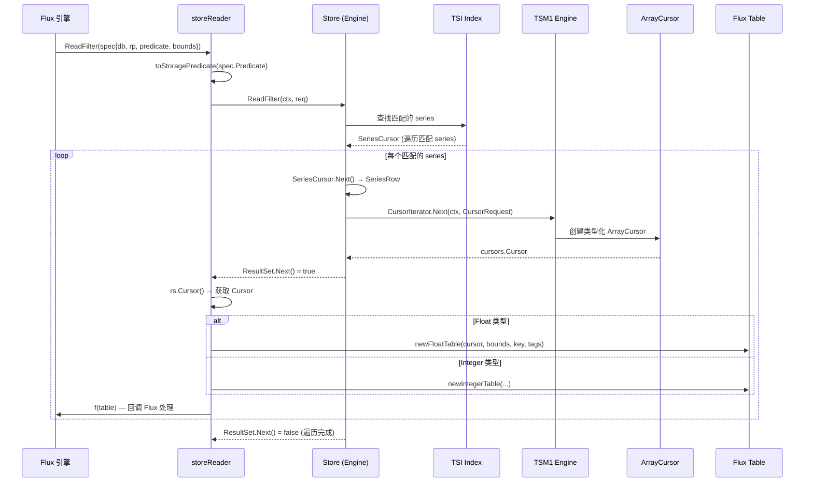

### 2.2 两条查询路径对比

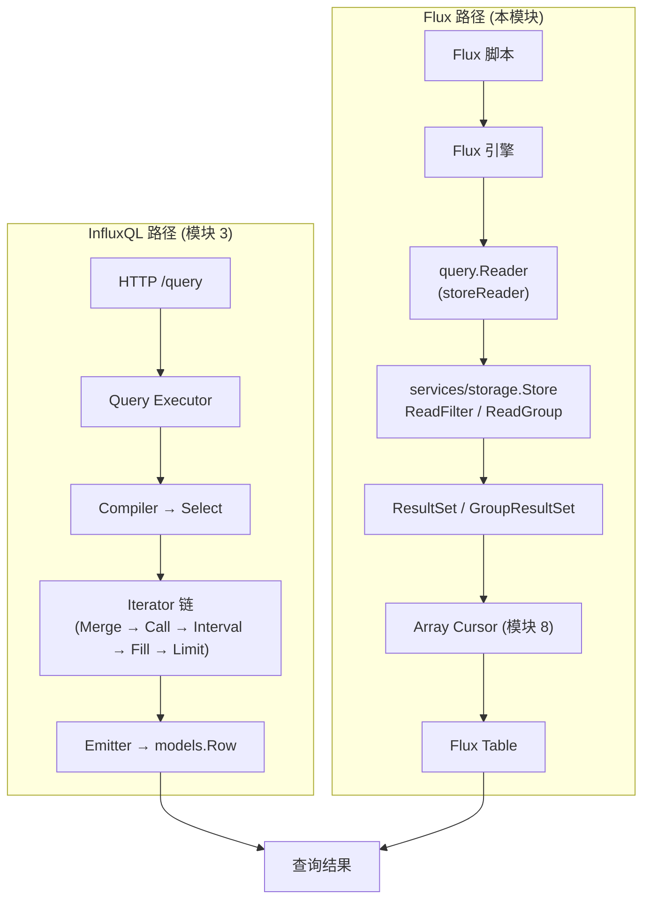

| 维度 | InfluxQL 路径 | Flux 路径 |
|------|--------------|-----------|
| **语法** | SQL-like | Flux 脚本语言 |
| **数据模型** | 逐点 Iterator | 批量 Array Cursor → Table |
| **聚合位置** | Iterator 链中 (Go) | Flux 引擎中 (可能跨节点) |
| **Predicate** | WHERE 子句 → influxql.Expr | Protobuf Predicate → influxql.Expr |
| **分组** | GROUP BY tag → Iterator 分组 | GroupResultSet → GroupCursor |

## 3. storeReader — Flux 到 Storage 的桥接

### 3.1 接口实现

```go
// storage/flux/reader.go — storeReader
type storeReader struct {
    s storage.Store  // services/storage.Store，底层存储引擎适配层
}

func NewReader(s storage.Store) query.Reader {
    return &storeReader{s: s}
}

// ReadFilter: 无聚合查询
func (r *storeReader) ReadFilter(ctx context.Context, spec influxdb.ReadFilterSpec, alloc *memory.Allocator) (influxdb.TableIterator, error) {
    return &filterIterator{
        ctx:   ctx,
        s:     r.s,
        spec:  spec,
        cache: newTagsCache(0),
        alloc: alloc,
    }, nil
}

// ReadGroup: 聚合/分组查询
func (r *storeReader) ReadGroup(ctx context.Context, spec influxdb.ReadGroupSpec, alloc *memory.Allocator) (influxdb.TableIterator, error) {
    return &groupIterator{
        ctx:   ctx,
        s:     r.s,
        spec:  spec,
        cache: newTagsCache(0),
        alloc: alloc,
    }, nil
}
```

### 3.2 filterIterator.Do — 无聚合查询执行

```go
// storage/flux/reader.go — Do
func (fi *filterIterator) Do(f func(flux.Table) error) error {
    // 1. 获取数据源
    src := fi.s.GetSource(fi.spec.Database, fi.spec.RetentionPolicy)

    // 2. 构建 protobuf 请求
    var req datatypes.ReadFilterRequest
    req.ReadSource = any  // protobuf Any 类型
    req.Predicate = predicate  // 转换后的 predicate
    req.Range.Start = int64(fi.spec.Bounds.Start)
    req.Range.End = int64(fi.spec.Bounds.Stop)

    // 3. 调用 Store
    rs, err := fi.s.ReadFilter(fi.ctx, &req)

    // 4. 遍历 ResultSet
    return fi.handleRead(f, rs)
}
```

### 3.3 handleRead — 从 Cursor 到 Flux Table

```go
// storage/flux/reader.go — handleRead
func (fi *filterIterator) handleRead(f func(flux.Table) error, rs ResultSet) error {
    // 注意：简化版本省略了 defer 资源管理和 ctx.Done() 取消路径
    // 实际代码中 defer 块负责释放 table、cur、rs 和 fi.cache
    // 且 done 通道等待使用 select 监听 ctx.Done()，超时时调用 table.Cancel() 并 break READ
    defer rs.Close()

    for rs.Next() {
        cur = rs.Cursor()
        if cur == nil {
            continue  // 该 series 无数据
        }

        // 根据 Cursor 类型创建对应的 Flux Table
        bnds := fi.spec.Bounds
        key := defaultGroupKeyForSeries(rs.Tags(), bnds)
        done := make(chan struct{})

        switch typedCur := cur.(type) {
        case cursors.IntegerArrayCursor:
            cols, defs := determineTableColsForSeries(rs.Tags(), flux.TInt)
            table = newIntegerTable(done, typedCur, bnds, key, cols, rs.Tags(), defs, fi.cache, fi.alloc)

        case cursors.FloatArrayCursor:
            cols, defs := determineTableColsForSeries(rs.Tags(), flux.TFloat)
            table = newFloatTable(done, typedCur, bnds, key, cols, rs.Tags(), defs, fi.cache, fi.alloc)

        case cursors.UnsignedArrayCursor:
            table = newUnsignedTable(...)

        case cursors.BooleanArrayCursor:
            table = newBooleanTable(...)

        case cursors.StringArrayCursor:
            table = newStringTable(...)
        }

        // 调用 Flux 回调处理 table
        if !table.Empty() {
            if err := f(table); err != nil {
                table.Close()
                table = nil
                return err
            }
            select {
            case <-done:
            case <-fi.ctx.Done():
                table.Cancel()
                break READ
            }
        }

        // 累积统计
        stats := table.Statistics()
        fi.stats.ScannedValues += stats.ScannedValues
        fi.stats.ScannedBytes += stats.ScannedBytes
        table.Close()
    }
    return rs.Err()
}
```

> **小白解释**: `handleRead` 就像一个流水线工人——
> 1. 从传送带（ResultSet）上拿 series
> 2. 根据类型包装成对应的盒子（Flux Table）
> 3. 把盒子交给质检员（Flux 回调函数 f）
> 4. 等质检员处理完，再拿下一个

### 3.4 determineTableColsForSeries — 构建 Table 列定义

```go
// storage/flux/reader.go:454-481 — determineTableColsForSeries
func determineTableColsForSeries(tags models.Tags, typ flux.ColType) ([]flux.ColMeta, [][]byte) {
    cols := make([]flux.ColMeta, 4+len(tags))
    defs := make([][]byte, 4+len(tags))
    cols[startColIdx] = flux.ColMeta{Label: execute.DefaultStartColLabel, Type: flux.TTime}   // "_start"
    cols[stopColIdx]  = flux.ColMeta{Label: execute.DefaultStopColLabel,  Type: flux.TTime}   // "_stop"
    cols[timeColIdx]  = flux.ColMeta{Label: execute.DefaultTimeColLabel,  Type: flux.TTime}   // "_time"
    cols[valueColIdx] = flux.ColMeta{Label: execute.DefaultValueColLabel, Type: typ}          // "_value"

    // 剩余列是 tag 列
    for j, tag := range tags {
        cols[4+j] = flux.ColMeta{Label: string(tag.Key), Type: flux.TString}
        defs[4+j] = []byte("")
    }
    return cols, defs
}
```

> **审计校准**: 列名不是硬编码字符串字面量，而是引用 `execute.DefaultStartColLabel` /
> `execute.DefaultStopColLabel` / `execute.DefaultTimeColLabel` /
> `execute.DefaultValueColLabel` 常量 (reader.go:457-472)。这些常量由 Flux `execute`
> 包统一定义，保证 storage 层和 Flux 引擎列名一致。

**Table 结构示例**:

| _start | _stop | _time | _value | host | region |
|--------|-------|-------|--------|------|--------|
| 10:00 | 11:00 | 10:00:01 | 87.3 | web01 | us-east |
| 10:00 | 11:00 | 10:00:02 | 88.1 | web01 | us-east |
| 10:00 | 11:00 | 10:00:03 | 86.9 | web01 | us-east |

## 4. GroupResultSet — 聚合/分组查询

### 4.1 groupResultSet 结构

```go
// storage/reads/group_resultset.go:14-31 — groupResultSet
type groupResultSet struct {
    ctx          context.Context
    req          *datatypes.ReadGroupRequest   // 注意：是 *ReadGroupRequest (聚合路径)
    agg          *datatypes.Aggregate
    arrayCursors multiShardCursors             // 类型是 multiShardCursors 接口，非 ArrayCursors

    i             int
    seriesRows    []*SeriesRow                 // 指针切片
    keys          [][]byte
    nilSort       []byte
    groupByCursor groupByCursor
    km            KeyMerger

    newSeriesCursorFn func() (SeriesCursor, error)  // 不带 ctx 参数 (ctx 在 NewGroupResultSet 闭包里捕获)
    nextGroupFn       func(c *groupResultSet) GroupCursor

    eof bool
}
```

> **审计校准**: 真实结构体没有 `newCursorFn` 字段；series cursor 的创建由
> `newSeriesCursorFn` (外部注入) 负责，typed array cursor 由 `arrayCursors.createCursor(row)`
> 在 groupNoneCursor/groupByCursor 内部创建。也没有 `sortFn` 字段——排序是直接调用
> `g.groupBySort()` / `g.groupNoneSort()` 完成的 (见 §4.2)。

### 4.2 两种分组模式

```go
// storage/reads/group_resultset.go:71 — 分组模式分发 (switch req.Group)
switch req.Group {
case datatypes.ReadGroupRequest_GroupBy:
    g.nextGroupFn = groupByNextGroup
    g.groupByCursor = groupByCursor{...}
    if n, err := g.groupBySort(); n == 0 || err != nil {   // line 81 — 直接调用，非 sortFn 字段
        return nil
    }

case datatypes.ReadGroupRequest_GroupNone:
    g.nextGroupFn = groupNoneNextGroup
    if n, err := g.groupNoneSort(); n == 0 || err != nil {  // line 88 — 直接调用，非 sortFn 字段
        return nil
    }
}
```

> **审计校准**: groupResultSet 中唯一的函数字段是 `nextGroupFn`。排序是通过直接调用
> `g.groupBySort()` (line 81) / `g.groupNoneSort()` (line 88) 完成的，**没有**
> `sortFn` 字段。枚举常量是 `datatypes.ReadGroupRequest_GroupBy` /
> `datatypes.ReadGroupRequest_GroupNone` (ReadGroupRequest 的嵌套枚举)，不是裸的
> `datatypes.GroupBy` / `datatypes.GroupNone`。

| 分组模式 | 说明 | 适用场景 |
|---------|------|---------|
| `ReadGroupRequest_GroupNone` | 不分组，所有 series 作为一个组返回 | `SELECT value FROM cpu` |
| `ReadGroupRequest_GroupBy` | 按指定 tag 分组，每个唯一 tag 值组合形成独立分组 | `SELECT mean(value) FROM cpu GROUP BY host` |

### 4.3 GroupBy 分组流程

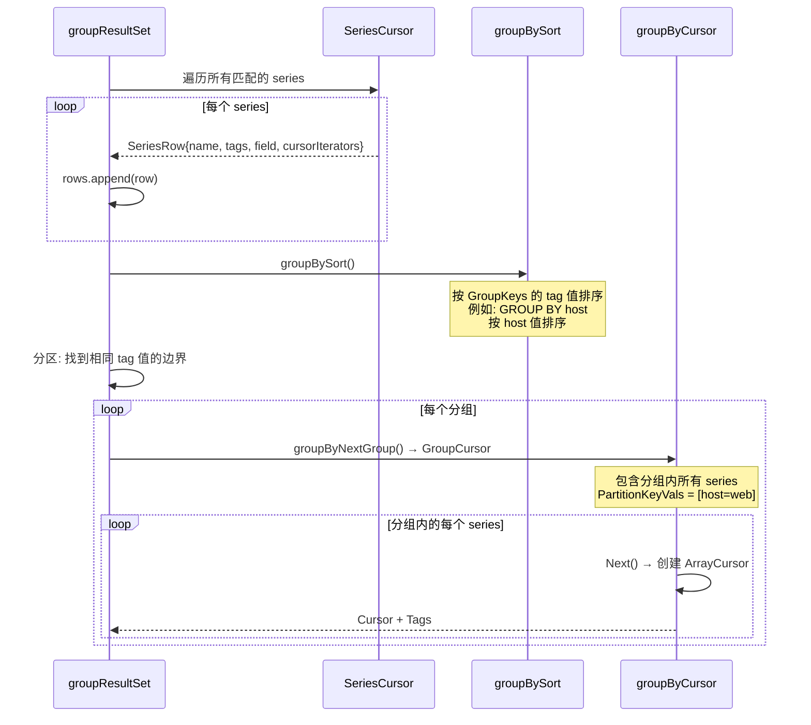

## 5. Predicate 求值 — 条件过滤

### 5.1 Predicate 转换流程

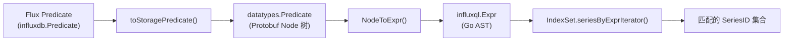

### 5.2 datatypes.Predicate — Protobuf 表示

```go
// storage/reads/datatypes/predicate.pb.go — Predicate (生成代码)
type Predicate struct {
    Root *Node  // 表达式树的根节点
}

type Node struct {
    NodeType Node_Type  // 节点类型 (枚举类型为 Node_Type，不是裸 NodeType)
    Value    isNode_Value  // 值 (联合类型)
    Children []*Node   // 子节点
}

// Node_Type 枚举 (predicate.pb.go:25-32):
// - Node_TypeComparisonExpression  (=, !=, <, <=, >, >=, =~, !~)
// - Node_TypeLogicalExpression     (AND, OR)
// - Node_TypeParenExpression       (括号)
// - Node_TypeTagRef                (tag 引用)
// - Node_TypeFieldRef              (field 引用)
// - Node_TypeLiteral               (字面量)
//
// Node_Comparison 枚举 (predicate.pb.go:83-93):
// - Node_ComparisonEqual / Node_ComparisonNotEqual
// - Node_ComparisonStartsWith / Node_ComparisonRegex / Node_ComparisonNotRegex
// - Node_ComparisonLess / Node_ComparisonLessEqual
// - Node_ComparisonGreater / Node_ComparisonGreaterEqual
```

### 5.3 NodeToExpr — Protobuf 到 InfluxQL AST

```go
// storage/reads/influxql_predicate.go:16 — NodeToExpr
func NodeToExpr(node *datatypes.Node, remap map[string]string) (influxql.Expr, error) {
    v := &nodeToExprVisitor{remap: remap}
    WalkNode(v, node)

    // 后处理: 重写正则条件 (利用索引优化)
    stmt := &influxql.SelectStatement{Condition: v.exprs[0]}
    stmt.RewriteRegexConditions()
    return stmt.Condition, nil
}
```

**转换示例**:

> **具体案例**: Flux 查询 `|> filter(fn: (r) => r.host == "web" and r._value > 50.0)`
>
> ```
> Protobuf Predicate:
>   LogicalExpression(AND)
>   ├── ComparisonExpression(EQ)
>   │   ├── TagRef("host")
>   │   └── StringLiteral("web")
>   └── ComparisonExpression(GT)
>       ├── FieldRef("$")
>       └── FloatLiteral(50.0)
>
> 转换后的 influxql.Expr:
>   BinaryExpr(AND)
>   ├── BinaryExpr(EQ)
>   │   ├── VarRef{Val: "host", Type: Tag}
>   │   └── StringLiteral{Val: "web"}
>   └── BinaryExpr(GT)
>       ├── VarRef{Val: "$"}
>       └── NumberLiteral{Val: 50.0}
>
> 最终用于 IndexSet.seriesByExprIterator():
>   → host='web' 匹配的 series
>   → _value > 50.0 在 Cursor 层过滤
> ```

### 5.4 Predicate 类型映射

| Protobuf Node_Comparison | InfluxQL Expr | 说明 |
|------------------|---------------|------|
| `Node_ComparisonEqual` | `influxql.EQ` | `tag = 'value'` |
| `Node_ComparisonNotEqual` | `influxql.NEQ` | `tag != 'value'` |
| `Node_ComparisonRegex` | `influxql.EQREGEX` | `tag =~ /regex/` |
| `Node_ComparisonNotRegex` | `influxql.NEQREGEX` | `tag !~ /regex/` |
| `Node_ComparisonLess` | `influxql.LT` | `value < 50` |
| `Node_ComparisonLessEqual` | `influxql.LTE` | `value <= 50` |
| `Node_ComparisonGreater` | `influxql.GT` | `value > 50` |
| `Node_ComparisonGreaterEqual` | `influxql.GTE` | `value >= 50` |
| `Node_LogicalAnd` | `influxql.AND` | `expr1 AND expr2` |
| `Node_LogicalOr` | `influxql.OR` | `expr1 OR expr2` |
| `Node_TypeTagRef` | `influxql.VarRef{Type: Tag}` | tag 引用 |
| `Node_TypeFieldRef` | `influxql.VarRef{Val: "$"}` | field 值引用 |
| `Node_TypeLiteral` | 各种 Literal 类型 | 字面量 |

> **审计校准**: 枚举值在 `predicate.pb.go` 中是 `Node_Type` / `Node_Comparison` /
> `Node_Logical` 三个独立枚举类型的成员，命名前缀分别是 `Node_Type…`、
> `Node_Comparison…`、`Node_Logical…`。裸的 `NodeTypeComparisonExpression` /
> `ComparisonEqual` / `LogicalAnd` 等命名不存在。

## 6. 多 Shard 游标管理

### 6.1 multiShardCursors 接口

```go
// storage/reads/resultset.go — multiShardCursors
type multiShardCursors interface {
    createCursor(row SeriesRow) cursors.Cursor
}
```

**职责**:
- `createCursor`: 为一个 series 创建跨多个 shard 的归并 Cursor
- 聚合包装不在该接口上；Group/WindowAggregate 路径会在拿到 Cursor 后调用
  `newAggregateArrayCursor(ctx, []*datatypes.Aggregate, cursor)`

### 6.2 聚合下推 (Aggregate Pushdown)

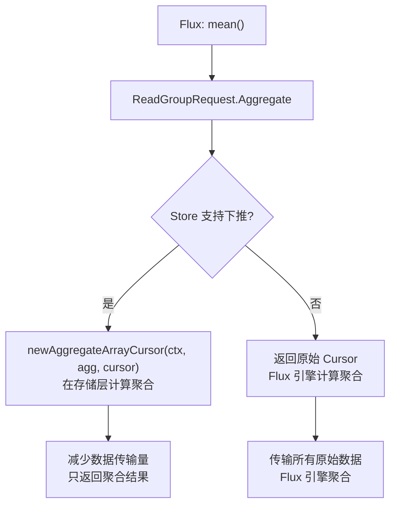

**支持的聚合类型** (datatypes.AggregateType):

| 类型 | 说明 |
|------|------|
| `AggregateTypeNone` | 无聚合 (原始数据) |
| `AggregateTypeSum` | 求和 |
| `AggregateTypeCount` | 计数 |
| `AggregateTypeFirst` | 第一个值 (selector) |
| `AggregateTypeLast` | 最后一个值 (selector) |
| `AggregateTypeMin` | 最小值 |
| `AggregateTypeMax` | 最大值 |
| `AggregateTypeMean` | 平均值 |

WindowAggregate 还支持 `mean,count` 双 aggregate 组合，用于同时输出 mean
语义所需的平均值和计数信息。

### 6.3 Multi-Shard 游标链式实现

> **小白解释**: 多 Shard 游标就像**接力赛**——第一个 Shard 的数据读完后，自动切换到第二个 Shard，对上层完全透明。

#### 6.3.1 multiShardArrayCursors — 工厂实现

```go
// storage/reads/array_cursor.go:75 — multiShardArrayCursors
type multiShardArrayCursors struct {
    ctx context.Context
    req cursors.CursorRequest

    cursors struct {
        i integerMultiShardArrayCursor
        f floatMultiShardArrayCursor
        u unsignedMultiShardArrayCursor
        b booleanMultiShardArrayCursor
        s stringMultiShardArrayCursor
    }
}

// storage/reads/array_cursor.go:119 — createCursor
func (m *multiShardArrayCursors) createCursor(row SeriesRow) cursors.Cursor {
    m.req.Name = row.Name
    m.req.Tags = row.SeriesTags
    m.req.Field = row.Field

    var cond expression
    if row.ValueCond != nil {
        cond = &astExpr{row.ValueCond}
    }

    var shard cursors.CursorIterator
    var cur cursors.Cursor
    for cur == nil && len(row.Query) > 0 {
        shard, row.Query = row.Query[0], row.Query[1:]
        cur, _ = shard.Next(m.ctx, &m.req)
    }

    if cur == nil {
        return nil
    }

    switch c := cur.(type) {
    case cursors.IntegerArrayCursor:
        m.cursors.i.reset(c, row.Query, cond)
        return &m.cursors.i
    case cursors.FloatArrayCursor:
        m.cursors.f.reset(c, row.Query, cond)
        return &m.cursors.f
    case cursors.UnsignedArrayCursor:
        m.cursors.u.reset(c, row.Query, cond)
        return &m.cursors.u
    case cursors.StringArrayCursor:
        m.cursors.s.reset(c, row.Query, cond)
        return &m.cursors.s
    case cursors.BooleanArrayCursor:
        m.cursors.b.reset(c, row.Query, cond)
        return &m.cursors.b
    default:
        panic(fmt.Sprintf("unreachable: %T", cur))
    }
}
```

#### 6.3.2 游标链式切换 — nextArrayCursor

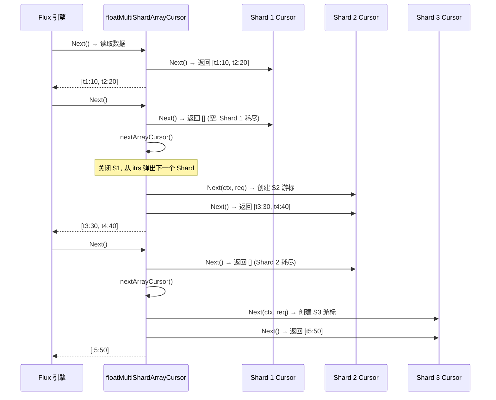

```go
// storage/reads/array_cursor.gen.go:310 — floatMultiShardArrayCursor.Next
// 注意: 以下为简化版本 — 实际代码还包含 filter 包装、类型断言错误处理和 c.err 设置
func (c *floatMultiShardArrayCursor) Next() *cursors.FloatArray {
	for {
		a := c.FloatArrayCursor.Next()
		if a.Len() == 0 {
			if c.nextArrayCursor() {
				continue
			}
		}
		return a
	}
}

// storage/reads/array_cursor.gen.go:329 — nextArrayCursor
// 注意: 以下为简化版本 — 实际代码还包含 filter reset、类型断言错误处理和 c.err 设置
func (c *floatMultiShardArrayCursor) nextArrayCursor() bool {
	if len(c.itrs) == 0 {
		return false
	}

	c.FloatArrayCursor.Close()

	var itr cursors.CursorIterator
	var cur cursors.Cursor
	var err error
	// 循环守卫包含 err == nil — 一旦某个 iterator 返回错误立即停止
	for cur == nil && len(c.itrs) > 0 && err == nil {
		itr, c.itrs = c.itrs[0], c.itrs[1:]
		cur, err = itr.Next(c.ctx, c.req)
	}

	c.err = err                          // 保存错误供上层 Err() 读取
	var ok bool
	if cur != nil && err == nil {
		var next cursors.FloatArrayCursor
		next, ok = cur.(cursors.FloatArrayCursor)
		if !ok {
			cur.Close()
			next = FloatEmptyArrayCursor
			c.err = errors.New("expected float cursor")   // 类型断言失败
		} else if c.filter != nil {
			// 有 filter 包装时，重新包装新 cursor
			c.filter.reset(next)
			next = c.filter
		}
		c.FloatArrayCursor = next
	} else {
		c.FloatArrayCursor = FloatEmptyArrayCursor
	}

	return ok
}
```

> **审计校准** (array_cursor.gen.go:329-365):
> - 循环守卫是 `for cur == nil && len(c.itrs) > 0 && err == nil`，比文档旧版的
>   `for cur == nil && len(c.itrs) > 0` 多一个 `err == nil` 条件。
> - `c.err = err` 在循环后显式赋值。
> - 类型断言失败时 `c.err = errors.New("expected float cursor")`。
> - 当存在 filter 时，会调用 `c.filter.reset(next)` 把 filter 重新包装到新 cursor 上。

multi-shard array cursor 不会同时持有多个 shard 的数据 cursor；它只持有当前
`FloatArrayCursor`/`IntegerArrayCursor` 等 typed cursor，以及剩余
`CursorIterator` 列表。当前 cursor 耗尽后，`nextArrayCursor()` 先 `Close()`
当前 cursor，再从剩余 iterator 中创建下一个 cursor。

#### 6.3.3 聚合下推 — Count/Sum/Selector/Min/Max/Mean 在存储层执行

```go
// storage/reads/array_cursor.go:19 — newAggregateArrayCursor
func newAggregateArrayCursor(ctx context.Context, agg []*datatypes.Aggregate, cursor cursors.Cursor) (cursors.Cursor, error) {
    switch agg[0].Type {
    case datatypes.Aggregate_AggregateTypeFirst, datatypes.Aggregate_AggregateTypeLast:
        return newLimitArrayCursor(cursor), nil
    }
    return NewWindowAggregateArrayCursor(ctx, agg, interval.Window{}, cursor)
}

func NewWindowAggregateArrayCursor(ctx context.Context, agg []*datatypes.Aggregate, window interval.Window, cursor cursors.Cursor) (cursors.Cursor, error) {
    if cursor == nil { return nil, nil }

    switch agg[0].Type {
    case datatypes.Aggregate_AggregateTypeCount:
        return newWindowCountArrayCursor(cursor, window), nil
    case datatypes.Aggregate_AggregateTypeSum:
        return newWindowSumArrayCursor(cursor, window)
    case datatypes.Aggregate_AggregateTypeFirst:
        return newWindowFirstArrayCursor(cursor, window), nil
    case datatypes.Aggregate_AggregateTypeLast:
        return newWindowLastArrayCursor(cursor, window), nil
    case datatypes.Aggregate_AggregateTypeMin:
        return newWindowMinArrayCursor(cursor, window), nil
    case datatypes.Aggregate_AggregateTypeMax:
        return newWindowMaxArrayCursor(cursor, window), nil
    case datatypes.Aggregate_AggregateTypeMean:
        if len(agg) == 2 && agg[1].Type == datatypes.Aggregate_AggregateTypeCount {
            return newWindowMeanCountArrayCursor(cursor, window)
        }
        return newWindowMeanArrayCursor(cursor, window)
    default:
        panic("invalid aggregate")
    }
}
```

**Sum 游标行为** (`array_cursor.gen.go:637-747` — `floatWindowSumArrayCursor`):

> **审计校准**: 该游标的真实类型名是 `floatWindowSumArrayCursor` (window 版)，
> 不是 `floatArraySumCursor`。它的 `Next()` 是**多窗口**实现——通过
> `window.GetLatestBounds` 枚举窗口，每个窗口产出一个点
> (`c.res.Timestamps[pos] = windowEnd`)，并在窗口内累加 `acc`。当输出缓冲满
> `MaxPointsPerBlock` 时，把剩余输入点暂存到 `c.tmp`，下次 `Next()` 继续处理。
> 这**不是**单点累加返回一个聚合结果。

```go
// storage/reads/array_cursor.gen.go:637 — floatWindowSumArrayCursor
type floatWindowSumArrayCursor struct {
    cursors.FloatArrayCursor
    res    *cursors.FloatArray
    tmp    *cursors.FloatArray   // 跨 Next() 调用的 carry-over 缓冲
    window interval.Window
}

func (c *floatWindowSumArrayCursor) Next() *cursors.FloatArray {
    pos := 0
    c.res.Timestamps = c.res.Timestamps[:cap(c.res.Timestamps)]
    c.res.Values     = c.res.Values[:cap(c.res.Values)]

    var a *cursors.FloatArray
    if c.tmp.Len() > 0 {        // 优先消费上次残留
        a = c.tmp
    } else {
        a = c.FloatArrayCursor.Next()
    }
    if a.Len() == 0 {
        return &cursors.FloatArray{}
    }

    rowIdx := 0
    var acc float64 = 0
    // 通过 window.GetLatestBounds 计算当前点的窗口结束时间
    windowEnd := int64(c.window.GetLatestBounds(values.Time(a.Timestamps[rowIdx])).Stop())
    windowHasPoints := false

WINDOWS:
    for {
        for ; rowIdx < a.Len(); rowIdx++ {
            ts := a.Timestamps[rowIdx]
            if ts >= windowEnd {
                // 进入新窗口: 先关闭旧窗口 (若有数据则产出一点)
                if windowHasPoints {
                    c.res.Timestamps[pos] = windowEnd
                    c.res.Values[pos]     = acc
                    pos++
                    if pos >= MaxPointsPerBlock {
                        // 输出缓冲满: 剩余输入暂存 tmp，下次 Next() 处理
                        c.tmp.Timestamps = a.Timestamps[rowIdx:]
                        c.tmp.Values     = a.Values[rowIdx:]
                        break WINDOWS
                    }
                }
                // 开新窗口
                acc = 0
                windowEnd = int64(c.window.GetLatestBounds(values.Time(ts)).Stop())
                windowHasPoints = false
                continue WINDOWS
            } else {
                acc += a.Values[rowIdx]
                windowHasPoints = true
            }
        }

        // 当前 batch 处理完，清理 tmp 并取下一批
        c.tmp.Timestamps = nil
        c.tmp.Values     = nil
        a = c.FloatArrayCursor.Next()
        if a.Len() == 0 {
            // 流结束: 关闭最后一个窗口
            if windowHasPoints {
                c.res.Timestamps[pos] = windowEnd
                c.res.Values[pos]     = acc
                pos++
            }
            break WINDOWS
        }
        rowIdx = 0
    }

    c.res.Timestamps = c.res.Timestamps[:pos]
    c.res.Values     = c.res.Values[:pos]
    return c.res
}
```

> **小白解释**: 聚合下推就像**在仓库里先打包**——不用把所有原始货物都运到店里再数，
> 而是在仓库里直接数好（Count）、称好总重量（Sum）、挑出首尾/最大最小值，
> 或计算平均值（Mean），只把结果运回来。
> 这大大减少了数据传输量。Sum 游标尤其要按窗口切分：每个 `aggregateWindow(every: 1m)`
> 窗口产出一个和值点，而不是把整条 series 压成单个总和。

#### 6.3.4 辅助组件

**limitSeriesCursor** (`storage/reads/series_cursor.go:27`):

```go
type limitSeriesCursor struct {
    SeriesCursor
    n, o, c int64  // n=limit, o=offset, c=current count
}

func (c *limitSeriesCursor) Next() *SeriesRow {
    // 首次调用: 跳过 offset 行
    if c.o > 0 {
        for i := int64(0); i < c.o; i++ {
            if c.SeriesCursor.Next() == nil { break }
        }
        c.o = 0
    }
    // 达到 limit 后停止
    if c.c >= c.n { return nil }
    c.c++
    return c.SeriesCursor.Next()
}
```

**KeyMerger** (`storage/reads/keymerger.go`):

双缓冲区设计——两个 key 切片交替使用，避免每次 merge 都分配新切片：

```go
type KeyMerger struct {
    i    int         // 交替索引: km.i & 1
    tmp  [][]byte    // 临时缓冲区
    keys [2][][]byte // 双缓冲区
}
```

`MergeKeys` 算法: 线性扫描检查是否已是前缀（快速路径）→ 标准 sorted merge 去重。

**tagsCache** (`storage/flux/tags_cache.go`):

| 维度 | 值 |
|------|-----|
| 策略 | LRU (Least Recently Used) |
| 最大条目 | 100 (`defaultMaxLengthForTagsCache`) |
| 存储内容 | Arrow `*array.String` tag 数组，以及 `_start/_stop` 使用的 `*array.Int` 数组 |
| 复用策略 | 长度匹配直接复用, 更大则切片, 更小则替换 |
| 驱逐时机 | `GetTag()` 插入时, 超过 max 则驱逐尾部 |

## 7. TagKeys / TagValues 查询

### 7.1 tagKeysIterator

```go
// storage/flux/reader.go — tagKeysIterator.Do
func (ti *tagKeysIterator) Do(f func(flux.Table) error) error {
    // 1. 构建请求
    var req datatypes.TagKeysRequest
    req.TagsSource = any
    req.Predicate = ti.predicate
    req.Range.Start = int64(ti.bounds.Start)
    req.Range.End = int64(ti.bounds.Stop)

    // 2. 调用 Store
    rs, err := ti.s.TagKeys(ti.ctx, &req)

    // 3. 构建单列 Table: _value (string)
    builder := execute.NewColListTableBuilder(key, ti.alloc)
    valueIdx, _ := builder.AddCol(flux.ColMeta{Label: "_value", Type: flux.TString})

    // 4. 添加保留 key: _start, _stop
    builder.AppendString(valueIdx, "_start")
    builder.AppendString(valueIdx, "_stop")

    // 5. 遍历结果
    for rs.Next() {
        v := rs.Value()
        // 映射内部 key 到 Flux 标准名
        switch v {
        case models.MeasurementTagKey:
            v = "_measurement"
        case models.FieldKeyTagKey:
            v = "_field"
        }
        builder.AppendString(valueIdx, v)
    }

    // 6. 构建 Table 并回调
    tbl, _ := builder.Table()
    return f(tbl)
}
```

### 7.2 Tag Key 映射

| 内部 Key | Flux 标准名 | 说明 |
|---------|------------|------|
| `models.MeasurementTagKey` | `_measurement` | measurement 名称 |
| `models.FieldKeyTagKey` | `_field` | field 名称 |
| 其他 | 原样返回 | 如 `host`, `region` |

## 8. 关键文件索引

| 文件 | 行数 | 职责 |
|------|------|------|
| `storage/reads/store.go` | 85 | reads.Store 接口: ReadFilter, ReadGroup, WindowAggregate, TagKeys, TagValues |
| `storage/reads/resultset.go` | 75 | ResultSet / GroupResultSet / GroupCursor 接口 |
| `storage/reads/series_cursor.go` | 52 | SeriesCursor / SeriesRow, limitSeriesCursor |
| `storage/flux/reader.go` | 115 | `NewReader(storage.Store) query.Reader`，storeReader (Flux→Storage 桥接), filterIterator, groupIterator, windowAggregateIterator |
| `storage/reads/group_resultset.go` | 346 | groupResultSet: GroupBy/GroupNone 分组实现 |
| `storage/reads/influxql_predicate.go` | 275 | NodeToExpr: Protobuf Predicate → influxql.Expr |
| `storage/reads/predicate.go` | 143 | PredicateToExprString: 调试用字符串表示 |
| `storage/reads/influxql_eval.go` | 284 | evalBinaryExpr: 条件求值 |
| `services/storage/store.go` | ~500 | services/storage.Store 实现 reads.Store，负责 shard 定位、TagKeys/TagValues 到 TSDBStore 的调用 |
| `storage/flux/reader.go` | 115 | storeReader: Flux → services/storage.Store 桥接，包含 ReadFilter/ReadGroup/ReadWindowAggregate/ReadTagKeys/ReadTagValues |
| `storage/flux/table.gen.go` | 生成文件 | 5 种类型的 Flux Table 实现 |
| `storage/flux/table.go` | Flux table | storageTable 接口 |
| `storage/flux/tags_cache.go` | tags cache | tagsCache: Flux Table 构造时复用 tag/start/stop 列数组 (减少分配) |
| `storage/reads/keymerger.go` | 109 | KeyMerger: 合并多个 series 的 tag key |
| `storage/reads/response_writer.go` | 287 | gRPC 响应写入器 |
| `storage/reads/datatypes/storage_common.pb.go` | ~2000 | Protobuf 定义: 请求/响应/节点类型 |
| `storage/reads/datatypes/predicate.pb.go` | ~500 | Protobuf 定义: Predicate/Node |
| `storage/reads/datatypes/hintflags.go` | ~30 | 查询优化提示标志 |

## 9. 架构设计意图

### 9.1 为什么用 Protobuf 定义 Predicate

| 维度 | Protobuf | influxql.Expr 直传 |
|------|----------|-------------------|
| **跨语言** | 支持 (gRPC) | 仅 Go |
| **版本兼容** | 字段编号保证 | 结构体变更破坏兼容 |
| **序列化效率** | 二进制, 小 | JSON, 大 |
| **网络传输** | 适合远程调用 | 仅本地 |

Flux 查询可能跨节点执行，Protobuf 的跨语言和版本兼容性是必需的。

### 9.2 为什么 ResultSet 和 GroupResultSet 分离

- **ResultSet**: 简单的 series 遍历，每个 series 独立返回。适合 `SELECT value FROM cpu WHERE host='web'`
- **GroupResultSet**: 先分组再遍历，适合 `SELECT mean(value) FROM cpu GROUP BY host`

分离避免了简单查询的分组开销。

### 9.3 为什么 Table 是回调模式

```go
rs.Do(func(table flux.Table) error {
    // Flux 引擎处理 table
    return nil
})
```

- **流式处理**: 不需要缓存所有结果
- **背压控制**: Flux 引擎处理速度决定读取速度
- **资源管理**: table 在回调结束后立即释放

### 9.4 WindowAggregate 下推路径校准

`WindowAggregate` 是当前源码中的核心 Flux 聚合入口，不能只用 `ReadGroup`
概括。它把 Flux 的 window aggregate spec 下推到 storage 层，最终由
`storage/reads/aggregate_resultset.go` 构造窗口结果。

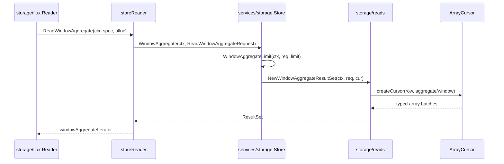

真实接口形状：

```go
// storage/flux/reader.go
func (r storeReader) ReadWindowAggregate(
    ctx context.Context,
    spec query.ReadWindowAggregateSpec,
    alloc memory.Allocator,
) (query.TableIterator, error)

// storage/reads/store.go
type Store interface {
    ReadFilter(context.Context, *datatypes.ReadFilterRequest) (ResultSet, error)
    ReadGroup(context.Context, *datatypes.ReadGroupRequest) (GroupResultSet, error)
    WindowAggregate(context.Context, *datatypes.ReadWindowAggregateRequest) (ResultSet, error)
    TagKeys(context.Context, *datatypes.TagKeysRequest) (cursors.StringIterator, error)
    TagValues(context.Context, *datatypes.TagValuesRequest) (cursors.StringIterator, error)
}
```

聚合下推支持 `count/sum/first/last/min/max/mean`，并支持 `mean,count`
双 aggregate 组合。代码入口不是单个 `*datatypes.Aggregate`，而是：

```go
func newAggregateArrayCursor(
    ctx context.Context,
    agg []*datatypes.Aggregate,
    cursor cursors.Cursor,
) (cursors.Cursor, error)
```

**案例**: Flux 查询 `range |> filter |> aggregateWindow(every: 1m, fn: mean)`
会被转换成 `ReadWindowAggregateRequest`。storage 层创建每个 series 的
array cursor 后，再用 `mean` 聚合 cursor 输出每个窗口的值。`last` 这类
selector 可以利用降序读取减少扫描；`mean` 则需要 sum/count 语义。

## 10. 潜在隐患与瓶颈

### 10.1 Predicate 转换的 StartsWith 未实现

```go
case datatypes.ComparisonStartsWith:
    v.err = errors.New("startsWith not implemented")
```

Flux 的 `startsWith` 操作符在 Predicate 转换层不支持，会返回错误。

### 10.2 Regex 编译无缓存

```go
case *datatypes.Node_RegexValue:
    re, err := regexp.Compile(val.RegexValue)  // 每次编译!
```

正则表达式每次查询都重新编译，高频查询场景可能成为 CPU 瓶颈。

### 10.3 多 Shard 归并的内存开销

`multiShardCursors` 只持有当前 shard 的 typed cursor 和剩余 iterator 列表；
切换 shard 时会先关闭当前 cursor，再创建下一个 cursor。内存风险主要来自单个
cursor 返回的大批量数组，而不是同时持有多个 shard cursor。

### 10.4 Tag Key 映射的硬编码

```go
case models.MeasurementTagKey:
    v = "_measurement"
case models.FieldKeyTagKey:
    v = "_field"
```

内部 key 到 Flux 标准名的映射是硬编码的，新增保留 key 需要修改此处。

## 11. 核心 Flow 补充讲解 (Mermaid + 代码 + Case)

> 本节针对模块中此前缺少"三件套"(Mermaid 图 + 代码级讲解 + 具体案例) 的核心 flow 逐项补齐。
> 每个小节均先引用源码确认行为，再给出图、签名/字段、案例。

### 11.1 windowAggregateIterator — 窗口聚合读路径

> **源码确认**: `storage/flux/reader.go:609-838`。
> `windowAggregateIterator` 是 Flux `aggregateWindow` / window aggregate 下推到 storage 层的
> Flux 端迭代器。它构建 `ReadWindowAggregateRequest`，调用 `Store.WindowAggregate`，
> 拿到 `ResultSet` 后在 `handleRead` 中按 selector / non-selector 分支构造 typed window table。

#### 11.1.1 结构体字段

```go
// storage/flux/reader.go:609-616
type windowAggregateIterator struct {
    ctx   context.Context
    s     storage.Store
    spec  query.ReadWindowAggregateSpec
    stats cursors.CursorStats
    cache *tagsCache
    alloc memory.Allocator
}
```

`spec` 中的关键字段（来自 `query.ReadWindowAggregateSpec`）：
- `spec.Aggregates []plan.ProcedureKind` — 聚合种类（`"mean"`/`"count"`/`"last"` …），可能含 1 或 2 个元素
- `spec.Window.Every/Period/Offset` — 窗口定义
- `spec.CreateEmpty bool` — 空窗口是否产出空表
- `spec.TimeColumn string` — 非空表示 `aggregateWindow()` 调用（带 `_time` 列）

#### 11.1.2 Next() 循环 + selector 分支

```go
// storage/flux/reader.go:689-700 — handleRead 入口
func (wai *windowAggregateIterator) handleRead(f func(flux.Table) error, rs storage.ResultSet) error {
    createEmpty := wai.spec.CreateEmpty
    selector := len(wai.spec.Aggregates) > 0 && isSelector(wai.spec.Aggregates[0])  // line 692
    timeColumn := wai.spec.TimeColumn
    if timeColumn == "" {                       // 没有 _time 列 → 需要 splitWindows
        tableFn := f
        f = func(table flux.Table) error {
            return splitWindows(wai.ctx, wai.alloc, table, selector, tableFn)  // window.go:20
        }
    }
    window, err := interval.NewWindow(wai.spec.Window.Every, wai.spec.Window.Period, wai.spec.Window.Offset)
    // ...
```

每个 typed cursor 分支（以 Float 为例，reader.go:755-768）的三路：

```go
// storage/flux/reader.go:755-768 (FloatArrayCursor 分支)
case cursors.FloatArrayCursor:
    if !selector {                                   // 非 selector: count/sum/min/max/mean
        cols, defs := determineTableColsForWindowAggregate(rs.Tags(), flux.TFloat, hasTimeCol)
        table = newFloatWindowTable(done, typedCur, bnds, window, createEmpty, timeColumn,
            key, cols, rs.Tags(), defs, wai.cache, wai.alloc)
    } else if createEmpty && !hasTimeCol {           // selector + createEmpty + 无 _time
        cols, defs := determineTableColsForSeries(rs.Tags(), flux.TFloat)
        table = newFloatEmptyWindowSelectorTable(done, typedCur, bnds, window, timeColumn,
            key, cols, rs.Tags(), defs, wai.cache, wai.alloc)
    } else {                                         // selector + aggregateWindow（带 _time）
        cols, defs := determineTableColsForSeries(rs.Tags(), flux.TFloat)
        table = newFloatWindowSelectorTable(done, typedCur, bnds, window, timeColumn,
            key, cols, rs.Tags(), defs, wai.cache, wai.alloc)
    }
```

`isSelector` / `isAggregateCount` 定义 (reader.go:685-687, 840-842)：

```go
// storage/flux/reader.go:684-687
func isSelector(kind plan.ProcedureKind) bool {
    return kind == FirstKind || kind == LastKind || kind == MinKind || kind == MaxKind
}
// storage/flux/reader.go:840-842
func isAggregateCount(kind plan.ProcedureKind) bool { return kind == CountKind }
```

#### 11.1.3 Next() 循环流程图

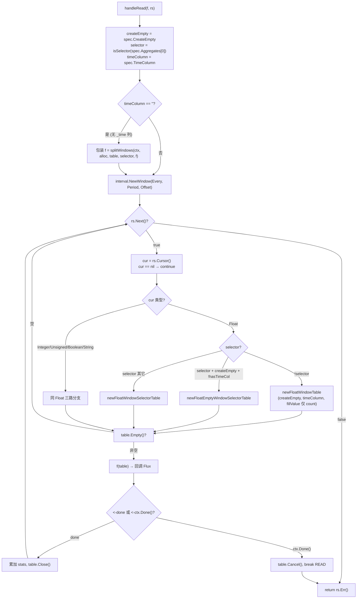

#### 11.1.4 createEmpty / splitWindows / 每窗口 emit

- `createEmpty` 由 Flux 的 `aggregateWindow(createEmpty: true)` 透传，决定空窗口是否产出空表。
  只有 **selector + createEmpty + 无 `_time` 列** 时走 `EmptyWindowSelectorTable`；其余 selector 分支
  注释明确指出 `aggregateWindow()` 自身会移除空表，不再额外构造 (reader.go:762-765, 776-779 等处注释)。
- `splitWindows` (storage/flux/window.go:20) 在 `timeColumn == ""` 时把整张 table 按窗口拆成多张子表
  回调 `f`，使上层 Flux 看到的是"每窗口一张表"的语义。
- 每个窗口产出点的真正逻辑在底层 typed window table + `NewWindowAggregateArrayCursor`
  (array_cursor.go:28) 中——按 `window.GetLatestBounds` 枚举窗口，每窗口累加后 emit 一个点
  (见 §6.3.3 `floatWindowSumArrayCursor` 的多窗口实现)。

#### 11.1.5 案例：1m 窗口 mean，3 个点

> **具体案例**: Flux `from(bucket:"b") |> range(start: 10:00, stop: 10:01) |> aggregateWindow(every: 1m, fn: mean)`
>
> 假设 series `cpu,host=web01` 在 `[10:00:00, 10:01:00)` 内有 3 个 float 点：
> ```
> _time               _value
> 10:00:10            10.0
> 10:00:30            20.0
> 10:00:50            30.0
> ```
>
> 执行轨迹：
> 1. `storeReader.ReadWindowAggregate` → `windowAggregateIterator.Do` (reader.go:620)
> 2. `spec.Aggregates = ["mean"]`，`isSelector("mean") = false` → 走 **non-selector** 分支
> 3. `timeColumn == ""` (aggregateWindow 无 `_time`) → `f` 被 `splitWindows` 包装
> 4. `interval.NewWindow(1m, 1m, 0)` 得到 1 分钟窗口
> 5. `rs.Next()` → 拿到 `FloatArrayCursor` → `newFloatWindowTable(...)`
> 6. 底层 `NewWindowAggregateArrayCursor` 内 `mean` 路径创建 `floatWindowMeanArrayCursor`
>    (array_cursor.gen.go)，它在单窗口内累加 `sum=60.0, n=3`，emit `mean = 20.0`
> 7. `splitWindows` 把该 1 行表回调给 Flux
>
> 输出表 (`_time` 列被 `determineTableColsForWindowAggregate` 省略，见 §11.2)：
>
> | _start | _stop | _value | host |
> |--------|-------|--------|------|
> | 10:00 | 10:01 | 20.0 | web01 |

### 11.2 determineTableColsForWindowAggregate / determineTableColsForGroup — 聚合列定义规则

> **源码确认**:
> - `determineTableColsForWindowAggregate`: `storage/flux/reader.go:410-452`
> - `determineTableColsForGroup`: `storage/flux/reader.go:514-581`
> - 列索引常量: `storage/flux/reader.go:402-408`

#### 11.2.1 列索引常量

```go
// storage/flux/reader.go:402-408
const (
    startColIdx            = 0
    stopColIdx             = 1
    timeColIdx             = 2
    valueColIdxWithoutTime = 2   // 聚合(无 _time)时 _value 落在 index 2
    valueColIdx            = 3   // 有 _time 时 _value 落在 index 3
)
```

#### 11.2.2 WindowAggregate 列规则

```go
// storage/flux/reader.go:410-452 (摘要)
func determineTableColsForWindowAggregate(tags models.Tags, typ flux.ColType, hasTimeCol bool) ([]flux.ColMeta, [][]byte) {
    size := 3                       // aggregates remove the _time column (line 415)
    if hasTimeCol { size++ }        // 只有带 _time 时才加一列
    cols := make([]flux.ColMeta, size+len(tags))
    defs := make([][]byte, size+len(tags))
    cols[startColIdx] = ...{Label: execute.DefaultStartColLabel, Type: flux.TTime}
    cols[stopColIdx]  = ...{Label: execute.DefaultStopColLabel,  Type: flux.TTime}
    if hasTimeCol {
        cols[timeColIdx]   = ...{Label: execute.DefaultTimeColLabel,  Type: flux.TTime}
        cols[valueColIdx]  = ...{Label: execute.DefaultValueColLabel, Type: typ}
    } else {
        cols[valueColIdxWithoutTime] = ...{Label: execute.DefaultValueColLabel, Type: typ}  // 无 _time
    }
    for j, tag := range tags { cols[size+j] = ...{Label: string(tag.Key), Type: flux.TString}; defs[size+j] = []byte("") }
    return cols, defs
}
```

关键规则：聚合查询默认 **省略 `_time` 列**，`_value` 前移到 index 2；仅当 `hasTimeCol == true`
(即 `aggregateWindow()` 带 `_time`) 时才补回 `_time` 列。

#### 11.2.3 Group 列规则

```go
// storage/flux/reader.go:514-581 (关键分支)
func determineTableColsForGroup(tagKeys [][]byte, typ flux.ColType, agg *datatypes.Aggregate, groupKey flux.GroupKey) ([]flux.ColMeta, [][]byte) {
    if agg == nil || IsSelector(agg) {
        colSize += 4 + len(tagKeys)        // _start, _stop, _time, _value + tags
    } else {
        colSize = len(groupKey.Cols()) + 1 // 聚合: group keys + _value, 无 _time
    }
    // ...
    if agg == nil || IsSelector(agg) {
        cols[timeColIdx]  = ...{Label: execute.DefaultTimeColLabel,  Type: flux.TTime}   // 有 _time
        cols[valueColIdx] = ...{Label: execute.DefaultValueColLabel, Type: typ}
        // + tags
    } else {
        cols[valueColIdxWithoutTime] = ...{Label: execute.DefaultValueColLabel, Type: typ} // 无 _time
        for j := 2; j < len(groupKey.Cols()); j++ {                                        // 跳过 _start/_stop
            cols[1+j] = ...{Label: groupKey.Cols()[j].Label, Type: groupKey.Cols()[j].Type}
        }
    }
}
```

`IsSelector` (reader.go:506-512) 判定 `min/max/first/last`。selector 与无聚合走 `_start/_stop/_time/_value + tags`；
非 selector 聚合 (count/sum/mean) 走 `_start/_stop/_value + group key 列`，**无 `_time`**。

#### 11.2.4 列定义流程图

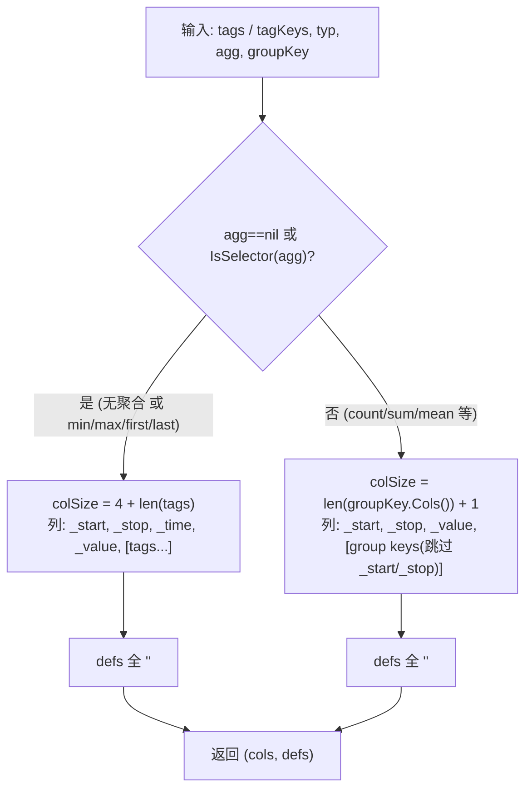

#### 11.2.5 案例：GROUP BY mean

> **具体案例**: Flux `from(bucket:"b") |> range(...) |> group(columns:["host"]) |> mean()`
>
> `groupIterator.handleRead` 调用 `determineTableColsForGroup(gc.Keys(), flux.TFloat, gc.Aggregate(), key)`，
> 此时 `agg.Type == Aggregate_AggregateTypeMean`，`IsSelector(mean) == false` → 走**无 `_time`** 分支。
>
> 假设 `gc.Keys() = [host]`，`groupKey.Cols() = [_start, _stop, host]`：
>
> | 输入 series tags (cpu,host=web01) | 输出 cols |
> |---|---|
> | tags = {host=web01} | `_start` (TTime, idx0)<br>`_stop` (TTime, idx1)<br>`_value` (TFloat, idx2 = valueColIdxWithoutTime)<br>`host` (TString, idx3 = 1+j, j=2) |
>
> 对比无聚合路径 (`agg==nil`)：会多一列 `_time` (idx2)，`_value` 落 idx3，`host` 落 idx4。
> 即"聚合查询省略 `_time`，`_value` 前移"这条规则在 WindowAggregate 与 Group 两条路径上是一致的。

### 11.3 IsAscendingWindowAggregate / IsAscendingGroupAggregate — last() 降序游标优化

> **源码确认**:
> - `IsAscendingWindowAggregate`: `storage/reads/aggregate_resultset.go:25-48`
> - `IsAscendingGroupAggregate`: `storage/reads/group_resultset.go:43-48`
> - 降序游标构造: `NewWindowAggregateResultSet` (aggregate_resultset.go:50-69) 与
>   `NewGroupResultSet` (group_resultset.go:50-97) 调用
>   `newMultiShardArrayCursors(ctx, start, end, ascending)`

#### 11.3.1 IsAscendingWindowAggregate

```go
// storage/reads/aggregate_resultset.go:25-48
// IsAscendingWindowAggregate checks two things: If the request passed in
// is using the `last` aggregate type, and if it doesn't have a window. If both
// conditions are met, it returns false, otherwise, it returns true.
func IsAscendingWindowAggregate(req *datatypes.ReadWindowAggregateRequest) bool {
    if len(req.Aggregate) != 1 {
        // Descending optimization for last only applies when it is the only aggregate.
        return true
    }
    // The following is an optimization where in the case of a single window,
    // the selector `last` is implemented as a descending array cursor followed
    // by a limit array cursor that selects only the first point, i.e the point
    // with the largest timestamp, from the descending array cursor.
    if req.Aggregate[0].Type == datatypes.Aggregate_AggregateTypeLast {
        if req.Window == nil {
            if req.WindowEvery == 0 || req.WindowEvery == math.MaxInt64 {
                return false
            }
        } else if (req.Window.Every.Nsecs == 0 && req.Window.Every.Months == 0) || req.Window.Every.Nsecs == math.MaxInt64 {
            return false
        }
    }
    return true
}
```

#### 11.3.2 IsAscendingGroupAggregate

```go
// storage/reads/group_resultset.go:43-48
// IsAscendingGroupAggregate checks if this request is using the `last` aggregate type.
// It returns true if an ascending cursor should be used (all other conditions)
// or a descending cursor (when `last` is used).
func IsAscendingGroupAggregate(req *datatypes.ReadGroupRequest) bool {
    return req.Aggregate == nil || req.Aggregate.Type != datatypes.Aggregate_AggregateTypeLast
}
```

#### 11.3.3 降序选择条件与原因

`last()` 的语义是"取时间戳最大的点"。若用升序游标，必须扫到 series 末尾才能确定 last；
改用**降序游标**后，第一个返回的点即为 last，配合 `newLimitArrayCursor` (array_cursor.go:19-23)
只取 1 点即可短路。条件：aggregate 必须是**单一的 `last`**，且窗口为"整段"(every==0 或 MaxInt64，
即无窗口或单窗口)——多窗口 `last` 仍需升序遍历以按时序切窗。

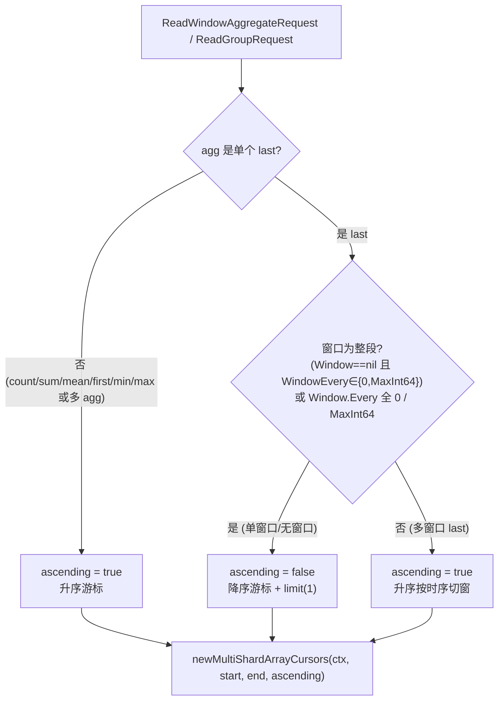

#### 11.3.4 案例：last() 单窗口

> **具体案例**: Flux `from(bucket:"b") |> range(start: -1h) |> last()`
>
> - `req.Aggregate = [{Type: Aggregate_AggregateTypeLast}]`，`len == 1`
> - `req.Window == nil`，`req.WindowEvery == 0` → 满足"整段"条件
> - `IsAscendingWindowAggregate` 返回 **false** → `ascending = false`
> - `newMultiShardArrayCursors(..., false)` 创建降序 array cursor
> - `newAggregateArrayCursor` (array_cursor.go:19) 对 `last` 走 `newLimitArrayCursor(cursor)`，
>   只取降序游标返回的第一个点 (即最大时间戳的点)
>
> 对比：`aggregateWindow(every: 1m, fn: last)` 时 `Window.Every.Nsecs != 0`，不满足整段条件，
> `IsAscendingWindowAggregate` 返回 **true**，按升序逐窗口取 last。

### 11.4 seriesHasPoints — GroupBy 空系列探测

> **源码确认**: `storage/reads/group_resultset.go:120-149`。
> 注释原文 (line 120-121): "seriesHasPoints reads the first block of TSM data to verify the series
> has points for the time range of the query."  作者 sgc 注 (line 123): "this is expensive.
> Storage engine must provide efficient time range queries of series keys."

#### 11.4.1 实现

```go
// storage/reads/group_resultset.go:122-149
// seriesHasPoints reads the first block of TSM data to verify the series has points for
// the time range of the query.
func (g *groupResultSet) seriesHasPoints(row *SeriesRow) bool {
    // TODO(sgc): this is expensive. Storage engine must provide efficient time range queries of series keys.
    cur := g.arrayCursors.createCursor(*row)
    var ts []int64
    switch c := cur.(type) {
    case cursors.IntegerArrayCursor:
        a := c.Next()
        ts = a.Timestamps
    case cursors.FloatArrayCursor:
        a := c.Next()
        ts = a.Timestamps
    case cursors.UnsignedArrayCursor:
        a := c.Next()
        ts = a.Timestamps
    case cursors.BooleanArrayCursor:
        a := c.Next()
        ts = a.Timestamps
    case cursors.StringArrayCursor:
        a := c.Next()
        ts = a.Timestamps
    case nil:
        return false
    default:
        panic(fmt.Sprintf("unreachable: %T", c))
    }
    cur.Close()
    return len(ts) > 0
}
```

#### 11.4.2 调用点与 allTime 旁路

```go
// storage/reads/group_resultset.go:230, 234 (groupBySort)
allTime := datatypes.HintFlags(g.req.Hints).HintSchemaAllTime()
// ...
for seriesRow != nil {
    if allTime || g.seriesHasPoints(seriesRow) {   // line 234
        // ... 复制 tags, 构造 SortKey, append 到 seriesRows
    }
    seriesRow = seriesCursor.Next()
}
```

同样在 `groupNoneSort` (group_resultset.go:170-192) line 183 调用。
当 `HintSchemaAllTime()` 为 true 时（schema-only 查询，不关心具体点），跳过探测直接保留 series。

#### 11.4.3 探测/跳过流程

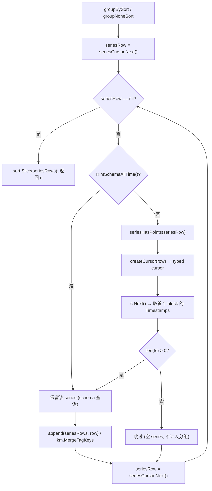

#### 11.4.4 案例：GroupBy 跳过空 series

> **具体案例**: Flux `from(bucket:"b") |> range(start: 2020-01-01, stop: 2020-01-02) |> group(columns:["host"]) |> count()`
>
> 假设 TSI 索引匹配到 3 个 series：
> - `cpu,host=web01` — 在时间范围 [2020-01-01, 2020-01-02) 内有 100 个点
> - `cpu,host=web02` — 在该时间范围内**无点** (历史数据已过期，但 series key 仍在索引中)
> - `cpu,host=web03` — 有 50 个点
>
> `groupBySort` 遍历 3 个 series，对每个调用 `seriesHasPoints`：
> 1. `web01`: createCursor → Next() → `ts` 长度 > 0 → **保留**，SortKey=`web01\0`
> 2. `web02`: createCursor → Next() → `ts` 长度 == 0 → **跳过** (不计入任何分组)
> 3. `web03`: 保留，SortKey=`web03\0`
>
> 最终 `seriesRows` 只有 web01 和 web03，`groupByNextGroup` 据此产出 2 个 GroupCursor，
> 不会为 web02 产出空分组。这是避免 GroupBy 产生大量空分区的关键过滤。
>
> 代价：每个 series 都要实际读取一个 TSM block——作者 sgc 在注释中标注 "this is expensive"，
> 并建议存储引擎未来提供高效的 series-key 时间范围查询。

### 11.5 MeanCount 双聚合校验

> **源码确认**: `storage/reads/aggregate_resultset.go:50-59` (在 `NewWindowAggregateResultSet` 开头)。

#### 11.5.1 校验逻辑

```go
// storage/reads/aggregate_resultset.go:50-69
func NewWindowAggregateResultSet(ctx context.Context, req *datatypes.ReadWindowAggregateRequest, cursor SeriesCursor) (ResultSet, error) {
    if nAggs := len(req.Aggregate); nAggs != 1 {
        if nAggs == 2 {
            if req.Aggregate[0].Type != datatypes.Aggregate_AggregateTypeMean || req.Aggregate[1].Type != datatypes.Aggregate_AggregateTypeCount {
                return nil, errors.Errorf(errors.InternalError, "attempt to create a windowAggregateResultSet with %v, %v aggregates", req.Aggregate[0].Type, req.Aggregate[1].Type)
            }
        } else {
            return nil, errors.Errorf(errors.InternalError, "attempt to create a windowAggregateResultSet with %v aggregate functions", nAggs)
        }
    }

    ascending := IsAscendingWindowAggregate(req)
    results := &windowAggregateResultSet{
        ctx:          ctx,
        req:          req,
        seriesCursor: cursor,
        arrayCursors: newMultiShardArrayCursors(ctx, req.Range.GetStart(), req.Range.GetEnd(), ascending),
    }
    return results, nil
}
```

规则：`req.Aggregate` 长度只能是 1 或 2。长度 2 时**必须**是 `[mean, count]` 这一组合
(顺序敏感：`Aggregate[0]` 必须是 mean，`Aggregate[1]` 必须是 count)，否则返回 `InternalError`。
该组合用于 `mean` 输出平均值的同时附带计数，供 Flux 层做语义校验/重算。

`createCursor` → `NewWindowAggregateArrayCursor` (array_cursor.go:28) 中 mean 分支同样要求
`len(agg) == 2 && agg[1].Type == Aggregate_AggregateTypeCount` 才走 `newWindowMeanCountArrayCursor`，
否则退化为单 `newWindowMeanArrayCursor` (array_cursor.go:46-50)。

#### 11.5.2 校验流程

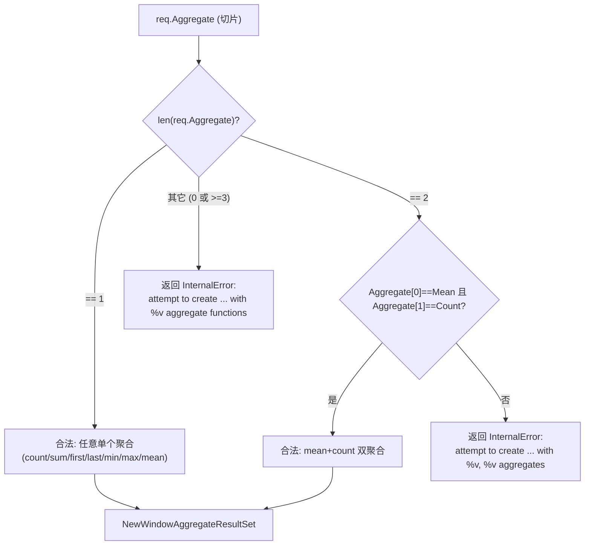

#### 11.5.3 案例：mean 单独 vs mean+count

> **具体案例 A (被拒绝)**: 若上层误传 `req.Aggregate = [{Mean}, {Sum}]` (2 个但非 mean+count)：
> ```
> nAggs == 2
> req.Aggregate[0].Type == Aggregate_AggregateTypeMean  ✓
> req.Aggregate[1].Type == Aggregate_AggregateTypeSum   ✗ (期望 Count)
> → 返回 error: "attempt to create a windowAggregateResultSet with MEAN, SUM aggregates"
> ```
>
> **具体案例 B (被接受)**: Flux `aggregateWindow(every: 1m, fn: mean)` 经 Flux planner 优化后
> 下推 `[mean, count]` 双聚合：
> ```
> req.Aggregate = [{Type: Aggregate_AggregateTypeMean}, {Type: Aggregate_AggregateTypeCount}]
> → 校验通过
> → IsAscendingWindowAggregate(mean) = true (非 last)
> → createCursor → NewWindowAggregateArrayCursor → newWindowMeanCountArrayCursor
>   (array_cursor.go:47-49)
> ```
>
> 单独 `mean` (len==1) 也是合法的，此时走 `newWindowMeanArrayCursor` (array_cursor.go:50)，
> 但缺少 count 伴生信息——Flux planner 通常会配对下推 mean+count 以支持 mean 的语义重算。

### 11.6 groupBySort — null 分隔符与 nilSort 排序键构造

> **源码确认**: `storage/reads/group_resultset.go:219-268` (groupBySort)，
> nilSort 常量 `group_resultset.go:99-106`，默认值 `group_resultset.go:56`。

#### 11.6.1 nilSort 常量与默认值

```go
// storage/reads/group_resultset.go:99-106
// NilSort values determine the lexicographical order of nil values in the
// partition key
var (
    NilSortLo = []byte{0x00}   // nil 排最低
    NilSortHi = []byte{0xff}   // nil 排最高
)

// storage/reads/group_resultset.go:56 (NewGroupResultSet 默认)
nilSort: NilSortHi,            // 默认 nil 排最高
// 可通过 GroupOptionNilSortLo() (group_resultset.go:37-41) 覆盖为 NilSortLo
```

#### 11.6.2 SortKey 构造与 null 分隔符

```go
// storage/reads/group_resultset.go:219-268 (groupBySort 主体)
func (g *groupResultSet) groupBySort() (int, error) {
    seriesCursor, err := g.newSeriesCursorFn()
    // ...
    var seriesRows []*SeriesRow
    vals := make([][]byte, len(g.keys))
    tagsBuf := &tagsBuffer{sz: 4096}
    allTime := datatypes.HintFlags(g.req.Hints).HintSchemaAllTime()

    seriesRow := seriesCursor.Next()
    for seriesRow != nil {
        if allTime || g.seriesHasPoints(seriesRow) {
            nr := *seriesRow
            nr.SeriesTags = tagsBuf.copyTags(nr.SeriesTags)
            nr.Tags = tagsBuf.copyTags(nr.Tags)

            l := len(g.keys) // for sort key separators
            for i, k := range g.keys {
                vals[i] = nr.Tags.Get(k)
                if len(vals[i]) == 0 {
                    vals[i] = g.nilSort          // line 243: null tag value → nilSort 替换
                }
                l += len(vals[i])
            }

            nr.SortKey = make([]byte, 0, l)
            for _, v := range vals {
                nr.SortKey = append(nr.SortKey, v...)
                nr.SortKey = append(nr.SortKey, '\000')   // line 252: ascii null 分隔每个 value
            }

            seriesRows = append(seriesRows, &nr)
        }
        seriesRow = seriesCursor.Next()
    }

    sort.Slice(seriesRows, func(i, j int) bool {
        return bytes.Compare(seriesRows[i].SortKey, seriesRows[j].SortKey) == -1   // line 261
    })

    g.seriesRows = seriesRows
    seriesCursor.Close()
    return len(seriesRows), nil
}
```

关键点：
1. **null 分隔符**: 每个 group key value 后追加 `'\000'` (ASCII null)，避免相邻 value 跨边界混淆
   (例如 `["a","bc"]` vs `["ab","c"]` 不带分隔符会得到相同的 `"abc"`)。
2. **null 替换**: tag value 为空 (`len(vals[i]) == 0`) 时用 `nilSort` (`0xff` 默认或 `0x00`) 替换，
   使 null tag 的 series 在排序中落在确定的位置，**不同 null 行为被分开成独立分组**。
3. 排序后 `groupByNextGroup` (group_resultset.go:194-217) 用 `bytes.Equal(rowKey, seriesRows[j].SortKey)`
   找相同 SortKey 的连续区间作为一个 group。

#### 11.6.3 SortKey 构造与分组流程

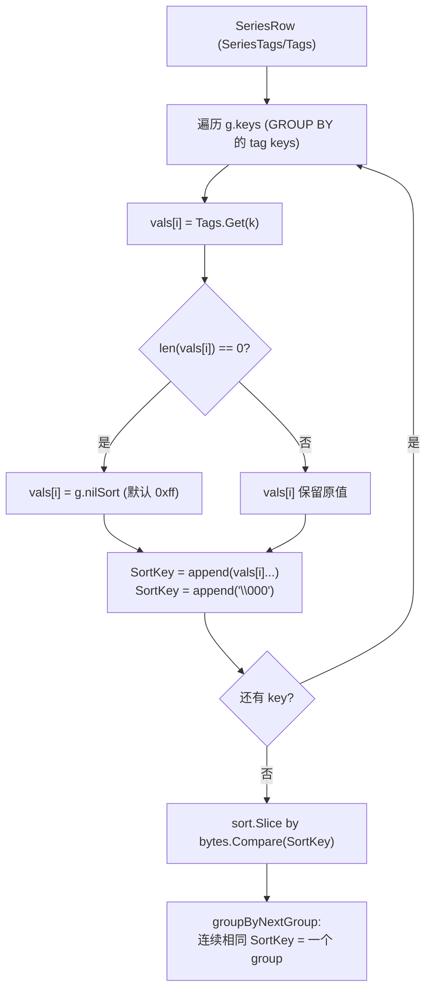

#### 11.6.4 案例：含 null tag value 的分组

> **具体案例**: Flux `from(bucket:"b") |> range(...) |> group(columns:["host","region"]) |> count()`
>
> 假设 4 个 series (经 `seriesHasPoints` 过滤后)：
>
> | series | host | region | (env 缺失演示) |
> |--------|------|--------|----|
> | s1 | web01 | us | |
> | s2 | web01 | (null) | |
> | s3 | web02 | us | |
> | s4 | web01 | (null) | |
>
> `g.keys = [host, region]`，默认 `nilSort = NilSortHi = [0xff]`。
>
> SortKey 构造 (`\0` 表示 ASCII null 分隔符)：
> ```
> s1: "web01" \0 "us"   \0        → bytes: 77 65 62 30 31 00 75 73 00
> s2: "web01" \0 0xff   \0        → bytes: 77 65 62 30 31 00 ff 00
> s3: "web02" \0 "us"   \0        → bytes: 77 65 62 30 32 00 75 73 00
> s4: "web01" \0 0xff   \0        → bytes: 77 65 62 30 31 00 ff 00   (与 s2 相同)
> ```
>
> `bytes.Compare` 排序后顺序 (升序)：`s1 < s2 == s4 < s3`
> (因为 `0xff` > `"us"` 的首字节 `0x75`，所以 null region 的 s2/s4 排在 us 之后)。
>
> `groupByNextGroup` 按连续相同 SortKey 分区，产出 **3 个 group**：
> - group A: `[s1]`, PartitionKeyVals=`[web01, us]`
> - group B: `[s2, s4]`, PartitionKeyVals=`[web01, (null)]` ← 两个 null region series 被合并到同一组
> - group C: `[s3]`, PartitionKeyVals=`[web02, us]`
>
> 关键：null tag value 的 series 被独立分组(不混入有值的 group)，且多个 null series 因 SortKey
> 相同而被合并。若调用方传入 `GroupOptionNilSortLo()`，`nilSort` 变为 `0x00`，null 组会排到
> 最前面而非 web01 之后——排序位置改变但"null 独立分组"的语义不变。

---

### 变更日志 (Change Log)

| 新增小节 | 源码验证位置 |
|---------|-------------|
| §11.1 windowAggregateIterator | `storage/flux/reader.go:609-616` (结构体), `:689-700` (handleRead 入口/createEmpty/splitWindows), `:755-768` (Float 三路分支), `:685-687` (isSelector), `:840-842` (isAggregateCount); `storage/flux/window.go:20` (splitWindows); `storage/reads/array_cursor.go:28` (NewWindowAggregateArrayCursor) |
| §11.2 determineTableColsForWindowAggregate / determineTableColsForGroup | `storage/flux/reader.go:402-408` (列索引常量), `:410-452` (WindowAggregate), `:514-581` (Group), `:506-512` (IsSelector) |
| §11.3 IsAscendingWindowAggregate / IsAscendingGroupAggregate | `storage/reads/aggregate_resultset.go:25-48` (Window 版), `:50-69` (NewWindowAggregateResultSet 调用 ascending), `storage/reads/group_resultset.go:43-48` (Group 版), `:50-97` (NewGroupResultSet 调用), `storage/reads/array_cursor.go:19-23` (newAggregateArrayCursor 对 last 走 newLimitArrayCursor) |
| §11.4 seriesHasPoints | `storage/reads/group_resultset.go:120-149` (实现, 含 sgc 注释), `:170-192` (groupNoneSort 调用点 line 183), `:219-268` (groupBySort 调用点 line 234) |
| §11.5 MeanCount 双聚合校验 | `storage/reads/aggregate_resultset.go:50-59` (NewWindowAggregateResultSet 校验), `storage/reads/array_cursor.go:46-50` (mean 分支要求 agg[1]==Count) |
| §11.6 groupBySort / nilSort | `storage/reads/group_resultset.go:219-268` (groupBySort, 关键行 243 nilSort 替换 / 252 null 分隔符 / 261 排序), `:99-106` (NilSortLo/NilSortHi 常量), `:56` (默认 NilSortHi), `:37-41` (GroupOptionNilSortLo 覆盖), `:194-217` (groupByNextGroup 按 SortKey 分区) |
