# Module 11: InfluxQL 执行全链路 (HTTP 入口 → 解析 → 编译 → 游标构建 → 结果发送) - 深度审计报告

> **小白导读**: InfluxQL 执行引擎是整个 InfluxDB 查询系统的"中枢大脑"。
>
> 你发送一条 `SELECT mean(value) FROM cpu WHERE host='web' GROUP BY time(5m)`，它需要经过 8 个阶段才能返回结果：
> 1. **解析**: 把 SQL 文本变成 AST 语法树
> 2. **重写**: SHOW 语句转为 SELECT 语句
> 3. **标准化**: 补全默认数据库和保留策略
> 4. **编译**: 验证字段、函数、时间范围
> 5. **准备**: 映射 Shard、展开通配符
> 6. **游标构建**: 创建 Iterator 链（归并→聚合→时间窗口→填充→限制）
> 7. **执行**: Iterator 链逐点处理数据
> 8. **发送**: 通过 channel 把结果返回给 HTTP handler
>
> 就像一个邮局分拣系统：
> - **解析** = 读取信封上的地址
> - **重写** = 把英文地址翻译成中文
> - **标准化** = 补上省市区
> - **编译** = 验证地址是否有效
> - **准备** = 确定走哪条邮路
> - **游标构建** = 装车
> - **执行** = 运输
> - **发送** = 投递到收件人

## 1. InfluxQL 执行全链路总览

### 1.1 从 HTTP 请求到查询结果的完整路径

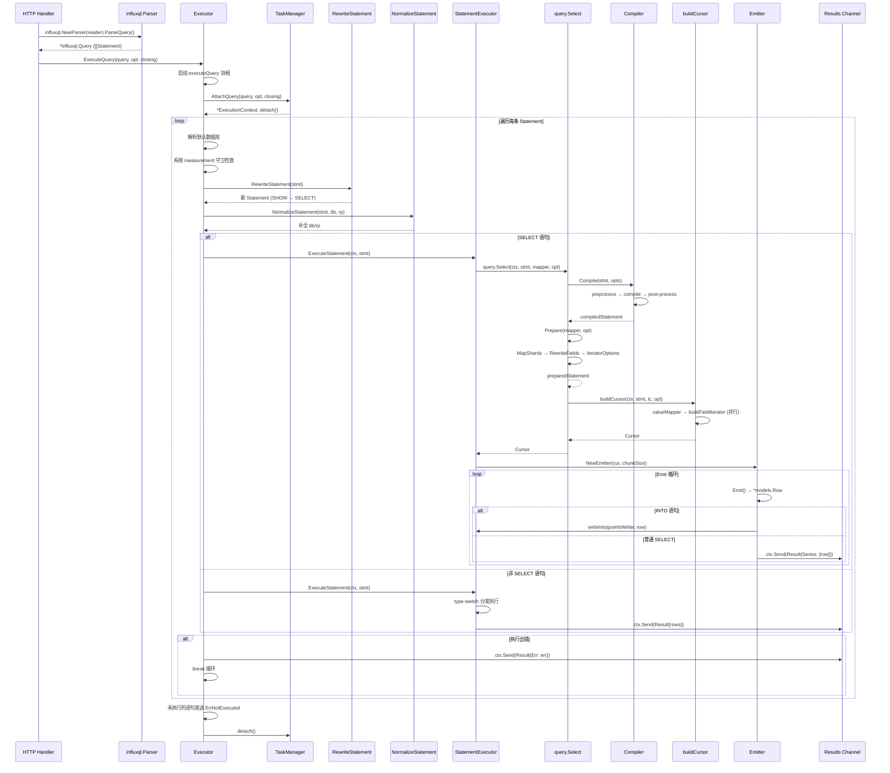

### 1.2 关键数据结构关系图

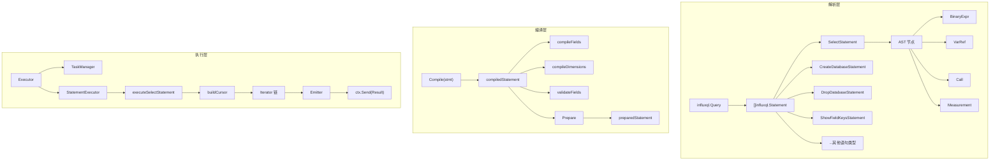

### 1.3 Executor 结构体

```go
// query/executor.go:235 — Executor 结构体
type Executor struct {
    StatementExecutor StatementExecutor  // 语句执行器 (由 coordinator 包注入)
    TaskManager       *TaskManager       // 查询任务管理器 (并发控制 + 超时)
    Logger            *zap.Logger        // 日志
    stats             *Statistics        // 统计信息
}
```

> **小白解释**: Executor 就像一个项目经理——它自己不干活，而是协调各个组件。
> - StatementExecutor 是具体干活的工程师
> - TaskManager 是人力资源部门（控制并发、超时）
> - Logger 是记录员

## 2. InfluxQL 解析

### 2.1 解析入口

```go
// github.com/influxdata/influxql@v1.4.1/parser.go — 解析入口
parser := influxql.NewParser(reader)
query, err := parser.ParseQuery()
```

`ParseQuery()` 返回 `*influxql.Query`，其核心结构：

注意：`influxql` 解析器和 AST 不在本仓库内部实现，而是来自外部模块
`github.com/influxdata/influxql`，本模块使用的版本为 `v1.4.1`。

```go
// github.com/influxdata/influxql@v1.4.1/ast.go — Query 结构
type Query struct {
    Statements []Statement  // 一条或多条语句（分号分隔）
}
```

### 2.2 Statement 类型体系

```mermaid
flowchart TD
    A["influxql.Statement (接口)"] --> B["SelectStatement"]
    A --> C["CreateDatabaseStatement"]
    A --> D["DropDatabaseStatement"]
    A --> E["ShowFieldKeysStatement"]
    A --> F["ShowMeasurementsStatement"]
    A --> G["ShowSeriesStatement"]
    A --> H["ShowTagKeysStatement"]
    A --> I["ShowTagValuesStatement"]
    A --> J["CreateRetentionPolicyStatement"]
    A --> K["DropRetentionPolicyStatement"]
    A --> L["CreateContinuousQueryStatement"]
    A --> M["DeleteSeriesStatement"]
    A --> N["ExplainStatement"]
    A --> O["ShowQueriesStatement"]
    A --> P["KillQueryStatement"]
    A --> Q0["AlterRetentionPolicyStatement"]
    A --> Q1["DropMeasurementStatement"]
    A --> Q2["DropSeriesStatement"]
    A --> Q3["DropShardStatement"]
    A --> Q["...其他语句"]

    B --> R["字段: Fields, Sources, Condition,<br>Dimensions, Limit, Offset,<br>SortFields, Target (INTO)"]
```

### 2.3 SelectStatement 核心字段

```go
// github.com/influxdata/influxql@v1.4.1/ast.go — SelectStatement 核心字段
type SelectStatement struct {
    Fields    Fields      // SELECT 子句: [mean(value), host]
    Sources   Sources     // FROM 子句: [cpu, mem]
    Condition Expr        // WHERE 子句: host='web' AND time > now() - 1h
    Dimensions Dimensions // GROUP BY 子句: [time(5m), host]
    Fill      FillOption  // FILL 子句: 0, none, linear, previous
    Limit     int         // LIMIT 子句
    Offset    int         // OFFSET 子句
    SortFields SortFields // ORDER BY 子句
    IsRawQuery bool       // 是否为原始查询 (无聚合函数)
    Target    *Target     // INTO 子句: measurement_name
    OmitTime  bool        // 是否省略时间列
    StripName bool        // 是否去除 measurement 名称
    Dedupe    bool        // 是否去重
}
```

### 2.4 AST 节点类型

| 节点类型 | 用途 | 示例 |
|---------|------|------|
| `BinaryExpr` | 二元表达式 | `host='web'`, `value > 50`, `time > now() - 1h` |
| `VarRef` | 变量引用 | `value`, `host`, `time` |
| `Call` | 函数调用 | `mean(value)`, `count(*)`, `derivative(value, 1m)` |
| `Measurement` | 数据源 | `cpu`, `db.rp.cpu`, `/cpu.*/` |
| `ParenExpr` | 括号表达式 | `(a OR b) AND c` |
| `StringLiteral` | 字符串字面量 | `'web'` |
| `NumberLiteral` | 数字字面量 | `3.14` |
| `IntegerLiteral` | 整数字面量 | `42` |
| `DurationLiteral` | 时间段字面量 | `5m`, `1h`, `30s` |
| `TimeLiteral` | 时间点字面量 | `'2024-01-01T00:00:00Z'` |
| `Wildcard` | 通配符 | `*` |
| `RegexLiteral` | 正则表达式 | `/cpu.*/` |
| `SubQuery` | 子查询 | `(SELECT ...)` |
| `ListLiteral` | 列表 | `SHOW TAG VALUES WITH KEY IN (host, region)` |

## 3. Executor 执行循环 (query/executor.go)

### 3.1 ExecuteQuery — 入口函数

```go
// query/executor.go:296 — ExecuteQuery
func (e *Executor) ExecuteQuery(query *influxql.Query, opt ExecutionOptions, closing chan struct{}) <-chan *Result {
    results := make(chan *Result)
    go e.executeQuery(query, opt, closing, results)
    return results
}
```

> **设计要点**: `ExecuteQuery` 创建一个无缓冲 channel，启动一个协程执行查询，立即返回 channel 给调用者。调用者从 channel 读取结果，实现**流式返回**。

### 3.2 executeQuery — 核心执行循环

```go
// query/executor.go:302 — executeQuery
func (e *Executor) executeQuery(query *influxql.Query, opt ExecutionOptions, closing <-chan struct{}, results chan *Result) {
    defer close(results)
    defer e.recover(query, results)  // panic 恢复

    // 统计: 活跃查询数 +1, 已执行查询数 +1
    atomic.AddInt64(&e.stats.ActiveQueries, 1)
    atomic.AddInt64(&e.stats.ExecutedQueries, 1)
    defer func(start time.Time) {
        atomic.AddInt64(&e.stats.ActiveQueries, -1)
        atomic.AddInt64(&e.stats.FinishedQueries, 1)
        atomic.AddInt64(&e.stats.QueryExecutionDuration, time.Since(start).Nanoseconds())
    }(time.Now())

    // 步骤 1: 注册查询到 TaskManager
    ctx, detach, err := e.TaskManager.AttachQuery(query, opt, closing)
    if err != nil {
        select {
        case results <- &Result{Err: err}:
        case <-opt.AbortCh:
        }
        return
    }
    defer detach()

    ctx.Results = results

    // 步骤 2: 语句循环
    var i int
LOOP:
    for ; i < len(query.Statements); i++ {
        ctx.statementID = i
        stmt := query.Statements[i]

        // ... (详见下文)
    }

    // 步骤 3: 未执行的语句发送 ErrNotExecuted
    for i++; i < len(query.Statements); i++ {
        ctx.send(&Result{StatementID: i, Err: ErrNotExecuted})
    }
}
```

### 3.3 语句循环详解

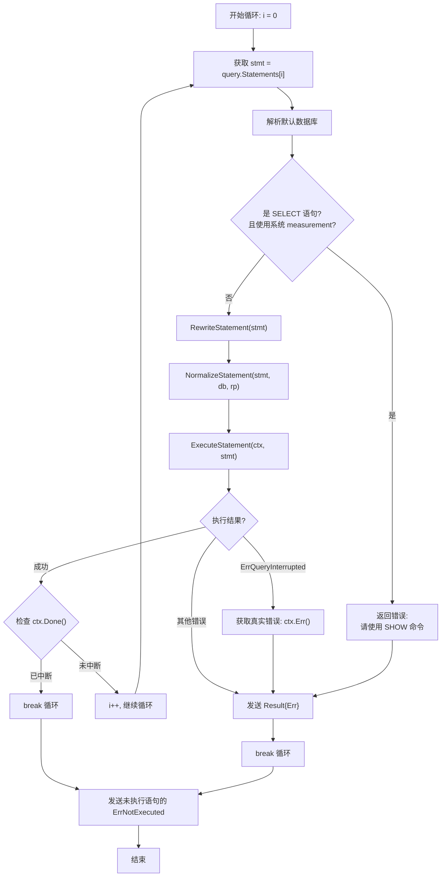

**系统 measurement 守卫** (executor.go:295-319):

```go
// 阻止用户直接查询系统 measurement
if stmt, ok := stmt.(*influxql.SelectStatement); ok {
    for _, s := range stmt.Sources {
        switch s := s.(type) {
        case *influxql.Measurement:
            if influxql.IsSystemName(s.Name) {
                // _fieldKeys → 建议使用 SHOW FIELD KEYS
                // _measurements → 建议使用 SHOW MEASUREMENTS
                // _series → 建议使用 SHOW SERIES
                // _tagKeys → 建议使用 SHOW TAG KEYS
                // _tags → 建议使用 SHOW TAG VALUES
                results <- &Result{
                    Err: fmt.Errorf("unable to use system source '%s': use %s instead", s.Name, command),
                }
                break LOOP
            }
        }
    }
}
```

**错误处理流程** (executor.go:397-415):

```go
// ExecuteStatement 返回的错误处理
err = e.StatementExecutor.ExecuteStatement(ctx, stmt)
if err == ErrQueryInterrupted {
    // 查询被中断，获取真实中断原因
    if qerr := ctx.Err(); qerr != nil {
        err = qerr
    }
}

if err != nil {
    ctx.send(&Result{StatementID: i, Err: err})
    break  // 遇到错误立即停止
}
```

### 3.4 错误哨兵值

```go
// query/executor.go:19-42 — 错误哨兵值
var (
    ErrInvalidQuery              = errors.New("invalid query")                    // 未知语句类型
    ErrNotExecuted               = errors.New("not executed")                     // 前序语句出错导致未执行
    ErrQueryInterrupted          = errors.New("query interrupted")                // 查询被 Kill
    ErrQueryAborted              = errors.New("query aborted")                    // 客户端断开
    ErrQueryEngineShutdown       = errors.New("query engine shutdown")            // 引擎关闭
    ErrQueryTimeoutLimitExceeded = errors.New("query-timeout limit exceeded")     // 超时
    ErrAlreadyKilled             = errors.New("already killed")                   // 重复 Kill
)
```

### 3.5 Panic 恢复

```go
// query/executor.go:453 — recover
func (e *Executor) recover(query *influxql.Query, results chan *Result) {
    if err := recover(); err != nil {
        atomic.AddInt64(&e.stats.RecoveredPanics, 1)
        e.Logger.Error(fmt.Sprintf("%s [panic:%s] %s", query.String(), err, debug.Stack()))
        results <- &Result{
            StatementID: -1,
            Err:         fmt.Errorf("%s [panic:%s]", query.String(), err),
        }

        // 环境变量 INFLUXDB_PANIC_CRASH=true 时，panic 不恢复，直接崩溃
        if willCrash {
            os.Exit(1)
        }
    }
}
```

> **设计要点**: 默认情况下，查询 panic 不会导致整个进程崩溃，而是被捕获并返回错误。只有设置 `INFLUXDB_PANIC_CRASH=true` 时才会崩溃（用于调试）。

## 4. TaskManager 并发控制 (query/task_manager.go)

### 4.1 TaskManager 结构体

```go
// query/task_manager.go:67 — TaskManager
type TaskManager struct {
    QueryTimeout         time.Duration  // 查询超时 (默认 0 = 无超时)
    LogQueriesAfter      time.Duration  // 慢查询阈值
    LogTimedoutQueries   bool           // 是否记录因 query-timeout 被杀的查询 (task_manager.go:76)
    MaxConcurrentQueries int            // 最大并发查询数 (默认 0 = 无限制)
    Logger               *zap.Logger
    queries              map[uint64]*Task  // 运行中的查询
    nextID               uint64            // 下一个查询 ID
    mu                   sync.RWMutex
    shutdown             bool
}
```

### 4.2 AttachQuery — 注册查询

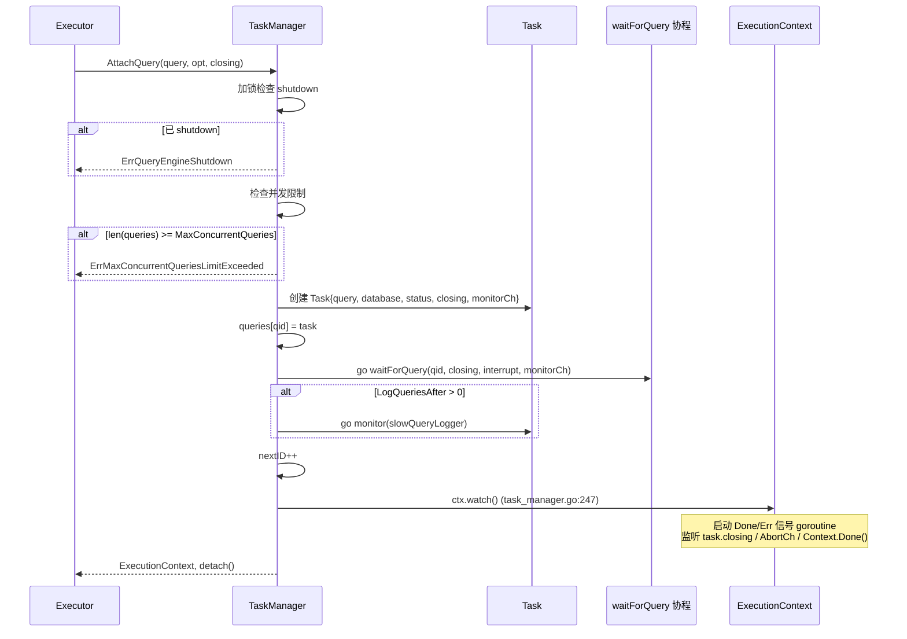

### 4.3 waitForQuery — 超时与中断监听

```go
// query/task_manager.go:311 — waitForQuery
func (t *TaskManager) waitForQuery(qid uint64, interrupt <-chan struct{}, closing <-chan struct{}, monitorCh <-chan error) {
    var timerCh <-chan time.Time
    if t.QueryTimeout != 0 {
        timer := time.NewTimer(t.QueryTimeout)
        timerCh = timer.C
        defer timer.Stop()
    }

    select {
    case <-closing:        // 查询被 Kill
        t.queryError(qid, ErrQueryInterrupted)
    case err := <-monitorCh:  // 监控器报告错误 (如点数超限)
        if err != nil {
            t.queryError(qid, err)
        }
    case <-timerCh:        // 超时
        t.queryError(qid, ErrQueryTimeoutLimitExceeded)
    case <-interrupt:      // 查询正常结束
        return
    }
    t.KillQuery(qid)  // 非正常结束时，主动 Kill 查询
}
```

### 4.4 KillQuery — 终止查询

```go
// query/task_manager.go:254 — KillQuery
func (t *TaskManager) KillQuery(qid uint64) error {
    t.mu.Lock()
    query := t.queries[qid]
    t.mu.Unlock()

    if query == nil {
        return fmt.Errorf("no such query id: %d", qid)
    }
    return query.kill()
}

// query/executor.go:477 — Task.kill
func (q *Task) kill() error {
    q.mu.Lock()
    if q.status == KilledTask {
        q.mu.Unlock()
        return ErrAlreadyKilled
    }
    q.status = KilledTask
    close(q.closing)  // 关闭 closing channel → ctx.Done() 触发
    q.mu.Unlock()
    return nil
}
```

> **小白解释**: KillQuery 的机制非常简单——关闭 `closing` channel。所有监听这个 channel 的协程都会收到信号，从而停止工作。这是 Go 中常用的"优雅终止"模式。

### 4.5 DetachQuery — 注销查询

```go
// query/task_manager.go:267 — DetachQuery
func (t *TaskManager) DetachQuery(qid uint64) error {
    t.mu.Lock()
    defer t.mu.Unlock()

    query := t.queries[qid]
    if query == nil {
        return fmt.Errorf("no such query id: %d", qid)
    }

    query.close()
    delete(t.queries, qid)
    return nil
}
```

## 5. StatementExecutor 语句分发 (coordinator/statement_executor.go)

### 5.1 StatementExecutor 结构体

```go
// coordinator/statement_executor.go:34 — StatementExecutor
type StatementExecutor struct {
    MetaClient          MetaClient           // 元数据客户端 (数据库、RP、用户管理)
    TaskManager         query.StatementExecutor // SHOW/KILL QUERIES 处理器
    TSDBStore           TSDBStore            // TSDB 存储 (删除操作)
    ShardMapper         query.ShardMapper    // Shard 映射器 (SELECT 语句)
    Monitor             *monitor.Monitor     // 监控器 (SHOW STATS/DIAGNOSTICS)
    PointsWriter        interface {          // 写入器 (INTO 语句)
        WritePointsInto(*IntoWriteRequest) error
    }
    StrictErrorHandling bool                 // 严格错误处理模式
    MaxSelectPointN     int                  // 最大查询点数
    MaxSelectSeriesN    int                  // 最大查询 series 数
    MaxSelectBucketsN   int                  // 最大查询 bucket 数
}
```

### 5.2 ExecuteStatement — 语句分发

```go
// coordinator/statement_executor.go:64 — ExecuteStatement
func (e *StatementExecutor) ExecuteStatement(ctx *query.ExecutionContext, stmt influxql.Statement) error {
    // SELECT 语句单独处理（流式返回）
    if stmt, ok := stmt.(*influxql.SelectStatement); ok {
        return e.executeSelectStatement(ctx, stmt)
    }

    var rows models.Rows
    var messages []*query.Message
    var err error

    switch stmt := stmt.(type) {
    case *influxql.CreateDatabaseStatement:
        err = e.executeCreateDatabaseStatement(stmt)
    case *influxql.DropDatabaseStatement:
        err = e.executeDropDatabaseStatement(stmt)
    case *influxql.CreateRetentionPolicyStatement:
        err = e.executeCreateRetentionPolicyStatement(stmt)
    case *influxql.DropRetentionPolicyStatement:
        err = e.executeDropRetentionPolicyStatement(stmt)
    case *influxql.CreateContinuousQueryStatement:
        err = e.executeCreateContinuousQueryStatement(stmt)
    case *influxql.DropContinuousQueryStatement:
        err = e.executeDropContinuousQueryStatement(stmt)
    case *influxql.CreateSubscriptionStatement:
        err = e.executeCreateSubscriptionStatement(stmt)
    case *influxql.DropSubscriptionStatement:
        err = e.executeDropSubscriptionStatement(stmt)
    case *influxql.CreateUserStatement:
        err = e.executeCreateUserStatement(stmt)
    case *influxql.DropUserStatement:
        err = e.executeDropUserStatement(stmt)
    case *influxql.DeleteSeriesStatement:
        err = e.executeDeleteSeriesStatement(stmt, ctx.Database)
    case *influxql.ExplainStatement:
        if stmt.Analyze {
            rows, err = e.executeExplainAnalyzeStatement(ctx, stmt)
        } else {
            rows, err = e.executeExplainStatement(ctx, stmt)
        }
    case *influxql.GrantStatement:
        err = e.executeGrantStatement(stmt)
    case *influxql.GrantAdminStatement:
        err = e.executeGrantAdminStatement(stmt)
    case *influxql.RevokeStatement:
        err = e.executeRevokeStatement(stmt)
    case *influxql.RevokeAdminStatement:
        err = e.executeRevokeAdminStatement(stmt)
    case *influxql.ShowContinuousQueriesStatement:
        rows, err = e.executeShowContinuousQueriesStatement(stmt)
    case *influxql.ShowDatabasesStatement:
        rows, err = e.executeShowDatabasesStatement(ctx, stmt)
    case *influxql.ShowDiagnosticsStatement:
        rows, err = e.executeShowDiagnosticsStatement(stmt)
    case *influxql.ShowGrantsForUserStatement:
        rows, err = e.executeShowGrantsForUserStatement(stmt)
    case *influxql.ShowMeasurementsStatement:
        return e.executeShowMeasurementsStatement(ctx, stmt)
    case *influxql.ShowMeasurementCardinalityStatement:
        rows, err = e.executeShowMeasurementCardinalityStatement(ctx, stmt)
    case *influxql.ShowRetentionPoliciesStatement:
        rows, err = e.executeShowRetentionPoliciesStatement(stmt)
    case *influxql.ShowSeriesCardinalityStatement:
        rows, err = e.executeShowSeriesCardinalityStatement(ctx, stmt)
    case *influxql.ShowShardsStatement:
        rows, err = e.executeShowShardsStatement(stmt)
    case *influxql.ShowShardGroupsStatement:
        rows, err = e.executeShowShardGroupsStatement(stmt)
    case *influxql.ShowStatsStatement:
        rows, err = e.executeShowStatsStatement(stmt)
    case *influxql.ShowSubscriptionsStatement:
        rows, err = e.executeShowSubscriptionsStatement(stmt)
    case *influxql.ShowTagKeysStatement:
        return e.executeShowTagKeys(ctx, stmt)
    case *influxql.ShowTagValuesStatement:
        return e.executeShowTagValues(ctx, stmt)
    case *influxql.ShowUsersStatement:
        rows, err = e.executeShowUsersStatement(stmt)
    case *influxql.SetPasswordUserStatement:
        err = e.executeSetPasswordUserStatement(stmt)
    case *influxql.ShowQueriesStatement, *influxql.KillQueryStatement:
        return e.TaskManager.ExecuteStatement(ctx, stmt)
    default:
        return query.ErrInvalidQuery
    }

    if err != nil {
        return err
    }
    return ctx.Send(&query.Result{Series: rows, Messages: messages})
}
```


### 5.2a ReadOnly 模式 — DDL 语句的只读检查

```go
// coordinator/statement_executor.go:73 — DDL 语句的 ReadOnly 检查
// 所有 DDL/DML 语句 (CREATE, DROP, ALTER, GRANT, REVOKE, SET PASSWORD) 在执行前检查 ctx.ReadOnly:
switch stmt := stmt.(type) {
case *influxql.AlterRetentionPolicyStatement:
    if ctx.ReadOnly {
        messages = append(messages, query.ReadOnlyWarning(stmt.String()))
    }
    err = e.executeAlterRetentionPolicyStatement(stmt)
case *influxql.CreateDatabaseStatement:
    if ctx.ReadOnly {
        messages = append(messages, query.ReadOnlyWarning(stmt.String()))
    }
    err = e.executeCreateDatabaseStatement(stmt)
// ... 所有 DDL/DML 语句都有相同的 ReadOnly 检查
case *influxql.DeleteSeriesStatement:
    // DELETE SERIES 是唯一跳过 ReadOnly 警告的 DML (statement_executor.go:104-105)
    // 直接执行，不 append ReadOnlyWarning
    err = e.executeDeleteSeriesStatement(stmt, ctx.Database)
case *influxql.DropSeriesStatement:
    // DROP SERIES 仍然检查 ReadOnly 并 append 警告 (statement_executor.go:121-125)
    if ctx.ReadOnly {
        messages = append(messages, query.ReadOnlyWarning(stmt.String()))
    }
    err = e.executeDropSeriesStatement(stmt, ctx.Database)
}
```

**ReadOnly 行为**: 当 `ctx.ReadOnly = true` 时，DDL/DML 语句不会被拒绝，而是添加一条 `ReadOnlyWarning` 消息后**仍然执行**。唯一的例外是 `DELETE SERIES`（`DeleteSeriesStatement`，statement_executor.go:104-105），它跳过 ReadOnly 警告直接执行。注意 `DROP SERIES`（`DropSeriesStatement`，121-125）**仍然**检查 ReadOnly 并 append 警告——两者行为不同。这意味着 ReadOnly 模式下仍然会修改数据，只是会返回警告消息。

### 5.3 语句分发分类表

| 类别 | 语句 | 实现方式 | 结果返回 |
|------|------|---------|---------|
| **SELECT** | SELECT ... | 流式执行 (Emit 循环) | ctx.Send(Result{Series}) |
| **DDL** | CREATE/DROP DATABASE, RP | MetaClient 调用 | 无 rows |
| **CQ** | CREATE/DROP CONTINUOUS QUERY | MetaClient 调用 | 无 rows |
| **用户** | CREATE/DROP USER, SET PASSWORD | MetaClient 调用 | 无 rows |
| **权限** | GRANT, REVOKE | MetaClient 调用 | 无 rows |
| **删除** | DELETE SERIES, DROP SERIES | TSDBStore 调用 | 无 rows |
| **SHOW (查询)** | SHOW DATABASES, MEASUREMENTS, TAG KEYS... | TSDBStore/MetaClient 查询 | ctx.Send(Result{rows}) |
| **SHOW (管理)** | SHOW QUERIES, KILL QUERY | TaskManager.ExecuteStatement | ctx.Send(Result{rows}) |
| **EXPLAIN** | EXPLAIN, EXPLAIN ANALYZE | query.Prepare / 实际执行 | rows (执行计划) |

### 5.4 CREATE DATABASE 自动创建默认 RP

```go
// coordinator/statement_executor.go:264 — executeCreateDatabaseStatement
func (e *StatementExecutor) executeCreateDatabaseStatement(stmt *influxql.CreateDatabaseStatement) error {
    if !meta.ValidName(stmt.Name) {
        return meta.ErrInvalidName
    }

    if !stmt.RetentionPolicyCreate {
        // 不带 WITH 子句: 仅创建数据库
        _, err := e.MetaClient.CreateDatabase(stmt.Name)
        return err
    }

    // 带 WITH 子句: 同时创建保留策略
    spec := meta.RetentionPolicySpec{
        Name:               stmt.RetentionPolicyName,
        Duration:           stmt.RetentionPolicyDuration,
        ReplicaN:           stmt.RetentionPolicyReplication,
        ShardGroupDuration: stmt.RetentionPolicyShardGroupDuration,
    }
    _, err := e.MetaClient.CreateDatabaseWithRetentionPolicy(stmt.Name, &spec)
    return err
}
```

## 6. SELECT 执行路径 (coordinator/statement_executor.go:544)

### 6.1 executeSelectStatement — 流式执行

```go
// coordinator/statement_executor.go:544 — executeSelectStatement
func (e *StatementExecutor) executeSelectStatement(ctx *query.ExecutionContext, stmt *influxql.SelectStatement) error {
    // 步骤 1: 创建迭代器 (编译 + 准备 + 游标构建)
    cur, err := e.createIterators(ctx, stmt, ctx.ExecutionOptions)
    if err != nil {
        return err
    }

    // 步骤 2: 创建 Emitter (按 series 分组输出)
    em := query.NewEmitter(cur, ctx.ChunkSize)
    defer em.Close()

    var writeN int64
    var emitted bool

    // 步骤 3: INTO 语句的缓冲写入器
    var pointsWriter *BufferedPointsWriter
    if stmt.Target != nil {
        pointsWriter = NewBufferedPointsWriter(e.PointsWriter,
            stmt.Target.Measurement.Database,
            stmt.Target.Measurement.RetentionPolicy,
            10000)
    }

    // 步骤 4: Emit 循环
    for {
        row, partial, err := em.Emit()
        if err != nil {
            return err
        } else if row == nil {
            // 检查查询是否被中断
            select {
            case <-ctx.Done():
                return ctx.Err()
            default:
            }
            break
        }

        // INTO 语句: 写入目标 measurement
        if stmt.Target != nil {
            n, err := e.writeInto(pointsWriter, stmt, row, e.StrictErrorHandling)
            if err != nil {
                return err
            }
            writeN += n
            continue
        }

        // 普通 SELECT: 发送结果
        result := &query.Result{Series: []*models.Row{row}, Partial: partial}
        if err := ctx.Send(result); err != nil {
            return err
        }
        emitted = true
    }

    // 步骤 5: INTO 语句的收尾
    if stmt.Target != nil {
        if err := pointsWriter.Flush(); err != nil {
            return err
        }
        return ctx.Send(&query.Result{
            Series: []*models.Row{{
                Name:    "result",
                Columns: []string{"time", "written"},
                Values:  [][]interface{}{{time.Unix(0, 0).UTC(), writeN}},
            }},
        })
    }

    // 步骤 6: 空结果也必须发送至少一个 Result
    if !emitted {
        return ctx.Send(&query.Result{Series: make([]*models.Row, 0)})
    }
    return nil
}
```

### 6.2 SELECT 执行流程图

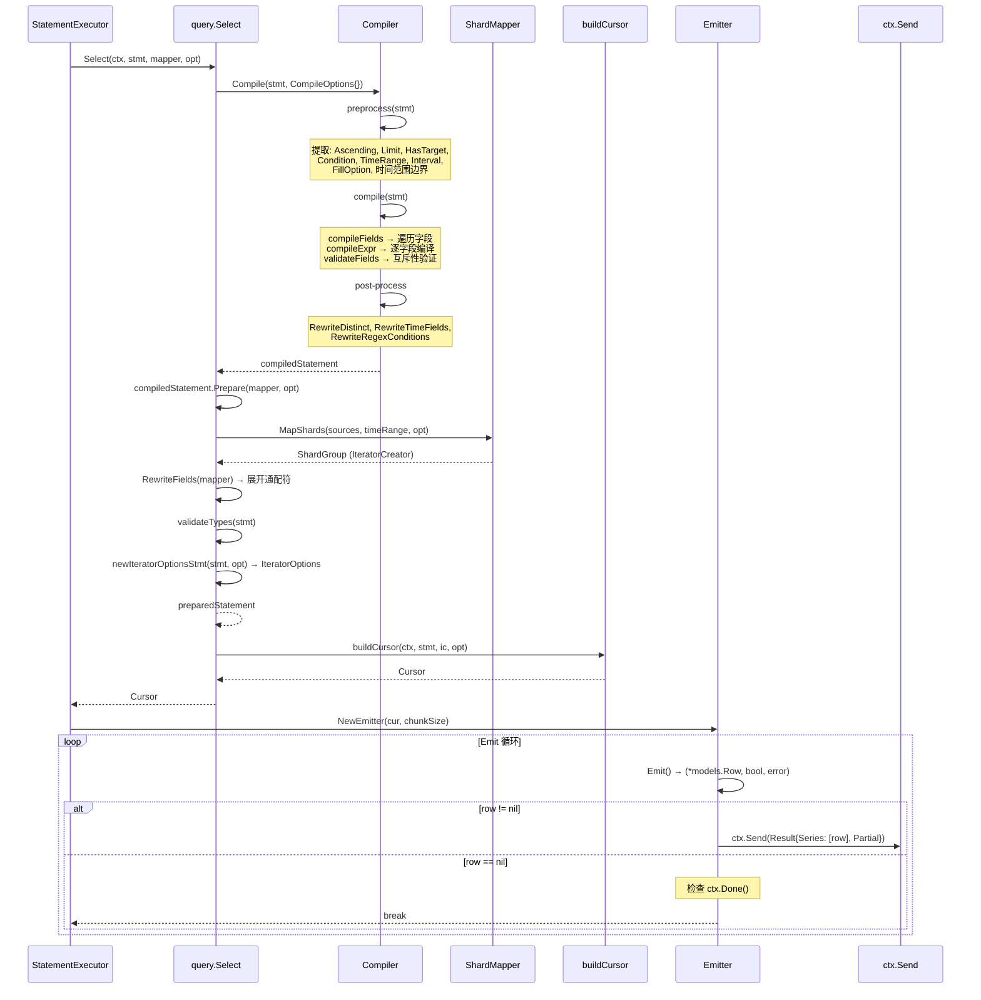

### 6.3 INTO 语句的缓冲写入

```go
// coordinator/statement_executor.go:1117 — BufferedPointsWriter
type BufferedPointsWriter struct {
    w               pointsWriter
    buf             []models.Point
    database        string
    retentionPolicy string
}

// 写入缓冲区，满 10000 个点时自动 flush
func (w *BufferedPointsWriter) WritePointsInto(req *IntoWriteRequest) error {
    for i := 0; i < len(req.Points); {
        avail := cap(w.buf) - len(w.buf)
        n := len(req.Points[i:])
        if n > avail { n = avail }
        w.buf = append(w.buf, req.Points[i:n+i]...)
        i += n
        if len(w.buf) == cap(w.buf) {
            w.Flush()
        }
    }
    return nil
}
```

> **设计要点**: INTO 语句不会逐点写入，而是缓冲 10000 个点后批量写入。这减少了写入调用次数，提高了写入吞吐量。

## 7. query.Select — 编译到游标构建 (query/select.go)

### 7.1 Select 函数链

```go
// query/select.go:91 — Select
func Select(ctx context.Context, stmt *influxql.SelectStatement, shardMapper ShardMapper, opt SelectOptions) (Cursor, error) {
    s, err := Prepare(stmt, shardMapper, opt)  // 编译 + 准备
    if err != nil {
        return nil, err
    }
    defer s.Close()
    return s.Select(ctx)  // 执行
}

// query/select.go:81 — Prepare
func Prepare(stmt *influxql.SelectStatement, shardMapper ShardMapper, opt SelectOptions) (PreparedStatement, error) {
    c, err := Compile(stmt, CompileOptions{})  // 编译
    if err != nil {
        return nil, err
    }
    return c.Prepare(shardMapper, opt)  // 准备
}
```

### 7.2 preparedStatement.Select — 执行

```go
// query/select.go:113 — preparedStatement.Select
func (p *preparedStatement) Select(ctx context.Context) (Cursor, error) {
    // 注入 now() 值
    ctx = context.WithValue(ctx, "now", p.now)

    opt := p.opt
    opt.InterruptCh = ctx.Done()
    cur, err := buildCursor(ctx, p.stmt, p.ic, opt)
    if err != nil {
        return nil, err
    }

    // 注册点数限制监控
    if m := MonitorFromContext(ctx); m != nil {
        if p.maxPointN > 0 {
            monitor := PointLimitMonitor(cur, DefaultStatsInterval, p.maxPointN)
            m.Monitor(monitor)
        }
    }
    return cur, nil
}
```

### 7.3 SelectOptions — 查询选项

```go
// query/select.go:24 — SelectOptions
type SelectOptions struct {
    Authorizer  FineAuthorizer  // 权限控制
    NodeID      uint64          // 指定节点
    MaxSeriesN  int             // 最大 series 数
    MaxPointN   int             // 最大点数
    MaxBucketsN int             // 最大 bucket 数
}
```

## 8. Compile 编译流程 (query/compile.go)

### 8.1 Compile 入口

```go
// query/compile.go:106 — Compile
func Compile(stmt *influxql.SelectStatement, opt CompileOptions) (Statement, error) {
    c := newCompiler(opt)
    c.stmt = stmt.Clone()  // 克隆语句，避免修改原始 AST

    if err := c.preprocess(c.stmt); err != nil {  // 预处理
        return nil, err
    }
    if err := c.compile(c.stmt); err != nil {  // 编译
        return nil, err
    }

    // 后处理
    c.stmt.TimeAlias = c.TimeFieldName
    c.stmt.Condition = c.Condition
    c.stmt.RewriteDistinct()       // DISTINCT → Call
    c.stmt.RewriteTimeFields()     // 移除 time 字段
    c.stmt.RewriteRegexConditions() // 优化正则条件
    return c, nil
}
```

### 8.2 Compile 流程图

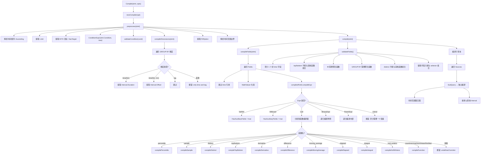

### 8.3 preprocess — 预处理

```go
// query/compile.go:130 — preprocess
func (c *compiledStatement) preprocess(stmt *influxql.SelectStatement) error {
    c.Ascending = stmt.TimeAscending()
    c.Limit = stmt.Limit
    c.HasTarget = stmt.Target != nil

    // 解析 WHERE 条件中的 now()
    valuer := influxql.NowValuer{Now: c.Options.Now, Location: stmt.Location}
    cond, t, err := influxql.ConditionExpr(stmt.Condition, &valuer)
    if err != nil {
        return err
    }
    if err := c.validateCondition(cond); err != nil {
        return err
    }
    c.Condition = cond
    c.TimeRange = t

    // 编译 GROUP BY 维度，提取 time() 间隔
    if err := c.compileDimensions(stmt); err != nil {
        return err
    }

    c.FillOption = stmt.Fill

    // 解析时间范围边界
    if c.TimeRange.Min.IsZero() {
        c.TimeRange.Min = time.Unix(0, influxql.MinTime).UTC()
    }
    if c.TimeRange.Max.IsZero() {
        if !c.Interval.IsZero() {
            c.TimeRange.Max = c.Options.Now  // 聚合查询: 上界 = now()
        } else {
            c.TimeRange.Max = time.Unix(0, influxql.MaxTime).UTC()  // 原始查询: 上界 = 最大时间
        }
    }
    return nil
}
```

### 8.4 compileDimensions — GROUP BY time() 编译

```go
// query/compile.go:896 — compileDimensions
func (c *compiledStatement) compileDimensions(stmt *influxql.SelectStatement) error {
    for _, d := range stmt.Dimensions {
        expr := influxql.Reduce(d.Expr, nil)

        switch expr := expr.(type) {
        case *influxql.VarRef:
            if strings.ToLower(expr.Val) == "time" {
                return errors.New("time() is a function and expects at least one argument")
            }
        case *influxql.Call:
            if expr.Name != "time" {
                return errors.New("only time() calls allowed in dimensions")
            }
            // 解析 time(interval, offset)
            lit, ok := expr.Args[0].(*influxql.DurationLiteral)
            if !ok {
                return errors.New("time dimension must have duration argument")
            }
            c.Interval.Duration = lit.Val

            if len(expr.Args) == 2 {
                // 解析 offset: Duration, TimeLiteral, now(), StringLiteral
                switch lit := expr.Args[1].(type) {
                case *influxql.DurationLiteral:
                    c.Interval.Offset = lit.Val % c.Interval.Duration
                case *influxql.TimeLiteral:
                    c.Interval.Offset = lit.Val.Sub(lit.Val.Truncate(c.Interval.Duration))
                case *influxql.Call:
                    if lit.Name != "now" {
                        return errors.New("time dimension offset function must be now()")
                    }
                    now := c.Options.Now
                    c.Interval.Offset = now.Sub(now.Truncate(c.Interval.Duration))
                case *influxql.StringLiteral:
                    // 解析日期时间字符串
                    if lit.IsTimeLiteral() {
                        t, _ := lit.ToTimeLiteral(stmt.Location)
                        c.Interval.Offset = t.Val.Sub(t.Val.Truncate(c.Interval.Duration))
                    }
                }
            }
        case *influxql.Wildcard:
        case *influxql.RegexLiteral:
        default:
            return errors.New("only time and tag dimensions allowed")
        }
        d.Expr = expr
    }
    return nil
}
```

### 8.4a compileDimensions — 参数数量与重复 interval 校验

`compileDimensions` (compile.go:922-990) 在解析 `time()` 维度时有两道容易遗漏的守卫：
**参数数量检查** (compile.go:937-938) 和 **重复 time 维度检查** (compile.go:941)。
前者拒绝 `time()` 参数个数不在 `[1,2]` 范围内的写法；后者拒绝在同一个 GROUP BY
里出现两次 `time(...)`。

```go
// query/compile.go:922 — compileDimensions
func (c *compiledStatement) compileDimensions(stmt *influxql.SelectStatement) error {
    for _, d := range stmt.Dimensions {
        expr := influxql.Reduce(d.Expr, nil)
        switch expr := expr.(type) {
        // ... VarRef / Wildcard / RegexLiteral 分支略 ...
        case *influxql.Call:
            if expr.Name != "time" {
                return errors.New("only time() calls allowed in dimensions")
            // ↓↓↓ 参数数量守卫 (compile.go:937-938)
            } else if got := len(expr.Args); got < 1 || got > 2 {
                return errors.New("time dimension expected 1 or 2 arguments")
            } else if lit, ok := expr.Args[0].(*influxql.DurationLiteral); !ok {
                return errors.New("time dimension must have duration argument")
            // ↓↓↓ 重复 interval 守卫 (compile.go:941)
            } else if c.Interval.Duration != 0 {
                return errors.New("multiple time dimensions not allowed")
            } else {
                c.Interval.Duration = lit.Val
                // ... 解析可选 offset (Duration / TimeLiteral / now() / StringLiteral) ...
            }
        }
        d.Expr = expr
    }
    return nil
}
```

**两道守卫的语义**:
- **参数数量** (937-938): `time()` 必须是 `time(interval)` 或 `time(interval, offset)`。
  `time()` (0 参数) 或 `time(1m, 2m, 3m)` (3 参数) 都会触发 `"time dimension expected 1 or 2 arguments"`。
- **重复 interval** (941): 一旦 `c.Interval.Duration != 0` (已被前一个 `time(...)` 设置)，
  再出现 `time(...)` 立即报错 `"multiple time dimensions not allowed"`。注意 tag 维度
  (如 `host`) 走 `case *influxql.VarRef` → 非 time 的 VarRef 不设置 `Interval.Duration`，
  所以 `GROUP BY time(1m),host` 是合法的；只有两个 `time(...)` 才会触发。

> **具体案例**: arg-count 错误
>
> ```sql
> -- 误把 tag 当成 time() 的第二个参数
> SELECT mean(value) FROM cpu GROUP BY time(1m), host
> ```
>
> 这条语句**合法**: `time(1m)` 设置 `Interval.Duration=1m`，`host` 走 VarRef 分支，
> 不会触发任何守卫。
>
> 但下面这条会触发 arg-count 错误：
>
> ```sql
> -- 漏写 time，直接 GROUP BY 一个 bare call (非 time)
> SELECT mean(value) FROM cpu GROUP BY time(1m, host)
> -- host 不是 DurationLiteral，会被 Reduce 化简为 Call{time, [1m, host]}
> -- compile.go:937: len(expr.Args)=2 在 [1,2] 范围内，但 Args[1] 不是 DurationLiteral
> -- 实际触发的是 939 行的 "time dimension must have duration argument"
> ```
>
> 真正触发 937-938 arg-count 错误的场景：
>
> ```sql
> SELECT mean(value) FROM cpu GROUP BY time()
> -- len(expr.Args)=0 < 1 → "time dimension expected 1 or 2 arguments"
>
> SELECT mean(value) FROM cpu GROUP BY time(1m, 2m, 3m)
> -- len(expr.Args)=3 > 2 → "time dimension expected 1 or 2 arguments"
> ```
>
> 触发 941 重复 interval 错误的场景：
>
> ```sql
> SELECT mean(value) FROM cpu GROUP BY time(1m), time(5m)
> -- 第一个 time(1m): c.Interval.Duration = 1m
> -- 第二个 time(5m): c.Interval.Duration != 0 → "multiple time dimensions not allowed"
> ```

### 8.5 validateFields — 字段互斥性验证

```go
// query/compile.go:968 — validateFields
func (c *compiledStatement) validateFields() error {
    // 至少 1 个非 time 字段
    if len(c.Fields) == 0 {
        return errors.New("at least 1 non-time field must be queried")
    }

    // top/bottom 不能与其他函数组合
    if len(c.FunctionCalls) > 1 && c.TopBottomFunction != "" {
        return fmt.Errorf("selector function %s() cannot be combined with other functions", c.TopBottomFunction)
    } else if len(c.FunctionCalls) == 0 {
        // 无函数时: fill 必须与函数配合
        switch c.FillOption {
        case influxql.NoFill:
            return errors.New("fill(none) must be used with a function")
        case influxql.LinearFill:
            return errors.New("fill(linear) must be used with a function")
        }
        // GROUP BY 需要聚合函数
        if !c.Interval.IsZero() && !c.InheritedInterval {
            return errors.New("GROUP BY requires at least one aggregate function")
        }
    }

    // distinct 不能与其他函数组合
    if c.HasDistinct && (len(c.FunctionCalls) != 1 || c.HasAuxiliaryFields) {
        return errors.New("aggregate function distinct() cannot be combined with other functions or fields")
    }

    // 辅助字段只能与 selector 组合
    if c.HasAuxiliaryFields {
        if !c.OnlySelectors {
            return fmt.Errorf("mixing aggregate and non-aggregate queries is not supported")
        } else if len(c.FunctionCalls) > 1 {
            return fmt.Errorf("mixing multiple selector functions with tags or fields is not supported")
        }
    }
    return nil
}
```

### 8.6 Prepare — 准备执行

```go
// query/compile.go:1090 — Prepare
func (c *compiledStatement) Prepare(shardMapper ShardMapper, sopt SelectOptions) (PreparedStatement, error) {
    timeRange := c.TimeRange

    // MaxBucketsN 限制: 计算最小时间
    if sopt.MaxBucketsN > 0 && !c.stmt.IsRawQuery && timeRange.MinTimeNano() == influxql.MinTime {
        interval, _ := c.stmt.GroupByInterval()
        offset, _ := c.stmt.GroupByOffset()
        if interval > 0 {
            opt := IteratorOptions{Interval: Interval{Duration: interval, Offset: offset}}
            last, _ := opt.Window(c.TimeRange.MaxTimeNano() - 1)
            maxDiff := last - models.MinNanoTime
            if maxDiff/int64(interval) > int64(sopt.MaxBucketsN) {
                timeRange.Min = time.Unix(0, models.MinNanoTime)
            } else {
                timeRange.Min = time.Unix(0, last-int64(interval)*int64(sopt.MaxBucketsN-1))
            }
        }
    }

    // ExtraIntervals 扩展时间范围 (derivative, moving_average 等)
    if !c.Interval.IsZero() && c.ExtraIntervals > 0 {
        if c.Ascending {
            newTime := timeRange.Min.Add(time.Duration(-c.ExtraIntervals) * c.Interval.Duration)
            if !newTime.Before(time.Unix(0, influxql.MinTime).UTC()) {
                timeRange.Min = newTime
            }
        } else {
            newTime := timeRange.Max.Add(time.Duration(c.ExtraIntervals) * c.Interval.Duration)
            if !newTime.After(time.Unix(0, influxql.MaxTime).UTC()) {
                timeRange.Max = newTime
            }
        }
    }

    // 映射 Shard
    shards, err := shardMapper.MapShards(c.stmt.Sources, timeRange, sopt)
    if err != nil {
        return nil, err
    }

    // 展开通配符字段
    mapper := FieldMapper{FieldMapper: shards}
    stmt, err := c.stmt.RewriteFields(mapper)
    if err != nil {
        shards.Close()
        return nil, err
    }

    // 验证字段类型
    if err := validateTypes(stmt); err != nil {
        shards.Close()
        return nil, err
    }

    // 构建 IteratorOptions
    opt, err := newIteratorOptionsStmt(stmt, sopt)
    if err != nil {
        shards.Close()
        return nil, err
    }
    opt.StartTime, opt.EndTime = c.TimeRange.MinTimeNano(), c.TimeRange.MaxTimeNano()
    opt.Ascending = c.Ascending

    // MaxBucketsN 最终检查
    if sopt.MaxBucketsN > 0 && !stmt.IsRawQuery && c.TimeRange.MinTimeNano() > influxql.MinTime {
        interval, _ := stmt.GroupByInterval()
        if interval > 0 {
            first, _ := opt.Window(opt.StartTime)
            last, _ := opt.Window(opt.EndTime - 1)
            buckets := (last - first + int64(interval)) / int64(interval)
            if int(buckets) > sopt.MaxBucketsN {
                shards.Close()
                return nil, fmt.Errorf("max-select-buckets limit exceeded: (%d/%d)", buckets, sopt.MaxBucketsN)
            }
        }
    }

    return &preparedStatement{
        stmt:      stmt,
        opt:       opt,
        ic:        shards,
        columns:   stmt.ColumnNames(),
        maxPointN: sopt.MaxPointN,
        now:       c.Options.Now,
    }, nil
}
```

### 8.7 compiledField.compileExpr — 函数分发

```go
// query/compile.go:241 — compileExpr
func (c *compiledField) compileExpr(expr influxql.Expr) error {
    switch expr := expr.(type) {
    case *influxql.VarRef:
        c.global.HasAuxiliaryFields = true
        return nil
    case *influxql.Wildcard:
        c.global.HasAuxiliaryFields = true
        return nil
    case *influxql.Call:
        if isMathFunction(expr) {
            return c.compileMathFunction(expr)
        }
        c.global.FunctionCalls = append(c.global.FunctionCalls, expr)

        switch expr.Name {
        case "percentile":   return c.compilePercentile(expr.Args)
        case "sample":       return c.compileSample(expr.Args)
        case "distinct":     return c.compileDistinct(expr.Args, false)
        case "top", "bottom": return c.compileTopBottom(expr)
        case "derivative", "non_negative_derivative":
            return c.compileDerivative(expr.Args, expr.Name == "non_negative_derivative")
        case "difference", "non_negative_difference":
            return c.compileDifference(expr.Args, expr.Name == "non_negative_difference")
        case "cumulative_sum": return c.compileCumulativeSum(expr.Args)
        case "moving_average": return c.compileMovingAverage(expr.Args)
        case "exponential_moving_average", "double_exponential_moving_average", ...:
            return c.compileExponentialMovingAverage(expr.Name, expr.Args)
        case "kaufmans_efficiency_ratio", "kaufmans_adaptive_moving_average":
            return c.compileKaufmans(expr.Name, expr.Args)
        case "chande_momentum_oscillator":
            return c.compileChandeMomentumOscillator(expr.Args)
        case "elapsed":   return c.compileElapsed(expr.Args)
        case "integral":  return c.compileIntegral(expr.Args)
        case "count_hll":
            return c.compileCountHll(expr.Args)
        case "holt_winters", "holt_winters_with_fit":
            return c.compileHoltWinters(expr.Args, expr.Name == "holt_winters_with_fit")
        default:
            return c.compileFunction(expr)  // count, min, max, sum, mean, first, last, ...
        }
    case *influxql.BinaryExpr:
        c.AllowWildcard = false
        // 递归编译两侧
        ...
    case *influxql.ParenExpr:
        return c.compileExpr(expr.Expr)
    case influxql.Literal:
        return errors.New("field must contain at least one variable")
    }
}
```

> **审计校准** (compile.go:252-316): `compileExpr` 的 Call 分支除上面列出的
> `percentile` / `sample` / `distinct` / `top,bottom` / `derivative` /
> `difference` / `cumulative_sum` / `moving_average` / `exponential_moving_average` 系列 /
> `elapsed` / `integral` / `holt_winters` 之外，还显式 case 了以下四个函数
> (compile.go:301-310)，不能省略：
> - `kaufmans_efficiency_ratio`、`kaufmans_adaptive_moving_average` → `compileKaufmans(expr.Name, expr.Args)`
> - `chande_momentum_oscillator` → `compileChandeMomentumOscillator(expr.Args)`
> - `count_hll` → `compileCountHll(expr.Args)`
>
> 这四个函数在 `buildCallIterator` (select.go:258) 的 case 列表里也对应独立分支
> (`count_hll` 走 `NewCountHllIterator`，kaufmans/chande 走各自的 iterator 构造)，
> 因此 compileExpr 必须先识别它们，否则会落到 `default: compileFunction`，最终在
> iterator 构建阶段因函数名未识别而报错。

## 9. SHOW 语句重写 (query/statement_rewriter.go)

### 9.1 RewriteStatement — 重写入口

```go
// query/statement_rewriter.go:11 — RewriteStatement
func RewriteStatement(stmt influxql.Statement) (influxql.Statement, error) {
    switch stmt := stmt.(type) {
    case *influxql.ShowFieldKeysStatement:
        return rewriteShowFieldKeysStatement(stmt)
    case *influxql.ShowFieldKeyCardinalityStatement:
        return rewriteShowFieldKeyCardinalityStatement(stmt)
    case *influxql.ShowMeasurementsStatement:
        return rewriteShowMeasurementsStatement(stmt)
    case *influxql.ShowMeasurementCardinalityStatement:
        return rewriteShowMeasurementCardinalityStatement(stmt)
    case *influxql.ShowSeriesStatement:
        return rewriteShowSeriesStatement(stmt)
    case *influxql.ShowSeriesCardinalityStatement:
        return rewriteShowSeriesCardinalityStatement(stmt)
    case *influxql.ShowTagKeysStatement:
        return rewriteShowTagKeysStatement(stmt)
    case *influxql.ShowTagKeyCardinalityStatement:
        return rewriteShowTagKeyCardinalityStatement(stmt)
    case *influxql.ShowTagValuesStatement:
        return rewriteShowTagValuesStatement(stmt)
    case *influxql.ShowTagValuesCardinalityStatement:
        return rewriteShowTagValuesCardinalityStatement(stmt)
    default:
        return stmt, nil  // 非 SHOW 语句不重写
    }
}
```

### 9.2 SHOW 语句重写对照表

| 原始语句 | 重写后 | 说明 |
|---------|----------------|------|
| `SHOW FIELD KEYS FROM cpu` | `SELECT fieldKey, fieldType FROM _fieldKeys WHERE _name = 'cpu'` | 重写为 SelectStatement，使用系统迭代器 `_fieldKeys` |
| `SHOW FIELD KEY CARDINALITY` | `SELECT count(distinct(_fieldKey)) FROM /.+/` | 估算 field key 基数 |
| `SHOW MEASUREMENTS` | `SHOW MEASUREMENTS` (不重写为 SELECT) | 改写 Condition 中的 source 为 `_name` 标签过滤 |
| `SHOW MEASUREMENT CARDINALITY` | `SELECT count(distinct(_name)) FROM /.+/` | 估算 measurement 基数 |
| `SHOW SERIES FROM cpu` | `SELECT key FROM _series WHERE _name = 'cpu'` | 使用系统迭代器 `_series` |
| `SHOW SERIES ... WHERE time > ...` | `SELECT _seriesKey AS key FROM ...` | 有时间条件时使用 TSM 数据 |
| `SHOW SERIES CARDINALITY` | `SELECT count(distinct(_seriesKey)) FROM /.+/` | 估算 series 基数 |
| `SHOW TAG KEYS FROM cpu` | `SHOW TAG KEYS FROM cpu` (重写 Condition) | 改写 Condition 中的 source |
| `SHOW TAG KEY CARDINALITY` | `SELECT count(distinct(_tagKey)) FROM /.+/` | 估算 tag key 基数 |
| `SHOW TAG VALUES WITH KEY = host` | `SHOW TAG VALUES` (仍是 ShowTagValuesStatement) | 重写 Condition：添加 `_tagKey` 过滤 + `rewriteSourcesCondition`，**不**转成 SelectStatement |

> **审计校准** (statement_rewriter.go:298-325): `rewriteShowTagValuesStatement` 的返回类型仍是
> `*influxql.ShowTagValuesStatement`（**不是** SelectStatement）。它把 `withKeyExpr(stmt.TagKeyExpr, stmt.Op)`
> 生成的 `_tagKey` 过滤条件与原 `stmt.Condition` 用 AND 连接，再调用
> `rewriteSourcesCondition(stmt.Sources, condition)` 合并 source 条件。最终由
> `executeShowTagValues` (statement_executor.go:1105) 处理，不走 SELECT 执行链路。

### 9.3 SHOW FIELD KEYS 重写示例

```go
// query/statement_rewriter.go:38 — rewriteShowFieldKeysStatement
func rewriteShowFieldKeysStatement(stmt *influxql.ShowFieldKeysStatement) (influxql.Statement, error) {
    return &influxql.SelectStatement{
        Fields: influxql.Fields([]*influxql.Field{
            {Expr: &influxql.VarRef{Val: "fieldKey"}},
            {Expr: &influxql.VarRef{Val: "fieldType"}},
        }),
        Sources:    rewriteSources(stmt.Sources, "_fieldKeys", stmt.Database),
        Condition:  rewriteSourcesCondition(stmt.Sources, nil),
        Offset:     stmt.Offset,
        Limit:      stmt.Limit,
        SortFields: stmt.SortFields,
        OmitTime:   true,
        Dedupe:     true,
        IsRawQuery: true,
    }, nil
}
```

### 9.4 SHOW 语句重写流程图

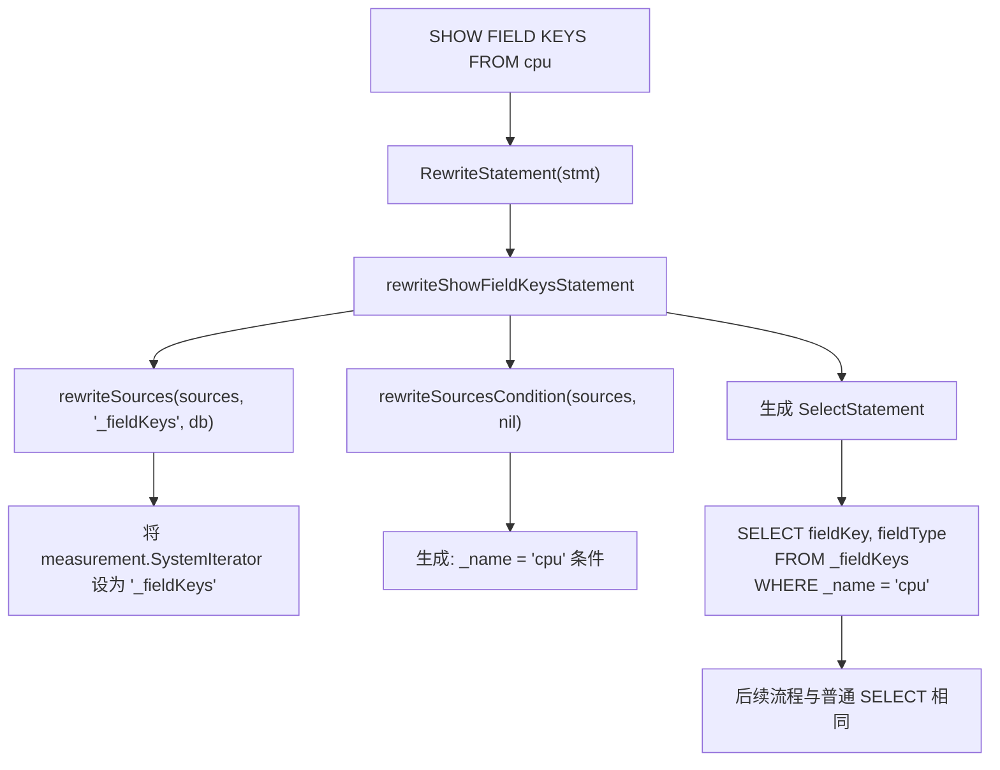

### 9.5 rewriteSourcesCondition — 条件改写

```go
// query/statement_rewriter.go:428 — rewriteSourcesCondition
func rewriteSourcesCondition(sources influxql.Sources, cond influxql.Expr) influxql.Expr {
    if len(sources) == 0 {
        return cond
    }

    var scond influxql.Expr
    for _, source := range sources {
        mm := source.(*influxql.Measurement)

        var expr influxql.Expr
        if mm.Regex != nil {
            // 正则匹配: _name =~ /cpu.*/
            expr = &influxql.BinaryExpr{
                Op:  influxql.EQREGEX,
                LHS: &influxql.VarRef{Val: "_name"},
                RHS: &influxql.RegexLiteral{Val: mm.Regex.Val},
            }
        } else if mm.Name != "" {
            // 精确匹配: _name = 'cpu'
            expr = &influxql.BinaryExpr{
                Op:  influxql.EQ,
                LHS: &influxql.VarRef{Val: "_name"},
                RHS: &influxql.StringLiteral{Val: mm.Name},
            }
        }

        if scond == nil {
            scond = expr
        } else {
            // 多个 source 用 OR 连接
            scond = &influxql.BinaryExpr{Op: influxql.OR, LHS: scond, RHS: expr}
        }
    }

    // 与原有条件用 AND 连接
    if cond != nil && scond != nil {
        return &influxql.BinaryExpr{
            Op:  influxql.AND,
            LHS: &influxql.ParenExpr{Expr: scond},
            RHS: &influxql.ParenExpr{Expr: cond},
        }
    } else if cond != nil {
        return cond
    }
    return scond
}
```

## 10. buildCursor — 游标构建 (query/select.go:623)

### 10.1 buildCursor 总体流程

```go
// query/select.go:623 — buildCursor
func buildCursor(ctx context.Context, stmt *influxql.SelectStatement, ic IteratorCreator, opt IteratorOptions) (Cursor, error) {
    // 步骤 1: Fill 选项设置
    switch opt.Fill {
    case influxql.NumberFill:
        if v, ok := opt.FillValue.(int); ok {
            opt.FillValue = int64(v)
        }
    case influxql.PreviousFill:
        opt.FillValue = SkipDefault
    }

    // 步骤 2: 构建字段列表 (添加 time 字段)
    fields := make([]*influxql.Field, 0, len(stmt.Fields)+1)
    if !stmt.OmitTime {
        fields = append(fields, &influxql.Field{
            Expr: &influxql.VarRef{Val: "time", Type: influxql.Time},
        })
    }

    // 步骤 3: valueMapper — 为每个 Call/VarRef 分配唯一符号
    valueMapper := newValueMapper()
    for _, f := range stmt.Fields {
        fields = append(fields, valueMapper.Map(f))
        // top/bottom 额外字段
        ...
    }

    // 设置列别名
    columns := stmt.ColumnNames()
    for i, f := range fields {
        f.Alias = columns[i]
    }

    // 步骤 4: 收集辅助字段
    var auxKeys []influxql.VarRef
    if len(valueMapper.refs) > 0 {
        opt.Aux = make([]influxql.VarRef, 0, len(valueMapper.refs))
        for ref := range valueMapper.refs {
            opt.Aux = append(opt.Aux, *ref)
        }
        sort.Sort(influxql.VarRefs(opt.Aux))
        ...
    }

    // 步骤 5: 无函数调用 → 辅助迭代器
    if len(valueMapper.calls) == 0 {
        itr, err := buildAuxIterator(ctx, ic, stmt.Sources, opt)
        scanner := NewIteratorScanner(itr, keys, opt.FillValue)
        return newScannerCursor(scanner, fields, opt), nil
    }

    // 步骤 6: 有函数调用 → 并行构建字段迭代器
    var g errgroup.Group
    var mu sync.Mutex
    scanners := make([]IteratorScanner, 0, len(valueMapper.calls))
    for call := range valueMapper.calls {
        call := call
        driver := valueMapper.table[call]
        if driver.Type == influxql.Unknown {
            continue
        }
        g.Go(func() error {
            itr, err := buildFieldIterator(ctx, call, ic, stmt.Sources, opt, selector, stmt.Target != nil)
            if err != nil {
                return err
            }
            keys := make([]influxql.VarRef, 0, len(auxKeys)+1)
            keys = append(keys, driver)
            keys = append(keys, auxKeys...)
            scanner := NewIteratorScanner(itr, keys, opt.FillValue)
            mu.Lock()
            scanners = append(scanners, scanner)
            mu.Unlock()
            return nil
        })
    }

    if err := g.Wait(); err != nil {
        return nil, err
    }

    // 步骤 7: 根据 scanner 数量返回不同类型的 Cursor
    if len(scanners) == 0 {
        return newNullCursor(fields), nil
    } else if len(scanners) == 1 {
        return newScannerCursor(scanners[0], fields, opt), nil
    }
    return newMultiScannerCursor(scanners, fields, opt), nil
}
```

### 10.2 buildCursor 流程图

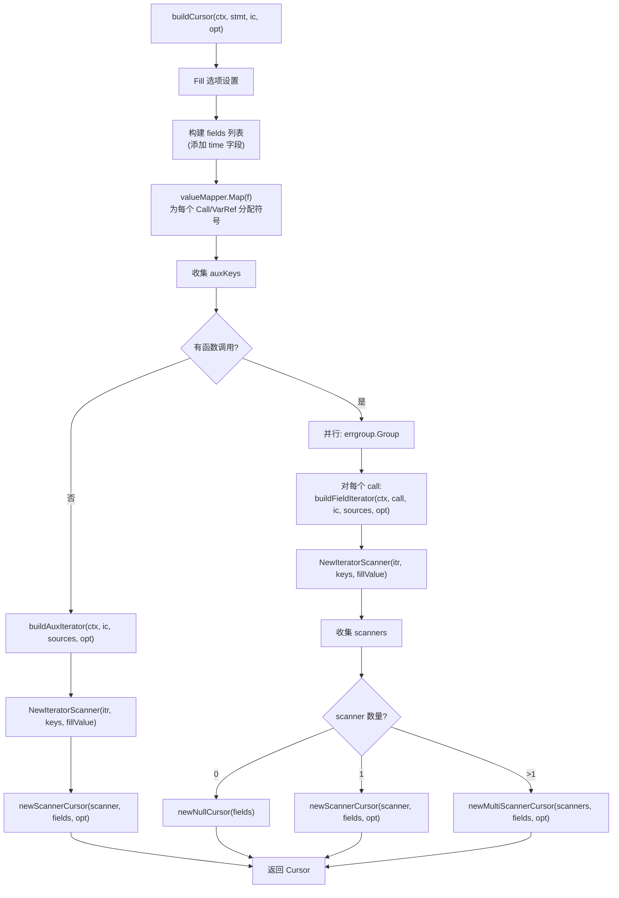

### 10.3 valueMapper — 符号映射

```go
// query/select.go:882 — valueMapper
type valueMapper struct {
    symbols map[string]influxql.VarRef    // 表达式字符串 → 符号
    table   map[influxql.Expr]influxql.VarRef  // 表达式 → 符号
    calls   map[*influxql.Call]struct{}    // 所有函数调用
    refs    map[*influxql.VarRef]struct{}  // 所有变量引用
    i       int                            // 符号计数器
}
```

> **小白解释**: valueMapper 就像一个翻译字典。它把查询中的每个字段表达式（如 `mean(value)`、`host`）翻译成一个内部符号（如 `val0`、`val1`）。这样，多个字段中引用同一个表达式时，不会重复创建迭代器。

### 10.4 buildFieldIterator — 并行构建

```go
// query/select.go:852 — buildFieldIterator
func buildFieldIterator(ctx context.Context, expr influxql.Expr, ic IteratorCreator, sources influxql.Sources, opt IteratorOptions, selector, writeMode bool) (Iterator, error) {
    input, err := buildExprIterator(ctx, expr, ic, sources, opt, selector, writeMode)
    if err != nil {
        return nil, err
    }

    // 应用 LIMIT/OFFSET
    if opt.Limit > 0 || opt.Offset > 0 {
        input = NewLimitIterator(input, opt)
    }
    return input, nil
}
```

### 10.5 buildExprIterator — 表达式迭代器构建

```go
// query/select.go:142 — buildExprIterator
func buildExprIterator(ctx context.Context, expr influxql.Expr, ic IteratorCreator, sources influxql.Sources, opt IteratorOptions, selector, writeMode bool) (Iterator, error) {
    opt.Expr = expr
    b := exprIteratorBuilder{ic: ic, sources: sources, opt: opt, selector: selector, writeMode: writeMode}

    switch expr := expr.(type) {
    case *influxql.VarRef:
        return b.buildVarRefIterator(ctx, expr)
    case *influxql.Call:
        return b.buildCallIterator(ctx, expr)
    default:
        return nil, fmt.Errorf("invalid expression type: %T", expr)
    }
}
```

### 10.6 buildCallIterator — 函数迭代器分发

`buildCallIterator` (select.go:214) 是最复杂的函数，它根据函数名分发到不同的迭代器构建逻辑：

| 函数名 | 处理方式 | 迭代器类型 |
|--------|---------|-----------|
| `distinct` | opt.Ordered=true → buildExprIterator → NewDistinctIterator → NewIntervalIterator | DistinctIterator |
| `sample` | buildExprIterator → newSampleIterator | SampleIterator |
| `holt_winters` | buildExprIterator → newHoltWintersIterator | HoltWintersIterator |
| `derivative` | buildExprIterator → newDerivativeIterator | DerivativeIterator |
| `elapsed` | buildExprIterator → newElapsedIterator | ElapsedIterator |
| `difference` | buildExprIterator → newDifferenceIterator | DifferenceIterator |
| `moving_average` | buildExprIterator → newMovingAverageIterator | MovingAverageIterator |
| `cumulative_sum` | buildExprIterator → newCumulativeSumIterator | CumulativeSumIterator |
| `integral` | buildExprIterator → newIntegralIterator | IntegralIterator |
| `top` | 多参数: MaxIterator + TopIterator; 少参数: VarRefIterator + TopIterator | TopIterator |
| `bottom` | 类似 top，使用 min 代替 max | BottomIterator |
| `count` | 含 distinct: buildExprIterator → newCountIterator; 不含: callIterator | CountIterator |
| `min/max/sum/first/last/mean` | callIterator → MergeIterator + NewCallIterator | CallIterator |
| `median` | buildExprIterator → newMedianIterator | MedianIterator |
| `mode` | buildExprIterator → NewModeIterator | ModeIterator |
| `stddev` | buildExprIterator → newStddevIterator | StddevIterator |
| `spread` | buildExprIterator → newSpreadIterator | SpreadIterator |
| `percentile` | buildExprIterator → newPercentileIterator | PercentileIterator |

## 11. ExecutionContext 与结果发送 (query/execution_context.go)

### 11.1 ExecutionContext 结构体

```go
// query/execution_context.go:9 — ExecutionContext
type ExecutionContext struct {
    context.Context                    // 嵌入标准 context

    statementID       int              // 当前语句 ID
    QueryID           uint64           // 查询 ID
    task              *Task            // 查询任务
    Results           chan *Result      // 结果输出 channel
    ExecutionOptions                   // 执行选项 (嵌入)

    mu   sync.RWMutex
    done chan struct{}                  // 完成信号 channel
    err  error                          // 错误信息
}
```

### 11.2 watch — 监听取消信号

```go
// query/execution_context.go:32 — watch
func (ctx *ExecutionContext) watch() {
    ctx.done = make(chan struct{})
    if ctx.err != nil {
        close(ctx.done)
        return
    }

    go func() {
        defer close(ctx.done)

        var taskCtx <-chan struct{}
        if ctx.task != nil {
            taskCtx = ctx.task.closing
        }

        select {
        case <-taskCtx:          // 查询被 Kill
            ctx.err = ctx.task.Error()
            if ctx.err == nil {
                ctx.err = ErrQueryInterrupted
            }
        case <-ctx.AbortCh:      // 客户端断开
            ctx.err = ErrQueryAborted
        case <-ctx.Context.Done(): // context 取消
            ctx.err = ctx.Context.Err()
        }
    }()
}
```

### 11.3 Done / Err — 状态查询

```go
// query/execution_context.go:61 — Done (惰性初始化)
func (ctx *ExecutionContext) Done() <-chan struct{} {
    ctx.mu.RLock()
    if ctx.done != nil {
        defer ctx.mu.RUnlock()
        return ctx.done
    }
    ctx.mu.RUnlock()

    ctx.mu.Lock()
    defer ctx.mu.Unlock()
    if ctx.done == nil {
        ctx.watch()
    }
    return ctx.done
}

// query/execution_context.go:77 — Err
func (ctx *ExecutionContext) Err() error {
    ctx.mu.RLock()
    defer ctx.mu.RUnlock()
    return ctx.err
}
```

### 11.4 Send / send — 结果发送

```go
// query/execution_context.go:104 — Send (带中断检查)
func (ctx *ExecutionContext) Send(result *Result) error {
    result.StatementID = ctx.statementID   // Send 会显式设置 StatementID
    select {
    case <-ctx.Done():      // 查询已结束 (Kill/超时/Abort/Context 取消)
        return ctx.Err()
    case ctx.Results <- result:  // 发送结果
    }
    return nil
}

// query/execution_context.go:93 — send (仅检查 Abort)
func (ctx *ExecutionContext) send(result *Result) error {
    // 注意: send 不设置 StatementID — 调用方 (executor.go) 在 Result 字面量里显式填写
    select {
    case <-ctx.AbortCh:     // 仅检查客户端断开，不检查 Done()
        return ErrQueryAborted
    case ctx.Results <- result:
    }
    return nil
}
```

> **设计要点** (executor.go:383,407,433; execution_context.go:93,104):
> - `Send` 检查 `Done()` (包含 Kill、超时、Abort、Context 取消四种信号)，并**显式设置**
>   `result.StatementID = ctx.statementID`。
> - `send` **只**检查 `AbortCh` (客户端断开)，**不**检查 `Done()` (Kill/超时)。
>   这是有意为之：executor 的语句循环用 `send` 发送错误结果
>   (executor.go:383 `NormalizeStatement` 失败、407 `ExecuteStatement` 失败、433 未执行语句)，
>   此时如果查询被 Kill/超时，错误本身 (如语句执行返回的 error) 比 `ctx.Err()`
>   (Kill/超时原因) 更有价值——用 `send` 可以**保留原始 statement 错误**，
>   而不会被 `ctx.Err()` 覆盖。若改用 `Send`，`case <-ctx.Done(): return ctx.Err()`
>   会把原始错误替换成 Kill/超时原因，丢失真正的失败原因。
> - `send` **不**设置 `StatementID`；executor 在 Result 字面量中显式填写
>   (`&Result{StatementID: i, Err: err}`)。
> - Kill/超时信号在循环**末尾**通过单独的 `select { case <-ctx.Done(): ... }`
>   (executor.go:419-424) 检查，与错误发送解耦。

### 11.5b Emitter.Emit() — partial 语义与分块机制

```go
// query/emitter.go:36 — Emit
func (e *Emitter) Emit() (*models.Row, bool, error) {
    // 返回: (row, partial, error)
    // partial=true: 还有更多数据 (同 series 的后续 chunk 或下一个 series)
    // partial=false: 最后一行 (游标耗尽)
}
```

**partial 返回值的两种触发场景**:

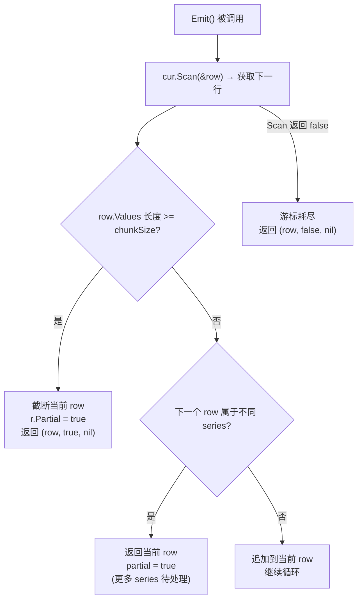

| 场景 | partial | 含义 |
|------|---------|------|
| chunkSize 超限 | `true` | 同 series 的数据被分块，后续 chunk 即将到来 |
| series 边界 | `true` | 当前 series 输出完毕，下一个 series 即将开始 |
| 游标耗尽 | `false` | 所有数据已输出，这是最后一行 |

**分块机制代码**:

```go
// query/emitter.go:57 — 分块触发
if e.chunkSize > 0 && len(e.row.Values) >= e.chunkSize {
    r := e.row
    r.Partial = true
    e.createRow(row.Series, row.Values)  // 开始新 chunk
    return r, true, nil
}
```

> **小白解释**: `partial` 就像快递的"第X箱共Y箱"标记——
> `partial=true` 表示"这只是其中一箱，后面还有"；
> `partial=false` 表示"这是最后一箱，全部到齐了"。

### 11.5c PointLimitMonitor — 异步点数限制

```go
// query/iterator.gen.go:21 — DefaultStatsInterval
const DefaultStatsInterval = time.Second  // 每秒检查一次

// query/monitor.go:32 — PointLimitMonitor
func PointLimitMonitor(cur Cursor, interval time.Duration, limit int) MonitorFunc {
    return func(closing <-chan struct{}) error {
        ticker := time.NewTicker(interval)
        defer ticker.Stop()
        for {
            select {
            case <-ticker.C:
                stats := cur.Stats()
                if stats.PointN >= limit {
                    return ErrMaxSelectPointsLimitExceeded(stats.PointN, limit)
                }
            case <-closing:
                return nil  // 查询正常结束, 退出监控
            }
        }
    }
}
```

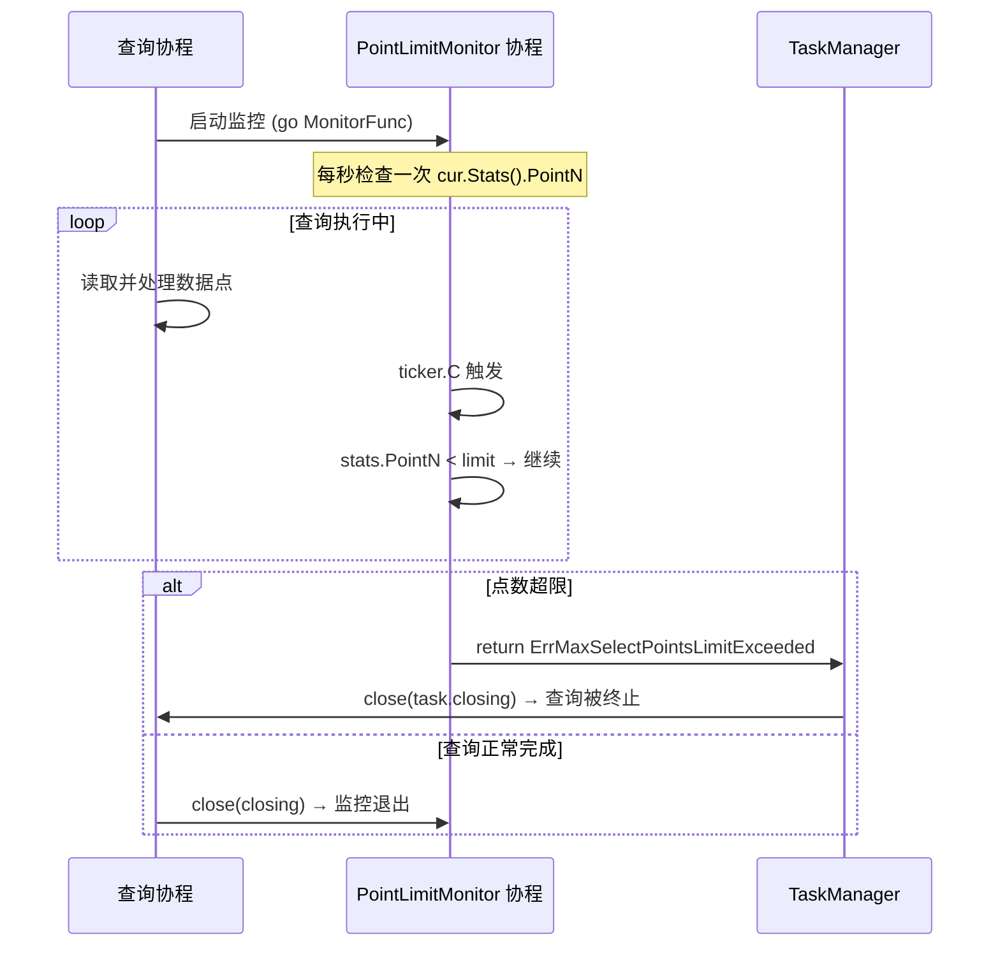

**关键特性**:
- **异步检查**: 监控在独立 goroutine 中运行，不阻塞查询执行
- **1秒间隔**: `DefaultStatsInterval = 1s`，最坏情况下多读 1 秒的数据点
- **非精确限制**: 检查间隔内可能已读取超过限制的点数，这是有意的性能权衡
- **注册方式**: `MonitorFromContext(ctx)` 从 context 获取 Monitor，`m.Monitor(fn)` 启动 goroutine

### 11.5 ExecutionContext 监听信号图

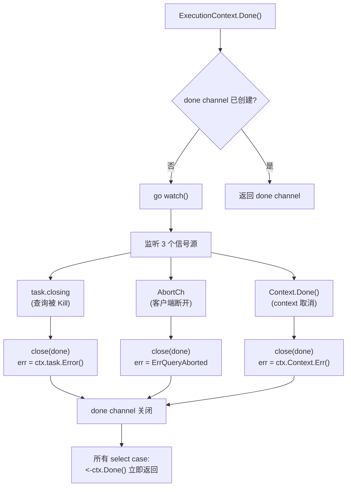

## 12. 错误传播路径

### 12.1 错误传播全景图

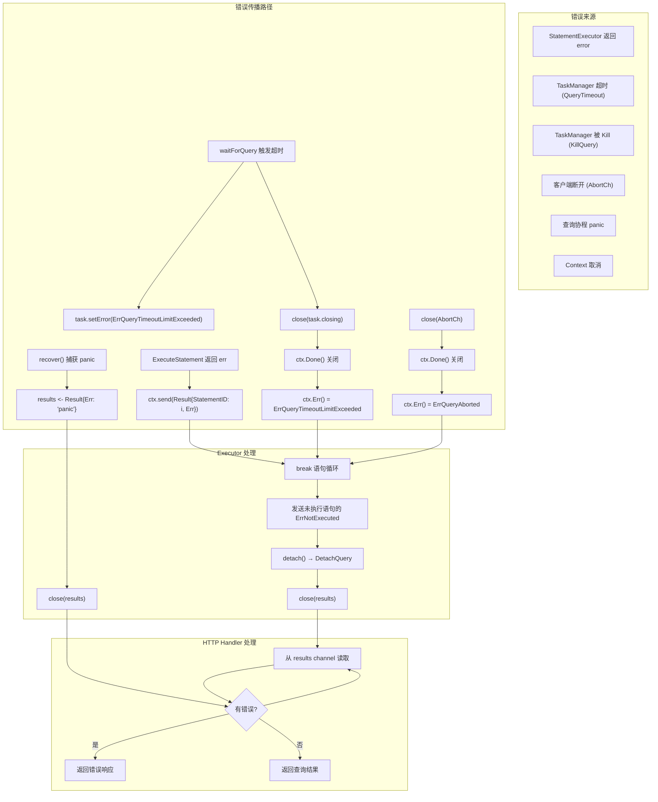

### 12.2 三级错误传播机制

| 级别 | 触发条件 | 错误类型 | 传播方式 |
|------|---------|---------|---------|
| **语句级** | ExecuteStatement 返回 error | 任意 error | Result{Err} → break 循环 |
| **查询级** | Kill/超时/客户端断开 | ErrQueryInterrupted/Timeout/Aborted | ctx.Done() → ctx.Err() |
| **协程级** | 查询协程 panic | "query [panic:xxx]" | recover() → Result{Err} |

### 12.3 ErrQueryInterrupted 的特殊处理

```go
// query/executor.go:397 — 特殊错误处理
err = e.StatementExecutor.ExecuteStatement(ctx, stmt)
if err == ErrQueryInterrupted {
    // ErrQueryInterrupted 只是"查询被中断"的信号
    // 真实的中断原因存储在 task.Error() 中
    if qerr := ctx.Err(); qerr != nil {
        err = qerr  // 替换为真实错误 (如 ErrQueryTimeoutLimitExceeded)
    }
}
```

> **设计要点**: `ErrQueryInterrupted` 是一个中间信号，表示"查询被外部中断了"。但中断的原因可能是超时、被 Kill、或客户端断开。Executor 会从 `ctx.Err()` 获取真实原因，确保用户看到的错误信息是准确的。

### 12.4 ShowQueriesStatement 的错误处理

当用户执行 `SHOW QUERIES` 时，TaskManager 会返回所有运行中查询的状态：

```go
// query/task_manager.go:136 — executeShowQueriesStatement
func (t *TaskManager) executeShowQueriesStatement(q *influxql.ShowQueriesStatement, authorizer CoarseAuthorizer) (models.Rows, error) {
    t.mu.RLock()
    defer t.mu.RUnlock()

    now := time.Now()
    values := make([][]interface{}, 0, len(t.queries))
    for id, qi := range t.queries {
        if authorizer != nil && qi.database != "" && !authorizer.AuthorizeDatabase(influxql.ReadPrivilege, qi.database) {
            continue   // 按数据库读权限过滤
        }
        d := now.Sub(qi.startTime)
        d = prettyTime(d)
        values = append(values, []interface{}{id, qi.query, qi.database, d.String(), qi.status.String(), qi.userID})
    }

    return []*models.Row{{
        Columns: queryFieldNames,   // task_manager.go:34
        Values:  values,
    }}, nil
}

// query/task_manager.go:34
var queryFieldNames []string = []string{"qid", "query", "database", "duration", "status", "user"}  // 6 列
```

当用户执行 `KILL QUERY <id>` 时：

```go
// query/task_manager.go:132 — executeKillQueryStatement
func (t *TaskManager) executeKillQueryStatement(stmt *influxql.KillQueryStatement) error {
    return t.KillQuery(stmt.QueryID)
}
```

## 13. 具体案例: 完整查询执行过程

### 13.1 查询语句

```sql
SELECT mean(value) FROM cpu WHERE host='web' AND time > now() - 1h GROUP BY time(5m) FILL(0)
```

### 13.2 逐步执行过程

> **具体案例**: 假设 `cpu` 表有以下数据（host=web, 每 10 秒一个点）:
>
> ```
> 时间        value  host
> 09:55:00    10.0   web
> 09:55:10    20.0   web
> 09:55:20    30.0   web
> 09:55:30    40.0   web
> 09:55:40    50.0   web
> 09:55:50    60.0   web
> 10:00:00    70.0   web
> 10:00:10    80.0   web
> 10:00:20    90.0   web
> 10:00:30    100.0  web
> 10:00:40    110.0  web
> 10:00:50    120.0  web
> 10:01:00    130.0  web
> 10:01:10    140.0  web
> 10:01:20    150.0  web
> 10:01:30    160.0  web
> 10:01:40    170.0  web
> 10:01:50    180.0  web
> ```
>
> 假设当前时间 `now()` = `10:02:00`

**步骤 1: HTTP 解析**

```
HTTP 请求: GET /query?db=mydb&q=SELECT mean(value) FROM cpu WHERE host='web' AND time > now() - 1h GROUP BY time(5m) FILL(0)

influxql.NewParser(reader).ParseQuery()
→ *Query{
    Statements: []Statement{
        &SelectStatement{
            Fields:    [{mean(value)}],
            Sources:   [{cpu}],
            Condition: host='web' AND time > now() - 1h,
            Dimensions: [{time(5m)}],
            Fill:      NumberFill (0),
        }
    }
}
```

**步骤 2: Executor.ExecuteQuery**

```
ExecuteQuery(query, opt{Database: "mydb"}, closing)
→ 创建 results channel
→ 启动 executeQuery 协程
→ 返回 results channel
```

**步骤 3: TaskManager.AttachQuery**

```
AttachQuery(query, opt, closing)
→ 检查 MaxConcurrentQueries (假设无限制)
→ 创建 Task{query: "SELECT mean...", database: "mydb", status: RunningTask}
→ 启动 waitForQuery 协程 (监听超时和中断)
→ 返回 ExecutionContext{QueryID: 1, task: task}
```

**步骤 4: 语句循环 — 第一条语句**

```
默认数据库: "mydb" (来自 ExecutionOptions)
系统 measurement 检查: cpu 不是系统 measurement → 通过
```

**步骤 5: RewriteStatement**

```
RewriteStatement(stmt)
→ 不是 SHOW 语句 → 返回原 stmt
```

**步骤 6: NormalizeStatement**

```
NormalizeStatement(stmt, "mydb", "")
→ 遍历 AST 节点
→ 找到 Measurement{Database: "", Name: "cpu"}
→ normalizeMeasurement:
  → m.Database = "mydb" (补全默认数据库)
  → 查找 MetaClient.Database("mydb")
  → m.RetentionPolicy = "autogen" (默认 RP)
→ 最终: cpu → mydb.autogen.cpu
```

**步骤 7: ExecuteStatement → executeSelectStatement**

```
executeSelectStatement(ctx, stmt)
→ createIterators(ctx, stmt, opt)
  → query.Select(ctx, stmt, mapper, opt)
```

**步骤 8: Compile**

```
Compile(stmt, CompileOptions{Now: 10:02:00})

preprocess:
  → Ascending = true
  → Limit = 0
  → HasTarget = false
  → ConditionExpr:
    → host='web' → 直接保留
    → time > now() - 1h → time > 09:02:00
    → cond = host='web' AND time > 09:02:00
    → TimeRange = {Min: 09:02:00, Max: zero}
  → compileDimensions:
    → time(5m) → Interval.Duration = 5m
  → FillOption = NumberFill
  → TimeRange.Max = now() = 10:02:00 (因为有 Interval)

compile:
  → compileFields:
    → field: mean(value)
    → MathValuer 化简: 无数学运算 → 保持原样
    → compiledField.compileExpr(Call{Name: "mean", Args: [value]})
    → 函数 "mean" → compileFunction
      → OnlySelectors = false (mean 不是 selector)
      → compileFunction(expr) → VarRef → 通过
  → validateFields:
    → 1 个非 time 字段 → 通过
    → 有 FunctionCalls 且无 TopBottom → 通过
    → 无 HasDistinct → 通过
    → 无 HasAuxiliaryFields → 通过

post-process:
  → RewriteDistinct: 无 DISTINCT → 跳过
  → RewriteTimeFields: 移除 time 字段 → 跳过
  → RewriteRegexConditions: 无正则 → 跳过

→ 返回 compiledStatement{
    Ascending: true,
    Interval: {Duration: 5m},
    FillOption: NumberFill,
    Fields: [{mean(value)}],
    TimeRange: {Min: 09:02:00, Max: 10:02:00},
    FunctionCalls: [mean(value)],
    OnlySelectors: false,
  }
```

**步骤 9: Prepare**

```
Prepare(mapper, opt)

→ 计算时间范围:
  → TimeRange = {Min: 09:02:00, Max: 10:02: 00}

→ MapShards(sources, timeRange, opt)
  → 查询 MetaClient: 找到 mydb.autogen 在 [09:02, 10:02] 范围内的 ShardGroups
  → 返回 ShardGroup (包含 2 个 Shard: SG1[09:00-10:00], SG2[10:00-11:00])

→ RewriteFields(mapper):
  → mean(value) 中的 value → 展开为实际字段名
  → 假设 value 是唯一的 float 字段 → 无变化

→ validateTypes(stmt) → 通过

→ newIteratorOptionsStmt(stmt, opt):
  → IteratorOptions{
      Ascending: true,
      StartTime: 09:02:00 的纳秒,
      EndTime: 10:02:00 的纳秒,
      Interval: {Duration: 5m},
      Fill: NumberFill,
      FillValue: int64(0),
      Dimensions: {},
      Ordered: true,
    }

→ 返回 preparedStatement{stmt, opt, ic: shards, maxPointN: 0}
```

**步骤 10: buildCursor**

```
buildCursor(ctx, stmt, ic, opt)

→ Fill 选项设置: NumberFill → FillValue = int64(0)
→ 构建 fields: [{mean(value)}]
→ valueMapper.Map:
  → mean(value) → 符号 "val0", type: Float
  → calls = {mean(value)}
  → refs = {value}

→ 有函数调用 → 并行构建
→ buildFieldIterator(ctx, mean(value), ic, sources, opt, false, false)
  → buildExprIterator → buildCallIterator(mean)
    → callIterator(ctx, mean, opt):
      → 遍历 sources: [cpu]
      → ic.CreateIterator(ctx, cpu, opt) → FloatIterator (从 TSM 读取)
      → Iterators(inputs).Merge(opt) → MergeIterator
    → NewCallIterator(itr, opt) → FloatMeanReducer
    → NewIntervalIterator(itr, opt) → 时间窗口对齐
    → NewFillIterator(itr, expr, opt) → 填充空窗口

→ scanner = NewIteratorScanner(itr, keys, int64(0))
→ return newScannerCursor(scanner, fields, opt)
```

**步骤 11: Emit 循环**

```
Emitter.NewEmitter(cur, chunkSize)

Emit 循环:

窗口 1: [09:55:00, 10:00:00)
  数据点: [10, 20, 30, 40, 50, 60]
  mean = (10+20+30+40+50+60) / 6 = 35.0
  → Emit() 返回 Row{time: 09:55:00, mean: 35.0}

窗口 2: [10:00:00, 10:05:00)
  数据点: [70, 80, 90, 100, 110, 120, 130, 140, 150, 160, 170, 180]
  mean = (70+80+90+100+110+120+130+140+150+160+170+180) / 12 = 125.0
  → Emit() 返回 Row{time: 10:00:00, mean: 125.0}

Emit() 返回 nil → 循环结束
```

**步骤 12: 发送结果**

```
ctx.Send(Result{Series: [Row{time: 09:55:00, mean: 35.0}]})
→ results <- Result

ctx.Send(Result{Series: [Row{time: 10:00:00, mean: 125.0}]})
→ results <- Result
```

**步骤 13: 清理**

```
Emitter.Close()
detach() → DetachQuery(1) → delete(queries, 1)
close(results)
```

### 13.3 最终返回结果

```
name: cpu
tags: host=web
columns: time                 mean
values:
  2024-01-01T09:55:00Z       35.0
  2024-01-01T10:00:00Z       125.0
```

> **注意**: 如果某个 5 分钟窗口内没有数据点（例如查询时间范围跨越了多个小时），FILL(0) 会确保该窗口返回 `mean = 0` 而不是被跳过。

## 14. NormalizeStatement — 语句标准化 (coordinator/statement_executor.go:1384)

### 14.1 NormalizeStatement 实现

```go
// coordinator/statement_executor.go:1384 — NormalizeStatement
func (e *StatementExecutor) NormalizeStatement(stmt influxql.Statement, defaultDatabase, defaultRetentionPolicy string) (err error) {
    influxql.WalkFunc(stmt, func(node influxql.Node) {
        if err != nil {
            return
        }
        switch node := node.(type) {
        case *influxql.ShowRetentionPoliciesStatement:
            if node.Database == "" {
                node.Database = defaultDatabase
            }
        case *influxql.ShowMeasurementsStatement:
            if node.Database == "" {
                node.Database = defaultDatabase
            }
        case *influxql.ShowTagKeysStatement:
            if node.Database == "" {
                node.Database = defaultDatabase
            }
        case *influxql.ShowTagValuesStatement:
            if node.Database == "" {
                node.Database = defaultDatabase
            }
        case *influxql.ShowMeasurementCardinalityStatement:
            if node.Database == "" {
                node.Database = defaultDatabase
            }
        case *influxql.ShowSeriesCardinalityStatement:
            if node.Database == "" {
                node.Database = defaultDatabase
            }
        case *influxql.Measurement:
            switch stmt.(type) {
            case *influxql.DropSeriesStatement, *influxql.DeleteSeriesStatement:
                // DROP/DELETE SERIES 不支持 DB/RP 重写
            case *influxql.ShowTagValuesStatement:
                // SHOW TAG VALUES 应跨多个 RP (不指定 RP 时) — statement_executor.go:1419-1420
                // 因此跳过 normalizeMeasurement，不强制补全默认 RP
            default:
                err = e.normalizeMeasurement(node, defaultDatabase, defaultRetentionPolicy)
            }
        }
    })
    return
}
```

> **审计校准** (statement_executor.go:1419-1420): `ShowTagValuesStatement` 被显式排除在
> `normalizeMeasurement` 之外，这样 SHOW TAG VALUES 在未指定 RP 时会跨所有 RP 查询，
> 而不是被锁定到默认 RP。citation 1277 → **1384**；`normalizeMeasurement` 在 1429 (非 1320)。

### 14.2 normalizeMeasurement — 补全 DB/RP

```go
// coordinator/statement_executor.go:1429 — normalizeMeasurement
func (e *StatementExecutor) normalizeMeasurement(m *influxql.Measurement, defaultDatabase, defaultRetentionPolicy string) error {
    // INTO 子句的 measurement 可以有空名称
    if !m.IsTarget && m.Name == "" && m.SystemIterator == "" && m.Regex == nil {
        return errors.New("invalid measurement")
    }

    // 补全数据库
    if m.Database == "" {
        m.Database = defaultDatabase
    }
    if m.Database == "" {
        return ErrDatabaseNameRequired
    }

    // 查找数据库
    di := e.MetaClient.Database(m.Database)
    if di == nil {
        return influxdb.ErrDatabaseNotFound(m.Database)
    }

    // 补全保留策略
    if m.RetentionPolicy == "" {
        if defaultRetentionPolicy != "" {
            m.RetentionPolicy = defaultRetentionPolicy
        } else if di.DefaultRetentionPolicy != "" {
            m.RetentionPolicy = di.DefaultRetentionPolicy
        } else {
            return fmt.Errorf("default retention policy not set for: %s", di.Name)
        }
    }
    return nil
}
```

## 15. 关键文件索引

| 文件 | 行数 | 职责 |
|------|------|------|
| `query/executor.go` | ~488 | 执行器核心: ExecuteQuery, 语句循环, panic 恢复 |
| `query/task_manager.go` | ~320 | 任务管理: AttachQuery, KillQuery, waitForQuery, ShowQueries |
| `query/execution_context.go` | ~114 | 执行上下文: watch, Done, Err, Send |
| `query/statement_rewriter.go` | ~497 | SHOW 语句重写: 10 种 SHOW → SELECT |
| `query/compile.go` | ~1206 | 查询编译: preprocess, compile, validateFields, Prepare |
| `query/select.go` | ~993 | 查询执行入口: Select, Prepare, buildCursor, buildFieldIterator |
| `query/cursor.go` | ~250 | Cursor: 多迭代器合并, 数学运算求值 |
| `query/emitter.go` | ~82 | Emitter: 按 series 分组输出结果 |
| `query/iterator.go` | ~1423 | 核心接口: Iterator, IteratorOptions, Window, Merge |
| `coordinator/statement_executor.go` | ~1409 | 语句分发: ExecuteStatement, executeSelectStatement, NormalizeStatement |

## 16. 架构设计意图

### 16.1 为什么 SELECT 单独处理

SELECT 语句是唯一需要**流式返回**的语句。其他语句（CREATE, DROP, SHOW）的结果集很小，可以一次性返回。SELECT 的结果可能有数百万行，必须流式返回以避免内存溢出。

```go
// coordinator/statement_executor.go:66
if stmt, ok := stmt.(*influxql.SelectStatement); ok {
    return e.executeSelectStatement(ctx, stmt)  // 流式返回
}
// 其他语句一次性返回
return ctx.Send(&query.Result{Series: rows})
```

### 16.2 为什么 SHOW 语句要重写为 SELECT

SHOW 语句的底层数据存储在系统迭代器（`_fieldKeys`, `_series` 等）中。将 SHOW 重写为 SELECT 后，可以复用 SELECT 的完整执行链路（编译、准备、游标构建、执行），避免为每种 SHOW 语句单独实现执行逻辑。

### 16.3 为什么使用 channel 返回结果

```go
// query/executor.go:296
func (e *Executor) ExecuteQuery(...) <-chan *Result {
    results := make(chan *Result)
    go e.executeQuery(query, opt, closing, results)
    return results
}
```

使用 channel 返回结果有三个好处：
1. **流式返回**: 调用者可以边读边处理，不需要等待全部结果
2. **背压控制**: 如果调用者处理慢，channel 阻塞会让查询协程暂停
3. **并发安全**: 多个语句的结果通过同一个 channel 串行化

### 16.4 为什么使用 errgroup 并行构建迭代器

```go
// query/select.go:731
var g errgroup.Group
for call := range valueMapper.calls {
    call := call
    g.Go(func() error {
        itr, err := buildFieldIterator(ctx, call, ...)
        ...
    })
}
```

当查询包含多个聚合函数时（如 `SELECT mean(value), max(value), min(value) FROM cpu`），每个函数的迭代器构建是独立的。并行构建可以显著减少准备阶段的耗时。

### 16.5 为什么 Executor 要 panic 恢复

查询引擎处理用户输入的复杂表达式，可能触发未预料的边界条件（如除零、空数组访问）。如果 panic 传播到 HTTP handler，会导致整个连接关闭甚至进程崩溃。在 Executor 层捕获 panic 可以：
1. 返回友好的错误信息
2. 保持其他查询不受影响
3. 记录详细的堆栈信息用于调试

## 17. 架构收益

| 维度 | 收益 |
|------|------|
| **流式返回** | 通过 channel 实现，内存占用与结果集大小无关 |
| **并发控制** | TaskManager 的 MaxConcurrentQueries 防止查询风暴 |
| **超时保护** | QueryTimeout + waitForQuery 协程，防止查询无限运行 |
| **语句重写** | SHOW 语句复用 SELECT 执行链路，减少代码重复 |
| **标准化** | 自动补全 DB/RP，用户无需每次指定完整路径 |
| **并行构建** | errgroup 并行创建迭代器，多函数查询更快 |
| **panic 恢复** | 查询 panic 不影响其他查询，不崩溃进程 |
| **错误传播** | 三级错误机制（语句级/查询级/协程级），确保错误信息准确 |
| **优雅终止** | channel 关闭模式，所有协程收到信号后立即停止 |
| **缓冲写入** | INTO 语句的 BufferedPointsWriter，批量写入提高吞吐 |
| **符号映射** | valueMapper 避免重复迭代器，减少资源浪费 |
| **子查询支持** | 独立编译 + 时间范围交集 + Interval 继承 |

## 18. 潜在隐患与瓶颈

### 18.1 TaskManager.mu 的锁竞争

```go
// query/task_manager.go:210
func (t *TaskManager) AttachQuery(...) (*ExecutionContext, func(), error) {
    t.mu.Lock()
    defer t.mu.Unlock()
    // ... 检查并发限制、创建 Task、注册查询
}
```

`AttachQuery` 和 `DetachQuery` 都需要获取写锁。在高并发场景下（大量短查询），锁竞争可能导致查询吞吐量下降。`ShowQueriesStatement` 需要读锁，但 `KillQuery` 需要写锁，混合使用会加剧竞争。

### 18.2 results channel 无缓冲

```go
// query/executor.go:297
results := make(chan *Result)  // 无缓冲!
```

无缓冲 channel 意味着：查询协程发送结果时必须等待 HTTP handler 接收。如果 HTTP handler 处理慢（如网络拥塞），查询协程会被阻塞，无法继续执行。这可能导致查询超时。

### 18.3 语句串行执行

```go
// query/executor.go:329
for ; i < len(query.Statements); i++ {
    // 逐条执行语句
}
```

多条语句（用分号分隔）是串行执行的。如果第一条语句很慢，后面的语句会被延迟。这在 `SHOW QUERIES; SELECT ...` 这种组合查询中可能导致问题。

### 18.4 Compile 时的 AST 克隆

```go
// query/compile.go:108
c.stmt = stmt.Clone()  // 克隆整个 AST
```

每次编译都会克隆整个 AST。对于复杂查询（大量字段、子查询），克隆操作的内存分配和 CPU 开销不可忽视。

### 18.5 NormalizeStatement 的 WalkFunc 遍历

```go
// coordinator/statement_executor.go:1278
influxql.WalkFunc(stmt, func(node influxql.Node) { ... })
```

`WalkFunc` 会遍历整个 AST 树。对于复杂查询，遍历次数与 AST 节点数成正比。而且 `normalizeMeasurement` 内部还会调用 `MetaClient.Database()`，涉及锁操作。

### 18.6 SHOW 语句重写后的 Condition 复杂度

```go
// SHOW TAG VALUES FROM cpu WITH KEY IN (host, region)
// 重写后:
// WHERE (_tagKey = 'host' OR _tagKey = 'region') AND (_name = 'cpu')
```

当 `WITH KEY IN (...)` 包含大量 key 时，重写后的 OR 条件会很长，影响后续的条件求值性能。

### 18.7 Emitter 的逐行输出

```go
// coordinator/statement_executor.go:564
row, partial, err := em.Emit()
```

Emitter 每次返回一个 `models.Row`。对于高基数查询（大量 series），每行的数据量很小，但 Emit 调用次数很多，函数调用开销成为瓶颈。

### 18.8 buildCursor 中的 Mutex 保护

```go
// query/select.go:755
mu.Lock()
scanners = append(scanners, scanner)
mu.Unlock()
```

虽然使用 errgroup 并行构建迭代器，但收集 scanner 时需要 Mutex 保护。对于大量函数调用的查询，Mutex 竞争可能成为瓶颈。

### 18.9 waitForQuery 的 Goroutine 泄漏风险

```go
// query/task_manager.go:196
go t.waitForQuery(qid, query.closing, interrupt, query.monitorCh)
```

每个查询都会启动一个 waitForQuery 协程。如果查询正常结束，`interrupt` channel 被关闭，协程退出。但如果 `interrupt` channel 从未被关闭（如调用者忘记），协程会泄漏。

### 18.10 PointLimitMonitor 的异步性

```go
// query/select.go:130
monitor := PointLimitMonitor(cur, DefaultStatsInterval, p.maxPointN)
m.Monitor(monitor)
```

PointLimitMonitor 在后台协程中检查点数。当点数超过限制时，它会通过 `task.monitorCh` 发送错误，导致查询被 Kill。但这个检查是异步的，在检查间隔内，查询可能已经读取了超过限制的点数。

### 18.11 编译器不缓存编译结果

每次执行查询都需要重新编译。对于高频执行的相同查询（如仪表盘刷新），重复编译是浪费。InfluxDB 没有查询缓存机制。

### 18.12 INTO 语句的原子性

INTO 语句先查询再写入。如果查询成功但写入失败（如磁盘满），部分数据已经写入目标 measurement，无法回滚。这违反了原子性原则。
