# Module 12: 后台服务 (Retention + Precreator + Lease 机制) - 深度审计报告

> **小白导读**: 想象你经营一家仓储物流公司，除了日常收发快递（读写数据），还需要一群"后台管家"默默维护仓库秩序：
>
> - **Retention Service（数据保留服务）**= 仓库清理员。每个货架（ShardGroup）都有保质期，过期的货物必须清走。
>   清理分两步：先在账本上划掉（软删除），再真正搬走货物（物理删除），最后把空货架也拆掉（元数据修剪）。
>
> - **Precreator Service（预创建服务）**= 仓库调度员。它提前把新货架搭好，这样新货物到了就能直接上架，
>   不用临时手忙脚乱地搭架子（避免写入时触发 Raft 共识的延迟）。
>
> - **Lease 机制（租约）**= 仓库钥匙管理。在多仓库（集群）场景下，同一时间只允许一个人持有钥匙执行特定任务，
>   防止重复劳动。在单机模式下，钥匙管理简化为"永远给你"。
>
> **后台管家的工作节奏**：
> - Retention 每 30 分钟巡查一圈（ticker 驱动）
> - Precreator 每 10 分钟巡查一圈（time.After 驱动）
> - 两者都不使用租约，每个节点各自负责自己的清理和预创建工作

## 1. 后台服务总览

### 1.1 三大后台服务对比

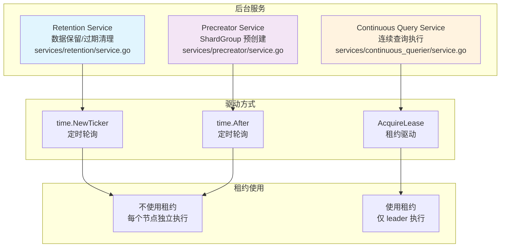

| 服务 | 源码位置 | 驱动方式 | 默认间隔 | 是否使用租约 | 职责 |
|------|----------|----------|----------|-------------|------|
| **Retention Service** | `services/retention/service.go:50` | `time.NewTicker` | 30 分钟 | 否 | 删除过期数据和 ShardGroup |
| **Precreator Service** | `services/precreator/service.go:13` | `time.After` | 10 分钟 | 否 | 预创建即将到期的 ShardGroup |
| **CQ Service** | `services/continuous_querier/service.go` | `AcquireLease` | 可配置 | 是 | 仅 leader 执行连续查询 |

### 1.2 为什么 Retention 和 Precreator 不使用租约

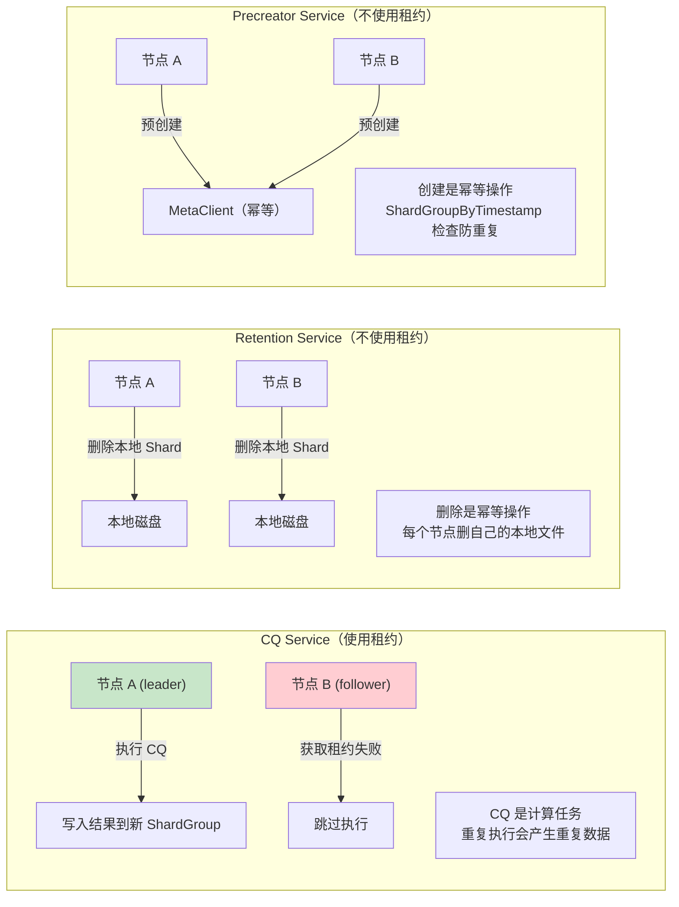

**设计决策**：
- **CQ 必须用租约**：连续查询是计算任务，如果多个节点同时执行，会产生重复数据写入
- **Retention 不需要租约**：每个节点删除的是自己本地磁盘上的 Shard 文件，是天然分布式的
- **Precreator 不需要租约**：`ShardGroupByTimestamp` 检查保证幂等性，重复创建不会产生副作用

### 1.3 服务生命周期

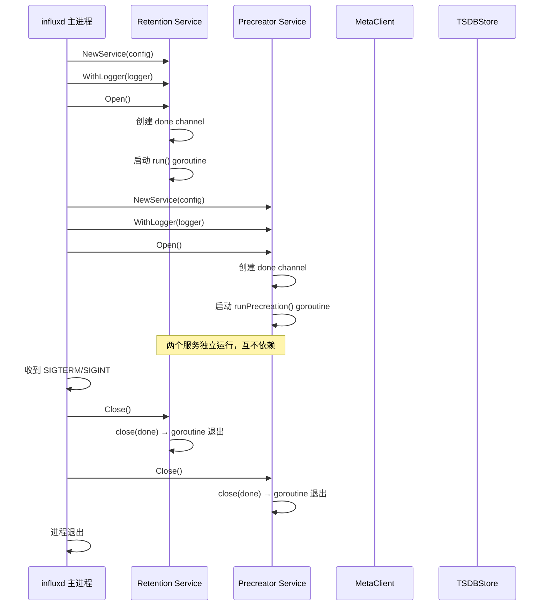

## 2. Retention Service 全链路

### 2.1 Service 结构体

```go
// services/retention/service.go:18-28 — 两个 MetaClient 接口
type OSSMetaClient interface {
    Databases() []meta.DatabaseInfo
    DeleteShardGroup(database, policy string, id uint64) error
    DropShard(id uint64) error           // service.go:21 — 清理 shard 元数据引用
    PruneShardGroups() error
}

type MetaClient interface {
    OSSMetaClient                        // 嵌入 OSSMetaClient
    NodeID() uint64                      // Enterprise 节点 ID；OSS 用 ossMetaClientAdapter 返回 ossNodeID
}

// services/retention/service.go:50 — Service
type Service struct {
    MetaClient                           // 嵌入 MetaClient (OSS 或 Enterprise 实现)
    TSDBStore interface {
        ShardIDs() []uint64
        DeleteShard(shardID uint64) error
        SetShardNewReadersBlocked(shardID uint64, blocked bool) error
        ShardInUse(shardID uint64) (bool, error)
    }
    DropShardMetaRef func(shardID uint64, owners []uint64) error

    config Config
    wg     sync.WaitGroup
    done   chan struct{}

    logger *zap.Logger
}
```

> **审计校准** (service.go:18-28):
> - `MetaClient` 接口包含 `DropShard(id uint64) error` (line 21)。
> - 实际是**两个**接口：`OSSMetaClient` (Databases, DeleteShardGroup, DropShard, PruneShardGroups)
>   和 `MetaClient` (嵌入 `OSSMetaClient` + `NodeID() uint64`)。
> - Service 通过嵌入 `MetaClient` 获得全部方法；OSS 用 `ossMetaClientAdapter`
>   (service.go:40-47) 包装 `OSSMetaClient` 并提供 `NodeID() = ossNodeID`。

### 2.2 配置默认值

```go
// services/retention/config.go:18 — NewConfig
func NewConfig() Config {
    return Config{Enabled: true, CheckInterval: toml.Duration(30 * time.Minute)}
}
```

| 配置项 | 默认值 | 说明 |
|--------|--------|------|
| `enabled` | `true` | 是否启用保留策略服务 |
| `check-interval` | `30m` | 检查间隔，每 30 分钟扫描一次过期数据 |

### 2.3 run() 主循环全链路

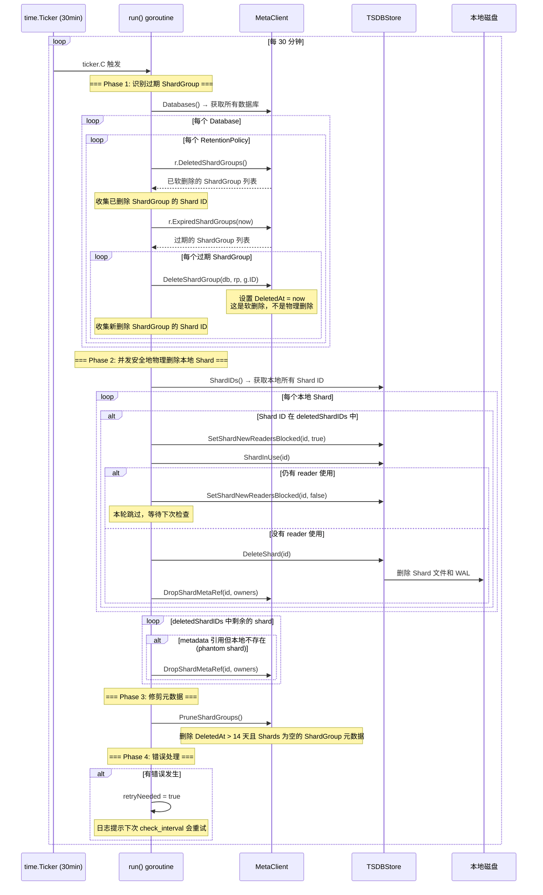

### 2.4 Phase 1: 识别过期 ShardGroup

```go
// services/retention/service.go:180-214 — Phase 1
deletedShardIDs := make(map[uint64]deletionInfo)

// 1. 收集已软删除的 ShardGroup 的 Shard ID
dbs := s.MetaClient.Databases()
for _, d := range dbs {
    for _, r := range d.RetentionPolicies {
        for _, g := range r.DeletedShardGroups() {
            for _, sh := range g.Shards {
                deletedShardIDs[sh.ID] = deletionInfo{db: d.Name, rp: r.Name}
            }
        }

        // 2. 找到过期的 ShardGroup 并软删除
        for _, g := range r.ExpiredShardGroups(time.Now().UTC()) {
            if err := s.MetaClient.DeleteShardGroup(d.Name, r.Name, g.ID); err != nil {
                retryNeeded = true
                continue
            }
            for _, sh := range g.Shards {
                deletedShardIDs[sh.ID] = deletionInfo{db: d.Name, rp: r.Name}
            }
        }
    }
}
```

**过期判断逻辑** (`services/meta/data.go:1275`)：

```go
// services/meta/data.go:1275 — ExpiredShardGroups
func (rpi *RetentionPolicyInfo) ExpiredShardGroups(t time.Time) []*ShardGroupInfo {
    var groups = make([]*ShardGroupInfo, 0)
    for i := range rpi.ShardGroups {
        if rpi.ShardGroups[i].Deleted() {
            continue  // 跳过已删除的
        }
        // 关键判断: EndTime + Duration < now
        // 即 ShardGroup 的结束时间加上保留时长已经过了当前时间
        if rpi.Duration != 0 && rpi.ShardGroups[i].EndTime.Add(rpi.Duration).Before(t) {
            groups = append(groups, &rpi.ShardGroups[i])
        }
    }
    return groups
}
```

**软删除逻辑** (`services/meta/data.go:454-472`)：

```go
// services/meta/data.go:454 — DeleteShardGroup
func (data *Data) DeleteShardGroup(database, policy string, id uint64) error {
    rpi, err := data.RetentionPolicy(database, policy)
    // ... 错误检查 ...

    // 找到 ShardGroup 并设置 DeletedAt 时间戳
    for i := range rpi.ShardGroups {
        if rpi.ShardGroups[i].ID == id {
            rpi.ShardGroups[i].DeletedAt = time.Now().UTC()  // 软删除标记
            return nil
        }
    }
    return ErrShardGroupNotFound
}
```

> **小白解释**: 软删除就像在账本上画个叉，表示"这个货架要拆了"，但货物还在原地。
> 真正搬走货物是 Phase 2 的事。

### 2.4a deletionInfo — 函数局部类型与 owners 提取

`DeletionCheck` 在函数内部定义了一个**函数局部 struct** `deletionInfo` (service.go:161-172)，
并通过 `newDeletionInfo` 闭包从 `meta.ShardInfo` 提取 `Owners`（每个 owner 的 `NodeID`），
用于后续 phantom-shard 检查和 `DropShardMetaRef` 调用。

```go
// services/retention/service.go:161-172 — deletionInfo (函数局部类型)
type deletionInfo struct {
    db     string
    rp     string
    owners []uint64
}
newDeletionInfo := func(db, rp string, si meta.ShardInfo) deletionInfo {
    owners := make([]uint64, len(si.Owners))
    for i, o := range si.Owners {
        owners[i] = o.NodeID
    }
    return deletionInfo{db: db, rp: rp, owners: owners}
}
deletedShardIDs := make(map[uint64]deletionInfo)
```

**关键设计点**:
- **函数局部类型**: `deletionInfo` 只在 `DeletionCheck` 作用域内可见，不污染包级命名空间。
  这符合 Go "小作用域优先" 的惯用法——该结构只服务于本轮删除检查，不需要外部复用。
- **owners 提取**: `meta.ShardInfo.Owners` 是 `[]ShardOwner{NodeID uint64}`，而
  `DropShardMetaRef(shardID, owners []uint64)` 接收的是裸 `[]uint64`。`newDeletionInfo`
  做的就是 `[]ShardOwner → []uint64` 的扁平化转换，避免在 phantom-shard 分支
  (service.go:283-300) 重复遍历 `si.Owners`。
- **OSS 场景下 owners 为空**: OSS 每个 ShardGroup 只有 1 个 Shard 且 `ShardInfo.Owners`
  为空 (Module 06 已确认)，所以 `newDeletionInfo` 返回的 `owners` 在 OSS 中恒为空切片。
  但 Enterprise 模式下 `owners` 非空，`isOSS()` 分支 (service.go:288) 会据此判断
  "本节点是否应该清理这个 phantom shard 的 meta 引用"。

> **具体案例**: phantom shard 的 owners 提取
>
> 假设 Enterprise 集群有 3 个节点 (NodeID=1,2,3)，shard 42 的 `ShardInfo.Owners = [{1}, {3}]`
> (即 shard 42 的数据副本存在节点 1 和节点 3 上)。
>
> 1. 节点 1 的 Retention Service 发现 shard 42 过期，`newDeletionInfo("mydb", "autogen", sh)`
>    返回 `deletionInfo{db:"mydb", rp:"autogen", owners:[1, 3]}`。
> 2. 节点 1 本地 `DeleteShard(42)` 成功，调用 `DropShardMetaRef(42, [1, 3])`。
> 3. 节点 3 因为网络延迟还没删完，它的 `deletedShardIDs[42]` 仍保留同样的 owners。
> 4. 节点 3 下一轮检查时，`isOSS()` 返回 false，`slices.Contains(info.owners, s.NodeID())`
>    (NodeID=3 ∈ [1,3]) 为 true，于是节点 3 也执行本地 `DeleteShard(42)` + `DropShardMetaRef`。
>
> 如果跳过 `newDeletionInfo` 的 owners 提取，phantom-shard 分支就无法判断"这个 shard
> 是否归属本节点"，可能导致非 owner 节点误删 meta 引用或 owner 节点漏删。

### 2.5 Phase 2: 并发安全地物理删除本地 Shard

> **审计校准** (service.go:217-281): 真实代码用 **defer-based unblock 模式**，
> 把 shard 删除包在一个返回 `rErr` 的匿名函数里。阻塞解除**不是**内联调用，
> 而是由 defer 在函数返回时按条件执行。

```go
// services/retention/service.go:217-281 — Phase 2
for _, id := range s.TSDBStore.ShardIDs() {
    if info, ok := deletedShardIDs[id]; ok {
        delete(deletedShardIDs, id)

        err := func() (rErr error) {           // 匿名函数，rErr 被 defer 捕获
            // ... (logger operation 设置略)

            // ① 阻止新 reader 进入
            if err := s.TSDBStore.SetShardNewReadersBlocked(id, true); err != nil {
                return fmt.Errorf("error blocking new readers for shard: %w", err)
            }
            // ② defer: 仅当 rErr != nil 且不是 ErrShardNotFound 时才解除阻塞
            //    ErrShardNotFound 特意 SUPPRESS 解除阻塞 (shard 已不在 store，无需 unblock)
            defer func() {
                if rErr != nil && !errors.Is(rErr, tsdb.ErrShardNotFound) {
                    s.TSDBStore.SetShardNewReadersBlocked(id, false)
                }
            }()

            // ③ 检查旧 reader 是否仍在使用
            if inUse, err := s.TSDBStore.ShardInUse(id); err != nil {
                return fmt.Errorf("error checking if shard is in-use: %w", err)
            } else if inUse {
                return errors.New("can not delete an in-use shard")   // service.go:250
            }

            // ④ 物理删除
            if err := s.TSDBStore.DeleteShard(id); err != nil {
                return fmt.Errorf("error deleting shard from store: %w", err)
            }
            return nil
        }()

        // ⑤ ErrShardNotFound 不算失败 — 继续清理 meta reference
        if err != nil && !errors.Is(err, tsdb.ErrShardNotFound) {
            retryNeeded = true
            continue
        }

        // ⑥ 清理 metadata 引用 (DropShardMetaRef)
        if err := s.DropShardMetaRef(id, info.owners); err != nil {
            retryNeeded = true
        }
    }
}

// deletedShardIDs 中剩余的是 metadata 有引用、但本地 store 不存在的过期 shard (phantom)。
for id, info := range deletedShardIDs {
    if s.isOSS() || slices.Contains(info.owners, s.NodeID()) {
        if err := s.DropShardMetaRef(id, info.owners); err != nil {
            retryNeeded = true
        }
    }
}
```

**关键设计** (service.go:237-244):
- 阻塞解除由 `defer` 在匿名函数返回时执行，**不是**内联调用。
- defer 的条件是 `rErr != nil && !errors.Is(rErr, tsdb.ErrShardNotFound)`：
  - 失败 (非 ErrShardNotFound) → 解除阻塞，下轮重试。
  - `ErrShardNotFound` → **特意图省略**解除阻塞 (shard 已不在 store，`SetShardNewReadersBlocked` 也会失败)。
- `ShardInUse` 返回 true 时返回 `errors.New("can not delete an in-use shard")`，
  由 defer 解除阻塞（因为这是 `rErr != nil` 路径，且错误不是 `ErrShardNotFound`）。
- 成功路径 (`rErr == nil`) 不解除阻塞——shard 已删除，阻塞标记随 shard 一起消失。

### 2.6 Phase 3: 修剪元数据

```go
// services/retention/service.go:302-309 — Phase 3
if err := s.MetaClient.PruneShardGroups(); err != nil {
    log.Info("Problem pruning shard groups", zap.Error(err))
    retryNeeded = true
}
```

`PruneShardGroups` 的实现（`services/meta/client.go:680-704`）：

```go
// services/meta/client.go:680 — PruneShardGroups
func (c *Client) PruneShardGroups() error {
    var changed bool
    expiration := time.Now().Add(ShardGroupDeletedExpiration)  // -14 天
    c.mu.Lock()
    defer c.mu.Unlock()
    data := c.cacheData.Clone()
    for i, d := range data.Databases {
        for j, rp := range d.RetentionPolicies {
            var remainingShardGroups []ShardGroupInfo
            for _, sgi := range rp.ShardGroups {
                // 保留: 未删除 或 删除时间不超过 14 天
                if sgi.DeletedAt.IsZero() || !expiration.After(sgi.DeletedAt) || len(sgi.Shards) > 0 {
                    remainingShardGroups = append(remainingShardGroups, sgi)
                    continue
                }
                changed = true  // 该 ShardGroup 的元数据将被移除
            }
            data.Databases[i].RetentionPolicies[j].ShardGroups = remainingShardGroups
        }
    }
    if changed {
        return c.commit(data)
    }
    return nil
}
```

**ShardGroupDeletedExpiration 常量**：

```go
// services/meta/client.go:36 — ShardGroupDeletedExpiration
ShardGroupDeletedExpiration = -2 * 7 * 24 * time.Hour  // -14 天
```

> **小白解释**: 软删除后，元数据还要保留 14 天。为什么？因为集群中的其他节点可能还没来得及
> 物理删除自己的 Shard 文件。14 天的缓冲期确保所有节点都有足够时间完成清理。

### 2.7 Phase 4: 错误处理与重试

```go
// services/retention/service.go:311-313
if retryNeeded {
    log.Info("One or more errors occurred during shard deletion and will be retried on the next check", logger.DurationLiteral("check_interval", time.Duration(s.config.CheckInterval)))
}
```

**重试策略**: 不使用指数退避，而是在下一个 `check_interval`（默认 30 分钟）自然重试。
这是因为保留策略检查本身就是周期性的，不需要额外的重试机制。

## 3. TSDBStore.DeleteShard — 物理删除完整流程

### 3.1 DeleteShard 全链路

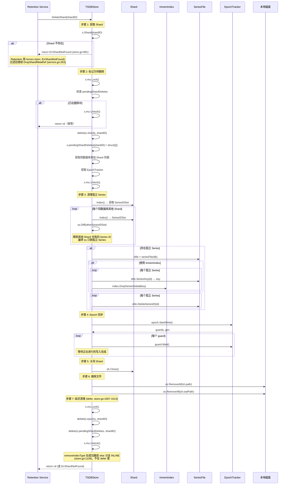

### 3.2 步骤 1: 获取 Shard

```go
// tsdb/store.go:978 — DeleteShard
func (s *Store) DeleteShard(shardID uint64) error {
    sh := s.Shard(shardID)
    if sh == nil {
        return ErrShardNotFound  // tsdb/store.go:33 — 不是 return nil
    }
```

> **审计校准** (store.go:978-982): Shard 不存在时返回 `ErrShardNotFound`，**不是** `return nil`。
> 幂等性由 **Retention caller** 保证：service.go:263 用 `!errors.Is(err, tsdb.ErrShardNotFound)`
> 过滤该错误，把它视为"磁盘已经没有数据"并继续调用 `DropShardMetaRef`，而不是重试。
> `DeleteShard` 本身只负责报告事实（shard 在不在），不负责吞掉错误。

### 3.3 步骤 2: 标记为待删除

```go
// tsdb/store.go:988-1005
s.mu.Lock()
if _, ok := s.pendingShardDeletes[shardID]; ok {
    // 已在删除中，避免重复删除
    s.mu.Unlock()
    return nil
}
delete(s.shards, shardID)              // 从活跃 Shard 表中移除
s.pendingShardDeletes[shardID] = struct{}{}  // 标记为待删除

db := sh.Database()
shards := s.filterShards(byDatabase(db))  // 获取同数据库其他 Shard
epoch := s.epochs[shardID]
s.mu.Unlock()
```

**为什么先从 `s.shards` 移除？** 因为 `s.shards` 是 Shard 的索引表，
查询和写入都会通过它查找 Shard。移除后，新的读写请求不会再访问这个 Shard。

### 3.4 步骤 3: 清理孤立 Series

> **审计校准** (store.go:1042-1116): 真实代码使用 **NoFlush 批量删除**模式：
> `sfile.DeleteSeriesID(id, NoFlush)` 返回 partition `p`，收集到 `partitionIDs` map；
> 循环结束后再 `sfile.FlushSegments(partitionIDs)` 一次性刷盘。
> 每删除 `DeleteLogTrigger = 10_000` 个 series 打一条进度日志。
> InmemIndex 路径用 `errs []error` + `errors.Join` 收集错误。

```go
// tsdb/store.go:1042-1116
// 获取被删除 Shard 的 SeriesIDSet
index, err := sh.Index()
ss := index.SeriesIDSet()

// 与同数据库其他 Shard 的 SeriesIDSet 做 Diff
s.walkShards(shards, func(sh *Shard) error {
    index, err := sh.Index()
    ss.Diff(index.SeriesIDSet())  // 移除其他 Shard 也有的 Series
    return nil
})

// ss 现在只包含"孤立"的 Series（只存在于被删除的 Shard 中）
if ss.Cardinality() > 0 {
    sfile := s.seriesFile(db)
    if sfile != nil {
        // InmemIndex 需要先从内存索引移除 (错误用 errs []error 收集)
        if index.Type() == InmemIndexName {
            var errs []error
            ss.ForEach(func(id uint64) {
                skey := sfile.SeriesKey(id)
                name, tagsBuf = ParseSeriesKeyInto(skey, tagsBuf)
                keyBuf = models.AppendMakeKey(keyBuf, name, tagsBuf)
                if tmpErr := index.DropSeriesGlobal(keyBuf); tmpErr != nil {
                    errs = append(errs, tmpErr)
                }
            })
            if len(errs) != 0 {
                return errors.Join(errs...)   // store.go:1072
            }
        }

        // NoFlush 批量删除: 每个 series 删除时不立即刷盘
        const DeleteLogTrigger = 10_000       // store.go:1076
        seriesCount := ss.Cardinality()
        var deletedCount atomic.Uint64
        var partitionIDs = make(map[int]struct{}, SeriesFilePartitionN)  // store.go:1080

        ss.ForEach(func(id uint64) {
            p, err := sfile.DeleteSeriesID(id, NoFlush)   // store.go:1083 — NoFlush!
            if err != nil {
                sfile.Logger.Error("cannot delete series in shard", ...)
            } else {
                partitionIDs[p.id] = struct{}{}            // store.go:1092 — 收集涉及的 partition
                deleted := deletedCount.Add(1)
                if deleted%DeleteLogTrigger == 0 {          // store.go:1095 — 每 10_000 条打日志
                    s.Logger.Info(fmt.Sprintf("DeleteShard: %d series deleted", DeleteLogTrigger), ...)
                }
            }
        })

        // 循环结束后一次性刷盘所有涉及的 partition
        if err := sfile.FlushSegments(partitionIDs); err != nil {   // store.go:1108
            sfile.Logger.Error("error while flushing a series file segment", ...)
        }
    }
}
```

**NoFlush 批量的性能意义**: SeriesFile 按 partition 组织，每次刷盘是昂贵的磁盘 IO。
如果每个 series 删除都立即刷盘，百万级 series 会产生百万次 IO。NoFlush 模式把删除
累积在内存，最后按 partition 批量刷盘，IO 次数从 O(seriesN) 降到 O(partitionN)。

**Series 清理的必要性**: 如果不清理孤立 Series，SeriesFile 会无限增长。
SeriesFile 是所有数据库共享的全局索引，包含每个 Series 的 key（measurement + tags）。
删除不再有任何数据引用的 Series 可以回收空间。

**Diff 操作的数学含义**:
```
原始 SeriesIDSet = {1, 3, 5, 7, 9}   (被删除 Shard 的 Series)
其他 Shard A     = {1, 2, 5, 8}
其他 Shard B     = {3, 6, 9}

Diff(A): {1, 3, 5, 7, 9} - {1, 2, 5, 8} = {3, 7, 9}
Diff(B): {3, 7, 9} - {3, 6, 9} = {7}

最终孤立 Series = {7}  → 只有 Series 7 需要从 SeriesFile 中删除
```

### 3.5 步骤 4-6: Epoch 同步、关闭、删除文件

```go
// tsdb/store.go:1118-1141
// 步骤 4: Epoch 同步 — 等待正在进行的写入完成
guards, gen := epoch.StartWrite()
defer epoch.EndWrite(gen)
for _, guard := range guards {
    guard.Wait()  // 阻塞直到所有 in-flight 写入完成
}

// 步骤 5: 关闭 Shard
if err := sh.Close(); err != nil {
    return err
}

// 步骤 6: 删除文件
if err := os.RemoveAll(sh.path); err != nil {
    return err
}
return os.RemoveAll(sh.walPath)
```

**Epoch 同步的作用**: 确保在删除 Shard 文件之前，所有正在进行的写入操作都已完成。
如果写入和删除并发执行，可能导致写入到已被删除的文件，引发数据损坏。

### 3.6 步骤 7: 延迟清理

> **审计校准** (store.go:1007-1013): defer **只**做两件事：`delete(s.epochs, shardID)`
> 和 `delete(s.pendingShardDeletes, shardID)`。`removeIndexType` **不在** defer 里，
> 而是 INLINE 在成功路径的 else 分支 (store.go:1139)。

```go
// tsdb/store.go:1007-1013 — defer (只清理两个 map)
defer func() {
    s.mu.Lock()
    defer s.mu.Unlock()
    delete(s.epochs, shardID)                // 清除 Epoch 追踪器
    delete(s.pendingShardDeletes, shardID)   // 清除待删除标记
    // 注意: removeIndexType 不在这里 — 它在成功路径的 else 分支 (store.go:1139)
}()
```

```go
// tsdb/store.go:1132-1141 — 成功路径的 else 分支 (INLINE，非 defer)
if err := os.RemoveAll(sh.path); err != nil {
    return err
} else if err = os.RemoveAll(sh.walPath); err != nil {
    return err
} else {
    // Remove index type from the database on success
    s.databases[db].removeIndexType(sh.IndexType())   // store.go:1139 — INLINE
    return nil
}
```

**为什么 defer 只清理两个 map？** 无论 DeleteShard 成功还是失败，都需要清理
`pendingShardDeletes`（否则该 Shard 永远无法被重新创建）和 `epochs`。
而 `removeIndexType` 只在**成功删除文件后**才该执行——如果删除失败，
索引类型统计不应被移除，所以它放在成功路径的 else 分支而非 defer。

## 4. pendingShardDeletes 机制

### 4.1 防止删除与创建的竞态

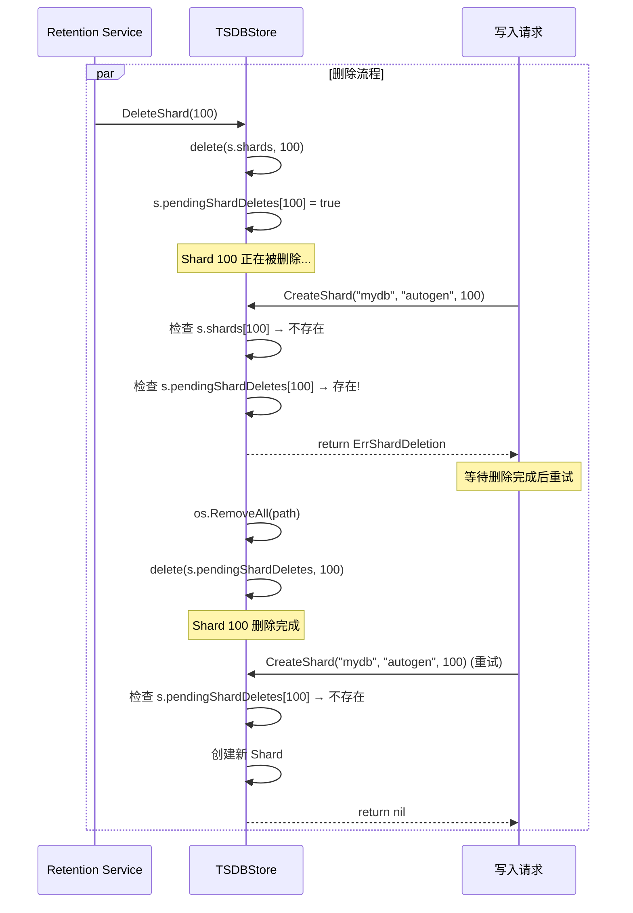

### 4.2 CreateShard 中的检查

```go
// tsdb/store.go:907-911 — CreateShard
// Shard may be undergoing a pending deletion. While the shard can be
// recreated, it must wait for the pending delete to finish.
if _, ok := s.pendingShardDeletes[shardID]; ok {
    return ErrShardDeletion
}
```

**为什么需要这个机制？**

1. **文件系统竞态**: 如果 `DeleteShard` 正在 `os.RemoveAll(path)`，而 `CreateShard` 同时在 `os.MkdirAll(path)`，
   可能导致目录结构损坏
2. **Series 清理竞态**: `DeleteShard` 正在清理孤立 Series，而新 Shard 可能正在写入相同的 Series
3. **Epoch 冲突**: 新 Shard 的 Epoch 和旧 Shard 的 Epoch 可能产生冲突

## 5. Precreator Service

### 5.1 Service 结构体

```go
// services/precreator/service.go:13 — Service
type Service struct {
    checkInterval time.Duration
    advancePeriod time.Duration

    Logger *zap.Logger

    done chan struct{}
    wg   sync.WaitGroup

    MetaClient interface {
        PrecreateShardGroups(now, cutoff time.Time) error
    }
}
```

### 5.2 配置默认值

```go
// services/precreator/config.go:11-18
const (
    DefaultCheckInterval = 10 * time.Minute   // 每 10 分钟检查一次
    DefaultAdvancePeriod = 30 * time.Minute   // 提前 30 分钟预创建
)
```

| 配置项 | 默认值 | 说明 |
|--------|--------|------|
| `enabled` | `true` | 是否启用预创建服务 |
| `check-interval` | `10m` | 检查间隔 |
| `advance-period` | `30m` | 提前多久预创建 |

### 5.3 runPrecreation 主循环

```go
// services/precreator/service.go:72-86
func (s *Service) runPrecreation() {
    defer s.wg.Done()

    for {
        select {
        case <-time.After(s.checkInterval):  // 注意: 使用 time.After 而非 Ticker
            if err := s.precreate(time.Now().UTC()); err != nil {
                s.Logger.Info("Failed to precreate shards", zap.Error(err))
            }
        case <-s.done:
            s.Logger.Info("Terminating precreation service")
            return
        }
    }
}
```

> **小白解释**: `time.After` 和 `time.NewTicker` 的区别：
> - `Ticker`: 固定间隔触发，不管上一次处理是否完成
> - `time.After`: 上一次处理完成后，再等待一个间隔才触发下一次
>
> 如果 `precreate()` 耗时 5 分钟，使用 `time.After` 的实际间隔是 10+5=15 分钟，
> 而使用 `Ticker` 会在 10 分钟时就触发，可能导致并发执行。

### 5.4 precreate 函数

```go
// services/precreator/service.go:89-92
func (s *Service) precreate(now time.Time) error {
    cutoff := now.Add(s.advancePeriod).UTC()  // now + 30 分钟
    return s.MetaClient.PrecreateShardGroups(now, cutoff)
}
```

### 5.5 PrecreateShardGroups 实现

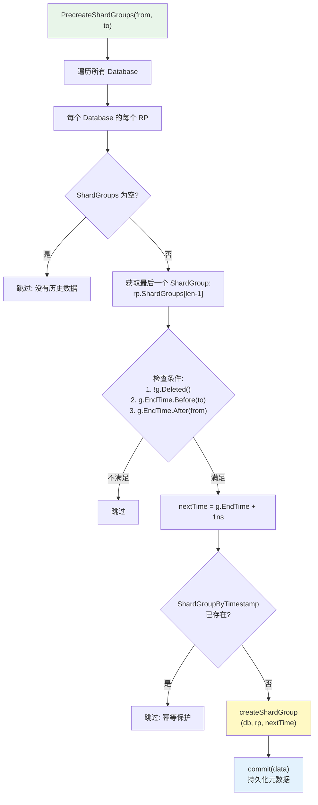

```go
// services/meta/client.go:766-816 — PrecreateShardGroups
func (c *Client) PrecreateShardGroups(from, to time.Time) error {
    c.mu.Lock()
    defer c.mu.Unlock()
    data := c.cacheData.Clone()
    var changed bool

    for _, di := range data.Databases {
        for _, rp := range di.RetentionPolicies {
            if len(rp.ShardGroups) == 0 {
                continue  // 没有历史数据，跳过
            }
            // 获取最后一个（最新的）ShardGroup
            g := rp.ShardGroups[len(rp.ShardGroups)-1]

            // 条件: 未删除 && 结束时间在 cutoff 之前 && 结束时间在 from 之后
            if !g.Deleted() && g.EndTime.Before(to) && g.EndTime.After(from) {
                // 新 ShardGroup 从旧 ShardGroup 结束时间 + 1ns 开始
                nextShardGroupTime := g.EndTime.Add(1 * time.Nanosecond)

                // 幂等检查: 如果已存在则跳过
                if sg, _ := data.ShardGroupByTimestamp(di.Name, rp.Name, nextShardGroupTime); sg != nil {
                    continue
                }

                // 创建新 ShardGroup
                newGroup, err := createShardGroup(data, di.Name, rp.Name, nextShardGroupTime)
                if err != nil {
                    continue
                }
                changed = true
            }
        }
    }

    if changed {
        return c.commit(data)
    }
    return nil
}
```

**时间窗口逻辑**:

```
from (now)                    to (now + 30min)
  |                              |
  |    g.EndTime                 |
  |      |                       |
  |      +---+                   |
  |      |   | ← ShardGroup     |
  |      +---+                   |
  |                              |
  |  如果 g.EndTime 落在这个区间内  |
  |  则预创建下一个 ShardGroup      |
```

## 6. ShardGroup 生命周期

### 6.1 完整生命周期状态机

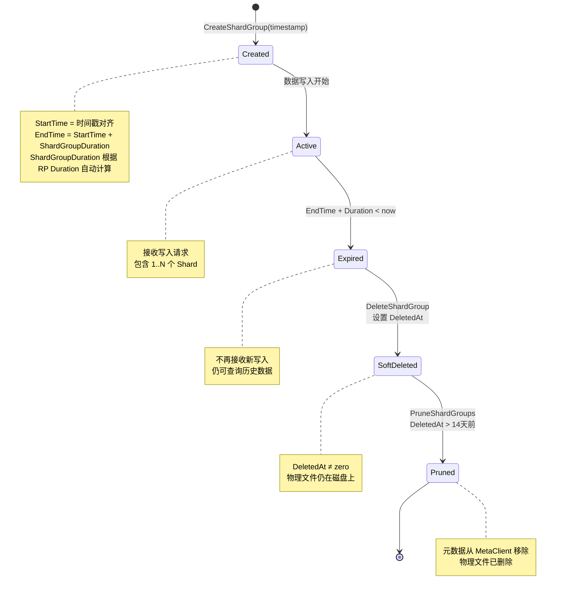

### 6.2 ShardGroupDuration 自动计算

```go
// services/meta/data.go:1376 — shardGroupDuration
func shardGroupDuration(d time.Duration) time.Duration {
    if d >= 180*24*time.Hour || d == 0 { // 6 months or 0 (永久保留)
        return 7 * 24 * time.Hour   // 7 天
    } else if d >= 2*24*time.Hour { // 2 天
        return 1 * 24 * time.Hour   // 1 天
    }
    return 1 * time.Hour            // 1 小时
}
```

| RP Duration | ShardGroupDuration | 说明 |
|-------------|-------------------|------|
| 永久 (`0`) | 7 天 | 长期保留，大 ShardGroup 减少文件数 |
| >= 6 个月 | 7 天 | 同上 |
| >= 2 天 | 1 天 | 中等保留期 |
| < 2 天 | 1 小时 | 短保留期，小 ShardGroup 便于快速清理 |

### 6.3 ShardGroupInfo 结构

```go
// services/meta/data.go:1403 — ShardGroupInfo
type ShardGroupInfo struct {
    ID          uint64
    StartTime   time.Time
    EndTime     time.Time
    DeletedAt   time.Time      // 零值 = 未删除，非零 = 软删除时间
    Shards      []ShardInfo
    TruncatedAt time.Time      // 截断时间（写入时 EndTime 被缩短）
}

// Deleted() 判断是否已软删除
func (sgi *ShardGroupInfo) Deleted() bool {
    return !sgi.DeletedAt.IsZero()
}

// Contains() 判断时间点是否在 ShardGroup 范围内
func (sgi *ShardGroupInfo) Contains(t time.Time) bool {
    return !t.Before(sgi.StartTime) && t.Before(sgi.EndTime)
}
```

## 7. Lease 机制

### 7.1 Lease 结构体

```go
// services/meta/data.go:1799 — Lease
type Lease struct {
    Name       string    `json:"name"`       // 租约名称
    Expiration time.Time `json:"expiration"` // 过期时间
    Owner      uint64    `json:"owner"`      // 持有者节点 ID
}

// services/meta/config.go:12
DefaultLeaseDuration = 60 * time.Second  // 默认 60 秒
```

### 7.2 单机模式 vs 集群模式

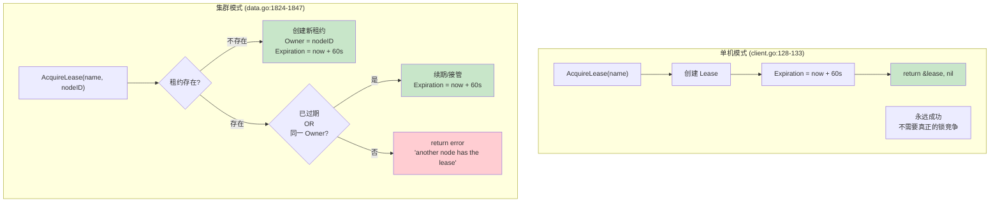

### 7.3 单机模式实现

```go
// services/meta/client.go:128-134 — AcquireLease (单机)
func (c *Client) AcquireLease(name string) (*Lease, error) {
    l := Lease{
        Name:       name,
        Expiration: time.Now().Add(DefaultLeaseDuration),  // 60s
    }
    return &l, nil  // 永远成功
}
```

> **小白解释**: 单机模式下，`AcquireLease` 就像一个永远说"好"的门卫。
> 你问他要钥匙，他永远给你，因为整个公司只有你一个人。

### 7.4 集群模式实现

```go
// services/meta/data.go:1824-1847 — Acquire (集群)
func (leases *Leases) Acquire(name string, nodeID uint64) (*Lease, error) {
    leases.mu.Lock()
    defer leases.mu.Unlock()

    l := leases.m[name]
    if l != nil {
        // 租约已存在
        if time.Now().After(l.Expiration) || l.Owner == nodeID {
            // 已过期 → 接管; 同一 Owner → 续期
            l.Expiration = time.Now().Add(leases.d)
            l.Owner = nodeID
            return l, nil
        }
        // 其他节点持有且未过期 → 拒绝
        return l, errors.New("another node has the lease")
    }

    // 租约不存在 → 创建新租约
    l = &Lease{
        Name:       name,
        Expiration: time.Now().Add(leases.d),
        Owner:      nodeID,
    }
    leases.m[name] = l
    return l, nil
}
```

### 7.5 CQ Service 如何使用租约

`backgroundLoop` (service.go:216-245) 有**两个**触发分支，不仅靠 timer，还监听
`s.RunCh` 这个按需请求通道——外部 `Run(name, t)` 调用 (service.go:210) 会向 `RunCh`
发送 `*RunRequest`，让 CQ 立即跑一轮而不必等下一个 `RunInterval`。

```go
// services/continuous_querier/service.go:216 — backgroundLoop
func (s *Service) backgroundLoop() {
    leaseName := "continuous_querier"
    t := time.NewTimer(s.RunInterval)
    defer t.Stop()
    defer s.wg.Done()
    for {
        select {
        case <-s.stop:
            s.Logger.Info("Terminating continuous query service")
            return
        // ↓↓↓ 分支 A: 按需请求 (service.go:226-233)
        case req := <-s.RunCh:
            if !s.hasContinuousQueries() {
                continue   // 注意: 不 Reset timer，等下一个 tick 或下一次 RunCh
            }
            if _, err := s.MetaClient.AcquireLease(leaseName); err == nil {
                s.Logger.Info("Running continuous queries by request", zap.Time("at", req.Now))
                s.runContinuousQueries(req)
            }
        // ↓↓↓ 分支 B: 定时触发 (service.go:234-243)
        case <-t.C:
            if !s.hasContinuousQueries() {
                t.Reset(s.RunInterval)
                continue
            }
            if _, err := s.MetaClient.AcquireLease(leaseName); err == nil {
                s.runContinuousQueries(&RunRequest{Now: time.Now()})
            }
            t.Reset(s.RunInterval)
        }
    }
}
```

**两个分支的关键差异**:
- **分支 B (timer)**: 每轮结束后 `t.Reset(s.RunInterval)`，保证固定周期。
- **分支 A (RunCh)**: **不 Reset timer**。这意味着 `RunCh` 触发后，下一个 `t.C` 仍按
  原计划到达——`RunCh` 是"额外加跑一轮"，不是"提前消费下一个 tick"。如果 `RunCh`
  触发时恰好 `t.C` 已就绪，`select` 随机选一个，但两个分支都会跑 `runContinuousQueries`，
  所以不会丢执行，只是可能多跑一轮 (CQ 内部用 `lastRuns` 去重，重复触发会被跳过)。
- **日志区分**: 分支 A 打 `"Running continuous queries by request"` + `req.Now`，
  分支 B 无额外日志。运维可通过日志区分"手动触发"与"定时触发"。
- **租约前置**: 两个分支都必须先 `AcquireLease("continuous_querier")` 成功才执行，
  保证集群中只有 leader 节点跑 CQ。

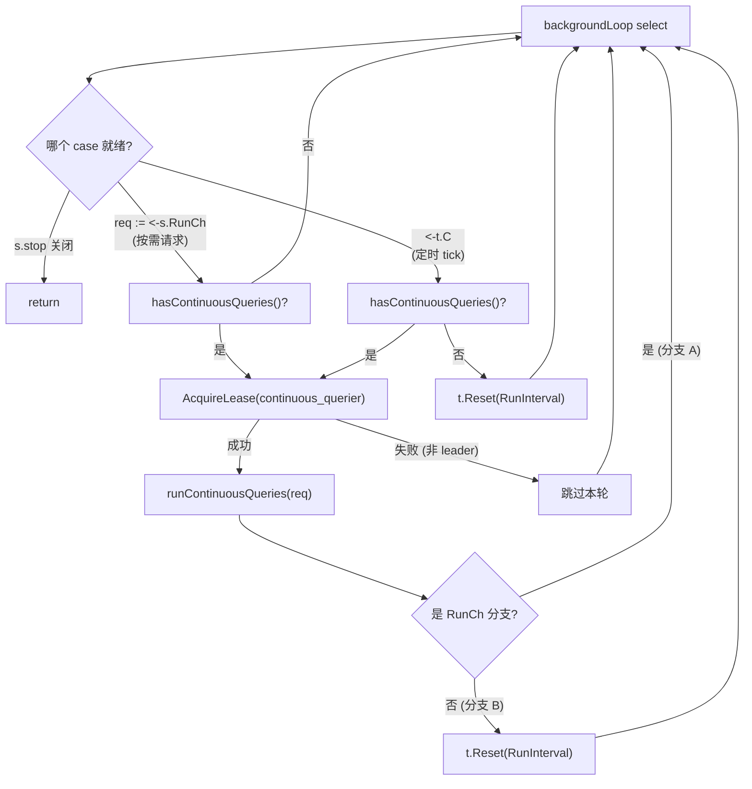

> **具体案例**: 手动 `Run()` 触发立即执行
>
> 假设 `RunInterval = 10s`，当前时间是 00:00:00，上一个 tick 刚在 00:00:00 跑过，
> 下一个 tick 预计 00:00:10。
>
> 1. 用户在 00:00:03 手动调用 `service.Run("mydb_myCQ", time.Now())` (例如通过
>    `influxd inspect` 或测试钩子)。
> 2. `Run` 清除 `s.lastRuns["mydb_myCQ"]` (service.go:204)，然后向 `s.RunCh` 发送
>    `&RunRequest{Now: 00:00:03}`。
> 3. `backgroundLoop` 的 select 立即选中 `RunCh` 分支 (分支 A)。
> 4. `hasContinuousQueries()` 返回 true，`AcquireLease` 成功 (单机模式永远成功)。
> 5. 打日志 `"Running continuous queries by request" at=00:00:03`，调用
>    `runContinuousQueries(req)`。
> 6. `myCQ` 因为 `lastRuns` 被清除，重新计算时间窗口并执行，把 00:00:00~00:00:03
>    之间的新数据聚合写入目标 measurement。
> 7. 分支 A **不** Reset timer，所以 00:00:10 的定时 tick 仍会到来——但此时
>    `lastRuns["mydb_myCQ"]` 已被更新，定时 tick 跑 `myCQ` 时发现"最近一次运行
>    覆盖的时间窗口已包含当前"，跳过实际计算 (CQ 的 `lastRuns` 去重逻辑)。
>
> 这就是为什么 `Run` 适合用于"配置变更后立即重跑 CQ"或"补跑漏掉的时间窗口"，
> 而不会破坏定时调度的节奏。

**为什么 CQ 需要租约而 Retention/Precreator 不需要？**

| 服务 | 操作性质 | 幂等性 | 是否需要租约 |
|------|----------|--------|-------------|
| CQ | 计算 + 写入 | 非幂等（重复执行产生重复数据） | 是 |
| Retention | 删除本地文件 | 幂等（删两次等于删一次） | 否 |
| Precreator | 创建元数据 | 幂等（ShardGroupByTimestamp 检查） | 否 |

## 8. 具体案例

### 8.1 案例一: Retention 删除过期数据

> **场景**: RP Duration = 7 天，ShardGroupDuration = 1 天，数据在 t=0 时写入

```
时间线:
t=0       写入数据 → ShardGroup A (StartTime=Day0, EndTime=Day1)
t=1d      ShardGroup A 到期，新数据写入 ShardGroup B
t=7d      RP Duration 到期，ShardGroup A 应该被清理
t=7d+1s   Retention Service 的 ticker 触发（假设恰好在此时）
```

**Retention Service 执行过程**:

```
Step 1: MetaClient.Databases() → [{Name: "mydb", RPs: [{Name: "autogen", Duration: 7d}]}]

Step 2: 遍历 mydb.autogen:
  - r.DeletedShardGroups() → [] (没有已删除的)
  - r.ExpiredShardGroups(now=7d+1s):
    - ShardGroup A: EndTime=Day1, EndTime + Duration = Day1 + 7d = Day8
      Day8.Before(7d+1s) = false → 不过期!
    - ShardGroup B: EndTime=Day2, EndTime + Duration = Day2 + 7d = Day9
      Day9.Before(7d+1s) = false → 不过期!

Step 3: 无过期 ShardGroup，本轮不做任何操作
```

**等等，ShardGroup A 为什么不过期？** 因为 `ExpiredShardGroups` 的判断是
`EndTime.Add(rpi.Duration).Before(t)`，即 `EndTime + RP_Duration < now`。

ShardGroup A 的 EndTime = Day1，RP Duration = 7d，所以判断条件是 `Day1 + 7d < now`，
即 `Day8 < now`。只有在 t > Day8 时才会过期。

```
修正时间线:
t=0       写入数据 → ShardGroup A (StartTime=Day0, EndTime=Day1)
t=8d      Retention Service ticker 触发
```

**t=8d 时的执行过程**:

```
Step 1: MetaClient.Databases() → [mydb]

Step 2: 遍历 mydb.autogen:
  - r.DeletedShardGroups() → [] (没有已删除的)
  - r.ExpiredShardGroups(now=8d):
    - ShardGroup A: EndTime=Day1, EndTime + Duration = Day1 + 7d = Day8
      Day8.Before(8d) = true → 过期!
    - ShardGroup B: EndTime=Day2, EndTime + Duration = Day9
      Day9.Before(8d) = false → 不过期

  - MetaClient.DeleteShardGroup("mydb", "autogen", shardGroupA.ID)
    → 设置 ShardGroupA.DeletedAt = now (软删除)
  - 收集 ShardGroup A 的 Shard ID: {1, 2, 3}

Step 3: TSDBStore.ShardIDs() → [1, 2, 3, 4, 5, 6]
  - Shard 1 在 deletedShardIDs 中 → DeleteShard(1) → 删除文件
  - Shard 2 在 deletedShardIDs 中 → DeleteShard(2) → 删除文件
  - Shard 3 在 deletedShardIDs 中 → DeleteShard(3) → 删除文件
  - Shard 4 不在 → 跳过
  - Shard 5 不在 → 跳过
  - Shard 6 不在 → 跳过

Step 4: MetaClient.PruneShardGroups()
  - ShardGroupA.DeletedAt = now (刚刚删除)
  - now - 14d < DeletedAt → 不修剪（需要等待 14 天）

14 天后 (t=22d):
Step 4: MetaClient.PruneShardGroups()
  - ShardGroupA.DeletedAt = 8d
  - now - 14d = 8d → 8d.After(8d) = false → 不修剪
  - 但 next check (t=22d + 30min): now - 14d = 8d + 30min > 8d → 修剪!
  - ShardGroup A 的元数据从 MetaClient 中移除
```

### 8.2 案例二: Precreator 预创建 ShardGroup

> **场景**: checkInterval=10m, advancePeriod=30m, ShardGroupDuration=1d

```
时间线:
t=0:00    当前 ShardGroup: StartTime=Day0, EndTime=Day1
t=0:00    Precreator ticker 触发
```

**t=0:00 时的执行过程**:

```
precreate(now=0:00):
  cutoff = now + 30min = 0:30

PrecreateShardGroups(from=0:00, to=0:30):
  遍历 mydb.autogen:
    last ShardGroup = {EndTime: Day1}
    检查: !Deleted() = true ✓
    检查: EndTime.Before(0:30) = Day1.Before(0:30) = false ✗
    → 跳过（ShardGroup 还没到要结束的时候）
```

**t=Day0+23:30 时的执行过程**:

```
precreate(now=Day0+23:30):
  cutoff = now + 30min = Day0+24:00 = Day1

PrecreateShardGroups(from=Day0+23:30, to=Day1):
  遍历 mydb.autogen:
    last ShardGroup = {EndTime: Day1}
    检查: !Deleted() = true ✓
    检查: EndTime.Before(Day1) = Day1.Before(Day1) = false ✗
    → 跳过（EndTime 恰好等于 cutoff，Before 返回 false）
```

**t=Day1-5min (23:55) 时的执行过程**:

```
precreate(now=Day1-5min):
  cutoff = now + 30min = Day1 + 25min

PrecreateShardGroups(from=Day1-5min, to=Day1+25min):
  遍历 mydb.autogen:
    last ShardGroup = {EndTime: Day1}
    检查: !Deleted() = true ✓
    检查: EndTime.Before(Day1+25min) = true ✓
    检查: EndTime.After(Day1-5min) = true ✓
    → 条件全部满足!

    nextTime = Day1 + 1ns
    ShardGroupByTimestamp(mydb, autogen, Day1+1ns) → nil (不存在)

    createShardGroup(mydb, autogen, Day1+1ns)
    → 创建新 ShardGroup: StartTime=Day1, EndTime=Day2
    → commit(data)

日志: "New shard group successfully precreated"
```

**预创建的价值**:

```
没有预创建:
  t=Day1:00:00.001  写入请求到达
  t=Day1:00:00.002  发现没有 ShardGroup → 触发创建
  t=Day1:00:00.050  Raft 共识完成
  t=Day1:00:00.051  写入成功
  延迟: 50ms (受 Raft 共识影响)

有预创建:
  t=Day0+23:55      Precreator 预创建完成
  t=Day1:00:00.001  写入请求到达
  t=Day1:00:00.002  ShardGroup 已存在 → 直接写入
  t=Day1:00:00.003  写入成功
  延迟: 2ms (无需等待 Raft)
```

### 8.3 案例三: pendingShardDeletes 竞态保护

> **场景**: Retention Service 删除 Shard 100 的同时，写入请求尝试创建 Shard 100

```
时间线:
t=0ms    Retention Service: DeleteShard(100)
         → s.mu.Lock()
         → delete(s.shards, 100)
         → s.pendingShardDeletes[100] = struct{}{}
         → s.mu.Unlock()
         → 开始清理 Series（耗时操作）

t=5ms    写入请求: CreateShard("mydb", "autogen", 100)
         → s.mu.Lock()
         → s.shards[100] 不存在
         → s.pendingShardDeletes[100] 存在!
         → s.mu.Unlock()
         → return ErrShardDeletion
         → 写入请求等待并重试

t=100ms  DeleteShard(100) 完成
         → os.RemoveAll(path)
         → defer: delete(s.pendingShardDeletes, 100)

t=110ms  写入请求重试: CreateShard("mydb", "autogen", 100)
         → s.pendingShardDeletes[100] 不存在
         → 创建新 Shard 100
         → 成功
```

## 9. 架构设计意图

### 9.1 为什么 Retention 使用 Ticker 而 Precreator 使用 time.After

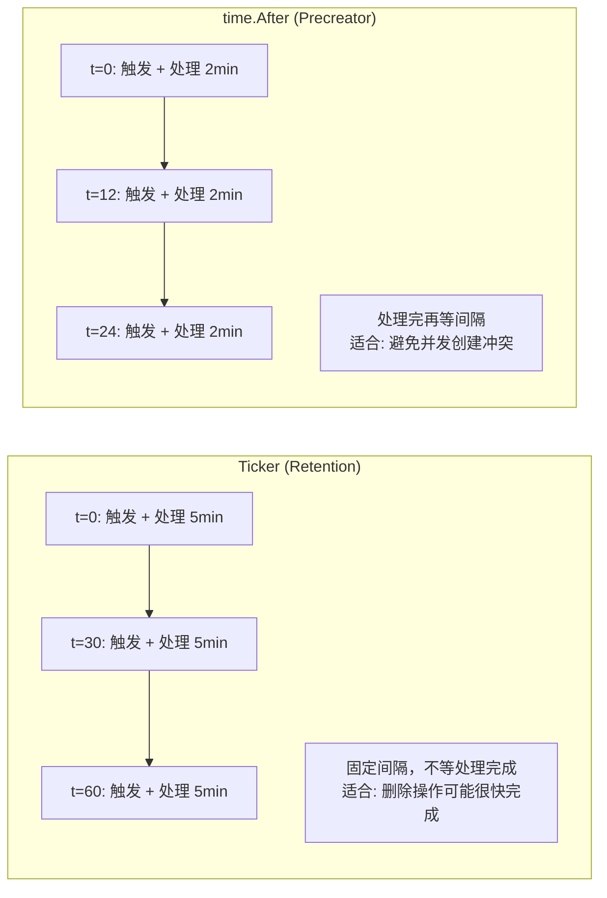

**设计理由**:
- **Retention 用 Ticker**: 删除操作是幂等的，即使 ticker 快速连续触发也不会有问题。
  Ticker 保证固定的检查频率，确保过期数据不会被延迟清理太久。
- **Precreator 用 time.After**: 预创建涉及 MetaClient 的写锁（`c.mu.Lock()`），
  使用 `time.After` 可以避免并发预创建操作导致的锁竞争。

### 9.2 为什么软删除后还要等 14 天

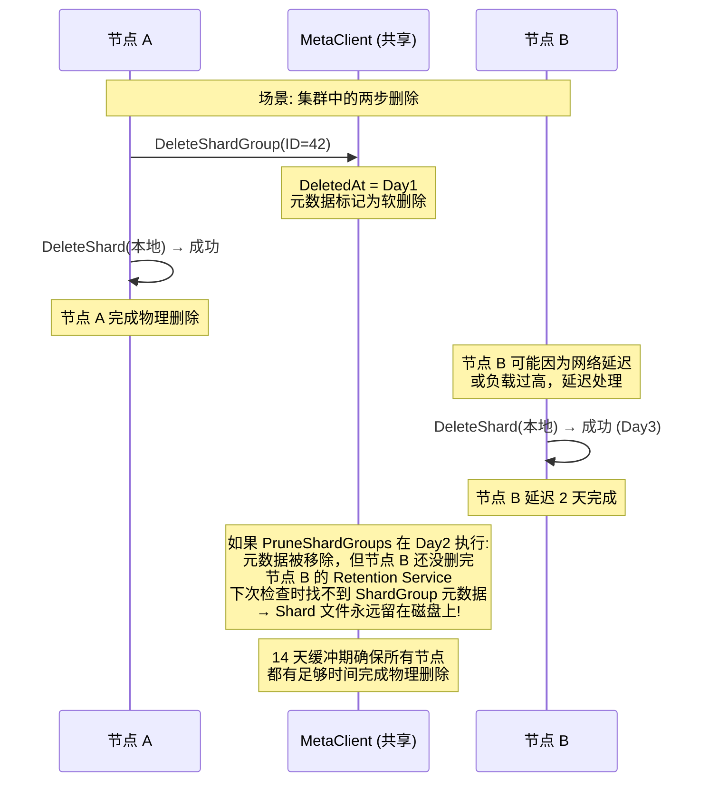

### 9.3 为什么 DeleteShard 要做 Series Diff

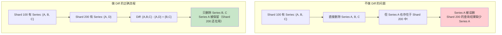

### 9.4 为什么 Precreator 用 g.EndTime + 1ns 定位下一组

```
ShardGroup A: [StartTime=Day0, EndTime=Day1)
ShardGroup B: [StartTime=Day1, EndTime=Day2)

为什么是 +1ns 而不是 =EndTime?
→ 因为 ShardGroup 的 Contains() 判断是: !t.Before(StartTime) && t.Before(EndTime)
→ 即 StartTime <= t < EndTime (左闭右开区间)
→ 如果 B.StartTime = A.EndTime，那么时间点 A.EndTime 同时属于 A 和 B
→ +1ns 只是传给 `createShardGroup` 的定位时间戳，使它落入下一段半开区间。
新 ShardGroup 的 `StartTime` 仍由 `timestamp.Truncate(ShardGroupDuration)` 计算，
通常等于旧组的 `EndTime`，不是 `EndTime + 1ns`。
```

## 10. 架构收益

| 维度 | 收益 | 说明 |
|------|------|------|
| **存储管理** | 自动过期清理 | 无需人工干预，数据按 RP Duration 自动淘汰 |
| **写入性能** | 预创建避免写入延迟 | ShardGroup 提前创建，写入时无需等待 Raft 共识 |
| **数据安全** | 两阶段删除 | 软删除 → 物理删除，14 天缓冲期防止误删 |
| **Series 清理** | Diff 精确删除 | 只删除孤立 Series，不影响其他 Shard 的查询 |
| **并发安全** | Epoch 同步 | 确保删除前所有 in-flight 写入完成 |
| **竞态保护** | pendingShardDeletes | 防止删除和创建的竞态条件 |
| **幂等性** | 所有操作可重试 | 失败后下一个周期自动重试，无需人工干预 |
| **可测试性** | 匿名接口依赖注入 | MetaClient 和 TSDBStore 可以轻松 mock |
| **单机简化** | Lease 永远成功 | 单机模式下 AcquireLease 直接返回成功，无需锁竞争 |
| **资源回收** | PruneShardGroups | 14 天后清理元数据，防止元数据无限增长 |

## 11. 潜在隐患与瓶颈

### 11.1 Retention 检查间隔导致的清理延迟

**问题**: 默认 30 分钟的检查间隔意味着过期数据最多可能多保留 30 分钟。
对于 Duration 很短的 RP（如 1 小时），这可能导致存储空间使用超出预期。

**影响**: 存储空间临时超出预期，但不会影响数据正确性。

**缓解**: 可以调小 `check-interval`，但会增加 CPU 和 MetaClient 的负载。

### 11.2 Precreator 的 time.After 导致间隔不稳定

**问题**: `time.After` 在 select 中每次循环都会创建新的 Timer，
如果 `precreate()` 耗时较长，实际间隔会大于 `checkInterval`。

```go
// 每次循环都创建新的 Timer，不会重用旧的
case <-time.After(s.checkInterval):
    s.precreate(time.Now().UTC())
```

**影响**: 在高负载场景下，预创建可能延迟，导致写入时临时创建 ShardGroup。

**对比**: `time.NewTicker` 会保持固定间隔，但可能导致并发执行。

### 11.3 DeleteShard 的 Series Diff 在高基数下性能差

**问题**: `SeriesIDSet.Diff()` 需要遍历所有同数据库其他 Shard 的 SeriesIDSet。
当 Series 基数很高（百万级）且 Shard 数量很多时，Diff 操作可能耗时较长。

**影响**: DeleteShard 变慢，`pendingShardDeletes` 持续时间变长，
CreateShard 可能频繁返回 `ErrShardDeletion`。

**缓解**: SeriesIDSet 使用 Roaring Bitmap 实现，Diff 操作本身是高效的位运算。

### 11.4 Epoch Wait 可能阻塞删除

**问题**: `epoch.StartWrite()` 后需要等待所有 `guard.Wait()` 完成。
如果有大量正在进行的写入，删除操作可能被长时间阻塞。

**影响**: `DeleteShard` 完成前，`pendingShardDeletes` 持续时间变长；
同一 shard 的重新创建会更久地返回 `ErrShardDeletion`。

### 11.5 PruneShardGroups 的 14 天缓冲期假设

**问题**: 14 天的缓冲期假设所有节点都能在 14 天内完成物理删除。
如果某个节点宕机超过 14 天，恢复后可能无法找到 ShardGroup 元数据。

**影响**: 宕机节点恢复后，可能有孤立的 Shard 文件无法被清理。

**缓解**: 这种情况极为罕见，且孤立文件只占用磁盘空间，不影响数据正确性。

### 11.6 全局锁竞争

**问题**: `PruneShardGroups` 和 `PrecreateShardGroups` 都使用 `c.mu.Lock()`，
如果 Retention Service 和 Precreator Service 同时触发，会产生锁竞争。

**影响**: MetaClient 操作延迟增加。

**缓解**: 两个服务的检查间隔不同（30min vs 10min），同时触发的概率较低。

### 11.7 软删除期间的查询行为

**问题**: ShardGroup 被软删除后（DeletedAt 非零），`ExpiredShardGroups` 会跳过它（`Deleted()` 返回 true），
但 `ShardGroupByTimestamp` 也可能跳过已删除的 ShardGroup。

```go
// data.go:1263
if sgi.Contains(timestamp) && !sgi.Deleted() && ... {
    return &rpi.ShardGroups[i]
}
```

**影响**: 如果查询时间范围恰好落在已软删除但未物理删除的 ShardGroup 内，
查询可能返回不完整的结果。

**设计选择**: 这是有意为之 — 软删除表示数据已被标记为过期，不应再被查询到。

### 11.8 Precreator 预创建失败只记录 Info

Retention 删除失败在当前源码中多处使用 `Error`，phantom shard 使用 `Warn`，
不能再概括为“Retention 删除失败日志级别过低”。更准确的低可见性风险在
Precreator：预创建失败只记录 `Info`，写入仍可在后续路径按需创建 shard group。

```go
// services/precreator/service.go:79 — precreate 失败路径
s.Logger.Info("Failed to precreate shards", zap.Error(err))
```

> **审计校准** (precreator/service.go:79): 日志消息是 `"Failed to precreate shards"`，
> **不是** `"Failed to precreate shard groups"`。

**影响**: 预创建失败不会立刻造成数据丢失，但会把创建成本推迟到写入路径，
高写入压力下可能增加延迟尖峰。

## 12. 源码校准：Retention 物理删除并发保护

Retention 的真实物理删除不是简单调用 `DeleteShard`。当前源码会先阻止新读者，
确认没有读者正在使用 shard，再删除磁盘数据并清理 meta 引用；如果发现磁盘上有
metadata 仍引用但本地 store 已不存在的 phantom shard，也会通过 `DropShardMetaRef`
清理 metadata reference。

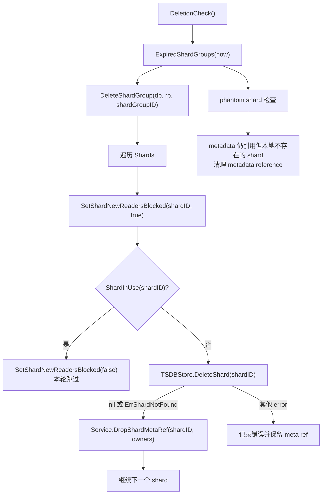

对应接口需要包含读者阻塞和引用检查：

```go
// services/retention/service.go
type TSDBStore interface {
    DeleteShard(shardID uint64) error
    SetShardNewReadersBlocked(shardID uint64, blocked bool) error
    ShardInUse(shardID uint64) (bool, error)
    ShardIDs() []uint64
}

type MetaClient interface {
    DropShard(id uint64) error
    PruneShardGroups() error
}

type Service struct {
    DropShardMetaRef func(shardID uint64, owners []uint64) error
}
```

**ErrShardNotFound 语义**: `tsdb.Store.DeleteShard` 在 shard 不存在时会返回
`ErrShardNotFound`。Retention 层把这个错误视为“磁盘已经没有数据”，仍然继续调用
注入的 `DropShardMetaRef` 回调，避免 metadata 永久保留一个已经不存在的 shard 引用。

**案例**: shard 42 已过期，但仍有一个查询持有 reader。

1. Retention 先 `SetShardNewReadersBlocked(42, true)`，阻止新的 reader 进入。
2. `ShardInUse(42)` 返回 true，说明旧查询还没释放。
3. Retention 解除 block 或本轮跳过，不删除磁盘文件，也不删 meta ref。
4. 下一轮检查时，如果 reader 已释放，才执行 `DeleteShard(42)` 和 `DropShardMetaRef(42)`。
