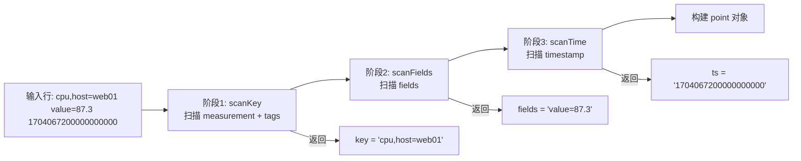
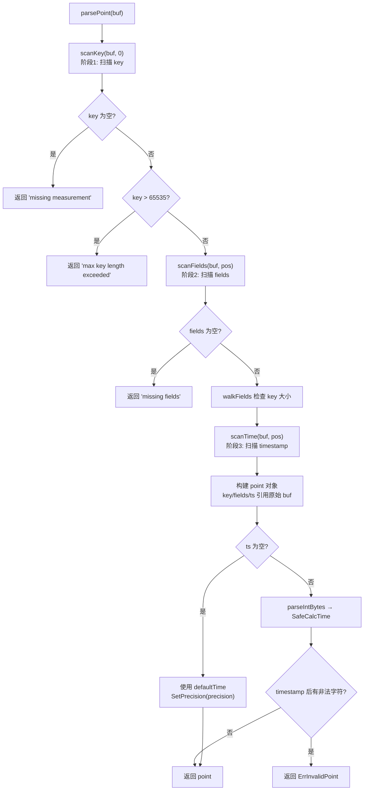
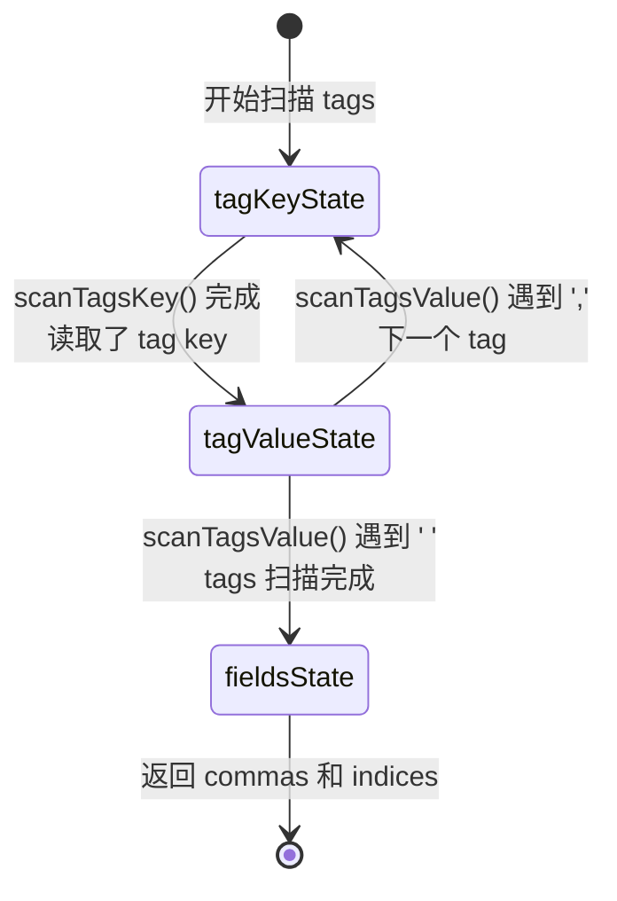
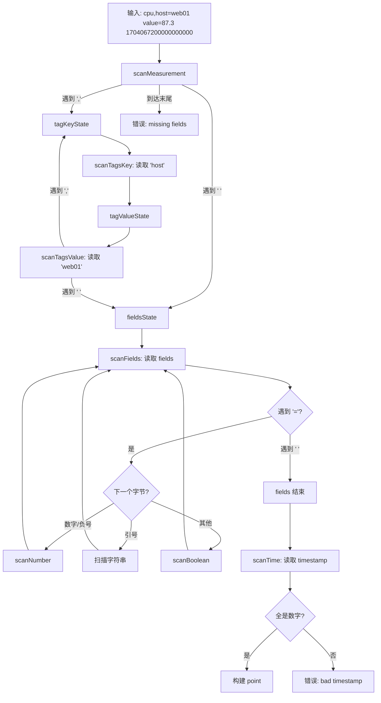
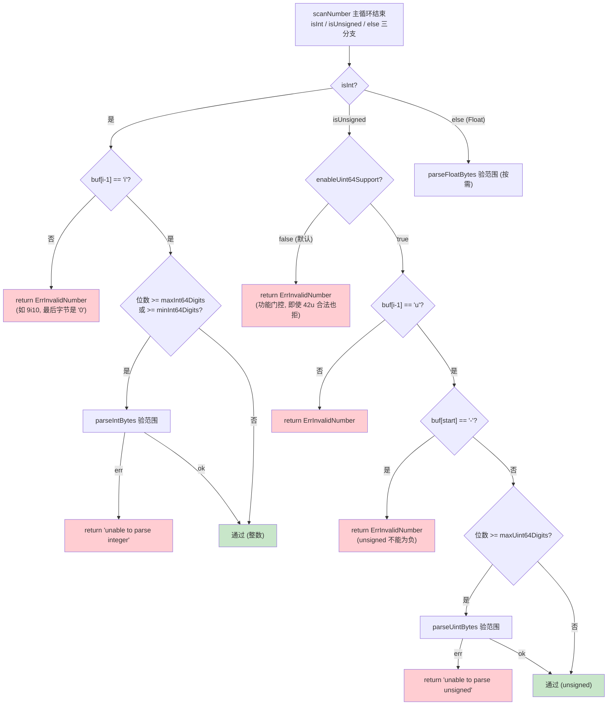
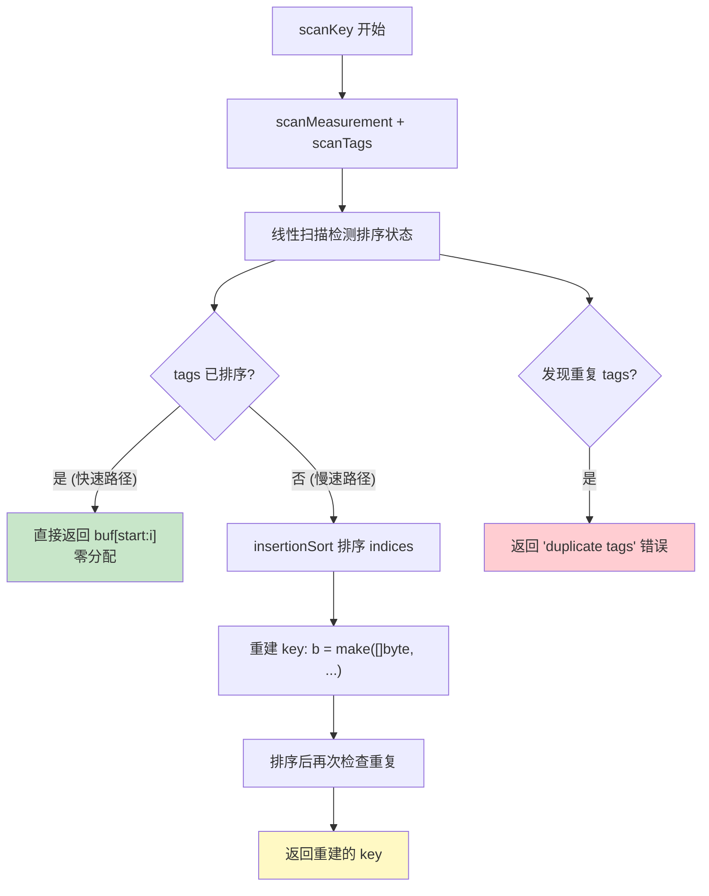
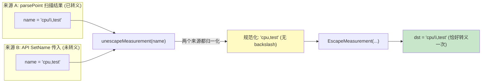
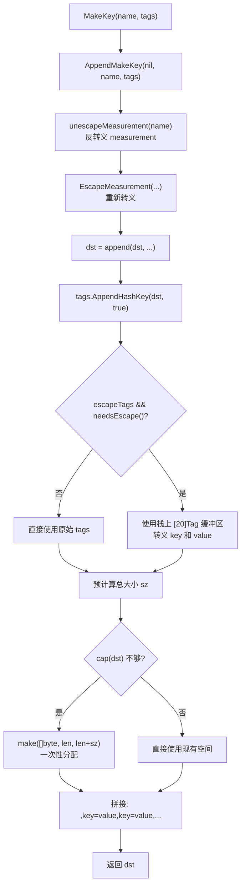
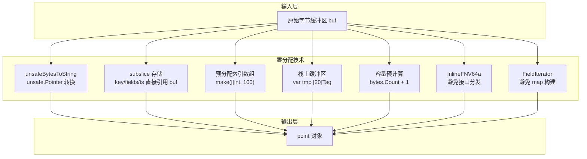
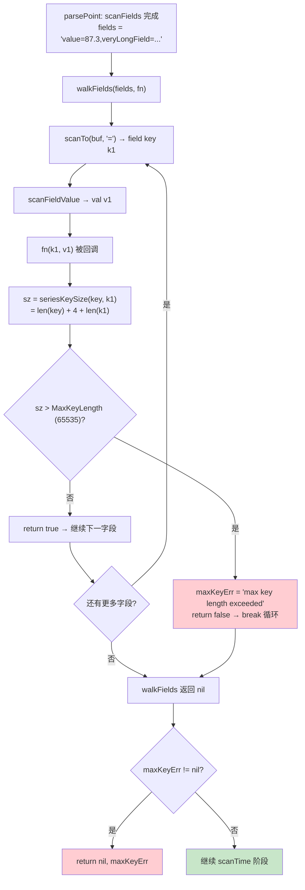

# Module 13: Line Protocol 解析器 — 深度审计报告

> **小白导读**: 想象你是一个快递分拣员，每天要处理成千上万个包裹。
> 每个包裹上都贴着一张格式统一的快递单：**收件人地址（measurement + tags）**、**包裹内容（fields）**、**签收时间（timestamp）**。
>
> Line Protocol 解析器就是你的"读单机器"——它快速扫描每个包裹上的地址，
> 自动识别收件人、联系方式、包裹类型，然后把信息录入系统。
>
> - **measurement** = 收件人姓名（比如 "cpu"）
> - **tags** = 收件地址标签（host=web01, region=us-east）
> - **fields** = 包裹内容（value=87.3, status="running"）
> - **timestamp** = 签收时间（1704067200000000000 纳秒）
>
> 解析器的核心任务：**读单(scanKey) → 验货(scanFields) → 记时(scanTime)**
> 主解析路径尽量复用输入切片，但不是“全程零拷贝”。未排序 tags 需要重建
> canonical series key，转义 hash key、延迟构建 `Fields()` map 等路径也会分配。

## 1. Line Protocol 格式总览

### 1.1 格式定义

Line Protocol 是 InfluxDB 的数据写入格式，每行一个数据点：

```
measurement,tag1=val1,tag2=val2 field1=1.0,field2="hello" 1234567890000000000
```

三个部分用空格分隔：

| 部分 | 格式 | 必需 | 说明 |
|------|------|------|------|
| Measurement | 标识符 | 是 | 表名，如 `cpu`, `mem` |
| Tags | `,key=value` 对 | 否 | 输入可不排序；解析后的 series key 会按 tag key 规范化排序 |
| Fields | `key=value` 对 | 是 | 至少一个字段 |
| Timestamp | 整数 | 否 | Unix 纳秒时间戳，省略则用服务器时间 |

### 1.2 解析三阶段



> **小白解释**: 就像分拣员看快递单——先看收件人和地址（scanKey），
> 再看包裹内容（scanFields），最后看签收时间（scanTime）。
> 三步走完，一张快递单就处理完了。

### 1.3 案例解析

> **具体案例**: 解析一条 CPU 数据
>
> ```
> cpu,host=web01,region=us-east value=87.3,status="running" 1704067200000000000
> ```
>
> 解析过程：
>
> ```
> 阶段1: scanKey
>   读取 "cpu"          → measurement = "cpu"
>   遇到 ','            → 进入 tagKeyState
>   读取 "host=web01"   → tag[0] = {host, web01}
>   读取 "region=us-east" → tag[1] = {region, us-east}
>   遇到 ' '            → 进入 fieldsState, key 构建完成
>
>   key = "cpu,host=web01,region=us-east" (tags 已按字典序排列)
>
> 阶段2: scanFields
>   读取 "value"        → field key = "value"
>   遇到 '='            → equals=1
>   读取 "87.3"         → 扫描数字，小数点 → Float 类型
>   遇到 ','            → commas=1
>   读取 "status"       → field key = "status"
>   遇到 '='            → equals=2
>   读取 '"running"'    → 引号开头 → String 类型
>   遇到 ' '            → fields 区域结束
>
>   fields = 'value=87.3,status="running"'
>
> 阶段3: scanTime
>   读取 "1704067200000000000" → 全部是数字 → 合法时间戳
>
>   ts = "1704067200000000000"
>
> 最终:
>   point.key    = "cpu,host=web01,region=us-east"
>   point.fields = "value=87.3,status=\"running\""
>   point.ts     = "1704067200000000000"
>   point.time   = 2024-01-01 00:00:00 UTC
> ```

## 2. 核心数据结构

### 2.1 point 结构体

```go
// models/points.go:221 — point (未导出)
type point struct {
    time time.Time     // 解析后的时间戳 (time.Time 对象)

    // key 是 measurement 和 tags 的文本编码
    // key 必须始终按 tags 排序存储，如果原始行未排序，需要重新排序
    key []byte          // "cpu,host=web01,region=us-east"

    // fields 是 field 数据的文本编码
    fields []byte       // "value=87.3,status=\"running\""

    // ts 是时间戳的文本编码
    ts []byte           // "1704067200000000000" (字符串形式)

    // 缓存的解析结果
    cachedFields map[string]interface{}  // 懒解析的字段 map
    cachedName   string                  // 缓存的 measurement 名称
    cachedTags   Tags                    // 缓存的 tags

    it fieldIterator    // 字段迭代器 (用于零分配遍历)
}
```

> **小白解释**: `point` 就像一张完整的快递单。
> `key` 是收件人地址，`fields` 是包裹内容，`ts` 是签收时间。
> 注意：这三个字段都是**原始字节切片**（subslice），不是新分配的字符串。
> 多数情况下它们直接引用输入缓冲区；但如果 tag 未排序、key 需要规范化、
> 或后续调用 `Fields()` 构建 map，就会发生额外分配。

### 2.2 Point 接口

```go
// models/points.go:77 — Point 接口
type Point interface {
    Name() []byte                    // measurement 名称
    SetName(string)                  // 设置 measurement 名称
    Tags() Tags                      // 获取 tag 集合
    ForEachTag(fn func(k, v []byte) bool)  // 遍历每个 tag
    AddTag(key, value string)        // 添加或替换 tag
    SetTags(tags Tags)               // 替换所有 tags
    HasTag(tag []byte) bool          // 检查 tag 是否存在
    Fields() (Fields, error)         // 获取字段 map (懒解析)
    Time() time.Time                 // 获取时间戳
    SetTime(t time.Time)             // 设置时间戳
    UnixNano() int64                 // 纳秒时间戳
    HashID() uint64                  // 非加密哈希 ID
    Key() []byte                     // key (measurement + tags)
    String() string                  // 字符串表示
    MarshalBinary() ([]byte, error)  // 二进制编码
    FieldIterator() FieldIterator    // 零分配字段迭代器
    // ... 更多方法
}
```

### 2.3 FieldIterator 接口 — 零分配字段遍历

```go
// models/points.go:178 — FieldIterator 接口
type FieldIterator interface {
    Next() bool                        // 是否还有下一个字段
    FieldKey() []byte                  // 当前字段的 key
    Type() FieldType                   // 当前字段的类型
    StringValue() string               // 字符串值
    IntegerValue() (int64, error)      // 整数值
    UnsignedValue() (uint64, error)    // 无符号整数值
    BooleanValue() (bool, error)       // 布尔值
    FloatValue() (float64, error)      // 浮点值
    Reset()                            // 重置迭代器
}
```

> **小白解释**: `FieldIterator` 就像一个"逐个检查包裹内容"的工具。
> 它不把所有内容倒出来（不构建 map），而是一个一个看（零分配）。
> 这对于写入引擎特别重要——写入时只需要逐个字段处理，不需要完整的 map。

### 2.4 FieldType 常量

```go
// models/points.go:156 — FieldType
const (
    Integer  FieldType = iota  // 0: 整数 (如 42i)
    Float                      // 1: 浮点数 (如 3.14)
    Boolean                    // 2: 布尔值 (如 true)
    String                     // 3: 字符串 (如 "hello")
    Empty                      // 4: 空字段
    Unsigned                   // 5: 无符号整数 (如 42u)
)
```

### 2.5 point 结构体内部布局

```mermaid
graph TD
    subgraph "point 结构体"
        A["key []byte<br>'cpu,host=web01,region=us-east'"]
        B["fields []byte<br>'value=87.3,status=\"running\"'"]
        C["ts []byte<br>'1704067200000000000'"]
        D["time time.Time<br>2024-01-01 00:00:00 UTC"]
        E["cachedFields map[string]interface{}<br>nil (懒解析)"]
        F["cachedName string<br>'' (懒解析)"]
        G["cachedTags Tags<br>nil (懒解析)"]
        H["it fieldIterator<br>{start:0, end:0, key:nil, ...}"]
    end

    subgraph "原始输入缓冲区"
        I["cpu,host=web01,region=us-east value=87.3,status=\"running\" 1704067200000000000"]
    end

    A -.->|"subslice"| I
    B -.->|"subslice"| I
    C -.->|"subslice"| I

    style A fill:#e1f5fe
    style B fill:#e1f5fe
    style C fill:#e1f5fe
    style I fill:#fff3e0
```

> **关键**: `key`、`fields`、`ts` 都是原始输入缓冲区的**子切片**（subslice），
> 不是新分配的内存。这是零分配优化的核心——但也有副作用：只要 point 存活，
> 整个输入缓冲区就不会被 GC 回收。

## 3. 解析入口 — ParsePointsWithPrecision

### 3.1 函数签名与预分配

```go
// models/points.go:336 — ParsePointsWithPrecision
func ParsePointsWithPrecision(buf []byte, defaultTime time.Time, precision string) ([]Point, error) {
    // 预分配: 根据换行符数量预估 point 数量
    points := make([]Point, 0, bytes.Count(buf, []byte{'\n'})+1)
    var (
        pos    int
        block  []byte
        failed []string
    )
    // ...
}
```

> **小白解释**: 预分配就像提前准备好了足够的快递格口。
> `bytes.Count(buf, []byte{'\n'})+1` 数一下有多少行，就准备多少个格口。
> 这样不用一边分拣一边找新格口，效率高很多。

### 3.2 逐行迭代与过滤

```go
// models/points.go:343-375 — 逐行处理
for pos < len(buf) {
    pos, block = scanLine(buf, pos)  // 扫描一行
    pos++                             // 跳过换行符

    if len(block) == 0 {
        continue  // 跳过空行
    }

    start := skipWhitespace(block, 0)

    // 如果整行都是空白，跳过
    if start >= len(block) {
        continue
    }

    // 以 '#' 开头的是注释行
    if block[start] == '#' {
        continue
    }

    // 去除末尾换行符
    if block[len(block)-1] == '\n' {
        block = block[:len(block)-1]
    }

    pt, err := parsePoint(block[start:], defaultTime, precision)
    if err != nil {
        failed = append(failed, fmt.Sprintf("unable to parse '%s': %v", string(block[start:]), err))
    } else {
        points = append(points, pt)
    }
}
```

### 3.3 部分成功错误模型

```go
// models/points.go:376-379 — 部分成功
if len(failed) > 0 {
    return points, fmt.Errorf("%s", strings.Join(failed, "\n"))
}
return points, nil
```

> **重要**: InfluxDB 的解析器采用**部分成功**模型——即使某些行解析失败，
> 已经成功解析的 point 仍然会返回。这与"全部成功或全部失败"的事务模型不同。
>
> **小白解释**: 就像分拣员处理一批包裹——如果其中有几个包裹地址写错了，
> 不会把整批包裹都退回去。正确的照常处理，错误的记录下来单独处理。

### 3.4 parsePoint 三阶段状态机

```go
// models/points.go:383 — parsePoint
func parsePoint(buf []byte, defaultTime time.Time, precision string) (Point, error) {
    // 阶段1: 扫描 measurement + tags
    pos, key, err := scanKey(buf, 0)
    if err != nil { return nil, err }

    // measurement 名称是必需的
    if len(key) == 0 {
        return nil, fmt.Errorf("missing measurement")
    }

    // key 长度检查 (65535 字节)
    if len(key) > MaxKeyLength {
        return nil, fmt.Errorf("max key length exceeded: %v > %v", len(key), MaxKeyLength)
    }

    // 阶段2: 扫描 fields
    pos, fields, err := scanFields(buf, pos)
    if err != nil { return nil, err }

    // 至少需要一个 field
    if len(fields) == 0 {
        return nil, fmt.Errorf("missing fields")
    }

    // 检查每个 field 的 series key 大小
    var maxKeyErr error
    err = walkFields(fields, func(k, v []byte) bool {
        if sz := seriesKeySize(key, k); sz > MaxKeyLength {
            maxKeyErr = fmt.Errorf("max key length exceeded: %v > %v", sz, MaxKeyLength)
            return false
        }
        return true
    })

    if err != nil {
        return nil, err
    }

    if maxKeyErr != nil {
        return nil, maxKeyErr
    }

    // 阶段3: 扫描 timestamp
    pos, ts, err := scanTime(buf, pos)
    if err != nil { return nil, err }

    // 构建 point
    pt := &point{
        key:    key,      // subslice of buf
        fields: fields,   // subslice of buf
        ts:     ts,       // subslice of buf
    }

    // 时间处理
    if len(ts) == 0 {
        pt.time = defaultTime
        pt.SetPrecision(precision)
    } else {
        ts, err := parseIntBytes(ts, 10, 64)
        if err != nil { return nil, err }
        pt.time, err = SafeCalcTime(ts, precision)
        if err != nil { return nil, err }

        // 检查 timestamp 后面是否有非法字符
        for pos < len(buf) {
            if buf[pos] != ' ' {
                return nil, ErrInvalidPoint
            }
            pos++
        }
    }
    return pt, nil
}
```



## 4. 状态机详解

### 4.1 状态常量

```go
// models/points.go:583 — 状态常量
const (
    tagKeyState   = iota  // 0: 正在扫描 tag key
    tagValueState         // 1: 正在扫描 tag value
    fieldsState           // 2: 正在扫描 fields
)
```

> **小白解释**: 状态机就像分拣员的工作流程：
> - `tagKeyState`: 正在看地址标签的"名称"部分（比如 "host"）
> - `tagValueState`: 正在看地址标签的"值"部分（比如 "web01"）
> - `fieldsState`: 地址看完了，开始看包裹内容

### 4.2 scanMeasurement — 扫描 measurement

```go
// models/points.go:591 — scanMeasurement
func scanMeasurement(buf []byte, i int) (int, int, error) {
    // 第一个字节不能是逗号
    if i >= len(buf) || buf[i] == ',' {
        return -1, i, fmt.Errorf("missing measurement")
    }

    for {
        i++
        if i >= len(buf) {
            return -1, i, fmt.Errorf("missing fields")
        }

        // 跳过转义字符
        if buf[i-1] == '\\' {
            continue
        }

        // 未转义的逗号 → 进入 tagKeyState
        if buf[i] == ',' {
            return tagKeyState, i + 1, nil
        }

        // 未转义的空格 → 进入 fieldsState
        if buf[i] == ' ' {
            return fieldsState, i, nil
        }
    }
}
```

**状态转换规则**:

| 遇到的字符 | 当前状态 | 下一状态 | 说明 |
|-----------|---------|---------|------|
| `,` | 扫描 measurement | `tagKeyState` | 有 tags |
| ` ` | 扫描 measurement | `fieldsState` | 无 tags，直接进入 fields |
| `\x` | 扫描 measurement | 继续 | 转义字符，跳过 |

### 4.3 scanTags — 扫描 tags（内部小状态机）

```go
// models/points.go:627 — scanTags
func scanTags(buf []byte, i int, indices []int) (int, int, []int, error) {
    var (
        err    error
        commas int
        state  = tagKeyState  // 初始状态
    )

    for {
        switch state {
        case tagKeyState:
            // 记录 tag key 的起始位置
            if commas >= len(indices) {
                newIndics := make([]int, cap(indices)*2)
                copy(newIndics, indices)
                indices = newIndics
            }
            indices[commas] = i
            commas++

            i, err = scanTagsKey(buf, i)
            state = tagValueState  // tag value 总是跟在 tag key 后面

        case tagValueState:
            state, i, err = scanTagsValue(buf, i)

        case fieldsState:
            // 到达 fields 区域，tags 扫描完成
            if commas >= len(indices) {
                newIndics := make([]int, cap(indices)+1)
                copy(newIndics, indices)
                indices = newIndics
            }
            indices[commas] = i + 1
            return i, commas, indices, nil
        }

        if err != nil {
            return i, commas, indices, err
        }
    }
}
```



**scanTagsKey — 扫描 tag key**:

```go
// models/points.go:671 — scanTagsKey
func scanTagsKey(buf []byte, i int) (int, error) {
    // 第一个字符不能是空格、逗号、等号
    if i >= len(buf) || buf[i] == ' ' || buf[i] == ',' || buf[i] == '=' {
        return i, fmt.Errorf("missing tag key")
    }

    for {
        i++
        if i >= len(buf) ||
            ((buf[i] == ' ' || buf[i] == ',') && buf[i-1] != '\\') {
            return i, fmt.Errorf("missing tag value")
        }

        // 未转义的等号 → tag key 结束
        if buf[i] == '=' && buf[i-1] != '\\' {
            return i + 1, nil
        }
    }
}
```

**scanTagsValue — 扫描 tag value**:

```go
// models/points.go:700 — scanTagsValue
func scanTagsValue(buf []byte, i int) (int, int, error) {
    // tag value 不能为空
    if i >= len(buf) || buf[i] == ',' || buf[i] == ' ' {
        return -1, i, fmt.Errorf("missing tag value")
    }

    for {
        i++
        if i >= len(buf) {
            return -1, i, fmt.Errorf("missing fields")
        }

        // 未转义的等号在 tag value 中是非法的
        if buf[i] == '=' && buf[i-1] != '\\' {
            return -1, i, fmt.Errorf("invalid tag format")
        }

        // 未转义的逗号 → 下一个 tag key
        if buf[i] == ',' && buf[i-1] != '\\' {
            return tagKeyState, i + 1, nil
        }

        // 未转义的空格 → 进入 fields
        if buf[i] == ' ' && buf[i-1] != '\\' {
            return fieldsState, i, nil
        }
    }
}
```

### 4.4 scanFields — 扫描 fields

```go
// models/points.go:753 — scanFields
func scanFields(buf []byte, i int) (int, []byte, error) {
    start := skipWhitespace(buf, i)
    i = start
    quoted := false

    equals := 0   // 已看到的 '=' 数量
    commas := 0   // 已看到的 ',' 数量

    for {
        if i >= len(buf) {
            break
        }

        // 跳过转义字符
        if buf[i] == '\\' && i+1 < len(buf) {
            i += 2
            continue
        }

        // 引号内的内容不参与解析
        if buf[i] == '"' && equals > commas {
            quoted = !quoted
            i++
            continue
        }

        // '=' 且不在引号内
        if buf[i] == '=' && !quoted {
            equals++

            // 检查 "... =123" (缺少 field key)
            if buf[i-1] == ' ' && buf[i-2] != '\\' {
                return i, buf[start:i], fmt.Errorf("missing field key")
            }

            // 检查 "...a=123,=456" (缺少 field key)
            if buf[i-1] == ',' && buf[i-2] != '\\' {
                return i, buf[start:i], fmt.Errorf("missing field key")
            }

            // 检查 "... value=" (缺少 field value)
            if i+1 >= len(buf) {
                return i, buf[start:i], fmt.Errorf("missing field value")
            }

            // 检查 "... value=,value2=..." (缺少 field value)
            if buf[i+1] == ',' || buf[i+1] == ' ' {
                return i, buf[start:i], fmt.Errorf("missing field value")
            }

            // 类型推断: 根据 '=' 后面的第一个字节决定路径
            if isNumeric(buf[i+1]) || buf[i+1] == '-' || buf[i+1] == 'N' || buf[i+1] == 'n' {
                var err error
                i, err = scanNumber(buf, i+1)
                if err != nil {
                    return i, buf[start:i], err
                }
                continue
            }
            // 不是引号开头 → 布尔值
            if buf[i+1] != '"' {
                var err error
                i, _, err = scanBoolean(buf, i+1)
                if err != nil {
                    return i, buf[start:i], err
                }
                continue
            }
        }

        if buf[i] == ',' && !quoted {
            commas++
        }

        // 遇到空格且不在引号内 → fields 区域结束
        if buf[i] == ' ' && !quoted {
            break
        }
        i++
    }

    if quoted {
        return i, buf[start:i], fmt.Errorf("unbalanced quotes")
    }

    // 检查 field 格式: "a=1,b" 是非法的 (commas != equals-1)
    if equals == 0 || commas != equals-1 {
        return i, buf[start:i], fmt.Errorf("invalid field format")
    }

    return i, buf[start:i], nil
}
```

> **小白解释**: `scanFields` 的核心逻辑是数等号和逗号。
> 如果等号数量和逗号数量不匹配（比如 `a=1,b` 只有1个等号但有1个逗号），
> 说明格式有问题。引号内的逗号和等号不计数。

### 4.5 scanTime — 扫描 timestamp

```go
// models/points.go:854 — scanTime
func scanTime(buf []byte, i int) (int, []byte, error) {
    start := skipWhitespace(buf, i)
    i = start

    for {
        if i >= len(buf) {
            break
        }

        // 遇到换行或空格 → 结束
        if buf[i] == '\n' || buf[i] == ' ' {
            break
        }

        // 处理负数时间戳
        if i == start && buf[i] == '-' {
            i++
            continue
        }

        // 时间戳必须是整数
        if buf[i] < '0' || buf[i] > '9' {
            return i, buf[start:i], fmt.Errorf("bad timestamp")
        }
        i++
    }
    return i, buf[start:i], nil
}
```

### 4.6 完整状态机流程图



## 5. Field 类型推断

### 5.1 推断时机

类型推断发生在 `scanFields` 中，当遇到 `=` 时，根据**等号后面的第一个字节**决定走哪条路径：

```go
// models/points.go:809 — 类型推断入口
if isNumeric(buf[i+1]) || buf[i+1] == '-' || buf[i+1] == 'N' || buf[i+1] == 'n' {
    // 数字路径: scanNumber
    i, err = scanNumber(buf, i+1)
} else if buf[i+1] != '"' {
    // 布尔路径: scanBoolean
    i, _, err = scanBoolean(buf, i+1)
}
// 引号路径: 扫描到下一个引号 → String 类型
```

### 5.2 scanNumber — 数字类型细分

```go
// models/points.go:892 — scanNumber
func scanNumber(buf []byte, i int) (int, error) {
    start := i
    var isInt, isUnsigned bool

    // 处理负号
    if i < len(buf) && buf[i] == '-' {
        i++
        if i == len(buf) {
            return i, ErrInvalidNumber
        }
    }

    decimal := false    // 是否有小数点
    scientific := false // 是否有科学计数法

    for {
        if i >= len(buf) { break }
        if buf[i] == ',' || buf[i] == ' ' { break }

        // 后缀 'i' → Integer
        if buf[i] == 'i' && i > start && !(isInt || isUnsigned) {
            isInt = true
            i++
            continue
        }

        // 后缀 'u' → Unsigned
        if buf[i] == 'u' && i > start && !(isInt || isUnsigned) {
            isUnsigned = true
            i++
            continue
        }

        // 小数点
        if buf[i] == '.' {
            if decimal { return i, ErrInvalidNumber }  // 不能有两个小数点
            decimal = true
        }

        // 科学计数法 'e' / 'E'
        if i > start && (buf[i] == 'e' || buf[i] == 'E') {
            scientific = true
            i++
            continue
        }

        // NaN 检查
        if i+2 < len(buf) && (buf[i] == 'N' || buf[i] == 'n') {
            return i, ErrInvalidNumber  // 不支持 NaN
        }

        if !isNumeric(buf[i]) {
            return i, ErrInvalidNumber
        }
        i++
    }

    // 互斥检查: 整数不能有小数点或科学计数法
    if (isInt || isUnsigned) && (decimal || scientific) {
        return i, ErrInvalidNumber
    }

    // 位数启发式检查
    // ...
}
```

### 5.3 类型推断决策树

```mermaid
flowchart TD
    A["'=' 后面的第一个字节"] --> B{"是数字/负号/N/n?"}

    B -->|"是"| C["进入 scanNumber"]
    B -->|"否"| D{"是引号 '\"'?"}

    D -->|"是"| E["String 类型<br>扫描到下一个引号"]
    D -->|"否"| F["进入 scanBoolean"]

    C --> G{"有后缀 'i'?"}
    G -->|"是"| H["Integer 类型<br>如 42i, -100i"]
    G -->|"否"| I{"有后缀 'u'?"}
    I -->|"是"| J["Unsigned 类型<br>如 42u"]
    I -->|"否"| K{"有小数点 '.' 或 'e'?"}
    K -->|"是"| L["Float 类型<br>如 3.14, 1e10"]
    K -->|"否"| M["Float 类型<br>如 42 (默认)"]

    F --> N{"首字符是 t/T?"}
    N -->|"是"| O["检查 true/TRUE/True/t"]
    N -->|"否"| P{"首字符是 f/F?"}
    P -->|"是"| Q["检查 false/FALSE/False/f"]
    P -->|"否"| R["错误: invalid boolean"]
```

### 5.4 数位启发式检查

为了避免不必要的解析，scanNumber 使用数位长度作为快速检查：

```go
// models/points.go:253 — 数位常量
const (
    maxInt64Digits  = 19  // 最大 int64: 9223372036854775807
    minInt64Digits  = 20  // 最小 int64: -9223372036854775808
    maxUint64Digits = 20  // 最大 uint64: 18446744073709551615
    maxFloat64Digits = 25 // float64 精度上限
    minFloat64Digits = 27 // float64 精度下限
)
```

| 类型 | 数位阈值 | 超过阈值时的行为 |
|------|---------|----------------|
| Integer | >= 19 或 >= 20 (负数) | 调用 `parseIntBytes` 验证范围 |
| Unsigned | >= 20 | 调用 `parseUintBytes` 验证范围 |
| Float | >= 25 或 >= 27 (负数) 或科学计数法 | 调用 `parseFloatBytes` 验证范围 |

> **小白解释**: 就像分拣员看包裹重量——如果包裹看起来很轻（数位少），
> 直接处理就行；如果看起来很重（数位多），需要上秤称一下（调用 parse 函数验证）。

### 5.5 scanBoolean — 布尔值验证

```go
// models/points.go:1033 — scanBoolean
func scanBoolean(buf []byte, i int) (int, []byte, error) {
    start := i

    // 首字符必须是 t/T/f/F
    if i < len(buf) && (buf[i] != 't' && buf[i] != 'f' && buf[i] != 'T' && buf[i] != 'F') {
        return i, buf[start:i], fmt.Errorf("invalid boolean")
    }

    // 扫描到逗号或空格
    i++
    for {
        if i >= len(buf) { break }
        if buf[i] == ',' || buf[i] == ' ' { break }
        i++
    }

    // 单字符: t, T, f, F 都合法
    if i-start == 1 {
        return i, buf[start:i], nil
    }

    // 长度检查
    if (buf[start] == 't' || buf[start] == 'T') && i-start != 4 {
        return i, buf[start:i], fmt.Errorf("invalid boolean")
    }
    if (buf[start] == 'f' || buf[start] == 'F') && i-start != 5 {
        return i, buf[start:i], fmt.Errorf("invalid boolean")
    }

    // 内容验证
    valid := false
    switch buf[start] {
    case 't':
        valid = bytes.Equal(buf[start:i], []byte("true"))
    case 'f':
        valid = bytes.Equal(buf[start:i], []byte("false"))
    case 'T':
        valid = bytes.Equal(buf[start:i], []byte("TRUE")) || bytes.Equal(buf[start:i], []byte("True"))
    case 'F':
        valid = bytes.Equal(buf[start:i], []byte("FALSE")) || bytes.Equal(buf[start:i], []byte("False"))
    }

    if !valid {
        return i, buf[start:i], fmt.Errorf("invalid boolean")
    }
    return i, buf[start:i], nil
}
```

**合法布尔值**:

| 输入 | 合法 | 说明 |
|------|------|------|
| `t` | 是 | 单字符 |
| `T` | 是 | 单字符 |
| `f` | 是 | 单字符 |
| `F` | 是 | 单字符 |
| `true` | 是 | 小写完整 |
| `TRUE` | 是 | 大写完整 |
| `True` | 是 | 首字母大写 |
| `false` | 是 | 小写完整 |
| `FALSE` | 是 | 大写完整 |
| `False` | 是 | 首字母大写 |
| `tru` | 否 | 长度不对 |
| `yes` | 否 | 不支持 |

### 5.6 FieldIterator.Next() — 类型再推断

```go
// models/points.go:2266 — Next
func (p *point) Next() bool {
    p.it.start = p.it.end
    if p.it.start >= len(p.fields) {
        return false
    }

    // 扫描 field key (到 '=' 为止)
    p.it.end, p.it.key = scanTo(p.fields, p.it.start, '=')
    if escape.IsEscaped(p.it.key) {
        p.it.keybuf = escape.AppendUnescaped(p.it.keybuf[:0], p.it.key)
        p.it.key = p.it.keybuf
    }

    // 扫描 field value
    p.it.end, p.it.valueBuf = scanFieldValue(p.fields, p.it.end+1)
    p.it.end++

    if len(p.it.valueBuf) == 0 {
        p.it.fieldType = Empty
        return true
    }

    // 根据 value 的第一个字节推断类型
    c := p.it.valueBuf[0]

    if c == '"' {
        p.it.fieldType = String
        return true
    }

    if strings.IndexByte(`0123456789-.nNiIu`, c) >= 0 {
        if p.it.valueBuf[len(p.it.valueBuf)-1] == 'i' {
            p.it.fieldType = Integer
            p.it.valueBuf = p.it.valueBuf[:len(p.it.valueBuf)-1]
        } else if p.it.valueBuf[len(p.it.valueBuf)-1] == 'u' {
            p.it.fieldType = Unsigned
            p.it.valueBuf = p.it.valueBuf[:len(p.it.valueBuf)-1]
        } else {
            p.it.fieldType = Float
        }
        return true
    }

    // 默认布尔值
    p.it.fieldType = Boolean
    return true
}
```

> **注意**: `FieldIterator.Next()` 在遍历时**重新推断类型**，
> 而不是依赖 `scanFields` 阶段的结果。这是因为 `FieldIterator` 直接操作
> 原始 `fields` 字节切片，不保留 `scanFields` 的中间状态。

### 5.7 scanNumber 的后缀校验与 uint64 功能门控

`scanNumber`（`models/points.go:899`）的主循环已经通过 `isInt`/`isUnsigned` 标志记录了
是否出现过 `i`/`u` 后缀。循环结束后，§5.4 的数位启发式之前，还有两段"后缀合法性 +
uint64 功能门控"校验（`points.go:992-1023`）：

```go
// models/points.go:992 — Integer 后缀校验
if isInt {
    // Make sure the last char is an 'i' for integers (e.g. 9i10 is not valid)
    if buf[i-1] != 'i' {
        return i, ErrInvalidNumber
    }
    // 数位启发式: 仅当位数 >= maxInt64Digits/minInt64Digits 时才 parseIntBytes 验范围
    if len(buf[start:i-1]) >= maxInt64Digits || len(buf[start:i-1]) >= minInt64Digits {
        if _, err := parseIntBytes(buf[start:i-1], 10, 64); err != nil {
            return i, fmt.Errorf("unable to parse integer %s: %s", buf[start:i-1], err)
        }
    }
} else if isUnsigned {
    // models/points.go:1006 — uint64 功能门控
    // Return an error if uint64 support has not been enabled.
    if !enableUint64Support {
        return i, ErrInvalidNumber
    }
    // models/points.go:1010 — Unsigned 后缀校验
    // Make sure the last char is a 'u' for unsigned
    if buf[i-1] != 'u' {
        return i, ErrInvalidNumber
    }
    // Make sure the first char is not a '-' for unsigned
    if buf[start] == '-' {
        return i, ErrInvalidNumber
    }
    // 数位启发式
    if len(buf[start:i-1]) >= maxUint64Digits {
        if _, err := parseUintBytes(buf[start:i-1], 10, 64); err != nil {
            return i, fmt.Errorf("unable to parse unsigned %s: %s", buf[start:i-1], err)
        }
    }
} else {
    // Float 路径
    if scientific || len(buf[start:i]) >= maxFloat64Digits || len(buf[start:i]) >= minFloat64Digits {
        if _, err := parseFloatBytes(buf[start:i], 10); err != nil {
            return i, fmt.Errorf("invalid float")
        }
    }
}
```

两个关键校验点：

1. **`buf[i-1] != 'i'` / `!= 'u'` 后缀校验**（行 994、1010）：主循环里 `i`/`u` 只在
   `i > start && !(isInt || isUnsigned)` 时被识别为后缀，但循环结束后**必须确认最后一个字节
   真的是后缀**。这是为了拒绝 `9i10` 这类中间出现 `i` 的非法输入——主循环会把 `9i` 标记为
   `isInt=true`，然后继续扫 `10`，最后 `buf[i-1]` 是 `'0'` 不是 `'i'`，触发 `ErrInvalidNumber`。

2. **`enableUint64Support` 功能门控**（行 1006）：Unsigned 类型默认禁用。即使输入是
   合法的 `42u`，只要 `enableUint64Support == false`（默认值），直接返回 `ErrInvalidNumber`，
   **不会**走到后缀校验和 `parseUintBytes`。这意味着默认配置下 `42u` 被当作非法数字拒绝，
   而不是降级为 float 或 string。



**case 说明 (`42u` 在 uint64 禁用 vs 启用下的不同结局)**:

```
输入: value=42u

scanNumber 主循环 (start 指向 '4', i 从 start 开始):
  buf[i]='4' → isNumeric → i++
  buf[i]='2' → isNumeric → i++
  buf[i]='u' → i>start && !(isInt||isUnsigned) → isUnsigned=true, i++
  i 命中 ',' 或 ' ' → 退出循环
  互斥检查: (isInt||isUnsigned) && (decimal||scientific) = false → 通过

分支判定: isUnsigned = true → 进入 else-if 分支

情形 1: enableUint64Support == false (默认配置)
  行 1006: !enableUint64Support → return (i, ErrInvalidNumber)
  结果: parsePoint 收到 ErrInvalidNumber, 整行解析失败, 进入 failed 列表
  含义: 默认 InfluxDB 不接受 42u, 必须先调用 EnableUintSupport() 才能写 unsigned

情形 2: enableUint64Support == true (已调用 EnableUintSupport())
  行 1010: buf[i-1] == 'u' ?  buf[i-1] 是 'u' → 通过
  行 1014: buf[start] == '-' ? buf[start] 是 '4' → 通过
  行 1019: len(buf[start:i-1]) >= maxUint64Digits (20)?
           buf[start:i-1] = "42", len=2, 2 >= 20 ? 否 → 跳过 parseUintBytes
  return (i, nil) → 解析成功, 后续 FieldIterator.Next() 推断为 Unsigned 类型

对比 case '9i10' (isInt 分支拒绝):
  主循环: '9' → i++, 'i' → isInt=true, i++, '1' → i++, '0' → i++, 退出
  行 994: buf[i-1] == 'i' ? buf[i-1] 是 '0' → 否
  return ErrInvalidNumber
  → 即使主循环认出了 'i' 后缀, 末尾不是 'i' 仍被拒, 防止 "9i10" 被误解为整数 9 + 字面 10
```

`enableUint64Support` 是包级变量（`points.go:71`），由 `EnableUintSupport()`（`points.go:76`）
在启动时设置一次。这意味着 uint64 支持是**全局开关**，不能按 measurement 或按请求切换；
一旦启用，所有解析路径都接受 `u` 后缀。

### 6.1 scanKey 构建 indices

```go
// models/points.go:485 — scanKey
func scanKey(buf []byte, i int) (int, []byte, error) {
    start := skipWhitespace(buf, i)
    i = start

    sorted := true  // 假设 tags 已排序

    // 预分配 100 个索引位置 (支持最多 100 个 tags)
    indices := make([]int, 100)
    commas := 0

    // 扫描 measurement
    state, i, err := scanMeasurement(buf, i)
    if err != nil {
        return i, buf[start:i], err
    }

    // 扫描 tags (如果有)
    if state == tagKeyState {
        i, commas, indices, err = scanTags(buf, i, indices)
        if err != nil {
            return i, buf[start:i], err
        }
    }

    // 线性扫描检测是否已排序
    for j := 0; j < commas-1; j++ {
        _, left := scanTo(buf[indices[j]:indices[j+1]-1], 0, '=')
        _, right := scanTo(buf[indices[j+1]:indices[j+2]-1], 0, '=')

        if cmp := bytes.Compare(left, right); cmp > 0 {
            sorted = false
            break
        } else if cmp == 0 {
            return i, buf[start:i], fmt.Errorf("duplicate tags")
        }
    }

    // 如果未排序，使用 insertionSort
    if !sorted && commas > 0 {
        measurement := buf[start : indices[0]-1]
        indices := indices[:commas]
        insertionSort(0, commas, buf, indices)

        // 重建 key
        b := make([]byte, len(buf[start:i]))
        pos := copy(b, measurement)
        for _, i := range indices {
            b[pos] = ','
            pos++
            _, v := scanToSpaceOr(buf, i, ',')
            pos += copy(b[pos:], v)
        }

        // 排序后再次检查重复
        for j := 0; j < commas-1; j++ {
            _, left := scanTo(buf[indices[j]:], 0, '=')
            _, right := scanTo(buf[indices[j+1]:], 0, '=')
            if bytes.Equal(left, right) {
                return i, b, fmt.Errorf("duplicate tags")
            }
        }

        return i, b, nil
    }

    return i, buf[start:i], nil
}
```

### 6.2 insertionSort — 小数组排序

```go
// models/points.go:736 — insertionSort
func insertionSort(l, r int, buf []byte, indices []int) {
    for i := l + 1; i < r; i++ {
        for j := i; j > l && less(buf, indices, j, j-1); j-- {
            indices[j], indices[j-1] = indices[j-1], indices[j]
        }
    }
}

func less(buf []byte, indices []int, i, j int) bool {
    _, a := scanTo(buf, indices[i], '=')
    _, b := scanTo(buf, indices[j], '=')
    return bytes.Compare(a, b) < 0
}
```

> **小白解释**: 为什么用插入排序而不是快速排序？
> 因为 tags 数量通常很少（几个到几十个），插入排序在小数组上比快速排序更快。
> 就像整理桌面上的几本书——直接一本本插进去，比先分堆再合并更快。

### 6.3 排序路径对比



## 7. Key 构建 — MakeKey / AppendMakeKey

### 7.1 MakeKey 入口

```go
// models/points.go:1641 — MakeKey
func MakeKey(name []byte, tags Tags) []byte {
    return AppendMakeKey(nil, name, tags)
}

// models/points.go:1646 — AppendMakeKey
func AppendMakeKey(dst []byte, name []byte, tags Tags) []byte {
    // 先反转义，再重新转义，防止双重转义
    dst = append(dst, EscapeMeasurement(unescapeMeasurement(name))...)
    dst = tags.AppendHashKey(dst, true)  // 构建可见 key 时总是转义
    return dst
}
```

> **小白解释**: 为什么要"先反转义再重新转义"？
> 因为输入的 measurement 名称可能已经被转义过了（比如 `cpu\,test`）。
> 如果直接再转义一次，会变成 `cpu\\,test`（双重转义）。
> 所以先去掉旧的转义，再按标准格式重新转义。

### 7.2 AppendHashKey — 构建 tag 部分

```go
// models/points.go:2229 — AppendHashKey
func (a Tags) AppendHashKey(dst []byte, escapeTags bool) []byte {
    if len(a) == 0 {
        return dst
    }

    sz := 0
    var escaped Tags

    // 检查是否需要转义（仅在调用方请求转义时）
    if escapeTags && a.needsEscape() {
        // 使用栈上预分配的 [20]Tag 缓冲区
        var tmp [20]Tag
        if len(a) < len(tmp) {
            escaped = tmp[:len(a)]
        } else {
            escaped = make(Tags, len(a))
        }

        for i := range a {
            t := &a[i]
            nt := &escaped[i]
            nt.Key = escapeTag(t.Key)
            nt.Value = escapeTag(t.Value)
            sz += len(nt.Key) + len(nt.Value)
        }
    } else {
        sz = a.Size()
        escaped = a
    }

    sz += len(escaped) + (len(escaped) * 2) // 分隔符

    // 预计算大小，避免多次扩容
    if cap(dst)-len(dst) < sz {
        nd := make([]byte, len(dst), len(dst)+sz)
        copy(nd, dst)
        dst = nd
    }

    buf := dst[len(dst) : len(dst)+sz]
    idx := 0
    for i := range escaped {
        k := &escaped[i]
        if len(k.Value) == 0 {
            continue  // 跳过空值 tag
        }
        buf[idx] = ','
        idx++
        copy(buf[idx:], k.Key)
        idx += len(k.Key)
        buf[idx] = '='
        idx++
        copy(buf[idx:], k.Value)
        idx += len(k.Value)
    }
    return dst[:len(dst)+idx]
}
```

> **escapeTags 参数语义**: `AppendHashKey` 的 `escapeTags bool` 参数控制是否对 tag
> key/value 做转义。转义分支的完整条件是 `if escapeTags && a.needsEscape()`——只有
> 调用方请求转义**且** tags 中确实存在需要转义的字符时，才进入转义路径；否则直接
> 使用原始 tags 的 `Size()`，省去 `[20]Tag` 栈缓冲区和 `escapeTag` 开销。
>
> 两个典型调用方：
> - `AppendMakeKey`（points.go:1650）调用 `tags.AppendHashKey(dst, true)`——构建
>   对外可见的 series key 时必须转义。
> - `Tags.HashKey(escapeTags bool)`（points.go:2211）调用
>   `a.AppendHashKey(nil, escapeTags)`——把选择权交给 `HashKey` 的调用方。
>   `point.HashKey()` 等内部哈希路径会传 `false`，因为哈希只关心字节本身，不需要
>   规范化转义形式。

### 7.3 EscapeMeasurement / unescapeMeasurement 的双重转义防护

`AppendMakeKey` 对 measurement 做了 `EscapeMeasurement(unescapeMeasurement(name))`
这对组合操作。源码 `models/points.go:1254` 和 `:1263`：

```go
// models/points.go:1254 — EscapeMeasurement
func EscapeMeasurement(in []byte) []byte {
    for _, c := range measurementEscapeCodes {
        if bytes.IndexByte(in, c.k[0]) != -1 {
            in = bytes.Replace(in, c.k[:], c.esc[:], -1)
        }
    }
    return in
}

// models/points.go:1263 — unescapeMeasurement
func unescapeMeasurement(in []byte) []byte {
    if bytes.IndexByte(in, '\\') == -1 {
        return in   // 快速路径: 没有 backslash, 不可能含转义序列
    }
    for i := range measurementEscapeCodes {
        c := &measurementEscapeCodes[i]
        if bytes.IndexByte(in, c.k[0]) != -1 {
            in = bytes.Replace(in, c.esc[:], c.k[:], -1)
        }
    }
    return in
}

// models/points.go:1646 — AppendMakeKey (调用点)
func AppendMakeKey(dst []byte, name []byte, tags Tags) []byte {
    // unescape the name and then re-escape it to avoid double escaping.
    // The key should always be stored in escaped form.
    dst = append(dst, EscapeMeasurement(unescapeMeasurement(name))...)
    dst = tags.AppendHashKey(dst, true)
    return dst
}
```

`measurementEscapeCodes`（`points.go:40`）只转义两种字符：`,` → `\,`，` ` → `\ `。
所以 `EscapeMeasurement` 和 `unescapeMeasurement` 是关于这两个字符的互逆操作。
`AppendMakeKey` 之所以要先反转义再重新转义，是因为 `name` 的来源不固定：

- 如果 `name` 来自 `parsePoint` 刚扫描出来的 measurement（已经是 escaped 形态），直接再 `EscapeMeasurement` 一次会把 `\,` 变成 `\\,`（双重转义）。
- 如果 `name` 来自上层 API 传入的未转义字符串（例如 `SetName("cpu,test")`），直接拼到 key 里会把 `,` 当成 measurement/tag 分隔符。

先 `unescape` 再 `escape` 把两种来源都归一化为"恰好转义一次"的规范形态。



**case 说明 (字节级双重转义防护)**:

以 measurement 名 `cpu,test`（含逗号）为例，对比三种处理路径：

```
原始 name (来源 B, API 传入, 未转义):  63 70 75 2c 74 65 73 74   = "cpu,test"

路径 1: 只 EscapeMeasurement, 不先 unescape (错误做法, 源码没有这样写)
  EscapeMeasurement("cpu,test"):
    ',' → '\,'
    结果: 63 70 75 5c 2c 74 65 73 74   = "cpu\,test"  ✓ (恰好一次转义)

  但同样路径处理来源 A (已转义) 会出错:
  name (来源 A, parsePoint 扫描):       63 70 75 5c 2c 74 65 73 74   = "cpu\,test"
  EscapeMeasurement("cpu\,test"):
    IndexByte(',') != -1 → Replace ',' → '\,'
    结果: 63 70 75 5c 5c 2c 74 65 73 74 = "cpu\\,test"  ✗ 双重转义!

路径 2: AppendMakeKey 实际做法 (unescape + escape)
  来源 A: name = "cpu\,test" (已转义)
    unescapeMeasurement("cpu\,test"):
      IndexByte('\\') != -1 → 进入循环
      Replace '\,' → ','
      结果: "cpu,test"  (回到原始形态)
    EscapeMeasurement("cpu,test"):
      ',' → '\,'
      结果: "cpu\,test"  ✓ 恰好一次转义

  来源 B: name = "cpu,test" (未转义)
    unescapeMeasurement("cpu,test"):
      IndexByte('\\') == -1 → 直接返回 (快速路径, 无分配)
      结果: "cpu,test"
    EscapeMeasurement("cpu,test"):
      ',' → '\,'
      结果: "cpu\,test"  ✓ 恰好一次转义

  → 两种来源产出完全相同的字节, series key 规范化一致
```

关键边界行为：
- `unescapeMeasurement` 的快速路径 `if bytes.IndexByte(in, '\\') == -1 { return in }` 保证未转义输入零分配、零拷贝——大多数 measurement 不含 backslash，走这条路径。
- `EscapeMeasurement` 用 `bytes.IndexByte(in, c.k[0]) != -1` 做存在性检查，没有目标字符时跳过 `bytes.Replace`，避免无谓分配。
- 两个函数都是 **就地替换语义**：`bytes.Replace` 在没有命中时返回原 `in`，命中时返回新切片。调用方 `append(dst, ...)` 只关心最终字节，不区分是新分配还是原切片。
- 这对组合只覆盖 measurement，不覆盖 tag——tag 的转义由 `escapeTag`/`AppendHashKey(escapeTags=true)` 单独处理，因为 tag 的转义字符集多了 `=`。



## 8. 零分配优化技术

### 8.1 优化技术总览



### 8.2 unsafeBytesToString — 字节到字符串零拷贝

```go
// models/inline_strconv_parse.go — unsafeBytesToString
func unsafeBytesToString(in []byte) string {
    return *(*string)(unsafe.Pointer(&in))
}
```

> **小白解释**: 当前实现直接把 `[]byte` 的 slice header 作为 string header 解释，
> 不再手工构造旧式反射 header。调用方仍必须保证在 string 生命周期内不修改底层 bytes。
>
> 这就像把一张已经写好的纸条直接贴上"只读"标签，而不是重新抄写一份。
>
> **风险**: 如果原始 `[]byte` 被修改了，这个 `string` 的内容也会变。
> 所以只能用于"短命"的函数调用（如 `strconv.ParseInt`）。

### 8.3 InlineFNV64a — 内联哈希函数

```go
// models/inline_fnv.go — InlineFNV64a
type InlineFNV64a uint64

func NewInlineFNV64a() InlineFNV64a {
    return offset64  // 14695981039346656037
}

func (s *InlineFNV64a) Write(data []byte) (int, error) {
    hash := uint64(*s)
    for _, c := range data {
        hash ^= uint64(c)
        hash *= prime64  // 1099511628211
    }
    *s = InlineFNV64a(hash)
    return len(data), nil
}

func (s *InlineFNV64a) Sum64() uint64 {
    return uint64(*s)
}
```

> **小白解释**: 标准库的 `hash/fnv` 包使用接口（`hash.Hash64`），
> 每次调用都需要接口分发（间接函数调用）。
> `InlineFNV64a` 是一个值类型，直接内联到调用点，避免了接口开销。
>
> 就像自己动手算加法 vs 打电话问计算器——自己算更快。

### 8.4 Subslice 存储 — 零拷贝字段

```go
// models/points.go:383 — parsePoint
pt := &point{
    key:    key,      // 直接引用 buf 的子切片
    fields: fields,   // 直接引用 buf 的子切片
    ts:     ts,       // 直接引用 buf 的子切片
}
```

point 的 `key`、`fields`、`ts` 字段都是输入缓冲区 `buf` 的子切片，
不需要额外分配内存。

### 8.5 预分配索引数组

```go
// models/points.go:497 — 预分配 100 个索引
indices := make([]int, 100)
```

支持最多 100 个 tags 的预分配。如果 tags 超过 100 个，会动态扩容。

### 8.6 栈上 Tag 缓冲区

```go
// models/points.go:2170 — 栈上预分配
var tmp [20]Tag
if len(a) < len(tmp) {
    escaped = tmp[:len(a)]
} else {
    escaped = make(Tags, len(a))
}
```

> **小白解释**: 大多数情况下 tags 不超过 20 个，所以直接在栈上分配一个
> `[20]Tag` 数组，不需要从堆上分配内存。栈内存用完自动回收，没有 GC 压力。

### 8.7 容量预计算

```go
// models/points.go:337 — 预计算 point 数量
points := make([]Point, 0, bytes.Count(buf, []byte{'\n'})+1)
```

先数一下有多少行，然后一次性分配足够的容量。

### 8.8 FieldIterator 避免 map 构建

```go
// models/points.go:2253 — FieldIterator
func (p *point) FieldIterator() FieldIterator {
    p.Reset()
    return p  // 返回自身，实现 FieldIterator 接口
}
```

> **小白解释**: 传统的字段访问需要构建 `map[string]interface{}`，
> 这需要分配 map 内部结构和每个 key 的字符串。
> `FieldIterator` 直接在原始字节上遍历，完全零分配。

### 8.9 懒字段解析与缓存

```go
// models/points.go:1659 — Fields (懒解析)
func (p *point) Fields() (Fields, error) {
    if p.cachedFields != nil {
        return p.cachedFields, nil  // 缓存命中
    }
    cf, err := p.unmarshalBinary()
    if err != nil {
        return nil, err
    }
    p.cachedFields = cf  // 缓存结果
    return p.cachedFields, nil
}
```

### 8.10 字节级扫描

所有扫描函数（`scanMeasurement`、`scanTags`、`scanFields`、`scanTime`）
都直接操作 `[]byte`，不创建中间字符串。

## 9. 错误处理

### 9.1 部分成功模型

```go
// models/points.go:376 — 部分成功
if len(failed) > 0 {
    return points, fmt.Errorf("%s", strings.Join(failed, "\n"))
}
return points, nil
```

即使部分行解析失败，已成功的 point 仍然返回。

### 9.2 完整错误条件表

| 错误消息 | 触发条件 | 代码位置 |
|---------|---------|---------|
| `missing measurement` | measurement 为空或以逗号开头 | scanMeasurement:596 |
| `missing fields` | 没有 fields 区域 | scanMeasurement:603 |
| `missing tag key` | tag key 为空或包含非法字符 | scanTagsKey:675 |
| `missing tag value` | tag value 为空 | scanTagsValue:704 |
| `invalid tag format` | tag value 中包含未转义的 `=` | scanTagsValue:720 |
| `duplicate tags` | 存在重复的 tag key | scanKey:535, 571 |
| `missing field key` | field key 为空 | scanFields:791, 796 |
| `missing field value` | field value 为空 | scanFields:801, 806 |
| `unbalanced quotes` | 引号不匹配 | scanFields:840 |
| `invalid field format` | 等号和逗号数量不匹配 | scanFields:845 |
| `bad timestamp` | 时间戳包含非数字字符 | scanTime:878 |
| `ErrInvalidNumber` | 数字格式非法 | scanNumber:901, 953, 957, 963 |
| `invalid float` | 浮点数超出范围 | scanNumber:1021 |
| `invalid boolean` | 布尔值格式非法 | scanBoolean:1037, 1059, 1063, 1081 |
| `max key length exceeded` | key 超过 65535 字节 | parsePoint:396, 413 |
| `ErrInvalidPoint` | timestamp 后有非法字符 | parsePoint:456 |

### 9.3 scanLine 的引号感知

```go
// models/points.go:1102 — scanLine
func scanLine(buf []byte, i int) (int, []byte) {
    start := i
    quoted := false
    fields := false
    equals := 0
    commas := 0

    for {
        if i >= len(buf) { break }

        // 跳过转义字符
        if buf[i] == '\\' && i+2 < len(buf) {
            i += 2
            continue
        }

        if buf[i] == ' ' {
            fields = true
        }

        // 在 fields 区域内跟踪引号状态
        if fields {
            if !quoted && buf[i] == '=' {
                i++
                equals++
                continue
            } else if !quoted && buf[i] == ',' {
                i++
                commas++
                continue
            } else if buf[i] == '"' && equals > commas {
                i++
                quoted = !quoted
                continue
            }
        }

        // 引号内的换行不分行
        if buf[i] == '\n' && !quoted {
            break
        }

        i++
    }

    return i, buf[start:i]
}
```

> **小白解释**: `scanLine` 不是简单的"找换行符"。它要处理引号内的换行——
> 如果 field value 是 `"hello\nworld"`，中间的 `\n` 不能被当作行分隔符。
>
> 就像分拣员看快递单——如果地址里写着"XX路\nXX号"，
> 这不是两张快递单，而是一张地址跨行的单。

## 10. 边界情况处理

### 10.1 注释行

```go
// models/points.go:359 — 注释行
if block[start] == '#' {
    continue  // 跳过以 '#' 开头的行
}
```

### 10.2 空白行

```go
// models/points.go:351-356 — 空白行
start := skipWhitespace(block, 0)
if start >= len(block) {
    continue  // 跳过整行都是空白的行
}
```

### 10.3 Null 字节

```go
// models/points.go:1090 — skipWhitespace
func skipWhitespace(buf []byte, i int) int {
    for i < len(buf) {
        if buf[i] != ' ' && buf[i] != '\t' && buf[i] != 0 {
            break
        }
        i++
    }
    return i
}
```

`skipWhitespace` 会跳过空格、制表符和 null 字节 (`\x00`)。

### 10.4 转义字符

| 位置 | 需要转义的字符 | 转义方式 |
|------|--------------|---------|
| Measurement | `,`, ` ` | `\,`, `\ ` |
| Tag Key | `,`, ` `, `=` | `\,`, `\ `, `\=` |
| Tag Value | `,`, ` `, `=` | `\,`, `\ `, `\=` |
| Field Key | `,`, ` `, `=`, `"` | `\,`, `\ `, `\=`, `\"` |
| Field Value (String) | `"`, `\` | `\"`, `\\` |

```go
// models/points.go:40 — 转义表
var measurementEscapeCodes = [...]escapeSet{
    {k: [1]byte{','}, esc: [2]byte{'\\', ','}},
    {k: [1]byte{' '}, esc: [2]byte{'\\', ' '}},
}

var tagEscapeCodes = [...]escapeSet{
    {k: [1]byte{','}, esc: [2]byte{'\\', ','}},
    {k: [1]byte{' '}, esc: [2]byte{'\\', ' '}},
    {k: [1]byte{'='}, esc: [2]byte{'\\', '='}},
}
```

### 10.5 负数时间戳

```go
// models/points.go:870 — 负数时间戳
if i == start && buf[i] == '-' {
    i++
    continue
}
```

### 10.6 科学计数法浮点数

```go
// models/points.go:939 — 科学计数法
if i > start && (buf[i] == 'e' || buf[i] == 'E') {
    scientific = true
    i++
    continue
}

// models/points.go:946 — 科学计数法的正负号
if (buf[i] == '+' || buf[i] == '-') && (buf[i-1] == 'e' || buf[i-1] == 'E') {
    i++
    continue
}
```

### 10.7 空 Tag Value

```go
// models/points.go:702 — 空 tag value 被拒绝
if i >= len(buf) || buf[i] == ',' || buf[i] == ' ' {
    return -1, i, fmt.Errorf("missing tag value")
}
```

### 10.8 MaxKeyLength 验证

```go
// models/points.go:62 — 最大 key 长度
const MaxKeyLength = 65535

// models/points.go:395 — 验证
if len(key) > MaxKeyLength {
    return nil, fmt.Errorf("max key length exceeded: %v > %v", len(key), MaxKeyLength)
}
```

### 10.9 Timestamp 后的垃圾字符

```go
// models/points.go:454 — 检查 timestamp 后的非法字符
for pos < len(buf) {
    if buf[pos] != ' ' {
        return nil, ErrInvalidPoint
    }
    pos++
}
```

### 10.10 Unicode 验证

`ValidKeyToken` 是独立校验工具，`ParsePointsWithPrecision`/`parsePoint`
主解析流程不会自动调用它。当前写入路径在 shard 字段/series 校验阶段，
并且开启 `validate-keys` 相关配置时，才会用这类逻辑拒绝不可打印或无效 UTF-8 的 key。

```go
// models/points.go:2533 — ValidKeyToken
func ValidKeyToken(s string) bool {
    if !utf8.ValidString(s) {
        return false
    }
    for _, r := range s {
        if !unicode.IsPrint(r) || r == unicode.ReplacementChar {
            return false
        }
    }
    return true
}
```

### 10.11 walkFields + seriesKeySize 的逐字段 MaxKeyLength 校验

§10.8 的 `MaxKeyLength` 检查只校验 `key`（measurement + tags）本身。但 TSM 在磁盘上
存储的 composite key 是 `seriesKey + fieldKeySeparator + fieldKey`，所以即便 series key
本身没超 65535，加上某个超长 field key 后仍可能溢出。`parsePoint` 在扫描完 fields 后，
用 `walkFields` 逐字段调 `seriesKeySize` 做二次校验。

```go
// models/points.go:1410 — seriesKeySize
func seriesKeySize(key, field []byte) int {
    // 4 是 tsm1.fieldKeySeparator 的长度 (内联以避免循环依赖)
    return len(key) + 4 + len(field)
}

// models/points.go:1586 — walkFields
func walkFields(buf []byte, fn func(key, value []byte) bool) error {
    var i int
    var key, val []byte
    for len(buf) > 0 {
        i, key = scanTo(buf, 0, '=')           // 扫到 '=' 得到 field key
        if i > len(buf)-2 {
            return fmt.Errorf("invalid value: field-key=%s", key)
        }
        buf = buf[i+1:]
        i, val = scanFieldValue(buf, 0)         // 扫 field value
        buf = buf[i:]
        if !fn(key, val) {                       // 回调返回 false 立即终止
            break
        }
        if len(buf) > 0 {                        // 跳过逗号
            buf = buf[1:]
        }
    }
    return nil
}

// models/points.go:417 — parsePoint 中的逐字段校验
var maxKeyErr error
err = walkFields(fields, func(k, v []byte) bool {
    if sz := seriesKeySize(key, k); sz > MaxKeyLength {
        maxKeyErr = fmt.Errorf("max key length exceeded: %v > %v", sz, MaxKeyLength)
        return false   // 终止 walkFields 循环
    }
    return true
})
if err != nil {
    return nil, err
}
if maxKeyErr != nil {
    return nil, maxKeyErr
}
```

逐字段校验流程与早退点：



**case 说明 (单个 field key 把 series composite key 推过 65535)**:

```
输入行 (示意, 实际 field key 由许多字符组成):
  cpu,host=web value=1,xxxxxxxxxx...(65530 个 x)...=2 1704067200000000000

解析流程:
  scanKey: key = "cpu,host=web" (len=12, 未超 65535, 通过 §10.8 的第一道检查)
  scanFields: fields = "value=1,xxxx...(65530)...=2"

walkFields 第一轮 (field "value"):
  k1 = "value" (5 字节)
  seriesKeySize("cpu,host=web", "value") = 12 + 4 + 5 = 21
  21 > 65535 ? 否 → return true, 继续

walkFields 第二轮 (field "xxxx...65530..."):
  k2 = "xxxx...(65530 个 x)" (65530 字节)
  seriesKeySize("cpu,host=web", k2) = 12 + 4 + 65530 = 65546
  65546 > 65535 ? 是 →
    maxKeyErr = "max key length exceeded: 65546 > 65535"
    return false → break

walkFields 返回 nil
maxKeyErr != nil → parsePoint 返回 (nil, maxKeyErr)

注意: 这里 series key 本身只有 12 字节, §10.8 的 len(key) > MaxKeyLength 检查
      完全发现不了问题。只有 walkFields + seriesKeySize 的逐字段检查才能拦截
      "series key 短, 但 field key 极长" 的场景 —— 因为 TSM 落盘时拼出来的
      composite key 是 "cpu,host=web#!~#xxxx...65530...", 总长 65546 > 65535,
      会超过 IndexEntry/keyLen(2B uint16) 的编码上限。
```

> **fieldKeySeparator 长度 4 的来源**: `seriesKeySize` 内联了 `4` 这个常量，注释明确说
> "length of the tsm1.fieldKeySeparator constant"。该分隔符在 `tsm1` 包中定义为
> `#!~#`（4 字节），用于把 series key 和 field key 拼成 TSM 的 composite key。
> `models` 包不能 import `tsdb/engine/tsm1`（会循环依赖），所以这里硬编码 4。

## 11. 架构设计意图

### 11.1 为什么用手写状态机而不是正则表达式

| 维度 | 手写状态机 | 正则表达式 |
|------|----------|-----------|
| 性能 | O(n) 单次扫描 | 可能回溯，最差 O(n²) |
| 内存 | 零分配 | 每次匹配可能分配 |
| 错误信息 | 精确到字符位置 | 只能报告"不匹配" |
| 可控性 | 完全控制每个字节 | 依赖正则引擎 |
| 复杂度 | 代码量大 | 表达式简洁 |

> **小白解释**: 正则表达式就像用"模糊匹配"找地址——"XX路XX号附近"。
> 手写状态机就像"精确匹配"——逐字逐句核对，一个字都不能错。
> 对于需要高性能和精确错误信息的场景，手写状态机是更好的选择。

### 11.2 为什么用 subslice 存储而不是复制

| 维度 | subslice | 复制 |
|------|---------|------|
| 内存 | 零分配 | 每个字段一次分配 |
| GC 压力 | 无额外对象 | 大量小对象 |
| 副作用 | 阻止输入缓冲区 GC | 无 |

### 11.3 为什么用 insertionSort 而不是 sort.Sort

| 维度 | insertionSort | sort.Sort |
|------|--------------|-----------|
| 小数组 (< 50) | 更快 | 有接口开销 |
| 大数组 | O(n²) 较慢 | O(n log n) |
| 实现 | 无接口调用 | 需要 sort.Interface |
| 实际场景 | tags 通常 < 50 个 | 通用场景 |

### 11.4 为什么用 FieldIterator 而不是 map 构建

| 维度 | FieldIterator | map 构建 |
|------|--------------|---------|
| 内存分配 | 零分配 | map + 字符串分配 |
| 使用场景 | 写入引擎逐字段处理 | 查询引擎需要随机访问 |
| 灵活性 | 只能顺序遍历 | 可以按 key 查找 |

### 11.5 为什么用部分成功而不是全部失败

| 维度 | 部分成功 | 全部失败 |
|------|---------|---------|
| 数据完整性 | 尽可能多保存数据 | 一条失败全丢 |
| 用户体验 | 知道哪些成功哪些失败 | 只知道失败了 |
| 实现复杂度 | 需要收集错误信息 | 简单 return err |

## 12. 架构收益

| 维度 | 收益 | 实现方式 |
|------|------|---------|
| **解析吞吐** | 每秒百万级 point | 手写状态机 + 单次扫描 |
| **内存效率** | 常见已排序 tag 路径低/零分配；未排序 tag 会重建 key | subslice + unsafe + 必要时分配 canonical key |
| **GC 压力** | 低 | 避免大多数中间对象，但 canonical key/Fields map 等路径会分配 |
| **错误精度** | 精确到字符位置 | 状态机状态跟踪 |
| **数据完整性** | 部分成功 | 收集错误，返回已解析数据 |
| **类型安全** | 编译时类型检查 | FieldType 枚举 |
| **扩展性** | 易于添加新类型 | 状态机分支清晰 |

## 13. 潜在隐患与瓶颈

### 13.1 Subslice 阻止 GC

point 的 `key`、`fields`、`ts` 字段都是输入缓冲区的子切片。
只要 point 存活，整个输入缓冲区就不会被 GC 回收，即使 point 只使用了很小一部分。

```go
// 案例: 解析一个 10MB 的输入缓冲区
buf := make([]byte, 10*1024*1024)  // 10MB
points, _ := ParsePoints(buf)

// 只保留一个 point，但 10MB 的 buf 不会被 GC
p := points[0]  // p.key 引用 buf 的一小部分
```

### 13.2 Tag 排序 O(n²) 最坏情况

`insertionSort` 在 tags 完全逆序时是 O(n²)。
虽然实际场景中 tags 很少超过 50 个，但恶意输入可能导致性能问题。

### 13.3 unsafeBytesToString 平台依赖

`unsafeBytesToString` 依赖 Go 当前 slice header 与 string header 的内存布局兼容。
当前源码不再手工构造旧式反射 header，而是直接通过 `unsafe.Pointer(&in)`
转换；调用方必须保证底层 bytes 在 string 使用期间不被修改。

### 13.4 解析时无 Schema 验证

解析器只验证格式，不验证：
- measurement 名称是否合法
- tag key/value 是否符合 schema
- field 类型是否与已有数据一致

### 13.5 Unsigned 支持受功能标志控制

```go
// models/points.go:67 — 默认禁用
var enableUint64Support = false

// models/points.go:72 — 需要手动启用
func EnableUintSupport() {
    enableUint64Support = true
}
```

Unsigned 类型默认禁用，需要手动调用 `EnableUintSupport()` 启用。

## 14. 关键文件索引

| 文件 | 行数 | 职责 |
|------|------|------|
| `models/points.go` | 2596 | 核心解析逻辑、point 结构体、状态机 |
| `models/inline_strconv_parse.go` | 44 | 零分配 strconv 包装 (unsafe) |
| `models/inline_fnv.go` | 32 | 内联 FNV64a 哈希实现 |
| `pkg/escape/bytes.go` | 116 | 字节级转义/反转义工具函数 |
| `pkg/escape/strings.go` | 22 | 字符串级转义/反转义工具函数 |

**关键函数行号索引**:

| 函数 | 行号 | 职责 |
|------|------|------|
| `ParsePointsWithPrecision` | 336 | 解析入口 |
| `parsePoint` | 383 | 单行解析三阶段 |
| `scanKey` | 485 | 扫描 measurement + tags |
| `scanMeasurement` | 591 | 扫描 measurement |
| `scanTags` | 627 | 扫描 tags (内部状态机) |
| `scanTagsKey` | 671 | 扫描单个 tag key |
| `scanTagsValue` | 700 | 扫描单个 tag value |
| `insertionSort` | 736 | tag 排序 |
| `scanFields` | 753 | 扫描 fields |
| `scanTime` | 854 | 扫描 timestamp |
| `scanNumber` | 892 | 扫描数字 (类型细分) |
| `scanBoolean` | 1033 | 扫描布尔值 |
| `scanLine` | 1102 | 扫描一行 (引号感知) |
| `MakeKey` | 1641 | 构建 key |
| `AppendMakeKey` | 1646 | 追加构建 key |
| `AppendHashKey` | 2229 | 构建 tag hash key (带 escapeTags 参数) |
| `FieldIterator.Next` | 2266 | 字段迭代 (类型再推断) |
| `ValidKeyToken` | 2533 | Unicode 验证 |
