# Module 14: SeriesFile 深度审计报告

> **小白导读**: 想象一个大型图书馆，每本书都有一个**全球唯一编号**（类似 ISBN）。
>
> SeriesFile 就是 InfluxDB 的"全球书号系统"——它给每个 series（如 `cpu,host=web`）分配一个唯一 ID。
> 整个系统由三层组成：
>
> - **SeriesFile**（图书馆总馆）: 管理 8 个分区（SeriesPartition），每个分区负责一部分 series。就像图书馆有 8 个分馆。
> - **SeriesPartition**（分馆的书架）: 每个分区包含多个 SSEG segment 文件（按时间追加的日志），加上一个 SIDX 索引文件（书目卡片）。就像分馆里有一排排书架（SSEG），外加一本目录册（SIDX）。
> - **SeriesIndex**（目录册）: 使用 Robin Hood Hashing 实现的两层查找——先查内存中的卡片盒（in-memory RHH），再查磁盘上的大目录（mmap'd SIDX）。就像先翻桌上的便签，再翻厚重的目录册。
>
> 为什么需要这套系统？因为 InfluxDB 的每个 database 需要一个全局的 series ID 映射表。
> 查询时，给定 `cpu,host=web` 要能快速找到它的 ID（如 27）；反过来，给定 ID=27 也要能快速找到它的 key。
> 这就是 SeriesFile 存在的意义。

## 1. SeriesFile 全局架构

### 1.1 SeriesFile 结构体

```go
// tsdb/series_file.go:36 — SeriesFile
type SeriesFile struct {
    path       string
    partitions []*SeriesPartition

    maxSnapshotConcurrency int

    refs sync.RWMutex // RWMutex to track references to the SeriesFile that are in use.

    Logger *zap.Logger
}
```

`SeriesFile` 是整个 series 管理的顶层入口。它持有一个路径和 8 个 `SeriesPartition` 指针。
`refs` 用 `sync.RWMutex` 实现引用计数——`Retain()` 获取读锁，返回的 release 函数释放读锁；`Close()` 获取写锁，确保所有引用释放后才能关闭。

### 1.2 8 分区架构

```go
// tsdb/series_file.go:32
const SeriesFilePartitionN = 8
```

SeriesFile 固定分为 8 个分区。每个分区有独立的锁、独立的 SSEG 文件和独立的 SIDX 索引。

**目录结构**:

```
_series/
├── 00/                  ← Partition 0
│   ├── 0000             ← SSEG segment (4MB)
│   ├── 0001             ← SSEG segment (8MB)
│   └── index            ← SIDX 索引文件
├── 01/                  ← Partition 1
│   ├── 0000
│   └── index
├── 02/                  ← Partition 2
│   ...
├── 03/
├── 04/
├── 05/
├── 06/
└── 07/                  ← Partition 7
```

分区路径使用两位十六进制命名（`00` 到 `07`）：

```go
// tsdb/series_file.go:127
func (f *SeriesFile) SeriesPartitionPath(i int) string {
    return filepath.Join(f.path, fmt.Sprintf("%02x", i))
}
```

### 1.3 Open — 初始化 8 个分区

```go
// tsdb/series_file.go:73 — Open
func (f *SeriesFile) Open() error {
    // Wait for all references to be released and prevent new ones from being acquired.
    f.refs.Lock()
    defer f.refs.Unlock()

    // Create path if it doesn't exist.
    if err := os.MkdirAll(filepath.Join(f.path), 0777); err != nil {
        return err
    }

    // Limit concurrent series file compactions
    compactionLimiter := limiter.NewFixed(f.maxSnapshotConcurrency)

    // Open partitions.
    f.partitions = make([]*SeriesPartition, 0, SeriesFilePartitionN)
    for i := 0; i < SeriesFilePartitionN; i++ {
        p := NewSeriesPartition(i, f.SeriesPartitionPath(i), compactionLimiter)
        p.Logger = f.Logger.With(zap.Int("partition", p.ID()))
        if err := p.Open(); err != nil {
            f.Logger.Error("Unable to open series file",
                zap.String("path", f.path),
                zap.Int("partition", p.ID()),
                zap.Error(err))
            f.close()
            return err
        }
        f.partitions = append(f.partitions, p)
    }

    return nil
}
```

**关键点**:
- `f.refs.Lock()` 阻塞直到所有现有引用（`Retain()` 获取的读锁）释放
- `compactionLimiter` 限制并发压缩数；默认来自 `NewSeriesFile()` 中的 `runtime.GOMAXPROCS(0)`，但调用方可以在 `Open()` 前用 `WithMaxCompactionConcurrency(n)` 覆盖，且小于 1 时会回退到默认值
- 每个分区独立 Open，失败时回滚已打开的分区

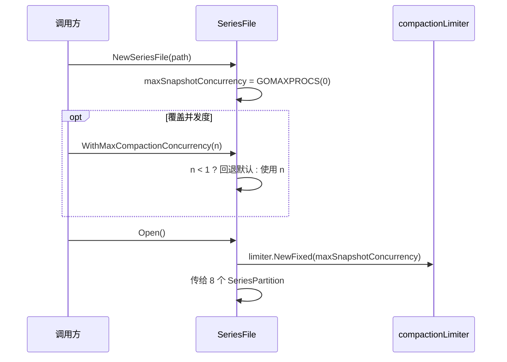

**案例**: 默认 `GOMAXPROCS=8` 时最多允许 8 个分区压缩同时拿到令牌；如果测试或低 I/O 环境在 `Open()` 前调用
`WithMaxCompactionConcurrency(2)`，8 个分区仍独立打开，但同时压缩的分区最多只有 2 个。

### 1.4 全局架构图

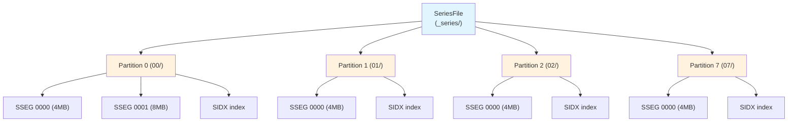

## 2. 交错 ID 分配方案

### 2.1 基本原理

SeriesFile 使用**交错（interleaved）**方式分配 series ID：8 个分区轮流分配，每个分区只分配属于自己的 ID。

```go
// tsdb/series_partition.go:62 — seq 初始化
p.seq = uint64(id) + 1
```

- Partition 0: seq = 1, 分配 1, 9, 17, 25, 33, ...
- Partition 1: seq = 2, 分配 2, 10, 18, 26, 34, ...
- Partition 2: seq = 3, 分配 3, 11, 19, 27, 35, ...
- Partition 7: seq = 8, 分配 8, 16, 24, 32, 40, ...

### 2.2 insert — 分配新 ID

```go
// tsdb/series_partition.go:445 — insert
func (p *SeriesPartition) insert(key []byte) (id uint64, offset int64, err error) {
    id = p.seq
    offset, err = p.writeLogEntry(AppendSeriesEntry(nil, SeriesEntryInsertFlag, id, key))
    if err != nil {
        return 0, 0, err
    }
    p.seq += SeriesFilePartitionN  // 每次递增 8，不是 1
    return id, offset, nil
}
```

**关键设计**: `p.seq += SeriesFilePartitionN` 而不是 `p.seq++`。这意味着每个分区只分配步长为 8 的 ID 序列，天然避免了分区间的 ID 冲突。

### 2.3 ID → 分区映射

```go
// tsdb/series_file.go:280 — SeriesIDPartitionID
func (f *SeriesFile) SeriesIDPartitionID(id uint64) int {
    return int((id - 1) % SeriesFilePartitionN)
}
```

给定任意 series ID，通过 `(id-1) % 8` 即可确定它属于哪个分区。例如：
- ID=1 → (1-1)%8 = 0 → Partition 0
- ID=2 → (2-1)%8 = 1 → Partition 1
- ID=9 → (9-1)%8 = 0 → Partition 0

### 2.4 Key → 分区映射

```go
// tsdb/series_file.go:299 — SeriesKeyPartitionID
func (f *SeriesFile) SeriesKeyPartitionID(key []byte) int {
    return int(xxhash.Sum64(key) % SeriesFilePartitionN)
}
```

给定 series key，通过 `xxhash.Sum64(key) % 8` 确定分区。注意这里用的是取模而非 `(id-1)%8`，因为 key 的 hash 值与 ID 无关。

### 2.5 崩溃恢复时的 seq 重建

```go
// tsdb/series_partition.go:122-128
// Find max series id by searching segments in reverse order.
for i := len(p.segments) - 1; i >= 0; i-- {
    if seq := p.segments[i].MaxSeriesID(); seq >= p.seq {
        // Reset our sequence num to the next one to assign
        p.seq = seq + SeriesFilePartitionN
        break
    }
}
```

启动时从最后一个 segment 开始反向扫描，找到最大的 series ID，然后设置 `seq = maxID + 8`。这确保了即使上次崩溃时有些 ID 没用完，也不会重复分配。

### 2.6 交错 ID 分配图

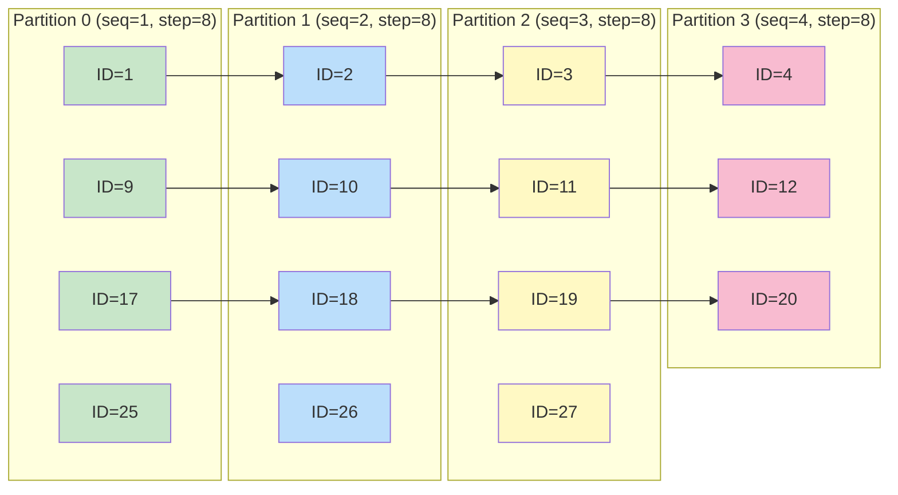

### 2.7 案例：创建 5 个 series 的 ID 分配

假设依次创建以下 series：

| 序号 | Series Key | xxhash % 8 | 分区 | 分配的 ID |
|------|-----------|------------|------|----------|
| 1 | `cpu,host=web` | 3 | Partition 3 | ID=4 |
| 2 | `cpu,host=db` | 1 | Partition 1 | ID=2 |
| 3 | `mem,host=web` | 5 | Partition 5 | ID=6 |
| 4 | `cpu,host=api` | 0 | Partition 0 | ID=1 |
| 5 | `disk,host=web` | 2 | Partition 2 | ID=3 |

> **注意**: 以上 hash 值为示意。实际 xxhash 值取决于具体 key 内容。

每个分区的 seq 初始值为 `partitionID + 1`。假设所有 5 个 series 被并行创建（8 个 goroutine 各处理一个分区），每个分区独立分配自己的 ID。Partition 3 分配 ID=4（seq 从 4 开始），Partition 1 分配 ID=2（seq 从 2 开始），以此类推。

### 2.8 SeriesKeyPartitionID vs SeriesIDPartitionID 路由分叉

§2.3 和 §2.4 分别给出了 ID→分区 和 key→分区 的映射函数。把它们并排看，会发现两条路由路径
用的是**完全不同的算法**，这是 SeriesFile 设计中容易误读的一点。源码
`tsdb/series_file.go:313-335`：

```go
// tsdb/series_file.go:313 — SeriesIDPartitionID
func (f *SeriesFile) SeriesIDPartitionID(id uint64) int {
    return int((id - 1) % SeriesFilePartitionN)   // (id-1) % 8
}

// tsdb/series_file.go:333 — SeriesKeyPartitionID
func (f *SeriesFile) SeriesKeyPartitionID(key []byte) int {
    return int(xxhash.Sum64(key) % SeriesFilePartitionN)   // xxhash % 8
}
```

两者都用 `% SeriesFilePartitionN`（=8），但**被取模的对象不同**：

| 路由方向 | 函数 | 被取模的值 | 算法 | 用途 |
|---------|------|-----------|------|------|
| ID → 分区 | `SeriesIDPartitionID` | `(id - 1)` | 算术取模 | 给定 series ID 反查它属于哪个分区（用于 `SeriesIDPartition`、删除、`Series`/`SeriesKeys`） |
| key → 分区 | `SeriesKeyPartitionID` | `xxhash.Sum64(key)` | 哈希取模 | 给定 series key 决定写入哪个分区（用于 `SeriesKeysPartitionIDs`、`CreateSeriesListIfNotExists` 路由） |

两者**不可互换**：同一个 series 的 key 路由结果和 ID 路由结果通常落在不同分区。这之所以能工作，
是因为交错 ID 分配方案（§2.1）保证：写入时 key 经 `xxhash % 8` 路由到分区 P，P 用
`p.seq += 8` 分配的 ID 一定满足 `(id-1) % 8 == P`。即**ID 路由是 key 路由的逆映射**，
但这是通过"分配时记录"建立的，不是两个函数数学上互逆。

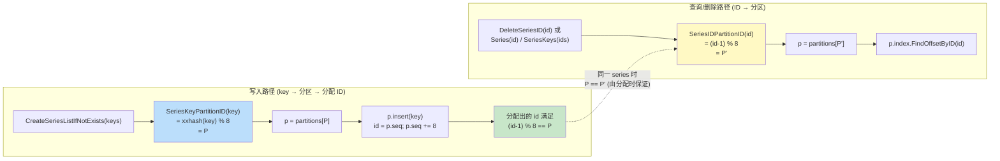

**case 说明 (同一个 series 的两条路由计算)**:

假设 series key = `"cpu,host=web"`，且 `xxhash.Sum64([]byte("cpu,host=web")) % 8 == 3`，
那么写入时它会被路由到 Partition 3。

```
写入路径 (CreateSeriesListIfNotExists 调用):
  key = "cpu,host=web"
  SeriesKeyPartitionID(key):
    h = xxhash.Sum64([]byte("cpu,host=web"))   // 例如 0x...某 64 位值
    return int(h % 8)                           // = 3
  → 路由到 Partition 3
  Partition 3 此时 seq = 4 (初始 = partitionID+1 = 3+1 = 4)
  p.insert(key):
    id = 4
    写 SSEG: [0x01][0x0000000000000004][key bytes...]
    p.seq += 8 → seq = 12
  → 分配出的 series ID = 4

验证 (id-1) % 8 == 3?
  (4 - 1) % 8 = 3 % 8 = 3 ✓
  → 与 key 路由结果一致, 这是交错分配方案 (§2.1) 保证的, 不是两个函数互逆

查询/删除路径 (后续用 id=4 反查):
  SeriesIDPartitionID(4):
    return int((4 - 1) % 8) = 3
  → 路由到 Partition 3 (与写入时同一个分区)
  p.index.FindOffsetByID(4) → 返回 SSEG 偏移
  → 能正确取回 key = "cpu,host=web"

反例 (如果误用 SeriesKeyPartitionID 反查会怎样):
  假设有人错误地用 xxhash(id) % 8 反查分区:
    xxhash.Sum64([]byte{0,0,0,0,0,0,0,4}) % 8   // 把 id 当 bytes
    = 某个与 3 无关的值, 例如 5
    → 路由到 Partition 5, FindOffsetByID(4) 返回 0
    → 误判 series 不存在

  这正是源码用 (id-1) % 8 而不是 hash(id) 的原因:
    交错分配让 ID 自带分区信息, 反查 O(1) 且无哈希碰撞;
    而 key 必须用哈希, 因为 key 内容任意, 没有内置分区编号。
```

> **为什么 key 路由不也用算术取模？** key 是任意字节串，没有"自然编号"。如果先维护一个
> key→序号的全局映射再取模，就退化成需要中心化分配，违背了 8 分区独立锁的设计初衷。
> 用 `xxhash % 8` 让 key 路由变成无状态计算，每个分区可以独立决定"这个 key 归不归我管"。

## 3. Series Key 编码格式

### 3.1 AppendSeriesKey — 序列化

```go
// tsdb/series_file.go:312 — AppendSeriesKey
func AppendSeriesKey(dst []byte, name []byte, tags models.Tags) []byte {
    buf := make([]byte, binary.MaxVarintLen64)
    origLen := len(dst)

    // The tag count is variable encoded, so we need to know ahead of time what
    // the size of the tag count value will be.
    tcBuf := make([]byte, binary.MaxVarintLen64)
    tcSz := binary.PutUvarint(tcBuf, uint64(len(tags)))

    // Size of name/tags. Does not include total length.
    size := 0 +
        2 +             // size of measurement
        len(name) +     // measurement
        tcSz +          // size of number of tags
        (4 * len(tags)) + // length of each tag key and value
        tags.Size()     // size of tag keys/values

    // Variable encode length.
    totalSz := binary.PutUvarint(buf, uint64(size))

    // If caller doesn't provide a buffer then pre-allocate an exact one.
    if dst == nil {
        dst = make([]byte, 0, size+totalSz)
    }

    // Append total length.
    dst = append(dst, buf[:totalSz]...)

    // Append name.
    binary.BigEndian.PutUint16(buf, uint16(len(name)))
    dst = append(dst, buf[:2]...)
    dst = append(dst, name...)

    // Append tag count.
    dst = append(dst, tcBuf[:tcSz]...)

    // Append tags.
    for _, tag := range tags {
        binary.BigEndian.PutUint16(buf, uint16(len(tag.Key)))
        dst = append(dst, buf[:2]...)
        dst = append(dst, tag.Key...)

        binary.BigEndian.PutUint16(buf, uint16(len(tag.Value)))
        dst = append(dst, buf[:2]...)
        dst = append(dst, tag.Value...)
    }

    // Verify that the total length equals the encoded byte count.
    if got, exp := len(dst)-origLen, size+totalSz; got != exp {
        panic(fmt.Sprintf("series key encoding does not match calculated total length: actual=%d, exp=%d, key=%x", got, exp, dst))
    }

    return dst
}
```

### 3.2 二进制格式

以 `cpu,host=web,region=us-east` 为例：

```
┌─────────────────┬──────────────────┬──────────┬───────────┬─────────────┬───────────┬───────────────┬───────────┬──────────┬──────────────┬───────────┬──────────┬────────────────┬───────────┐
│ Total Length    │ Name Len         │ Name     │ Tag Count │ Tag1 Key Len│ Tag1 Key  │ Tag1 Value Len│ Tag1 Value│ Tag2 Key Len│ Tag2 Key    │ Tag2 Value Len│ Tag2 Value│ ...               │
│ uvarint         │ uint16 (2B)      │ N bytes  │ uvarint   │ uint16 (2B) │ N bytes   │ uint16 (2B)   │ N bytes   │ uint16 (2B)│ N bytes      │ uint16 (2B) │ N bytes  │ ...               │
│ 例: 0x1E (30)   │ 0x0003 (3)       │ "cpu"    │ 0x02 (2)  │ 0x0004 (4)  │ "host"    │ 0x0003 (3)    │ "web"     │ 0x0006 (6) │ "region"     │ 0x0008 (8)  │"us-east" │ ...               │
└─────────────────┴──────────────────┴──────────┴───────────┴─────────────┴───────────┴───────────────┴───────────┴──────────────┴──────────────┴───────────────┴───────────┴───────────────────┘
```

**字段说明**:

| 字段 | 类型 | 说明 |
|------|------|------|
| Total Length | uvarint | 除自身外的总字节数 |
| Name Len | uint16 (BigEndian) | measurement 名称长度 |
| Name | []byte | measurement 名称 |
| Tag Count | uvarint | tag 数量 |
| Tag Key Len | uint16 (BigEndian) | tag key 长度 |
| Tag Key | []byte | tag key |
| Tag Value Len | uint16 (BigEndian) | tag value 长度 |
| Tag Value | []byte | tag value |

### 3.3 GenerateSeriesKeys — 批量序列化

```go
// tsdb/series_file.go:491 — GenerateSeriesKeys
func GenerateSeriesKeys(names [][]byte, tagsSlice []models.Tags) [][]byte {
    buf := make([]byte, 0, SeriesKeysSize(names, tagsSlice))
    keys := make([][]byte, len(names))
    for i := range names {
        offset := len(buf)
        buf = AppendSeriesKey(buf, names[i], tagsSlice[i])
        keys[i] = buf[offset:]
    }
    return keys
}
```

**优化**: 预计算总大小，一次性分配大 buffer，所有 key 共享同一块内存。这减少了 GC 压力。每个 key 是大 buffer 的一个切片（slice），指向连续的内存区域。

### 3.4 Key → 分区路由

```go
// tsdb/series_file.go:299 — SeriesKeyPartitionID
func (f *SeriesFile) SeriesKeyPartitionID(key []byte) int {
    return int(xxhash.Sum64(key) % SeriesFilePartitionN)
}
```

使用 xxhash 对整个序列化后的 key 做哈希，取模 8 得到分区 ID。

## 4. SSEG Segment 文件格式

### 4.1 SeriesSegment 结构体

```go
// tsdb/series_segment.go:40 — SeriesSegment
type SeriesSegment struct {
    id   uint16
    path string

    data []byte        // mmap file
    file *os.File      // write file handle
    w    *bufio.Writer // bufferred file handle
    size uint32        // current file size
}
```

每个 segment 同时持有 mmap 只读映射（`data`）和文件写入句柄（`file` + `w`）。`w` 是 32KB 缓冲的 `bufio.Writer`。

### 4.2 文件头

```go
// tsdb/series_segment.go:17-22
const (
    SeriesSegmentVersion = 1
    SeriesSegmentMagic   = "SSEG"

    SeriesSegmentHeaderSize = 4 + 1 // magic + version
)
```

SSEG 文件头固定 5 字节：

```
┌──────────┬──────────┐
│ Magic    │ Version  │
│ 4 bytes  │ 1 byte   │
│ "SSEG"   │ 0x01     │
└──────────┴──────────┘
```

### 4.3 Entry 格式

```go
// tsdb/series_segment.go:26-31
const (
    SeriesEntryFlagSize   = 1
    SeriesEntryHeaderSize = 1 + 8 // flag + id

    SeriesEntryInsertFlag    = 0x01
    SeriesEntryTombstoneFlag = 0x02
)
```

**Insert Entry** (flag=0x01):

```
┌──────┬────────┬──────────────┐
│ Flag │  ID    │     Key      │
│1 byte│8 bytes │ N bytes (变长)│
│ 0x01 │BigEnd. │ uvarint+N    │
└──────┴────────┴──────────────┘
```

**Tombstone Entry** (flag=0x02):

```
┌──────┬────────┐
│ Flag │  ID    │
│1 byte│8 bytes │
│ 0x02 │BigEnd. │
└──────┴────────┘
```

Tombstone 没有 Key 字段——只需要 ID 就够了。

### 4.4 ReadSeriesEntry — 解析 Entry

```go
// tsdb/series_segment.go:415 — ReadSeriesEntry
func ReadSeriesEntry(data []byte) (flag uint8, id uint64, key []byte, sz int64) {
    // If flag byte is zero then no more entries exist.
    flag, data = uint8(data[0]), data[1:]
    if !IsValidSeriesEntryFlag(flag) {
        return 0, 0, nil, 1
    }

    id, data = binary.BigEndian.Uint64(data), data[8:]
    switch flag {
    case SeriesEntryInsertFlag:
        key, _ = ReadSeriesKey(data)
    }
    return flag, id, key, int64(SeriesEntryHeaderSize + len(key))
}
```

**关键点**: Flag 字节为 0 表示没有更多 entry（文件未写满的部分全是 0）。Insert entry 返回 key，Tombstone entry 不读 key。

### 4.5 AppendSeriesEntry — 构建 Entry

```go
// tsdb/series_segment.go:430 — AppendSeriesEntry
func AppendSeriesEntry(dst []byte, flag uint8, id uint64, key []byte) []byte {
    buf := make([]byte, 8)
    binary.BigEndian.PutUint64(buf, id)

    dst = append(dst, flag)
    dst = append(dst, buf...)

    switch flag {
    case SeriesEntryInsertFlag:
        dst = append(dst, key...)
    case SeriesEntryTombstoneFlag:
    default:
        panic(fmt.Sprintf("unreachable: invalid flag: %d", flag))
    }
    return dst
}
```

### 4.6 Segment 大小增长策略

```go
// tsdb/series_segment.go:366 — SeriesSegmentSize
func SeriesSegmentSize(id uint16) uint32 {
    const min = 22 // 4MB
    const max = 28 // 256MB

    shift := id + min
    if shift >= max {
        shift = max
    }
    return 1 << shift
}
```

| Segment ID | 大小 |
|------------|------|
| 0 | 4MB (2^22) |
| 1 | 8MB (2^23) |
| 2 | 16MB (2^24) |
| 3 | 32MB (2^25) |
| 4 | 64MB (2^26) |
| 5 | 128MB (2^27) |
| 6+ | 256MB (2^28) |

早期 segment 小（快速分配），后期 segment 大（减少文件数）。ID>=6 后固定为 256MB。

### 4.7 复合偏移量编码

```go
// tsdb/series_segment.go:353 — JoinSeriesOffset
func JoinSeriesOffset(segmentID uint16, pos uint32) int64 {
    return (int64(segmentID) << 32) | int64(pos)
}

// tsdb/series_segment.go:358 — SplitSeriesOffset
func SplitSeriesOffset(offset int64) (segmentID uint16, pos uint32) {
    return uint16((offset >> 32) & 0xFFFF), uint32(offset & 0xFFFFFFFF)
}
```

一个 int64 偏移量编码了两部分信息：
- 高 16 位：segment ID（最多 65536 个 segment）
- 低 32 位：segment 内的字节偏移（最多 4GB）

例如 offset = `0x000200001000` 表示 segment 2 的偏移 0x1000（4096）处。

### 4.8 mmap 与写入

**Open 时 mmap**:

```go
// tsdb/series_segment.go:96
if s.data, err = mmap.Map(s.path, int64(SeriesSegmentSize(s.id))); err != nil {
    return err
}
```

整个 segment 文件被 mmap 到内存，大小为 `SeriesSegmentSize(id)`。文件可能大部分是 0（未写满），但 mmap 是按需加载的（page fault），所以不会浪费物理内存。

**InitForWrite — 扫描写入位置**:

```go
// tsdb/series_segment.go:122 — InitForWrite
func (s *SeriesSegment) InitForWrite() (err error) {
    // Only calculcate segment data size if writing.
    for s.size = uint32(SeriesSegmentHeaderSize); s.size < uint32(len(s.data)); {
        flag, _, _, sz := ReadSeriesEntry(s.data[s.size:])
        if !IsValidSeriesEntryFlag(flag) {
            break
        }
        s.size += uint32(sz)
    }

    // Open file handler for writing & seek to end of data.
    if s.file, err = os.OpenFile(s.path, os.O_WRONLY|os.O_CREATE, 0666); err != nil {
        return err
    } else if _, err := s.file.Seek(int64(s.size), io.SeekStart); err != nil {
        return err
    }
    s.w = bufio.NewWriterSize(s.file, 32*1024)

    return nil
}
```

从 header 之后开始扫描 entry，直到遇到无效 flag（0x00），找到写入位置。然后打开文件并 seek 到该位置，创建 32KB 缓冲的 writer。

### 4.9 SSEG 文件布局图

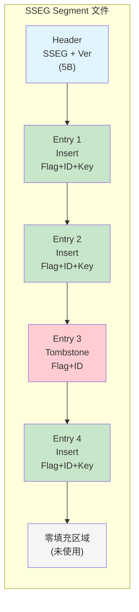

### 4.10 JoinSeriesOffset 的 64 位位打包布局

§4.7 给出了 `JoinSeriesOffset`/`SplitSeriesOffset` 的函数体，这一节把 64 位 int64 的
位布局单独画出来。源码 `tsdb/series_segment.go:353-360`：

```go
// tsdb/series_segment.go:353 — JoinSeriesOffset
func JoinSeriesOffset(segmentID uint16, pos uint32) int64 {
    return (int64(segmentID) << 32) | int64(pos)
}

// tsdb/series_segment.go:358 — SplitSeriesOffset
func SplitSeriesOffset(offset int64) (segmentID uint16, pos uint32) {
    return uint16((offset >> 32) & 0xFFFF), uint32(offset & 0xFFFFFFFF)
}
```

64 位 int64 的位布局（高位存 segmentID，低位存 pos）：

```
bit:  63                    48 47                                    0
     ┌───────────────────────┬─────────────────────────────────────────┐
     │   segmentID (16 bit)  │              pos (32 bit)               │
     │     uint16            │              uint32                     │
     └───────────────────────┴─────────────────────────────────────────┘
       ↑                     ↑
       (offset >> 32)        offset & 0xFFFFFFFF
       & 0xFFFF
```

注意布局里的"空隙"：bit 32-47（16 位）放 segmentID，bit 0-31（32 位）放 pos，但
segmentID 是 uint16（只占 16 位），所以理论上 bit 48-63 是**符号位 + 高 16 位零**。
`JoinSeriesOffset` 用 `int64(segmentID) << 32` 把 uint16 提升到 int64 后左移 32 位，
结果的高 32 位（bit 32-63）只有低 16 位（bit 32-47）装着 segmentID，bit 48-63 是符号扩展的零。
`SplitSeriesOffset` 用 `(offset >> 32) & 0xFFFF` 把这 16 位取回，`uint32(offset & 0xFFFFFFFF)`
取低 32 位的 pos。

容量上限：
- **segmentID**：uint16，最多 65536 个 segment（0..65535）。
- **pos**：uint32，单个 segment 内最多 4GB 偏移（0..4294967295）。
- 因为 segment 大小上限是 256MB（§4.6，`SeriesSegmentSize` id>=6 时 `1<<28` = 268435456），
  远小于 4GB，所以 pos 的 32 位永远不会溢出。

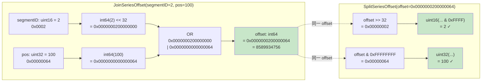

**case 说明 (JoinSeriesOffset(2, 100) → SplitSeriesOffset 还原)**:

```
输入: segmentID = 2 (uint16), pos = 100 (uint32)

JoinSeriesOffset(2, 100):
  step 1: int64(segmentID) = int64(2) = 0x0000000000000002
  step 2: int64(segmentID) << 32 = 0x0000000200000000
          (2 的二进制 10, 左移 32 位后落在 bit 33)
  step 3: int64(pos) = int64(100) = 0x0000000000000064
          (100 = 0x64, 在 bit 0-7)
  step 4: OR = 0x0000000200000000 | 0x0000000000000064
                = 0x0000000200000064
  → offset = 8589934756 (十进制)

SplitSeriesOffset(0x0000000200000064):
  step 1: offset >> 32 = 0x0000000200000064 >> 32 = 0x00000002
  step 2: uint16(0x00000002 & 0xFFFF) = uint16(0x0002) = 2 ✓
  step 3: uint32(offset & 0xFFFFFFFF) = uint32(0x00000064) = 100 ✓
  → (segmentID=2, pos=100) 完整还原

实际用途 (SIDX keyIDMap 存储):
  SIDX 的 keyIDMap 每个元素 16 字节: [offset(8B)][id(8B)]
  series 在 SSEG segment 2 的 pos=100 处, ID=27
  → 写入 keyIDMap: offset = JoinSeriesOffset(2, 100) = 0x0000000200000064
                   id = 27 = 0x000000000000001B
  → 16 字节: 00 00 00 02 00 00 00 64 | 00 00 00 00 00 00 00 1B

查询时 FindIDBySeriesKey 读到 elemOffset = 0x0000000200000064:
  segmentID, pos = SplitSeriesOffset(elemOffset) = (2, 100)
  → 到 segments[2].Slice(pos + SeriesEntryHeaderSize) 读 key
  → 与查询 key 比对, 命中则返回 id = 27
```

> **offset=0 哨兵的位布局解释**：`JoinSeriesOffset(0, 0) = 0`，对应 bit 全零。SIDX keyIDMap
> 用 `elemOffset == 0` 表示空槽（§5.2），这之所以安全，是因为 SSEG 的合法 entry 从
> `SeriesSegmentHeaderSize = 5` 之后开始，`pos = 0` 永远指向 header 而非 entry。
> 所以 `JoinSeriesOffset(segmentID=0, pos=0)` 这个组合在真实 series 上不可能出现。

## 5. SeriesIndex — 两层查找架构

### 5.1 SeriesIndex 结构体

```go
// tsdb/series_index.go:36 — SeriesIndex
type SeriesIndex struct {
    path string

    count    uint64
    capacity int64
    mask     int64

    maxSeriesID uint64
    maxOffset   int64

    data         []byte // mmap data
    keyIDData    []byte // key/id mmap data
    idOffsetData []byte // id/offset mmap data

    // In-memory data since rebuild.
    keyIDMap    *rhh.HashMap
    idOffsetMap map[uint64]int64
    tombstones  map[uint64]struct{}
}
```

**两层架构**:
- **磁盘层**（mmap）: `data` 是整个 SIDX 文件的 mmap 映射。`keyIDData` 和 `idOffsetData` 是从 `data` 中切出的两个 RHH 表区域。
- **内存层**: `keyIDMap`（`*rhh.HashMap`）、`idOffsetMap`（`map[uint64]int64`）和 `tombstones`（`map[uint64]struct{}`）存储自上次压缩以来的新 entry。

### 5.2 Open — 初始化

```go
// tsdb/series_index.go:63 — Open
func (idx *SeriesIndex) Open() (err error) {
    if err := func() error {
        if _, err := os.Stat(idx.path); err != nil && !os.IsNotExist(err) {
            return err
        } else if err == nil {
            if idx.data, err = mmap.Map(idx.path, 0); err != nil {
                return err
            }

            hdr, err := ReadSeriesIndexHeader(idx.data)
            if err != nil {
                return err
            }
            idx.count, idx.capacity, idx.mask = hdr.Count, hdr.Capacity, hdr.Capacity-1
            idx.maxSeriesID, idx.maxOffset = hdr.MaxSeriesID, hdr.MaxOffset

            idx.keyIDData = idx.data[hdr.KeyIDMap.Offset : hdr.KeyIDMap.Offset+hdr.KeyIDMap.Size]
            idx.idOffsetData = idx.data[hdr.IDOffsetMap.Offset : hdr.IDOffsetMap.Offset+hdr.IDOffsetMap.Size]
        }
        return nil
    }(); err != nil {
        idx.Close()
        return err
    }

    idx.keyIDMap = rhh.NewHashMap(rhh.DefaultOptions)
    idx.idOffsetMap = make(map[uint64]int64)
    idx.tombstones = make(map[uint64]struct{})
    return nil
}
```

**关键点**:
- 如果 SIDX 文件不存在（首次启动），`data` 为空，只初始化内存 map
- 如果 SIDX 文件存在，mmap 整个文件，解析 header，切出两个 RHH 表区域
- 内存 map 始终初始化为空——后续通过 `Recover()` 填充
- SIDX 的空槽依赖零值哨兵：KeyIDMap 用 `elemOffset == 0` 停止探测；IDOffsetMap 写入时也把 `elemOffset == 0` 视为空槽，查找时则可用 `elemID == 0` 停止，因为 series ID 从 1 开始。`offset == 0` 安全的原因是 SSEG 的有效 entry 从 5 字节 header 之后开始，`JoinSeriesOffset(0, 0)` 指向文件头，不可能是有效 series entry

### 5.3 两层查找流程图

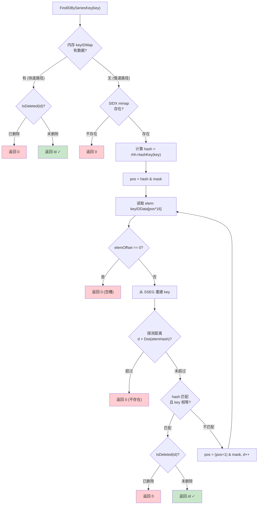

**offset 0 哨兵案例**: segment 0 的第一个合法 entry 偏移至少是 `SeriesSegmentHeaderSize=5`，
所以 `JoinSeriesOffset(0, 5)` 才可能指向真实 entry。RHH 表里读到 `elemOffset == 0` 时，可以立即判定这个探测链结束，
返回“不存在”，不会误伤合法 series。

## 6. SIDX 文件格式

### 6.1 Header（69 字节）

```go
// tsdb/series_index.go:24-30
const (
    SeriesIndexHeaderSize = 0 +
        4 + 1 + // magic + version
        8 + 8 + // max series + max offset
        8 + 8 + // count + capacity
        8 + 8 + // key/id map offset & size
        8 + 8 + // id/offset map offset & size
        0
)
```

SIDX header 固定 69 字节：

| 偏移 | 大小 | 字段 | 说明 |
|------|------|------|------|
| 0 | 4B | Magic | "SIDX" (0x53494458) |
| 4 | 1B | Version | 版本号 (1) |
| 5 | 8B | MaxSeriesID | 最大 series ID |
| 13 | 8B | MaxOffset | 最大 SSEG 偏移 |
| 21 | 8B | Count | series 总数 |
| 29 | 8B | Capacity | RHH 表容量（2 的幂） |
| 37 | 8B | KeyIDMap.Offset | KeyIDMap 数据起始偏移 |
| 45 | 8B | KeyIDMap.Size | KeyIDMap 数据大小 |
| 53 | 8B | IDOffsetMap.Offset | IDOffsetMap 数据起始偏移 |
| 61 | 8B | IDOffsetMap.Size | IDOffsetMap 数据大小 |

### 6.2 两层 RHH 表

**KeyIDMap**: key → (offset + ID)，每个元素 16 字节

```
┌────────────────┬────────────────┐
│   Offset (8B)  │    ID (8B)     │
│  SSEG 偏移     │  Series ID     │
└────────────────┴────────────────┘
```

**IDOffsetMap**: ID → offset，每个元素 16 字节

```
┌────────────────┬────────────────┐
│    ID (8B)     │  Offset (8B)   │
│  Series ID     │  SSEG 偏移     │
└────────────────┴────────────────┘
```

### 6.3 容量计算

```go
// tsdb/series_partition.go:571
hdr.Capacity = pow2((int64(hdr.Count) * 100) / SeriesIndexLoadFactor)
```

容量 = 大于等于 `(count * 100 / 90)` 的最小 2 的幂。90% 负载因子意味着：
- 100 个 series → capacity = 128（100*100/90 ≈ 112, pow2 = 128）
- 1000 个 series → capacity = 2048（1000*100/90 ≈ 1112, pow2 = 2048）

### 6.4 SIDX 文件布局图

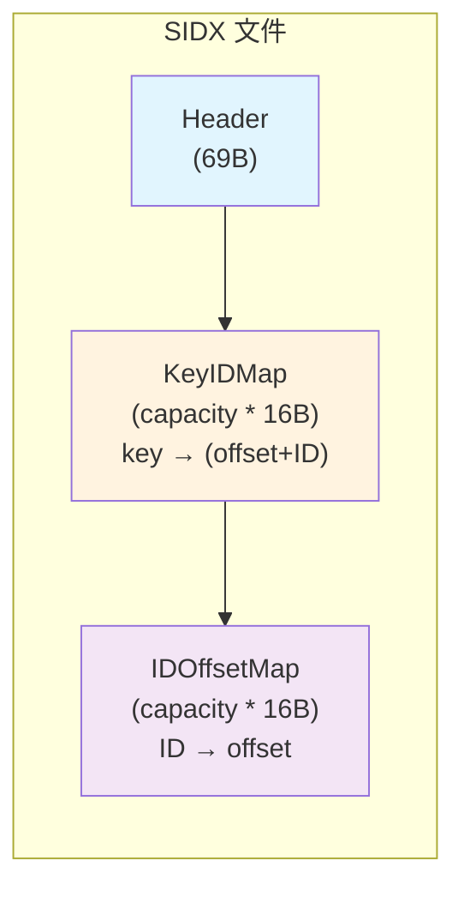

## 7. Robin Hood Hashing 算法详解

### 7.1 HashMap 结构体

```go
// pkg/rhh/rhh.go:13 — HashMap
type HashMap struct {
    hashes []int64
    elems  []hashElem

    n          int64
    capacity   int64
    threshold  int64
    mask       int64
    loadFactor int

    tmpKey []byte
}
```

**小白解释**: 想象一个停车场（哈希表），每辆车（数据）根据车牌号（hash）分配车位。
- **普通哈希**: 如果车位被占了，就往前找空位，可能找很远
- **Robin Hood**: "劫富济贫"——如果新车的"理想车位"比已经在位的车更远，就把旧车挪走，新车停进去。这样所有车的"寻找距离"更均匀。

### 7.2 哈希函数

```go
// pkg/rhh/rhh.go:237 — HashKey
func HashKey(key []byte) int64 {
    h := int64(xxhash.Sum64(key))
    if h == 0 {
        h = 1
    } else if h < 0 {
        h = 0 - h
    }
    return h
}
```

使用 xxhash，保证结果非零（0 表示空槽）且为正数。

### 7.3 Dist — 探测距离

```go
// pkg/rhh/rhh.go:256 — Dist
func Dist(hash, i, capacity int64) int64 {
    mask := capacity - 1
    dist := (i + capacity - (hash & mask)) & mask
    return dist
}
```

计算一个 hash 值在槽位 `i` 处的探测距离——即从理想位置到当前位置的环绕距离。例如 capacity=8，hash 的理想位置是 3，当前位置是 5，则 dist = (5+8-3) & 7 = 2。

### 7.4 插入算法

```go
// pkg/rhh/rhh.go:66 — insert
func (m *HashMap) insert(hash int64, key []byte, val interface{}) (overwritten bool) {
    pos := hash & m.mask
    var dist int64

    var copied bool
    searchKey := key

    // Continue searching until we find an empty slot or lower probe distance.
    for {
        e := &m.elems[pos]

        // Empty slot found or matching key, insert and exit.
        match := bytes.Equal(m.elems[pos].key, searchKey)
        if m.hashes[pos] == 0 || match {
            m.hashes[pos] = hash
            e.hash, e.value = hash, val
            e.setKey(searchKey)
            return match
        }

        // If the existing elem has probed less than us, then swap places with
        // existing elem, and keep going to find another slot for that elem.
        elemDist := Dist(m.hashes[pos], pos, m.capacity)
        if elemDist < dist {
            // Swap with current position.
            hash, m.hashes[pos] = m.hashes[pos], hash
            val, e.value = e.value, val

            m.tmpKey = assign(m.tmpKey, e.key)
            e.setKey(searchKey)

            if !copied {
                searchKey = make([]byte, len(key))
                copy(searchKey, key)
                copied = true
            }

            searchKey = assign(searchKey, m.tmpKey)

            // Update current distance.
            dist = elemDist
        }

        // Increment position, wrap around on overflow.
        pos = (pos + 1) & m.mask
        dist++
    }
}
```

**插入步骤**:
1. 计算理想位置 `pos = hash & mask`
2. 如果槽为空或 key 匹配 → 直接插入
3. 如果当前元素的探测距离小于新元素的探测距离 → **交换**（Robin Hood 规则），然后继续为被换出的元素找位置
4. 否则 → 前进到下一个槽

### 7.5 查找算法

```go
// pkg/rhh/rhh.go:144 — index
func (m *HashMap) index(key []byte) int64 {
    hash := HashKey(key)
    pos := hash & m.mask

    var dist int64
    for {
        if m.hashes[pos] == 0 {
            return -1
        } else if dist > Dist(m.hashes[pos], pos, m.capacity) {
            return -1
        } else if m.hashes[pos] == hash && bytes.Equal(m.elems[pos].key, key) {
            return pos
        }

        pos = (pos + 1) & m.mask
        dist++
    }
}
```

**查找步骤**:
1. 从理想位置开始
2. 空槽 → 不存在
3. 当前探测距离超过该位置元素的探测距离 → 不存在（Robin Hood 的关键优化：如果我要找的 key 比这个位置的元素"更远"，它不可能在这个方向上）
4. hash + key 匹配 → 找到

### 7.6 扩容

```go
// pkg/rhh/rhh.go:124 — grow
func (m *HashMap) grow() {
    elems, hashes := m.elems, m.hashes
    capacity := m.capacity

    m.capacity *= 2
    m.alloc()

    for i := int64(0); i < capacity; i++ {
        elem, hash := &elems[i], hashes[i]
        if hash == 0 {
            continue
        }
        m.insert(hash, elem.key, elem.value)
    }
}
```

当 `n > threshold`（容量 * 负载因子 / 100）时，容量翻倍，重新插入所有元素。

### 7.7 Robin Hood 插入图解

源码交换条件是 `elemDist < dist`：只有当前位置已有元素的探测距离严格小于新元素当前探测距离时才交换。
距离相等不交换；如果新元素距离更小，也不交换。

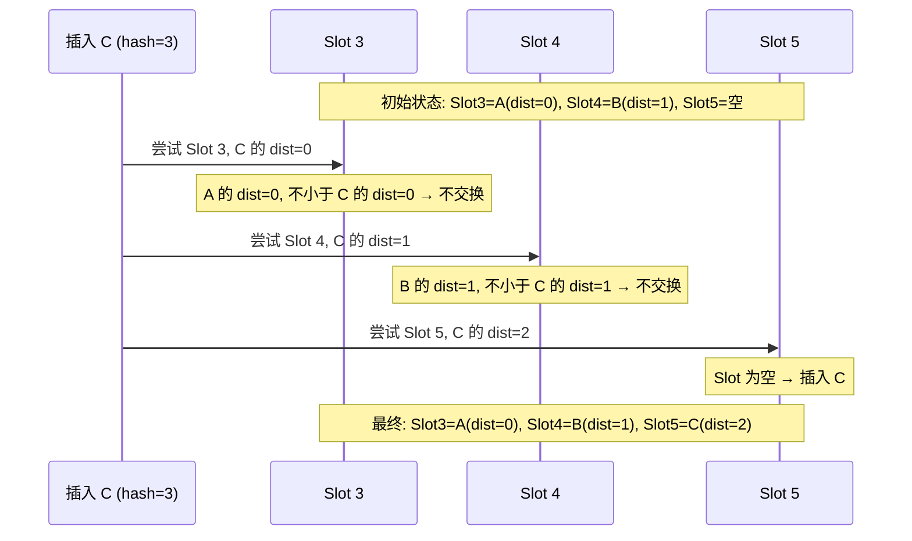

假设 capacity=8，已有 Slot 3=A(dist=0), Slot 4=B(dist=1)。现在插入 C(hash=3)：

1. C 到 Slot 3：A 的 dist=0, C 的 dist=0。0 < 0 为假，不交换。前进。
2. C 到 Slot 4：B 的 dist=1, C 的 dist=1。1 < 1 为假，不交换。前进。
3. C 到 Slot 5：空。插入 C。

**但如果 D(hash=5) 要插入，而 Slot 5 已被 C 占据：**

1. D 到 Slot 5：C 的 dist=2, D 的 dist=0。源码判断 `elemDist < dist`，即 `2 < 0` 为假，不交换。
2. D 前进到 Slot 6：Slot 6 为空，插入 D。

这就是源码实现的精确规则：只有新元素已经探测得更远（`dist` 更大），且当前位置元素更“富”（`elemDist` 更小）时，才触发交换。

## 8. FindIDBySeriesKey — 两层查找

### 8.1 代码实现

```go
// tsdb/series_index.go:185 — FindIDBySeriesKey
func (idx *SeriesIndex) FindIDBySeriesKey(segments []*SeriesSegment, key []byte) uint64 {
    // 第一层: 内存查找（快速路径）
    if v := idx.keyIDMap.Get(key); v != nil {
        if id, _ := v.(uint64); id != 0 && !idx.IsDeleted(id) {
            return id
        }
    }

    // 第二层: 磁盘查找（慢速路径）
    if len(idx.data) == 0 {
        return 0
    }

    hash := rhh.HashKey(key)
    for d, pos := int64(0), hash&idx.mask; ; d, pos = d+1, (pos+1)&idx.mask {
        elem := idx.keyIDData[(pos * SeriesIndexElemSize):]
        elemOffset := int64(binary.BigEndian.Uint64(elem[:8]))

        if elemOffset == 0 {
            return 0  // 空槽，不存在
        }

        elemKey := ReadSeriesKeyFromSegments(segments, elemOffset+SeriesEntryHeaderSize)
        elemHash := rhh.HashKey(elemKey)
        if d > rhh.Dist(elemHash, pos, idx.capacity) {
            return 0  // 探测距离超过，不存在
        } else if elemHash == hash && bytes.Equal(elemKey, key) {
            id := binary.BigEndian.Uint64(elem[8:])
            if idx.IsDeleted(id) {
                return 0
            }
            return id
        }
    }
}
```

**第一层（内存）**: 直接在 `keyIDMap`（`*rhh.HashMap`）中查找。这是自上次压缩以来写入的新 entry，速度极快。

**第二层（磁盘）**: 在 mmap 的 SIDX 文件中做 RHH 探测。注意 `elemKey` 不是直接存储在 SIDX 中——SIDX 只存 offset，需要从 SSEG segment 中重建 key。这是因为 SSEG 是 append-only 的，key 只写一次。

### 8.2 FindOffsetByID

```go
// tsdb/series_index.go:239 — FindOffsetByID
func (idx *SeriesIndex) FindOffsetByID(id uint64) int64 {
    if offset := idx.idOffsetMap[id]; offset != 0 {
        return offset
    } else if len(idx.data) == 0 {
        return 0
    }

    hash := rhh.HashUint64(id)
    for d, pos := int64(0), hash&idx.mask; ; d, pos = d+1, (pos+1)&idx.mask {
        elem := idx.idOffsetData[(pos * SeriesIndexElemSize):]
        elemID := binary.BigEndian.Uint64(elem[:8])

        if elemID == id {
            return int64(binary.BigEndian.Uint64(elem[8:]))
        } else if elemID == 0 || d > rhh.Dist(rhh.HashUint64(elemID), pos, idx.capacity) {
            return 0
        }
    }
}
```

同样两层查找：先查内存 `idOffsetMap`，再查磁盘 `idOffsetData`。

### 8.3 IsDeleted — 删除检查

```go
// tsdb/series_index.go:157 — IsDeleted
func (idx *SeriesIndex) IsDeleted(id uint64) bool {
    if _, ok := idx.tombstones[id]; ok {
        return true
    }
    return idx.FindOffsetByID(id) == 0
}
```

先查内存 tombstones map，再查磁盘（offset 为 0 也视为已删除）。这里的“已删除”是对调用方暴露的合并语义：
`FindOffsetByID(id) == 0` 既可能表示该 ID 从未存在，也可能表示它曾经存在但 tombstone 已经在压缩后清理掉了。
两种情况对查询路径都是“不可用”，因此统一返回 `true`。

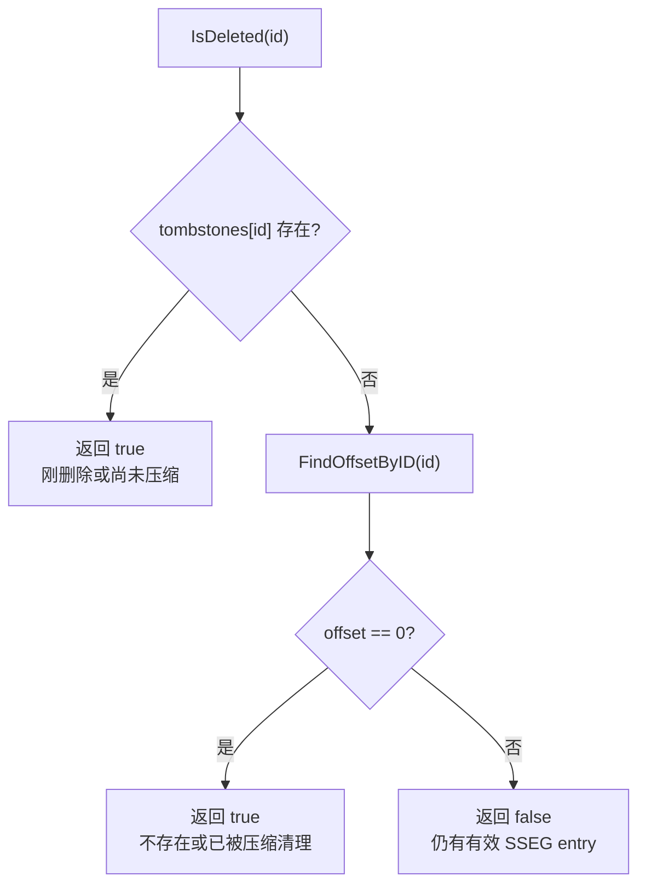

**案例**: ID=27 刚被删除但尚未压缩时，`tombstones[27]` 命中；下一次压缩后 tombstone 和 insert entry 都被跳过，
`FindOffsetByID(27)` 返回 0。对于 `IsDeleted(9999)` 这种从未分配过的 ID，也会返回 0，查询层无需区分这两种来源。

### 8.4 两层查找序列图

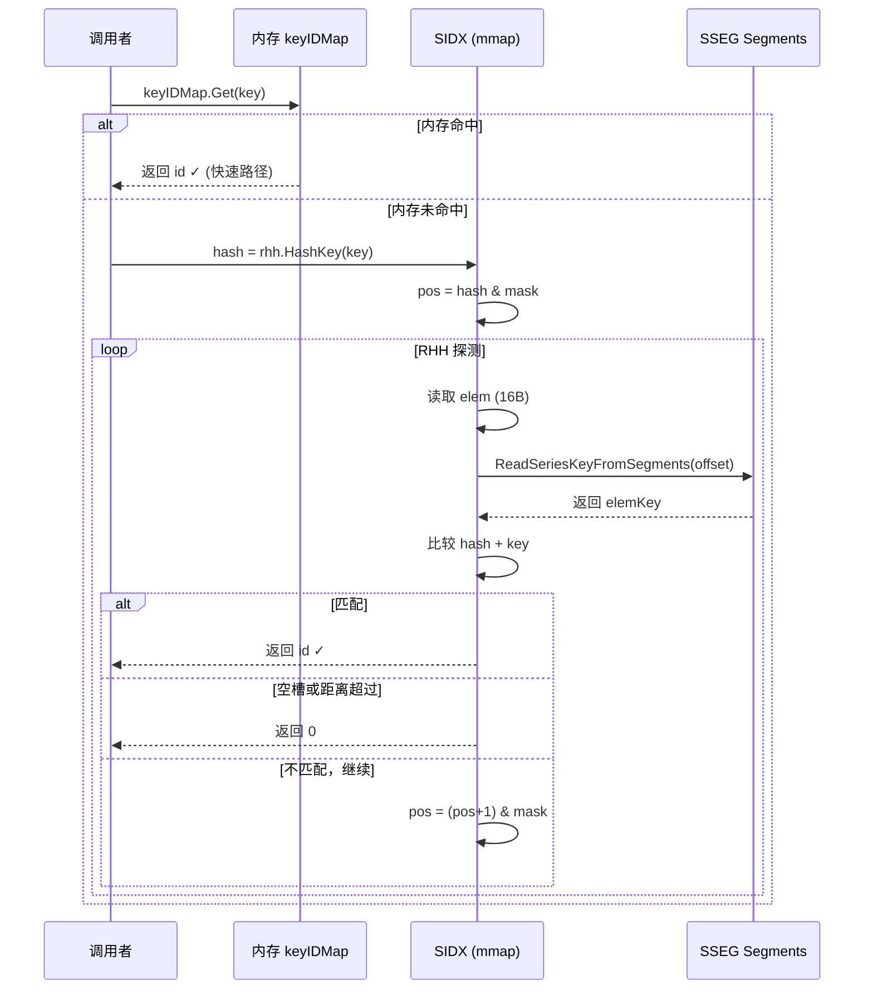

## 9. SeriesPartition.CreateSeriesListIfNotExists — 批量创建

### 9.1 两阶段设计

```go
// tsdb/series_partition.go:199 — CreateSeriesListIfNotExists
func (p *SeriesPartition) CreateSeriesListIfNotExists(keys [][]byte, keyPartitionIDs []int, ids []uint64) error {
    var writeRequired bool

    // 阶段 1: 读锁快速路径
    p.mu.RLock()
    if p.closed {
        p.mu.RUnlock()
        return ErrSeriesPartitionClosed
    }
    for i := range keys {
        if keyPartitionIDs[i] != p.id {
            continue
        }
        id := p.index.FindIDBySeriesKey(p.segments, keys[i])
        if id == 0 {
            writeRequired = true
            continue
        }
        ids[i] = id
    }
    p.mu.RUnlock()

    // Exit if all series for this partition already exist.
    if !writeRequired {
        return nil
    }

    type keyRange struct {
        id     uint64
        offset int64
    }
    newKeyRanges := make([]keyRange, 0, len(keys))

    // 阶段 2: 写锁 — 创建新 series
    p.mu.Lock()
    defer p.mu.Unlock()

    if p.closed {
        return ErrSeriesPartitionClosed
    }

    // Track offsets of duplicate series.
    newIDs := make(map[string]uint64, len(ids))

    for i := range keys {
        if keyPartitionIDs[i] != p.id || ids[i] != 0 {
            continue
        }

        // Re-attempt lookup under write lock.
        key := keys[i]
        if ids[i] = newIDs[string(key)]; ids[i] != 0 {
            continue
        } else if ids[i] = p.index.FindIDBySeriesKey(p.segments, key); ids[i] != 0 {
            continue
        }

        // Write to series log and save offset.
        id, offset, err := p.insert(key)
        if err != nil {
            return err
        }
        ids[i] = id
        newIDs[string(key)] = id
        newKeyRanges = append(newKeyRanges, keyRange{id, offset})
    }

    // Flush active segment writes so we can access data in mmap.
    if segment := p.activeSegment(); segment != nil {
        if err := segment.Flush(); err != nil {
            return err
        }
    }

    // Add keys to hash map(s).
    for _, keyRange := range newKeyRanges {
        p.index.Insert(p.seriesKeyByOffset(keyRange.offset), keyRange.id, keyRange.offset)
    }

    // Check if we've crossed the compaction threshold.
    if p.compactionsEnabled() && !p.compacting &&
        p.CompactThreshold != 0 && p.index.InMemCount() >= uint64(p.CompactThreshold) &&
        p.compactionLimiter.TryTake() {
        p.compacting = true
        log, logEnd := logger.NewOperation(p.Logger, "Series partition compaction", "series_partition_compaction", zap.String("path", p.path))

        p.wg.Add(1)
        go func() {
            defer p.wg.Done()
            defer p.compactionLimiter.Release()

            compactor := NewSeriesPartitionCompactor()
            compactor.cancel = p.closing
            if err := compactor.Compact(p); err != nil {
                log.Error("series partition compaction failed", zap.Error(err))
            }

            logEnd()

            // Clear compaction flag.
            p.mu.Lock()
            p.compacting = false
            p.mu.Unlock()
        }()
    }

    return nil
}
```

### 9.2 阶段详解

**阶段 1（读锁）**: 并发安全的快速路径。8 个 goroutine 可以同时读取。跳过不属于本分区的 key，查找已存在的 series ID。

**阶段 2（写锁）**: 独占访问。双重检查（可能其他 goroutine 已在阶段 1 和阶段 2 之间创建了相同的 series）。对新 key 调用 `insert()` 分配 ID 并写入 SSEG。写入完成后先执行 **SSEG segment flush**（`segment.Flush()`），确保随后能从 mmap 读到刚写入的 series key；然后通过 `seriesKeyByOffset(offset)` 取回 key，再调用 `p.index.Insert(...)` 插入内存 RHH 索引。

### 9.3 批量创建流程图

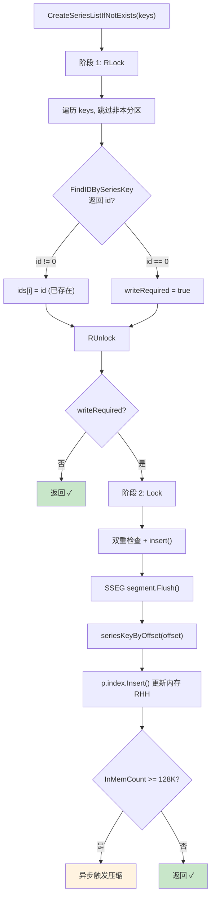

## 10. SeriesPartitionCompactor — 索引压缩

### 10.1 触发条件

```go
// tsdb/series_partition.go:26
const DefaultSeriesPartitionCompactThreshold = 1 << 17 // 128K
```

当内存中的 entry 数（`InMemCount()`）达到或超过 128K 时触发压缩。

**触发条件检查**（5 个条件全部满足）:
1. `compactionsEnabled()` — 压缩未被禁用
2. `!p.compacting` — 当前没有正在执行的压缩
3. `p.CompactThreshold != 0` — 阈值不为 0
4. `p.index.InMemCount() >= uint64(p.CompactThreshold)` — 内存 entry 数达到阈值
5. `p.compactionLimiter.TryTake()` — 获取压缩并发令牌

### 10.2 Compact 流程

```go
// tsdb/series_partition.go:528 — Compact
func (c *SeriesPartitionCompactor) Compact(p *SeriesPartition) error {
    // ① 快照（读锁）
    p.mu.RLock()
    segments := CloneSeriesSegments(p.segments)
    index := p.index.Clone()
    seriesN := p.index.Count()
    p.mu.RUnlock()

    // ② 构建新索引（无锁）
    indexPath := index.path + ".compacting"
    if err := c.compactIndexTo(index, seriesN, segments, indexPath); err != nil {
        return err
    }

    // ③ 交换（写锁）
    if err := func() error {
        p.mu.Lock()
        defer p.mu.Unlock()

        if err := p.index.Close(); err != nil {
            return err
        } else if err := os.Rename(indexPath, index.path); err != nil {
            return err
        } else if err := p.index.Open(); err != nil {
            return err
        }

        if err := p.index.Recover(p.segments); err != nil {
            return err
        }
        return nil
    }(); err != nil {
        return err
    }

    return nil
}
```

`SeriesIndex.Clone()` 并不会复制内存层 `keyIDMap`。源码只深拷贝 `tombstones` 和 `idOffsetMap`，并复用 mmap
出来的 `keyIDData` / `idOffsetData`。这是有意设计：压缩器不通过 `FindIDBySeriesKey()` 查新 series，而是直接扫描
SSEG entry；它只需要 `index.IsDeleted(id)` 判断某个 insert 是否应被过滤，而这个判断依赖 tombstones、`idOffsetMap`
和磁盘 `idOffsetData`，不依赖 `keyIDMap`。

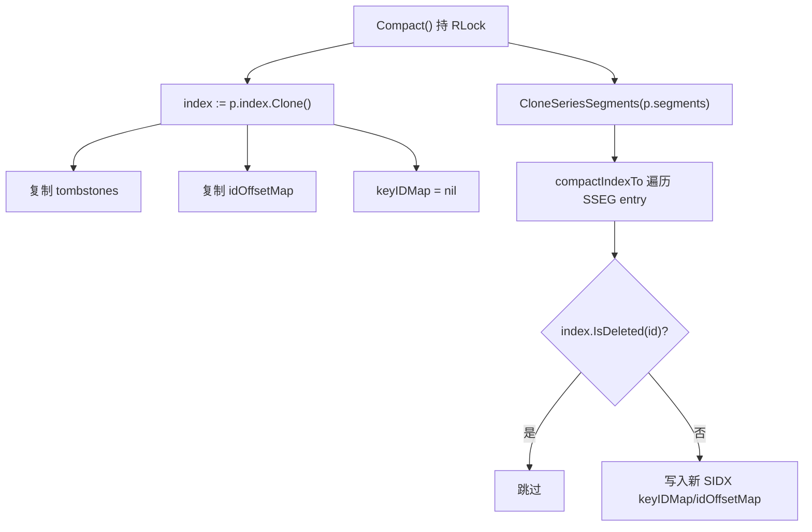

**案例**: 某个新 series 只存在于内存 `keyIDMap`，尚未进入旧 SIDX 文件。压缩时仍不会丢失它，因为 `compactIndexTo`
遍历的是 SSEG append-only 日志；只要该 insert entry 的 offset 不超过快照时的 `index.maxOffset`，就会被写入新 SIDX。

**三步流程**:
1. **快照**（读锁）: 克隆 segments 和 index，释放锁。快照后新写入的数据不会被包含在压缩中。
2. **构建**（无锁）: 遍历所有 SSEG entry，过滤 tombstone，构建新的 RHH 表，写入临时 SIDX 文件。
3. **交换**（写锁）: 关闭旧 index，rename 临时文件为最终文件，重新打开，调用 `Recover()` 补偿压缩期间新写入的 entry。

### 10.3 compactIndexTo — 构建新索引

```go
// tsdb/series_partition.go:568 — compactIndexTo
func (c *SeriesPartitionCompactor) compactIndexTo(index *SeriesIndex, seriesN uint64, segments []*SeriesSegment, path string) error {
    hdr := NewSeriesIndexHeader()
    var keyIDMap, idOffsetMap []byte
    hdr.Count = math.MaxUint64  // 临时哨兵，真正 Count 在重建后回填

    // seriesN 可能包含 tombstone。重建时重新统计未删除 seriesCount；
    // 如果 tombstone 过滤后数量变小，就用更小的容量再重建一轮。
    seriesCount := seriesN
    for {
        seriesN = seriesCount
        seriesCount = 0
        hdr.Capacity = pow2((int64(seriesN) * 100) / SeriesIndexLoadFactor)

        keyIDMap = make([]byte, hdr.Capacity*SeriesIndexElemSize)
        idOffsetMap = make([]byte, hdr.Capacity*SeriesIndexElemSize)

        // Reindex all partitions.
        var entryN int
        for _, segment := range segments {
            if err := segment.ForEachEntry(func(flag uint8, id uint64, offset int64, key []byte) error {
                if offset > index.maxOffset {
                    return errDone
                }

                if entryN++; entryN%1000 == 0 {
                    select {
                    case <-c.cancel:
                        return ErrSeriesPartitionCompactionCancelled
                    default:
                    }
                }

                switch flag {
                case SeriesEntryInsertFlag:
                case SeriesEntryTombstoneFlag:
                    return nil
                default:
                    return fmt.Errorf("unexpected series partition log entry flag: %d", flag)
                }

                hdr.MaxSeriesID, hdr.MaxOffset = id, offset

                if index.IsDeleted(id) {
                    return nil  // tombstone 过滤掉的 series 不计入 seriesCount
                }
                seriesCount++

                c.insertIDOffsetMap(idOffsetMap, hdr.Capacity, id, offset)
                return c.insertKeyIDMap(keyIDMap, hdr.Capacity, segments, key, offset, id)
            }); err == errDone {
                break
            } else if err != nil {
                return err
            }
        }

        hdr.Count = seriesCount
        if seriesN == seriesCount {
            break
        }
    }

    // Write header + maps to file...
}
```

**关键点**:
- 只处理 `offset <= index.maxOffset` 的 entry（快照时刻之前的数据）
- `hdr.Count` 初始写成 `math.MaxUint64` 作为临时哨兵，重建完成后回填真实 `seriesCount`
- 跳过 tombstone entry；`index.IsDeleted(id)` 会过滤已删除 series，并且这些 series 不计入 `seriesCount`
- 如果 tombstone 过滤导致 `seriesCount` 小于传入的 `seriesN`，容量会变小，循环会再重建一轮，直到 `seriesN == seriesCount`
- 每 1000 个 entry 检查一次取消信号

### 10.4 磁盘 RHH 插入

```go
// tsdb/series_partition.go:658 — insertKeyIDMap
func (c *SeriesPartitionCompactor) insertKeyIDMap(dst []byte, capacity int64, segments []*SeriesSegment, key []byte, offset int64, id uint64) error {
    mask := capacity - 1
    hash := rhh.HashKey(key)

    for i, dist, pos := int64(0), int64(0), hash&mask; ; i, dist, pos = i+1, dist+1, (pos+1)&mask {
        assert(i <= capacity, "key/id map full")
        elem := dst[(pos * SeriesIndexElemSize):]

        elemOffset := int64(binary.BigEndian.Uint64(elem[:8]))
        elemID := binary.BigEndian.Uint64(elem[8:])
        if elemOffset == 0 || elemOffset == offset {
            binary.BigEndian.PutUint64(elem[:8], uint64(offset))
            binary.BigEndian.PutUint64(elem[8:], id)
            return nil
        }

        elemKey := ReadSeriesKeyFromSegments(segments, elemOffset+SeriesEntryHeaderSize)
        elemHash := rhh.HashKey(elemKey)

        if d := rhh.Dist(elemHash, pos, capacity); d < dist {
            binary.BigEndian.PutUint64(elem[:8], uint64(offset))
            binary.BigEndian.PutUint64(elem[8:], id)
            offset, id = elemOffset, elemID
            dist = d
        }
    }
}
```

这是 Robin Hood Hashing 的磁盘版本——直接操作 `[]byte` 切片而非内存结构体。算法逻辑与 `rhh.HashMap.insert` 完全一致。

### 10.5 压缩流程图

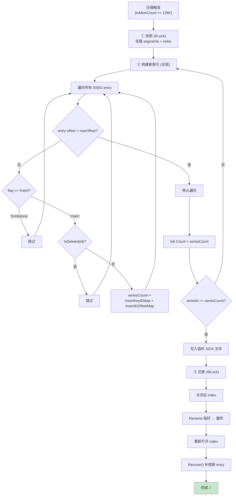

### 10.6 compactIndexTo 两轮重建：tombstone 导致的容量收缩

§10.3 提到"如果 tombstone 过滤导致 seriesCount 小于 seriesN，会再重建一轮"。这一节
把这个两轮重建的循环语义单独拆开看。源码 `tsdb/series_partition.go:589-664` 的核心是
一个 `for { ... if seriesN == seriesCount { break } }` 重试循环：

```go
// tsdb/series_partition.go:589 — compactIndexTo (节选两轮重建循环)
func (c *SeriesPartitionCompactor) compactIndexTo(index *SeriesIndex, seriesN uint64, segments []*SeriesSegment, path string) (err error) {
    hdr := NewSeriesIndexHeader()
    var keyIDMap, idOffsetMap []byte
    hdr.Count = math.MaxUint64   // 临时哨兵, 重建后回填

    // 初始 seriesCount = 传入的 seriesN (可能含 tombstone)
    seriesCount := seriesN
    for {                        // ← 两轮重建循环
        seriesN = seriesCount     // 本轮按上一轮的 seriesCount 估算容量
        seriesCount = 0           // 重置, 重新统计真正未删除的数量

        // 用 seriesN 估算 RHH 表容量 (2 的幂)
        hdr.Capacity = pow2((int64(seriesN) * 100) / SeriesIndexLoadFactor)
        keyIDMap = make([]byte, hdr.Capacity*SeriesIndexElemSize)
        idOffsetMap = make([]byte, hdr.Capacity*SeriesIndexElemSize)

        // 遍历 SSEG, 过滤 tombstone, 重新统计 seriesCount
        for _, segment := range segments {
            if err := segment.ForEachEntry(func(flag uint8, id uint64, offset int64, key []byte) error {
                // ... offset > maxOffset 检查, cancellation 检查 ...
                if index.IsDeleted(id) {
                    return nil    // tombstone 过滤, 不计入 seriesCount
                }
                seriesCount++
                c.insertIDOffsetMap(idOffsetMap, hdr.Capacity, id, offset)
                return c.insertKeyIDMap(keyIDMap, hdr.Capacity, segments, key, offset, id)
            }); err != nil { /* ... */ }
        }

        hdr.Count = seriesCount
        if seriesN == seriesCount {
            break                  // 估算值 == 实际值, 完成
        }
        // 否则: 上一轮 seriesN (含 tombstone) > 本轮 seriesCount (已过滤)
        //       → 下一轮用更小的 seriesN 重新分配更小的 map, 再扫一遍
    }
    // ... 写 header + maps 到文件 ...
}
```

循环不变量与终止条件：
- **每轮开始**：`seriesN` = 上一轮统计的 `seriesCount`（首轮 = 入参，含 tombstone）。
- **本轮估算**：`hdr.Capacity = pow2(seriesN * 100 / 90)`，按 `seriesN` 分配 `keyIDMap`/`idOffsetMap`。
- **本轮统计**：遍历 SSEG，`index.IsDeleted(id)` 过滤掉 tombstone series，只对存活的 series 做 `seriesCount++`。
- **终止判定**：`seriesN == seriesCount`。如果入参 `seriesN` 已经等于存活数（没有 tombstone 或 tombstone 已清理），首轮就 `break`；如果有 tombstone，首轮 `seriesN > seriesCount`，第二轮用更小的 `seriesN` 重建。

**最多两轮**：第二轮开始时 `seriesN = 上一轮 seriesCount`（已是存活数），第二轮统计的
`seriesCount` 必然等于 `seriesN`（同一批 SSEG entry、同一批 tombstone），所以第二轮一定 `break`。
源码注释 "This only loops if there are deleted entries, which shrinks the size" 准确描述了这个性质。

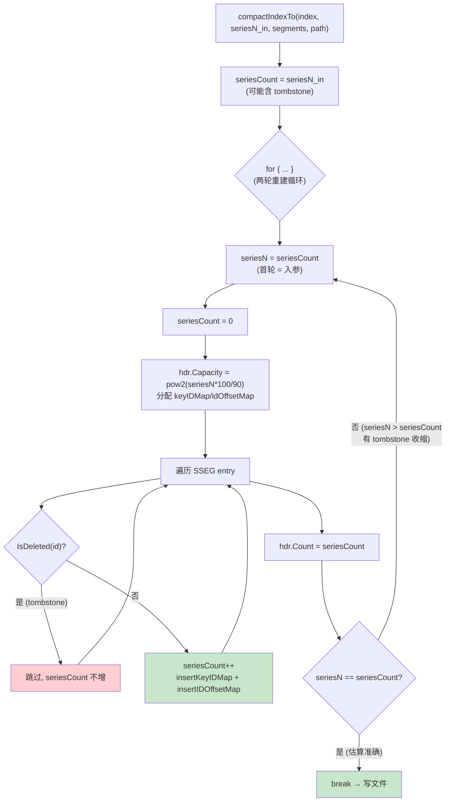

**case 说明 (首轮容量过大 → 第二轮收缩)**:

假设某个 SeriesPartition 当前状态：SIDX 记录 `seriesN = 1000`（其中 100 个已被 tombstone
标记但尚未在 SIDX 中清理），`SeriesIndexLoadFactor = 90`。

```
入参: seriesN = 1000 (来自 p.index.Count(), 含 100 个 tombstone)

═══ 第一轮 ═══
  seriesN = seriesCount_入参 = 1000
  seriesCount = 0
  hdr.Capacity = pow2((1000 * 100) / 90) = pow2(1111) = 2048
  keyIDMap = make([]byte, 2048 * 16) = 32768 字节
  idOffsetMap = make([]byte, 2048 * 16) = 32768 字节

  遍历 SSEG (假设 1000 个 insert entry, 其中 100 个 id 在 index.tombstones 中):
    900 个存活 → seriesCount = 900
    插入 900 个 entry 到 keyIDMap/idOffsetMap (capacity=2048, 负载 900/2048 ≈ 44%)

  hdr.Count = 900
  seriesN(1000) == seriesCount(900)? 否 → continue

═══ 第二轮 ═══
  seriesN = seriesCount_上一轮 = 900   ← 用收缩后的值重新估容量
  seriesCount = 0
  hdr.Capacity = pow2((900 * 100) / 90) = pow2(1000) = 1024
  keyIDMap = make([]byte, 1024 * 16) = 16384 字节  (比首轮少 16KB)
  idOffsetMap = make([]byte, 1024 * 16) = 16384 字节

  再次遍历 SSEG (同样的 entry, 同样的 tombstone):
    900 个存活 → seriesCount = 900
    插入 900 个 entry (capacity=1024, 负载 900/1024 ≈ 88%, 接近 90% 负载因子上限)

  hdr.Count = 900
  seriesN(900) == seriesCount(900)? 是 → break

═══ 结果 ═══
  最终 SIDX: capacity=1024 (而非首轮的 2048), count=900
  磁盘占用: header(69B) + 2*1024*16 = 32837 字节 (比首轮省 32768 字节)
  RHH 负载因子: 900/1024 ≈ 88%, 在 90% 阈值内, 探测距离受控

═══ 对比: 没有 tombstone 的场景 ═══
  入参 seriesN = 900 (全部存活)
  第一轮: seriesN=900, Capacity=pow2(1000)=1024, seriesCount=900
  seriesN(900) == seriesCount(900)? 是 → 首轮即 break
  → 无 tombstone 时只扫一遍 SSEG, 无额外开销
```

关键设计点：
- **为什么不在入参就过滤 tombstone？** `seriesN` 来自 `p.index.Count()`（`series_partition.go:552`），它统计的是 SIDX 已知的 series 总数，**包含**已被 tombstone 但尚未在 SIDX 物理清理的 series。压缩器在 `RLock` 快照后释放锁，无法在快照阶段做 O(n) 过滤（会延长锁持有时间），所以把过滤推迟到重建循环里。
- **为什么敢重扫 SSEG？** SSEG 是 append-only，快照后 `index.maxOffset` 固定，两轮扫描看到的 entry 集合完全一致，所以第二轮 `seriesCount` 必然等于第一轮的值，循环必然终止。
- **为什么最多两轮？** 第二轮的 `seriesN` 已经是存活数（无 tombstone 噪声），第二轮统计必然与之相等。源码没有写硬性循环上限，但数学上保证两轮内终止。

### 11.1 算法

```go
// tsdb/series_index.go:110 — Recover
func (idx *SeriesIndex) Recover(segments []*SeriesSegment) error {
    // Allocate new in-memory maps.
    idx.keyIDMap = rhh.NewHashMap(rhh.DefaultOptions)
    idx.idOffsetMap = make(map[uint64]int64)
    idx.tombstones = make(map[uint64]struct{})

    // Process all entries since the maximum offset in the on-disk index.
    minSegmentID, _ := SplitSeriesOffset(idx.maxOffset)
    for _, segment := range segments {
        if segment.ID() < minSegmentID {
            continue
        }

        if err := segment.ForEachEntry(func(flag uint8, id uint64, offset int64, key []byte) error {
            if offset <= idx.maxOffset {
                return nil
            }
            idx.execEntry(flag, id, offset, key)
            return nil
        }); err != nil {
            return err
        }
    }
    return nil
}
```

**关键设计**: SSEG 是 append-only 的，SIDX 记录了 `maxOffset`。所有 `offset > maxOffset` 的 entry 就是上次压缩/崩溃后新写入的 entry。只需重放这些 entry 即可恢复内存索引。

### 11.2 execEntry — 处理单个 entry

```go
// tsdb/series_index.go:164 — execEntry
func (idx *SeriesIndex) execEntry(flag uint8, id uint64, offset int64, key []byte) {
    switch flag {
    case SeriesEntryInsertFlag:
        idx.keyIDMap.Put(key, id)
        idx.idOffsetMap[id] = offset

        if id > idx.maxSeriesID {
            idx.maxSeriesID = id
        }
        if offset > idx.maxOffset {
            idx.maxOffset = offset
        }

    case SeriesEntryTombstoneFlag:
        idx.tombstones[id] = struct{}{}

    default:
        panic("unreachable")
    }
}
```

### 11.3 崩溃恢复流程图

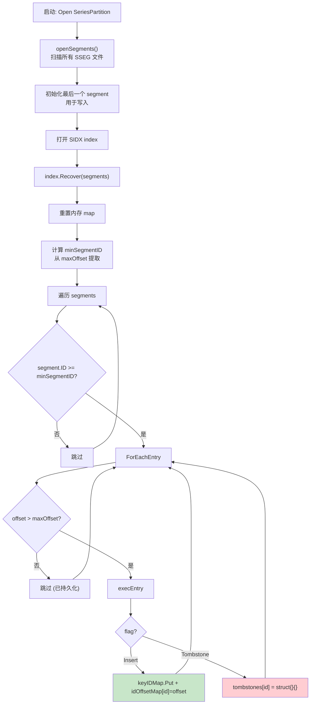

### 11.4 案例：崩溃恢复

> **场景**: 某个 SeriesPartition 有以下数据：
>
> - SIDX 持久化了 1000 个 series，maxOffset = 0x000300001000
> - 之后又写入了 5 个新 series（offset 分别为 0x000300001050, 0x0003000010A0, 0x0003000010F0, 0x000300001140, 0x000300001190）
> - 第 3 个新 series 后系统崩溃
>
> **恢复过程**:
> 1. `Recover()` 从 SIDX 读取 maxOffset = 0x000300001000
> 2. 从 minSegmentID (segment 3) 开始遍历
> 3. 前 1000 个 entry 的 offset <= maxOffset，跳过
> 4. 第 1001-1003 个 entry（offset > maxOffset）被 execEntry 处理：
>    - Insert entry → 加入 keyIDMap + idOffsetMap
> 5. 第 1004-1005 个 entry 不存在（崩溃前未写入）
> 6. 内存索引恢复完成，包含 1003 个 series

## 12. Tombstone 删除机制

### 12.1 DeleteSeriesID

```go
// tsdb/series_partition.go — DeleteSeriesID
func (p *SeriesPartition) DeleteSeriesID(id uint64, flush bool) error {
    p.mu.Lock()
    defer p.mu.Unlock()

    if p.closed {
        return ErrSeriesPartitionClosed
    }

    // Already tombstoned, ignore.
    if p.index.IsDeleted(id) {
        return nil
    }

    // Write tombstone entry.
    _, err := p.writeLogEntry(AppendSeriesEntry(nil, SeriesEntryTombstoneFlag, id, nil))
    if err != nil {
        return err
    }

    // Flush active segment write only when caller requests it.
    if flush {
        segment := p.activeSegment()
        if segment != nil {
            if err := segment.Flush(); err != nil {
                return err
            }
        }
    }

    // Mark tombstone in memory.
    p.index.Delete(id)

    return nil
}
```

**关键点**:
- Tombstone entry 只有 9 字节：1B flag (0x02) + 8B ID，没有 key
- 写入 SSEG 后立即 flush，然后在内存中标记
- `Delete` 调用 `execEntry(SeriesEntryTombstoneFlag, ...)` 将 ID 加入 `tombstones` map

### 12.2 删除 → 压缩清理流程图

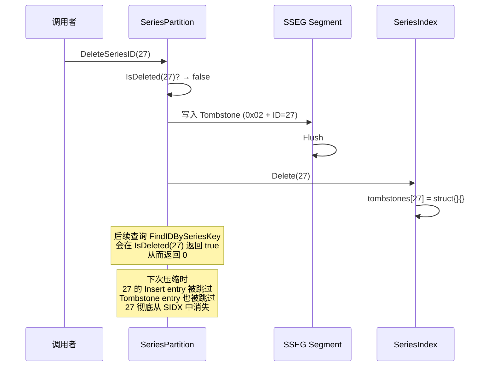

## 13. 具体案例 — 完整 Series 生命周期

### 13.1 场景：写入 `cpu,host=web value=3.14`

**Step 1: 写入请求到达**

```
WritePoints(points, tracker)
  → Shard.validateSeriesAndFields(points)
    → Engine.CreateSeriesListIfNotExists(keys, names, tags)
      → SeriesFile.CreateSeriesListIfNotExists(names, tagsSlice)
```

**Step 2: 路由到分区**

```go
key := AppendSeriesKey(nil, []byte("cpu"), models.Tags{{Key: []byte("host"), Value: []byte("web")}})
// 假设 xxhash.Sum64(key) % 8 = 3
partitionID := 3
```

**Step 3: Phase 1 — 读锁检查**

```go
p.mu.RLock()
id := p.index.FindIDBySeriesKey(p.segments, key)
// 第一次写入，id == 0
p.mu.RUnlock()
// writeRequired = true
```

**Step 4: Phase 2 — 写锁创建**

```go
p.mu.Lock()
// 双重检查：id == 0
id, offset, err := p.insert(key)
// id = p.seq = 4 (Partition 3, seq 从 4 开始)
// p.seq += 8 → p.seq = 12
// 写入 SSEG: [0x01][0x0000000000000004][key bytes...]
ids[i] = 4
```

**Step 5: 更新内存索引**

```go
segment.Flush()
p.index.Insert(key, 4, offset)
// keyIDMap.Put(key, 4)
// idOffsetMap[4] = offset
```

**Step 6: 查询**

```go
// SELECT value FROM cpu WHERE host='web'
// TSI Index 查找 → SeriesID = 4
// SeriesFile.SeriesKey(4) → "cpu,host=web"
// TSM 读取路径通过 tsm1.SeriesFieldKeyBytes(seriesKey, field) 生成 composite key
// FileStore.KeyCursor(ctx, tsm1.SeriesFieldKeyBytes(seriesKey, []byte("value")), ...)
```

**Step 7: 后续更多 series → 压缩**

```
// 假设经过一段时间，内存 entry 达到 128K
InMemCount() >= 128K → 触发压缩

① 快照: 克隆 segments 和 index
② 构建: 遍历所有 SSEG entry，过滤 tombstone，构建新 RHH
③ 交换: 关闭旧 index，rename 新 SIDX，Recover() 补偿
```

**Step 8: 删除**

```go
DeleteSeriesID(4, flush)
// 写入 SSEG: [0x02][0x0000000000000004] (9 字节)
// tombstones[4] = struct{}{}
// 后续 FindIDBySeriesKey → IsDeleted(4) → true → 返回 0
```

**Step 9: 下次压缩清理**

```
// 压缩时：
// Entry: Insert ID=4 → IsDeleted(4) → true → 跳过
// Entry: Tombstone ID=4 → flag==Tombstone → 跳过
// ID=4 彻底从新 SIDX 中消失
```

### 13.2 生命周期图

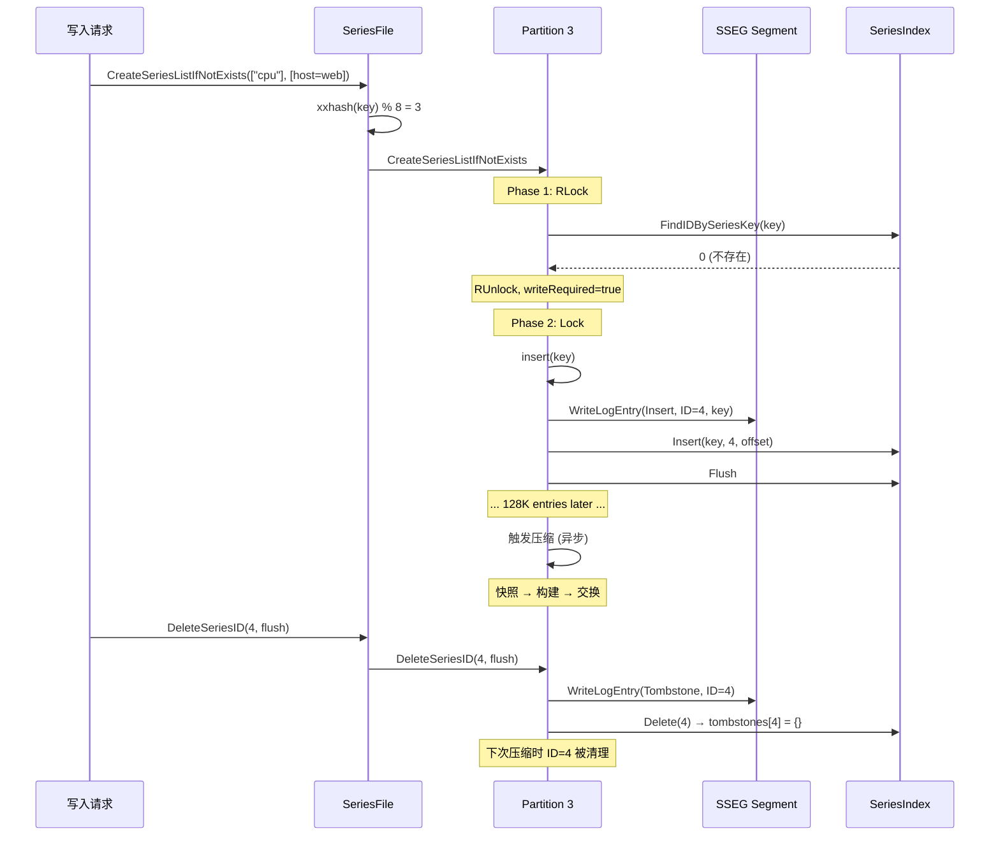

## 14. 架构设计意图

### 14.1 为什么 8 分区

- **并发**: 8 个分区可以同时处理不同的 series 创建请求，每个分区有独立的 `sync.RWMutex`
- **锁粒度**: 避免全局锁成为瓶颈。在高写入场景下，series 会被均匀分散到 8 个分区
- **压缩隔离**: 一个分区的压缩不会阻塞其他分区的读写

### 14.2 为什么交错 ID

- **分区无关查找**: 给定 series ID，通过 `(id-1) % 8` 即可确定分区，无需额外的映射表
- **无冲突分配**: 每个分区的 seq 步长为 8，天然避免 ID 冲突
- **均匀分布**: ID 在 8 个分区间均匀分布，避免热点

### 14.3 为什么 SSEG + SIDX 两层

- **SSEG（写优化日志）**: append-only 写入，无需随机 I/O，写入性能极佳
- **SIDX（读优化索引）**: RHH 表支持 O(1) 查找，mmap 映射避免显式 I/O
- **分离关注点**: 写入路径只追加 SSEG，查询路径优先查内存再查 SIDX

### 14.4 为什么 Robin Hood Hashing

- **低方差查找**: 所有元素的探测距离趋于均匀，最坏情况好于普通哈希
- **高负载因子**: 90% 负载因子下仍保持良好性能，空间利用率高
- **确定性布局**: 相同输入总是产生相同的哈希表布局，有利于调试和 mmap

### 14.5 为什么 mmap SIDX

- **零拷贝**: 查询时直接读取 mmap 内存，无需显式 read() 系统调用
- **OS 页面缓存**: 热数据自动驻留内存，冷数据自动换出
- **简化代码**: 无需手动管理缓存，操作系统自动处理

### 14.6 为什么 90% 负载因子

- **空间效率**: 每 16 字节元素只浪费约 1.8 字节（10% 空槽）
- **探测距离**: 90% 负载因子下仍依赖 Robin Hood hashing 控制探测距离；具体距离应以 benchmark 为准
- **权衡**: 更高的负载因子（如 95%）会显著增加探测距离，更低的（如 75%）会浪费空间

### 14.7 为什么 128K 压缩阈值

- **内存平衡**: 128K 个 entry 在内存中约占 128K * 16B = 2MB（idOffsetMap）+ keyIDMap 开销
- **压缩频率**: 不会太频繁（每次压缩有 I/O 开销），也不会太久（内存占用过高）
- **经验值**: 128K 是在内存使用和压缩开销之间的经验值

## 15. 架构收益

| 维度 | 收益 |
|------|------|
| **写入性能** | SSEG append-only + 内存 RHH，新 series 注册只需一次顺序写 |
| **查询性能** | 两层查找：内存 O(1) 快速路径 + SIDX mmap O(1) 慢速路径 |
| **并发安全** | 8 分区独立锁，并发创建 series 互不阻塞 |
| **崩溃恢复** | SSEG append-only + maxOffset 机制，重启后只需重放少量 entry |
| **空间效率** | 90% 负载因子 RHH，交错 ID 无浪费 |
| **压缩效率** | 异步压缩，快照+交换，最小化锁持有时间 |
| **删除效率** | Tombstone 标记 O(1)，压缩时批量清理 |

## 16. 潜在隐患与瓶颈

### 16.1 SSEG 文件的虚拟内存压力

SSEG 文件使用 mmap 映射，每个 segment 的映射大小为 `SeriesSegmentSize(id)`（4MB-256MB）。即使文件只写了一小部分，整个大小都会被映射到虚拟地址空间。在 32 位系统上可能导致虚拟地址空间不足。

### 16.2 压缩期间的写锁持有

`Compact()` 的第三步（交换）需要持有写锁。虽然时间很短（close + rename + open + recover），但在高并发写入场景下，这可能导致短暂的写入延迟尖峰。

### 16.3 Robin Hood 探测距离增长

在 90% 负载因子下，如果哈希分布不均匀，某些 key 的探测距离可能很长。虽然 Robin Hood 保证了距离的均匀性，但平均距离仍然随负载因子增长。

### 16.4 SSEG 无压缩

SSEG 中的 entry 是原始字节，没有压缩。对于大量相似的 series key（如 `cpu,host=web001`, `cpu,host=web002`, ...），存在大量重复的前缀数据。

### 16.5 Tombstone 累积

删除操作只写入 9 字节的 tombstone entry，但被删除 series 的 Insert entry 仍然占据空间。只有在压缩时才会清理。如果删除速率很高，SSEG 文件会快速膨胀。

### 16.6 Phase 2 的 O(n) 查找

`CreateSeriesListIfNotExists` 的 Phase 2 中，对每个新 key 都调用 `FindIDBySeriesKey`（O(1) 平均）。但 `newIDs` map 使用 string key（需要分配字符串），在高基数场景下可能增加 GC 压力。

### 16.7 SIDX Header 固定字段大小

SIDX header 使用 8 字节字段存储 count 和 capacity。对于超大部署（数十亿 series），这些字段不会溢出（uint64 最大 1.8e19），但 RHH 表的 capacity 如果接近 2^63，`pow2()` 函数会 panic。

## 17. 关键文件索引

| 文件 | 行数 | 职责 |
|------|------|------|
| `tsdb/series_file.go` | 588 | SeriesFile 顶层入口，8 分区管理，key 编码 |
| `tsdb/series_partition.go` | 775 | SeriesPartition，批量创建，压缩器 |
| `tsdb/series_segment.go` | 472 | SSEG segment 文件格式，mmap，读写 entry |
| `tsdb/series_index.go` | 373 | SeriesIndex 两层查找，SIDX header，Recover |
| `pkg/rhh/rhh.go` | 286 | Robin Hood Hashing 算法实现 |
