# Module 15: Ring + Cache 并发模型 (16 分区哈希环 + 双重检查锁 + Snapshot 双缓冲) - 深度审计报告

> **小白导读**: 想象一个有 16 个收银台的超市。
>
> - **Ring（哈希环）** = 收银台分配系统。每个顾客（数据点）根据会员卡号（series key 的哈希值）被分配到固定的收银台。这样同一个顾客总是去同一个收银台，不会混乱。
>
> - **Cache（缓存）** = 超市的临时货架。所有新到的商品先放在货架上，攒够一波再统一入库（写入 TSM 文件）。
>
> - **Snapshot（快照）** = 货架轮换。当货架满了，把它"拍照"冻结起来（交给仓库管理员去入库），同时换一个空货架继续接新货。
>
> - **分区锁** = 每个收银台有独立的排队线。不同收银台可以同时工作，互不干扰。
>
> **关键设计**：
> - 16 个分区可以**并发写入**，不需要全局锁
> - 已存在的 key 走**快速路径**（读锁），新 key 走**慢速路径**（写锁 + 双重检查）
> - Snapshot 是 **O(1) 指针交换**，不是数据复制
> - Cache **没有驱逐机制**——满了直接拒绝写入

## 1. 全局架构

### 1.1 Ring + Cache 数据结构关系

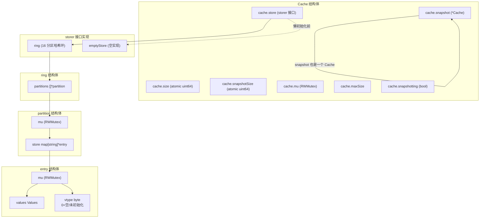

### 1.2 写入全链路总览

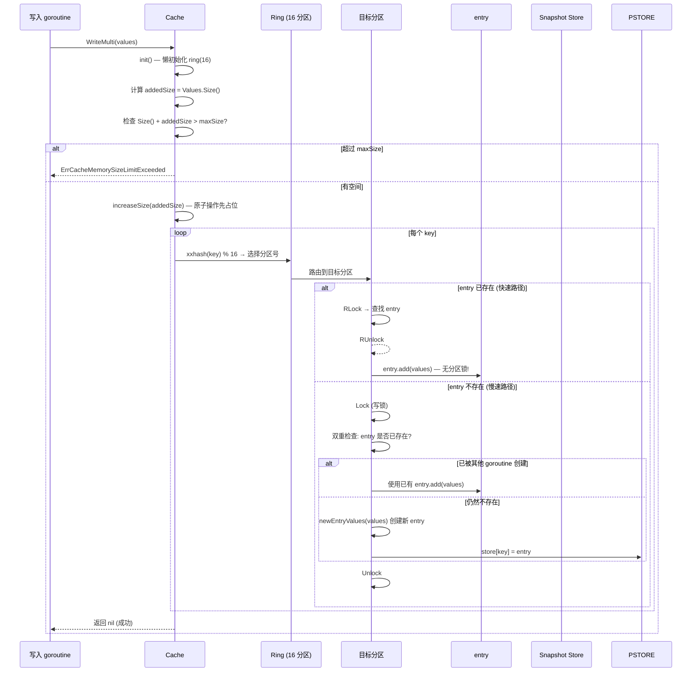

## 2. Ring — 16 分区哈希环

### 2.1 ring 结构体

```go
// tsdb/engine/tsm1/ring.go:32 — ring
type ring struct {
    partitions []*partition  // len = n；Cache 默认传入 ringShards=16
}
```

当前 `ring` 不再维护 `keysHint`。`keys()` 通过遍历分区收集 key，不依赖全局近似计数预分配。

### 2.2 newring — 创建哈希环

```go
// tsdb/engine/tsm1/ring.go:43 — newring
func newring(n int) (*ring, error) {
    // 校验: n 必须在 [1, 16] 范围内
    if n <= 0 || n > partitions {
        return nil, fmt.Errorf("invalid number of partitions: %d", n)
    }
    // 另行校验 2 的幂，当前源码会返回独立错误信息
    if n&(n-1) != 0 {
        return nil, fmt.Errorf("partitions %d is not a power of two", n)
    }

    r := ring{
        partitions: make([]*partition, n), // maximum number of partitions.
    }

    // 初始化每个分区
    for i := 0; i < len(r.partitions); i++ {
        r.partitions[i] = &partition{
            store: make(map[string]*entry),
        }
    }
    return &r, nil
}
```

> **注意**: `ring.go:16` 定义 `const partitions = 16`，这是**最大值**。
> 当前 `newring` 先校验范围，再校验 2 的幂；因此 `n=17` 返回 `invalid number of partitions: 17`，`n=3` 返回 `partitions 3 is not a power of two`。
> Cache 固定使用 16（`cache.go:22` 的 `const ringShards = 16`），满足该约束。

### 2.3 getPartition — xxhash 路由

```go
// tsdb/engine/tsm1/ring.go:86 — getPartition
func (r *ring) getPartition(key []byte) *partition {
    return r.partitions[int(xxhash.Sum64(key)%uint64(len(r.partitions)))]
}

func (r *ring) getPartitionStringKey(key string) *partition {
    return r.partitions[int(xxhash.Sum64String(key)%uint64(len(r.partitions)))]
}
```

**路由机制**: 使用 xxhash 对整个 series key 做哈希，取模分区数得到分区号。读路径常拿到 `[]byte`，走 `xxhash.Sum64`；
写路径在 `WriteMulti(map[string][]Value)` 中天然拿到 string key，走 `xxhash.Sum64String`，避免为了路由再做一次 `[]byte` 转换。

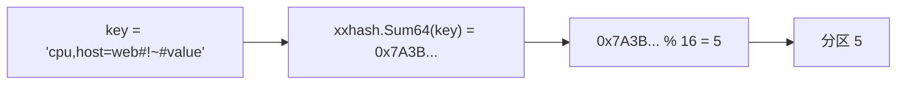

### 2.4 ring.write — 并发写入入口

```go
// tsdb/engine/tsm1/ring.go:99 — write
func (r *ring) write(key string, values Values) (bool, error) {
    return r.getPartitionStringKey(key).write(key, values)
}
```

路由到目标分区后，委托给 `partition.write`。

### 2.5 ring.apply — 并行遍历

```go
// tsdb/engine/tsm1/ring.go:145 — apply
func (r *ring) apply(f func([]byte, *entry) error) error {
    var (
        wg  sync.WaitGroup
        res = make(chan error, len(r.partitions))
    )
    for _, p := range r.partitions {
        wg.Add(1)
        go func(p *partition) {
            defer wg.Done()
            p.mu.RLock()
            for k, e := range p.store {
                if err := f([]byte(k), e); err != nil {
                    res <- err
                    p.mu.RUnlock()
                    return
                }
            }
            p.mu.RUnlock()
        }(p)
    }
    go func() {
        wg.Wait()
        close(res)
    }()
    for err := range res {
        if err != nil {
            return err
        }
    }
    return nil
}
```

### 2.6 ring.split — 分片用于并发 Snapshot 写入

```go
// tsdb/engine/tsm1/ring.go:196 — split
func (r *ring) split(n int) []storer {
    rings := make([]storer, n)
    for i := 0; i < n; i++ {
        rings[i], _ = newring(len(r.partitions))
    }
    // 轮询分配: partition i → ring i % n
    for i, p := range r.partitions {
        rings[i%n].(*ring).partitions[i] = p
    }
    return rings
}
```

**split 的用途**: `Cache.Split(concurrency)` 将 ring 分成 `concurrency` 个子 ring，每个子 ring 由一个 goroutine 独立写入 TSM 文件。用于 `WriteSnapshot()` 的自适应并发。

## 3. partition — 双重检查锁

### 3.1 partition 结构体

```go
// tsdb/engine/tsm1/ring.go:210 — partition
type partition struct {
    mu    sync.RWMutex
    store map[string]*entry
}
```

### 3.2 partition.write — 双重检查锁模式 (核心)

```go
// tsdb/engine/tsm1/ring.go:227 — partition.write
func (p *partition) write(key string, values Values) (bool, error) {
    // 阶段 1: 快速路径 (读锁)
    p.mu.RLock()
    e := p.store[key]
    p.mu.RUnlock()

    // 热路径: entry 已存在 → 直接追加 (无分区锁!)
    if e != nil {
        return false, e.add(values)
    }

    // 阶段 2: 慢速路径 (写锁)
    p.mu.Lock()
    defer p.mu.Unlock()

    // 双重检查: 可能其他 goroutine 已在阶段 1 和阶段 2 之间创建了 entry
    if e = p.store[key]; e != nil {
        return false, e.add(values)
    }

    // 创建新 entry
    e, err := newEntryValues(values)
    if err != nil {
        return false, err
    }
    p.store[key] = e
    return true, nil  // newKey = true
}
```

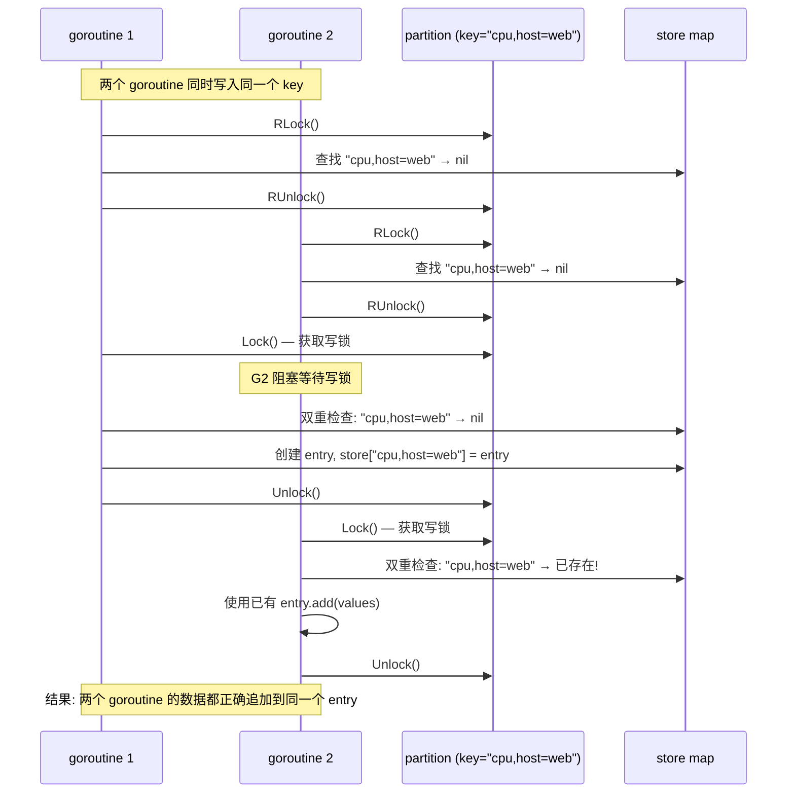

**为什么需要双重检查？** Go 的 `sync.RWMutex` 不支持锁升级（RLock → Lock）。必须先释放读锁再获取写锁，中间存在窗口期，其他写操作可能已经完成了相同的创建。

**快速路径 vs 慢速路径**:

| 路径 | 锁类型 | 操作 | 性能 |
|------|--------|------|------|
| 快速路径 (entry 已存在) | RLock → RUnlock | 查找 map + entry.add(values) | ~100ns |
| 慢速路径 (新 key) | Lock → Unlock | 创建 entry + 插入 map | ~500ns |
| 双重检查命中 | Lock → Unlock | 查找 map + entry.add(values) | ~200ns |

> **小白解释**: 双重检查锁就像去银行办业务：
> 1. 先在门口问一下（RLock）："我要办的业务已经办过了吗？"
> 2. 如果办过了，直接走人（快速返回）
> 3. 如果没办过，去取号排队（Lock）——但排队的时候可能别人已经帮你办了
> 4. 所以取号后还要再检查一次（双重检查）——如果已经办过了，就不用再办了

## 4. entry — 值存储

### 4.1 entry 结构体

```go
// tsdb/engine/tsm1/cache.go:36 — entry
type entry struct {
    mu     sync.RWMutex
    values Values  // 所有值的切片
    vtype  byte    // 值类型；0 表示空 entry/未初始化
}
```

**vtype 的两阶段语义**: `vtype == 0` 不是一个已经定型的值类型，而是空 entry/未初始化状态。空 entry 后续第一次写入非空 values 时，会在 `entry.mu` 写锁内设置 `vtype = valueType(values[0])`；从非空开始，它才可视为只读类型标签，后续写入只做同类型追加。

### 4.2 entry.add — 追加值

```go
// tsdb/engine/tsm1/cache.go:72 — entry.add
func (e *entry) add(values []Value) error {
    // 空值直接返回
    if len(values) == 0 {
        return nil
    }

    // 类型检查：非空 entry 的 vtype 才是只读类型标签
    if e.vtype != 0 {
        for _, v := range values {
            if e.vtype != valueType(v) {
                return tsdb.ErrFieldTypeConflict
            }
        }
    }

    e.mu.Lock()
    // 快速路径: entry 为空 → 直接赋值 (避免 append 开销)
    if len(e.values) == 0 {
        e.values = values
        e.vtype = valueType(values[0])
        e.mu.Unlock()
        return nil
    }

    // 慢速路径: 追加到已有值
    e.values = append(e.values, values...)
    e.mu.Unlock()
    return nil
}
```

**边界案例：空 values 写入后再写入**

1. `partition.write(key, nil)` 创建一个 entry，`newEntryValues(nil)` 得到 `values=[]`、`vtype=0`，它仍是“空/未初始化”。
2. 随后 `entry.add([FloatValue{...}])` 进入写锁分支，因为 `len(e.values)==0`，直接设置 `e.values = values` 且 `e.vtype = valueType(values[0])`。
3. 再往后这个 entry 才进入稳定状态：`vtype != 0`，类型标签只读，混入其他类型会返回 field type conflict。

### 4.3 entry 的其他方法

| 方法 | 锁 | 用途 |
|------|-----|------|
| `count()` | RLock | 返回 `len(e.values)` |
| `size()` | RLock | 返回 `e.values.Size()` (字节数) |
| `deduplicate()` | Lock | 排序 + 去重 (相同时间戳保留最后一个) |
| `filter(min, max)` | Lock | 排除 `[min, max]` 范围内的值 (用于 DELETE) |

## 5. Cache — 内存写缓冲

### 5.1 Cache 结构体

```go
// tsdb/engine/tsm1/cache.go:180 — Cache
type Cache struct {
    size         uint64      // 原子操作: live cache 大小 (必须是第一个字段, 32 位对齐)
    snapshotSize uint64      // 原子操作: snapshot 大小
    mu           sync.RWMutex
    store        storer      // live 数据存储 (ring 或 emptyStore)
    maxSize      uint64      // 内存限制
    snapshot     *Cache      // snapshot 缓存 (独立的 Cache 对象)
    snapshotting bool        // 防止并发 snapshot
    snapshotAttempts int     // snapshot 尝试次数
    stats        *CacheStatistics
    lastSnapshot  time.Time
    lastWriteTime time.Time
    initialize       atomic.Value  // *sync.Once — 懒初始化
    initializedCount uint32        // CAS 守卫: init/free 生命周期
}
```

**关键字段说明**:
- `size` 和 `snapshotSize` 必须是 Cache 的**前两个字段**——Go 的 `atomic` 操作要求 64 位值在 32 位平台上 8 字节对齐
- `store` 使用 `storer` 接口，支持懒初始化（先用 `emptyStore`，首次写入时替换为 `ring`）
- `snapshot` 是一个完整的 Cache 对象，但只使用其 `store` 和 `size` 字段

### 5.2 storer 接口

```go
// tsdb/engine/tsm1/cache.go:166 — storer
type storer interface {
    entry(key []byte) *entry
    write(key string, values Values) (bool, error)
    remove(key []byte)
    keys(sorted bool) [][]byte
    apply(f func([]byte, *entry) error) error
    applySerial(f func([]byte, *entry) error) error
    reset()
    split(n int) []storer
    count() int
}
```

**两个实现**:

| 实现 | 用途 | 并发安全 |
|------|------|---------|
| `ring` | 正常运行时的数据存储 | 是 (16 分区独立锁) |
| `emptyStore` | 懒初始化前的空实现 | 是 (所有操作都是 no-op) |

### 5.3 emptyStore — 懒初始化

```go
// tsdb/engine/tsm1/cache.go:821 — emptyStore
type emptyStore struct{}

func (e emptyStore) entry(key []byte) *entry                          { return nil }
func (e emptyStore) write(key string, values Values) (bool, error)    { return false, nil }
func (e emptyStore) remove(key []byte)                                {}
func (e emptyStore) keys(sorted bool) [][]byte                        { return nil }
func (e emptyStore) apply(f func([]byte, *entry) error) error         { return nil }
func (e emptyStore) applySerial(f func([]byte, *entry) error) error   { return nil }
func (e emptyStore) reset()                                           {}
func (e emptyStore) split(n int) []storer                             { return nil }
func (e emptyStore) count() int                                       { return 0 }
```

**为什么需要 emptyStore？** 避免在 Cache 创建时就分配 16 个分区的 map。如果 Cache 创建后从未被写入（如空 shard），就不会分配任何内存。

### 5.4 Cache.init() — 懒初始化

```go
// tsdb/engine/tsm1/cache.go:262 — init
func (c *Cache) init() {
    // CAS: 只有第一个 goroutine 能从 0 变为 1
    if !atomic.CompareAndSwapUint32(&c.initializedCount, 0, 1) {
        return  // 已初始化，直接返回
    }
    c.mu.Lock()
    c.store, _ = newring(ringShards)  // 创建 16 分区 ring
    c.mu.Unlock()
}
```

**CAS 守卫**: 每个 init/free 生命周期内，只有第一个调用 `init()` 的 goroutine 能赢得 CAS (0→1)。
`Free()` 会把 `initializedCount` 从 1 改回 0 并换回 `emptyStore`，之后下一次写入可以再次懒初始化。

**调用时机**: `init()` 在 `Write`、`WriteMulti`、`Snapshot`、`ClearSnapshot`、`DeleteRange` 的开头被调用。

### 5.5 Cache.WriteMulti — 批量写入

```go
// tsdb/engine/tsm1/cache.go:320 — WriteMulti
func (c *Cache) WriteMulti(values map[string][]Value) error {
    c.init()
    var addedSize uint64
    for _, v := range values {
        addedSize += uint64(Values(v).Size())
    }

    // Enough room in the cache?
    limit := c.maxSize // maxSize is safe for reading without a lock.
    n := c.Size() + addedSize
    if limit > 0 && n > limit {
        atomic.AddInt64(&c.stats.WriteErr, 1)
        return ErrCacheMemorySizeLimitExceeded(n, limit)
    }

    var werr error
    c.mu.RLock()
    store := c.store
    c.mu.RUnlock()

    // We'll optimistially set size here, and then decrement it for write errors.
    c.increaseSize(addedSize)
    for k, v := range values {
        newKey, err := store.write(k, v)
        if err != nil {
            // The write failed, hold onto the error and adjust the size delta.
            werr = err
            addedSize -= uint64(Values(v).Size())
            c.decreaseSize(uint64(Values(v).Size()))
        }
        if newKey {
            addedSize += uint64(len(k))
            c.increaseSize(uint64(len(k)))
        }
    }

    // Some points in the batch were dropped.  An error is returned so
    // error stat is incremented as well.
    if werr != nil {
        atomic.AddInt64(&c.stats.WriteDropped, 1)
        atomic.AddInt64(&c.stats.WriteErr, 1)
    }

    // Update the memory size stat
    c.updateMemSize(int64(addedSize))
    atomic.AddInt64(&c.stats.WriteOK, 1)

    c.mu.Lock()
    c.lastWriteTime = time.Now()
    c.mu.Unlock()

    return werr
}
```

**乐观 size 增加**: 先用原子操作增加 `size`，写入失败时再减少。这避免了在写入过程中持有全局锁来计算精确大小。

**Size() = size + snapshotSize**: `Size()` 返回 live cache 和 snapshot 的总大小。这意味着 snapshot 期间内存会短暂翻倍。

### 5.6 increaseSize / decreaseSize — 原子大小操作

```go
// tsdb/engine/tsm1/cache.go:477 — increaseSize
func (c *Cache) increaseSize(delta uint64) {
    atomic.AddUint64(&c.size, delta)
}

// tsdb/engine/tsm1/cache.go:482 — decreaseSize
func (c *Cache) decreaseSize(delta uint64) {
    // 位翻转技巧: 等价于原子减法
    // ^(delta - 1) = -delta (二进制补码)
    atomic.AddUint64(&c.size, ^(delta-1))
}
```

> **小白解释**: Go 的 `atomic` 包没有 `SubUint64` 函数。所以用位翻转技巧：
> `^(delta - 1)` 等价于 `-delta`（二进制补码表示）。
> 例如 delta=5: `^(5-1)` = `^4` = `0xFFFF...FFFB` = `-5` (在 uint64 中)

## 6. Snapshot — 双缓冲机制

### 6.1 Cache.Snapshot — O(1) 指针交换

```go
// tsdb/engine/tsm1/cache.go:376 — Snapshot
func (c *Cache) Snapshot() (*Cache, error) {
    c.init()

    c.mu.Lock()
    defer c.mu.Unlock()

    // 防止并发 snapshot
    if c.snapshotting {
        return nil, ErrSnapshotInProgress
    }
    c.snapshotting = true
    c.snapshotAttempts++

    // 懒创建 snapshot Cache
    if c.snapshot == nil {
        store, err := newring(ringShards)
        if err != nil {
            return nil, err
        }

        c.snapshot = &Cache{
            store: store,
        }
    }

    // 重试上次失败的 snapshot
    if c.snapshot.Size() > 0 {
        return c.snapshot, nil
    }

    // O(1) 指针交换!
    c.snapshot.store, c.store = c.store, c.snapshot.store
    snapshotSize := c.Size()

    // 保存 snapshot 大小
    atomic.StoreUint64(&c.snapshot.size, snapshotSize)
    atomic.StoreUint64(&c.snapshotSize, snapshotSize)

    // 重置 live store
    c.store.reset()
    atomic.StoreUint64(&c.size, 0)
    c.lastSnapshot = time.Now()

    c.updateCachedBytes(snapshotSize)
    c.updateSnapshots()

    return c.snapshot, nil
}
```

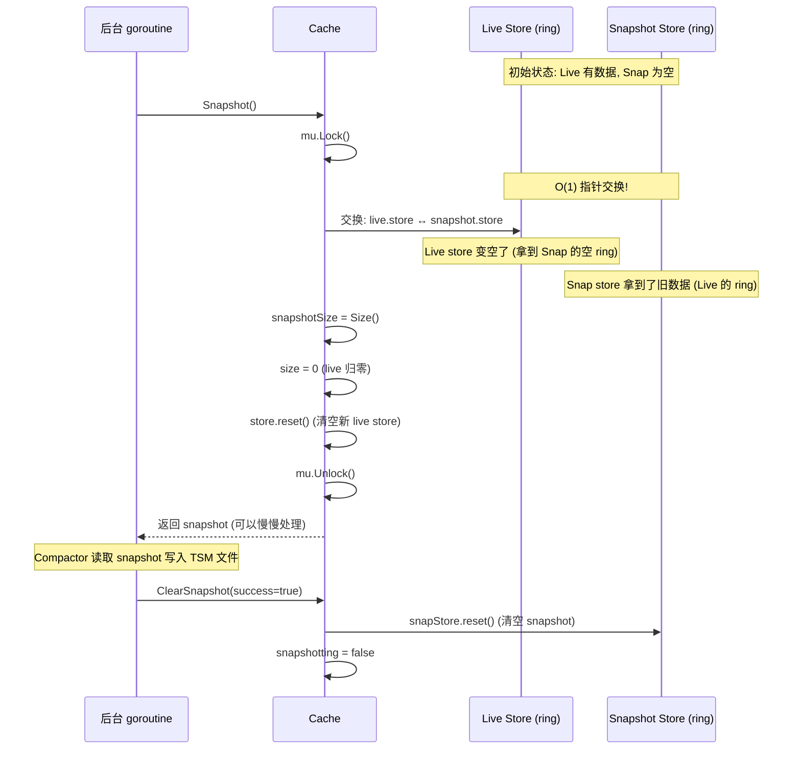

**关键设计**:
- **O(1) 交换**: 不复制数据，只交换两个 ring 的指针
- **无 GC 停顿**: 旧数据立即变为 snapshot 的一部分，不需要等待 GC
- **写入不中断**: 交换后立即可以接受新写入（写入新的空 live store）

### 6.2 Cache.ClearSnapshot — 清理 snapshot

```go
// tsdb/engine/tsm1/cache.go:440 — ClearSnapshot
func (c *Cache) ClearSnapshot(success bool) {
    c.init()

    // 获取 snapshot store 引用 (RLock)
    c.mu.RLock()
    snapStore := c.snapshot.store
    c.mu.RUnlock()

    // 在写锁外重置 snapshot store (减少锁持有时间)
    if success {
        snapStore.reset()
    }

    c.mu.Lock()
    defer c.mu.Unlock()

    c.snapshotting = false

    if success {
        c.snapshotAttempts = 0
        // 更新统计
        c.updateMemSize(-int64(atomic.LoadUint64(&c.snapshotSize)))
        // 创建新的空 snapshot Cache (复用同一个 store)
        c.snapshot = &Cache{store: snapStore}
        atomic.StoreUint64(&c.snapshotSize, 0)
        c.updateSnapshots()
    }
}
```

### 6.3 Cache.Values — 读取合并

```go
// tsdb/engine/tsm1/cache.go:555 — Values
func (c *Cache) Values(key []byte) Values {
    var snapshotEntries *entry

    c.mu.RLock()
    e := c.store.entry(key)
    if c.snapshot != nil {
        snapshotEntries = c.snapshot.store.entry(key)
    }
    c.mu.RUnlock()

    if e == nil {
        if snapshotEntries == nil {
            // No values in hot cache or snapshots.
            return nil
        }
    } else {
        e.deduplicate()
    }

    // Build the sequence of entries that will be returned, in the correct order.
    // Calculate the required size of the destination buffer.
    var entries []*entry
    sz := 0

    if snapshotEntries != nil {
        snapshotEntries.deduplicate() // guarantee we are deduplicated
        entries = append(entries, snapshotEntries)
        sz += snapshotEntries.count()
    }

    if e != nil {
        entries = append(entries, e)
        sz += e.count()
    }

    // Any entries? If not, return.
    if sz == 0 {
        return nil
    }

    // Create the buffer, and copy all hot values and snapshots. Individual
    // entries are sorted at this point, so now the code has to check if the
    // resultant buffer will be sorted from start to finish.
    values := make(Values, sz)
    n := 0
    for _, e := range entries {
        e.mu.RLock()
        n += copy(values[n:], e.values)
        e.mu.RUnlock()
    }
    values = values[:n]
    values = values.Deduplicate()

    return values
}
```

**合并语义**: snapshot 数据在前（旧），live 数据在后（新）。相同时间戳的值在 `Deduplicate()` 时保留最后一个（即 live 的值优先）。

### 6.4 Size 追踪

```go
// tsdb/engine/tsm1/cache.go:472 — Size
func (c *Cache) Size() uint64 {
    return atomic.LoadUint64(&c.size) + atomic.LoadUint64(&c.snapshotSize)
}
```

**Size = live + snapshot**: 这意味着 Snapshot 期间内存会短暂翻倍（live + snapshot 同时存在）。

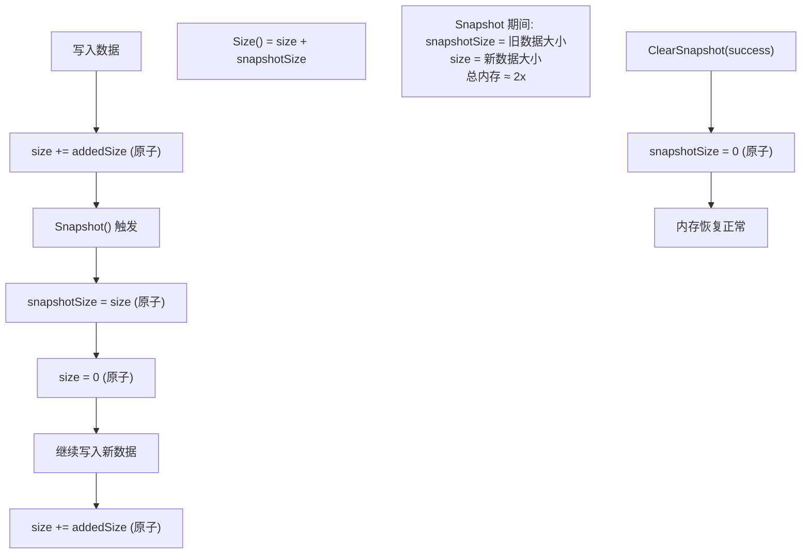

### 6.5 Cache.Split → ring.split → WriteSnapshot 并发编排

`Cache.Split(n)` 把 live ring 的 16 个分区轮询切分成 `n` 个子 ring，每个子 ring 由一个独立的 goroutine 写入 TSM 文件。这是 `Compactor.WriteSnapshot` 自适应并发的核心。

**切分逻辑**: `ring.split(n)` 为每个子 ring `newring(16)` 创建一个空的 16 分区 ring，然后把原 ring 的分区指针 `r.partitions[i]` **直接搬移**（不是复制）到 `storers[i%n].partitions[i]`。注意每个子 ring 只有 `i%n == 子ring序号` 的那几个槽位非 nil，其余分区槽位仍是 `newring` 创建时的空 `partition{store: make(...)}`。因为 `Compactor` 通过 `CacheKeyIterator` 遍历子 ring 的所有分区，空分区的 `store` 是空 map，遍历自然产生 0 个 key，不会污染结果。

```go
// tsdb/engine/tsm1/cache.go:506 — Split
func (c *Cache) Split(n int) []*Cache {
    if n == 1 {
        return []*Cache{c}
    }

    caches := make([]*Cache, n)
    storers := c.store.split(n)   // 委托给 ring.split
    for i := 0; i < n; i++ {
        caches[i] = &Cache{
            store: storers[i],    // 每个子 Cache 共享同一份分区数据, 无复制
        }
    }
    return caches
}
```

```go
// tsdb/engine/tsm1/ring.go:196 — split
func (r *ring) split(n int) []storer {
    storers := make([]storer, n)
    for i := 0; i < n; i++ {
        storers[i], _ = newring(len(r.partitions))   // 每个子 ring 仍是 16 分区骨架
    }

    for i, p := range r.partitions {
        r := storers[i%n].(*ring)
        r.partitions[i] = p                          // 轮询搬移分区指针 (i → i%n)
    }
    return storers
}
```

`Compactor.WriteSnapshot` (compact.go:888-957) 根据基数 `card` 自适应选择 `concurrency`，调用 `cache.Split(concurrency)` 后为每个子 Cache 启动一个 goroutine，各自跑 `CacheKeyIterator` + `writeNewFiles` 写 TSM，最后在主 goroutine 收集结果。

```go
// tsdb/engine/tsm1/compact.go:888 — WriteSnapshot (关键片段)
func (c *Compactor) WriteSnapshot(cache *Cache, logger *zap.Logger) ([]string, error) {
    // ...
    card := cache.Count()

    // 自适应并发: 基数越高并发越大
    concurrency := card / 2e6
    if concurrency < 1 {
        concurrency = 1
    }
    // 超高基数 (>= 3e6) 固定 4 路并发, 关闭 throttle
    if card >= 3e6 {
        concurrency = 4
        throttle = false
    }

    splits := cache.Split(concurrency)   // 1 个 Cache → concurrency 个子 Cache

    type res struct {
        files []string
        err   error
    }
    resC := make(chan res, concurrency)
    for i := 0; i < concurrency; i++ {
        go func(sp *Cache) {                                  // 每个子 ring 一个 goroutine
            iter := NewCacheKeyIterator(sp, tsdb.DefaultMaxPointsPerBlock, intC)
            files, err := c.writeNewFiles(c.FileStore.NextGeneration(), 0, nil, iter, throttle, logger)
            resC <- res{files: files, err: err}
        }(splits[i])
    }

    // join: 收集所有 goroutine 的结果
    var errs []error
    files := make([]string, 0, concurrency)
    for i := 0; i < concurrency; i++ {
        result := <-resC
        if result.err != nil {
            errs = append(errs, result.err)
        }
        files = append(files, result.files...)
    }
    // ...
    return files, errors.Join(errs...)
}
```

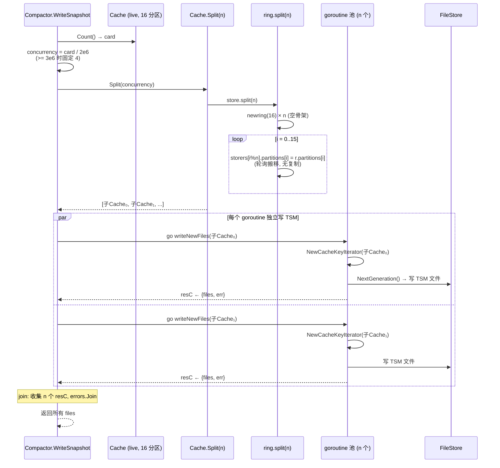

**案例 (card=4e6 → concurrency=2)**:

```
card = 4,000,000
concurrency = 4e6 / 2e6 = 2          (card >= 3e6 分支会覆盖为 4? 否: 4e6 >= 3e6 → concurrency=4, throttle=false)
```

> 注意: `card >= 3e6` 的特例分支会把 concurrency 强制设为 4 并关闭 throttle。所以 `card=4e6` 实际走的是 `concurrency=4`。
> 取一个不触发特例的例子: `card=2,500,000` → `concurrency = 2.5e6/2e6 = 1` (整除向下取整为 1)。
> 取 `card=5,500,000`: 仍 >= 3e6 → concurrency=4。
> 真正落到 `concurrency=2` 需要触发不到特例且整除得 2, 例如 `card=4,000,000` 在旧版本 (无 3e6 特例) 时为 2; 当前源码下 4e6 命中特例为 4。下面以概念性 concurrency=2 说明 split 行为:

```
原 ring 16 分区: [p0, p1, p2, ..., p15]
split(2):
  子ring₀: partitions[0]=p0, [2]=p2, [4]=p4, ..., [14]=p14  (偶数槽)
           其余槽位 (1,3,...,15) 为 newring 创建的空 partition
  子ring₁: partitions[1]=p1, [3]=p3, [5]=p5, ..., [15]=p15  (奇数槽)
           其余槽位 (0,2,...,14) 为空 partition

goroutine 0 遍历 子ring₀: 只会从 p0,p2,...,p14 读到 key (奇数槽空 map 贡献 0 key)
goroutine 1 遍历 子ring₁: 只会从 p1,p3,...,p15 读到 key

结果: 两个 goroutine 分别写各自的 TSM 文件, 互不重叠, 并发度 = 2
```

### 6.6 WriteMulti 错误路径的乐观 size 回滚

`Cache.WriteMulti` (cache.go:319) 采用**乐观策略**: 在调用 `store.write` 之前就先用 `c.increaseSize(addedSize)` 原子地占位总 size，避免在写入循环中持锁计算精确大小。如果某个 key 的 `store.write` 失败（例如 `entry.add` 返回 `ErrFieldTypeConflict`），就在原地用 `c.decreaseSize(...)` 把那一份的大小减回去，同时从本地 `addedSize` 累加器里扣掉，保证最后 `updateMemSize(addedSize)` 统计正确。

```go
// tsdb/engine/tsm1/cache.go:339 — WriteMulti 乐观 size + 回滚
    // We'll optimistially set size here, and then decrement it for write errors.
    c.increaseSize(addedSize)                    // ① 先占位 (原子加)
    for k, v := range values {
        newKey, err := store.write(k, v)
        if err != nil {
            // The write failed, hold onto the error and adjust the size delta.
            werr = err
            addedSize -= uint64(Values(v).Size())            // ② 本地累加器扣回
            c.decreaseSize(uint64(Values(v).Size()))         // ③ 原子 size 扣回 (位翻转减法)
        }
        if newKey {
            addedSize += uint64(len(k))                      // ④ 新 key 额外补上 key 长度
            c.increaseSize(uint64(len(k)))
        }
    }

    if werr != nil {
        atomic.AddInt64(&c.stats.WriteDropped, 1)            // ⑤ 统计丢弃
        atomic.AddInt64(&c.stats.WriteErr, 1)
    }

    c.updateMemSize(int64(addedSize))                         // ⑥ 用净 addedSize 更新内存统计
```

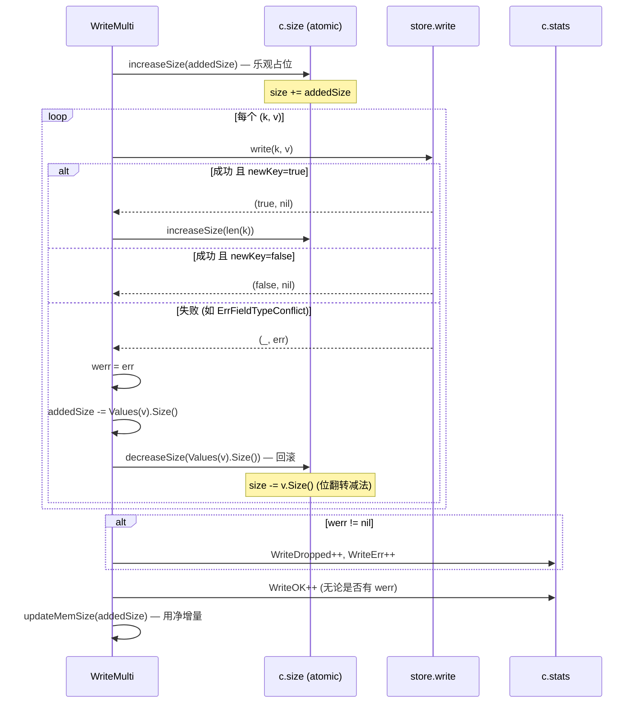

> **注意**: 即使有 key 失败 (`werr != nil`)，`WriteOK` 仍然 `+1`——这条统计的是"本次 WriteMulti 调用本身完成"，而 `WriteDropped`/`WriteErr` 才标记失败。返回值是 `werr`，调用方据此判断是否有部分丢弃。

**案例 (write 失败 → size 回滚)**:

```
初始: c.size = 10MB, maxSize = 50MB
WriteMulti({
  "cpu,host=a#!~#value": [FloatValue(t=1), FloatValue(t=2)],   // Size() = 40B
  "cpu,host=b#!~#value": [IntegerValue(t=1)],                   // Size() = 16B
})

addedSize = 40 + 16 = 56B
Size() + addedSize = 10MB + 56B < 50MB → 通过限制检查

① increaseSize(56) → size = 10MB + 56B

循环:
  write("cpu,host=a", [FloatValue...]) → (newKey=true, nil)
    ④ increaseSize(len("cpu,host=a#!~#value")=20) → size += 20
  write("cpu,host=b", [IntegerValue...])
    → entry.add 检测到 vtype 冲突 (已有 FloatValue, 来了 IntegerValue)
    → 返回 ErrFieldTypeConflict
    ② addedSize -= 16 → addedSize = 40
    ③ decreaseSize(16) → size -= 16 (回滚)

werr = ErrFieldTypeConflict
⑤ WriteDropped++, WriteErr++
⑥ updateMemSize(40)   // 净增量 = 40B (成功的那批)
WriteOK++

返回: ErrFieldTypeConflict (调用方知悉 "cpu,host=b" 被丢弃, "cpu,host=a" 已写入)
最终 size = 10MB + 56B + 20B - 16B = 10MB + 60B  (与实际写入一致)
```

### 6.7 ClearSnapshot 的 store 复用细节

`ClearSnapshot` (cache.go:439-468) 有一个容易看漏的 store 复用: 它先在**读锁**下把 `c.snapshot.store` 捕获到局部变量 `snapStore`，然后在锁外 `snapStore.reset()` 清空这个 ring（只是把每个分区的 map 换成新的空 map，不释放 ring 骨架），最后在**写锁**内用 `c.snapshot = &Cache{store: c.snapshot.store}` 重建一个空 snapshot——而这里的 `c.snapshot.store` 正是刚才 reset 过的 `snapStore`（同一个 ring 对象）。这意味着 snapshot 始终复用**同一个 ring 实例**，避免了每次 snapshot 周期都 `newring(16)` 分配 16 个分区锁。

```go
// tsdb/engine/tsm1/cache.go:439 — ClearSnapshot
func (c *Cache) ClearSnapshot(success bool) {
    c.init()

    // ① 读锁下捕获 snapshot 的 store 引用
    c.mu.RLock()
    snapStore := c.snapshot.store
    c.mu.RUnlock()

    // ② 锁外 reset: 只清空数据, 保留 ring 骨架 (16 个 partition, 各自的 mu)
    if success {
        snapStore.reset()
    }

    c.mu.Lock()
    defer c.mu.Unlock()

    c.snapshotting = false

    if success {
        c.snapshotAttempts = 0
        c.updateMemSize(-int64(atomic.LoadUint64(&c.snapshotSize)))

        // ③ 重建空 snapshot, 复用刚 reset 的同一个 store (snapStore === c.snapshot.store)
        c.snapshot = &Cache{
            store: c.snapshot.store,
        }

        atomic.StoreUint64(&c.snapshotSize, 0)
        c.updateSnapshots()
    }
}
```

> **为什么在锁外 reset?** `ring.reset()` 会对 16 个分区逐个加写锁换 map，耗时与分区数成正比。把它放到 `c.mu` 写锁外执行，可以减少 `c.mu`（保护 `store`/`snapshot` 指针的全局锁）的持有时间，让并发的 `WriteMulti`/`Snapshot` 不被阻塞。注意 `snapStore` 此刻仍被 `c.snapshot` 引用，但 `snapshotting` 仍为 true（在 ④ 才置 false），不会有新的 `Snapshot()` 触发对它的操作，所以锁外 reset 是安全的。

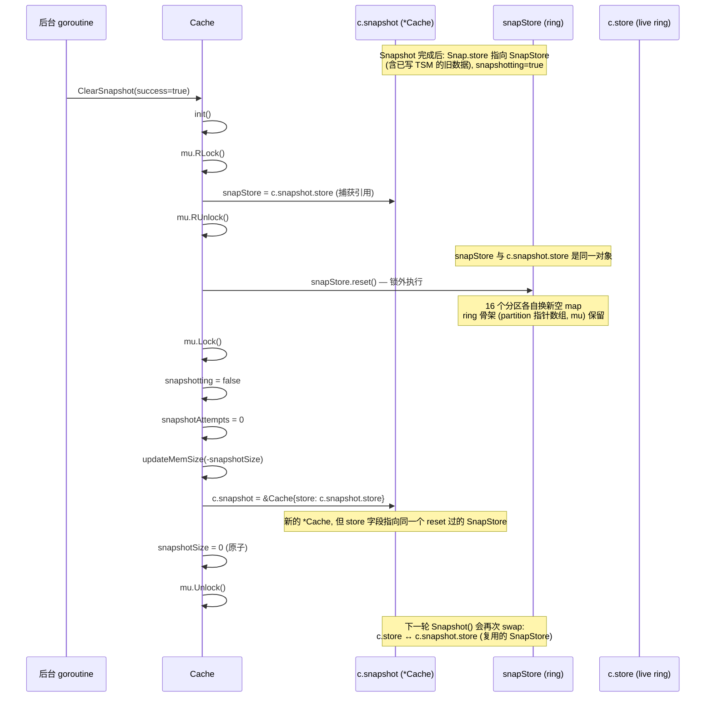

**案例 (连续两次 snapshot 周期, ring 复用)**:

```
周期 1:
  Snapshot() 首次调用, c.snapshot == nil
    → newring(16) 创建 ring_A, c.snapshot = &Cache{store: ring_A}
    → swap: c.store(ring_live) ↔ c.snapshot.store(ring_A)
    → 现在 c.store = ring_A(空,刚reset), c.snapshot.store = ring_live(旧数据)
  Compactor 写 TSM ...
  ClearSnapshot(true):
    snapStore = c.snapshot.store = ring_live
    ring_live.reset()   → ring_live 的 16 个分区换空 map, 但 partition[0..15] 和各自的 mu 复用
    c.snapshot = &Cache{store: ring_live}   ← 复用 ring_live

周期 2:
  Snapshot() 第二次调用, c.snapshot != nil 且 Size()==0
    → 不再 newring! 直接 swap: c.store ↔ c.snapshot.store
    → c.store = ring_live(空,复用), c.snapshot.store = ring_A(此时承接新数据)
  Compactor 写 TSM ...
  ClearSnapshot(true):
    snapStore = ring_A, ring_A.reset(), c.snapshot = &Cache{store: ring_A}

观察: ring_A 和 ring_live 在两个周期之间交替复用, 从不重新分配 16 个 partition 锁。
唯一一次 newring(16) 发生在首次 Snapshot() 创建 c.snapshot 时。
```

## 7. CacheLoader — WAL 恢复

### 7.1 CacheLoader 结构体

```go
// tsdb/engine/tsm1/cache.go:686 — CacheLoader
type CacheLoader struct {
    files  []string    // WAL segment 文件列表 (已排序)
    Logger *zap.Logger
}
```

### 7.2 CacheLoader.Load — 从 WAL 恢复 Cache

```go
// tsdb/engine/tsm1/cache.go:704 — Load
func (cl *CacheLoader) Load(cache *Cache) error {
    var r *WALSegmentReader
    for _, fn := range cl.files {
        if err := func() error {
            // 打开 WAL 文件，使用闭包让 defer 在每个文件结束时执行
            f, err := os.OpenFile(fn, os.O_CREATE|os.O_RDWR, 0666)
            if err != nil {
                return err
            }
            defer f.Close()

            stat, err := os.Stat(f.Name())
            if err != nil {
                return err
            }
            cl.Logger.Info("Reading file", zap.String("path", f.Name()), zap.Int64("size", stat.Size()))

            // 空文件直接跳过
            if stat.Size() == 0 {
                return nil
            }

            // 第一个文件创建 reader，后续文件复用 reader.Reset(f)
            if r == nil {
                r = NewWALSegmentReader(f)
                defer r.Close()
            } else {
                r.Reset(f)
            }

            // 逐条读取 entry
            for r.Next() {
                entry, err := r.Read()
                if err != nil {
                    // 损坏: 截断到 reader 已确认的上次有效位置
                    n := r.Count()
                    cl.Logger.Info("File corrupt",
                        zap.Error(err),
                        zap.String("path", f.Name()),
                        zap.Int64("pos", n))
                    if err := f.Truncate(n); err != nil {
                        return err
                    }
                    break
                }

                switch t := entry.(type) {
                case *WriteWALEntry:
                    if err := cache.WriteMulti(t.Values); err != nil {
                        return err
                    }
                case *DeleteRangeWALEntry:
                    cache.DeleteRange(t.Keys, t.Min, t.Max)
                case *DeleteWALEntry:
                    cache.Delete(t.Keys)
                }
            }

            return r.Close()
        }(); err != nil {
            return err
        }
    }
    return nil
}
```

**恢复过程**:
1. WAL 文件按文件名排序（`_00001.wal`, `_00002.wal`, ...）
2. `WALSegmentReader` 在第一个文件创建，后续文件通过 `Reset(f)` 复用，减少重复分配
3. 逐条读取 entry，`WriteWALEntry` 会检查并传播 `cache.WriteMulti` 的错误
4. 损坏的 entry 通过 `r.Count()` 定位上次有效位置，直接 `Truncate(n)`，没有额外 `Seek`
5. 恢复期间 Cache 的 maxSize 被临时设为 0（无限制），防止恢复过程中被拒绝

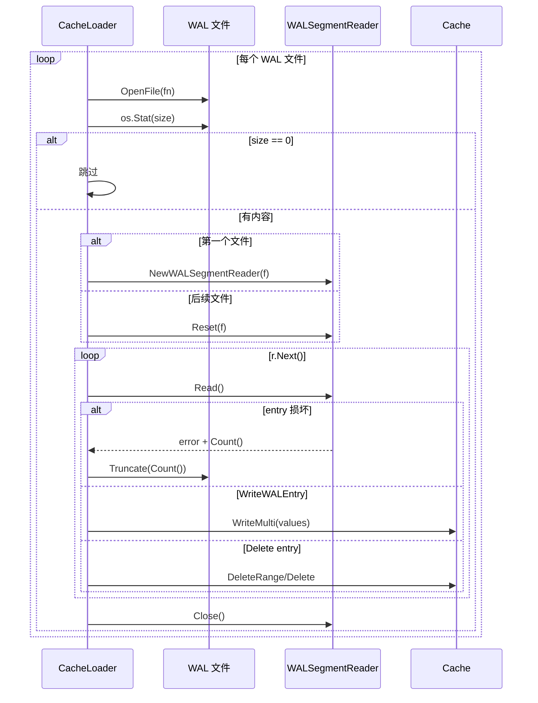

**案例**: `_00002.wal` 读到 128KB 后遇到半条写入记录，`r.Count()` 返回最后一条完整 entry 之后的位置。
`Load()` 记录 corrupt 日志并把文件截断到该位置，然后保留前面已经重放到 Cache 的写入；如果某条 `WriteWALEntry`
因字段类型冲突导致 `WriteMulti` 返回错误，恢复会立即返回该错误，而不是静默跳过。

## 8. 并发层次总结

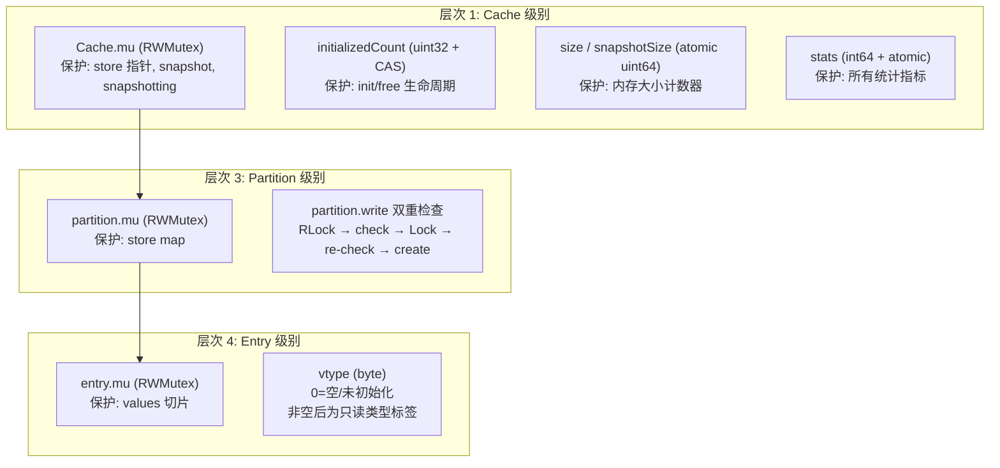

| 层次 | 机制 | 保护对象 | 粒度 |
|------|------|---------|------|
| Cache.mu | RWMutex | store 指针, snapshot, snapshotting | 全局 |
| Cache.initializedCount | uint32 + CAS | init/free 生命周期 | 全局 (每个 init/free 生命周期一次) |
| Cache.size / snapshotSize | atomic uint64 | 内存大小计数器 | 全局 (无锁) |
| Cache.stats | int64 + atomic | 统计指标 | 全局 (无锁) |
| partition.mu | RWMutex | store map | 分区级 |
| partition.write | 双重检查锁 | 新 entry 创建 | 分区级 |
| entry.mu | RWMutex | values 切片 | entry 级 |
| entry.vtype | byte | `0` 表示空 entry；非空后为只读类型标签 | entry 级 |

## 9. 具体案例

### 9.1 高并发写入案例

> **场景**: 100 个 goroutine 同时写入 1000 个不同的 series key

```
goroutine 1:  key="cpu,host=web01#!~#value"  → xxhash%16=3  → 分区 3
goroutine 2:  key="cpu,host=web02#!~#value"  → xxhash%16=7  → 分区 7
goroutine 3:  key="cpu,host=web01#!~#value"  → xxhash%16=3  → 分区 3 (与 goroutine 1 同分区!)
...
goroutine 100: key="mem,host=web99#!~#value" → xxhash%16=12 → 分区 12

并发分析:
- 16 个分区，100 个 goroutine → 平均每分区 6.25 个 goroutine
- 不同分区的 goroutine 完全并行 (无锁竞争)
- 同一分区的不同 key: RLock → 查找 → RUnlock → Lock → 创建 → Unlock (短暂竞争)
- 同一分区的相同 key: RLock → 查找 → RUnlock → entry.add(values) (无分区锁竞争!)
```

### 9.2 Snapshot 期间写入不中断案例

> **场景**: Cache 达到 25MB，触发 Snapshot

```
t=0ms    Cache.Size() = 25MB, 触发 ShouldCompactCache()
t=1ms    Snapshot():
           - mu.Lock()
           - 交换 live.store ↔ snapshot.store (O(1))
           - snapshotSize = 25MB
           - size = 0
           - store.reset()
           - mu.Unlock()
t=1ms    Snapshot 返回，写入不中断

t=2ms    新写入到达:
           - increaseSize(1KB) → size = 1KB
           - store.write(key, values) → 写入新的空 live store
           - 正常返回

t=100ms  Compactor 开始处理 snapshot:
           - 读取 snapshot 的 ring (25MB 数据)
           - 写入 TSM 文件

t=500ms  Compactor 完成:
           - ClearSnapshot(success=true)
           - snapshotSize = 0
           - 总内存: Size() = size (新数据)
```

## 10. 架构设计意图

### 10.1 为什么用 16 分区而非全局锁

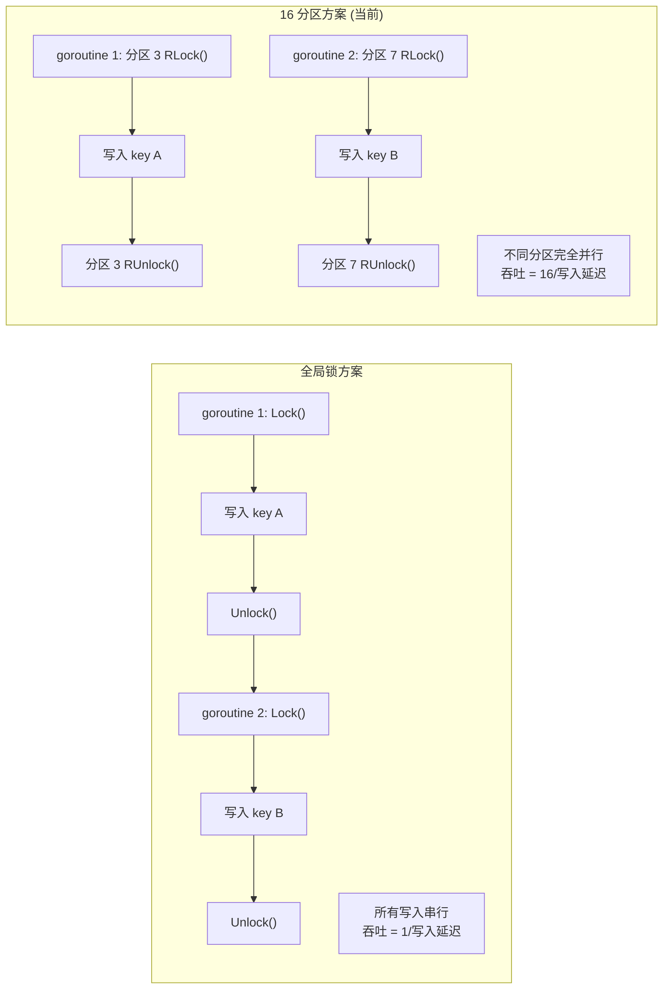

| 维度 | 全局锁 | 16 分区 |
|------|--------|---------|
| 并发度 | 1 | 16 |
| 锁竞争 | 高 | 低 (1/16 概率) |
| 内存开销 | 1 个 map | 16 个 map |
| 实现复杂度 | 简单 | 中等 |

### 10.2 为什么用双重检查锁而非单写锁

- **读多写少**: 大部分写入是追加到已存在的 key（热路径），只有首次写入需要创建 entry
- **RLock 无竞争**: 多个 goroutine 可以同时持有读锁，只有写锁才互斥
- **避免写锁放大**: 如果所有写入都用写锁，并发度会从 16 降到 1

### 10.3 为什么 Snapshot 用指针交换而非复制

| 维度 | 指针交换 | 复制 |
|------|---------|------|
| 时间复杂度 | O(1) | O(N) |
| 内存峰值 | 2x (live + snapshot) | 3x (live + 复制中 + snapshot) |
| GC 压力 | 无额外对象 | 大量复制产生临时对象 |
| 写入中断 | 无 | 复制期间需要持有锁 |

### 10.4 为什么 Cache 没有驱逐机制

- **数据完整性**: 驱逐可能导致最新数据丢失（最新写入可能还未持久化到 TSM）
- **Snapshot 语义**: 整个 Cache 一次性快照写入 TSM，部分驱逐会破坏这个语义
- **简单可靠**: 满了直接拒绝（`ErrCacheMemorySizeLimitExceeded`），调用方可以重试或降级

## 11. 潜在隐患与瓶颈

### 11.1 Snapshot 期间内存翻倍

```
Snapshot 期间:
  live store: 0 (刚清空)
  snapshot store: 25MB (旧数据)
  新写入: 逐渐增长

  Size() = snapshotSize + size = 25MB + 新数据大小
  如果新数据也写到 25MB，总内存 = 50MB
```

**影响**: 如果 maxSize=25MB，Snapshot 期间实际可用内存是 50MB。在内存受限的环境中可能导致 OOM。

### 11.2 Cache.Write 的 []byte → string 分配

```go
// cache.go:300 — 单 key 写入会把 []byte 转成 string
newKey, err := c.store.write(string(key), values)

// ring.go / partition.write 已经接收 string key
func (r *ring) write(key string, values Values) (bool, error)
func (p *partition) write(key string, values Values) (bool, error)
```

当前代码里 `ring.go` 不再做 `string(key)`：`partition.write` 的签名是 `write(key string, values Values)`，map 查找也是 `p.store[key]`。字符串转换发生在单 key `Cache.Write(key []byte, values []Value)` 入口，它需要把 `[]byte` 转成 storer 使用的 `string` key。

`WriteMulti(map[string][]Value)` 本来就拿到 string key，循环里直接调用 `store.write(k, v)`，不会再为 ring 路由或 partition 查找做额外的 `[]byte → string` 转换。

### 11.3 entry.add 的 append 可能触发扩容

```go
e.values = append(e.values, values...)
```

当 `values` 切片容量不足时，`append` 会分配新的底层数组。在高频追加场景下，这会导致多次内存分配。

### 11.4 Cache 没有分区级大小限制

`maxSize` 是全局限制，不按分区划分。如果所有 key 都哈希到同一个分区，该分区的 map 会变得非常大，而其他分区空闲。

### 11.5 emptyStore 懒初始化的 CAS 竞争

```go
if !atomic.CompareAndSwapUint32(&c.initializedCount, 0, 1) {
    return
}
```

如果多个 goroutine 同时调用 `init()`，只有一个能赢得 CAS。其他 goroutine 会返回，但此时 `c.store` 可能还没有被设置（Lock 还未获取）。后续的 `store.write()` 调用可能操作在旧的 `emptyStore` 上。

**实际影响**: 这是一个真实语义窗口，而不只是性能问题。CAS 失败的 goroutine
会直接返回；如果它随后在获锁读取 `c.store` 时仍看到旧的 `emptyStore`，
`emptyStore.write()` 会返回 `(false, nil)`，该次写入不会报错但也不会落入 ring。
这个窗口很窄，但文档不能把它描述成完全无害。

## 12. 关键文件索引

| 文件 | 行数 | 职责 |
|------|------|------|
| `tsdb/engine/tsm1/ring.go` | 300 | Ring 哈希环: 分区路由、双重检查锁、并行 apply、split |
| `tsdb/engine/tsm1/cache.go` | 830 | Cache 内存缓冲: WriteMulti、Snapshot、ClearSnapshot、CacheLoader、storer 接口 |
