# Module 16: FileStore + KeyCursor 查询路径 (多文件管理 + Tombstone 过滤 + 重叠块归并) - 深度审计报告

> **小白导读**: 想象你是一个图书馆管理员，管理着一排排书架（TSM 文件）。
>
> - **FileStore（文件管理器）** = 图书馆总管。负责开关书架、替换旧书架、清理废弃书架。
>
> - **TSMFile 接口** = 书架规格。每个书架必须提供：按编号查书（key 查找）、按时间查书（时间范围查找）、书目清单（Index）、损坏标记（Tombstone）。
>
> - **KeyCursor（键游标）** = 你的借书助手。读者说"我要关于 cpu,host=web 的所有数据"，助手会：
>   1. 查遍所有书架，找到包含这本书的所有副本
>   2. 按时间排序
>   3. 跳过已借出的页（tombstone）
>   4. 合并重叠的内容（多个 compaction 级别可能有重叠数据）
>   5. 一页一页交给读者
>
> - **location（位置标记）** = 书签。记录"这本书在哪個书架的哪一页"，以及"哪些页已经读过了"。
>
> - **purger（清理器）** = 垃圾回收员。当旧书架被替换后，如果有读者还在看，就等他们看完再搬走。
>
> **关键设计**：
> - 多个 TSM 文件可能包含同一个 key 的数据（不同 compaction 级别）
> - KeyCursor 负责**归并去重**——相同时间戳只保留最新的值
> - Tombstone 标记已删除的数据，KeyCursor 读取时自动跳过
> - 文件替换是**原子操作**——旧文件在所有读者释放引用后才被删除

## 1. 全局架构

### 1.1 FileStore + TSMFile 关系图

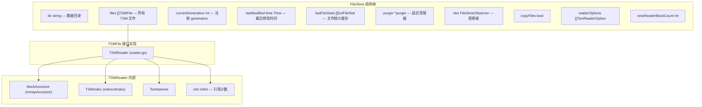

### 1.2 查询全链路总览

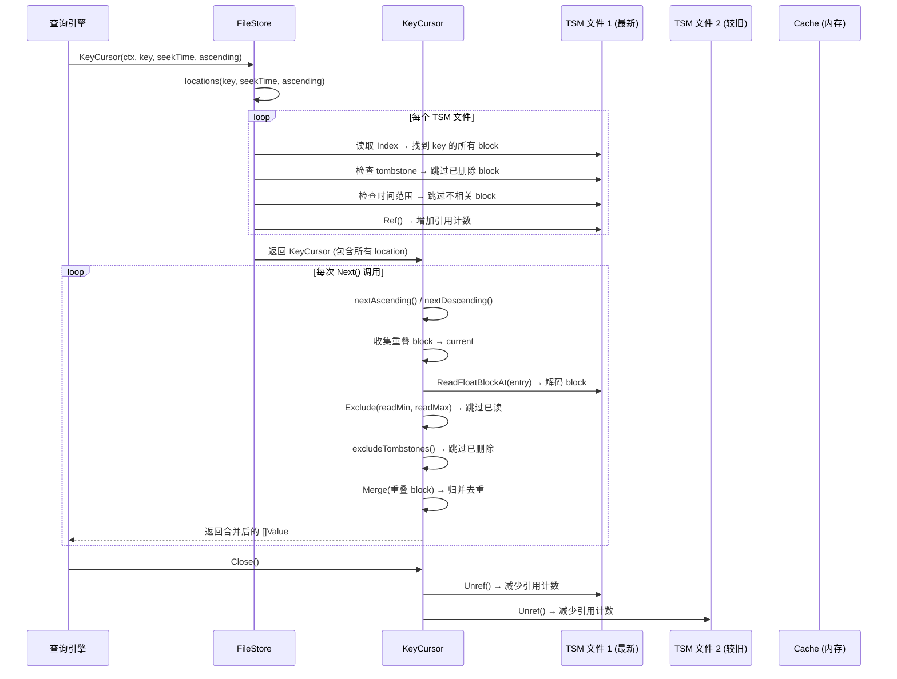

## 2. FileStore — 文件生命周期管理

### 2.1 FileStore 结构体

```go
// tsdb/engine/tsm1/file_store.go:201 — FileStore
type FileStore struct {
    mu                sync.RWMutex
    lastModified      time.Time      // 最后修改时间 (用于 compaction 判断)
    lastFileStats     []ExtFileStat  // 文件统计缓存 (懒计算)
    currentGeneration int            // 当前 generation 编号
    dir               string         // 数据目录
    files             []TSMFile      // 所有 TSM 文件 (按路径排序)
    openLimiter       limiter.Fixed  // 并发打开文件数限制 (= GOMAXPROCS)
    logger            *zap.Logger
    traceLogger       *zap.Logger
    traceLogging      bool
    stats             *FileStoreStatistics
    purger            *purger        // 延迟清理器
    currentTempDirID  int
    parseFileName     ParseFileNameFunc
    obs               tsdb.FileStoreObserver  // 观察者 (用于 Enterprise 复制)
    copyFiles         bool
    readerOptions     []TsmReaderOption
    newReaderBlockCount int  // 非 0 时阻止创建新的 TSMReader
}
```

### 2.2 TSMFile 接口

```go
// tsdb/engine/tsm1/file_store.go:45 — TSMFile
type TSMFile interface {
    // 基础信息
    Path() string
    Size() uint32

    // 读取
    Read(key []byte, t int64) ([]Value, error)
    ReadAt(entry *IndexEntry, values []Value) ([]Value, error)

    // 类型化读取 (5 种类型 × 2 种格式 = 10 个方法)
    ReadFloatBlockAt(entry *IndexEntry, values *[]FloatValue) ([]FloatValue, error)
    ReadFloatArrayBlockAt(entry *IndexEntry, values *tsdb.FloatArray) error
    ReadIntegerBlockAt(entry *IndexEntry, values *[]IntegerValue) ([]IntegerValue, error)
    ReadIntegerArrayBlockAt(entry *IndexEntry, values *tsdb.IntegerArray) error
    // ... Unsigned, String, Boolean 同理

    // 索引查询
    Entries(key []byte) []IndexEntry
    ReadEntries(key []byte, entries *[]IndexEntry) []IndexEntry
    Contains(key []byte) bool
    ContainsValue(key []byte, t int64) bool
    Type(key []byte) (byte, error)

    // 范围查询
    TimeRange() (int64, int64)
    KeyRange() ([]byte, []byte)
    OverlapsTimeRange(min, max int64) bool
    OverlapsKeyRange(min, max []byte) bool

    // Tombstone
    HasTombstones() bool
    TombstoneRange(key []byte) []TimeRange
    TombstoneStats() TombstoneStat
    BatchDelete() BatchDeleter
    Delete(keys [][]byte) error
    DeleteRange(keys [][]byte, min, max int64) error

    // 引用计数
    Ref()
    Unref()
    InUse() bool

    // 生命周期
    Close() error
    Remove() error
    Rename(path string) error

    // 迭代
    KeyCount() int
    KeyAt(idx int) ([]byte, byte)
    Seek(key []byte) int
    BlockIterator() *BlockIterator
    ExtStats() (ExtFileStat, error)
    Free() error
}
```

### 2.3 FileStat — 文件元数据

```go
// tsdb/engine/tsm1/file_store.go:199 — FileStat
type FileStat struct {
    Path         string
    HasTombstone bool
    Size         uint32
    LastModified int64
    MinTime, MaxTime int64
    MinKey, MaxKey   []byte
}
```

### 2.4 FileStore.Open — 启动时加载所有 TSM 文件

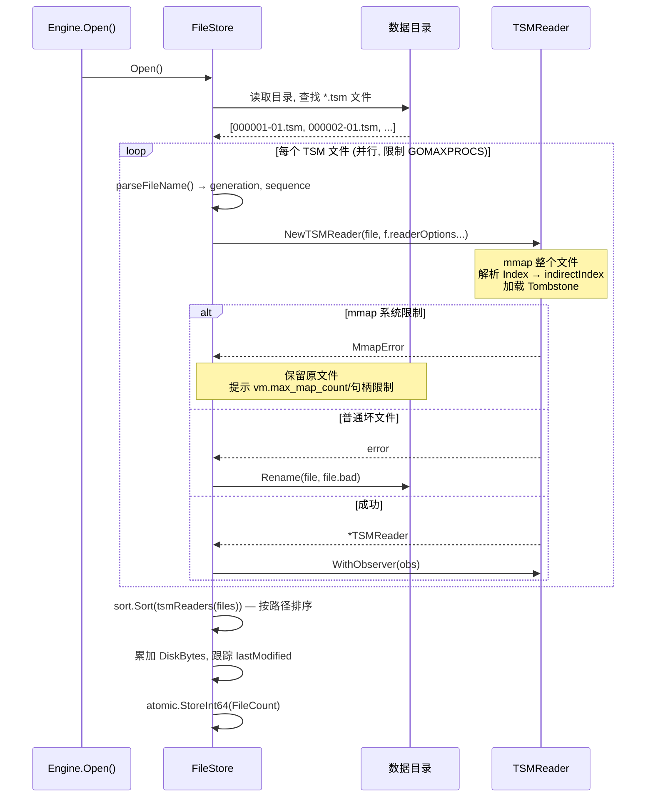

```go
// tsdb/engine/tsm1/file_store.go:559 — Open (关键部分)
func (f *FileStore) Open() error {
    // 1. 读取目录
    files, _ := filepath.Glob(filepath.Join(f.dir, fmt.Sprintf("*.%s", TSMFileExtension)))

    // 2. 并行打开文件 (限制并发数 = GOMAXPROCS)
    readerC := make(chan *res, len(files))
    for _, fn := range files {
        go func(fn string) {
            f.openLimiter.Take()  // 获取并发令牌
            defer f.openLimiter.Release()

            file, err := os.OpenFile(fn, os.O_RDONLY, 0666)
            if err != nil { readerC <- &res{err: err}; return }

            df, err := NewTSMReader(file, f.readerOptions...)
            if err != nil {
                file.Close()
                if errors.Is(err, MmapError{}) {
                    // mmap 失败通常是系统限制，不能把文件当作坏文件改名
                    readerC <- &res{err: fmt.Errorf("mmap limit: %w", err)}
                    return
                }
                // 普通损坏文件改名为 .bad，避免反复打开失败
                os.Rename(file.Name(), file.Name()+"."+BadTSMFileExtension)
                readerC <- &res{err: fmt.Errorf("corrupt file: %w", err)}
                return
            }
            df.WithObserver(f.obs)
            readerC <- &res{r: df}
        }(fn)
    }

    // 3. 收集结果
    for range files {
        res := <-readerC
        if res.err != nil { return res.err }
        f.files = append(f.files, res.r)
    }

    // 4. 排序 + 统计
    sort.Sort(tsmReaders(f.files))
    // ... 累加 DiskBytes, 跟踪 lastModified
}
```

### 2.5 FileStore.Close — 关闭所有文件

```go
// tsdb/engine/tsm1/file_store.go:716 — Close
func (f *FileStore) Close() error {
    f.mu.Lock()
    files := f.files
    f.lastFileStats = nil
    f.files = nil
    atomic.StoreInt64(&f.stats.FileCount, 0)
    f.mu.Unlock()

    // 在锁外关闭文件 (避免长时间持锁)
    var errSlice []error
    for _, tsmFile := range files {
        errSlice = append(errSlice, tsmFile.Close())
    }
    return errors.Join(errSlice...)
}
```

### 2.6 FileStore.Replace — 原子替换文件

```go
// tsdb/engine/tsm1/file_store.go:733 — replace
func (f *FileStore) replace(oldFiles, newFiles []string, updatedFn func(r []TSMFile)) error {
    if len(oldFiles) == 0 && len(newFiles) == 0 {
        return nil
    }

    updated := make([]TSMFile, 0, len(newFiles))

    // 步骤 1: 处理新文件
    for _, file := range newFiles {
        // Observer 回调: FileFinishing
        f.obs.FileFinishing(file)

        // 重命名 .tsm.tmp → .tsm
        newName := file
        if strings.HasSuffix(file, ".tsm.tmp") {
            newName = file[:len(file)-4]
            os.Rename(file, newName)
        }

        // 打开新文件
        fd, _ := os.Open(newName)
        tsm, _ := NewTSMReader(fd, f.readerOptions...)
        tsm.WithObserver(f.obs)
        updated = append(updated, tsm)
    }

    // 步骤 2: 替换文件列表 (持有写锁)
    f.mu.Lock()
    defer f.mu.Unlock()

    updated = append(updated, f.files...)
    var active, inuse []TSMFile
    for _, file := range updated {
        keep := true
        for _, remove := range oldFiles {
            if remove == file.Path() {
                keep = false

                // Observer 回调: FileUnlinking
                f.obs.FileUnlinking(file.Path())

                // 处理正在被查询使用的文件
                if file.InUse() {
                    // 重命名为临时路径, 延迟清理
                    file.Rename(file.Path() + ".tmp")
                    inuse = append(inuse, file)
                    continue
                }

                file.Close()
                file.Remove()
                break
            }
        }
        if keep {
            active = append(active, file)
        }
    }

    // 步骤 3: 延迟清理 in-use 文件
    f.purger.add(inuse)

    // 步骤 4: 更新状态
    f.lastFileStats = nil  // 清除缓存
    f.files = active
    sort.Sort(tsmReaders(f.files))
    // 重新计算 DiskBytes
}
```

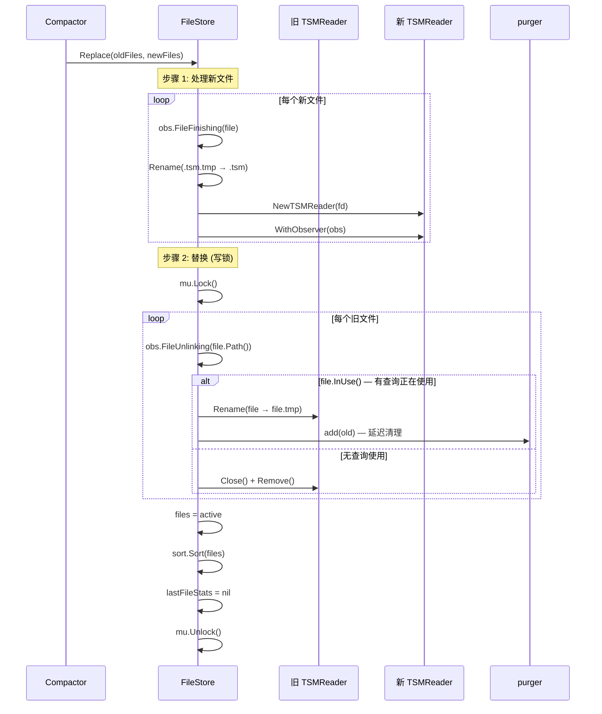

**关键设计**:
- **InUse 保护**: 如果旧文件正在被查询使用（`Ref() > 0`），不会立即删除，而是重命名为 `.tmp` 并交给 `purger` 延迟清理
- **Observer 回调**: `FileFinishing` 和 `FileUnlinking` 是 Enterprise 复制的钩子，OSS 版本是 no-op
- **原子性**: 整个替换过程在写锁内完成，查询侧看到的要么是旧文件列表，要么是新文件列表

### 2.7 purger — 延迟清理器

```go
// tsdb/engine/tsm1/file_store.go:1599 — purger
type purger struct {
    files   gensyncmap.Map[string, TSMFile]  // 待清理的文件 (泛型 sync.Map)
    mu      sync.Mutex                       // 仅保护 running 标志
    running bool

    logger *zap.Logger
}

// tsdb/engine/tsm1/file_store.go:1607 — add
func (p *purger) add(files []TSMFile) {
    if len(files) == 0 {
        return
    }
    var fileNames []string
    for _, f := range files {
        fileName := f.Path()
        fileNames = append(fileNames, fileName)
        p.files.Store(fileName, f)  // 写入并发安全 map
    }
    p.purge(fileNames)  // 触发清理
}

// tsdb/engine/tsm1/file_store.go:1623 — purge
func (p *purger) purge(fileNames []string) {
    p.mu.Lock()
    defer p.mu.Unlock()
    if p.running {
        return  // 已有清理 goroutine 在运行
    }
    p.running = true

    go func() {
        // hasFiles() 在加锁状态下检查 files.Len()；若为空则把 running 置回 false
        // 再返回。这保证了 add() 检查 running 与 goroutine 退出之间没有竞态。
        for p.hasFiles() {
            // 通过 Range 遍历并发安全 map
            p.files.Range(func(k string, v TSMFile) bool {
                if !v.InUse() {
                    v.Close()
                    v.Remove()
                    p.files.Delete(k)  // 无论成功失败都移除，不重试
                }
                return true  // InUse 的文件留待下一轮
            })
            time.Sleep(time.Second)  // 每秒检查一次 (file_store.go:1680)
        }
    }()
}
```

> **小白解释**: purger 就像一个耐心的清洁工——它不会在还有读者看书的时候就把书架搬走。它每秒检查一次，等所有读者都离开了（`InUse() == false`），才真正搬走书架。
>
> **并发模型要点**:
> - `files` 是 `gensyncmap.Map[string, TSMFile]`（泛型 `sync.Map`），而非普通 map——
>   `add()` 写入和后台 goroutine 遍历/删除可以并发进行，无需持锁遍历。
> - `mu sync.Mutex` 只保护 `running` 标志，不保护 `files`。`purge()` 持锁检查并设置
>   `running`，然后释放锁启动 goroutine；goroutine 内部不再持有 `mu`。
> - `hasFiles()` 实现了 running-flag 协议：它在加锁状态下检查 `files.Len()`，若为空
>   则先把 `running` 置回 `false` 再返回，避免 `add()` 在 goroutine 退出瞬间漏掉新文件。
> - Close/Remove 失败的文件也会被 `Delete(k)` 移除——文件已被关闭或遇到 OS 问题，
>   重试无益。

### 2.8 FileStore.Stats — 懒缓存 (双检锁)

```go
// tsdb/engine/tsm1/file_store.go:858 — Stats
func (f *FileStore) Stats() []ExtFileStat {
    // 快速路径: RLock 检查缓存
    f.mu.RLock()
    if len(f.lastFileStats) > 0 {
        defer f.mu.RUnlock()
        return f.lastFileStats
    }
    f.mu.RUnlock()

    // 缓存失效: 升级为写锁
    f.mu.Lock()
    defer f.mu.Unlock()

    // 双重检查
    if len(f.lastFileStats) > 0 {
        return f.lastFileStats
    }

    // 重新计算
    if cap(f.lastFileStats) < len(f.files)/2 {
        f.lastFileStats = make([]ExtFileStat, 0, len(f.files))
    }
    for _, fd := range f.files {
        stats, err := fd.ExtStats()
        if err != nil {
            f.logger.Warn("error during fd.ExtStats", zap.Error(err))
        }
        f.lastFileStats = append(f.lastFileStats, stats)
    }
    return f.lastFileStats
}
```

**缓存失效**: 当文件被添加、删除或替换时，`lastFileStats` 被设为 `nil`，强制下次调用重新计算。

## 3. KeyCursor — 多文件键游标

### 3.1 KeyCursor 结构体

```go
// tsdb/engine/tsm1/file_store.go:1380 — KeyCursor
type KeyCursor struct {
    key       []byte        // 要查找的 key
    seeks     []*location   // 所有文件中的 block 位置
    current   []*location   // 当前正在读取的 block 集合 (可能多个用于去重)
    buf       []Value       // 解码缓冲区
    ctx       context.Context
    col       *metrics.Group
    pos       int           // seeks 中的当前位置
    ascending bool          // 升序/降序
}
```

### 3.2 location 结构体

```go
// tsdb/engine/tsm1/file_store.go:1401 — location
type location struct {
    r     TSMFile     // 所属的 TSM 文件
    entry IndexEntry  // block 的索引条目

    readMin int64     // 已读范围: 最小时间戳
    readMax int64     // 已读范围: 最大时间戳
}
```

**readMin/readMax 的作用**: 标记"哪些数据已经读过了"。当 seekTime 不在 block 的起始位置时，seekTime 之前的数据被标记为"已读"，后续的 `ReadBlock` 方法会自动跳过。

```go
// tsdb/engine/tsm1/file_store.go:1408 — read
func (l *location) read() bool {
    // 如果 block 的整个时间范围都在 [readMin, readMax] 内，说明已完全读过
    return l.readMin <= l.entry.MinTime && l.readMax >= l.entry.MaxTime
}

// tsdb/engine/tsm1/file_store.go:1412 — markRead
func (l *location) markRead(min, max int64) {
    // 扩展已读范围
    if min < l.readMin {
        l.readMin = min
    }
    if max > l.readMax {
        l.readMax = max
    }
}
```

### 3.3 FileStore.locations — 查找所有匹配位置

```go
// tsdb/engine/tsm1/file_store.go:1136 — locations
func (f *FileStore) locations(key []byte, t int64, ascending bool) []*location {
    var cache []IndexEntry
    locations := make([]*location, 0, len(f.files))

    for _, fd := range f.files {
        minTime, maxTime := fd.TimeRange()

        // 1. 根据扫描方向跳过不相关文件
        if ascending && maxTime < t {
            continue  // 升序: 文件最大时间 < 查找时间, 跳过
        } else if !ascending && minTime > t {
            continue  // 降序: 文件最小时间 > 查找时间, 跳过
        }

        // 2. 获取 tombstone 范围
        tombstones := fd.TombstoneRange(key)

        // 3. 获取此 key 的所有 IndexEntry
        entries := fd.ReadEntries(key, &cache)

    LOOP:
        for i := 0; i < len(entries); i++ {
            ie := entries[i]

            // 4. 跳过完全被 tombstone 覆盖的 block
            for _, t := range tombstones {
                if t.Min <= ie.MinTime && t.Max >= ie.MaxTime {
                    continue LOOP
                }
            }

            // 5. 根据扫描方向检查时间范围
            if ascending && ie.MaxTime < t {
                continue
            } else if !ascending && ie.MinTime > t {
                continue
            }

            // 6. 创建 location
            location := &location{r: fd, entry: ie}

            // 7. 设置 readMin/readMax (标记 seekTime 之前的数据为已读)
            if ascending {
                location.readMin = math.MinInt64
                location.readMax = t - 1
            } else {
                location.readMin = t + 1
                location.readMax = math.MaxInt64
            }

            locations = append(locations, location)
        }
    }
    return locations
}
```

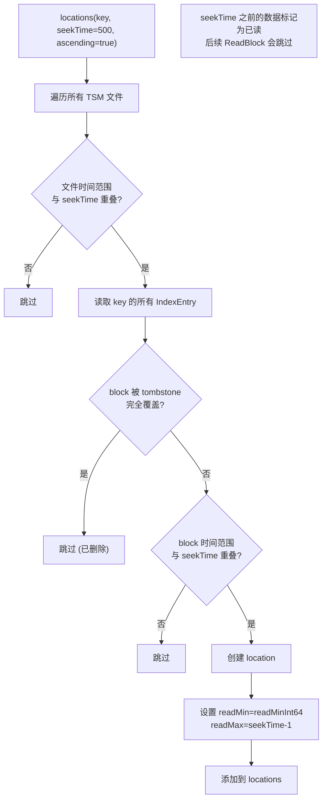

### 3.4 newKeyCursor — 创建游标

```go
// tsdb/engine/tsm1/file_store.go:1448 — newKeyCursor
func newKeyCursor(ctx context.Context, fs *FileStore, key []byte, t int64, ascending bool) *KeyCursor {
    c := &KeyCursor{
        key:       key,
        ctx:       ctx,
        ascending: ascending,
    }

    // 1. 查找所有匹配的 location
    c.seeks = fs.locations(key, t, ascending)

    // 2. 排序
    if ascending {
        sort.Sort(ascLocations(c.seeks))
    } else {
        sort.Sort(descLocations(c.seeks))
    }

    // 3. 增加所有文件的引用计数
    for _, l := range c.seeks {
        l.r.Ref()
    }

    // 4. 定位到 seekTime
    c.seek(t)

    return c
}
```

### 3.5 KeyCursor.seek — 定位到起始位置

```go
// tsdb/engine/tsm1/file_store.go:1485 — seek
func (c *KeyCursor) seek(t int64) {
    if c.ascending {
        c.seekAscending(t)
    } else {
        c.seekDescending(t)
    }
}

// tsdb/engine/tsm1/file_store.go:1498 — seekAscending
func (c *KeyCursor) seekAscending(t int64) {
    // 找到所有包含或晚于 seekTime 的候选 block。
    // pos 只记录第一个候选；current 会收集后续候选，供 Read*Block 去重归并。
    // 注意: c.current 已由 seek() 在调用前清空 (c.current = nil)。
    for i, e := range c.seeks {
        if t < e.entry.MinTime || e.entry.Contains(t) {
            // 首个匹配 block 记录其 pos (first-match-wins via len(c.current)==0)
            if len(c.current) == 0 {
                c.pos = i
            }
            c.current = append(c.current, e)
        }
    }
}
```

### 3.6 KeyCursor.Next — 推进到下一个 block

```go
// tsdb/engine/tsm1/file_store.go:1526 — Next
func (c *KeyCursor) Next() {
    if len(c.current) == 0 {
        return
    }
    // 当前 block 是否还有未读值
    if !c.current[0].read() {
        return
    }
    c.current = c.current[:0]
    if c.ascending {
        c.nextAscending()
    } else {
        c.nextDescending()
    }
}
```

### 3.7 nextAscending — 升序推进 + 未读候选收集

```go
// tsdb/engine/tsm1/file_store.go:1542 — nextAscending
func (c *KeyCursor) nextAscending() {
    // 推进到下一个未读 block
    for {
        c.pos++
        if c.pos >= len(c.seeks) {
            return
        } else if !c.seeks[c.pos].read() {
            break
        }
    }

    // 添加第一个匹配 block
    if len(c.current) == 0 {
        c.current = append(c.current, nil)
    } else {
        c.current = c.current[:1]
    }
    c.current[0] = c.seeks[c.pos]

    // 追加所有后续未读 block；真正的重叠窗口过滤在 Read*Block 中完成
    for i := c.pos + 1; i < len(c.seeks); i++ {
        if c.seeks[i].read() {
            continue
        }
        c.current = append(c.current, c.seeks[i])
    }
}
```

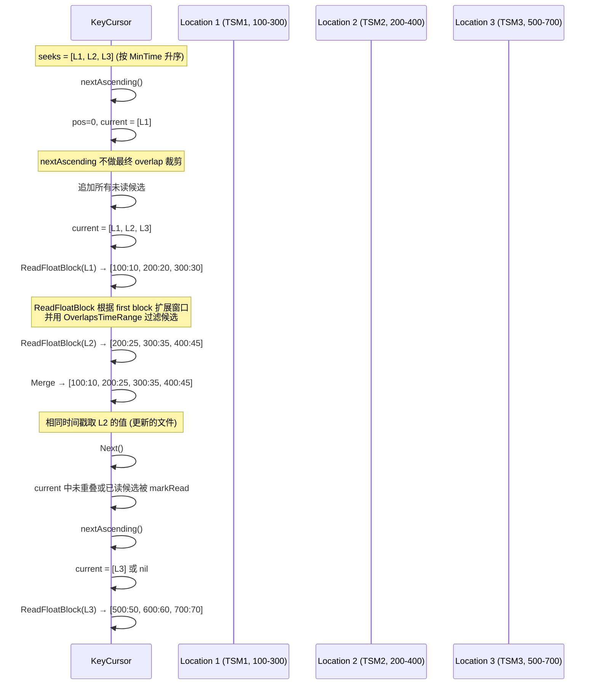

### 3.7.1 seekDescending + nextDescending — 降序镜像

`seekDescending` (file_store.go:1511) 是 `seekAscending` 的降序镜像，但有两个关键差异: (1) 遍历方向从 `len(c.seeks)-1` 向 0 反向; (2) 匹配条件从 `t < e.entry.MinTime` 改为 `t > e.entry.MaxTime`——因为降序查询要从最晚的 block 开始，只要 block 的最大时间戳 `>=` seekTime（即 `t > MaxTime` 不成立，或 block `Contains(t)`），就是候选。`nextDescending` (file_store.go:1570) 推进时 `c.pos--`，且候选收集循环从 `i := c.pos` 开始（**不是** `c.pos-1`），因为降序下 `c.pos` 指向刚选中的 block，需要把它自己也纳入 `current[0]` 之后的候选去重窗口。

```go
// tsdb/engine/tsm1/file_store.go:1511 — seekDescending
func (c *KeyCursor) seekDescending(t int64) {
    for i := len(c.seeks) - 1; i >= 0; i-- {     // 反向遍历 (从最晚的 block 开始)
        e := c.seeks[i]
        if t > e.entry.MaxTime || e.entry.Contains(t) {
            // Record the position of the first block matching our seek time
            if len(c.current) == 0 {
                c.pos = i                          // 首个匹配记录 pos (降序下是 MaxTime 最大的候选)
            }
            c.current = append(c.current, e)
        }
    }
}

// tsdb/engine/tsm1/file_store.go:1570 — nextDescending
func (c *KeyCursor) nextDescending() {
    for {
        c.pos--                                    // 向更早的 block 推进
        if c.pos < 0 {
            return
        } else if !c.seeks[c.pos].read() {
            break
        }
    }

    // Append the first matching block
    if len(c.current) == 0 {
        c.current = make([]*location, 1)
    } else {
        c.current = c.current[:1]
    }
    c.current[0] = c.seeks[c.pos]

    // If we have ovelapping blocks, append all their values so we can dedup
    for i := c.pos; i >= 0; i-- {                  // 注意: 从 c.pos 开始 (含), 不是 c.pos-1
        if c.seeks[i].read() {
            continue
        }
        c.current = append(c.current, c.seeks[i])
    }
}
```

> **与 nextAscending 的对比**: `nextAscending` 的候选循环是 `for i := c.pos + 1; ...`（向前看，跳过已选中的 `c.pos`）；`nextDescending` 是 `for i := c.pos; i >= 0; i--`（向后看，**包含** `c.pos`）。这是因为在降序排列的 `seeks` 中，`c.pos` 之前的 block（更早的时间）可能与当前 block 时间重叠，需要纳入去重；而 `current[0]` 已经是 `c.seeks[c.pos]`，循环里再次遇到 `i == c.pos` 时由于 `c.seeks[c.pos]` 刚被设为 `current[0]` 且尚未 `markRead`，`read()` 返回 false，会被 append 进 `current`——这会在 `Read*Block` 里通过 `OverlapsTimeRange` + `Merge` 自然去重，不会产生重复值。

```mermaid
sequenceDiagram
    participant Q as Query (descending, t=500)
    participant KC as KeyCursor
    participant S as seeks (descLocations 排序, MaxTime 降序)

    Note over S: 假设 seeks = [L3(500-700), L2(400-600), L1(100-300)]<br/>(descLocations 按 MaxTime 降序)

    Q->>KC: seekDescending(500)
    loop i = 2 → 0 (反向)
        KC->>S: i=2: L3.MaxTime=700, 500 > 700? 否; Contains(500)? 是 → 候选, pos=2
        KC->>S: i=1: L2.MaxTime=600, 500 > 600? 否; Contains(500)? 是 → 候选
        KC->>S: i=0: L1.MaxTime=300, 500 > 300? 是 → 候选 (t > MaxTime 表示 block 完全在 seek 之后, 降序要包含)
    end
    Note over KC: current = [L3, L2, L1], pos = 2

    Q->>KC: ReadFloatBlock (descending 分支)
    Note over KC: first = L3, 向右扩展 maxT, 首个 overlap 扩展 minT
    KC->>KC: 归并 L2, L1 中与窗口重叠的未读值
    KC-->>Q: 返回降序合并值

    Q->>KC: Next()
    KC->>KC: current[0].read()? 否 (还有未读) → 直接返回, 不推进
    Note over KC: 直到 current[0] 完全读完, 才 nextDescending

    Q->>KC: Next() (current[0] 已读完)
    KC->>KC: nextDescending()
    KC->>KC: pos-- (从 2 → 1 → 0, 跳过已读)
    Note over KC: current = [L_next], 候选循环从 i=c.pos 起向下收集
```

**案例 (查询 t=500 降序, 收集哪些 locations)**:

```
文件状态 (3 个 TSM, 同一 key):
  TSM1 (Level 2, 最新): block [500-700]
  TSM2 (Level 1):       block [400-600]
  TSM3 (Level 0, 最旧): block [100-300]

locations(key, t=500, ascending=false):
  TSM1: minTime=500, maxTime=700; 降序 minTime>500? 否 → 不跳过文件
        entries: [500-700]; 降序 ie.MinTime>500? 500>500 否 → 不跳过
        → location L1 = {TSM1, [500-700], readMin=501, readMax=MaxInt64}
  TSM2: minTime=400, maxTime=600; 降序 minTime>500? 否 → 不跳过
        entries: [400-600]; 降序 ie.MinTime=400>500? 否 → 不跳过
        → location L2 = {TSM2, [400-600], readMin=501, readMax=MaxInt64}
  TSM3: minTime=100, maxTime=300; 降序 minTime=100>500? 否 → 不跳过
        entries: [100-300]; 降序 ie.MinTime=100>500? 否 → 不跳过
        → location L3 = {TSM3, [100-300], readMin=501, readMax=MaxInt64}

排序 (descLocations by MaxTime 降序):
  L1: [500-700] (MaxTime=700)
  L2: [400-600] (MaxTime=600)
  L3: [100-300] (MaxTime=300)

seekDescending(500):
  i=0 (L1): 500 > 700? 否; Contains(500)? 500∈[500,700] 是 → 候选, pos=0, current=[L1]
  i=1 (L2): 500 > 600? 否; Contains(500)? 500∈[400,600] 是 → 候选, current=[L1,L2]
  i=2 (L3): 500 > 300? 是 → 候选 (t>MaxTime: block 完全在 seek 之前, 降序仍需读)
            current=[L1,L2,L3]

收集到的 locations: [L1, L2, L3] (current 全部)
后续 ReadFloatBlock(descending) 会从 L1 (MaxTime 最大) 开始, 向更早扩展窗口,
归并 L2/L3 中与窗口重叠的值, 同时间戳取更高 generation (L1 > L2 > L3) 的值。
```

### 3.8 ReadFloatBlock — 解码 + Tombstone 过滤 + 重叠归并

```go
// tsdb/engine/tsm1/file_store.gen.go:10 — ReadFloatBlock (关键算法)
func (c *KeyCursor) ReadFloatBlock(buf *[]FloatValue) ([]FloatValue, error) {
LOOP:
    if len(c.current) == 0 {
        return nil, nil
    }

    // 1. 读取第一个 block
    first := c.current[0]
    *buf = (*buf)[:0]
    values, err := first.r.ReadFloatBlockAt(&first.entry, buf)
    if err != nil {
        return nil, err
    }

    // 2. 排除已读范围 + tombstone
    values = values.Exclude(first.readMin, first.readMax)
    tombstones := first.r.TombstoneRange(c.key)
    values = excludeTombstonesFloatValues(tombstones, values)

    // 4. 如果值为空且还有更多 block, 跳过
    if values.Len() == 0 && len(c.current) > 0 {
        c.current = c.current[1:]
        goto LOOP
    }

    // 5. 单 block 快速路径
    if len(c.current) == 1 {
        if values.Len() > 0 {
            first.markRead(values.MinTime(), values.MaxTime())
        }
        return values, nil
    }

    // 6. 以当前返回值为初始窗口；如果 first 被过滤空，则用 readMin/readMax
    minT, maxT := first.readMin, first.readMax
    if values.Len() > 0 {
        minT, maxT = values.MinTime(), values.MaxTime()
    }

    if c.ascending {
        // 升序: 后续更高 generation 可能有更早的点，向左扩展 minT
        for i := 1; i < len(c.current); i++ {
            cur := c.current[i]
            if cur.entry.MinTime < minT && !cur.read() {
                minT = cur.entry.MinTime
            }
        }

        // 找到第一个未读且与窗口重叠的 block，再向右扩展 maxT
        for i := 1; i < len(c.current); i++ {
            cur := c.current[i]
            if cur.entry.OverlapsTimeRange(minT, maxT) && !cur.read() {
                if cur.entry.MaxTime > maxT {
                    maxT = cur.entry.MaxTime
                }
                values = values.Include(minT, maxT)
                break
            }
        }

        // 归并所有仍与窗口重叠的未读候选
        for i := 1; i < len(c.current); i++ {
            cur := c.current[i]
            if !cur.entry.OverlapsTimeRange(minT, maxT) || cur.read() {
                cur.markRead(minT, maxT)
                continue
            }

            var a []FloatValue
            v, err := cur.r.ReadFloatBlockAt(&cur.entry, &a)
            if err != nil { return nil, err }
            v = excludeTombstonesFloatValues(cur.r.TombstoneRange(c.key), v)
            v = v.Exclude(cur.readMin, cur.readMax)
            if v.Len() > 0 {
                v = v.Include(minT, maxT)
                values = values.Merge(v)
            }
            cur.markRead(minT, maxT)
        }
    } else {
        // 降序: 后续更高 generation 可能有更晚的点，向右扩展 maxT
        for i := 1; i < len(c.current); i++ {
            cur := c.current[i]
            if cur.entry.MaxTime > maxT && !cur.read() {
                maxT = cur.entry.MaxTime
            }
        }

        // 找到第一个未读且与窗口重叠的 block，再向左扩展 minT
        for i := 1; i < len(c.current); i++ {
            cur := c.current[i]
            if cur.entry.OverlapsTimeRange(minT, maxT) && !cur.read() {
                if cur.entry.MinTime < minT {
                    minT = cur.entry.MinTime
                }
                values = values.Include(minT, maxT)
                break
            }
        }

        for i := 1; i < len(c.current); i++ {
            cur := c.current[i]
            if !cur.entry.OverlapsTimeRange(minT, maxT) || cur.read() {
                cur.markRead(minT, maxT)
                continue
            }

            var a []FloatValue
            v, err := cur.r.ReadFloatBlockAt(&cur.entry, &a)
            if err != nil { return nil, err }
            v = excludeTombstonesFloatValues(cur.r.TombstoneRange(c.key), v)
            v = v.Exclude(cur.readMin, cur.readMax)
            if v.Len() > 0 {
                v = v.Include(minT, maxT)
                values = v.Merge(values)
            }
            cur.markRead(minT, maxT)
        }
    }

    first.markRead(minT, maxT)

    return values, nil
}
```

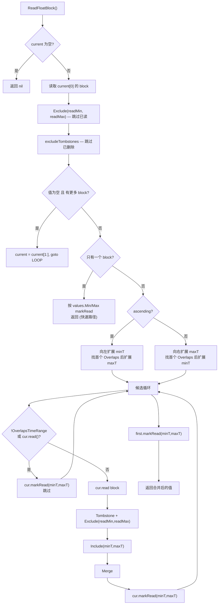

### 3.9 ReadFloatArrayBlock — 数组格式的同一套归并逻辑

`ReadFloatArrayBlock` 位于 `file_store_array.gen.go:12`，和 `ReadFloatBlock` 的控制流一致，只是值容器从 `[]FloatValue` 换成 `*tsdb.FloatArray`，读取接口也变成只返回 error：

```go
func (c *KeyCursor) ReadFloatArrayBlock(values *tsdb.FloatArray) (*tsdb.FloatArray, error) {
LOOP:
    if len(c.current) == 0 {
        values.Timestamps = values.Timestamps[:0]
        values.Values = values.Values[:0]
        return values, nil
    }

    first := c.current[0]
    if err := first.r.ReadFloatArrayBlockAt(&first.entry, values); err != nil {
        return nil, err
    }
    values.Exclude(first.readMin, first.readMax)
    excludeTombstonesFloatArray(first.r.TombstoneRange(c.key), values)

    if values.Len() == 0 && len(c.current) > 0 {
        c.current = c.current[1:]
        goto LOOP
    }
    if len(c.current) == 1 {
        if values.Len() > 0 { first.markRead(values.MinTime(), values.MaxTime()) }
        return values, nil
    }

    minT, maxT := first.readMin, first.readMax
    if values.Len() > 0 {
        minT, maxT = values.MinTime(), values.MaxTime()
    }

    if c.ascending {
        // 升序向左扩展 minT；首个 overlap 可把 maxT 向右扩展
        values.Include(minT, maxT)
        // 对每个候选: ReadFloatArrayBlockAt → Exclude → Include → values.Merge(v)
    } else {
        // 降序向右扩展 maxT；首个 overlap 可把 minT 向左扩展
        values.Include(minT, maxT)
        // 对每个候选: ReadFloatArrayBlockAt → Exclude → Include → v.Merge(values); *values = *v
    }

    first.markRead(minT, maxT)
    return values, nil
}
```

**metrics 计数**: 每解码一个数组 block，同样增加 `float_blocks_decoded` 和 `float_blocks_size_bytes`；发生归并时统计 `float_blocks_merge_duration`、`float_blocks_merge_count`、`float_blocks_merge_values_count`，当单次读取归并次数超过 4 时增加 `float_blocks_merge_over4_count`。

#### 3.9.1 数组变体的原地修改语义与 `*values = *v` 指针交换

`ReadFloatArrayBlock` (file_store_array.gen.go:12) 与 `ReadFloatBlock` (file_store.gen.go:10) 控制流一致，但**值容器从 `[]FloatValue` 换成 `*tsdb.FloatArray`**，导致两类关键差异:

1. **原地修改而非返回新切片**: `[]FloatValue` 变体里 `values = values.Exclude(...)` 是把局部变量重新指向新切片；数组变体里 `values.Exclude(...)` / `values.Include(...)` / `excludeTombstonesFloatArray(...)` 全部是**原地修改** `values.Timestamps` 和 `values.Values` 两个底层数组（方法无返回值，直接改 receiver）。这意味着 first block 的 `Exclude(readMin, readMax)` 直接破坏性裁剪了调用方传入的 `values`。

2. **降序归并用 `v.Merge(values)` + `*values = *v` 指针交换**: `[]FloatValue` 变体降序分支是 `values = v.Merge(values)`（`Merge` 返回新切片，重新赋值给局部 `values`）。数组变体由于 `Merge` 也是原地修改 receiver，无法直接 `values = v.Merge(values)`；代码先 `v.Merge(values)`（把 `values` 的内容并进临时 `v`），再用 `*values = *v` 把 `v` 的 `Timestamps`/`Values` 切片头整体拷贝回 `values`，完成"逻辑赋值"。

```go
// tsdb/engine/tsm1/file_store_array.gen.go:36 — 原地 Exclude (无返回值)
    // Remove values we already read
    values.Exclude(first.readMin, first.readMax)

    // Remove any tombstones
    tombstones := first.r.TombstoneRange(c.key)
    excludeTombstonesFloatArray(tombstones, values)   // 同样原地修改
```

```go
// tsdb/engine/tsm1/file_store_array.gen.go:99-125 — 升序归并: values.Merge(v) (原地并入 v 的内容到 values)
            v := &tsdb.FloatArray{}
            err := cur.r.ReadFloatArrayBlockAt(&cur.entry, v)
            // ...
            v.Exclude(cur.readMin, cur.readMax)

            if v.Len() > 0 {
                v.Include(minT, maxT)
                mergeValuesCount += len(v.Timestamps)
                values.Merge(v)          // 升序: 把候选 v 并入 first values (原地)
                mergeCount++
            }
            cur.markRead(minT, maxT)
```

```go
// tsdb/engine/tsm1/file_store_array.gen.go:181-188 — 降序归并: v.Merge(values) + *values = *v
            if v.Len() > 0 {
                v.Include(minT, maxT)
                mergeValuesCount += len(v.Timestamps)
                v.Merge(values)          // 降序: 把 first values 并入候选 v (方向相反)
                mergeCount++
                *values = *v             // 指针交换: 把 v 的切片头整体拷回 values
            }
            cur.markRead(minT, maxT)
```

> **为什么降序要反向?** 升序返回时相同时间戳取**更高 generation**（更新）的值优先，候选 `v` 覆盖 `values`，所以 `values.Merge(v)`。降序返回时语义相反——相同时间戳要保留 `values`（first block, 更高 generation）的值，所以用 `v.Merge(values)` 让 `values` 覆盖 `v`，再把结果切回 `values`。这与 `ReadFloatBlock` 降序分支的 `values = v.Merge(values)` 语义完全对应，只是数组变体受限于原地 API，多了一步 `*values = *v`。

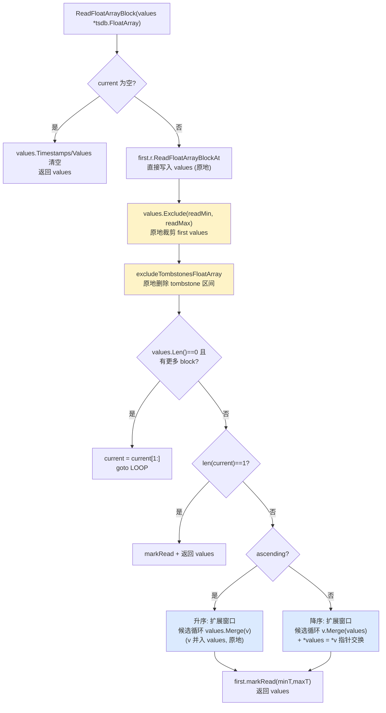

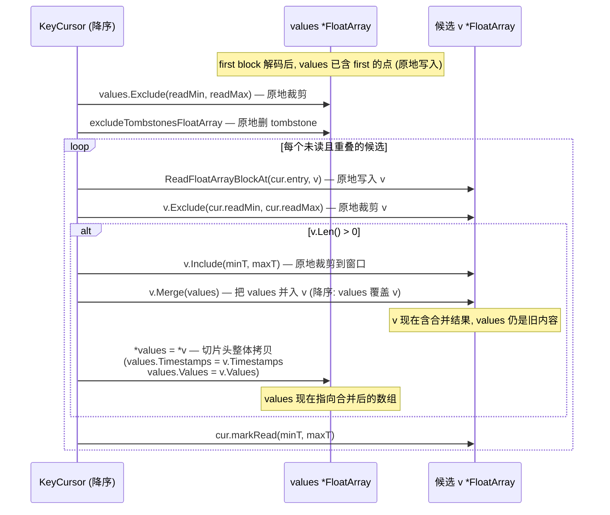

**案例 (降序, 两 block 重叠, 对比 []FloatValue 与 FloatArray 的合并方向)**:

```
TSM1 (gen=2): block [500-700], 值 = [(500,10),(600,20),(700,30)]
TSM2 (gen=1): block [400-600], 值 = [(400,40),(500,50),(600,60)]

降序查询, first = TSM1 (MaxTime 大), 候选 = TSM2
窗口经扩展后 minT=400, maxT=700

[]FloatValue 变体 (ReadFloatBlock 降序):
  values (first) = [(500,10),(600,20),(700,30)]
  v (候选 TSM2) = [(400,40),(500,50),(600,60)]
  v.Include(400,700) → v 不变
  values = v.Merge(values)
    Merge 语义: 同时间戳取参数 (values, 即 first/gen=2) 的值
    结果 = [(400,40),(500,10),(600,20),(700,30)]
    (500 和 600 保留 first 的 10/20, 因为 first generation 更高)

FloatArray 变体 (ReadFloatArrayBlock 降序):
  values (first) timestamps=[500,600,700] values=[10,20,30]
  v (候选 TSM2) timestamps=[400,500,600] values=[40,50,60]
  v.Include(400,700) → v 不变 (原地)
  v.Merge(values)
    Merge 原地修改 v 的 receiver: 同时间戳取 values (first/gen=2) 的值
    v.timestamps = [400,500,600,700]  v.values = [40,10,20,30]  (原地扩容 v)
  *values = *v
    values.Timestamps = [400,500,600,700]
    values.Values     = [40,10,20,30]

两者最终语义一致: [(400,40),(500,10),(600,20),(700,30)]
区别仅在实现: []FloatValue 用返回值赋值, FloatArray 用原地 Merge + 切片头拷贝。
```

### 3.10 KeyCursor.Close — 释放引用

```go
// tsdb/engine/tsm1/file_store.go:1473 — Close
func (c *KeyCursor) Close() {
    for _, l := range c.seeks {
        l.r.Unref()  // 减少引用计数
    }
    c.buf = nil
    c.seeks = nil
    c.current = nil
}
```

**引用计数的作用**: 确保 `FileStore.Replace()` 不会在查询进行中删除文件。只有当 `InUse() == false`（`refs == 0`）时，文件才会被真正删除。

## 4. 排序类型

### 4.1 ascLocations — 升序排序

```go
// tsdb/engine/tsm1/file_store.go:1434 — ascLocations
type ascLocations []*location

func (a ascLocations) Len() int      { return len(a) }
func (a ascLocations) Swap(i, j int) { a[i], a[j] = a[j], a[i] }
func (a ascLocations) Less(i, j int) bool {
    if a[i].entry.OverlapsTimeRange(a[j].entry.MinTime, a[j].entry.MaxTime) {
        return a[i].r.Path() < a[j].r.Path()  // 重叠时按路径排序
    }
    return a[i].entry.MinTime < a[j].entry.MinTime
}
```

### 4.2 descLocations — 降序排序

```go
// tsdb/engine/tsm1/file_store.go:1422 — descLocations
type descLocations []*location

func (a descLocations) Len() int      { return len(a) }
func (a descLocations) Swap(i, j int) { a[i], a[j] = a[j], a[i] }
func (a descLocations) Less(i, j int) bool {
    if a[i].entry.OverlapsTimeRange(a[j].entry.MinTime, a[j].entry.MaxTime) {
        return a[i].r.Path() < a[j].r.Path()
    }
    return a[i].entry.MaxTime < a[j].entry.MaxTime
}
```

## 5. mergeKeyIterator — 跨文件键遍历

### 5.1 结构体

```go
// tsdb/engine/tsm1/file_store_key_iterator.go:41 — mergeKeyIterator
type mergeKeyIterator struct {
    itrs keyIterators   // 最小堆 (按 key 排序)
    key  []byte          // 当前合并后的 key
    typ  byte            // 当前 key 的类型
}
```

### 5.2 使用场景

`FileStore.WalkKeys()` 使用 `mergeKeyIterator` 遍历所有文件中的所有唯一 key（按字典序排序）。这在以下场景中使用：
- `FileStore.Keys()` — 获取所有 key
- Compaction — 需要按 key 顺序合并多个文件

```go
// tsdb/engine/tsm1/file_store.go:346 — WalkKeys
func (f *FileStore) WalkKeys(seek []byte, fn func(key []byte, typ byte) error) error {
    f.mu.RLock()
    files := make([]TSMFile, len(f.files))
    copy(files, f.files)
    f.mu.RUnlock()

    ki := newMergeKeyIterator(files, seek)
    for ki.Next() {
        key, typ := ki.Read()
        if err := fn(key, typ); err != nil {
            return err
        }
    }
    return nil
}
```

### 5.3 堆实现

```go
// tsdb/engine/tsm1/file_store_key_iterator.go:99 — keyIterators
type keyIterators []*keyIterator

func (k keyIterators) Len() int           { return len(k) }
func (k keyIterators) Less(i, j int) bool { return bytes.Compare(k[i].key, k[j].key) == -1 }
func (k keyIterators) Swap(i, j int)      { k[i], k[j] = k[j], k[i] }
func (k *keyIterators) Push(x interface{}) { *k = append(*k, x.(*keyIterator)) }
func (k *keyIterators) Pop() interface{} {
    old := *k
    n := len(old)
    x := old[n-1]
    *k = old[:n-1]
    return x
}
```

#### 5.3.1 min-heap K-way 归并的 Next 逻辑

`keyIterators` 是一个最小堆（`Less` 用 `bytes.Compare` 比较 `key`，小的在堆顶），`mergeKeyIterator.Next()` 每次取出堆顶（当前最小 key）的迭代器，推进它一次，再 `heap.Fix` 重新堆化。关键的去重逻辑: 如果刚取出的 key 与上一次返回的 `m.key` 相同（`merging && bytes.Equal(m.key, key)`），说明这个 key 在多个文件里都出现了，跳过它继续 RETRY，直到遇到一个新 key 才返回——这保证 `WalkKeys` 对每个唯一 key 只回调一次。

```go
// tsdb/engine/tsm1/file_store_key_iterator.go:61 — Next
func (m *mergeKeyIterator) Next() bool {
    merging := len(m.itrs) > 1

RETRY:
    if len(m.itrs) == 0 {
        return false
    }

    // 堆顶 = 当前最小 key 的迭代器
    key, typ := m.itrs[0].key, m.itrs[0].typ
    more := m.itrs[0].next()                         // 推进堆顶迭代器到下一个 key

    switch {
    case len(m.itrs) > 1:
        if !more {
            heap.Pop(&m.itrs)                        // 迭代器耗尽, 从堆中移除
        } else {
            heap.Fix(&m.itrs, 0)                     // 推进后 key 变大, 下沉到正确位置
        }
    case len(m.itrs) == 1:
        if !more {
            m.itrs = nil                             // 最后一个迭代器耗尽
        }
    }

    // 去重: 如果这个 key 和上一个返回的相同, 说明多文件都有它, 跳过
    if merging && bytes.Equal(m.key, key) {
        goto RETRY
    }

    m.key, m.typ = key, typ
    return true
}
```

```go
// tsdb/engine/tsm1/file_store_key_iterator.go:99 — keyIterators (min-heap)
type keyIterators []*keyIterator

func (k keyIterators) Len() int            { return len(k) }
func (k keyIterators) Less(i, j int) bool  { return bytes.Compare(k[i].key, k[j].key) == -1 }
func (k keyIterators) Swap(i, j int)       { k[i], k[j] = k[j], k[i] }
func (k *keyIterators) Push(x interface{}) { *k = append(*k, x.(*keyIterator)) }
func (k *keyIterators) Pop() interface{} {
    old := *k
    n := len(old)
    x := old[n-1]
    *k = old[:n-1]
    return x
}
```

> **堆不变量**: `heap.Init` 后，`m.itrs[0]` 总是持有当前最小 key 的迭代器。每次 `Next` 推进堆顶后调用 `heap.Fix(&m.itrs, 0)`——因为迭代器的 `key` 只会增大（文件内 key 有序），推进后的堆顶元素可能不再是最小，需要下沉。迭代器耗尽时 `more == false`，用 `heap.Pop` 移除（内部会 `Swap` 末尾元素到堆顶再下沉）。

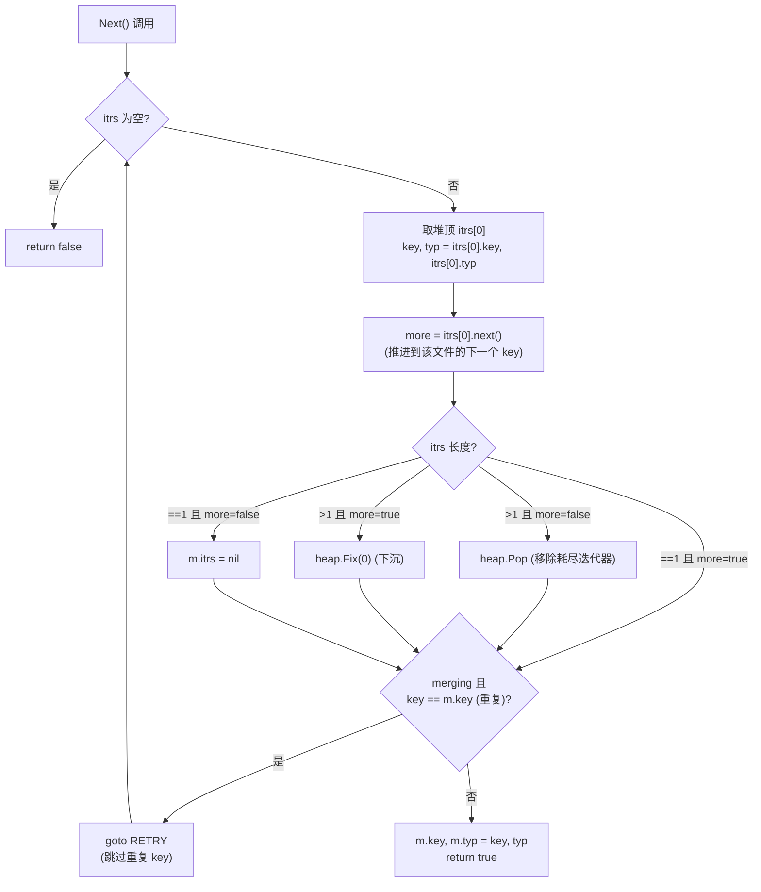

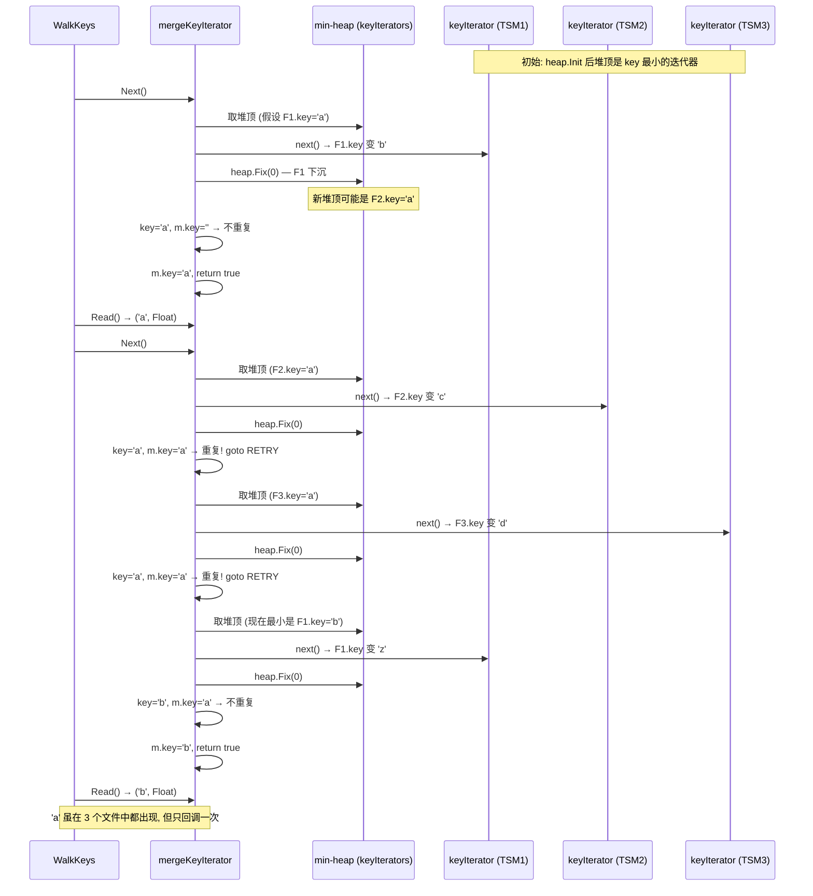

**案例 (3 文件 key 重叠, K-way 归并去重)**:

```
TSM1 keys (有序): ["a", "b", "z"]
TSM2 keys (有序): ["a", "c", "y"]
TSM3 keys (有序): ["a", "d", "x"]

newMergeKeyIterator → heap.Init:
  堆状态 (按 key 最小堆):
    itrs[0] = F1 (key="a")  ← 堆顶
    itrs[1] = F2 (key="a")
    itrs[2] = F3 (key="a")
  (三者 key 相同, Less 用 bytes.Compare == -1 为 false, 堆顺序由 heap.Init 决定)

Next() 调用序列:

1. Next():
   堆顶 F1.key="a", F1.next() → F1.key="b", heap.Fix(0)
   key="a", m.key="" → 不重复
   m.key="a", return true → Read() = ("a", Float)

2. Next():
   堆顶 F2.key="a", F2.next() → F2.key="c", heap.Fix(0)
   key="a" == m.key="a" → 重复! RETRY
   堆顶 F3.key="a", F3.next() → F3.key="d", heap.Fix(0)
   key="a" == m.key="a" → 重复! RETRY
   堆顶 F1.key="b", F1.next() → F1.key="z", heap.Fix(0)
   key="b" != m.key="a" → 不重复
   m.key="b", return true → Read() = ("b", Float)

3. Next():
   堆顶 F3.key="d", F3.next() → F3.key="x", heap.Fix(0)
   key="d" != m.key="b" → 不重复
   m.key="d", return true → Read() = ("d", Float)

4. Next():
   堆顶 F3.key="x", F3.next() → F3 耗尽, heap.Pop (移除 F3)
   key="x" != m.key="d" → 不重复
   m.key="x", return true → Read() = ("x", Float)

5. Next():
   堆顶 F2.key="c" (重新堆化后), F2.next() → F2.key="y", heap.Fix(0)
   key="c" != m.key="x" → 不重复
   m.key="c", return true → Read() = ("c", Float)

6. Next():
   堆顶 F2.key="y", F2.next() → F2 耗尽, heap.Pop
   key="y" != m.key="c" → 不重复
   m.key="y", return true → Read() = ("y", Float)

7. Next():
   堆顶 F1.key="z", F1.next() → F1 耗尽, itrs=nil (最后一个)
   key="z" != m.key="y" → 不重复
   m.key="z", return true → Read() = ("z", Float)

8. Next(): itrs=nil → return false

最终 WalkKeys 回调顺序: a, b, d, x, c, y, z
关键性质: "a" 只回调一次 (3 文件去重); 其余 key 各文件唯一, 按堆顶最小逐步输出。
每个唯一 key 恰好回调一次, 即使它在 N 个文件中都存在。
```

## 6. Observer 模式

### 6.1 FileStoreObserver 接口

```go
// tsdb/engine.go:218 — FileStoreObserver
type FileStoreObserver interface {
    FileFinishing(path string) error   // 文件即将完成 (rename 前)
    FileUnlinking(path string) error   // 文件即将删除 (remove 前)
}
```

### 6.2 noFileStoreObserver — 默认实现

```go
// tsdb/engine/tsm1/file_store_observer.go:1 — noFileStoreObserver
type noFileStoreObserver struct{}

func (noFileStoreObserver) FileFinishing(path string) error { return nil }
func (noFileStoreObserver) FileUnlinking(path string) error { return nil }
```

**Enterprise 用途**: 在 Enterprise 版本中，Observer 用于通知复制系统：新文件即将可用（FileFinishing）或旧文件即将删除（FileUnlinking）。

## 7. 具体案例

### 7.1 多文件查询归并案例

> **场景**: 查询 `cpu,host=web#!~#value` 的数据，seekTime=500，ascending=true
>
> TSM 文件状态:
> - 文件 1 (最新, Level 2): block [100, 300], [400, 600]
> - 文件 2 (较旧, Level 1): block [200, 500]
> - 文件 3 (最旧, Level 0): block [100, 200]

```
locations() 结果:
  L1: {file1, entry[100-300], readMin=MinInt64, readMax=499}
  L2: {file1, entry[400-600], readMin=MinInt64, readMax=499}
  L3: {file2, entry[200-500], readMin=MinInt64, readMax=499}
  L4: {file3, entry[100-200], readMin=MinInt64, readMax=499}

排序 (ascLocations by MinTime):
  L4: [100-200] (file3)
  L1: [100-300] (file1)
  L3: [200-500] (file2)
  L2: [400-600] (file1)

seek(500):
  pos=0: L4.MinTime=100 < 500, L4.MaxTime=200 < 500 → 跳过
  pos=1: L1.MinTime=100 < 500, L1.MaxTime=300 < 500 → 跳过
  pos=2: L3.MinTime=200 < 500, L3.Contains(500)? 200 <= 500 && 500 <= 500 → 包含!
          pos = 2，并从这里开始把未读候选 location 加入 current
  pos=3: L2.MinTime=400 < 500, L2.Contains(500)? 400 <= 500 && 500 <= 600 → 包含!
          同样加入 current

nextAscending():
  pos=2, current 包含 [L3, L2] 等候选
  nextAscending 本身不做最终 overlap 裁剪；生成代码 ReadFloatBlock 会根据 first block
  扩张/收缩窗口、解码候选 block、排除已读范围并归并。

ReadFloatBlock(current):
  L3 values = [200:20, 500:50]
  L2 values = [400:40, 500:55, 600:60]
  Exclude(readMin=MinInt64, readMax=499) → 保留 >=500 的点
  excludeTombstones → 无 tombstone → 继续归并候选 block
  markRead(minT, maxT)

返回: 根据归并和同时间戳覆盖规则得到的窗口结果
```

### 7.2 Tombstone 过滤案例

> **场景**: 用户执行 `DELETE FROM cpu WHERE host='web' AND time >= 200 AND time < 500`
>
> Tombstone: {Key: "cpu,host=web#!~#value", Min: 200, Max: 499}

```
TSM 文件: block [100, 600]

ReadFloatBlock():
  values = [100:10, 200:20, 300:30, 400:40, 500:50, 600:60]

  excludeTombstonesFloatValues(tombstones, values):
    tombstone = {Min: 200, Max: 499}
    排除 [200, 499] 范围内的值
    → [100:10, 500:50, 600:60]

返回: [100:10, 500:50, 600:60]
```

#### 7.2.1 locations() 的 tombstone 仅跳过"完全覆盖"的 block —— 部分覆盖留到 excludeTombstones 处理

`locations()` (file_store.go:1136) 中的 tombstone 跳过条件是 `t.Min <= ie.MinTime && t.Max >= ie.MaxTime`——**只有当 tombstone 区间完全覆盖整个 block 的时间范围 `[ie.MinTime, ie.MaxTime]` 时才 `continue LOOP` 跳过**。如果 tombstone 只覆盖 block 的一部分（例如覆盖了 `MinTime` 但没覆盖 `MaxTime`），block **不会被跳过**，会被正常创建为 `location` 加入 `seeks`。这些部分覆盖的 block 后续在 `ReadFloatBlock` / `ReadFloatArrayBlock` 里通过 `excludeTombstonesFloatValues` / `excludeTombstonesFloatArray` 做点级删除。

```go
// tsdb/engine/tsm1/file_store.go:1156 — locations 的 tombstone 跳过 (仅完全覆盖)
    LOOP:
        for i := 0; i < len(entries); i++ {
            ie := entries[i]

            // Skip any blocks only contain values that are tombstoned.
            for _, t := range tombstones {
                if t.Min <= ie.MinTime && t.Max >= ie.MaxTime {   // ← 完全覆盖才跳过
                    continue LOOP
                }
            }
            // ... 时间范围检查, 创建 location ...
```

```go
// tsdb/engine/tsm1/file_store.gen.go — excludeTombstonesFloatValues (点级删除, Read 阶段)
// 在 ReadFloatBlock 中对 first block 和每个候选 block 调用:
    tombstones := first.r.TombstoneRange(c.key)
    values = excludeTombstonesFloatValues(tombstones, values)
```

> **设计意图**: 在 `locations()` 阶段只做"粗筛"——完全 tombstone 的 block 直接跳过，避免无谓的 mmap 解码。部分覆盖的 block 仍可能含有有效数据，必须先解码再按点过滤。如果在 `locations()` 阶段就按点判断，需要解码每个 block 的时间戳，违背了 `locations()` 只看 IndexEntry（O(1) 元数据）的设计。

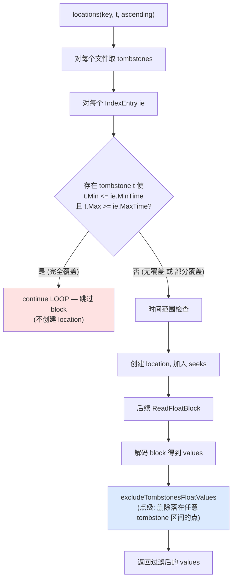

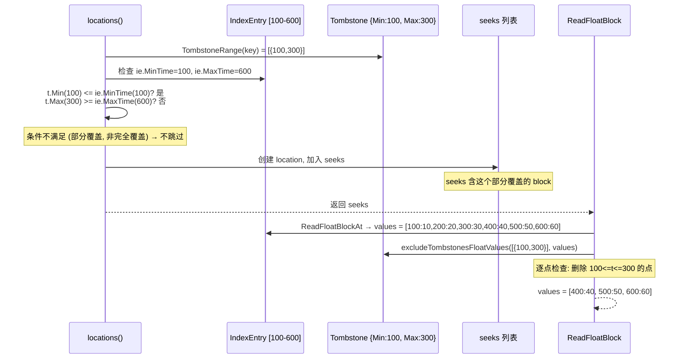

**案例 (部分覆盖 tombstone, 不在 locations 跳过, 留到 Read 阶段过滤)**:

```
TSM 文件: block [100-600], 值 = [(100,10),(200,20),(300,30),(400,40),(500,50),(600,60)]
Tombstone: {Key: "cpu,host=web#!~#value", Min: 100, Max: 300}  ← 只覆盖前半段

locations(key, t=50, ascending=true):
  tombstones = [{100, 300}]
  ie = {MinTime:100, MaxTime:600}
  检查: t.Min(100) <= ie.MinTime(100)? 是
        t.Max(300) >= ie.MaxTime(600)? 否  → 条件不满足, 不 continue LOOP
  → location L = {file, ie[100-600], readMin=MinInt64, readMax=49}  ← 被加入 seeks!

对比: 如果 tombstone 是 {Min:100, Max:600} (完全覆盖):
  t.Min(100) <= 100? 是; t.Max(600) >= 600? 是 → continue LOOP, block 被跳过, 不创建 location

ReadFloatBlock(L) (实际读取时):
  values = [(100,10),(200,20),(300,30),(400,40),(500,50),(600,60)]
  Exclude(readMin=MinInt64, readMax=49) → 无变化 (都 >= 50)
  excludeTombstonesFloatValues([{100,300}], values):
    逐点: 100∈[100,300] 删; 200∈[100,300] 删; 300∈[100,300] 删; 400,500,600 保留
    → values = [(400,40),(500,50),(600,60)]
  返回: [(400,40),(500,50),(600,60)]

总结:
  - locations() 阶段: 部分覆盖的 block 不跳过 (避免解码), 进入 seeks
  - Read 阶段: excludeTombstones 做点级删除, 才真正剔除 tombstone 区间内的点
  - 这种两阶段设计让 locations() 保持 O(entries) 仅看元数据, 把点级开销推迟到必须解码时
```

### 7.3 引用计数保护案例

> **场景**: 查询正在读取文件 A，同时 Compaction 尝试替换文件 A

```
t=0ms    查询: KeyCursor 创建, A.Ref() → A.refs = 1
t=1ms    查询: ReadFloatBlock(A, entry) → 正在解码...
t=2ms    Compaction: FileStore.Replace([A], [B])
           - A.InUse()? A.refs = 1 → true
           - A.Rename(A.tmp)
           - purger.add([A])
t=3ms    查询: ReadFloatBlock(A, entry) → 继续解码... (文件仍在, 只是改了名)
t=100ms  查询: KeyCursor.Close() → A.Unref() → A.refs = 0
t=101ms  purger: A.InUse()? A.refs = 0 → false
           - A.Close()
           - A.Remove()
           - 文件 A 真正被删除
```

## 8. 架构设计意图

### 8.1 为什么用 mmap 而非 read()

| 维度 | mmap | read() |
|------|------|--------|
| 系统调用 | 1 次 (映射) | N 次 (每次读取) |
| 内存拷贝 | 0 次 (零拷贝) | 2 次 (内核→用户) |
| 缓存管理 | OS 自动 (page cache) | 手动管理 |
| 预读 | OS 自动 (MADV_SEQUENTIAL) | 需要 posix_fadvise |

### 8.2 为什么用引用计数而非读写锁

| 维度 | 引用计数 | 读写锁 |
|------|---------|--------|
| 文件级粒度 | 每个文件独立 | 全局或分区级 |
| 查询不阻塞写入 | 是 (Ref/Unref 是原子操作) | 否 (读锁阻塞写锁) |
| 内存开销 | 1 个 int64/文件 | 1 个 RWMutex/文件 |
| 实现复杂度 | 低 | 中 |

### 8.3 为什么 location 需要 readMin/readMax

当 `seekTime` 不在 block 的起始位置时（如 seekTime=500, block=[100, 600]），`[100, 499]` 范围的数据不应被返回（它们在 seekTime 之前）。`readMin/readMax` 标记这些数据为"已读"，`ReadFloatBlock` 中的 `Exclude()` 会自动跳过。

## 9. 潜在隐患与瓶颈

### 9.1 locations() 的 O(files × entries) 复杂度

```go
for _, fd := range f.files {
    entries := fd.ReadEntries(key, &cache)
    for i := 0; i < len(entries); i++ {
        // 检查 tombstone, 检查时间范围
    }
}
```

文件数量多时（如 1000+ 个 TSM 文件），`locations()` 遍历所有文件的 Index，可能成为性能瓶颈。

### 9.2 ReadFloatBlock 的重叠归并开销

当多个 compaction 级别有大量重叠 block 时，`ReadFloatBlock` 需要解码所有重叠 block 并归并排序。这会显著增加 CPU 和内存开销。

### 9.3 purger 的 1 秒轮询

```go
time.Sleep(time.Second)
```

如果查询持续很长时间（如 10 分钟），被替换的文件会一直占用磁盘空间直到查询结束 + 1 秒。在极端情况下，可能导致磁盘空间不足。

### 9.4 排序稳定性

`ascLocations` 和 `descLocations` 使用 `Less` 函数中按路径排序作为 tie-breaker。这意味着相同时间范围的 block 按文件路径排序，而不是按 compaction 级别。在某些边缘情况下，这可能导致合并结果的值不是来自最新的 compaction 级别。

## 10. 关键文件索引

| 文件 | 行数 | 职责 |
|------|------|------|
| `tsdb/engine/tsm1/file_store.go` | 1704 | FileStore 生命周期、KeyCursor、location、purger、TSMFile 接口 |
| `tsdb/engine/tsm1/file_store.gen.go` | 934 | 生成代码: ReadFloatBlock、ReadIntegerBlock 等 5 种类型 + tombstone 排除 |
| `tsdb/engine/tsm1/file_store_array.gen.go` | 928 | 生成代码: ReadFloatArrayBlock 等 5 种数组类型 + tombstone 排除 |
| `tsdb/engine/tsm1/file_store_key_iterator.go` | 113 | keyIterator、mergeKeyIterator (最小堆归并) |
| `tsdb/engine/tsm1/file_store_observer.go` | 7 | noFileStoreObserver (OSS 默认实现) |
