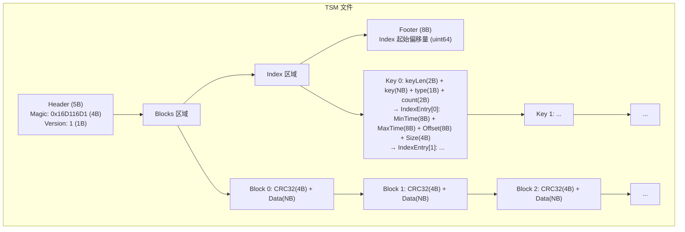
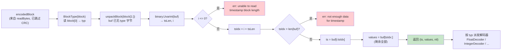
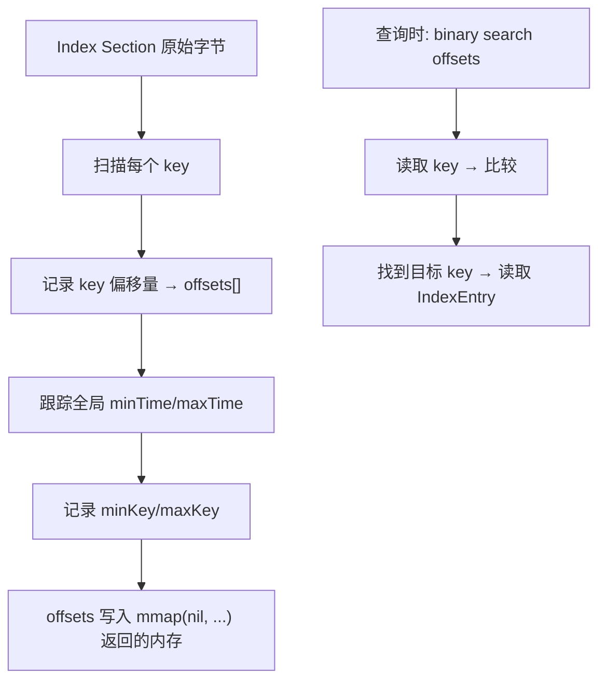
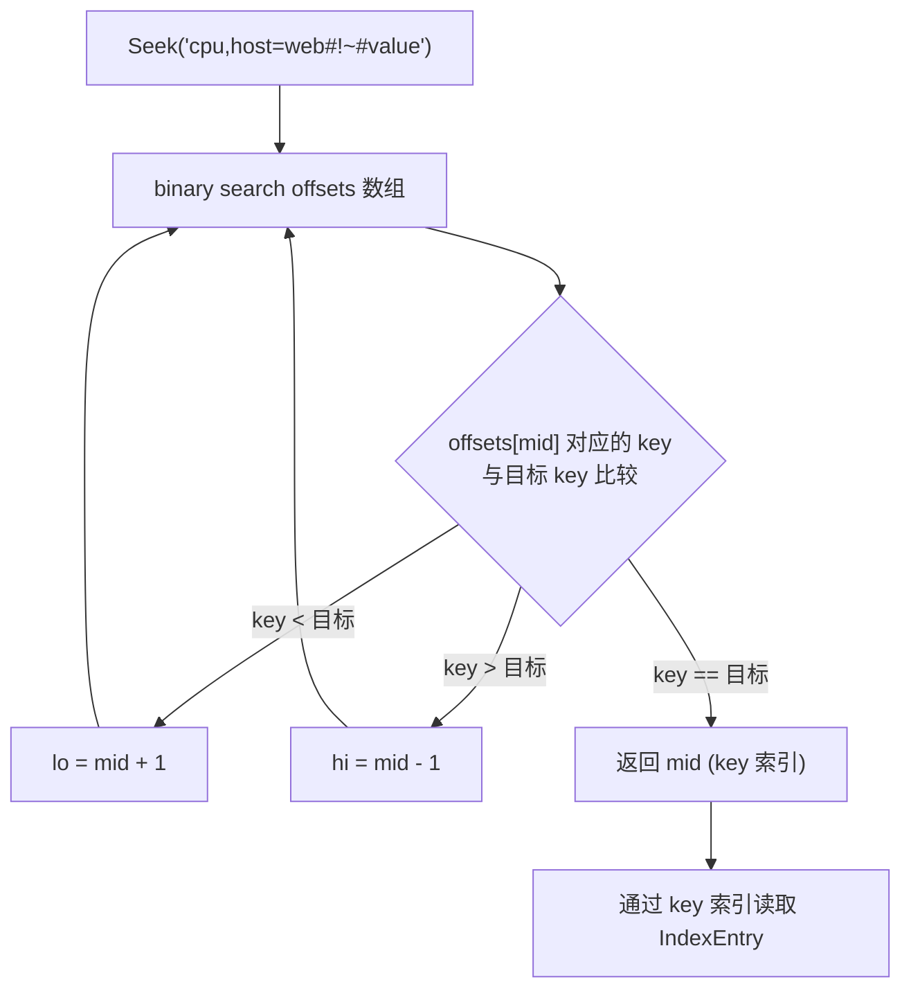
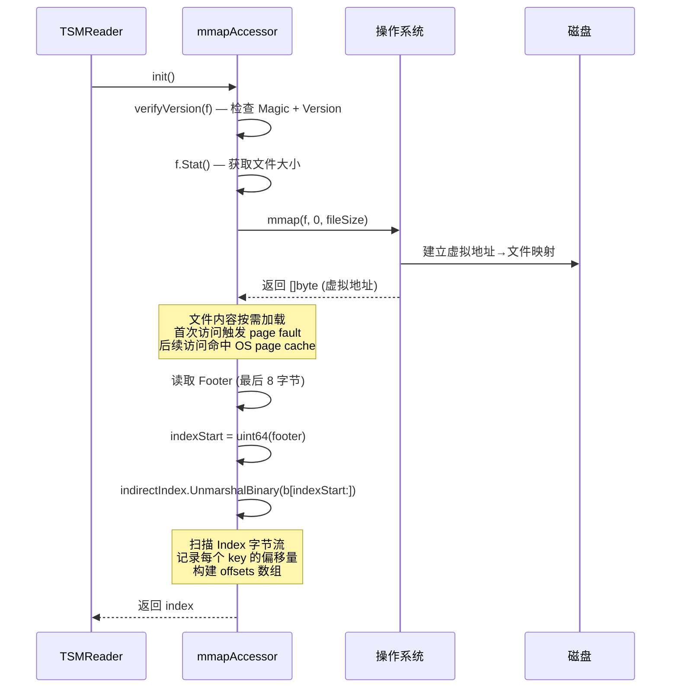
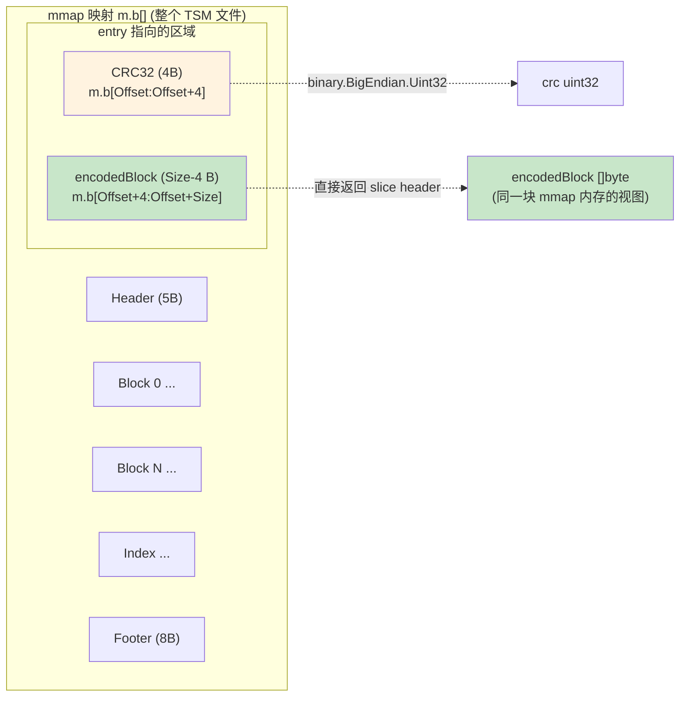
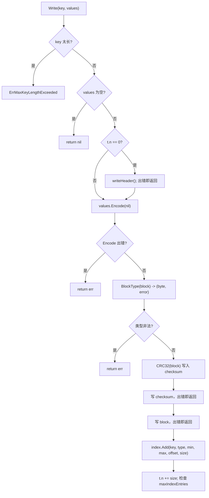
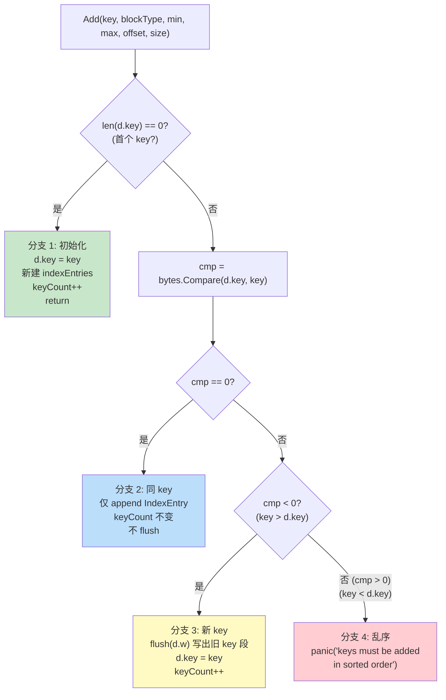
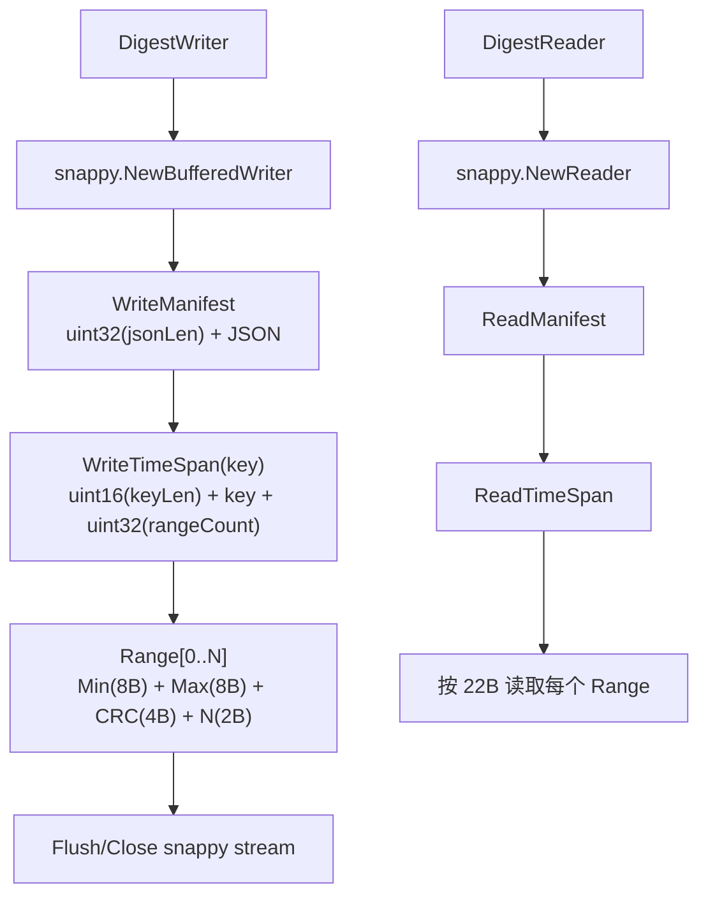

# Module 17: TSM 文件格式规范 (四段布局 + 间接索引 + mmap 零拷贝 + BitReader + Digest) - 深度审计报告

> **小白导读**: 想象一本**超级字典**。
>
> - **Header（封面）** = 书名和版本号（5 个字节）
> - **Blocks（正文）** = 每一页是一个数据块，记录了某个 key 的一段时间的数据
> - **Index（目录）** = 记录每个 key 在哪一页、时间范围是什么
> - **Footer（书签）** = 告诉你目录在第几页（8 个字节）
>
> 查找数据时：**先看书签(Footer) → 翻到目录(Index) → 二分查找 key → 翻到对应页(Block) → 读取数据**
>
> - **mmap** = 把整本书"传送"到你的桌子上（内存映射），翻页变成直接看，不需要每次都去书架取
> - **indirectIndex** = 目录的"速查卡"——记录每个 key 在目录中的偏移位置，用二分查找快速定位
> - **BitReader** = 一个"逐位阅读器"——用于 Gorilla 压缩算法，一次读取 1-64 个 bit
> - **Digest** = 书的"摘要"——用于备份恢复时快速校验数据完整性
>
> **关键设计**：
> - TSM 文件是**不可变的**——一旦写入，内容不再修改
> - Index 在文件末尾，写入时可以边写 block 边构建 index
> - mmap 使得读取操作变为**零拷贝**——直接在 page cache 中操作
> - Footer 只有 8 字节，指向 Index 的起始位置

## 1. TSM 文件格式总览

### 1.1 四段布局

```
┌────────┬────────────────────────────────────┬─────────────┬──────────────┐
│ Header │               Blocks               │    Index    │    Footer    │
│5 bytes │              N bytes               │   N bytes   │   8 bytes    │
└────────┴────────────────────────────────────┴─────────────┴──────────────┘
```

### 1.2 完整文件格式图



### 1.3 各段详解

| 段 | 大小 | 内容 | 说明 |
|---|------|------|------|
| **Header** | 5 字节 | MagicNumber (4B) + Version (1B) | 文件标识和版本 |
| **Blocks** | N 字节 | [CRC32(4B) + Data(NB)] × M | 实际数据，按 key 分组 |
| **Index** | N 字节 | 每个 key 的元数据 + block 条目 | 支持二分查找的索引 |
| **Footer** | 8 字节 | Index 起始偏移量 (uint64) | 指向 Index 的起始位置 |

## 2. Header — 文件头

### 2.1 格式

```
┌───────────────────┐
│  Magic   │ Version│
│ 4 bytes  │ 1 byte │
└───────────────────┘
```

### 2.2 常量

```go
// tsdb/engine/tsm1/writer.go:81 — MagicNumber
MagicNumber uint32 = 0x16D116D1

// tsdb/engine/tsm1/writer.go:84 — Version
Version byte = 1
```

### 2.3 verifyVersion — 验证文件头

```go
// tsdb/engine/tsm1/reader.go:1442 — verifyVersion
func verifyVersion(r io.Reader) error {
    // 1. 读取 4 字节 magic number
    var magic uint32
    if err := binary.Read(r, binary.BigEndian, &magic); err != nil {
        return fmt.Errorf("init: error reading magic number of file: %v", err)
    }

    // 2. 读取 1 字节版本
    var version byte
    if err := binary.Read(r, binary.BigEndian, &version); err != nil {
        return fmt.Errorf("init: error reading version: %v", err)
    }

    // 3. 校验 magic number
    if magic != MagicNumber {
        return fmt.Errorf("can only read from tsm file")
    }

    // 4. 校验版本
    if version != Version {
        return fmt.Errorf("init: file is version %b. expected %b", version, Version)
    }

    return nil
}
```

`verifyVersion` 由 `mmapAccessor.init()` 调用，用于在 mmap 前确认文件头是当前版本的
TSM 字节流；它本身只消费传入 reader 的前 5 字节，不执行 seek。

## 3. Blocks — 数据块

### 3.1 Block 格式

```
┌─────────┬─────────────────────────────────────┐
│  CRC32  │              Data                   │
│ 4 bytes │             N bytes                 │
└─────────┴─────────────────────────────────────┘
```

### 3.2 Data 内部格式 (packBlock)

```
┌──────┬─────────────────┬──────────────┬─────────────────┐
│ Type │ Timestamp Len   │  Timestamps  │     Values      │
│1 byte│ 1-10 bytes(uvi) │  N bytes     │    M bytes      │
└──────┴─────────────────┴──────────────┴─────────────────┘
```

```go
// tsdb/engine/tsm1/encoding.go:943 — packBlock
func packBlock(buf []byte, typ byte, ts []byte, values []byte) []byte {
    sz := 1 + binary.MaxVarintLen64 + len(ts) + len(values)
    if cap(buf) < sz {
        buf = make([]byte, sz)
    }
    b := buf[:sz]
    b[0] = typ                           // 字节 0: block 类型
    i := binary.PutUvarint(b[1:1+binary.MaxVarintLen64], uint64(len(ts)))  // varint: 时间戳块长度
    i += 1                               // 跳过 type 字节
    copy(b[i:], ts)                      // 时间戳压缩字节
    copy(b[i+len(ts):], values)          // 值压缩字节 (无长度前缀)
    return b[:i+len(ts)+len(values)]
}
```

### 3.3 Block 类型常量

```go
// tsdb/engine/tsm1/encoding.go:14-33
const (
    BlockFloat64  = byte(0)
    BlockInteger  = byte(1)
    BlockBoolean  = byte(2)
    BlockString   = byte(3)
    BlockUnsigned = byte(4)
)
```

### 3.4 压缩算法

| 类型 | 时间戳压缩 | 值压缩 |
|------|-----------|--------|
| Float | Delta + Scale + Simple8b/RLE/Uncompressed | Gorilla XOR |
| Integer | Delta + Scale + Simple8b/RLE/Uncompressed | Delta + ZigZag + Simple8b/RLE/Uncompressed |
| Unsigned | Delta + Scale + Simple8b/RLE/Uncompressed | Delta + ZigZag + Simple8b/RLE/Uncompressed |
| Boolean | Delta + Scale + Simple8b/RLE/Uncompressed | 位打包 (1 bit/值) |
| String | Delta + Scale + Simple8b/RLE/Uncompressed | Snappy |

> **注意**: 时间戳压缩有三种自适应模式: **RLE** (所有差值相按时), **Simple8b** (差值适合 60 位时), **Uncompressed** (差值过大时)。
> 值压缩中 Integer/Unsigned 使用相同的 IntegerEncoder，先做 Delta 编码，再 ZigZag 编码，最后 Simple8b 打包。

### 3.5 unpackBlock — packBlock 的读侧逆运算

`packBlock`（§3.2）把 `type + varint(tsLen) + ts + values` 拼成一段字节流。
`unpackBlock`（`tsdb/engine/tsm1/encoding.go:963`）做读侧逆运算：**它只负责拆出
`ts` 和 `values` 两段字节切片，不做类型解码**——type 字节由调用方用 `BlockType(block)`
单独从 `block[0]` 读出。

```go
// tsdb/engine/tsm1/encoding.go:226 — BlockType (读 type 字节)
func BlockType(block []byte) (byte, error) {
    blockType := block[0]
    switch blockType {
    case BlockFloat64, BlockInteger, BlockUnsigned, BlockBoolean, BlockString:
        return blockType, nil
    default:
        return 0, fmt.Errorf("unknown block type: %d", blockType)
    }
}

// tsdb/engine/tsm1/encoding.go:963 — unpackBlock (拆 ts / values)
func unpackBlock(buf []byte) (ts, values []byte, err error) {
    // 注意: buf 已经跳过了 type 字节, 即调用方传入的是 block[1:]
    // 第 1 步: 读 uvarint 得到 tsLen (时间戳压缩字节长度)
    tsLen, i := binary.Uvarint(buf)
    if i <= 0 {
        err = fmt.Errorf("unpackBlock: unable to read timestamp block length")
        return
    }

    // 第 2 步: 切出 ts 段
    tsIdx := int(i) + int(tsLen)
    if tsIdx > len(buf) {
        err = fmt.Errorf("unpackBlock: not enough data for timestamp")
        return
    }
    ts = buf[int(i):tsIdx]

    // 第 3 步: 剩余字节就是 values 段 (无长度前缀, 长度由 buf 剩余决定)
    values = buf[tsIdx:]
    return
}
```

调用链固定为两步：先 `BlockType(block)` 取类型，再 `unpackBlock(block[1:])` 拆 ts/values。
`tsdb/engine/tsm1/encoding.go:242` 的 `BlockCount` 和 `:251` 的 `DecodeBlock` 都遵循
这个模式（`tb, _, err := unpackBlock(block[1:])`）。



**case 说明 (拆解一个 float block)**:

假设有一个 `BlockFloat64` block，由 `packBlock` 写出，内容是 `[0x00][uvarint tsLen=8][8B ts][Gorilla XOR values]`。

```
encodedBlock (hex, 已跳过 CRC):
  00 08 01 00 00 00 00 00 03 e8  [ts=8B] [values=...Gorilla...]

BlockType(block):
  block[0] = 0x00 → BlockFloat64 ✓

unpackBlock(block[1:]):
  buf = block[1:] = 08 01 00 00 00 00 00 03 e8 ...
  binary.Uvarint(buf):
    buf[0] = 0x08 (< 0x80, 单字节 uvarint)
    → tsLen = 8, i = 1
  tsIdx = 1 + 8 = 9
  tsIdx(9) > len(buf)? 假设 buf 至少 9 字节 → 否
  ts = buf[1:9] = 01 00 00 00 00 00 03 e8   (8 字节时间戳压缩流)
  values = buf[9:] = ... (Gorilla XOR 压缩的 float 值流, 长度 = len(buf)-9)

后续 DecodeBlock 分支:
  switch typ {
  case BlockFloat64:
      var buf []FloatValue
      // 用 ts (IntegerDecoder 解时间戳) + values (FloatDecoder 解 Gorilla XOR)
      // 重建 []FloatValue
  }
```

关键边界行为：
- `unpackBlock` **不校验 type 字节**——传入 `block[1:]` 是调用方契约，传错（比如传整个 `block`）会把 type 字节当成 uvarint 第一字节解析，得到错误的 `tsLen`。
- `values = buf[tsIdx:]` 可能是空切片（如果 `tsLen` 恰好等于剩余长度），这对应 0 个值的 block；解码器会进一步处理。
- `binary.Uvarint` 在 `buf` 全零或损坏时返回 `i = 0`（重新读）或负数（溢出），`unpackBlock` 统一通过 `i <= 0` 拦截，避免 `ts = buf[0:tsIdx]` 用非法 `tsIdx` 越界。

## 4. Index — 索引区

### 4.1 每个 key 的索引结构

```
┌─────────┬─────────┬──────┬───────┬─────────┬─────────┬────────┬────────┐
│ Key Len │   Key   │ Type │ Count │Min Time │Max Time │ Offset │  Size  │
│ 2 bytes │ N bytes │1 byte│2 bytes│ 8 bytes │ 8 bytes │8 bytes │4 bytes │
└─────────┴─────────┴──────┴───────┴─────────┴─────────┴────────┴────────┘
```

### 4.2 IndexEntry — 28 字节

```go
// tsdb/engine/tsm1/writer.go:179 — IndexEntry
type IndexEntry struct {
    MinTime int64   // 8 字节: block 中最小时间戳
    MaxTime int64   // 8 字节: block 中最大时间戳
    Offset  int64   // 8 字节: block 在文件中的绝对偏移
    Size    uint32  // 4 字节: block 大小 (CRC32 + Data)
}  // 总计: 28 字节
```

### 4.3 IndexEntry 方法

```go
// tsdb/engine/tsm1/writer.go:191 — UnmarshalBinary
func (e *IndexEntry) UnmarshalBinary(b []byte) error {
    if len(b) < indexEntrySize {
        return fmt.Errorf("unmarshalBinary: short buf: %v < %v", len(b), indexEntrySize)
    }
    e.MinTime = int64(binary.BigEndian.Uint64(b[:8]))
    e.MaxTime = int64(binary.BigEndian.Uint64(b[8:16]))
    e.Offset = int64(binary.BigEndian.Uint64(b[16:24]))
    e.Size = binary.BigEndian.Uint32(b[24:28])
    return nil
}

// tsdb/engine/tsm1/writer.go:204 — AppendTo
func (e *IndexEntry) AppendTo(b []byte) []byte {
    if len(b) < indexEntrySize {
        if cap(b) < indexEntrySize {
            b = make([]byte, indexEntrySize)
        } else {
            b = b[:indexEntrySize]
        }
    }
    binary.BigEndian.PutUint64(b[:8], uint64(e.MinTime))
    binary.BigEndian.PutUint64(b[8:16], uint64(e.MaxTime))
    binary.BigEndian.PutUint64(b[16:24], uint64(e.Offset))
    binary.BigEndian.PutUint32(b[24:28], uint32(e.Size))
    return b
}

// tsdb/engine/tsm1/writer.go:223 — Contains
func (e *IndexEntry) Contains(t int64) bool {
    return e.MinTime <= t && e.MaxTime >= t
}

// tsdb/engine/tsm1/writer.go:228 — OverlapsTimeRange
func (e *IndexEntry) OverlapsTimeRange(min, max int64) bool {
    return e.MinTime <= max && e.MaxTime >= min
}
```

`indexEntrySize` 固定为 28 字节。`UnmarshalBinary` 先做短 buffer 检查，避免 `b[:8]`、`b[24:28]` 这类切片在损坏 index 上 panic。

### 4.4 Index 字节布局图

```
Index Section 字节布局:
┌─────────────────────────────────────────────────────────────┐
│ Key[0]: keyLen(2B) + key(NB) + type(1B) + count(2B)        │
│   → IndexEntry[0]: MinTime(8B) + MaxTime(8B) + Ofs(8B) + Sz(4B) │
│   → IndexEntry[1]: ...                                      │
│   → ...                                                     │
├─────────────────────────────────────────────────────────────┤
│ Key[1]: keyLen(2B) + key(NB) + type(1B) + count(2B)        │
│   → IndexEntry[0]: ...                                      │
│   → ...                                                     │
├─────────────────────────────────────────────────────────────┤
│ ...                                                         │
└─────────────────────────────────────────────────────────────┘
```

## 5. Footer — 文件尾

### 5.1 格式

```
┌─────────┐
│Index Ofs│
│ 8 bytes │
└─────────┘
```

### 5.2 写入

```go
// tsdb/engine/tsm1/writer.go:708 — WriteIndex
func (t *tsmWriter) WriteIndex() error {
    // 1. 记录当前偏移量 (Index 起始位置)
    indexPos := t.n

    // 2. 没有任何值时不能写空 index
    if t.index.KeyCount() == 0 {
        return ErrNoValues
    }

    // 3. 如果底层 writer 支持 Sync，把 syncer 交给 directIndex
    if f, ok := t.wrapped.(syncer); ok {
        t.index.(*directIndex).f = f
    }

    // 4. 写入所有 key 的索引
    if _, err := t.index.WriteTo(t.w); err != nil {
        return err
    }

    // 5. 写入 Footer: 8 字节 Index 偏移量
    var buf [8]byte
    binary.BigEndian.PutUint64(buf[:], uint64(indexPos))
    _, err := t.w.Write(buf[:])
    return err
}
```

> **注意**: `writer.go:8` 的文件头注释声称 Footer 是 "4 bytes"，这是**错误的**。
> 实际 `WriteIndex()` 使用 `binary.BigEndian.PutUint64` 写入 8 字节的 uint64。
> Footer 实际大小为 **8 字节**。

## 6. indirectIndex — 间接索引

### 6.1 结构体

```go
// tsdb/engine/tsm1/reader.go:814 — indirectIndex
type indirectIndex struct {
    mu      sync.RWMutex
    b       []byte              // Index Section 的原始字节 (mmap 引用)
    offsets []byte              // 每个 key 在 b 中的偏移量 (Unix: 匿名 mmap; Windows: heap slice)

    minKey  []byte              // 最小 key
    maxKey  []byte              // 最大 key
    minTime int64               // 全局最小时间戳
    maxTime int64               // 全局最大时间戳

    tombstones map[string][]TimeRange  // 内存中的 tombstone
}
```

### 6.2 UnmarshalBinary — 解析 Index Section

```go
// tsdb/engine/tsm1/reader.go:1325 — UnmarshalBinary
func (d *indirectIndex) UnmarshalBinary(b []byte) error {
    d.b = b  // 保存 Index 字节引用

    if len(b) == 0 {
        return nil
    }

    var offsets []int32
    var minTime, maxTime int64 = math.MaxInt64, 0
    var i int32
    iMax := int32(len(b))

    for i < iMax {
        offsets = append(offsets, i)  // 记录当前 key 的偏移

        // 边界检查: keyLen(2B) 需要至少 2 字节
        if i+2 >= iMax {
            return fmt.Errorf("indirectIndex: not enough data for key length value")
        }

        // 跳过 key: keyLen(2B) + type(1B) + key(NB)
        i += 3 + int32(binary.BigEndian.Uint16(b[i:i+2]))

        // 读取 block 条目数量
        count := int32(binary.BigEndian.Uint16(b[i : i+2]))
        i += 2

        // 记录最小时间戳 (第一个 block 的 MinTime)
        minT := int64(binary.BigEndian.Uint64(b[i : i+8]))
        if minT < minTime {
            minTime = minT
        }

        // 跳过中间的 block 条目
        i += (count - 1) * indexEntrySize  // indexEntrySize = 28

        // 边界检查: MaxTime 需要 16 字节
        if i+16 >= iMax {
            return fmt.Errorf("indirectIndex: not enough data for max time")
        }

        // 记录最大时间戳 (最后一个 block 的 MaxTime)
        maxT := int64(binary.BigEndian.Uint64(b[i+8 : i+16]))
        if maxT > maxTime {
            maxTime = maxT
        }

        i += indexEntrySize  // 跳过最后一个 block 条目
    }

    // 记录 minKey/maxKey (首尾 key)
    firstOfs := offsets[0]
    _, d.minKey = readKey(b[firstOfs:])
    lastOfs := offsets[len(offsets)-1]
    _, d.maxKey = readKey(b[lastOfs:])

    d.minTime = minTime
    d.maxTime = maxTime

    // 将 offsets 写入 mmap(nil, ...) 返回的内存 (用于二分查找)
    var err error
    d.offsets, err = mmap(nil, 0, len(offsets)*4)
    if err != nil {
        return err
    }
    for i, v := range offsets {
        binary.BigEndian.PutUint32(d.offsets[i*4:i*4+4], uint32(v))
    }

    return nil
}
```



### 6.3 Seek — 二分查找 key

```go
// tsdb/engine/tsm1/reader.go:894 — Seek
func (d *indirectIndex) Seek(key []byte) int {
    d.mu.RLock()
    defer d.mu.RUnlock()
    return d.searchOffset(key)
}

// tsdb/engine/tsm1/reader.go:902 — searchOffset
func (d *indirectIndex) searchOffset(key []byte) int {
    // 使用 bytesutil.SearchBytesFixed 在 offsets 数组上二分查找
    // offsets 中每 4 字节是一个 uint32 偏移量
    i := bytesutil.SearchBytesFixed(d.offsets, 4, func(x []byte) bool {
        offset := int32(binary.BigEndian.Uint32(x))
        // 读取 key 长度 (2 字节) + key 内容
        keyLen := int32(binary.BigEndian.Uint16(d.b[offset : offset+2]))
        return bytes.Compare(d.b[offset+2:offset+2+keyLen], key) >= 0
    })

    if i < len(d.offsets) {
        return int(i / 4)
    }
    return int(len(d.offsets)) / 4
}
```



### 6.4 Entry — 查找特定时间戳的 block

```go
// tsdb/engine/tsm1/reader.go:1019 — Entry
func (d *indirectIndex) Entry(key []byte, timestamp int64) *IndexEntry {
    // 1. 委托 Entries(key) 获取该 key 的所有条目
    //    Entries -> ReadEntries，内部负责加 RLock、search(key) 和 key 相等性校验。
    entries := d.Entries(key)

    // 2. 在 entries 中查找包含 timestamp 的 block
    for _, entry := range entries {
        if entry.Contains(timestamp) {
            return &entry
        }
    }
    return nil
}
```

**关键**: `Entry` 本身不直接调用 `d.search()`，也不存在 `idx < 0` 的判断。实际的
`search()` 在未找到 key 时返回插入位置或 `len(d.b)`，`ReadEntries` 会再校验搜索结果
中的 key 是否与目标 key 完全相等，不匹配就返回 `nil`。

## 7. mmapAccessor — mmap 零拷贝访问

### 7.1 结构体

```go
// tsdb/engine/tsm1/reader.go:1427 — mmapAccessor
type mmapAccessor struct {
    accessCount uint64         // 访问计数 (用于延迟释放)
    freeCount   uint64         // 释放计数
    mmapWillNeed bool          // 是否使用 MADV_WILLNEED
    mu          sync.RWMutex
    b           []byte         // mmap 映射的整个 TSM 文件
    f           *os.File       // 文件句柄
    index       *indirectIndex // 解析后的索引
}
```

### 7.2 init — 初始化

```go
// tsdb/engine/tsm1/reader.go:1486 — mmapAccessor.init
func (m *mmapAccessor) init() (*indirectIndex, error) {
    m.mu.Lock()
    defer m.mu.Unlock()

    // 步骤 1: 验证文件头
    if err := verifyVersion(m.f); err != nil {
        return nil, err
    }

    // 步骤 1b: 重置文件指针到开头
    if _, err := m.f.Seek(0, 0); err != nil {
        return nil, err
    }

    // 步骤 2: 获取文件大小
    stat, err := m.f.Stat()
    if err != nil {
        return nil, err
    }

    // 步骤 3: mmap 整个文件
    m.b, err = mmap(m.f, 0, int(stat.Size()))
    if err != nil {
        return nil, NewMmapError(err)
    }

    // 步骤 3b: 边界检查 — 文件至少 8 字节 (Footer)
    if len(m.b) < 8 {
        return nil, fmt.Errorf("mmapAccessor: byte slice too small for indirectIndex")
    }

    // 步骤 4: 可选的 MADV_WILLNEED 提示
    if m.mmapWillNeed {
        if err := madviseWillNeed(m.b); err != nil {
            return nil, err
        }
    }

    // 步骤 5: 读取 Footer (最后 8 字节)
    indexOfsPos := len(m.b) - 8
    indexStart := binary.BigEndian.Uint64(m.b[indexOfsPos : indexOfsPos+8])

    // 步骤 5b: 验证 indexStart 不越界
    if indexStart >= uint64(indexOfsPos) {
        return nil, fmt.Errorf("mmapAccessor: invalid indexStart")
    }

    // 步骤 6: 解析 Index Section
    m.index = NewIndirectIndex()
    if err := m.index.UnmarshalBinary(m.b[indexStart:indexOfsPos]); err != nil {
        return nil, err
    }

    // 步骤 7: 初始化访问计数器
    m.incAccess()
    atomic.StoreUint64(&m.freeCount, 1)

    return m.index, nil
}
```

`NewMmapError(err)` 是一个语义包装：`FileStore.Open()` 会用 `errors.Is(err, MmapError{})`
区分“系统 mmap 限制/句柄限制”和普通 TSM 损坏。前者保留原文件并提示调高系统限制；后者才按坏文件处理并重命名为 `.bad`。



### 7.3 readBytes — 零拷贝读取

```go
// tsdb/engine/tsm1/reader.go:1649 — readBytes
func (m *mmapAccessor) readBytes(entry *IndexEntry, b []byte) (uint32, []byte, error) {
    m.incAccess()
    m.mu.RLock()

    // 边界检查
    if int64(len(m.b)) < entry.Offset+int64(entry.Size) {
        m.mu.RUnlock()
        return 0, nil, ErrTSMClosed
    }

    // 直接从 mmap 切片: crc 是前 4 字节 checksum；
    // encodedBlock 已跳过 checksum，指向真正的 block payload。
    crc, encodedBlock := binary.BigEndian.Uint32(m.b[entry.Offset:entry.Offset+4]),
                         m.b[entry.Offset+4:entry.Offset+int64(entry.Size)]
    m.mu.RUnlock()

    return crc, encodedBlock, nil
}
```

**关键**: `encodedBlock` 是 mmap 字节的切片引用，不是副本，而且已经跳过 4 字节 checksum。这意味着：
- **零分配**: 读取操作不分配新内存
- **生命周期**: block 引用的有效期与 TSMReader 相同
- **并发安全**: 多个 goroutine 可以同时读取同一文件的不同 block

### 7.4 readBytes 零拷贝切片流（逐字节视图）

`readBytes` 的"零拷贝"含义需要在字节层面拆开看。它不是简单返回 `m.b[Offset:Offset+Size]`，
而是**在同一段 mmap 字节上做两次切片**：第一次切出 `Size` 字节读 CRC，第二次跳过 4 字节
checksum 切出真正的 `encodedBlock`。源码 `tsdb/engine/tsm1/reader.go:1649`：

```go
// tsdb/engine/tsm1/reader.go:1649 — readBytes
func (m *mmapAccessor) readBytes(entry *IndexEntry, b []byte) (uint32, []byte, error) {
    m.incAccess()

    m.mu.RLock()
    // 边界检查: entry.Offset + entry.Size 不能越过 mmap 末尾
    if int64(len(m.b)) < entry.Offset+int64(entry.Size) {
        m.mu.RUnlock()
        return 0, nil, ErrTSMClosed
    }

    // return the bytes after the 4 byte checksum
    // —— 两次切片都落在同一块 mmap 字节上 ——
    crc, block := binary.BigEndian.Uint32(m.b[entry.Offset:entry.Offset+4]),
                 m.b[entry.Offset+4:entry.Offset+int64(entry.Size)]
    m.mu.RUnlock()

    return crc, block, nil
}
```

切片关系（注意 `block` 起点是 `Offset+4`，长度是 `Size-4`）：



关键性质：
- `m.b[entry.Offset:entry.Offset+4]` 读出 4 字节 CRC32，**不分配**——`binary.BigEndian.Uint32` 直接从切片读 uint32。
- `m.b[entry.Offset+4:entry.Offset+int64(entry.Size)]` 返回的 `block` 只是新的 slice header（ptr+len+cap），底层指针仍指向 mmap 那块 page cache。读 `block` 触发的 page fault 由 OS 负责。
- `b []byte` 形参在当前实现中**未被使用**（签名保留它是为了兼容上层接口），返回值始终是新切片视图，不是写入 `b`。

**case 说明 (读取一个 28 字节 IndexEntry 区域)**:

`IndexEntry` 固定 28 字节，但这 28 字节是 *Index 区* 的索引条目，**不是 Blocks 区的 block**。
`readBytes` 读的是 block，`Size` 字段记录的是 `CRC32(4B) + Data`。下面以一个 Size=28 的小 block 为例：

```
假设 entry = IndexEntry{
    MinTime: 1000,
    MaxTime: 2000,
    Offset:  12345,   // block 在 TSM 文件中的绝对偏移
    Size:    28,      // = CRC(4B) + Data(24B)
}

readBytes(entry, nil) 执行流程:

1. 边界检查: len(m.b) >= 12345 + 28 = 12373 ? 假设文件 50KB → 通过
2. crc = binary.BigEndian.Uint32(m.b[12345:12349])
   → 读 4 字节, 例如 0xDEADBEEF
3. block = m.b[12349:12373]
   → 24 字节的 encodedBlock 视图, 底层指针指向 mmap 的 12349 偏移
   → 这 24 字节就是 packBlock 的输出: [type(1B)][uvarint tsLen][ts][values]
4. 返回 (0xDEADBEEF, m.b[12349:12373], nil)

调用方后续:
   typ, _ := BlockType(block)        // 读 block[0], 例如 0x00 = BlockFloat64
   ts, vals, _ := unpackBlock(block[1:])  // 解 uvarint + ts + values
   // 全程零分配 (除 uvarint 返回的 int 外)
```

对比 `mmapAccessor.readBlock`（reader.go:1630）：`readBlock` 直接调用
`DecodeBlock(m.b[entry.Offset+4:...], values)` 在 mmap 切片上解码成 `[]Value`，会分配 Value 对象；
而 `readBytes` 停在"返回 encodedBlock 切片"这一步，把解码决策交给调用方（例如 `FileStore.KeyCursor`
希望在 cache 层再做一次 block cache 命中判断时使用）。

## 8. TSMWriter — 写入流程

### 8.1 TSMWriter 接口

```go
// tsdb/engine/tsm1/writer.go:121 — TSMWriter
type TSMWriter interface {
    Write(key []byte, values Values) error
    WriteBlock(key []byte, minTime, maxTime int64, block []byte) error
    WriteIndex() error
    Flush() error
    Close() error
    Size() uint32
    Remove() error
}
```

### 8.2 Write — 写入一个 key 的数据

```go
// tsdb/engine/tsm1/writer.go:592 — Write
func (t *tsmWriter) Write(key []byte, values Values) error {
    // 1. 验证 key 长度
    if len(key) > maxKeyLength {
        return ErrMaxKeyLengthExceeded
    }
    if len(values) == 0 {
        return nil
    }

    // 2. 写入 header (首次)
    if t.n == 0 {
        if err := t.writeHeader(); err != nil {
            return err
        }
    }

    // 3. 编码 values 为 block
    block, err := values.Encode(nil)
    if err != nil {
        return err
    }

    // 4. 从已编码 block 的第 1 字节解析类型；BlockType 返回 (byte, error)
    blockType, err := BlockType(block)
    if err != nil {
        return err
    }

    // 5. 计算并写入 CRC32
    var checksum [crc32.Size]byte
    binary.BigEndian.PutUint32(checksum[:], crc32.ChecksumIEEE(block))

    _, err = t.w.Write(checksum[:])
    if err != nil {
        return err
    }

    // 6. 写入 encoded block 数据
    n, err := t.w.Write(block)
    if err != nil {
        return err
    }
    n += len(checksum)

    // 7. 记录到索引，Offset 使用写入前的 t.n
    t.index.Add(key, blockType,
        values[0].UnixNano(),           // MinTime
        values[len(values)-1].UnixNano(), // MaxTime
        t.n,                            // Offset
        uint32(n))                      // Size = CRC32 + Data

    // 8. 更新偏移量并检查单 key 最大 block 数
    t.n += int64(n)
    if len(t.index.Entries(key)) >= maxIndexEntries {
        return ErrMaxBlocksExceeded
    }
    return nil
}
```



`WriteBlock(key, minTime, maxTime, block)` 是预编码 block 的写入入口。它不调用
`values.Encode`，而是先执行 `BlockType(block)` 校验类型，再按同样的
`CRC32 + block` 顺序写入，随后 `index.Add`。与 `Write` 相比，`WriteBlock` 还会在
`t.n - t.lastSync > fsyncEvery` 时调用 `sync()`，并把 `sync` 错误向上传播。

### 8.3 directIndex.Add — 索引构建

```go
// tsdb/engine/tsm1/writer.go:273 — directIndex.Add
func (d *directIndex) Add(key []byte, blockType byte, minTime, maxTime int64,
    offset int64, size uint32) {

    // 第一个 key: 初始化
    if len(d.key) == 0 {
        d.key = key
        d.indexEntries = &indexEntries{}
        d.indexEntries.Type = blockType
        d.indexEntries.entries = append(d.indexEntries.entries, IndexEntry{...})
        d.keyCount++
        return
    }

    // 使用 bytes.Compare 进行三路比较
    cmp := bytes.Compare(d.key, key)
    if cmp == 0 {
        // 同一个 key: 追加 IndexEntry
        d.indexEntries.entries = append(d.indexEntries.entries, IndexEntry{...})
    } else if cmp < 0 {
        // 新 key (按字典序更大): 刷新旧 key 的索引数据
        d.flush(d.w)
        d.key = key
        d.indexEntries.Type = blockType
        d.indexEntries.entries = append(d.indexEntries.entries, IndexEntry{...})
        d.keyCount++
    } else {
        // key 乱序: 直接 panic
        panic(fmt.Sprintf("keys must be added in sorted order: %s < %s",
            string(key), string(d.key)))
    }
}
```

**关键约束**: TSM 文件要求 key 必须按字典序写入。`directIndex.Add` 在检测到乱序时直接 panic。

**key 生命周期约束**: `directIndex.Add` 直接保存 `d.key = key`，不拷贝 key 字节。调用方必须保证传入的 key 在该 key 的 index entry 被 flush 前不会被复用或修改；否则 `bytes.Compare(d.key, key)` 和后续写出的 index 都可能看到被污染的 key。

### 8.4 directIndex.Add 四路判定决策树

`directIndex.Add` 的核心是一个基于 `bytes.Compare(d.key, key)` 的四路判定。源码
（`tsdb/engine/tsm1/writer.go:274-339`）按"首个 key → 同 key → 新 key → 乱序"四条分支处理：

```go
// tsdb/engine/tsm1/writer.go:274 — directIndex.Add
func (d *directIndex) Add(key []byte, blockType byte, minTime, maxTime int64, offset int64, size uint32) {
    // 分支 1: 首个 key —— 还没有任何 key 被添加过
    if len(d.key) == 0 {
        d.size += uint32(2 + len(key))   // keyLen(2B) + key
        d.size += indexCountSize          // count(2B)
        d.key = key
        if d.indexEntries == nil {
            d.indexEntries = &indexEntries{}
        }
        d.indexEntries.Type = blockType
        d.indexEntries.entries = append(d.indexEntries.entries, IndexEntry{
            MinTime: minTime, MaxTime: maxTime, Offset: offset, Size: size,
        })
        d.size += indexEntrySize           // 28B
        d.keyCount++
        return
    }

    // 已有 key 时，按字典序比较 d.key 与传入 key
    cmp := bytes.Compare(d.key, key)
    if cmp == 0 {
        // 分支 2: 同一个 key —— 仅追加 IndexEntry，不增加 keyCount
        d.indexEntries.entries = append(d.indexEntries.entries, IndexEntry{
            MinTime: minTime, MaxTime: maxTime, Offset: offset, Size: size,
        })
        d.size += indexEntrySize
    } else if cmp < 0 {
        // 分支 3: 新 key (字典序更大) —— flush 旧 key，开启新 key 段
        d.flush(d.w)
        d.size += uint32(2 + len(key))
        d.size += indexCountSize
        d.key = key
        d.indexEntries.Type = blockType
        d.indexEntries.entries = append(d.indexEntries.entries, IndexEntry{
            MinTime: minTime, MaxTime: maxTime, Offset: offset, Size: size,
        })
        d.size += indexEntrySize
        d.keyCount++
    } else {
        // 分支 4: cmp > 0 —— 传入 key 比上一个 key 更小，乱序 → 直接 panic
        panic(fmt.Sprintf("keys must be added in sorted order: %s < %s", string(key), string(d.key)))
    }
}
```

**四路判定决策树**:



**case 说明 (乱序写入触发 panic)**:

按顺序 `Add("a", ...) → Add("a", ...) → Add("b", ...) → Add("a", ...)`，前三步走分支 1/2/3，
第四步走分支 4 panic：

```
状态: d.key == nil
Add("a", t1): len(d.key)==0 → 分支 1
  d.key = "a", indexEntries 新建, keyCount = 1, d.size += 2+1+2+28 = 33
Add("a", t2): cmp = Compare("a","a") = 0 → 分支 2
  append IndexEntry, keyCount 仍 = 1, d.size += 28
Add("b", t3): cmp = Compare("a","b") = -1 < 0 → 分支 3
  flush(d.w) 写出 "a" 段 (含 2 个 IndexEntry)
  d.key = "b", keyCount = 2, d.size += 2+1+2+28
Add("a", t4): cmp = Compare("b","a") = +1 > 0 → 分支 4
  panic: "keys must be added in sorted order: a < b"
  → 进程崩溃，TSM 文件不会被写成乱序索引
```

这正是 `tsmWriter.Write` 要求调用方按 key 字典序写入的根本原因：`directIndex` 是流式构建，
不会回退排序，乱序只能 panic，而不是在 `WriteIndex` 阶段兜底。

## 9. BitReader — 位读取器

### 9.1 结构体

```go
// tsdb/engine/tsm1/bit_reader.go:6 — BitReader
type BitReader struct {
    data []byte     // 原始字节数据
    buf  struct {
        v uint64    // 64 位缓冲区
        n uint      // 缓冲区中有效位数
    }
}
```

### 9.2 NewBitReader — 创建位读取器

```go
// tsdb/engine/tsm1/bit_reader.go:16 — NewBitReader
func NewBitReader(data []byte) *BitReader {
    b := new(BitReader)
    b.Reset(data)  // Reset 设置 data、清空缓冲区并调用 readBuf()
    return b
}
```

### 9.3 ReadBits — 读取 N 位

```go
// tsdb/engine/tsm1/bit_reader.go:52 — ReadBits
func (r *BitReader) ReadBits(nbits uint) (uint64, error) {
    // EOF 检查: 缓冲区为空
    if r.buf.n == 0 {
        return 0, io.EOF
    }

    // 快速路径: 缓冲区中有足够的位
    if nbits <= r.buf.n {
        // 64-bit 是特殊路径：直接返回整个缓冲区，清空后再补充。
        if nbits == 64 {
            v := r.buf.v
            r.buf.v, r.buf.n = 0, 0
            r.readBuf()
            return v, nil
        }

        v := r.buf.v >> (64 - nbits)
        r.buf.v <<= nbits
        r.buf.n -= nbits
        if r.buf.n == 0 {
            r.readBuf()
        }
        return v, nil
    }

    // 慢速路径: 先保留当前缓冲区，再读入新缓冲区并拼接。
    v, n := r.buf.v, r.buf.n

    r.buf.v, r.buf.n = 0, 0
    r.readBuf()

    v |= (r.buf.v >> n)
    v >>= 64 - nbits

    // 只从新缓冲区扣除本次真正使用的位；如果新缓冲区不足，也不能扣成负数。
    bufN := nbits - n
    if bufN > r.buf.n {
        bufN = r.buf.n
    }
    r.buf.v <<= bufN
    r.buf.n -= bufN

    if r.buf.n == 0 {
        r.readBuf()
    }

    return v, nil
}
```

### 9.4 CanReadBitFast / ReadBitFast — 快速路径

```go
// tsdb/engine/tsm1/bit_reader.go:33 — CanReadBitFast
func (r *BitReader) CanReadBitFast() bool { return r.buf.n > 1 }

// tsdb/engine/tsm1/bit_reader.go:37 — ReadBitFast
func (r *BitReader) ReadBitFast() bool {
    // 掩码测试最高位 (mask-and-test)，而非右移 63 位
    v := (r.buf.v & (1 << 63)) != 0
    r.buf.v <<= 1
    r.buf.n -= 1
    return v
}
```

**为什么需要 CanReadBitFast？** `ReadBitFast` 不检查缓冲区是否为空（内联优化），调用者必须先检查 `CanReadBitFast()`。这在热循环中避免了每次读取的分支判断。

### 9.5 readBuf — 填充缓冲区

```go
// tsdb/engine/tsm1/bit_reader.go:105 — readBuf
func (r *BitReader) readBuf() {
    // 根据当前缓冲区已有的整字节数，决定最多再填几个字节。
    byteN := 8 - (r.buf.n / 8)
    if n := uint(len(r.data)); byteN > n {
        byteN = n
    }

    // 优化路径: 手动位移装配 8 字节，不调用 binary.BigEndian.Uint64。
    if byteN == 8 {
        r.buf.v = uint64(r.data[7]) | uint64(r.data[6])<<8 |
            uint64(r.data[5])<<16 | uint64(r.data[4])<<24 |
            uint64(r.data[3])<<32 | uint64(r.data[2])<<40 |
            uint64(r.data[1])<<48 | uint64(r.data[0])<<56
        r.buf.n = 64
        r.data = r.data[8:]
        return
    }

    // 慢速路径: 按字节追加到缓冲区的高位侧。
    for i := uint(0); i < byteN; i++ {
        r.buf.n += 8
        r.buf.v |= uint64(r.data[i]) << (64 - r.buf.n)
    }
    r.data = r.data[byteN:]
}
```

`readBuf` 的两个边界行为很重要：
- 如果没有剩余 `data`，`byteN` 会变成 0，函数不改变缓冲区；下一次 `ReadBits` 在
  `r.buf.n == 0` 时返回 `io.EOF`。
- `ReadBits(64)` 不能走普通右移和左移扣减路径，否则会错误处理整个 64-bit 缓冲区；
  源码为它保留了单独分支。

### 9.6 BitReader 使用场景

| 场景 | 使用者 | 说明 |
|------|--------|------|
| Gorilla XOR 解码 | `FloatDecoder` | 读取控制位 (0/1)、leading zeros、trailing bits |
| Boolean 解码 | `BooleanDecoder` | 读取 1-bit 布尔值 |
| Simple8b 解码 | `IntegerDecoder` | 读取 64-bit 打包字 |

## 10. Digest — 备份校验

### 10.1 Digest 文件格式

```
┌─────────────────────────────────────────────────────────────┐
│ Manifest JSON (写入同一个 Snappy 流)                         │
│   {dir: "...", entries: [{filename: "xxx.tsm", size: N}]}   │
├─────────────────────────────────────────────────────────────┤
│ TimeSpan[0] (同一个 Snappy 流中的下一段记录)                 │
│   keyLen(2B) + key(NB) + count(4B)                           │
│   → Range[0]: Min(8B) + Max(8B) + CRC(4B) + N(2B)           │
│   → Range[1]: ...                                            │
├─────────────────────────────────────────────────────────────┤
│ TimeSpan[1] (同一个 Snappy 流中的下一段记录)                 │
│   ...                                                        │
└─────────────────────────────────────────────────────────────┘
```



**二进制读写案例**:

```
Manifest JSON = {"dir":"/shard","entries":[{"filename":"000001-01.tsm","size":4096}]}
写入:
  uint32 manifestLen = 69
  69 bytes manifest JSON

TimeSpan key = "cpu,host=web#!~#value", ranges = 1
  uint16 keyLen = 21
  key bytes = 63 70 75 2c 68 6f 73 74 3d 77 65 62 23 21 7e 23 76 61 6c 75 65
  uint32 rangeCount = 1
  range[0]:
    Min = 1000  → 00 00 00 00 00 00 03 e8
    Max = 2000  → 00 00 00 00 00 00 07 d0
    CRC = 0x12345678
    N   = 2     → 00 02

读取:
  ReadManifest 先读 4B 长度，再用 LimitReader 解 JSON
  ReadTimeSpan 读 2B keyLen、key、4B count
  每个 range 固定 22B: 8 + 8 + 4 + 2
```

### 10.2 DigestManifest

```go
// tsdb/engine/tsm1/digest.go:208 — DigestManifest
type DigestManifest struct {
    Dir     string              `json:"dir"`
    Entries DigestManifestEntries `json:"entries"`
}

// tsdb/engine/tsm1/digest.go:236 — DigestManifestEntry
type DigestManifestEntry struct {
    Filename string `json:"filename"`
    Size     int64  `json:"size"`
}
```

> **JSON 键名**: `DigestManifest` 和 `DigestManifestEntry` 的 JSON tag 全部是小写
> (`dir`/`entries`/`filename`/`size`)。Manifest 写入 Snappy 流前由 `json.Marshal`
> 序列化，读取时由 `json.NewDecoder(...).Decode(m)` 反序列化，因此磁盘上的 JSON 键名
> 以 tag 为准，而不是 Go 字段名。`DigestFresh` 比较时用 Go 字段名 (`entry.Filename`、
> `entry.Size`)，那是访问结构体字段，与 JSON 键名无关。

### 10.3 DigestTimeSpan / DigestTimeRange

```go
// tsdb/engine/tsm1/digest_writer.go:114 — DigestTimeSpan
type DigestTimeSpan struct {
    Ranges []DigestTimeRange
}

// tsdb/engine/tsm1/digest_writer.go:133 — DigestTimeRange
type DigestTimeRange struct {
    Min int64     // 最小时间戳
    Max int64     // 最大时间戳
    N   int       // 值数量
    CRC uint32    // CRC32 校验和
}
```

### 10.4 DigestWriter — 写入 Digest

Digest writer 只创建一个 `snappy.NewBufferedWriter(w)`，Manifest 和后续所有
TimeSpan 都顺序写入同一个 Snappy 流。下面的代码保留了真实实现的关键控制流：
重复写 Manifest 会失败，未写 Manifest 就写 TimeSpan 也会失败，所有 marshal/write
错误都会直接向上传播。

```go
// tsdb/engine/tsm1/digest_writer.go:25 — DigestWriter
type DigestWriter struct {
    w              io.WriteCloser
    sw             *snappy.Writer   // Snappy 压缩器
    manifestWritten bool
}

// tsdb/engine/tsm1/digest_writer.go:31 — NewDigestWriter
func NewDigestWriter(w io.WriteCloser) (*DigestWriter, error) {
    return &DigestWriter{
        w:  w,
        sw: snappy.NewBufferedWriter(w),
    }, nil
}

// tsdb/engine/tsm1/digest_writer.go:35 — WriteManifest
func (w *DigestWriter) WriteManifest(m *DigestManifest) error {
    if w.manifestWritten {
        return ErrDigestAlreadyWritten
    }

    b, err := json.Marshal(m)
    if err != nil {
        return err
    }

    if err := binary.Write(w.sw, binary.BigEndian, uint32(len(b))); err != nil {
        return err
    }
    if _, err = w.sw.Write(b); err != nil {
        return err
    }

    w.manifestWritten = true
    return err
}

// tsdb/engine/tsm1/digest_writer.go:60 — WriteTimeSpan
func (w *DigestWriter) WriteTimeSpan(key string, t *DigestTimeSpan) error {
    if !w.manifestWritten {
        return ErrNoDigestManifest
    }

    if err := binary.Write(w.sw, binary.BigEndian, uint16(len(key))); err != nil {
        return err
    }
    if _, err := w.sw.Write([]byte(key)); err != nil {
        return err
    }
    if err := binary.Write(w.sw, binary.BigEndian, uint32(t.Len())); err != nil {
        return err
    }

    for _, tr := range t.Ranges {
        if err := binary.Write(w.sw, binary.BigEndian, tr.Min); err != nil {
            return err
        }
        if err := binary.Write(w.sw, binary.BigEndian, tr.Max); err != nil {
            return err
        }
        if err := binary.Write(w.sw, binary.BigEndian, tr.CRC); err != nil {
            return err
        }
        if err := binary.Write(w.sw, binary.BigEndian, uint16(tr.N)); err != nil {
            return err
        }
    }

    return nil
}

// Close 先 Flush，再关闭 snappy.Writer，最后关闭底层 io.WriteCloser。
func (w *DigestWriter) Close() error {
    if err := w.Flush(); err != nil {
        return err
    }
    if err := w.sw.Close(); err != nil {
        return err
    }
    return w.w.Close()
}
```

### 10.5 DigestReader — 读取 Digest

Digest reader 与 writer 对称，也只包装一个 `snappy.NewReader(r)`。读取必须沿同一
压缩流顺序推进：先 Manifest，再一个个 TimeSpan；如果调用者跳过 Manifest，
`ReadTimeSpan` 会先自动调用 `ReadManifest()`。

```go
// tsdb/engine/tsm1/digest_reader.go:19 — DigestReader
type DigestReader struct {
    r             io.ReadCloser
    sr            *snappy.Reader  // Snappy 解压器
    manifestRead  bool
}

// tsdb/engine/tsm1/digest_reader.go:29 — ReadManifest
func (r *DigestReader) ReadManifest() (*DigestManifest, error) {
    if r.manifestRead {
        return nil, ErrDigestManifestAlreadyRead
    }

    var n uint32
    if err := binary.Read(r.sr, binary.BigEndian, &n); err != nil {
        return nil, err
    }

    lr := io.LimitReader(r.sr, int64(n))
    m := &DigestManifest{}
    if err := json.NewDecoder(lr).Decode(m); err != nil {
        return nil, err
    }

    r.manifestRead = true
    return m, nil
}

// tsdb/engine/tsm1/digest_reader.go:52 — ReadTimeSpan
func (r *DigestReader) ReadTimeSpan() (string, *DigestTimeSpan, error) {
    if !r.manifestRead {
        if _, err := r.ReadManifest(); err != nil {
            return "", nil, err
        }
    }

    var n uint16
    if err := binary.Read(r.sr, binary.BigEndian, &n); err != nil {
        return "", nil, err
    }

    b := make([]byte, n)
    if _, err := io.ReadFull(r.sr, b); err != nil {
        return "", nil, err
    }

    var cnt uint32
    if err := binary.Read(r.sr, binary.BigEndian, &cnt); err != nil {
        return "", nil, err
    }

    // 读取每个 range (22 字节)
    ts := &DigestTimeSpan{}
    ts.Ranges = make([]DigestTimeRange, cnt)
    for i := 0; i < int(cnt); i++ {
        var rangeBuf [22]byte

        n, err := io.ReadFull(r.sr, rangeBuf[:])
        if err != nil {
            return "", nil, err
        } else if n != len(rangeBuf) {
            return "", nil, fmt.Errorf("read %d bytes, expected %d", n, len(rangeBuf))
        }

        ts.Ranges[i].Min = int64(binary.BigEndian.Uint64(rangeBuf[0:]))
        ts.Ranges[i].Max = int64(binary.BigEndian.Uint64(rangeBuf[8:]))
        ts.Ranges[i].CRC = binary.BigEndian.Uint32(rangeBuf[16:])
        ts.Ranges[i].N = int(binary.BigEndian.Uint16(rangeBuf[20:]))
    }

    return string(b), ts, nil
}
```

### 10.6 Digest 使用场景

```go
// tsdb/engine/tsm1/digest.go:130 — DigestFresh
func DigestFresh(dir string, files []string, shardLastMod time.Time) (bool, string) {
    // 1. 打开并 stat digest 文件
    digestPath := filepath.Join(dir, DigestFilename)
    f, err := os.Open(digestPath)
    if err != nil {
        return false, fmt.Sprintf("Can't open digest file: %s", err)
    }
    defer f.Close()

    digest, err := f.Stat()
    if err != nil {
        return false, fmt.Sprintf("Can't stat digest file: %s", err)
    }

    // 2. shard 比 digest 更新则 stale
    if shardLastMod.After(digest.ModTime()) {
        return false, fmt.Sprintf("Shard modified: shard_time=%v, digest_time=%v",
            shardLastMod, digest.ModTime())
    }

    // 3. 读取 Manifest
    dr, err := NewDigestReader(f)
    if err != nil {
        return false, fmt.Sprintf("Can't read digest: err=%s", err)
    }
    defer dr.Close()

    mfest, err := dr.ReadManifest()
    if err != nil {
        return false, fmt.Sprintf("Can't read manifest: err=%s", err)
    }

    // 4. Manifest 必须属于同一个 shard 目录
    if mfest.Dir != dir {
        return false, fmt.Sprintf("Digest belongs to another shard. Manually copied?: manifest_dir=%s, shard_dir=%s",
            mfest.Dir, dir)
    }

    // 5. 文件数量、文件名、大小、mtime 都必须匹配
    if len(files) != len(mfest.Entries) {
        return false, fmt.Sprintf("Number of tsm files differ: engine=%d, manifest=%d",
            len(files), len(mfest.Entries))
    }

    sort.Strings(files)
    for i, tsmname := range files {
        entry := mfest.Entries[i]
        if tsmname != entry.Filename {
            return false, fmt.Sprintf("Names don't match: manifest_entry=%d, engine_name=%s, manifest_name=%s",
                i, tsmname, entry.Filename)
        }

        tsm, err := os.Stat(tsmname)
        if err != nil {
            return false, fmt.Sprintf("Can't stat tsm file: manifest_entry=%d, path=%s", i, tsmname)
        }
        if tsm.Size() != entry.Size {
            return false, fmt.Sprintf("TSM file size changed: manifest_entry=%d, path=%s, tsm=%d, manifest=%d",
                i, tsmname, tsm.Size(), entry.Size)
        }
        if tsm.ModTime().After(digest.ModTime()) {
            return false, fmt.Sprintf("TSM file modified: manifest_entry=%d, path=%s, tsm_time=%v, digest_time=%v",
                i, tsmname, tsm.ModTime(), digest.ModTime())
        }
    }

    return true, ""
}
```

**Digest 的用途**: 备份恢复时，先检查 `digest.tsd` 是否新鲜。这里的“新鲜”不是简单
比较 digest 和 shard 的 mtime：它还要求 manifest 目录一致、TSM 文件数量一致、排序后的
文件名一致、文件大小一致，并且每个 TSM 文件都没有比 digest 更新。

### 10.7 DigestFresh 五段校验时序与早退

`DigestFresh`（`tsdb/engine/tsm1/digest.go:130`）的"新鲜"判定不是单一 mtime 比较，而是
**五段顺序校验，任一段失败立即返回**（early-exit）。`tsdb/engine/tsm1/digest_reader.go` 的
`ReadManifest`/`ReadTimeSpan` 只是配套的读取原语，真正判定逻辑全在 `DigestFresh`。

```go
// tsdb/engine/tsm1/digest.go:130 — DigestFresh
func DigestFresh(dir string, files []string, shardLastMod time.Time) (bool, string) {
    // ── 第 1 段：打开 + stat digest 文件 ──
    digestPath := filepath.Join(dir, DigestFilename)
    f, err := os.Open(digestPath)
    if err != nil {
        return false, fmt.Sprintf("Can't open digest file: %s", err)
    }
    defer f.Close()
    digest, err := f.Stat()
    if err != nil {
        return false, fmt.Sprintf("Can't stat digest file: %s", err)
    }

    // ── 第 2 段：shard mtime vs digest mtime ──
    if shardLastMod.After(digest.ModTime()) {
        return false, fmt.Sprintf("Shard modified: shard_time=%v, digest_time=%v",
            shardLastMod, digest.ModTime())
    }

    // ── 第 3 段：读 manifest（含 dir 校验） ──
    dr, err := NewDigestReader(f)
    if err != nil {
        return false, fmt.Sprintf("Can't read digest: err=%s", err)
    }
    defer dr.Close()
    mfest, err := dr.ReadManifest()
    if err != nil {
        return false, fmt.Sprintf("Can't read manifest: err=%s", err)
    }
    if mfest.Dir != dir {
        return false, fmt.Sprintf("Digest belongs to another shard. Manually copied?: manifest_dir=%s, shard_dir=%s",
            mfest.Dir, dir)
    }

    // ── 第 4 段：TSM 文件数量 ──
    if len(files) != len(mfest.Entries) {
        return false, fmt.Sprintf("Number of tsm files differ: engine=%d, manifest=%d",
            len(files), len(mfest.Entries))
    }

    // ── 第 5 段：逐文件名 + 大小 + 单文件 mtime ──
    sort.Strings(files)
    for i, tsmname := range files {
        entry := mfest.Entries[i]
        if tsmname != entry.Filename {
            return false, fmt.Sprintf("Names don't match: manifest_entry=%d, engine_name=%s, manifest_name=%s",
                i, tsmname, entry.Filename)
        }
        tsm, err := os.Stat(tsmname)
        if err != nil {
            return false, fmt.Sprintf("Can't stat tsm file: manifest_entry=%d, path=%s", i, tsmname)
        }
        if tsm.Size() != entry.Size {
            return false, fmt.Sprintf("TSM file size changed: manifest_entry=%d, path=%s, tsm=%d, manifest=%d",
                i, tsmname, tsm.Size(), entry.Size)
        }
        if tsm.ModTime().After(digest.ModTime()) {
            return false, fmt.Sprintf("TSM file modified: manifest_entry=%d, path=%s, tsm_time=%v, digest_time=%v",
                i, tsmname, tsm.ModTime(), digest.ModTime())
        }
    }
    return true, ""
}
```

五段校验的时序与早退点（每一段失败都不会执行后续段）：

```mermaid
sequenceDiagram
    participant Caller as Engine/备份恢复
    participant DF as DigestFresh
    participant FS as 文件系统
    participant DR as DigestReader

    Caller->>DF: DigestFresh(dir, files, shardLastMod)

    DF->>FS: Open(digest.tsd) + Stat()
    alt 打开/stat 失败
        FS-->>DF: err
        DF-->>Caller: (false, "Can't open/stat digest file: ...")
        Note over DF: 早退 — 不读 manifest
    else 成功
        FS-->>DF: digest.ModTime()
    end

    DF->>DF: 第 2 段: shardLastMod.After(digest.ModTime())?
    alt shard 更新
        DF-->>Caller: (false, "Shard modified: shard_time=.., digest_time=..")
        Note over DF: 早退 — 不读 manifest
    else shard 不更新
        DF->>DR: NewDigestReader(f) + ReadManifest()
        DR-->>DF: mfest {Dir, Entries}
    end

    DF->>DF: 第 3 段: mfest.Dir != dir ?
    alt 目录不一致 (手动拷贝的 digest)
        DF-->>Caller: (false, "Digest belongs to another shard...")
        Note over DF: 早退 — 不校验文件
    else 目录一致
        DF->>DF: 第 4 段: len(files) != len(Entries)?
    end
    alt 数量不一致
        DF-->>Caller: (false, "Number of tsm files differ: engine=N, manifest=M")
        Note over DF: 早退 — 不逐文件 stat
    else 数量一致
        DF->>FS: sort(files); 对每个 tsmname: Stat()
        loop 每个 TSM 文件
            alt 文件名不匹配
                DF-->>Caller: (false, "Names don't match: ...")
            else 文件名匹配
                FS-->>DF: tsm.Size(), tsm.ModTime()
                alt size 变化
                    DF-->>Caller: (false, "TSM file size changed: ...")
                else size 一致
                    alt tsm.ModTime > digest.ModTime
                        DF-->>Caller: (false, "TSM file modified: ...")
                    end
                end
            end
        end
    end

    DF-->>Caller: (true, "")  // 五段全过才算新鲜
```

**case 说明 (stale shard → mtime 不匹配 → 第 2 段早退)**:

```
场景: 备份恢复前调用 DigestFresh("/var/lib/influxdb/data/db1/rp1/1", files, shardLastMod)

时间线:
  T0: 上一次 digest 生成, digest.tsd mtime = 2024-01-01 00:00:00
  T1: shard 因为新写入被修改, shardLastMod = 2024-01-01 01:23:45
  T2: 恢复流程调用 DigestFresh(...)

DigestFresh 执行:
  第 1 段: os.Open(digest.tsd) ✓, Stat() → digest.ModTime() = T0
  第 2 段: shardLastMod(T1).After(digest.ModTime()(T0)) = true
           → 立即返回 (false, "Shard modified: shard_time=2024-01-01 01:23:45, digest_time=2024-01-01 00:00:00")

后续段 (读 manifest、校验文件名/大小/单文件 mtime) 完全不执行 —
即使 digest.tsd 内部记录的 manifest 完全正确, 只要 shard 整体被改过就判定 stale,
触发重新生成 digest 而不是信任旧 digest。

对比: 如果第 2 段通过 (shard 没动), 但有人在 T1 手动 touch 了某个 .tsm 文件
       (内容没变, 只改了 mtime), 第 5 段的 tsm.ModTime().After(digest.ModTime())
       会捕获到, 仍然返回 false。这是源码注释里说的 "better to regenerate the digest
       than use a stale one" 的具体落地。
```

`tsdb/engine/tsm1/digest_reader.go:19` 的 `DigestReader` 只负责顺序读 Snappy 流
（先 `ReadManifest`，后逐个 `ReadTimeSpan`）；`DigestFresh` 只用到 `ReadManifest`，
不会调用 `ReadTimeSpan`——这意味着 freshness 判定完全不校验 TimeSpan/Range 内容，
只看 manifest 元数据和 TSM 文件 mtime/size。TimeSpan 内容校验发生在
`DigestWriter` 重新生成 digest、或备份恢复后比对 Range CRC 的另一条路径。

## 11. 具体案例

### 11.1 完整写入 + 读取流程

> **场景**: 写入 3 个 key 的数据，然后读取其中一个

```
写入:
  Write("cpu,host=db#!~#value", [t1:5, t2:15])
  Write("cpu,host=web#!~#status", [t1:"ok", t2:"ok"])
  Write("cpu,host=web#!~#value", [t1:10, t2:20, t3:30])

文件结构:
  Header: [0x16D116D1, 0x01] (5B)

  Block 0: CRC32(4B) + encode([t1:5, t2:15]) (NB)
  Block 1: CRC32(4B) + encode([t1:"ok", t2:"ok"]) (NB)
  Block 2: CRC32(4B) + encode([t1:10, t2:20, t3:30]) (NB)

  Index:
    Key "cpu,host=db#!~#value": type=Float, count=1
      → IndexEntry: MinTime=t1, MaxTime=t2, Offset=5, Size=N0
    Key "cpu,host=web#!~#status": type=String, count=1
      → IndexEntry: MinTime=t1, MaxTime=t2, Offset=5+N0, Size=N1
    Key "cpu,host=web#!~#value": type=Float, count=1
      → IndexEntry: MinTime=t1, MaxTime=t3, Offset=5+N0+N1, Size=N2

  Footer: indexStartOffset (8B)

  约束:
    directIndex.Add 要求 Write() 调用已经按 key 字典序排列
    乱序写入会 panic，而不是在 WriteIndex 阶段自动排序

  读取 "cpu,host=web#!~#value", timestamp=t2:
  1. mmap 整个文件
  2. 读取 Footer → indexStart
  3. UnmarshalBinary(b[indexStart:]) → 间接索引
  4. Seek("cpu,host=web#!~#value") → key 索引 = 2
  5. Entry("cpu,host=web#!~#value", t2) → IndexEntry{MinTime=t1, MaxTime=t3, Offset=5+N0+N1, Size=N2}
  6. readBytes(entry) → crc + encodedBlock (已跳过 4B checksum)
  7. DecodeBlock(encodedBlock) → [t1:10, t2:20, t3:30]
```

### 11.2 mmap 按需加载案例

> **场景**: TSM 文件 1GB，查询只需要 1 个 block (4KB)

```
t=0ms    TSMReader.Open()
           → mmap(file, 0, 1GB) — 建立映射 (不加载数据!)
           → 虚拟地址空间: 1GB, 物理内存: 0

t=1ms    readBytes(entry)
           → m.b[entry.Offset : entry.Offset+entry.Size]
           → 访问虚拟地址 → page fault!
           → OS 加载 4KB page (物理内存: 4KB)

t=2ms    DecodeBlock(block)
           → 直接在 page cache 中操作 (零拷贝)

t=3ms    返回解码后的值

最终: 物理内存只用了 4KB (不是 1GB!)
```

## 12. 架构设计意图

### 12.1 为什么 Index 在文件末尾而非开头

| 维度 | Index 在末尾 (当前) | Index 在开头 |
|------|-------------------|-------------|
| 写入模式 | 边写 block 边构建 index，最后写入 | 需要先知道所有 block 的 offset |
| 写入复杂度 | O(N) 单次扫描 | O(N) 两次扫描 (先写 block, 再写 index) |
| 读取模式 | 先读 Footer (8B) → 定位 Index | 直接读 Index |
| 额外 I/O | 1 次 (Footer) | 0 次 |

### 12.2 为什么用 mmap 而非 read

| 维度 | mmap | read |
|------|------|------|
| 系统调用 | 1 次 (映射) | N 次 (每次读取) |
| 内存拷贝 | 0 次 (零拷贝) | 2 次 (内核→用户) |
| 缓存管理 | OS 自动 (page cache) | 手动管理 |
| 预读 | OS 自动 | 需要 posix_fadvise |

### 12.3 为什么 Footer 只有 8 字节

Footer 的唯一职责是指向 Index 的起始位置。8 字节的 uint64 支持最大 16 EB 的文件大小，完全够用。越小越好——读取 Footer 只需要一次 8 字节的读取。

### 12.4 为什么用间接索引 (indirectIndex)

直接索引（遍历 Index 字节流查找 key）是 O(N)。间接索引预计算每个 key 的偏移量到 `offsets` 数组，支持 O(log N) 二分查找。代价是额外的 `offsets` 内存（每个 key 4 字节）。

## 13. 潜在隐患与瓶颈

### 13.1 Index 在末尾导致首次读取需要两次 I/O

1. 读取 Footer (8 字节) → 获取 indexStart
2. 读取 Index Section → 解析间接索引

虽然 mmap 缓解了这个问题（page cache），但在冷启动时可能产生额外的 page fault。

### 13.2 indirectIndex.UnmarshalBinary 的 O(N) 扫描

解析 Index Section 需要遍历所有 key 的字节流。对于包含数百万 key 的 TSM 文件，这个过程可能耗时较长。

### 13.3 offsets 的平台差异

```go
d.offsets, _ = mmap(nil, 0, len(offsets)*4)
```

在 Unix 上，`mmap(nil, ...)` 使用 `MAP_ANON|MAP_PRIVATE` 创建匿名 mmap，
`offsets` 不受 Go GC 管理；如果 TSMReader 未正确 Close，这块内存可能泄漏。

在 Windows 上不是匿名 mmap。`mmap_windows.go` 对 `f == nil` 的情况直接
`return make([]byte, length), nil`，也就是普通堆内存；对应的
`indirectIndex.Close()` 在 Windows 上直接返回，不调用 `munmap`。

### 13.4 Digest 的 Snappy 压缩开销

Digest 使用一个 `snappy.Writer`/`snappy.Reader` 流。Manifest 和后续所有
TimeSpan 记录都顺序写入同一个压缩流，而不是每个 TimeSpan 独立创建一个
Snappy 压缩器。

这仍然有压缩开销：读取 Digest 时必须按流顺序消费，不能像 TSM index 那样
直接随机定位到某个 key 的摘要。

### 13.5 BitReader 的 8 字节预读

```go
if byteN == 8 {
    r.buf.v = uint64(r.data[7]) | uint64(r.data[6])<<8 | ...
```

`readBuf` 根据 `byteN := 8 - (r.buf.n / 8)` 决定补多少字节。通常调用时
`buf.n == 0`，会一次补 8 字节；慢速路径处理尾部不足 8 字节或缓冲区未按整 64 位清空的情况，
按字节把数据放到 `buf.v` 的高位侧。

## 14. 关键文件索引

| 文件 | 行数 | 职责 |
|------|------|------|
| `tsdb/engine/tsm1/writer.go` | ~794 | TSMWriter、IndexWriter、directIndex、文件格式常量 |
| `tsdb/engine/tsm1/reader.go` | ~1816 | TSMReader、TSMIndex、indirectIndex、mmapAccessor、BlockIterator |
| `tsdb/engine/tsm1/bit_reader.go` | ~133 | BitReader: 逐位读取 |
| `tsdb/engine/tsm1/digest.go` | ~258 | Digest 生成、DigestManifest、DigestFresh |
| `tsdb/engine/tsm1/digest_reader.go` | ~97 | DigestReader: 读取 Snappy 压缩的 digest |
| `tsdb/engine/tsm1/digest_writer.go` | ~137 | DigestWriter: 写入 Snappy 压缩的 digest |
