# InfluxDB 架构规格综述

这组文档是面向 InfluxDB 1.x 代码实现的深度架构审计说明。它们不是 API 速查表，而是把写入、索引、查询、存储文件、后台任务和元数据状态机串起来的代码级学习路径。

如果只想快速建立全局模型，先读本 README 的“系统主链路”和“推荐阅读路径”。如果要核对具体实现，再进入对应模块 spec。

## 系统主链路

```mermaid
flowchart TB
    subgraph Write["写入路径"]
        W1["10 HTTP Service"] --> W2["13 Line Protocol Parser"]
        W2 --> W3["06 Shard Routing"]
        W3 --> W4["07 Meta State Machine"]
        W3 --> W5["02 TSI / 14 SeriesFile"]
        W3 --> W6["01 Write Engine"]
        W6 --> W7["15 Ring + Cache / WAL"]
        W6 --> W8["17 TSM File Format"]
    end

    subgraph Query["查询路径"]
        Q1["10 HTTP Service"] --> Q2["11 InfluxQL Execution"]
        Q2 --> Q3["03 Query Engine"]
        Q1 --> Q4["09 Storage Reads<br>Flux / storage API"]
        Q3 --> Q5["08 Array Cursor"]
        Q4 --> Q5
        Q5 --> Q6["16 FileStore + KeyCursor"]
        Q6 --> Q7["17 TSM File Format"]
        Q3 -. "series/tag lookup" .-> W5
        Q4 -. "series/tag lookup" .-> W5
    end

    subgraph Background["后台循环"]
        B1["12 Background Services<br>Retention / Precreator"] --> W4
        B1 --> W6
        B2["04 Background Compaction"] --> W6
        B2 --> W8
        B3["05 Downsampling / CQ"] --> Q2
        B3 --> W6
    end
```

## 模块总览

| # | 文档 | 子系统 | 一句话说明 | 建议前置 |
|---|---|---|---|---|
| 01 | [Write Engine](01_write_engine_spec.md) | 写入与存储引擎 | WAL、Cache snapshot、TSM 读写、tombstone、恢复和 engine 生命周期。 | 13, 06 |
| 02 | [Index System](02_index_system_spec.md) | TSI / 索引 | Series 创建、measurement/tag 查询、LogFile/IndexFile、TSI compaction 和索引瓶颈。 | 13, 14 |
| 03 | [Query Engine](03_query_engine_spec.md) | InfluxQL 查询 | Iterator、聚合算子、merge/fill/interval、limit、数学表达式、aux 字段和子查询。 | 11 |
| 04 | [Background Tasks](04_background_tasks_spec.md) | TSM compaction | Compaction planner、调度器、文件合并、block 归并、错误处理和统计。 | 01, 17 |
| 05 | [Downsampling](05_downsampling_spec.md) | CQ / 降采样 | Continuous Query、RESAMPLE、时间截断、批量写回、CQ 统计和 TSM compaction 边界。 | 11, 01 |
| 06 | [Cluster Communication](06_cluster_communication_spec.md) | 写入协调 | Shard 路由、一致性级别、subscriber、shard duration、field set 和 series 创建调用。 | 10, 07 |
| 07 | [State Machine](07_state_machine_spec.md) | Meta 状态 | Clone-modify-commit、认证、lease、snapshot、rename、变更通知和 metadata 恢复。 | 无 |
| 08 | [Array Cursor](08_array_cursor_spec.md) | 批量读取 | 类型化 ArrayCursor、block 解码、Cache/TSM 归并，以及与旧 Iterator 模型的区别。 | 03, 16 |
| 09 | [Storage Reads](09_storage_reads_spec.md) | Flux storage 读取 | storeReader、ResultSet、predicate 求值、多 shard cursor、tag key/value 查询。 | 08, 16 |
| 10 | [HTTP Service](10_http_service_spec.md) | API 入口 | 路由、中间件、写入/查询路径、认证、限流、Flux 和 Prometheus 端点。 | 无 |
| 11 | [InfluxQL Execution](11_influxql_execution_spec.md) | 查询执行链路 | 从 HTTP query、解析、编译、游标构建、ExecutionContext 到结果发送的完整路径。 | 10 |
| 12 | [Background Services](12_background_services_spec.md) | 运维后台服务 | Retention 删除、pending shard deletes、precreator、shard 生命周期和 lease。 | 07, 01 |
| 13 | [Line Protocol Parser](13_line_protocol_parser_spec.md) | 写入解析 | Line protocol 状态机、字段类型推断、tag 排序、key 构建和零分配优化。 | 10 |
| 14 | [SeriesFile Deep Dive](14_series_file_deep_dive_spec.md) | Series 身份 | 分区 ID 分配、SSEG/SIDX、Robin Hood hashing、创建、压缩、恢复和 tombstone。 | 13 |
| 15 | [Ring + Cache Concurrency](15_ring_cache_concurrency_spec.md) | Cache 并发 | 16 分区 ring、双重检查锁、entry、snapshot 双缓冲、WAL cache loading 和写入竞争。 | 01 |
| 16 | [FileStore + KeyCursor](16_filestore_keycursor_spec.md) | TSM 文件读取 | TSM 生命周期、原子替换、延迟清理、多文件 block 查找、tombstone 和重叠块归并。 | 17 |
| 17 | [TSM File Format](17_tsm_file_format_spec.md) | 文件格式 | TSM header、blocks、index、footer、indirectIndex、mmapAccessor、writer、BitReader 和 digest。 | 01 |

## 推荐阅读路径

### 写入全链路

问题：一行 line protocol 如何变成可恢复、可查询的 TSM 数据？

阅读顺序：
1. [10 HTTP Service](10_http_service_spec.md)
2. [13 Line Protocol Parser](13_line_protocol_parser_spec.md)
3. [06 Cluster Communication](06_cluster_communication_spec.md)
4. [07 State Machine](07_state_machine_spec.md)
5. [14 SeriesFile Deep Dive](14_series_file_deep_dive_spec.md)
6. [02 Index System](02_index_system_spec.md)
7. [15 Ring + Cache Concurrency](15_ring_cache_concurrency_spec.md)
8. [01 Write Engine](01_write_engine_spec.md)
9. [17 TSM File Format](17_tsm_file_format_spec.md)

### InfluxQL 查询链路

问题：`/query` 请求如何被解析、编译、映射成 iterator/cursor，并最终读出 Cache/TSM 数据？

阅读顺序：
1. [10 HTTP Service](10_http_service_spec.md)
2. [11 InfluxQL Execution](11_influxql_execution_spec.md)
3. [03 Query Engine](03_query_engine_spec.md)
4. [08 Array Cursor](08_array_cursor_spec.md)
5. [16 FileStore + KeyCursor](16_filestore_keycursor_spec.md)
6. [17 TSM File Format](17_tsm_file_format_spec.md)
7. [02 Index System](02_index_system_spec.md) / [14 SeriesFile Deep Dive](14_series_file_deep_dive_spec.md)

### Flux / storage read 链路

问题：Flux 或 storage API 如何进入 storage reads 层，并通过批量 cursor 读出数据？

阅读顺序：
1. [10 HTTP Service](10_http_service_spec.md)
2. [09 Storage Reads](09_storage_reads_spec.md)
3. [08 Array Cursor](08_array_cursor_spec.md)
4. [16 FileStore + KeyCursor](16_filestore_keycursor_spec.md)
5. [17 TSM File Format](17_tsm_file_format_spec.md)
6. [02 Index System](02_index_system_spec.md) / [14 SeriesFile Deep Dive](14_series_file_deep_dive_spec.md)

### 存储引擎内部

问题：内存写缓冲、TSM 文件、mmap 读取、tombstone、compaction 如何协作？

阅读顺序：
1. [15 Ring + Cache Concurrency](15_ring_cache_concurrency_spec.md)
2. [01 Write Engine](01_write_engine_spec.md)
3. [17 TSM File Format](17_tsm_file_format_spec.md)
4. [16 FileStore + KeyCursor](16_filestore_keycursor_spec.md)
5. [04 Background Tasks](04_background_tasks_spec.md)

### 元数据、Series 与索引

问题：database、retention policy、shard group、series ID、tag index 如何建立和关联？

阅读顺序：
1. [07 State Machine](07_state_machine_spec.md)
2. [14 SeriesFile Deep Dive](14_series_file_deep_dive_spec.md)
3. [02 Index System](02_index_system_spec.md)
4. [06 Cluster Communication](06_cluster_communication_spec.md)

### 后台服务与数据生命周期

问题：系统如何做 retention 删除、shard 预创建、CQ 降采样和 compaction？

阅读顺序：
1. [12 Background Services](12_background_services_spec.md)
2. [04 Background Tasks](04_background_tasks_spec.md)
3. [05 Downsampling](05_downsampling_spec.md)
4. [06 Cluster Communication](06_cluster_communication_spec.md)

### 性能与风险审查

问题：哪里容易出现写放大、读放大、锁竞争、内存增长或后台任务风险？

优先阅读各文档中的“架构设计意图”“潜在隐患与瓶颈”“错误处理”“并发”相关章节，重点文件：
[01](01_write_engine_spec.md),
[02](02_index_system_spec.md),
[03](03_query_engine_spec.md),
[04](04_background_tasks_spec.md),
[05](05_downsampling_spec.md),
[10](10_http_service_spec.md),
[12](12_background_services_spec.md),
[14](14_series_file_deep_dive_spec.md),
[15](15_ring_cache_concurrency_spec.md),
[16](16_filestore_keycursor_spec.md),
[17](17_tsm_file_format_spec.md)。

## 按子系统导航

| 子系统 | 相关文档 | 说明 |
|---|---|---|
| API 与入口 | [10](10_http_service_spec.md), [13](13_line_protocol_parser_spec.md), [11](11_influxql_execution_spec.md) | HTTP 写入、查询、Flux/Prometheus 入口和解析层。 |
| 写入路径 | [13](13_line_protocol_parser_spec.md), [06](06_cluster_communication_spec.md), [01](01_write_engine_spec.md), [15](15_ring_cache_concurrency_spec.md) | 从 line protocol 到 shard，再到 Cache/WAL/TSM。 |
| Metadata / Series / Index | [07](07_state_machine_spec.md), [14](14_series_file_deep_dive_spec.md), [02](02_index_system_spec.md) | 元数据状态机、series ID、SeriesFile 和 TSI。 |
| 查询路径 | [11](11_influxql_execution_spec.md), [03](03_query_engine_spec.md), [09](09_storage_reads_spec.md), [08](08_array_cursor_spec.md), [16](16_filestore_keycursor_spec.md) | InfluxQL/Flux 到 iterator/cursor，再到文件读取。 |
| 存储文件与维护 | [17](17_tsm_file_format_spec.md), [16](16_filestore_keycursor_spec.md), [04](04_background_tasks_spec.md), [12](12_background_services_spec.md) | TSM 格式、FileStore 生命周期、compaction、retention。 |
| 数据派生 | [05](05_downsampling_spec.md), [11](11_influxql_execution_spec.md), [01](01_write_engine_spec.md) | CQ 本质是查询加写回，结果重新进入写入引擎。 |

## 交叉主题索引

| 主题 | 主要文档 | 读法 |
|---|---|---|
| Cache | [01](01_write_engine_spec.md), [15](15_ring_cache_concurrency_spec.md), [08](08_array_cursor_spec.md) | 01 看写入和 snapshot，15 看并发结构，08 看查询侧合并。 |
| TSM | [01](01_write_engine_spec.md), [17](17_tsm_file_format_spec.md), [16](16_filestore_keycursor_spec.md), [04](04_background_tasks_spec.md) | 01 看生命周期，17 看格式，16 看读取，04 看重写。 |
| SeriesFile | [14](14_series_file_deep_dive_spec.md), [02](02_index_system_spec.md), [13](13_line_protocol_parser_spec.md) | 13 生成 key，14 管 ID 和存储，02 用于索引查询。 |
| Cursor / Iterator | [03](03_query_engine_spec.md), [08](08_array_cursor_spec.md), [09](09_storage_reads_spec.md), [16](16_filestore_keycursor_spec.md) | 03 是 InfluxQL iterator，08/09 是批量 storage read，16 是文件 block 来源。 |
| Tombstone / 删除 | [01](01_write_engine_spec.md), [16](16_filestore_keycursor_spec.md), [04](04_background_tasks_spec.md), [12](12_background_services_spec.md), [14](14_series_file_deep_dive_spec.md) | 从逻辑删除、文件过滤、compaction 清理到 retention 删除。 |
| Lease / Shard lifecycle | [07](07_state_machine_spec.md), [12](12_background_services_spec.md), [06](06_cluster_communication_spec.md) | metadata 变更、后台服务和写入路由都依赖 shard group 状态。 |
| Compaction | [04](04_background_tasks_spec.md), [05](05_downsampling_spec.md), [14](14_series_file_deep_dive_spec.md), [17](17_tsm_file_format_spec.md) | 区分 TSM compaction、SeriesFile compaction 和 CQ 降采样。 |

## 生命周期覆盖图

| 生命周期阶段 | 入口文档 | 深入文档 |
|---|---|---|
| 写入请求进入系统 | [10](10_http_service_spec.md) | [13](13_line_protocol_parser_spec.md) |
| shard 路由与元数据判断 | [06](06_cluster_communication_spec.md) | [07](07_state_machine_spec.md) |
| series 注册与索引 | [02](02_index_system_spec.md) | [14](14_series_file_deep_dive_spec.md) |
| 内存写入与 WAL | [01](01_write_engine_spec.md) | [15](15_ring_cache_concurrency_spec.md) |
| TSM 落盘与格式 | [01](01_write_engine_spec.md) | [17](17_tsm_file_format_spec.md) |
| 查询解析与执行 | [11](11_influxql_execution_spec.md) | [03](03_query_engine_spec.md) |
| storage read / cursor | [09](09_storage_reads_spec.md) | [08](08_array_cursor_spec.md), [16](16_filestore_keycursor_spec.md) |
| compaction 与文件替换 | [04](04_background_tasks_spec.md) | [16](16_filestore_keycursor_spec.md), [17](17_tsm_file_format_spec.md) |
| retention / precreate / lease | [12](12_background_services_spec.md) | [07](07_state_machine_spec.md) |
| downsampling / CQ | [05](05_downsampling_spec.md) | [11](11_influxql_execution_spec.md), [01](01_write_engine_spec.md) |

## 术语速查

| 术语 | 含义 | 主要文档 |
|---|---|---|
| Shard Group | 按时间范围组织 shard 的 metadata 单元。 | [06](06_cluster_communication_spec.md), [07](07_state_machine_spec.md), [12](12_background_services_spec.md) |
| Shard | 某个时间范围和 owner 下的实际数据分片。 | [06](06_cluster_communication_spec.md), [01](01_write_engine_spec.md) |
| Series | measurement + tags 形成的唯一时间序列身份。 | [13](13_line_protocol_parser_spec.md), [14](14_series_file_deep_dive_spec.md) |
| SeriesFile | series key 到 series ID 的持久化身份系统。 | [14](14_series_file_deep_dive_spec.md) |
| TSI | 基于 measurement/tag 的索引系统，用于查询 series 集合。 | [02](02_index_system_spec.md) |
| WAL | 写前日志，配合 Cache 提供崩溃恢复。 | [01](01_write_engine_spec.md) |
| Cache | 写入后的内存缓冲，snapshot 后写出 TSM。 | [15](15_ring_cache_concurrency_spec.md), [01](01_write_engine_spec.md) |
| TSM | InfluxDB 的时间序列列式文件格式。 | [17](17_tsm_file_format_spec.md) |
| Iterator | InfluxQL 查询引擎的逐点处理抽象。 | [03](03_query_engine_spec.md) |
| Array Cursor | storage read 的批量类型化读取抽象。 | [08](08_array_cursor_spec.md), [09](09_storage_reads_spec.md) |
| Compaction | 后台重写 TSM 或 SeriesFile，减少碎片、清理 tombstone、优化索引。 | [04](04_background_tasks_spec.md), [14](14_series_file_deep_dive_spec.md) |
| Retention | 按保留策略删除过期 shard。 | [12](12_background_services_spec.md) |
| CQ | Continuous Query，用查询结果写回实现降采样。 | [05](05_downsampling_spec.md) |

## 使用建议

1. 先用“推荐阅读路径”选择问题域，不要从 01 到 17 机械顺读。
2. 遇到跨模块概念时回到“交叉主题索引”，例如 Cache、TSM、SeriesFile、Cursor。
3. 需要代码级校验时进入具体 spec 的 Mermaid、代码片段和案例章节。
4. 需要评审风险时优先读各 spec 的瓶颈、错误处理、并发和生命周期章节。
